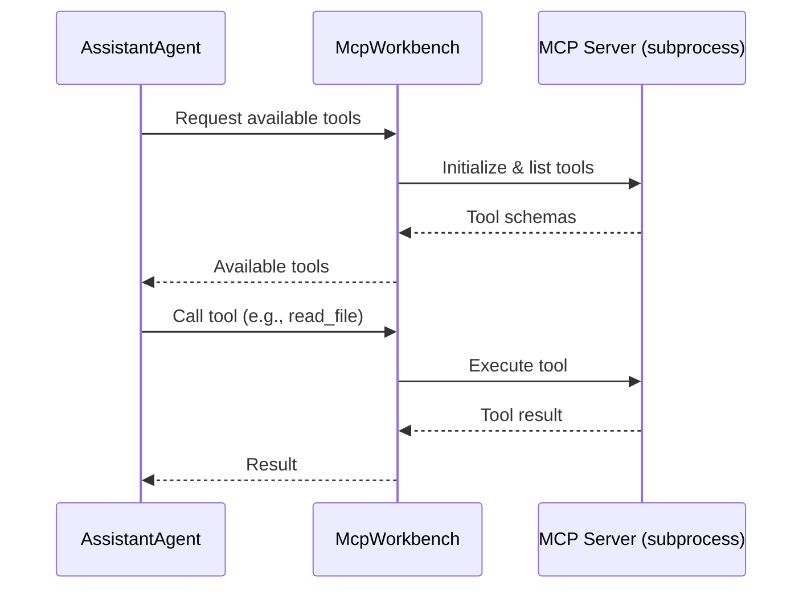
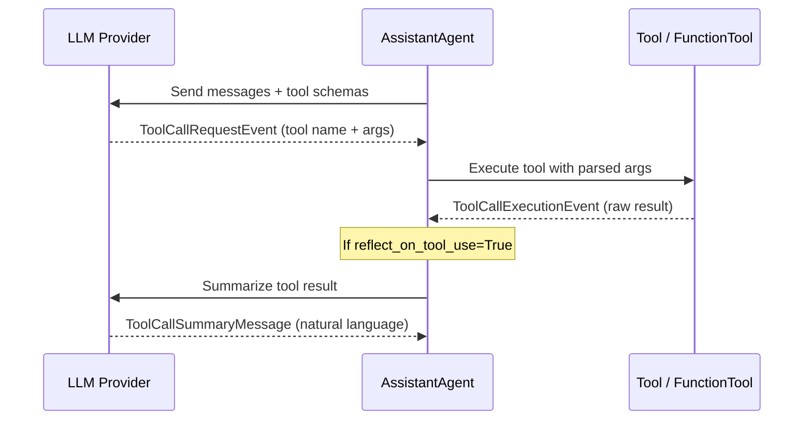

# Tools and Function Calling

## Introduction

Large language models can reason and generate text, but they can't browse the web, query databases, or call external APIs on their own. **Tools** bridge that gap. They give our agents the ability to *act* — to reach out beyond the model's training data and interact with the real world.

AutoGen AgentChat provides a rich, layered tools system. At its simplest, we pass a Python function to an agent and AutoGen handles the rest — schema generation, invocation, result parsing. At its most advanced, we connect to external MCP servers, wrap entire agents as tools for other agents, and orchestrate multi-round tool usage with fine-grained control.

In this lesson, we'll work through every layer of AutoGen's tool system, from basic function wrapping to nested agent-as-a-tool patterns.

### What we'll cover

- Wrapping Python functions with `FunctionTool` and auto-wrapping
- Building advanced tools by subclassing `BaseTool`
- Sharing state across tools with `Workbench`
- Connecting to MCP servers with `McpWorkbench`
- Wrapping agents and teams as tools (`AgentTool`, `TeamTool`)
- Controlling tool execution: parallel calls, iterations, and reflection
- Understanding the tool message flow

### Prerequisites

- Completed [AgentChat High-Level API](./02-agentchat-high-level-api.md) — you should be comfortable creating an `AssistantAgent` and running it
- Python 3.10+ with `autogen-agentchat` and `autogen-ext[openai]` installed
- An OpenAI API key set as `OPENAI_API_KEY`
- Familiarity with Python type hints and async/await

```bash
pip install autogen-agentchat autogen-ext[openai]
```

---

## FunctionTool Basics

The fastest way to give an agent a capability is to write a plain Python function and pass it to the agent's `tools` parameter. AutoGen **auto-wraps** any callable into a `FunctionTool`, generating the JSON schema that the LLM needs from the function's type hints and docstring.

### Auto-wrapping a function

```python
import asyncio
from autogen_agentchat.agents import AssistantAgent
from autogen_ext.models.openai import OpenAIChatCompletionClient


def get_weather(city: str) -> str:
    """Get the current weather for a city.

    Args:
        city: The name of the city to check weather for.
    """
    # In production, call a real weather API here
    weather_data = {
        "London": "Cloudy, 12°C",
        "Tokyo": "Sunny, 24°C",
        "New York": "Rainy, 8°C",
    }
    return weather_data.get(city, f"No weather data available for {city}")


model_client = OpenAIChatCompletionClient(model="gpt-4o")

agent = AssistantAgent(
    name="weather_agent",
    model_client=model_client,
    tools=[get_weather],  # Auto-wrapped as FunctionTool
    system_message="You are a helpful weather assistant. Use the get_weather tool to answer questions.",
)


async def main():
    result = await agent.run(task="What's the weather in Tokyo?")
    print(result.messages[-1].content)


asyncio.run(main())
```

**Output:**
```
The weather in Tokyo is currently sunny with a temperature of 24°C.
```

Behind the scenes, AutoGen:

1. Inspects `get_weather`'s type hints (`city: str`) and docstring
2. Generates a JSON schema describing the function's parameters
3. Sends that schema to the LLM as an available tool
4. When the LLM calls the tool, AutoGen invokes `get_weather()` with the parsed arguments
5. Returns the result to the LLM for final response generation

> **Key insight:** Your function's **type hints** become the tool's parameter schema, and the **docstring** becomes the tool's description. Both are essential — without them, the LLM won't know what your tool does or what arguments it expects.

### Explicit FunctionTool creation

If we need more control — for example, to override the tool name or description — we can create a `FunctionTool` explicitly:

```python
from autogen_agentchat.tools import FunctionTool


def search_database(query: str, limit: int = 10) -> str:
    """Search the product database.

    Args:
        query: The search query string.
        limit: Maximum number of results to return.
    """
    return f"Found 3 products matching '{query}' (limit: {limit})"


search_tool = FunctionTool(
    func=search_database,
    name="product_search",           # Override the default name
    description="Search the product catalog by keyword",  # Override the docstring
)

agent = AssistantAgent(
    name="shop_assistant",
    model_client=model_client,
    tools=[search_tool],
)
```

**Output:**
```
# No output — the agent is created and ready to use.
```

### Async functions as tools

Tools can be `async` functions. This is useful when the tool needs to make HTTP requests, query databases, or perform other I/O-bound operations:

```python
import aiohttp


async def fetch_stock_price(symbol: str) -> str:
    """Fetch the current stock price for a given ticker symbol.

    Args:
        symbol: The stock ticker symbol (e.g., AAPL, GOOGL).
    """
    # Simulated async API call
    prices = {"AAPL": 245.12, "GOOGL": 192.45, "MSFT": 458.30}
    await asyncio.sleep(0.1)  # Simulate network delay
    price = prices.get(symbol.upper())
    if price:
        return f"{symbol.upper()}: ${price:.2f}"
    return f"No price data found for {symbol}"


agent = AssistantAgent(
    name="stock_agent",
    model_client=model_client,
    tools=[fetch_stock_price],  # Async function — works the same way
)
```

**Output:**
```
# No output — async tools are auto-wrapped identically to sync tools.
```

### Type hint to schema mapping

AutoGen converts Python type hints into JSON schema types that the LLM understands. Here's how common types map:

| Python Type | JSON Schema Type | Example |
|---|---|---|
| `str` | `string` | `query: str` |
| `int` | `integer` | `limit: int` |
| `float` | `number` | `temperature: float` |
| `bool` | `boolean` | `verbose: bool` |
| `list[str]` | `array` of `string` | `tags: list[str]` |
| `Optional[str]` | `string` (nullable) | `filter: Optional[str] = None` |
| `Literal["a", "b"]` | `string` with `enum` | `mode: Literal["fast", "slow"]` |

> ⚠️ **Pitfall:** If you forget type hints, AutoGen can't generate the schema and the LLM won't know how to call your tool. Always annotate every parameter.

---

## Advanced Tools with BaseTool

When a simple function isn't enough — for instance, when we need to validate inputs, maintain internal state, or compose multiple operations — we subclass `BaseTool` for full control.

```python
from typing import Any
from pydantic import BaseModel, Field
from autogen_agentchat.tools import BaseTool


class CalculatorArgs(BaseModel):
    """Arguments for the calculator tool."""
    expression: str = Field(description="A mathematical expression to evaluate (e.g., '2 + 3 * 4')")


class CalculatorTool(BaseTool):
    """A safe calculator that evaluates mathematical expressions."""

    def __init__(self):
        super().__init__(
            args_type=CalculatorArgs,
            return_type=str,
            name="calculator",
            description="Evaluate a mathematical expression safely.",
        )
        self._call_count = 0  # Track internal state

    async def run(self, args: CalculatorArgs, cancellation_token: Any = None) -> str:
        self._call_count += 1
        try:
            # Restrict to safe math operations
            allowed_chars = set("0123456789+-*/.() ")
            if not all(c in allowed_chars for c in args.expression):
                return "Error: Expression contains invalid characters."
            result = eval(args.expression)  # Safe due to character restriction
            return f"{args.expression} = {result} (call #{self._call_count})"
        except Exception as e:
            return f"Error evaluating '{args.expression}': {e}"


calc_tool = CalculatorTool()

agent = AssistantAgent(
    name="math_agent",
    model_client=model_client,
    tools=[calc_tool],
    system_message="Use the calculator tool for any math. Do not calculate yourself.",
)


async def main():
    result = await agent.run(task="What is 15 * 37 + 42?")
    print(result.messages[-1].content)


asyncio.run(main())
```

**Output:**
```
15 * 37 + 42 = 597 (call #1). The answer is 597.
```

The `BaseTool` approach gives us:

- **Input validation** via Pydantic models with `Field` descriptions
- **Internal state** (like `_call_count`) that persists across calls
- **Custom logic** in the `run()` method with full error handling
- **Async execution** — the `run()` method is always `async`

---

## Workbench for Shared State

When multiple tools need access to the same resources — a database connection, a session token, a shared cache — `Workbench` provides a container that manages shared state and lifecycle.

```python
from autogen_agentchat.tools import Workbench, BaseTool
from pydantic import BaseModel, Field
from typing import Any


class NoteStore:
    """Shared state: an in-memory note store."""
    def __init__(self):
        self.notes: list[str] = []


class AddNoteArgs(BaseModel):
    content: str = Field(description="The note content to save")

class ListNotesArgs(BaseModel):
    pass  # No arguments needed


class AddNoteTool(BaseTool):
    def __init__(self, store: NoteStore):
        super().__init__(
            args_type=AddNoteArgs,
            return_type=str,
            name="add_note",
            description="Save a new note.",
        )
        self._store = store

    async def run(self, args: AddNoteArgs, cancellation_token: Any = None) -> str:
        self._store.notes.append(args.content)
        return f"Note saved. Total notes: {len(self._store.notes)}"


class ListNotesTool(BaseTool):
    def __init__(self, store: NoteStore):
        super().__init__(
            args_type=ListNotesArgs,
            return_type=str,
            name="list_notes",
            description="List all saved notes.",
        )
        self._store = store

    async def run(self, args: ListNotesArgs, cancellation_token: Any = None) -> str:
        if not self._store.notes:
            return "No notes saved yet."
        return "\n".join(f"- {note}" for note in self._store.notes)


# Create shared state and tools
store = NoteStore()
add_tool = AddNoteTool(store)
list_tool = ListNotesTool(store)

agent = AssistantAgent(
    name="notes_agent",
    model_client=model_client,
    tools=[add_tool, list_tool],
    system_message="You manage notes. Use add_note to save and list_notes to retrieve.",
)
```

**Output:**
```
# No output — both tools share the same NoteStore instance.
```

Both tools read and write to the same `NoteStore` instance, so the agent can add a note in one tool call and retrieve it in the next — without any external storage.

> **Tip:** For production use, replace the in-memory store with a database-backed implementation. The pattern stays the same — the `Workbench` manages the connection lifecycle.

---

## MCP Integration with McpWorkbench

The **Model Context Protocol (MCP)** is an open standard for connecting AI agents to external tools and data sources. AutoGen's `McpWorkbench` lets us connect to any MCP server and expose its tools to our agents — no manual wrapping required.

### Setting up an MCP connection

```python
import asyncio
from autogen_agentchat.agents import AssistantAgent
from autogen_ext.models.openai import OpenAIChatCompletionClient
from autogen_ext.tools.mcp import McpWorkbench, StdioServerParams

# Define the MCP server to connect to
server_params = StdioServerParams(
    command="npx",
    args=["-y", "@modelcontextprotocol/server-filesystem", "/tmp/workspace"],
)

model_client = OpenAIChatCompletionClient(model="gpt-4o")


async def main():
    # McpWorkbench manages the MCP server lifecycle
    async with McpWorkbench(server_params=server_params) as workbench:
        agent = AssistantAgent(
            name="file_agent",
            model_client=model_client,
            workbench=workbench,  # Pass workbench, not tools
        )

        result = await agent.run(task="List the files in the workspace directory.")
        print(result.messages[-1].content)


asyncio.run(main())
```

**Output:**
```
The workspace directory contains the following files:
- report.txt
- data.csv
- notes.md
```

> ⚠️ **Important:** `McpWorkbench` requires `autogen-ext[mcp]` to be installed:
> ```bash
> pip install "autogen-ext[mcp]"
> ```

### How McpWorkbench works



The `McpWorkbench`:

1. **Launches** the MCP server as a subprocess using the provided command
2. **Discovers** available tools via the MCP protocol
3. **Translates** MCP tool schemas to AutoGen-compatible tool definitions
4. **Routes** tool calls from the agent to the MCP server
5. **Cleans up** the subprocess when the `async with` block exits

### Multiple MCP servers

We can connect to multiple MCP servers by creating separate `McpWorkbench` instances and combining their tools:

```python
filesystem_params = StdioServerParams(
    command="npx",
    args=["-y", "@modelcontextprotocol/server-filesystem", "/tmp"],
)

fetch_params = StdioServerParams(
    command="npx",
    args=["-y", "@modelcontextprotocol/server-fetch"],
)

async def main():
    async with McpWorkbench(server_params=filesystem_params) as fs_bench:
        async with McpWorkbench(server_params=fetch_params) as fetch_bench:
            # Get tools from both workbenches
            fs_tools = await fs_bench.list_tools()
            fetch_tools = await fetch_bench.list_tools()

            agent = AssistantAgent(
                name="multi_tool_agent",
                model_client=model_client,
                tools=[*fs_tools, *fetch_tools],
            )

            result = await agent.run(task="Fetch example.com and save it to /tmp/page.html")
            print(result.messages[-1].content)
```

**Output:**
```
I fetched the content from example.com and saved it to /tmp/page.html.
```

---

## Agent as a Tool (AgentTool)

One of AutoGen's most powerful patterns is wrapping an agent *as a tool* for another agent. This creates a **model-driven multi-agent** architecture — the outer agent decides *when* to call the inner agent based on the task, rather than following a fixed orchestration pattern.

```python
import asyncio
from autogen_agentchat.agents import AssistantAgent
from autogen_agentchat.tools import AgentTool
from autogen_ext.models.openai import OpenAIChatCompletionClient

model_client = OpenAIChatCompletionClient(model="gpt-4o")

# Inner agent: a specialist
researcher = AssistantAgent(
    name="researcher",
    model_client=model_client,
    system_message=(
        "You are a research specialist. When asked a question, provide a detailed, "
        "well-structured answer with key facts and figures."
    ),
)

# Wrap the researcher as a tool
researcher_tool = AgentTool(
    agent=researcher,
    name="research",
    description="Delegate a research question to a specialist who provides detailed answers.",
)

# Outer agent: a coordinator that can use the researcher
coordinator = AssistantAgent(
    name="coordinator",
    model_client=model_client,
    tools=[researcher_tool],
    parallel_tool_calls=False,  # Required for AgentTool
    system_message=(
        "You are a project coordinator. Use the research tool to gather information "
        "when needed, then synthesize it into a brief executive summary."
    ),
)


async def main():
    result = await coordinator.run(
        task="I need a brief on the current state of quantum computing."
    )
    print(result.messages[-1].content)


asyncio.run(main())
```

**Output:**
```
**Executive Summary: Quantum Computing (2026)**

Based on the research, here are the key takeaways:
- Quantum processors have surpassed 1,000 qubits...
- Error correction has improved significantly...
- Key players include IBM, Google, and emerging startups...
```

> ⚠️ **Critical:** Always set `parallel_tool_calls=False` when using `AgentTool`. The inner agent requires sequential execution — parallel calls can cause race conditions and corrupted state.

### TeamTool: wrapping entire teams

The same pattern extends to entire teams. `TeamTool` wraps a multi-agent team as a single tool:

```python
from autogen_agentchat.teams import RoundRobinGroupChat
from autogen_agentchat.conditions import TextMentionTermination
from autogen_agentchat.tools import TeamTool

# Build a research team
analyst = AssistantAgent(name="analyst", model_client=model_client,
    system_message="You analyze data and provide insights.")
writer = AssistantAgent(name="writer", model_client=model_client,
    system_message="You write clear reports based on analysis. Say APPROVE when done.")

research_team = RoundRobinGroupChat(
    participants=[analyst, writer],
    termination_condition=TextMentionTermination("APPROVE"),
)

# Wrap the team as a tool
team_tool = TeamTool(
    team=research_team,
    name="research_team",
    description="Send a task to the research team (analyst + writer) for a full report.",
)

# Manager agent uses the team as a tool
manager = AssistantAgent(
    name="manager",
    model_client=model_client,
    tools=[team_tool],
    parallel_tool_calls=False,  # Required for TeamTool
)
```

**Output:**
```
# No output — the manager can now delegate complex tasks to the entire team.
```

### AgentTool vs. team orchestration

| Aspect | AgentTool / TeamTool | Team (e.g., RoundRobinGroupChat) |
|---|---|---|
| **Who decides** | The outer agent's LLM | The orchestration pattern |
| **When to use** | Dynamic delegation based on context | Fixed workflow pipelines |
| **Nesting** | Agents/teams are tools — composable | Teams contain agents — flat |
| **Parallel calls** | Must be disabled | N/A — managed by team |
| **Best for** | Coordinator patterns, conditional routing | Structured multi-turn dialogues |

---

## Controlling Tool Behavior

AutoGen provides three key parameters on `AssistantAgent` that control how tools are used during execution.

### parallel_tool_calls

By default, `AssistantAgent` allows the LLM to call **multiple tools in parallel** within a single turn. This speeds up execution when tools are independent:

```python
agent = AssistantAgent(
    name="assistant",
    model_client=model_client,
    tools=[get_weather, fetch_stock_price],
    parallel_tool_calls=True,  # Default — multiple tools in one turn
)
```

Set it to `False` when tools have dependencies or side effects:

```python
agent = AssistantAgent(
    name="assistant",
    model_client=model_client,
    tools=[researcher_tool],
    parallel_tool_calls=False,  # Sequential — one tool at a time
)
```

### max_tool_iterations

Controls how many **tool-call rounds** the agent can perform before stopping. Each round is one cycle of "LLM decides → tool executes → result returns." The default is `20`.

```python
agent = AssistantAgent(
    name="focused_agent",
    model_client=model_client,
    tools=[get_weather],
    max_tool_iterations=3,  # Stop after 3 rounds of tool use
)
```

**Output:**
```
# No output — the agent will stop making tool calls after 3 iterations,
# even if the LLM wants to call more.
```

> **Tip:** Lower `max_tool_iterations` for simple tasks to prevent runaway agents. Raise it for complex multi-step tasks where the agent needs many tool calls.

### reflect_on_tool_use

When set to `True`, the agent makes an **additional LLM call** after tool execution to summarize the raw tool output in natural language. When `False` (default), the raw tool output is returned directly.

```python
# Without reflection — raw tool output
agent_raw = AssistantAgent(
    name="raw_agent",
    model_client=model_client,
    tools=[get_weather],
    reflect_on_tool_use=False,  # Default
)

# With reflection — summarized output
agent_reflect = AssistantAgent(
    name="reflecting_agent",
    model_client=model_client,
    tools=[get_weather],
    reflect_on_tool_use=True,
)
```

| Setting | Output for "Weather in Tokyo?" |
|---|---|
| `reflect_on_tool_use=False` | `Sunny, 24°C` |
| `reflect_on_tool_use=True` | `The weather in Tokyo is currently sunny with a pleasant temperature of 24°C — great for outdoor activities!` |

> **Trade-off:** Reflection produces more user-friendly output but costs an extra LLM call per tool round. Use it for user-facing agents; skip it for agent-to-agent communication where raw data is preferred.

### Summary of control parameters

| Parameter | Default | Purpose |
|---|---|---|
| `parallel_tool_calls` | `True` | Allow multiple tools in one LLM turn |
| `max_tool_iterations` | `20` | Max tool-call rounds before stopping |
| `reflect_on_tool_use` | `False` | Summarize tool output via extra LLM call |

---

## Tool Message Flow

Understanding the message types that flow through the system during tool execution helps us debug and build custom logic around tool calls. Every tool interaction produces three events in sequence.



### The three message types

| Message Type | When | Contains |
|---|---|---|
| `ToolCallRequestEvent` | LLM decides to call a tool | Tool name, arguments, call ID |
| `ToolCallExecutionEvent` | Tool finishes executing | Raw result string, call ID |
| `ToolCallSummaryMessage` | After tool execution completes | Summary (raw or reflected) |

### Inspecting tool messages

We can examine the full message flow by iterating over the result's messages:

```python
import asyncio
from autogen_agentchat.agents import AssistantAgent
from autogen_ext.models.openai import OpenAIChatCompletionClient


def convert_temperature(celsius: float) -> str:
    """Convert a temperature from Celsius to Fahrenheit.

    Args:
        celsius: Temperature in degrees Celsius.
    """
    fahrenheit = (celsius * 9 / 5) + 32
    return f"{celsius}°C = {fahrenheit}°F"


model_client = OpenAIChatCompletionClient(model="gpt-4o")

agent = AssistantAgent(
    name="temp_agent",
    model_client=model_client,
    tools=[convert_temperature],
    reflect_on_tool_use=False,
)


async def main():
    result = await agent.run(task="Convert 25 degrees Celsius to Fahrenheit.")
    for msg in result.messages:
        print(f"[{type(msg).__name__}] source={msg.source}")
        print(f"  content={msg.content}\n")


asyncio.run(main())
```

**Output:**
```
[TextMessage] source=user
  content=Convert 25 degrees Celsius to Fahrenheit.

[ToolCallRequestEvent] source=temp_agent
  content=[FunctionCall(id='call_abc123', name='convert_temperature', arguments='{"celsius": 25.0}')]

[ToolCallExecutionEvent] source=temp_agent
  content=[FunctionExecutionResult(call_id='call_abc123', content='25.0°C = 77.0°F')]

[ToolCallSummaryMessage] source=temp_agent
  content=25.0°C = 77.0°F
```

This visibility is invaluable for debugging. If a tool isn't being called, check the `ToolCallRequestEvent`. If it's returning unexpected data, examine the `ToolCallExecutionEvent`.

---

## Best Practices

1. **Always add type hints and docstrings.** The LLM relies on the generated schema to understand your tools. Vague or missing descriptions lead to incorrect tool calls.

2. **Keep tools focused.** One tool should do one thing. Instead of a `do_everything(action: str, ...)` mega-tool, create separate `search()`, `create()`, `delete()` tools.

3. **Return strings from tools.** The LLM consumes tool results as text. Return human-readable strings, not raw objects or data structures.

4. **Handle errors gracefully.** Return error messages as strings rather than raising exceptions. The LLM can reason about `"Error: City not found"` but can't recover from an unhandled `KeyError`.

5. **Use `reflect_on_tool_use` for user-facing agents.** Raw tool output (like JSON payloads) confuses users. Reflection turns it into natural language.

6. **Set `max_tool_iterations` for safety.** Prevent runaway loops where an agent keeps calling tools without converging on an answer.

7. **Prefer async tools for I/O.** Network calls, file operations, and database queries should be `async` to avoid blocking the event loop.

---

## Common Pitfalls

| Pitfall | Symptom | Fix |
|---|---|---|
| Missing type hints | LLM never calls the tool | Add type annotations to every parameter |
| No docstring | LLM doesn't understand when to use the tool | Add a clear docstring describing the tool's purpose |
| `parallel_tool_calls=True` with `AgentTool` | Race conditions, corrupted state | Set `parallel_tool_calls=False` |
| Tool returns a `dict` | LLM receives `{'key': 'value'}` as a string | Return a formatted string instead |
| Unhandled exceptions in tools | Agent crashes mid-execution | Wrap tool logic in try/except, return error strings |
| Too many tools on one agent | LLM gets confused about which tool to use | Limit to 5-10 tools per agent; use `AgentTool` to delegate |
| Forgetting `async with` for `McpWorkbench` | Resource leaks, zombie subprocesses | Always use the async context manager pattern |

---

## Hands-On Exercise

Build a **research assistant** that uses three tools:

1. **`web_search(query: str) -> str`** — Simulates a web search (return mock results)
2. **`save_finding(topic: str, finding: str) -> str`** — Saves a research finding to a shared list
3. **`get_findings() -> str`** — Returns all saved findings

**Requirements:**
- Use a shared state object so `save_finding` and `get_findings` access the same list
- Set `reflect_on_tool_use=True` so the agent provides natural language summaries
- Set `max_tool_iterations=5` to keep the agent focused
- Ask the agent: *"Research the benefits of solar energy. Search for information, save 3 key findings, then list them all."*

**Stretch goal:** Wrap your research assistant as an `AgentTool` for a coordinator agent that decides whether to use research or answer directly from its own knowledge.

<details>
<summary>Solution outline</summary>

```python
import asyncio
from autogen_agentchat.agents import AssistantAgent
from autogen_agentchat.tools import AgentTool
from autogen_ext.models.openai import OpenAIChatCompletionClient

# Shared state
findings: list[str] = []


def web_search(query: str) -> str:
    """Search the web for information on a topic.

    Args:
        query: The search query.
    """
    return f"Search results for '{query}': Solar energy reduces carbon emissions by 80%, costs have dropped 90% since 2010, and solar panels last 25-30 years."


def save_finding(topic: str, finding: str) -> str:
    """Save a research finding.

    Args:
        topic: The topic category.
        finding: The finding to save.
    """
    findings.append(f"[{topic}] {finding}")
    return f"Saved finding #{len(findings)}: {finding}"


def get_findings() -> str:
    """Retrieve all saved research findings."""
    if not findings:
        return "No findings saved yet."
    return "\n".join(f"{i+1}. {f}" for i, f in enumerate(findings))


model_client = OpenAIChatCompletionClient(model="gpt-4o")

research_agent = AssistantAgent(
    name="researcher",
    model_client=model_client,
    tools=[web_search, save_finding, get_findings],
    reflect_on_tool_use=True,
    max_tool_iterations=5,
    system_message="You are a research assistant. Search for info, save key findings, and report them.",
)

# Stretch: wrap as AgentTool
research_tool = AgentTool(agent=research_agent, name="research",
    description="Delegate a research task to a specialist.")
coordinator = AssistantAgent(
    name="coordinator",
    model_client=model_client,
    tools=[research_tool],
    parallel_tool_calls=False,
)


async def main():
    result = await coordinator.run(
        task="Research the benefits of solar energy. Save 3 key findings, then list them."
    )
    print(result.messages[-1].content)

asyncio.run(main())
```

</details>

---

## Summary

We've explored AutoGen's complete tool system, from simple function wrapping to advanced multi-agent tool patterns:

- **`FunctionTool`** auto-wraps Python functions using type hints and docstrings for schema generation
- **`BaseTool`** subclassing gives us full control with Pydantic validation and internal state
- **`Workbench`** enables shared state across multiple tools
- **`McpWorkbench`** connects to external MCP servers, bringing in tools from the broader ecosystem
- **`AgentTool`** and **`TeamTool`** let us compose agents and teams as tools — enabling model-driven, hierarchical multi-agent architectures
- Control parameters (`parallel_tool_calls`, `max_tool_iterations`, `reflect_on_tool_use`) fine-tune how agents use tools
- The message flow (`ToolCallRequestEvent` → `ToolCallExecutionEvent` → `ToolCallSummaryMessage`) provides full observability into tool execution

Tools are what transform an LLM from a text generator into an agent that *acts*. In the next lesson, we'll see how to combine multiple tool-equipped agents into teams with structured orchestration patterns.

**Next:** [Team Orchestration Patterns](./04-team-orchestration-patterns.md)

---

## Further Reading

- 📖 [AutoGen Tools Tutorial](https://microsoft.github.io/autogen/stable/user-guide/agentchat-user-guide/tutorial/tools.html) — Official tools guide
- 📖 [AutoGen Custom Agents Guide](https://microsoft.github.io/autogen/stable/user-guide/agentchat-user-guide/tutorial/custom-agents.html) — Building custom agents with tools
- 📖 [MCP Specification](https://modelcontextprotocol.io/) — Model Context Protocol documentation
- 📖 [AutoGen AgentTool API Reference](https://microsoft.github.io/autogen/stable/reference/python/autogen_agentchat/autogen_agentchat.tools.html) — Full API reference for tool classes

[Back to AutoGen AgentChat Overview](./00-autogen-agentchat.md)

<!--
Sources Consulted:
- AutoGen AgentChat Tools Tutorial: https://microsoft.github.io/autogen/stable/user-guide/agentchat-user-guide/tutorial/tools.html
- AutoGen AgentChat API Reference (tools): https://microsoft.github.io/autogen/stable/reference/python/autogen_agentchat/autogen_agentchat.tools.html
- AutoGen MCP Integration: https://microsoft.github.io/autogen/stable/user-guide/extensions-user-guide/mcp-tools.html
- Model Context Protocol: https://modelcontextprotocol.io/
-->
