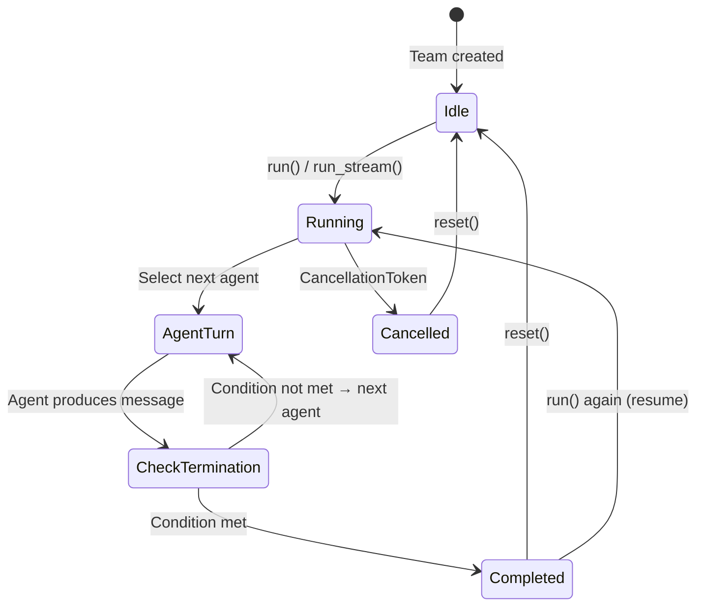
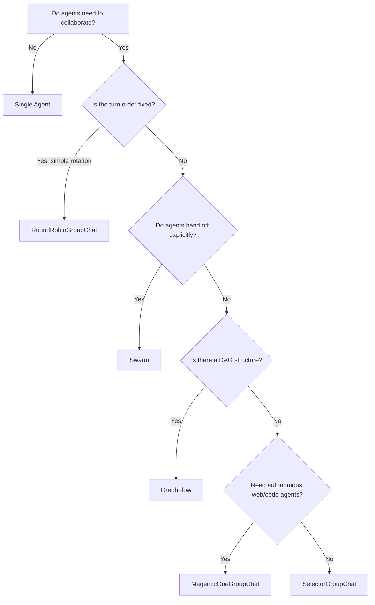

# Team Orchestration Patterns

## Introduction

A single agent with the right tools can accomplish a lot — but some tasks demand *collaboration*. A writer needs a reviewer. A researcher needs a fact-checker. A planner needs an executor. In AutoGen AgentChat, we organize collaborating agents into **teams**: coordinated groups that pass messages, take turns, and converge on results together.

Teams are the core multi-agent primitive in AutoGen. They implement the same `run()` and `run_stream()` interface that individual agents do, so we can compose them, nest them, and swap them into any workflow that expects an agent. In this lesson, we'll learn how to create teams, orchestrate agent turns, control the team lifecycle, and choose the right team preset for our use case.

### What we'll cover

- The team concept and when to use multi-agent collaboration
- Building a `RoundRobinGroupChat` with a writer-reviewer pair
- Running teams with `run()`, `run_stream()`, and the `Console` helper
- Team lifecycle operations: resetting, stopping, resuming, and aborting
- Wrapping a single agent in a team for tool-loop control
- Comparing all five built-in team presets

### Prerequisites

- Completed [Tools and Function Calling](./03-tools-and-function-calling.md) — you should be comfortable creating agents with tools
- Python 3.10+ with `autogen-agentchat` and `autogen-ext[openai]` installed
- An OpenAI API key set as `OPENAI_API_KEY`
- Familiarity with Python `asyncio` and async/await

```bash
pip install -U autogen-agentchat autogen-ext[openai]
```

---

## Understanding Teams in AutoGen

### What is a team?

A **team** is a group of agents that work together on a shared task. When we call `team.run(task="...")`, the team distributes the task to its agents, coordinates their turns according to a specific pattern, and collects their responses until a **termination condition** is met.

Every team in AgentChat implements the `TaskRunner` protocol, which means it exposes:

- **`run(task)`** — run the team to completion and return a `TaskResult`
- **`run_stream(task)`** — run the team and yield messages as they're produced

This is the exact same interface that individual agents expose. That uniformity is powerful: we can pass a team anywhere we'd pass an agent, including as a tool for another agent.

### When to use a team

We don't always need a team. Here's a simple decision framework:

| Scenario | Recommendation |
|----------|---------------|
| Single task, one skill set needed | Single agent |
| Task needs iteration (draft → review → revise) | Team with 2–3 agents |
| Task needs multiple distinct skills | Team with specialized agents |
| Tool-calling loop that needs a stop condition | Single-agent team |
| Complex workflow with conditional branching | GraphFlow team |

**Start with a single agent.** Add a team only when we find that one agent can't produce the quality we need, or when the task naturally decomposes into distinct roles.

### Team architecture

The following diagram shows how a team coordinates agents through its lifecycle:



Teams are **stateful**. After a run completes, agents retain their conversation history. We can resume from where we left off, or call `reset()` to start fresh.

---

## RoundRobinGroupChat

`RoundRobinGroupChat` is the simplest team preset. Agents take turns in a fixed, round-robin order — agent 1 speaks, then agent 2, then agent 1 again, and so on until a termination condition is met.

This pattern is ideal for **iterative refinement** workflows: a writer drafts, a reviewer critiques, the writer revises, and the cycle continues.

### Basic setup

```python
import asyncio
from autogen_agentchat.agents import AssistantAgent
from autogen_agentchat.teams import RoundRobinGroupChat
from autogen_agentchat.conditions import MaxMessageTermination
from autogen_ext.models.openai import OpenAIChatCompletionClient

model_client = OpenAIChatCompletionClient(model="gpt-4o")

# Define two agents with distinct roles
writer_agent = AssistantAgent(
    name="writer",
    model_client=model_client,
    system_message=(
        "You are a creative writer. Write concise, engaging content. "
        "When you receive feedback, revise your work accordingly."
    ),
)

reviewer_agent = AssistantAgent(
    name="reviewer",
    model_client=model_client,
    system_message=(
        "You are an editorial reviewer. Provide specific, constructive feedback "
        "on the writing you receive. Focus on clarity, tone, and impact."
    ),
)

# Create the team
team = RoundRobinGroupChat(
    participants=[writer_agent, reviewer_agent],
    termination_condition=MaxMessageTermination(6),
)


async def main():
    result = await team.run(task="Write a two-sentence tagline for a Python AI course.")
    for msg in result.messages:
        print(f"[{msg.source}]: {msg.content[:120]}")


asyncio.run(main())
```

**Output:**
```
[user]: Write a two-sentence tagline for a Python AI course.
[writer]: Unlock the power of artificial intelligence with Python — the language that speaks fluently to machines. From your
[reviewer]: This is a strong start with a nice metaphorical hook. Two suggestions: (1) tighten "speaks fluently to machines
[writer]: Unlock AI with the language machines understand best — Python. From your first line of code to production-ready mo
[reviewer]: Excellent revision — much tighter and more punchy. The parallel structure works well. I'd suggest "first script"
[writer]: Unlock AI with the language machines understand best — Python. From your first script to production-ready models, 
```

The team automatically rotates through writer → reviewer → writer → reviewer until 6 total messages have been produced (including the initial task message).

### How it works

1. We pass a list of `participants` — the agents, in the order we want them to speak.
2. We set a `termination_condition` that tells the team when to stop. Without one, the team would run indefinitely.
3. The team cycles through agents in the order they appear in the list.

---

## Running and Observing Teams

### `run()` — synchronous-style execution

`team.run(task=...)` runs the team to completion and returns a `TaskResult` object:

```python
result = await team.run(task="Summarize quantum computing in one paragraph.")

# TaskResult fields
print(type(result))                # <class 'autogen_agentchat.base.TaskResult'>
print(len(result.messages))        # Number of messages exchanged
print(result.stop_reason)          # Why the team stopped (e.g., "Maximum number of messages 6 reached")
```

**Output:**
```
<class 'autogen_agentchat.base.TaskResult'>
6
Maximum number of messages 6 reached, current message count: 6
```

The `TaskResult.messages` list contains every message produced during the run, in chronological order. Each message has a `.source` (agent name) and `.content` (the text).

### `run_stream()` — streaming execution

For long-running teams, we want to see messages as they arrive rather than waiting for the entire run to finish:

```python
async def main():
    async for message in team.run_stream(task="Explain recursion simply."):
        if hasattr(message, "source"):
            print(f"[{message.source}]: {message.content[:100]}")
        else:
            # Final item is a TaskResult
            print(f"\nDone — stop reason: {message.stop_reason}")


asyncio.run(main())
```

**Output:**
```
[user]: Explain recursion simply.
[writer]: Recursion is when a function calls itself to solve a smaller piece of the same problem. Think of
[reviewer]: Clear and accessible explanation. The Russian nesting doll analogy is effective. Suggestion: a

Done — stop reason: Maximum number of messages 6 reached, current message count: 6
```

The stream yields individual `ChatMessage` objects as each agent finishes its turn. The **final item** in the stream is the `TaskResult`, which we can detect by checking for the `stop_reason` attribute.

### Console helper

AutoGen provides a `Console` utility that formats streamed output with timing and token usage statistics — perfect for development and debugging:

```python
from autogen_agentchat.ui import Console

async def main():
    await team.reset()  # Clear state from previous runs
    result = await Console(
        team.run_stream(task="Write a haiku about machine learning.")
    )
    print(f"\nTotal messages: {len(result.messages)}")


asyncio.run(main())
```

**Output:**
```
---------- user ----------
Write a haiku about machine learning.
---------- writer ----------
Silicon neurons
Learning patterns in the noise
Wisdom from the data
---------- reviewer ----------
Beautiful imagery in "silicon neurons." However, the last line has 6 syllables 
instead of the required 5. Consider: "Wisdom born of data."
---------- writer ----------
Silicon neurons
Learning patterns in the noise
Wisdom born of data
---------- reviewer ----------
Perfect — all three lines now follow the 5-7-5 syllable structure. The imagery 
is vivid and the progression from mechanism to insight is elegant. Approved.
---------- Summary ----------
Number of messages: 6
Finish reason: Maximum number of messages 6 reached, current message count: 6
Total prompt tokens: 1842
Total completion tokens: 287
Duration: 8.34 seconds

Total messages: 6
```

The `Console` function wraps `run_stream()`, prints each message with formatted headers, and appends a summary block showing token usage and wall-clock duration. It returns the same `TaskResult` that `run()` would.

---

## Team Lifecycle Operations

Teams are stateful — agents remember previous messages across runs. AutoGen gives us four lifecycle operations to control this behavior.

### Resetting a team

After a run, agents retain their conversation history. If we want to start fresh with no memory of prior interactions, we call `reset()`:

```python
async def main():
    # First run
    result1 = await team.run(task="Write a limerick about Python.")
    print(f"Run 1: {len(result1.messages)} messages")

    # Reset clears all agent state
    await team.reset()

    # Second run starts from scratch
    result2 = await team.run(task="Write a limerick about JavaScript.")
    print(f"Run 2: {len(result2.messages)} messages")


asyncio.run(main())
```

**Output:**
```
Run 1: 6 messages
Run 2: 6 messages
```

Without `reset()`, the second run would include the conversation history from the first run, and agents might reference the earlier limerick.

### Stopping a team externally

Sometimes we need to stop a team from *outside* the team — for instance, when a user clicks "Stop" in a UI. `ExternalTermination` provides this capability:

```python
import asyncio
from autogen_agentchat.conditions import ExternalTermination, MaxMessageTermination

external = ExternalTermination()
termination = external | MaxMessageTermination(20)

team = RoundRobinGroupChat(
    participants=[writer_agent, reviewer_agent],
    termination_condition=termination,
)


async def run_team():
    result = await team.run(task="Write a detailed essay on climate change.")
    print(f"Stopped: {result.stop_reason}")


async def stop_after_delay():
    await asyncio.sleep(5)
    external.set()  # Signal the team to stop


async def main():
    await asyncio.gather(run_team(), stop_after_delay())


asyncio.run(main())
```

**Output:**
```
Stopped: External termination requested
```

Key points:

- We combine termination conditions with the `|` (OR) operator — the team stops when *either* condition is met.
- We can also combine with `&` (AND) — the team stops only when *both* conditions are met.
- `external.set()` can be called from any coroutine, a UI callback, or a signal handler.

### Resuming a team

Because teams are stateful, we can **resume** a completed run by calling `run()` or `run_stream()` again *without* a task:

```python
async def main():
    # Initial run
    result1 = await team.run(task="Write a product description for smart glasses.")
    print(f"Run 1 ended: {result1.stop_reason}")
    print(f"Last message: [{result1.messages[-1].source}]\n")

    # Resume — no task argument, continues from previous state
    result2 = await team.run()
    print(f"Run 2 ended: {result2.stop_reason}")
    print(f"Total messages across both runs: "
          f"{len(result1.messages) + len(result2.messages)}")


asyncio.run(main())
```

**Output:**
```
Run 1 ended: Maximum number of messages 6 reached, current message count: 6
Last message: [reviewer]

Run 2 ended: Maximum number of messages 6 reached, current message count: 6
Total messages across both runs: 12
```

When we resume, the agents pick up exactly where they left off — they see the full conversation history and continue the rotation. This is useful for **pagination** or when we want a human to review intermediate results before continuing.

### Aborting a team

If we need to abort a run *immediately* without waiting for the current agent to finish, we use a `CancellationToken`:

```python
import asyncio
from autogen_core import CancellationToken

async def main():
    token = CancellationToken()

    async def abort_soon():
        await asyncio.sleep(2)
        token.cancel()

    asyncio.create_task(abort_soon())

    try:
        result = await team.run(
            task="Write a 10-chapter novel outline.",
            cancellation_token=token,
        )
    except asyncio.CancelledError:
        print("Team run was aborted!")


asyncio.run(main())
```

**Output:**
```
Team run was aborted!
```

The difference between stopping and aborting:

| | `ExternalTermination` | `CancellationToken` |
|---|---|---|
| **When it triggers** | After the current agent finishes its turn | Immediately |
| **Returns** | `TaskResult` with stop reason | Raises `CancelledError` |
| **Team state** | Preserved | Partially updated |
| **Use case** | Graceful stop | Emergency abort |

---

## Single-Agent Teams

It might seem odd to put a single agent in a team, but there's a practical reason: **tool-loop control**. When an agent calls tools, it enters an internal loop — call tool, get result, decide next action. Without a team wrapper, we have limited control over when that loop ends.

By wrapping a single agent in a `RoundRobinGroupChat` with a termination condition, we gain precise control over the stopping behavior:

```python
from autogen_agentchat.agents import AssistantAgent
from autogen_agentchat.teams import RoundRobinGroupChat
from autogen_agentchat.conditions import TextMessageTermination, MaxMessageTermination
from autogen_ext.models.openai import OpenAIChatCompletionClient


def lookup_order(order_id: str) -> str:
    """Look up an order by its ID."""
    orders = {
        "ORD-001": "Shipped — arriving Feb 12",
        "ORD-002": "Processing — estimated Feb 15",
    }
    return orders.get(order_id, "Order not found")


def cancel_order(order_id: str) -> str:
    """Cancel an order by its ID."""
    return f"Order {order_id} has been cancelled. Refund initiated."


model_client = OpenAIChatCompletionClient(model="gpt-4o")

support_agent = AssistantAgent(
    name="support_agent",
    model_client=model_client,
    tools=[lookup_order, cancel_order],
    system_message=(
        "You are a customer support agent. Use the available tools "
        "to help customers with their orders. When you have resolved "
        "the customer's issue, provide a final summary."
    ),
)

# Wrap in a single-agent team
# TextMessageTermination stops the loop when the agent produces
# a plain text response (i.e., it's done calling tools)
team = RoundRobinGroupChat(
    participants=[support_agent],
    termination_condition=TextMessageTermination() | MaxMessageTermination(10),
)


async def main():
    result = await team.run(task="What's the status of order ORD-001?")
    print(f"Final answer: {result.messages[-1].content}")


asyncio.run(main())
```

**Output:**
```
Final answer: Your order ORD-001 has been shipped and is estimated to arrive on 
February 12. Is there anything else I can help you with?
```

Without the team wrapper, the agent would return the raw `ToolCallResultMessage` as part of its response. The `TextMessageTermination` condition ensures the team runs until the agent produces a clean, text-only response — the final answer we want to show the user.

---

## Comparing Team Presets

AutoGen AgentChat ships with five team presets. Each implements a different orchestration strategy:

| Preset | Turn Selection | Best For | Key Feature |
|--------|---------------|----------|-------------|
| **RoundRobinGroupChat** | Fixed order, cycling through the participant list | Iterative refinement (writer/reviewer), simple pipelines | Predictable, deterministic turn order |
| **SelectorGroupChat** | LLM selects the next speaker based on conversation context | Dynamic, multi-skill tasks where the best next agent depends on the situation | Custom `selector_func` and `candidate_func` for fine-grained control |
| **Swarm** | Agents hand off to each other explicitly via `HandoffMessage` | Customer support routing, triage systems, stateful workflows | `handoffs` parameter on agents, human-in-the-loop with `HandoffTermination` |
| **MagenticOneGroupChat** | Orchestrator agent manages a ledger and delegates to specialists | Complex, open-ended tasks (web research, coding, file analysis) | Built-in WebSurfer, FileSurfer, Coder, and Executor agents |
| **GraphFlow** | DAG-defined execution order with conditional/parallel branches | Structured workflows with dependencies, pipelines with fan-out/fan-in | `DiGraphBuilder` for visual graph construction |

### Choosing the right preset



We'll cover SelectorGroupChat, Swarm, GraphFlow, and MagenticOneGroupChat in depth in their own dedicated lessons later in this unit.

---

## Best Practices

1. **Start simple.** Try a single agent first. Only introduce a team when a single agent demonstrably struggles with quality, breadth, or reliability.

2. **Keep teams small.** Two to four agents is the sweet spot. More agents mean more messages, more tokens, and more chances for confusion.

3. **Give agents distinct roles.** Each agent should have a clearly different system message and skill set. Overlapping roles lead to redundant responses.

4. **Always set a termination condition.** A team without a termination condition runs forever. Combine conditions with `|` for safety: `TextMentionTermination("APPROVE") | MaxMessageTermination(20)`.

5. **Reset between unrelated tasks.** If the next task is unrelated to the previous one, call `await team.reset()` to clear stale context from agent memory.

6. **Use `Console` during development.** The token usage and duration statistics help us identify expensive agents and optimize prompt lengths.

7. **Prefer `run_stream()` in production.** Streaming lets us show progress to users and implement timeouts without blocking.

---

## Common Pitfalls

| Pitfall | What happens | Fix |
|---------|-------------|-----|
| No termination condition | Team runs indefinitely, burning tokens | Always pass `termination_condition` |
| Forgetting to `reset()` | Agents carry over context from unrelated tasks, producing confused responses | Call `await team.reset()` between unrelated tasks |
| Agents with overlapping roles | Multiple agents say the same thing, wasting turns | Give each agent a unique, focused system message |
| Resuming after `reset()` | `run()` without a task after reset produces an empty run | Only resume (call `run()` without task) *before* calling `reset()` |
| Using `CancellationToken` for graceful stops | `CancelledError` is raised, no `TaskResult` returned | Use `ExternalTermination` for graceful stops; reserve `CancellationToken` for emergencies |
| Too many agents | Slow runs, high token cost, agents lose track of the conversation | Keep teams to 2–4 focused agents |

---

## Hands-On Exercise

Build a **code review team** with three agents:

1. **`coder`** — writes Python code based on a prompt
2. **`reviewer`** — reviews the code for bugs, style, and edge cases
3. **`tester`** — writes unit tests for the code

**Requirements:**

- Use `RoundRobinGroupChat` with the agent order: coder → reviewer → tester
- Set `MaxMessageTermination(9)` so each agent gets exactly 3 turns (including the initial task message, that's 3 full rounds)
- Use the `Console` helper to display output with token stats
- After the first run, **reset** the team and run a second, unrelated task

**Starter code:**

```python
import asyncio
from autogen_agentchat.agents import AssistantAgent
from autogen_agentchat.teams import RoundRobinGroupChat
from autogen_agentchat.conditions import MaxMessageTermination
from autogen_agentchat.ui import Console
from autogen_ext.models.openai import OpenAIChatCompletionClient

model_client = OpenAIChatCompletionClient(model="gpt-4o")

# TODO: Create coder, reviewer, and tester agents with distinct system messages

# TODO: Create a RoundRobinGroupChat team

async def main():
    # TODO: Run with Console on task "Write a Python function to check if a string is a palindrome"
    # TODO: Reset the team
    # TODO: Run a second task "Write a Python function to merge two sorted lists"
    pass

asyncio.run(main())
```

**Expected behavior:** Each round, the coder writes or revises code, the reviewer provides feedback, and the tester writes or updates tests. After reset, the second task starts with a clean slate.

---

## Summary

In this lesson, we learned how to organize agents into **teams** — AutoGen's core multi-agent primitive. We covered:

- **Teams** implement the same `run()`/`run_stream()` interface as agents, making them composable
- **`RoundRobinGroupChat`** rotates agents in a fixed order — ideal for iterative refinement workflows
- **`run()`** returns a `TaskResult`; **`run_stream()`** yields messages as they arrive; **`Console`** wraps streaming with formatted output and statistics
- **Lifecycle operations** give us full control: `reset()` clears state, `ExternalTermination` stops gracefully, resuming continues without a task, and `CancellationToken` aborts immediately
- **Single-agent teams** give us termination control over tool-calling loops
- **Five team presets** cover different orchestration needs, from simple round-robin to DAG-based workflows

The key insight is that teams are *just agents* from the outside. They accept a task, produce messages, and return a result. This uniformity means we can nest teams, use them as tools, and compose them into larger systems without changing our mental model.

**Next:** [Termination Conditions](./05-termination-conditions.md) — a deep dive into all 11 built-in termination conditions and how to build custom ones.

---

## Further Reading

- [AutoGen AgentChat Teams Documentation](https://microsoft.github.io/autogen/stable/user-guide/agentchat-user-guide/team.html)
- [AutoGen AgentChat Termination Documentation](https://microsoft.github.io/autogen/stable/user-guide/agentchat-user-guide/termination.html)
- [AutoGen API Reference — Teams](https://microsoft.github.io/autogen/stable/reference/python/autogen_agentchat/autogen_agentchat.teams.html)

[Back to AutoGen AgentChat Overview](./00-autogen-agentchat.md)

<!-- Sources:
- AutoGen AgentChat documentation: https://microsoft.github.io/autogen/stable/user-guide/agentchat-user-guide/team.html
- AutoGen GitHub repository: https://github.com/microsoft/autogen
- AutoGen v0.7.x release notes
-->
