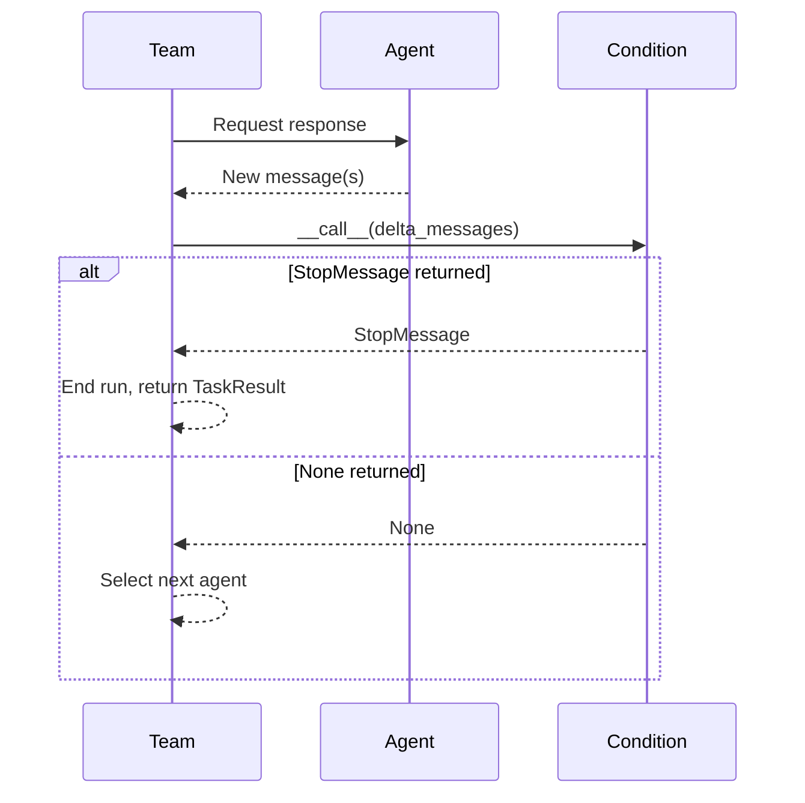

# Termination Conditions

## Introduction

Every AutoGen team runs in a loop: select an agent, get its response, check if we should stop, repeat. The "check if we should stop" step is the **termination condition** — and without one, the team runs forever, burning through tokens and API credits until we kill the process manually.

Termination conditions are the guardrails that make multi-agent systems production-safe. They tell a team *when* its work is done, whether that's because the agents reached a conclusion, hit a budget limit, or ran out of time. AutoGen AgentChat ships with 11 built-in conditions that cover the vast majority of use cases, and it provides clean abstractions for building custom ones.

In this lesson, we'll learn every termination condition available in AutoGen, how to combine them with logical operators, how to build custom conditions from scratch, and how the evaluation lifecycle works under the hood.

### What we'll cover

- Why termination conditions are essential for safe, cost-effective agent teams
- All 11 built-in termination conditions with parameters and examples
- Combining conditions with `|` (OR) and `&` (AND) operators
- Building custom termination conditions by subclassing `TerminationCondition`
- How the auto-reset and delta-evaluation lifecycle works internally

### Prerequisites

- Completed [Team Orchestration Patterns](./04-team-orchestration-patterns.md) — you should understand teams, `run()`, and `run_stream()`
- Python 3.10+ with `autogen-agentchat` and `autogen-ext[openai]` installed
- An OpenAI API key set as `OPENAI_API_KEY`
- Familiarity with Python `asyncio` and async/await

```bash
pip install -U autogen-agentchat autogen-ext[openai]
```

---

## Why Termination Conditions Matter

Consider this code:

```python
team = RoundRobinGroupChat(participants=[agent_a, agent_b])
result = await team.run(task="Discuss the weather.")
```

This team has **no termination condition**. Agent A responds, then Agent B, then Agent A again — endlessly. Every turn costs tokens. Every token costs money. Without a stop signal, we've created an infinite loop with a credit card attached.

Termination conditions solve three critical problems:

| Problem | How termination helps |
|---------|----------------------|
| **Infinite loops** | Force a stop after N messages, N seconds, or N tokens |
| **Cost control** | Set hard limits on token usage so a runaway conversation doesn't drain your budget |
| **Task completion** | Let agents signal "I'm done" by including a keyword or producing a specific message type |

> 💡 **Rule of thumb:** Every team should have at least two termination conditions — one for task completion (e.g., an agent says "DONE") and one as a safety net (e.g., max messages or timeout). Combine them with `|` so *either* condition can stop the team.

---

## Built-in Termination Conditions

AutoGen AgentChat provides 11 termination conditions in the `autogen_agentchat.conditions` module. Here's the complete reference:

| Condition | Key Parameter(s) | Stops when... |
|-----------|-------------------|---------------|
| `MaxMessageTermination` | `max_messages: int` | Total message count reaches the limit |
| `TextMentionTermination` | `text: str` | Any message contains the specified text |
| `TokenUsageTermination` | `max_total_token: int` | Cumulative token usage exceeds the budget |
| `TimeoutTermination` | `timeout_seconds: float` | Wall-clock time since the run started exceeds the limit |
| `HandoffTermination` | `target: str` | An agent produces a `HandoffMessage` to the named target |
| `SourceMatchTermination` | `sources: list[str]` | A message comes from one of the specified agent sources |
| `ExternalTermination` | *(none)* | `.set()` is called programmatically from outside the team |
| `StopMessageTermination` | *(none)* | Any agent produces a `StopMessage` |
| `TextMessageTermination` | *(none)* | Any agent produces a `TextMessage` (not a tool call result) |
| `FunctionCallTermination` | `function_name: str` | An agent calls the specified function/tool |
| `FunctionalTermination` | `func: Callable` | A custom function returns a `StopMessage` |

All conditions are imported from the same module:

```python
from autogen_agentchat.conditions import (
    MaxMessageTermination,
    TextMentionTermination,
    TokenUsageTermination,
    TimeoutTermination,
    HandoffTermination,
    SourceMatchTermination,
    ExternalTermination,
    StopMessageTermination,
    TextMessageTermination,
    FunctionCallTermination,
    FunctionalTermination,
)
```

Let's explore each one with practical examples.

### MaxMessageTermination

The most common safety-net condition. It counts every message (including the initial task) and stops the team when the total reaches the limit.

```python
import asyncio
from autogen_agentchat.agents import AssistantAgent
from autogen_agentchat.teams import RoundRobinGroupChat
from autogen_agentchat.conditions import MaxMessageTermination
from autogen_ext.models.openai import OpenAIChatCompletionClient

model_client = OpenAIChatCompletionClient(model="gpt-4o")

agent = AssistantAgent(name="assistant", model_client=model_client)

team = RoundRobinGroupChat(
    participants=[agent],
    termination_condition=MaxMessageTermination(max_messages=3),
)

async def main():
    result = await team.run(task="Count from 1 to 100.")
    print(f"Messages: {len(result.messages)}")
    print(f"Stop reason: {result.stop_reason}")

asyncio.run(main())
```

**Output:**
```
Messages: 3
Stop reason: Maximum number of messages 3 reached, current message count: 3
```

The agent wanted to count to 100, but the team stopped after 3 messages (1 user task + 2 agent responses). This is why `MaxMessageTermination` is an excellent safety net — it guarantees a hard upper bound on conversation length.

### TextMentionTermination

Stops the team when any message contains a specific string. This lets agents self-terminate by including a keyword in their response.

```python
from autogen_agentchat.conditions import TextMentionTermination

agent = AssistantAgent(
    name="solver",
    model_client=model_client,
    system_message=(
        "You are a math solver. Solve the problem step by step. "
        "When you have the final answer, write TERMINATE."
    ),
)

team = RoundRobinGroupChat(
    participants=[agent],
    termination_condition=TextMentionTermination("TERMINATE"),
)

async def main():
    result = await team.run(task="What is 15% of 240?")
    print(f"Messages: {len(result.messages)}")
    print(f"Stop reason: {result.stop_reason}")

asyncio.run(main())
```

**Output:**
```
Messages: 2
Stop reason: Text 'TERMINATE' mentioned
```

> ⚠️ **Watch out:** The text match is case-sensitive and uses substring matching. `TextMentionTermination("DONE")` will also trigger on "UNDONE" or "done" won't match. Choose a distinctive keyword.

### TokenUsageTermination

Enforces a token budget across the entire team run. It tracks cumulative prompt and completion tokens from all agent responses.

```python
from autogen_agentchat.conditions import TokenUsageTermination

team = RoundRobinGroupChat(
    participants=[agent],
    termination_condition=TokenUsageTermination(max_total_token=500),
)

async def main():
    result = await team.run(task="Write a detailed essay on climate change.")
    print(f"Messages: {len(result.messages)}")
    print(f"Stop reason: {result.stop_reason}")

asyncio.run(main())
```

**Output:**
```
Messages: 2
Stop reason: Token usage limit reached, total token usage: 523
```

You can also set separate limits for prompt and completion tokens:

```python
termination = TokenUsageTermination(
    max_total_token=2000,
    max_prompt_token=1500,
    max_completion_token=500,
)
```

This condition is essential for production systems where you need hard cost caps on each team execution.

### TimeoutTermination

Stops the team after a specified number of seconds have elapsed since the run started. Useful for ensuring responsiveness in user-facing applications.

```python
from autogen_agentchat.conditions import TimeoutTermination

team = RoundRobinGroupChat(
    participants=[writer_agent, reviewer_agent],
    termination_condition=TimeoutTermination(timeout_seconds=15),
)

async def main():
    result = await team.run(task="Write and refine a product description.")
    print(f"Messages: {len(result.messages)}")
    print(f"Stop reason: {result.stop_reason}")

asyncio.run(main())
```

**Output:**
```
Messages: 5
Stop reason: Timeout of 15 seconds reached
```

> 💡 **Note:** The timeout is checked *between* agent turns, not during a turn. If a single LLM call takes 20 seconds and your timeout is 15, the team still waits for that call to finish before stopping.

### HandoffTermination

Stops the team when an agent produces a `HandoffMessage` targeting a specific recipient. This is the primary mechanism for human-in-the-loop workflows — an agent "hands off" to a human when it needs input.

```python
from autogen_agentchat.conditions import HandoffTermination
from autogen_agentchat.agents import AssistantAgent
from autogen_ext.models.openai import OpenAIChatCompletionClient
from autogen_agentchat.base import Handoff

model_client = OpenAIChatCompletionClient(model="gpt-4o")

agent = AssistantAgent(
    name="support_agent",
    model_client=model_client,
    handoffs=[Handoff(target="user", message="Transferring to human support.")],
    system_message=(
        "You are a support agent. Help the user. If you cannot resolve "
        "their issue, hand off to a human by calling the transfer_to_user tool."
    ),
)

team = RoundRobinGroupChat(
    participants=[agent],
    termination_condition=HandoffTermination(target="user"),
)
```

We'll explore handoffs in depth in [Swarm Pattern](./07-swarm-pattern.md).

### SourceMatchTermination

Stops the team when a message arrives from one of the specified agent sources. Useful when you want a specific agent to have the "last word."

```python
from autogen_agentchat.conditions import SourceMatchTermination

team = RoundRobinGroupChat(
    participants=[writer_agent, reviewer_agent, editor_agent],
    termination_condition=SourceMatchTermination(sources=["editor"]),
)
```

This team stops as soon as the `editor` agent responds. The writer drafts, the reviewer critiques, and the editor makes the final call.

### ExternalTermination

Provides programmatic control over termination from outside the team. Create the condition, pass it to the team, and call `.set()` from another coroutine or thread to stop the run.

```python
import asyncio
from autogen_agentchat.conditions import ExternalTermination

external_termination = ExternalTermination()

team = RoundRobinGroupChat(
    participants=[agent],
    termination_condition=external_termination,
)

async def stop_after_delay():
    """Stop the team after 5 seconds from external code."""
    await asyncio.sleep(5)
    external_termination.set()

async def main():
    # Run both concurrently
    stop_task = asyncio.create_task(stop_after_delay())
    result = await team.run(task="Discuss philosophy at length.")
    await stop_task
    print(f"Stop reason: {result.stop_reason}")

asyncio.run(main())
```

**Output:**
```
Stop reason: External termination requested
```

This is especially useful for web applications where a user clicks a "Stop" button, or for monitoring systems that detect anomalies and halt a team.

### StopMessageTermination

Stops the team when any agent produces a `StopMessage`. This is typically used with custom agents that explicitly return a `StopMessage` from their `on_messages` method.

```python
from autogen_agentchat.conditions import StopMessageTermination

team = RoundRobinGroupChat(
    participants=[custom_agent],
    termination_condition=StopMessageTermination(),
)
```

### FunctionCallTermination

Stops the team when an agent calls a specific function/tool. This lets you define a "finish" tool that agents invoke when they've completed their task.

```python
from autogen_agentchat.conditions import FunctionCallTermination
from autogen_agentchat.agents import AssistantAgent

def submit_answer(answer: str) -> str:
    """Submit the final answer."""
    return f"Answer recorded: {answer}"

agent = AssistantAgent(
    name="solver",
    model_client=model_client,
    tools=[submit_answer],
    system_message="Solve the problem. When done, call submit_answer with your result.",
)

team = RoundRobinGroupChat(
    participants=[agent],
    termination_condition=FunctionCallTermination(function_name="submit_answer"),
)

async def main():
    result = await team.run(task="What is the capital of France?")
    print(f"Stop reason: {result.stop_reason}")

asyncio.run(main())
```

**Output:**
```
Stop reason: Function 'submit_answer' was called
```

### FunctionalTermination

The most flexible built-in option. Pass any callable that receives the list of new messages and returns a `StopMessage` if the team should stop, or `None` to continue.

```python
from autogen_agentchat.conditions import FunctionalTermination
from autogen_agentchat.messages import StopMessage, ChatMessage

def check_word_count(messages: list[ChatMessage]) -> StopMessage | None:
    """Stop when an agent produces a response over 200 words."""
    for msg in messages:
        if hasattr(msg, "content") and isinstance(msg.content, str):
            if len(msg.content.split()) > 200:
                return StopMessage(
                    content="Response exceeded 200 words.",
                    source="termination",
                )
    return None

team = RoundRobinGroupChat(
    participants=[agent],
    termination_condition=FunctionalTermination(func=check_word_count),
)
```

`FunctionalTermination` bridges the gap between simple built-in conditions and full custom subclasses. Use it when you need custom logic but don't want the overhead of a class.

---

## Combining Conditions

Real-world teams almost always need multiple termination conditions working together. AutoGen provides two operators for combining them:

| Operator | Behavior | Stops when... |
|----------|----------|---------------|
| `\|` (OR) | Either condition triggers termination | *Any one* condition is satisfied |
| `&` (AND) | Both conditions must be met | *All* conditions are satisfied simultaneously |

### OR combinations with `|`

The most common pattern: stop when the task is done *or* when a safety limit is reached.

```python
from autogen_agentchat.conditions import (
    TextMentionTermination,
    MaxMessageTermination,
    TokenUsageTermination,
)

# Stop when the agent says DONE, or after 10 messages, or after 2000 tokens
termination = (
    TextMentionTermination("DONE")
    | MaxMessageTermination(10)
    | TokenUsageTermination(max_total_token=2000)
)

team = RoundRobinGroupChat(
    participants=[agent],
    termination_condition=termination,
)
```

With OR, whichever condition fires first wins. If the agent says "DONE" after 3 messages, the team stops at 3. If the agent is chatty and never says "DONE," the team stops at 10 messages or 2000 tokens — whichever comes first.

### AND combinations with `&`

Less common, but useful when you want to ensure multiple criteria are met before stopping.

```python
from autogen_agentchat.conditions import (
    TextMentionTermination,
    SourceMatchTermination,
)

# Stop only when the reviewer says "APPROVED"
termination = TextMentionTermination("APPROVED") & SourceMatchTermination(sources=["reviewer"])

team = RoundRobinGroupChat(
    participants=[writer_agent, reviewer_agent],
    termination_condition=termination,
)
```

This team stops *only* when the `reviewer` agent produces a message containing "APPROVED." If the writer accidentally includes "APPROVED" in their draft, the team continues. Both conditions must be true for the *same evaluation cycle*.

### Complex combinations

We can chain operators to build sophisticated stopping logic:

```python
# Stop when:
#   (reviewer says APPROVED)
#   OR (max 20 messages)
#   OR (timeout 60 seconds)
termination = (
    (TextMentionTermination("APPROVED") & SourceMatchTermination(sources=["reviewer"]))
    | MaxMessageTermination(20)
    | TimeoutTermination(timeout_seconds=60)
)
```

This pattern is the gold standard for production teams:
1. **Happy path** — the reviewer approves the work
2. **Message safety net** — conversation doesn't exceed 20 messages
3. **Time safety net** — the whole run doesn't exceed 60 seconds

> 💡 **Best practice:** Always combine a *completion* condition with a *safety* condition using `|`. The completion condition handles the happy path; the safety condition handles runaway conversations.

---

## Custom Termination Conditions

When the 11 built-in conditions aren't enough, we can subclass `TerminationCondition` to implement any stopping logic we need.

### Subclass structure

A custom condition must implement two methods:

- **`__call__(messages)`** — Evaluate the new messages and return a `StopMessage` to terminate, or `None` to continue
- **`reset()`** — Reset any internal state for the next run

```python
from autogen_agentchat.base import TerminationCondition
from autogen_agentchat.messages import StopMessage, AgentEvent, ChatMessage

class SentimentTermination(TerminationCondition):
    """Stop when an agent expresses negative sentiment (simplified check)."""

    def __init__(self, negative_words: list[str] | None = None):
        self._negative_words = negative_words or [
            "frustrated", "angry", "impossible", "give up", "can't do this"
        ]
        self._terminated = False

    @property
    def terminated(self) -> bool:
        return self._terminated

    async def __call__(
        self, messages: list[AgentEvent | ChatMessage]
    ) -> StopMessage | None:
        for msg in messages:
            if not hasattr(msg, "content") or not isinstance(msg.content, str):
                continue
            content_lower = msg.content.lower()
            for word in self._negative_words:
                if word in content_lower:
                    self._terminated = True
                    return StopMessage(
                        content=f"Negative sentiment detected: '{word}' in message from {msg.source}",
                        source="SentimentTermination",
                    )
        return None

    async def reset(self) -> None:
        self._terminated = False
```

Using it:

```python
team = RoundRobinGroupChat(
    participants=[agent_a, agent_b],
    termination_condition=SentimentTermination() | MaxMessageTermination(20),
)

async def main():
    result = await team.run(task="Debate whether tabs or spaces are better.")
    print(f"Stop reason: {result.stop_reason}")

asyncio.run(main())
```

**Output:**
```
Stop reason: Negative sentiment detected: 'frustrated' in message from agent_b
```

### Implementing the Component protocol

To make a custom condition serializable (for saving/loading team configurations), implement the `Component` protocol:

```python
from autogen_core import ComponentBase

class SentimentTermination(TerminationCondition, ComponentBase):
    component_type = "termination"
    component_config_schema = SentimentTerminationConfig  # A Pydantic model
    component_provider_override = "my_package.SentimentTermination"

    def _to_config(self) -> SentimentTerminationConfig:
        return SentimentTerminationConfig(negative_words=self._negative_words)

    @classmethod
    def _from_config(cls, config: SentimentTerminationConfig) -> "SentimentTermination":
        return cls(negative_words=config.negative_words)
```

We cover the Component protocol in detail in [Component Serialization](./14-component-serialization.md).

---

## How Termination Evaluation Works

Understanding the evaluation lifecycle helps us write correct conditions and debug unexpected behavior.

### The evaluation cycle

After each agent produces a response, the team calls the termination condition with the **delta** — only the new messages since the last evaluation, not the entire conversation history.



Key details:

1. **Delta, not full history:** The condition receives only the messages produced in the latest agent turn — typically one message, but possibly more if the agent produced tool-call results.
2. **One check per turn:** The condition is evaluated once after each agent response, not after each individual message in a multi-message turn.
3. **Cumulative state is internal:** Conditions like `MaxMessageTermination` and `TokenUsageTermination` maintain internal counters that accumulate across evaluations within a single run.

### Auto-reset between runs

Termination conditions **automatically reset** after each `run()` or `run_stream()` call. This means we can reuse the same team for multiple tasks without manually resetting conditions:

```python
team = RoundRobinGroupChat(
    participants=[agent],
    termination_condition=MaxMessageTermination(5),
)

async def main():
    # First run — uses up to 5 messages
    result1 = await team.run(task="Explain gravity.")
    print(f"Run 1: {len(result1.messages)} messages")

    # Second run — counter resets, gets another 5 messages
    result2 = await team.run(task="Now explain magnetism.")
    print(f"Run 2: {len(result2.messages)} messages")

asyncio.run(main())
```

**Output:**
```
Run 1: 5 messages
Run 2: 5 messages
```

The `MaxMessageTermination` counter resets to zero at the start of each run. Note that the *agents* retain their conversation history between runs (unless you call `team.reset()`), but the *termination condition* starts fresh.

> ⚠️ **Important distinction:** `team.run()` resets termination conditions. `team.reset()` resets *everything* — agent memory, conversation history, and termination conditions.

---

## Best Practices

1. **Always use at least two conditions.** Combine a completion condition with a safety net using `|`:
   ```python
   termination = TextMentionTermination("DONE") | MaxMessageTermination(20)
   ```

2. **Set token budgets in production.** `TokenUsageTermination` prevents runaway costs. Calculate your budget based on expected conversation length and model pricing.

3. **Use distinctive termination keywords.** If using `TextMentionTermination`, pick an unusual keyword like `"TERMINATE"` or `"<<DONE>>"` that agents won't accidentally produce in normal conversation.

4. **Add timeouts for user-facing apps.** `TimeoutTermination` ensures your application stays responsive even if the LLM is slow or an agent gets stuck in a loop.

5. **Prefer `FunctionCallTermination` for structured completion.** Instead of relying on keyword detection, give the agent a "finish" tool. This is more reliable than text matching because the model explicitly decides to call the function.

6. **Test safety nets independently.** Verify that your `MaxMessageTermination` or `TimeoutTermination` actually fires by running a team without the happy-path condition.

---

## Common Pitfalls

| Pitfall | Problem | Solution |
|---------|---------|----------|
| No termination condition | Team runs forever, burns tokens | Always set at least `MaxMessageTermination` |
| `max_messages` too low | Task message counts toward the limit, leaving fewer turns for agents | Remember the initial task message counts — set `max_messages` to `desired_agent_turns + 1` |
| Case-sensitive text match | Agent writes "Done" but condition checks "DONE" | Instruct the agent to use the exact keyword, or use `FunctionalTermination` with case-insensitive matching |
| Timeout too aggressive | LLM call takes 10s, timeout is 5s | Timeout is checked *between* turns, not during — but set it high enough to allow at least one full turn |
| AND when you mean OR | `TextMentionTermination("DONE") & MaxMessageTermination(10)` requires *both* — the team might say DONE at message 3 but keeps running until message 10 too | Use `\|` for "stop when *either* condition fires" |
| Forgetting `reset()` in custom conditions | Custom condition fires once and never resets | Always implement `async def reset()` to clear internal state |

---

## Hands-on Exercise

Build a research team with robust termination:

1. Create three agents: `researcher` (gathers information), `writer` (drafts content), and `critic` (reviews and approves)
2. Set up a `RoundRobinGroupChat` with a combined termination condition:
   - **Completion:** The critic includes "APPROVED" in their message
   - **Safety:** Maximum 12 messages
   - **Budget:** Maximum 3,000 total tokens
3. Run the team with the task: "Write a one-paragraph summary of quantum computing."
4. Print the stop reason and verify which condition fired

**Starter code:**

```python
import asyncio
from autogen_agentchat.agents import AssistantAgent
from autogen_agentchat.teams import RoundRobinGroupChat
from autogen_agentchat.conditions import (
    TextMentionTermination,
    SourceMatchTermination,
    MaxMessageTermination,
    TokenUsageTermination,
)
from autogen_ext.models.openai import OpenAIChatCompletionClient

model_client = OpenAIChatCompletionClient(model="gpt-4o")

researcher = AssistantAgent(
    name="researcher",
    model_client=model_client,
    system_message="You are a researcher. Provide key facts and data on the given topic.",
)

writer = AssistantAgent(
    name="writer",
    model_client=model_client,
    system_message="You are a writer. Use the researcher's facts to draft clear, concise content.",
)

critic = AssistantAgent(
    name="critic",
    model_client=model_client,
    system_message=(
        "You are a critic. Review the writer's draft for accuracy and clarity. "
        "If it's good, respond with APPROVED. Otherwise, give specific feedback."
    ),
)

# TODO: Define your combined termination condition
# termination = ...

# TODO: Create the team and run it

asyncio.run(main())
```

**Expected output (will vary):**

```
[researcher]: Quantum computing leverages quantum mechanical phenomena...
[writer]: Quantum computing harnesses the principles of quantum mechanics...
[critic]: This is a solid summary. Clear, accurate, and well-structured. APPROVED.

Stop reason: Text 'APPROVED' mentioned
Total messages: 4
```

---

## Summary

Termination conditions are the control mechanism that makes multi-agent teams practical. Without them, teams run indefinitely; with them, we get predictable, cost-controlled, and task-aware stopping behavior.

Key takeaways:

- AutoGen provides **11 built-in conditions** covering message count, text matching, token budgets, timeouts, handoffs, source matching, external signals, message types, function calls, and custom functions
- **Combine conditions** with `|` (OR) for "first one wins" behavior and `&` (AND) for "all must be met" behavior
- **Always pair** a completion condition with a safety-net condition
- Conditions receive **delta messages** (only new messages since last check) and **auto-reset** between runs
- **Custom conditions** subclass `TerminationCondition` and implement `__call__()` and `reset()`

---

**Next:** [SelectorGroupChat](./06-selector-group-chat.md)

---

[Back to AutoGen AgentChat Overview](./00-autogen-agentchat.md)

<!--
Sources Consulted:
- AutoGen Termination Conditions: https://microsoft.github.io/autogen/stable/user-guide/agentchat-user-guide/tutorial/termination.html
- AutoGen AgentChat API Reference: https://microsoft.github.io/autogen/stable/reference/python/autogen_agentchat/autogen_agentchat.conditions.html
- AutoGen Teams Tutorial: https://microsoft.github.io/autogen/stable/user-guide/agentchat-user-guide/tutorial/teams.html
- AutoGen Custom Agents Guide: https://microsoft.github.io/autogen/stable/user-guide/agentchat-user-guide/tutorial/custom-agents.html
-->
