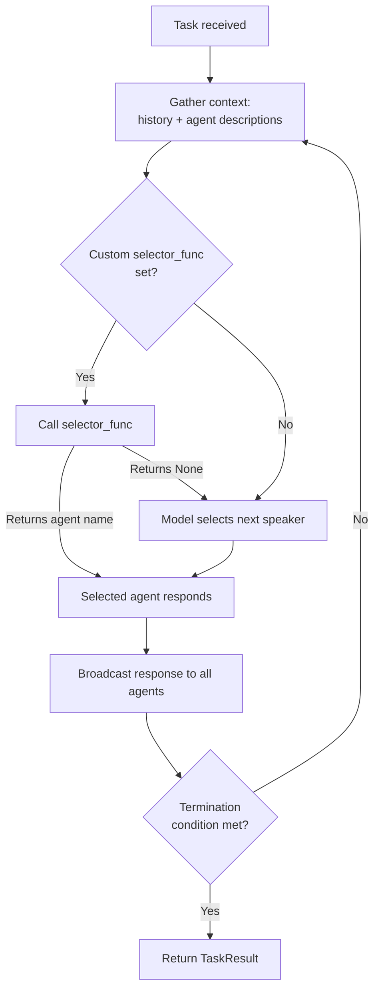

# SelectorGroupChat

## Introduction

Round-robin turn-taking works when every agent should speak on every cycle — but most real-world tasks don't follow a fixed order. A research task needs the search agent *before* the analyst, not after. A planning task needs the planner to return to the conversation whenever the team drifts off track. We need a team that makes *intelligent* decisions about who speaks next, based on the conversation so far.

**SelectorGroupChat** solves this. Instead of rotating through agents in a fixed sequence, it uses a model — the same kind of LLM powering our agents — to read the conversation context, examine each participant's name and description, and select the most appropriate next speaker. The result is a dynamic, context-aware multi-agent workflow that routes tasks to the right specialist at the right time.

In this lesson, we'll build a SelectorGroupChat from scratch, customize its selection behavior with prompts and functions, add human oversight, and adapt it for reasoning models.

### What we'll cover

- How model-based speaker selection works step by step
- Building a SelectorGroupChat with specialized agents and tools
- Customizing the selector prompt with template variables
- Overriding selection with custom selector functions (`selector_func`)
- Filtering eligible agents with custom candidate functions (`candidate_func`)
- Adding human-in-the-loop approval with `UserProxyAgent`
- Adapting SelectorGroupChat for reasoning models like o3-mini
- Best practices and common pitfalls

### Prerequisites

- Completed [Termination Conditions](./05-termination-conditions.md) — you should understand how to stop teams safely
- Completed [Team Orchestration Patterns](./04-team-orchestration-patterns.md) — familiarity with `RoundRobinGroupChat`, `run()`, and `run_stream()`
- Python 3.10+ with `autogen-agentchat` and `autogen-ext[openai]` installed
- An OpenAI API key set as `OPENAI_API_KEY`
- Familiarity with Python `asyncio` and async/await

```bash
pip install -U autogen-agentchat "autogen-ext[openai]"
```

---

## How SelectorGroupChat Works

SelectorGroupChat follows the same team lifecycle as RoundRobinGroupChat — select an agent, get a response, check termination, repeat — but replaces the round-robin selection step with a **model call**. An LLM reads the conversation, examines each participant's name and description, and outputs the name of the agent that should speak next.

### Selection flow

Here's the step-by-step flow for every turn:

1. **Gather context** — The team collects the current conversation history and each participant's name and description.
2. **Build selector prompt** — The team formats a prompt containing `{roles}`, `{history}`, and `{participants}` and sends it to the selector model.
3. **Model selects speaker** — The LLM returns the name of the agent it considers most appropriate for the next turn.
4. **Agent responds** — The selected agent processes the conversation and produces a response.
5. **Broadcast** — The response is broadcast to all participants so everyone stays in sync.
6. **Termination check** — The team evaluates all termination conditions against the new message.
7. **Repeat** — If no condition fires, the loop returns to step 1.



### How it differs from RoundRobinGroupChat

| Feature | RoundRobinGroupChat | SelectorGroupChat |
|---------|--------------------|--------------------|
| **Turn order** | Fixed rotation: A → B → C → A → … | Dynamic, based on conversation context |
| **Selection mechanism** | Index-based cycling | LLM call (or custom function) |
| **Agent descriptions** | Optional (informational only) | Critical (used for selection) |
| **Extra cost per turn** | None | One additional LLM call for selection |
| **Best for** | Structured workflows (draft → review → revise) | Dynamic tasks where the next step depends on context |

> 💡 **Key insight:** Agent descriptions are no longer cosmetic in SelectorGroupChat. The selector model reads them to decide who speaks next. Write clear, specific descriptions that explain what each agent *does* and *when* it should be chosen.

---

## Setting Up a SelectorGroupChat

Let's build a practical example: a research team with three specialized agents — a **PlanningAgent** that breaks tasks into steps, a **WebSearchAgent** that finds information, and a **DataAnalystAgent** that synthesizes findings into a report.

### Define tools

First, we create tools that our agents will use:

```python
import asyncio
from autogen_agentchat.agents import AssistantAgent
from autogen_agentchat.teams import SelectorGroupChat
from autogen_agentchat.conditions import (
    TextMentionTermination,
    MaxMessageTermination,
)
from autogen_agentchat.ui import Console
from autogen_ext.models.openai import OpenAIChatCompletionClient


# Simulated tools (replace with real implementations)
async def search_web(query: str) -> str:
    """Search the web for information on a topic."""
    # In production, call a real search API
    return f"Search results for '{query}': Found 3 relevant articles about {query}."


async def analyze_data(data: str) -> str:
    """Analyze data and produce a summary with key insights."""
    return f"Analysis of '{data}': Key trends identified. Data suggests positive outlook."
```

### Define agents

Each agent gets a descriptive name and a detailed `description` that the selector model reads:

```python
model_client = OpenAIChatCompletionClient(model="gpt-4o-mini")

planning_agent = AssistantAgent(
    name="PlanningAgent",
    model_client=model_client,
    description="A planning agent that breaks down complex tasks into steps "
    "and coordinates the team. Call this agent when the team needs "
    "direction, when a new task arrives, or when the current approach "
    "needs adjustment.",
    system_message=(
        "You are a planning agent. Your job is to break down complex tasks "
        "into smaller steps and decide which team member should handle each step. "
        "Coordinate the team by assigning clear, actionable sub-tasks. "
        "When the task is fully complete, respond with 'TERMINATE' to end the session."
    ),
)

search_agent = AssistantAgent(
    name="WebSearchAgent",
    model_client=model_client,
    description="A web search agent that finds information online. "
    "Call this agent when the team needs to look up facts, "
    "find articles, or gather external data.",
    system_message=(
        "You are a web search specialist. Use the search_web tool to find "
        "information requested by the team. Return the raw results without "
        "analysis — let the analyst handle interpretation."
    ),
    tools=[search_web],
)

analyst_agent = AssistantAgent(
    name="DataAnalystAgent",
    model_client=model_client,
    description="A data analyst that synthesizes information into reports. "
    "Call this agent when search results or data need to be analyzed, "
    "summarized, or turned into actionable insights.",
    system_message=(
        "You are a data analyst. Analyze information provided by the team, "
        "identify patterns and insights, and produce clear summaries. "
        "Use the analyze_data tool when you need structured analysis."
    ),
    tools=[analyze_data],
)
```

### Create the team

Now we assemble the team with a termination condition and run it:

```python
termination = TextMentionTermination("TERMINATE") | MaxMessageTermination(15)

team = SelectorGroupChat(
    participants=[planning_agent, search_agent, analyst_agent],
    model_client=model_client,
    termination_condition=termination,
)

async def main():
    result = await Console(team.run_stream(
        task="Research the current state of quantum computing and summarize key breakthroughs from 2025."
    ))
    print(f"\nStop reason: {result.stop_reason}")

asyncio.run(main())
```

**Output:**

```
---------- user ----------
Research the current state of quantum computing and summarize key breakthroughs from 2025.
---------- PlanningAgent ----------
I'll break this task into steps:
1. WebSearchAgent: Search for "quantum computing breakthroughs 2025"
2. WebSearchAgent: Search for "current state of quantum computing 2025"
3. DataAnalystAgent: Analyze and summarize the findings into a report
Let's start with step 1.
---------- WebSearchAgent ----------
[FunctionCall(id='call_1', arguments='{"query": "quantum computing breakthroughs 2025"}', name='search_web')]
---------- WebSearchAgent ----------
[FunctionExecutionResult(content="Search results for 'quantum computing breakthroughs 2025': Found 3 relevant articles about quantum computing breakthroughs 2025.", call_id='call_1')]
---------- WebSearchAgent ----------
Search results for 'quantum computing breakthroughs 2025': Found 3 relevant articles.
---------- DataAnalystAgent ----------
[FunctionCall(id='call_2', arguments='{"data": "quantum computing breakthroughs 2025"}', name='analyze_data')]
---------- DataAnalystAgent ----------
Analysis complete. Key trends identified. Data suggests positive outlook.
---------- PlanningAgent ----------
TERMINATE

Stop reason: Text 'TERMINATE' mentioned
```

Notice how the selector model dynamically chose agents based on context: PlanningAgent first to set direction, WebSearchAgent to gather data, DataAnalystAgent to synthesize, and PlanningAgent again to close out the task. No fixed rotation needed.

---

## Customizing the Selector Prompt

The selector model makes its decision based on a prompt that SelectorGroupChat constructs from a template. By default, AutoGen uses a built-in template, but we can replace it to guide selection behavior more precisely.

### Template variables

The selector prompt template supports three variables:

| Variable | Replaced with |
|----------|---------------|
| `{roles}` | Each participant's name and description, formatted as a list |
| `{history}` | The conversation history (all messages so far) |
| `{participants}` | A comma-separated list of participant names |

### Writing a custom selector prompt

```python
selector_prompt = """You are the speaker selector for a research team.
Below are the available team members and their roles:

{roles}

Here is the conversation so far:
{history}

Based on the conversation above, select the next speaker from: {participants}

Selection guidelines:
- If no plan exists yet, select PlanningAgent.
- If the plan calls for information gathering, select WebSearchAgent.
- If raw data or search results need analysis, select DataAnalystAgent.
- If the task appears complete, select PlanningAgent to wrap up.

Respond with ONLY the name of the selected agent, nothing else.
"""

team = SelectorGroupChat(
    participants=[planning_agent, search_agent, analyst_agent],
    model_client=model_client,
    termination_condition=termination,
    selector_prompt=selector_prompt,
)
```

The custom prompt gives the selector model explicit guidelines for when to choose each agent. This dramatically improves routing accuracy compared to the default prompt, especially when agent descriptions alone don't provide enough context for the decision.

> 💡 **Tip:** Keep the selector prompt focused. The model should output *only* an agent name. Avoid asking it to explain its reasoning — that wastes tokens and can confuse the parser.

---

## Custom Selector Functions

Sometimes model-based selection isn't enough. We might want hard rules: "The planner always speaks after every other agent" or "The analyst never speaks twice in a row." The `selector_func` parameter lets us override the model entirely (or selectively) with Python logic.

### How selector_func works

A selector function receives the list of messages so far and returns either:

- **A string** — the name of the agent to select (bypasses the model completely)
- **`None`** — falls back to model-based selection for this turn

```python
def my_selector(messages):
    """Always route back to PlanningAgent after any non-planning response."""
    if messages[-1].source != "PlanningAgent":
        return "PlanningAgent"
    return None  # Let the model decide
```

This creates a "hub-and-spoke" pattern where the PlanningAgent acts as a coordinator between every specialist turn. The planner always gets a chance to redirect the team after each step.

### Full example with selector_func

```python
def planning_hub_selector(messages):
    """Enforce a hub-and-spoke pattern:
    PlanningAgent speaks after every specialist turn.
    Model selects which specialist speaks after PlanningAgent.
    """
    if not messages:
        return "PlanningAgent"

    last_speaker = messages[-1].source
    if last_speaker != "PlanningAgent":
        # Always return to planner after a specialist speaks
        return "PlanningAgent"

    # After planner speaks, let the model pick the next specialist
    return None


team = SelectorGroupChat(
    participants=[planning_agent, search_agent, analyst_agent],
    model_client=model_client,
    termination_condition=termination,
    selector_func=planning_hub_selector,
)
```

**Output:**

```
---------- user ----------
Research AI trends in healthcare for 2025.
---------- PlanningAgent ----------
Step 1: WebSearchAgent, search for "AI healthcare trends 2025"
---------- WebSearchAgent ----------
[FunctionCall: search_web("AI healthcare trends 2025")]
Search results found.
---------- PlanningAgent ----------
Good. Step 2: DataAnalystAgent, analyze these results.
---------- DataAnalystAgent ----------
[FunctionCall: analyze_data("AI healthcare trends")]
Analysis complete with 4 key insights.
---------- PlanningAgent ----------
TERMINATE
```

The flow is strictly: Planner → (model-selected specialist) → Planner → (model-selected specialist) → …

### When to use selector_func vs. selector_prompt

| Use case | Approach |
|----------|----------|
| Soft guidance ("prefer the analyst after search results") | Custom `selector_prompt` |
| Hard rules ("planner must speak after every turn") | `selector_func` returning a name |
| Hybrid ("enforce some rules, delegate others to model") | `selector_func` returning `None` for delegation |
| Conditional logic based on message content | `selector_func` with message inspection |

---

## Custom Candidate Functions

While `selector_func` controls *who* is selected, `candidate_func` controls *who is eligible* for selection. It filters the pool of candidates before the selector model makes its decision.

### How candidate_func works

A candidate function receives the list of messages and returns a list of agent name strings representing the agents eligible to speak on this turn. The model then selects from this filtered subset.

```python
def filter_candidates(messages):
    """Prevent the same agent from speaking twice in a row."""
    if not messages:
        return ["PlanningAgent", "WebSearchAgent", "DataAnalystAgent"]

    last_speaker = messages[-1].source
    all_agents = ["PlanningAgent", "WebSearchAgent", "DataAnalystAgent"]
    # Remove the last speaker from candidates
    return [name for name in all_agents if name != last_speaker]


team = SelectorGroupChat(
    participants=[planning_agent, search_agent, analyst_agent],
    model_client=model_client,
    termination_condition=termination,
    candidate_func=filter_candidates,
)
```

> ⚠️ **Important:** `candidate_func` and `selector_func` are mutually exclusive. If you set `selector_func`, the candidate function is ignored because `selector_func` already has full control over selection. Use `candidate_func` when you want to *constrain* model-based selection without replacing it entirely.

### Comparison table

| Parameter | Controls | Model involved? | Works with the other? |
|-----------|----------|-----------------|----------------------|
| `selector_prompt` | What the model sees when selecting | Yes | ✅ Works with `candidate_func` |
| `selector_func` | Who is selected (override or fallback) | Only on `None` return | ❌ Overrides `candidate_func` |
| `candidate_func` | Who is *eligible* for model selection | Yes (selects from filtered pool) | ❌ Ignored if `selector_func` is set |

---

## Preventing Consecutive Turns

By default, SelectorGroupChat allows the same agent to be selected on consecutive turns. This is useful when an agent needs multiple turns to complete tool calls, but it can lead to loops where one agent dominates the conversation.

The `allow_repeated_speaker` parameter controls this behavior:

```python
# Prevent any agent from speaking twice in a row
team = SelectorGroupChat(
    participants=[planning_agent, search_agent, analyst_agent],
    model_client=model_client,
    termination_condition=termination,
    allow_repeated_speaker=False,  # Default is True
)
```

| Setting | Behavior | Best for |
|---------|----------|----------|
| `True` (default) | Same agent can be selected consecutively | Agents that need multi-turn tool calling |
| `False` | Same agent cannot speak on back-to-back turns | Preventing single-agent domination |

> 💡 **Tip:** If you set `allow_repeated_speaker=False` and an agent needs to make a tool call and process the result (which takes two consecutive turns), consider using a single-agent team wrapper or `selector_func` to handle this case explicitly.

---

## Human-in-the-Loop with UserProxyAgent

In high-stakes workflows, we want a human to review and approve agent decisions before the team proceeds. AutoGen's `UserProxyAgent` integrates directly into SelectorGroupChat to enable this.

### Adding human approval

```python
from autogen_agentchat.agents import UserProxyAgent

# UserProxyAgent pauses execution and prompts for human input
user_proxy = UserProxyAgent(
    name="HumanApprover",
    description="A human reviewer who approves or rejects plans "
    "and provides feedback. Select this agent when a plan or "
    "analysis needs human approval before proceeding.",
)

approval_prompt = """You are the speaker selector for a research team.

{roles}

Conversation so far:
{history}

Select the next speaker from: {participants}

Guidelines:
- After PlanningAgent proposes a plan, select HumanApprover for review.
- After HumanApprover approves, select the appropriate specialist.
- If HumanApprover rejects, select PlanningAgent to revise.

Respond with ONLY the agent name.
"""

team = SelectorGroupChat(
    participants=[planning_agent, search_agent, analyst_agent, user_proxy],
    model_client=model_client,
    termination_condition=termination,
    selector_prompt=approval_prompt,
)

# When run, the team will pause at HumanApprover turns
# and wait for user input in the terminal
result = await Console(team.run_stream(
    task="Research and summarize the latest advances in fusion energy."
))
```

**Output:**

```
---------- user ----------
Research and summarize the latest advances in fusion energy.
---------- PlanningAgent ----------
Proposed plan:
1. Search for "fusion energy breakthroughs 2025"
2. Search for "commercial fusion energy timeline"
3. Analyst synthesizes findings into a summary
---------- HumanApprover ----------
> Looks good, but also search for "fusion energy startups funding 2025". Approved.
---------- WebSearchAgent ----------
[FunctionCall: search_web("fusion energy breakthroughs 2025")]
...
```

The `UserProxyAgent` injects a human checkpoint into the dynamic workflow. The selector model routes to the human when approval is needed, and the human's response becomes part of the conversation context for subsequent selection decisions.

---

## Using Reasoning Models

Reasoning models like OpenAI's o3-mini and o4-mini handle multi-step planning internally — they "think" before responding. This changes how we design SelectorGroupChat teams.

### Key differences with reasoning models

| Standard models (GPT-4o) | Reasoning models (o3-mini) |
|--------------------------|---------------------------|
| Benefit from a dedicated PlanningAgent | Create their own plans internally |
| Need detailed system prompts | Work best with simpler, shorter prompts |
| Require explicit step-by-step instructions | Infer steps from the task description |
| Selector prompt should be detailed | Selector prompt should be minimal |

### Simplified setup for reasoning models

```python
reasoning_client = OpenAIChatCompletionClient(model="o3-mini")

# With reasoning models, agents can be simpler — no dedicated planner needed
researcher = AssistantAgent(
    name="Researcher",
    model_client=reasoning_client,
    description="Researches topics and gathers information.",
    system_message="You research topics thoroughly.",
    tools=[search_web],
)

writer = AssistantAgent(
    name="Writer",
    model_client=reasoning_client,
    description="Writes clear, structured reports from research.",
    system_message="You write clear reports. Say TERMINATE when done.",
)

# Simpler selector prompt — reasoning models plan internally
simple_selector = """Select the next speaker from {participants}.

{roles}

{history}

Who should speak next? Reply with only the name.
"""

team = SelectorGroupChat(
    participants=[researcher, writer],
    model_client=reasoning_client,
    termination_condition=TextMentionTermination("TERMINATE"),
    selector_prompt=simple_selector,
)
```

> 💡 **Tip:** When using reasoning models, you can often skip the PlanningAgent entirely. The reasoning model powering each agent already creates an internal plan. Adding an explicit planner on top can create redundant planning layers that slow down the team.

---

## Best Practices

### Agent descriptions are critical

The selector model's only knowledge of each agent comes from its `name` and `description`. Vague descriptions lead to poor routing:

```python
# ❌ Too vague — selector can't distinguish roles
agent = AssistantAgent(name="Agent1", description="An AI agent")

# ✅ Specific — selector knows exactly when to choose this agent
agent = AssistantAgent(
    name="WebSearchAgent",
    description="Searches the web for current information. Select this agent "
    "when the team needs to find facts, articles, or recent data "
    "that other agents don't have access to.",
)
```

### Cost management

Every turn in SelectorGroupChat makes **two** LLM calls: one for selection, one for the agent's response. Monitor costs carefully:

- Use a cheaper model (e.g., `gpt-4o-mini`) as the team's `model_client` for selection, while using a more capable model for individual agents
- Set `MaxMessageTermination` as a safety net
- Use `TokenUsageTermination` for budget caps
- Consider `selector_func` for deterministic turns that don't need model selection

### Keep teams small

Three to five agents is the sweet spot. More agents means the selector prompt grows longer (listing all roles), selection accuracy drops, and costs multiply.

### Test selection behavior

Log which agent is selected on each turn. If the selector consistently picks the wrong agent, refine descriptions or add a custom `selector_prompt` with explicit guidelines.

---

## Common Pitfalls

| Pitfall | Symptom | Fix |
|---------|---------|-----|
| **Vague agent descriptions** | Selector picks the wrong agent repeatedly | Write descriptions that explain *when* to select each agent |
| **Missing termination condition** | Team runs forever, burning tokens | Always set at least `MaxMessageTermination` as a safety net |
| **Repeated speaker loops** | One agent dominates the conversation | Set `allow_repeated_speaker=False` or use `selector_func` |
| **selector_func + candidate_func** | candidate_func silently ignored | Use one or the other, not both |
| **Overly complex selector prompt** | Model returns invalid agent names or explanations | Keep the prompt simple; ask for only the agent name |
| **Too many agents** | Poor selection accuracy, high cost | Limit to 3–5 agents per team; nest teams for larger workflows |
| **Same model_client for everything** | High costs from selection calls | Use a cheaper model for the team's `model_client` (selector), capable models for agents |

---

## Hands-On Exercise

Build a **content creation team** with SelectorGroupChat:

1. **ResearchAgent** — uses a `search_web` tool to find information on a topic
2. **WriterAgent** — writes blog-style articles from research findings
3. **EditorAgent** — reviews content for clarity, accuracy, and structure, and suggests improvements
4. **PlanningAgent** — coordinates the team and ends the task when the final article is approved

Requirements:

- Write a custom `selector_prompt` with explicit routing guidelines
- Use `allow_repeated_speaker=False` to prevent loops
- Combine `TextMentionTermination("APPROVE")` and `MaxMessageTermination(20)` as termination
- Run the team with `Console(team.run_stream(...))` on the topic: "The future of renewable energy storage"

**Stretch goals:**

- Add a `selector_func` that enforces the PlanningAgent speaks after every 3 turns
- Add a `UserProxyAgent` for human approval of the final article
- Use a cheaper model (`gpt-4o-mini`) for the team's selector and a more capable model (`gpt-4o`) for the WriterAgent

---

## Summary

SelectorGroupChat replaces fixed turn rotation with **intelligent, model-based speaker selection**. The selector model reads conversation context, examines agent descriptions, and picks the most appropriate next speaker — creating dynamic workflows that adapt to the task at hand.

Key takeaways:

- **Model-based selection** uses an LLM to choose the next speaker based on `{roles}`, `{history}`, and `{participants}`
- **Agent descriptions are critical** — they're the selector model's primary input for routing decisions
- **`selector_prompt`** customizes the template the selector model sees, guiding its choices with explicit rules
- **`selector_func`** overrides model selection with Python logic; return a name to force a choice, or `None` to fall back to the model
- **`candidate_func`** filters which agents are eligible each turn, constraining the model's choices without replacing it
- **`allow_repeated_speaker=False`** prevents any agent from speaking on consecutive turns
- **UserProxyAgent** integrates human checkpoints into the dynamic workflow
- **Reasoning models** (o3-mini, o4-mini) work best with simpler prompts and fewer agents — they plan internally

SelectorGroupChat is the right choice when our workflow is **dynamic** — when the next step depends on what just happened, not on a predetermined sequence. For workflows with explicit handoff logic between agents, we'll explore the Swarm pattern next.

---

**Next:** [Swarm Pattern](./07-swarm-pattern.md)

---

[Back to AutoGen AgentChat Overview](./00-autogen-agentchat.md)

<!--
Sources Consulted:
- AutoGen SelectorGroupChat Tutorial: https://microsoft.github.io/autogen/stable/user-guide/agentchat-user-guide/tutorial/selector-group-chat.html
- AutoGen SelectorGroupChat API Reference: https://microsoft.github.io/autogen/stable/reference/python/autogen_agentchat.teams.html#autogen_agentchat.teams.SelectorGroupChat
- AutoGen Custom Selector Function Example: https://microsoft.github.io/autogen/stable/user-guide/agentchat-user-guide/selector-group-chat.html
- AutoGen Reasoning Models Guide: https://microsoft.github.io/autogen/stable/user-guide/agentchat-user-guide/tutorial/selector-group-chat.html#using-reasoning-models
-->
