# Swarm Pattern

## Introduction

SelectorGroupChat uses an LLM to pick the next speaker. RoundRobinGroupChat rotates through agents in a fixed order. Both approaches treat speaker selection as an *external* decision — something the team orchestrator handles *on behalf of* the agents. But what if the agents themselves should decide who speaks next?

The **Swarm** pattern flips the control model. Instead of a central orchestrator choosing the next speaker, each agent declares which agents it *can* hand off to, and then makes that handoff decision itself during the conversation. Agent A finishes its work and explicitly says "transfer to Agent B." Agent B takes over, does its work, and hands off to Agent C — or back to Agent A, or to the user. The agents drive the routing, not the framework.

This agent-driven approach maps naturally to workflows where the transition logic lives inside the task itself: customer support escalation trees, multi-step research pipelines, approval chains, and any process where the current agent knows *exactly* who should handle the next step.

### What we'll cover

- How the Swarm pattern differs from round-robin and selector-based orchestration
- Setting up agents with handoff targets using the `handoffs` parameter
- How AutoGen auto-generates transfer functions from handoff declarations
- Building a customer support swarm with agent-driven routing
- Implementing human-in-the-loop (HITL) with `HandoffTermination`
- Constructing a multi-agent research swarm with tools and a planner
- Best practices and common pitfalls

### Prerequisites

- Completed [SelectorGroupChat](./06-selector-group-chat.md) — you should understand model-based speaker selection and its trade-offs
- Completed [Termination Conditions](./05-termination-conditions.md) — familiarity with `HandoffTermination` and combined conditions
- Python 3.10+ with `autogen-agentchat` and `autogen-ext[openai]` installed
- An OpenAI API key set as `OPENAI_API_KEY`
- Familiarity with Python `asyncio` and async/await

```bash
pip install -U autogen-agentchat "autogen-ext[openai]"
```

---

## Understanding the Swarm Pattern

### The core idea: agent-driven transitions

In a Swarm, agents carry `HandoffMessage` objects to signal transitions. When an agent decides it's done with its part of the task, it calls a transfer function — like `transfer_to_flights_refunder` — which sends a `HandoffMessage` to the team. The team reads that message and routes the conversation to the named target agent. No LLM selection call. No round-robin index. The agent that just spoke made the decision.


### How a Swarm turn works

Every turn follows this sequence:

1. **Active agent responds** — The currently active agent processes the conversation and produces a response.
2. **Check for handoff** — The team inspects the response. If it contains a `HandoffMessage`, the team identifies the target agent.
3. **Transfer context** — The team sets the target agent as the new active agent. All agents share the same message history, so the target already has full context.
4. **Termination check** — The team evaluates termination conditions against the new message.
5. **Repeat** — If no termination condition fires, the new active agent takes its turn.


### How Swarm compares to other patterns

| Feature | RoundRobinGroupChat | SelectorGroupChat | Swarm |
|---------|--------------------|--------------------|-------|
| **Who decides next speaker** | Framework (fixed rotation) | External LLM call | The current agent |
| **Selection mechanism** | Index cycling | Model reads context + descriptions | Agent calls transfer function |
| **Extra LLM cost per turn** | None | 1 selector call | None |
| **Routing flexibility** | None — always same order | High — any agent can be chosen | Medium — constrained to declared handoffs |
| **Best for** | Sequential pipelines | Dynamic, unstructured tasks | Structured workflows with clear handoff points |

> 💡 **Key insight:** Swarm sits between the rigidity of round-robin and the flexibility of selector. Agents can only hand off to targets you explicitly declare, which makes the routing predictable and auditable — important for production systems like customer support.

---

## Setting Up Agent Handoffs

### The `handoffs` parameter

Every `AssistantAgent` in a Swarm accepts a `handoffs` parameter — a list of agent names (strings) or `Handoff` objects that define where this agent can transfer the conversation. When you pass strings, AutoGen automatically generates the transfer functions.

```python
from autogen_agentchat.agents import AssistantAgent
from autogen_ext.models.openai import OpenAIChatCompletionClient

model_client = OpenAIChatCompletionClient(model="gpt-4o-mini")

travel_agent = AssistantAgent(
    name="travel_agent",
    model_client=model_client,
    system_message=(
        "You are a travel assistant. Help customers with bookings "
        "and travel questions. If the customer wants a refund, "
        "transfer to flights_refunder. If you need human approval, "
        "transfer to user."
    ),
    handoffs=["flights_refunder", "user"],
)
```

When AutoGen processes this agent, it reads `handoffs=["flights_refunder", "user"]` and creates two tool functions that the agent can call:

- `transfer_to_flights_refunder()` — Sends a `HandoffMessage` with `target="flights_refunder"`
- `transfer_to_user()` — Sends a `HandoffMessage` with `target="user"`

The agent sees these as tools in its tool list. When the conversation context matches a transfer condition (like the customer asking for a refund), the LLM powering the agent decides to call the appropriate transfer function — just like it would call any other tool.

### Auto-generated transfer functions

You don't write any transfer function code. AutoGen generates them from the `handoffs` list:

```
Agent: travel_agent
  ├── Tool: transfer_to_flights_refunder()
  └── Tool: transfer_to_user()

Agent: flights_refunder
  └── Tool: transfer_to_travel_agent()
```

Each generated function, when called, produces a `HandoffMessage` that the Swarm team intercepts to route the conversation.

### The `Handoff` class for custom behavior

When you need more control — for example, to pass context along with the handoff — use the `Handoff` class instead of a plain string:

```python
from autogen_agentchat.agents import AssistantAgent, Handoff

flights_refunder = AssistantAgent(
    name="flights_refunder",
    model_client=model_client,
    system_message=(
        "You handle flight refund requests. Collect the booking "
        "reference and reason for refund, then process it. "
        "Transfer back to travel_agent for non-refund queries."
    ),
    handoffs=[
        Handoff(
            target="travel_agent",
            message="Customer issue resolved. Transferring back to general travel assistance.",
        ),
        Handoff(
            target="user",
            message="I need additional information from the customer to proceed.",
        ),
    ],
)
```

The `Handoff` class accepts:

| Parameter | Type | Description |
|-----------|------|-------------|
| `target` | `str` | Name of the agent (or `"user"`) to hand off to |
| `message` | `str` | Context message included in the `HandoffMessage` — helps the target agent understand why it's receiving the conversation |

The `message` field is especially useful in complex swarms. When a planner hands off to an analyst, it can include instructions like "Focus on Q3 revenue data" in the handoff message, giving the receiving agent targeted context.

---

## Building a Customer Support Swarm

Let's build a complete customer support swarm with two agents and a human-in-the-loop escape hatch. This is the canonical Swarm use case: a triage agent routes customers to specialists, and any agent can escalate to a human.

### Define the agents

```python
import asyncio
from autogen_agentchat.agents import AssistantAgent
from autogen_agentchat.teams import Swarm
from autogen_agentchat.conditions import HandoffTermination, MaxMessageTermination
from autogen_agentchat.ui import Console
from autogen_ext.models.openai import OpenAIChatCompletionClient

model_client = OpenAIChatCompletionClient(model="gpt-4o-mini")

# Triage / general travel agent
travel_agent = AssistantAgent(
    name="travel_agent",
    model_client=model_client,
    system_message=(
        "You are a friendly travel assistant at FlyRight Airlines. "
        "Help customers with bookings, seat selection, and travel questions. "
        "If the customer asks for a refund or cancellation, transfer to "
        "flights_refunder. If you cannot resolve the issue, transfer to user."
    ),
    handoffs=["flights_refunder", "user"],
)

# Refund specialist
flights_refunder = AssistantAgent(
    name="flights_refunder",
    model_client=model_client,
    system_message=(
        "You are a refund specialist at FlyRight Airlines. "
        "Help customers with refund requests: collect booking reference, "
        "verify eligibility, and process the refund. "
        "For non-refund queries, transfer back to travel_agent. "
        "If you need information only the customer can provide, transfer to user."
    ),
    handoffs=["travel_agent", "user"],
)
```

### Create the Swarm team

```python
# Stop when any agent hands off to "user" OR after 10 messages
termination = HandoffTermination(target="user") | MaxMessageTermination(10)

team = Swarm(
    participants=[travel_agent, flights_refunder],
    termination_condition=termination,
)
```

`HandoffTermination(target="user")` watches for a `HandoffMessage` whose target is `"user"`. When it fires, the team stops and returns the result — giving us a clean hook for human input.

### Run the swarm

```python
async def main():
    result = await Console(
        team.run_stream(task="I booked flight FR-1234 last week but I need to cancel it and get a refund.")
    )
    print(f"\nTask status: {result.stop_reason}")

asyncio.run(main())
```

**Output:**

```
---------- user ----------
I booked flight FR-1234 last week but I need to cancel it and get a refund.
---------- travel_agent ----------
I understand you'd like a refund for flight FR-1234. Let me transfer you to our
refund specialist who can help with that.
[FunctionCall(id='call_abc123', arguments='{}', name='transfer_to_flights_refunder')]
---------- travel_agent ----------
[FunctionExecutionResult(content='Transfer to flights_refunder.', call_id='call_abc123')]
---------- flights_refunder ----------
I'd be happy to help with your refund for flight FR-1234. I'll need a few details:
1. Could you confirm the passenger name on the booking?
2. What is the reason for cancellation?
[FunctionCall(id='call_def456', arguments='{}', name='transfer_to_user')]
---------- flights_refunder ----------
[FunctionExecutionResult(content='Transfer to user.', call_id='call_def456')]

Task status: Handoff to user from flights_refunder detected.
```

Notice the flow: `travel_agent` recognized the refund request and transferred to `flights_refunder`. The refund agent then needed customer information and transferred to `user`, which triggered `HandoffTermination` and stopped the team.

### Handoff flow diagram

```mermaid
sequenceDiagram
    participant U as User
    participant TA as travel_agent
    participant FR as flights_refunder

    U->>TA: "I need to cancel flight FR-1234<br/>and get a refund"
    TA->>TA: Recognizes refund request
    TA->>FR: HandoffMessage → transfer_to_flights_refunder
    FR->>FR: Needs booking details from customer
    FR->>U: HandoffMessage → transfer_to_user
    Note over U: HandoffTermination fires.<br/>Team returns result.
```



---

## Human-in-the-Loop with Swarm

The customer support example stopped when `flights_refunder` handed off to `user`. But in a real application, we want to collect the user's response and *resume* the conversation. This is the **HITL loop pattern**.

### The HITL loop

The pattern works by running the team repeatedly. Each iteration runs until a `HandoffTermination` fires. We inspect the last message — if it's a `HandoffMessage` targeting `"user"`, we prompt for input and feed it back as the next task. If the team stopped for any other reason, we break out of the loop.

```python
from autogen_agentchat.messages import HandoffMessage

async def run_with_human_loop():
    task = "I booked flight FR-1234 last week but I need to cancel it and get a refund."

    while True:
        result = await Console(team.run_stream(task=task))

        # Check if the team stopped because of a handoff to "user"
        last_message = result.messages[-1]
        if isinstance(last_message, HandoffMessage) and last_message.target == "user":
            # Collect human input and resume
            task = input("User: ")
        else:
            # Team finished for another reason (MaxMessageTermination, etc.)
            print("Conversation complete.")
            break

asyncio.run(run_with_human_loop())
```

**Output:**

```
---------- user ----------
I booked flight FR-1234 last week but I need to cancel it and get a refund.
---------- travel_agent ----------
Let me transfer you to our refund specialist.
[FunctionCall(id='call_abc123', arguments='{}', name='transfer_to_flights_refunder')]
---------- travel_agent ----------
[FunctionExecutionResult(content='Transfer to flights_refunder.', call_id='call_abc123')]
---------- flights_refunder ----------
I'd be happy to help! Could you confirm the passenger name and reason for cancellation?
[FunctionCall(id='call_def456', arguments='{}', name='transfer_to_user')]
---------- flights_refunder ----------
[FunctionExecutionResult(content='Transfer to user.', call_id='call_def456')]
User: The name is Jane Doe, and I have a schedule conflict.
---------- user ----------
The name is Jane Doe, and I have a schedule conflict.
---------- flights_refunder ----------
Thank you, Jane. I've processed your refund for booking FR-1234. You'll receive
$342.00 back to your original payment method within 5-7 business days. Is there
anything else I can help with?
[FunctionCall(id='call_ghi789', arguments='{}', name='transfer_to_user')]
---------- flights_refunder ----------
[FunctionExecutionResult(content='Transfer to user.', call_id='call_ghi789')]
User: No, that's all. Thank you!
---------- user ----------
No, that's all. Thank you!
---------- flights_refunder ----------
You're welcome, Jane! Have a great day. ✈️
---------- flights_refunder ----------
TERMINATE
Conversation complete.
```

### How state persists across HITL iterations

A critical detail: when you call `team.run_stream(task=task)` after a handoff-to-user stop, the team **resumes from where it left off**. The conversation history, the active agent, and all internal state carry over. The `flights_refunder` stays active because it was the last agent before the handoff, and the user's reply gets appended to the shared message history.

If you need a fresh start (a new customer, for example), call `await team.reset()` before the next `run_stream()`.

---

## Multi-Agent Research Swarm

Swarms aren't just for customer support. Let's build a stock research swarm where a **planner** coordinates handoffs between a **financial analyst**, a **news analyst**, and a **writer**. Each analyst has domain-specific tools, and the planner decides the workflow.

### Define tools

```python
import asyncio
from autogen_agentchat.agents import AssistantAgent
from autogen_agentchat.teams import Swarm
from autogen_agentchat.conditions import HandoffTermination, MaxMessageTermination
from autogen_agentchat.ui import Console
from autogen_ext.models.openai import OpenAIChatCompletionClient


def get_stock_price(symbol: str) -> str:
    """Get the current stock price for a given symbol."""
    # Simulated data for demonstration
    prices = {"AAPL": 242.53, "GOOGL": 195.87, "MSFT": 458.12, "TSLA": 389.44}
    price = prices.get(symbol.upper(), None)
    if price:
        return f"{symbol.upper()}: ${price:.2f}"
    return f"Symbol {symbol} not found."


def get_financial_ratios(symbol: str) -> str:
    """Get key financial ratios for a given stock symbol."""
    ratios = {
        "AAPL": "P/E: 32.1, P/B: 54.8, Debt/Equity: 1.87, ROE: 147%",
        "GOOGL": "P/E: 24.3, P/B: 7.2, Debt/Equity: 0.05, ROE: 29%",
        "MSFT": "P/E: 36.7, P/B: 13.1, Debt/Equity: 0.32, ROE: 38%",
        "TSLA": "P/E: 78.4, P/B: 16.9, Debt/Equity: 0.11, ROE: 22%",
    }
    return ratios.get(symbol.upper(), f"No data for {symbol}")


def search_news(query: str) -> str:
    """Search for recent news articles about a topic."""
    # Simulated news results
    return (
        f"Recent news for '{query}':\n"
        f"1. '{query} Reports Strong Q4 Earnings' - Reuters, 2 hours ago\n"
        f"2. 'Analysts Upgrade {query} to Buy' - Bloomberg, 5 hours ago\n"
        f"3. '{query} Announces New Product Line' - TechCrunch, 1 day ago"
    )
```

### Define the agents

```python
model_client = OpenAIChatCompletionClient(model="gpt-4o-mini")

planner = AssistantAgent(
    name="planner",
    model_client=model_client,
    system_message=(
        "You are a research planner. Given a stock research request:\n"
        "1. First transfer to financial_analyst for price and ratio analysis.\n"
        "2. Then transfer to news_analyst for recent news sentiment.\n"
        "3. Finally transfer to writer to compile the research report.\n"
        "Coordinate the workflow by handing off to the right agent at each step."
    ),
    handoffs=["financial_analyst", "news_analyst", "writer"],
)

financial_analyst = AssistantAgent(
    name="financial_analyst",
    model_client=model_client,
    system_message=(
        "You are a financial analyst. Use your tools to gather stock prices "
        "and financial ratios. Present your findings clearly, then transfer "
        "back to planner for the next step."
    ),
    tools=[get_stock_price, get_financial_ratios],
    handoffs=["planner"],
)

news_analyst = AssistantAgent(
    name="news_analyst",
    model_client=model_client,
    system_message=(
        "You are a news analyst. Use the search_news tool to find recent "
        "news about the requested stock. Summarize sentiment and key events, "
        "then transfer back to planner."
    ),
    tools=[search_news],
    handoffs=["planner"],
)

writer = AssistantAgent(
    name="writer",
    model_client=model_client,
    system_message=(
        "You are a research report writer. Compile all findings from the "
        "financial analyst and news analyst into a concise, well-structured "
        "research report. Include a recommendation (Buy/Hold/Sell). "
        "When done, end your response with 'TERMINATE'."
    ),
    handoffs=["planner"],
)
```

### Assemble and run

```python
termination = MaxMessageTermination(25)

research_team = Swarm(
    participants=[planner, financial_analyst, news_analyst, writer],
    termination_condition=termination,
)

async def main():
    result = await Console(
        research_team.run_stream(task="Research AAPL stock and write a brief investment report.")
    )
    print(f"\nCompleted in {len(result.messages)} messages.")

asyncio.run(main())
```

**Output:**

```
---------- user ----------
Research AAPL stock and write a brief investment report.
---------- planner ----------
I'll coordinate this research. Let me start by getting financial data.
[FunctionCall(id='call_001', arguments='{}', name='transfer_to_financial_analyst')]
---------- planner ----------
[FunctionExecutionResult(content='Transfer to financial_analyst.', call_id='call_001')]
---------- financial_analyst ----------
[FunctionCall(id='call_002', arguments='{"symbol":"AAPL"}', name='get_stock_price')]
[FunctionCall(id='call_003', arguments='{"symbol":"AAPL"}', name='get_financial_ratios')]
---------- financial_analyst ----------
[FunctionExecutionResult(content='AAPL: $242.53', call_id='call_002')]
[FunctionExecutionResult(content='P/E: 32.1, P/B: 54.8, ...', call_id='call_003')]
---------- financial_analyst ----------
**Financial Analysis - AAPL:**
- Current Price: $242.53
- P/E Ratio: 32.1 (above sector average)
- ROE: 147% (exceptionally strong)
- Debt/Equity: 1.87 (moderate leverage)
[FunctionCall(id='call_004', arguments='{}', name='transfer_to_planner')]
...
---------- writer ----------
# AAPL Investment Research Report
## Summary
...
**Recommendation: BUY** — Strong fundamentals and positive sentiment support
continued growth.
TERMINATE

Completed in 16 messages.
```

### Research swarm handoff flow


The planner acts as a hub. It dispatches work to specialists and receives control back after each step. This hub-and-spoke pattern keeps the workflow organized while still letting each agent use its own tools independently.

---

## Best Practices

### 1. Set `parallel_tool_calls=False`

When an agent has both regular tools and handoff transfer functions, the LLM might try to call a tool *and* a handoff in the same turn. This creates ambiguous behavior — should the team process the tool result or the handoff? Disable parallel tool calls to prevent this:

```python
agent = AssistantAgent(
    name="my_agent",
    model_client=model_client,
    system_message="...",
    tools=[my_tool],
    handoffs=["other_agent"],
    model_client_stream=False,  # Optional, for clarity
)
```

> In AutoGen v0.7+, the Swarm team handles this automatically in most cases, but explicitly setting `parallel_tool_calls=False` on your model client configuration is still recommended for models that support it.

### 2. Write explicit system messages

The agent's system message drives handoff decisions. Be specific about *when* to transfer and *to whom*:

```python
# ❌ Vague — agent won't know when to transfer
system_message="Help customers. You can transfer to other agents."

# ✅ Specific — agent knows exactly when to hand off
system_message=(
    "You handle billing questions. "
    "Transfer to tech_support for technical issues. "
    "Transfer to user if you need information only the customer can provide."
)
```

### 3. Include `"user"` in handoffs for HITL

If you want an agent to be able to escalate to a human, include `"user"` in its `handoffs` list. Pair it with `HandoffTermination(target="user")` on the team to create the exit point.

### 4. Use the `Handoff` class for context passing

When handoffs carry context, the receiving agent makes better decisions:

```python
handoffs=[
    Handoff(target="analyst", message="Customer has a premium account. Prioritize accordingly."),
]
```

### 5. Keep handoff graphs simple

Every handoff edge is a potential path through your system. Complex graphs with many cross-connections become hard to reason about and test. Start with linear or hub-and-spoke patterns and add edges only when needed.

---

## Common Pitfalls

### Circular handoff loops

If Agent A hands off to Agent B, and Agent B immediately hands back to Agent A, you get an infinite loop. Always include a termination condition like `MaxMessageTermination` as a safety net:

```python
# Always pair handoff-heavy swarms with a message limit
termination = HandoffTermination(target="user") | MaxMessageTermination(20)
```

### Missing handoff target

If an agent's `handoffs` list references an agent name that isn't in the `participants` list (and isn't `"user"`), AutoGen raises an error at team creation time. Double-check that names match exactly — they're case-sensitive.

```python
# ❌ This will fail — name mismatch
agent_a = AssistantAgent(name="Agent_A", handoffs=["agent_b"], ...)
agent_b = AssistantAgent(name="AgentB", ...)  # Should be "agent_b"
team = Swarm(participants=[agent_a, agent_b])  # Error!
```

### Forgetting to reset between tasks

After a HITL loop finishes (the user says "goodbye" and the swarm terminates), the team retains its internal state. If you start a new conversation with a different user, call `await team.reset()` first to clear the history and active agent.

### Over-relying on the LLM for handoff decisions

The LLM inside each agent decides *when* to call the transfer function. If your system message is vague, the agent might hand off too early, too late, or to the wrong target. Test with real conversation examples and refine your system messages until the handoff timing is reliable.

---

## Hands-On Exercise

Build a **tech support swarm** with three agents:

1. **triage_agent** — Greets the customer, identifies whether the issue is about hardware or software, and hands off to the appropriate specialist.
2. **hardware_specialist** — Handles hardware issues (printers, monitors, network). Can escalate to `user` for physical troubleshooting steps.
3. **software_specialist** — Handles software issues (installations, updates, crashes). Can escalate to `user` for screenshots or error codes.

Requirements:
- Use `HandoffTermination(target="user")` so the team stops when any agent needs customer input.
- Implement the HITL loop pattern to keep the conversation going until the issue is resolved.
- Add `MaxMessageTermination(30)` as a safety limit.
- Test with: `"My printer won't connect to WiFi and my email app keeps crashing."`

**Stretch goal:** Add a `Handoff` with a `message` parameter so that when `triage_agent` hands off to a specialist, the specialist receives a brief summary of the issue.

---

## Summary

The Swarm pattern puts routing control where it belongs — in the agents themselves. Instead of relying on fixed rotation or an external LLM selector, each agent declares its handoff targets and makes transition decisions based on the conversation context.

| Concept | Key takeaway |
|---------|-------------|
| **Agent-driven selection** | Agents call auto-generated `transfer_to_{name}` functions to hand off |
| **`handoffs` parameter** | List of strings or `Handoff` objects defining valid transfer targets |
| **`HandoffMessage`** | The message type that signals a transition between agents |
| **Shared context** | All agents in a Swarm share the same message history |
| **HITL pattern** | `HandoffTermination(target="user")` + loop + `input()` for human interaction |
| **Hub-and-spoke** | Use a planner agent as a central coordinator for complex multi-step workflows |
| **Safety** | Always pair swarms with `MaxMessageTermination` to prevent infinite loops |

**Next:** [GraphFlow DAG Workflows](./08-graphflow-dag-workflows.md)

---

## Further Reading

- 📖 [AutoGen Swarm Tutorial](https://microsoft.github.io/autogen/stable/user-guide/agentchat-user-guide/tutorial/swarm.html) — Official walkthrough
- 📖 [Swarm with Human-in-the-Loop](https://microsoft.github.io/autogen/stable/user-guide/agentchat-user-guide/tutorial/swarm.html#human-in-the-loop) — HITL pattern details
- 📖 [HandoffMessage API Reference](https://microsoft.github.io/autogen/stable/reference/python/autogen_agentchat.messages.html#autogen_agentchat.messages.HandoffMessage) — Message class documentation
- 📖 [Handoff Class API Reference](https://microsoft.github.io/autogen/stable/reference/python/autogen_agentchat.agents.html#autogen_agentchat.agents.Handoff) — Custom handoff configuration
- 📄 [OpenAI Swarm (Experimental)](https://github.com/openai/swarm) — The inspiration for AutoGen's Swarm implementation

[Back to AutoGen AgentChat Overview](./00-autogen-agentchat.md)

<!--
Sources Consulted:
- AutoGen Swarm Tutorial: https://microsoft.github.io/autogen/stable/user-guide/agentchat-user-guide/tutorial/swarm.html
- AutoGen AgentChat API Reference: https://microsoft.github.io/autogen/stable/reference/python/autogen_agentchat
- AutoGen GitHub Repository: https://github.com/microsoft/autogen
- OpenAI Swarm: https://github.com/openai/swarm
-->
