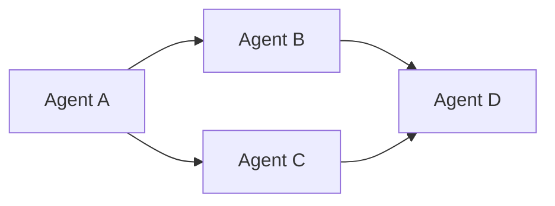
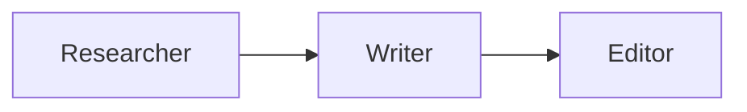
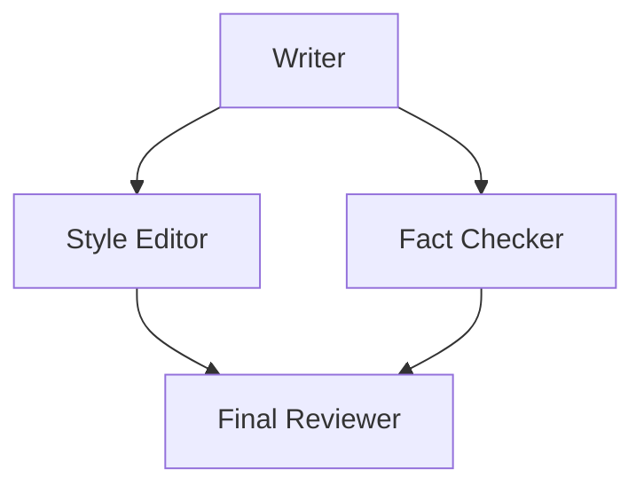
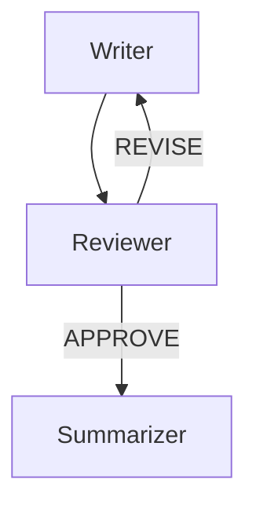
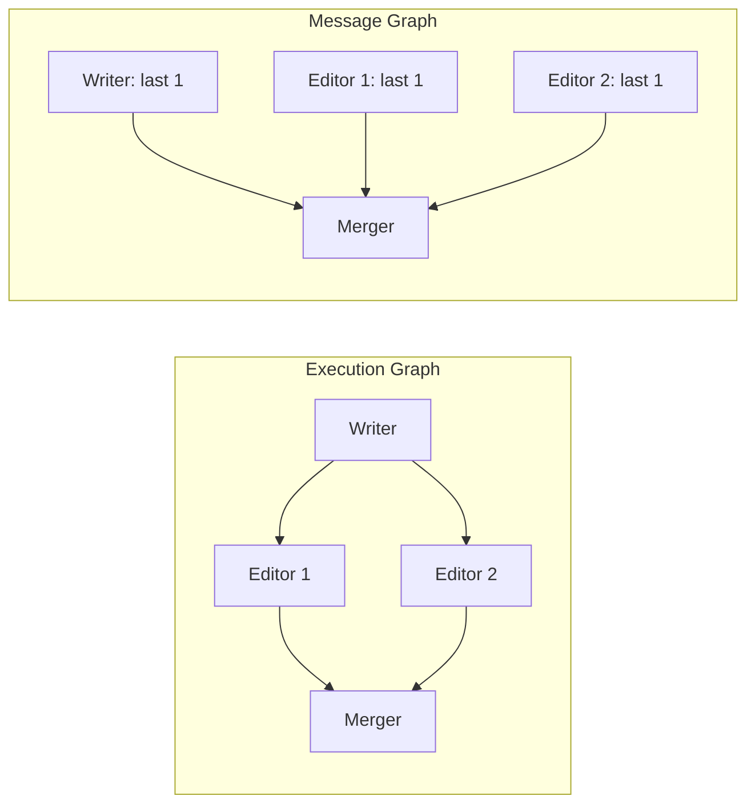
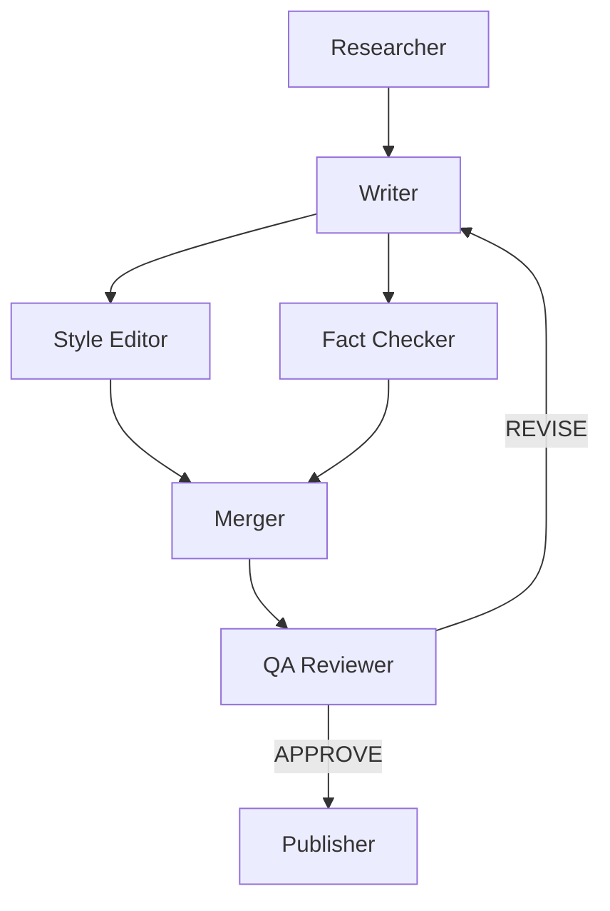

# GraphFlow DAG Workflows

## Introduction

Most real-world AI workflows don't follow a simple round-robin pattern. A research report might need parallel fact-checking before a final review. A code pipeline might branch into separate testing and documentation tracks, then merge results. These are **directed acyclic graph (DAG) workflows** — and AutoGen's **GraphFlow** gives you a declarative way to build them.

GraphFlow lets you define agent execution as a directed graph. Agents become nodes, edges define flow, and conditions on those edges control branching and looping. Instead of writing orchestration logic by hand, you describe the *shape* of your workflow and let the framework handle scheduling, message routing, and join semantics.

> **Warning:** GraphFlow is an **experimental feature** introduced in AutoGen AgentChat 0.7.5. Its API may change in future releases. Pin your dependency version (`autogen-agentchat==0.7.5`) for production use and monitor the changelog for breaking changes.

### What we'll cover

- The GraphFlow execution model and when to use it
- Building graphs with the `DiGraphBuilder` fluent API
- Sequential chains, parallel fan-outs, and fan-in joins
- Conditional branching with lambda predicates
- Loops and cycles with explicit entry points
- Controlling agent context with `MessageFilterAgent`
- Best practices and common pitfalls

### Prerequisites

- Familiarity with AutoGen AgentChat agents and teams ([Agent Architecture](./02-agent-architecture.md))
- Understanding of team-based orchestration ([Team Orchestration](./04-team-orchestration.md))
- Python 3.10+ and `autogen-agentchat >= 0.7.5` installed
- A working OpenAI or Azure OpenAI API key

---

## Understanding GraphFlow

### The core concept

GraphFlow models your workflow as a **directed graph**:

- **Nodes** are agents (any `ChatAgent` implementation)
- **Edges** define execution order (who runs after whom)
- **Conditions** on edges control branching (optional lambda predicates)
- **Activation groups** control join behavior (wait for all predecessors or any single one)



This simple graph says: *A runs first, then B and C run in parallel, then D runs after both B and C complete.*

### When to use GraphFlow

| Pattern | Use GraphFlow? | Alternative |
|---------|---------------|-------------|
| Simple back-and-forth | No | `RoundRobinGroupChat` |
| Dynamic agent selection | No | `SelectorGroupChat` |
| Fixed multi-step pipeline | **Yes** | — |
| Parallel processing with merge | **Yes** | — |
| Conditional branching logic | **Yes** | — |
| Review loops with exit conditions | **Yes** | — |

Choose GraphFlow when your workflow has a **known structure** with parallelism, branching, or joins. If agent selection needs to be dynamic and unpredictable, stick with selector-based teams.

### Execution graph vs. message graph

GraphFlow separates two concerns that other frameworks conflate:

- **Execution graph** — defines **who runs when**. Agent A finishes, so agents B and C start.
- **Message graph** — defines **what each agent sees**. Agent D might only need the output from C, not B.

By default, every agent sees all preceding messages. You control the message graph separately using `MessageFilterAgent` (covered below). This separation keeps your orchestration logic clean and your agent prompts focused.

---

## DiGraphBuilder Basics

The `DiGraphBuilder` provides a fluent API for constructing execution graphs. You add nodes, wire edges, and call `build()` to produce an immutable graph structure.

```python
import asyncio
from autogen_agentchat.agents import AssistantAgent
from autogen_agentchat.teams import DiGraphBuilder, GraphFlow
from autogen_agentchat.conditions import TextMentionTermination
from autogen_ext.models.openai import OpenAIChatCompletionClient

model = OpenAIChatCompletionClient(model="gpt-4o-mini")

# Define agents
writer = AssistantAgent(
    "writer",
    model_client=model,
    system_message="You are a technical writer. Write a concise paragraph on the given topic.",
)
reviewer = AssistantAgent(
    "reviewer",
    model_client=model,
    system_message=(
        "You are an editor. Review the writing for clarity and correctness. "
        "Provide brief feedback, then say APPROVE."
    ),
)

# Build the graph
builder = DiGraphBuilder()
builder.add_node(writer).add_node(reviewer)
builder.add_edge(writer, reviewer)
graph = builder.build()

# Create and run the flow
flow = GraphFlow(
    participants=[writer, reviewer],
    graph=graph,
    termination_condition=TextMentionTermination("APPROVE"),
)

async def main():
    result = await flow.run(task="Explain what a DAG is in computing.")
    for msg in result.messages:
        print(f"[{msg.source}]: {msg.to_model_text()[:120]}")

asyncio.run(main())
```

**Output:**
```
[user]: Explain what a DAG is in computing.
[writer]: A Directed Acyclic Graph (DAG) is a data structure consisting of nodes connected by directed edges, with no cycles...
[reviewer]: This is a clear and accurate explanation. The paragraph covers the key properties well. APPROVE
```

### Key DiGraphBuilder methods

| Method | Purpose |
|--------|---------|
| `add_node(agent)` | Register an agent as a graph node |
| `add_edge(source, target)` | Add a directed edge between two agents |
| `add_edge(source, target, condition=fn)` | Add a conditional edge |
| `set_entry_point(agent)` | Designate the starting agent (required for cycles) |
| `build()` | Produce the immutable graph dictionary |

All methods except `build()` return the builder instance, enabling method chaining.

---

## Sequential Workflows

The simplest GraphFlow pattern is a linear chain. Each agent runs after the previous one completes.



```python
researcher = AssistantAgent(
    "researcher",
    model_client=model,
    system_message="Research the given topic. List 3 key facts.",
)
writer = AssistantAgent(
    "writer",
    model_client=model,
    system_message="Using the research provided, write a short summary paragraph.",
)
editor = AssistantAgent(
    "editor",
    model_client=model,
    system_message="Polish the summary for grammar and clarity. Output the final version.",
)

builder = DiGraphBuilder()
builder.add_node(researcher).add_node(writer).add_node(editor)
builder.add_edge(researcher, writer)
builder.add_edge(writer, editor)
graph = builder.build()

flow = GraphFlow(participants=[researcher, writer, editor], graph=graph)

async def main():
    result = await flow.run(task="Quantum computing basics")
    for msg in result.messages:
        print(f"[{msg.source}]: {msg.to_model_text()[:100]}")

asyncio.run(main())
```

**Output:**
```
[user]: Quantum computing basics
[researcher]: 1. Quantum computers use qubits that can exist in superposition... 2. Entanglement allows...
[writer]: Quantum computing represents a paradigm shift in computation. Unlike classical bits, qubits can...
[editor]: Quantum computing represents a paradigm shift in computation. Unlike classical bits, which hold...
```

GraphFlow auto-detects **source nodes** (no incoming edges) and **leaf nodes** (no outgoing edges). Source nodes receive the initial task. The flow completes when all leaf nodes finish — or when a termination condition triggers.

---

## Parallel Execution with Joins

Real workflows often have steps that can run simultaneously. GraphFlow handles **fan-out** (one node triggers multiple successors) and **fan-in** (multiple nodes feed into one successor) natively.



```python
writer = AssistantAgent(
    "writer", model_client=model,
    system_message="Write a short paragraph about renewable energy trends.",
)
style_editor = AssistantAgent(
    "style_editor", model_client=model,
    system_message="Review only the writing style. Suggest improvements.",
)
fact_checker = AssistantAgent(
    "fact_checker", model_client=model,
    system_message="Verify factual claims. Flag anything inaccurate.",
)
final_reviewer = AssistantAgent(
    "final_reviewer", model_client=model,
    system_message="Combine the style and fact-check feedback. Produce a final revised paragraph.",
)

builder = DiGraphBuilder()
builder.add_node(writer)
builder.add_node(style_editor)
builder.add_node(fact_checker)
builder.add_node(final_reviewer)

# Fan-out: writer → two editors
builder.add_edge(writer, style_editor)
builder.add_edge(writer, fact_checker)

# Fan-in: both editors → final reviewer
builder.add_edge(style_editor, final_reviewer)
builder.add_edge(fact_checker, final_reviewer)

graph = builder.build()

flow = GraphFlow(
    participants=[writer, style_editor, fact_checker, final_reviewer],
    graph=graph,
)

async def main():
    result = await flow.run(task="Write about solar energy growth in 2025.")
    for msg in result.messages:
        print(f"[{msg.source}]: {msg.to_model_text()[:100]}")

asyncio.run(main())
```

**Output:**
```
[user]: Write about solar energy growth in 2025.
[writer]: Solar energy capacity surged in 2025, with global installations exceeding 350 GW for the first...
[style_editor]: The writing is clear but could benefit from stronger transitions. Consider opening with a...
[fact_checker]: The 350 GW figure aligns with IEA projections. The claim about cost reduction is accurate...
[final_reviewer]: Solar energy capacity surged in 2025, driven by unprecedented investment. Global install...
```

### Activation groups and join semantics

By default, a node with multiple incoming edges waits for **all** predecessors to finish before running. You can change this with activation groups:

```python
# Wait for ALL predecessors (default)
builder.add_edge(style_editor, final_reviewer, activation_group="review")
builder.add_edge(fact_checker, final_reviewer, activation_group="review")
# activation_condition defaults to "all"

# Wait for ANY single predecessor
builder.add_edge(fast_path, merger, activation_group="race", activation_condition="any")
builder.add_edge(slow_path, merger, activation_group="race", activation_condition="any")
```

Use `activation_condition="any"` for **race patterns** where you want the first available result. Use the default `"all"` for merge patterns where you need every input.

---

## Conditional Branching

Edges can carry **condition functions** that inspect the last message and decide whether the edge fires. This enables routing agents down different paths based on their output.



```python
writer = AssistantAgent(
    "writer", model_client=model,
    system_message=(
        "Write or revise a paragraph based on the given topic and any feedback. "
        "Produce only the paragraph text."
    ),
)
reviewer = AssistantAgent(
    "reviewer", model_client=model,
    system_message=(
        "Review the paragraph. If it meets quality standards, respond with APPROVE. "
        "If it needs work, respond with REVISE followed by specific feedback."
    ),
)
summarizer = AssistantAgent(
    "summarizer", model_client=model,
    system_message="Create a one-sentence summary of the approved paragraph.",
)

builder = DiGraphBuilder()
builder.add_node(writer)
builder.add_node(reviewer)
builder.add_node(summarizer)

builder.add_edge(writer, reviewer)

# Conditional edges from reviewer
builder.add_edge(
    reviewer, summarizer,
    condition=lambda msg: "APPROVE" in msg.to_model_text(),
)
builder.add_edge(
    reviewer, writer,
    condition=lambda msg: "REVISE" in msg.to_model_text(),
)

graph = builder.build()

flow = GraphFlow(
    participants=[writer, reviewer, summarizer],
    graph=graph,
    termination_condition=TextMentionTermination("TERMINATE"),
)

async def main():
    result = await flow.run(task="Write about the benefits of open-source software.")
    for msg in result.messages:
        print(f"[{msg.source}]: {msg.to_model_text()[:100]}")

asyncio.run(main())
```

**Output:**
```
[user]: Write about the benefits of open-source software.
[writer]: Open-source software offers numerous advantages for developers and organizations alike. It fosters...
[reviewer]: APPROVE — the paragraph is well-structured and covers key benefits clearly.
[summarizer]: Open-source software accelerates innovation through community collaboration, transparency, an...
```

### Writing condition functions

Condition functions receive the last `ChatMessage` from the source agent and return a boolean:

```python
# Simple keyword check
condition=lambda msg: "APPROVE" in msg.to_model_text()

# More robust check with case-insensitivity
def needs_revision(msg):
    text = msg.to_model_text().upper()
    return "REVISE" in text or "NEEDS WORK" in text

builder.add_edge(reviewer, writer, condition=needs_revision)
```

> **Tip:** Keep conditions simple and deterministic. Complex logic in condition functions makes workflows hard to debug. If you need sophisticated routing, consider a dedicated "router" agent whose sole job is to output a clear keyword.

---

## Loops and Cycles

When your graph contains cycles (e.g., writer → reviewer → writer), there are no source nodes. You must explicitly set an **entry point** so GraphFlow knows where to begin.

```python
builder = DiGraphBuilder()
builder.add_node(writer)
builder.add_node(reviewer)

# Cycle: writer → reviewer → writer (on revision)
builder.add_edge(writer, reviewer)
builder.add_edge(
    reviewer, writer,
    condition=lambda msg: "REVISE" in msg.to_model_text(),
)
builder.add_edge(
    reviewer, summarizer,
    condition=lambda msg: "APPROVE" in msg.to_model_text(),
)

# Required for cycles: designate the starting agent
builder.set_entry_point(writer)

graph = builder.build()
```

Without `set_entry_point()`, the builder raises an error because it cannot auto-detect source nodes in a cyclic graph.

### Preventing infinite loops

Always pair cycles with an exit condition. Common strategies:

1. **Keyword-based exit** — the reviewer says "APPROVE" to break the loop
2. **Termination condition on the flow** — `MaxMessageTermination(max_messages=10)` as a safety net
3. **Counter in system prompt** — instruct the reviewer to approve after at most 2 revision rounds

```python
from autogen_agentchat.conditions import MaxMessageTermination, TextMentionTermination

flow = GraphFlow(
    participants=[writer, reviewer, summarizer],
    graph=graph,
    termination_condition=(
        TextMentionTermination("APPROVE") | MaxMessageTermination(max_messages=12)
    ),
)
```

---

## Message Filtering

By default, every agent in a GraphFlow sees the full conversation history. This can degrade performance — a fact-checker doesn't need to see style feedback, and a summarizer might get confused by revision loops.

`MessageFilterAgent` wraps any agent and controls exactly which messages reach it.

```python
from autogen_agentchat.agents import (
    MessageFilterAgent,
    MessageFilterConfig,
    PerSourceFilter,
)

# The reviewer only sees the writer's last message
filtered_reviewer = MessageFilterAgent(
    agent=reviewer,
    filter=MessageFilterConfig(
        per_source=[
            PerSourceFilter(source="writer", position="last", count=1),
        ]
    ),
)

# The final reviewer sees the last message from each editor
filtered_final = MessageFilterAgent(
    agent=final_reviewer,
    filter=MessageFilterConfig(
        per_source=[
            PerSourceFilter(source="style_editor", position="last", count=1),
            PerSourceFilter(source="fact_checker", position="last", count=1),
        ]
    ),
)
```

### PerSourceFilter options

| Parameter | Type | Description |
|-----------|------|-------------|
| `source` | `str` | Agent name to filter messages from |
| `position` | `"first"` \| `"last"` | Take from the start or end of that agent's messages |
| `count` | `int` | How many messages to include |

### Why message filtering matters



The execution graph determines *order*. The message graph determines *context*. Separating these lets you build complex workflows without bloating token usage or confusing agents with irrelevant conversation history.

---

## Best Practices

1. **Start simple, add complexity incrementally.** Begin with a sequential chain. Add parallelism only when you've validated the basic flow works.

2. **Name agents descriptively.** Agent names appear in logs and message sources. Use `"fact_checker"` not `"agent_2"`.

3. **Use message filtering aggressively.** Every message an agent doesn't need is wasted tokens and potential confusion. Filter by default.

4. **Always set termination conditions.** Even if your graph has natural leaf nodes, add a `MaxMessageTermination` as a safety net for conditional flows.

5. **Keep condition functions pure.** Don't put side effects in edge conditions. They should inspect the message and return a boolean — nothing else.

6. **Visualize before you run.** Sketch your graph (on paper, in Mermaid, or with the `graph` dict output) before writing code. Misplaced edges cause subtle bugs.

7. **Test with deterministic outputs first.** Use low temperature or mock agents to verify graph topology before adding real LLM calls.

## Common Pitfalls

| Pitfall | Symptom | Fix |
|---------|---------|-----|
| Missing `set_entry_point()` in cyclic graphs | `ValueError` at build time | Call `builder.set_entry_point(agent)` |
| Overlapping conditions that both match | Two branches fire simultaneously | Make conditions mutually exclusive |
| No exit condition in a loop | Infinite execution | Add `MaxMessageTermination` + keyword check |
| Agent sees too much context | Confused or off-topic responses | Wrap with `MessageFilterAgent` |
| Forgetting to include filtered agents in `participants` | `KeyError` at runtime | List the `MessageFilterAgent` wrapper, not the inner agent |
| Activation group mismatch | Join fires too early or never | Verify all edges into a join share the same `activation_group` |

---

## Hands-On Exercise

Build a **content pipeline** with the following graph structure:



**Requirements:**

1. The **Researcher** gathers 3 key points on a given topic
2. The **Writer** produces a paragraph from those points
3. **Style Editor** and **Fact Checker** run in parallel
4. The **Merger** combines feedback from both editors
5. **QA Reviewer** either approves or sends back to the Writer
6. **Publisher** outputs the final text
7. Use `MessageFilterAgent` so the Merger only sees the last message from each editor
8. Add a `MaxMessageTermination(max_messages=20)` safety net

**Starter code:**

```python
import asyncio
from autogen_agentchat.agents import (
    AssistantAgent,
    MessageFilterAgent,
    MessageFilterConfig,
    PerSourceFilter,
)
from autogen_agentchat.teams import DiGraphBuilder, GraphFlow
from autogen_agentchat.conditions import (
    MaxMessageTermination,
    TextMentionTermination,
)
from autogen_ext.models.openai import OpenAIChatCompletionClient

model = OpenAIChatCompletionClient(model="gpt-4o-mini")

# TODO: Define 6 agents (researcher, writer, style_editor, fact_checker, merger, qa_reviewer, publisher)
# TODO: Wrap merger with MessageFilterAgent
# TODO: Build the graph with DiGraphBuilder (remember set_entry_point for the cycle)
# TODO: Create GraphFlow with termination conditions
# TODO: Run the flow

async def main():
    result = await flow.run(task="The impact of AI on healthcare in 2025")
    for msg in result.messages:
        print(f"[{msg.source}]: {msg.to_model_text()[:120]}")
    print(f"\nTotal messages: {len(result.messages)}")

asyncio.run(main())
```

**Stretch goals:**
- Add a second QA pass that only checks formatting
- Use `activation_condition="any"` to create a race between style editor and fact checker
- Log which branch the QA reviewer takes on each iteration

---

## Summary

GraphFlow transforms agent orchestration from imperative control flow into **declarative graph definitions**. You describe the shape of your workflow — sequential chains, parallel branches, conditional routing, review loops — and the framework handles execution scheduling and message delivery.

Key takeaways:

- **DiGraphBuilder** provides a fluent API for constructing execution graphs with `add_node()`, `add_edge()`, and `build()`
- **Parallel fan-out** happens naturally when one node has multiple outgoing edges
- **Fan-in joins** wait for all predecessors by default, configurable with activation groups
- **Conditional edges** use lambda predicates to route execution based on agent output
- **Cycles require** `set_entry_point()` and should always have exit conditions
- **MessageFilterAgent** separates the execution graph from the message graph, keeping agent context focused and token-efficient
- The execution graph defines **who runs when**; the message graph defines **what they see**

**Next:** [Magentic-One System](./09-magentic-one-system.md)

---

## Further Reading

- [AutoGen GraphFlow Documentation](https://microsoft.github.io/autogen/stable/user-guide/agentchat-user-guide/graph-flow.html)
- [DiGraphBuilder API Reference](https://microsoft.github.io/autogen/stable/reference/python/autogen_agentchat/autogen_agentchat.teams.html)
- [MessageFilterAgent Guide](https://microsoft.github.io/autogen/stable/user-guide/agentchat-user-guide/message-filter-agent.html)
- [DAG Concepts — Wikipedia](https://en.wikipedia.org/wiki/Directed_acyclic_graph)

[Back to AutoGen AgentChat Overview](./00-autogen-agentchat.md)

<!-- Sources:
- AutoGen AgentChat 0.7.5 documentation (2025)
- Microsoft AutoGen GitHub repository
- AutoGen GraphFlow user guide and API reference
-->
