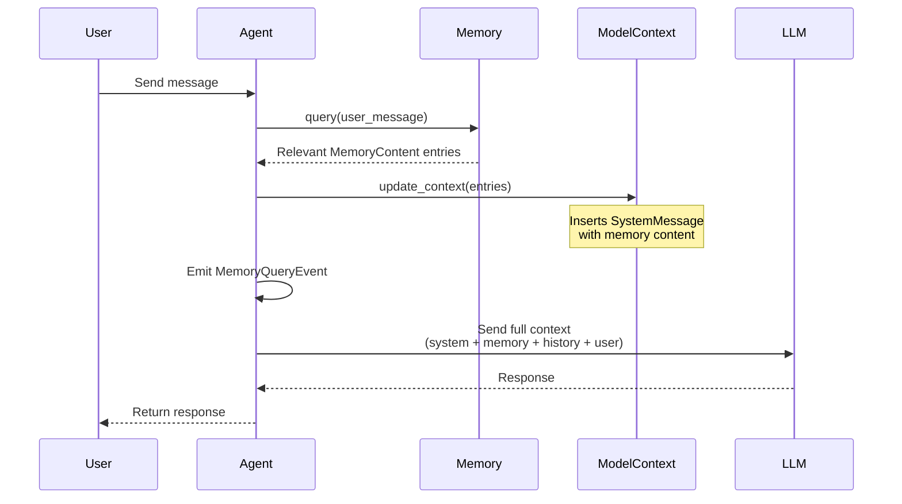

# State and memory

## Introduction

Production AI agents rarely operate in a single, uninterrupted session. Users return hours or days later expecting an agent to remember previous conversations. Teams of agents coordinate across long-running workflows that survive process restarts. Without a strategy for persisting what agents know, every interaction starts from scratch.

AutoGen AgentChat addresses this with two complementary mechanisms: **state** captures an agent's internal context (its conversation history, tool configurations, and model messages), while **memory** provides an external knowledge store that injects relevant information at runtime. Together, they let you build agents that remember, resume, and personalize.

### What you'll cover

- Saving and restoring agent state with `save_state()` and `load_state()`
- Persisting team-level state across all agents in a group
- Implementing the `Memory` protocol for runtime knowledge injection
- Using `ListMemory` for simple preference tracking
- Understanding how memory injection modifies the agent's context
- Choosing between state and memory for different use cases

### Prerequisites

- Familiarity with AutoGen AgentChat agents and teams ([Agent fundamentals](./02-assistant-agent.md))
- Basic async Python (`async`/`await`)
- Understanding of JSON serialization
- A working AutoGen installation (`pip install autogen-agentchat autogen-ext`)

---

## Understanding state in AutoGen

Every agent in AutoGen maintains internal state as it processes messages. This state includes the model context (the list of messages sent to and received from the LLM), tool configurations, and any custom data your agent tracks. When you call `save_state()`, AutoGen serializes this internal state into a plain Python dictionary.

AutoGen defines state at two levels:

**Agent state** (`AssistantAgentState`) captures a single agent's context:

- `llm_messages` — the full conversation history stored in the agent's `model_context`
- Tool states — configuration and results from any attached tools
- Custom fields — any additional data added by subclasses

**Team state** (`TeamState`) captures the entire team's context:

- `agent_states` — a dictionary mapping each agent's name to its saved state
- `team_id` — the unique identifier for the team
- `message_thread` — the shared message history across all agents

This separation matters. Saving an individual agent's state is lightweight and useful for checkpointing a single conversation. Saving team state captures the full picture—every agent's context plus the coordination thread—making it ideal for resuming multi-agent workflows.

```python
from autogen_agentchat.agents import AssistantAgent

# Agent state is a Python dict
state = await agent.save_state()
print(type(state))
# <class 'dict'>

print(list(state.keys()))
# ['type', 'version', 'llm_messages', ...]
```

The returned dictionary is plain Python data—strings, lists, numbers, and nested dicts—so it serializes directly to JSON without custom encoders.

---

## Saving and loading agent state

The core API for agent persistence consists of two async methods:

| Method | Signature | Purpose |
|---|---|---|
| `save_state()` | `async def save_state() -> dict` | Serialize agent internals to a dictionary |
| `load_state()` | `async def load_state(state: dict) -> None` | Restore agent internals from a dictionary |

Here is a complete example that creates an agent, runs a conversation, saves the state to disk, and then restores it in a fresh agent instance:

```python
import json
from autogen_agentchat.agents import AssistantAgent
from autogen_ext.models.openai import OpenAIChatCompletionClient

model_client = OpenAIChatCompletionClient(model="gpt-4o-mini")

# Create agent and run a conversation
agent = AssistantAgent(
    name="assistant",
    model_client=model_client,
    system_message="You are a helpful coding assistant.",
)

response = await agent.on_messages(
    [TextMessage(content="What is a decorator in Python?", source="user")],
    cancellation_token=CancellationToken(),
)
print(response.chat_message.content[:80])

# Save state to file
state = await agent.save_state()
with open("agent_state.json", "w") as f:
    json.dump(state, f, indent=2)

print(f"State saved. Keys: {list(state.keys())}")
```

**Output:**

```
A decorator in Python is a function that takes another function and extends its...
State saved. Keys: ['type', 'version', 'llm_messages']
```

Now restore that state into a new agent:

```python
# Create a fresh agent (no conversation history)
new_agent = AssistantAgent(
    name="assistant",
    model_client=model_client,
    system_message="You are a helpful coding assistant.",
)

# Load saved state
with open("agent_state.json", "r") as f:
    saved_state = json.load(f)

await new_agent.load_state(saved_state)

# The agent now remembers the previous conversation
response = await new_agent.on_messages(
    [TextMessage(content="Can you show me an example of one?", source="user")],
    cancellation_token=CancellationToken(),
)
print(response.chat_message.content[:100])
```

**Output:**

```
Sure! Here's a simple decorator example:

def my_decorator(func):
    def wrapper():
        ...
```

The new agent picks up exactly where the previous one left off. It understands "one" refers to a decorator because the loaded state contains the full prior conversation.

---

## Team state management

When agents work together in a `RoundRobinGroupChat`, `SelectorGroupChat`, or any other team structure, you need to save the state of every agent plus the shared message thread. AutoGen handles this through `TeamState`.

```python
from autogen_agentchat.teams import RoundRobinGroupChat
from autogen_agentchat.conditions import MaxMessageTermination

# Build a team
planner = AssistantAgent(name="planner", model_client=model_client,
                         system_message="You plan solutions to problems.")
coder = AssistantAgent(name="coder", model_client=model_client,
                       system_message="You write Python code.")

team = RoundRobinGroupChat(
    participants=[planner, coder],
    termination_condition=MaxMessageTermination(max_messages=6),
)

# Run the team
result = await team.run(task="Create a function that calculates fibonacci numbers.")

# Save the entire team state
team_state = await team.save_state()

with open("team_state.json", "w") as f:
    json.dump(team_state, f, indent=2)

print(f"Team ID: {team_state['team_id']}")
print(f"Agents saved: {list(team_state['agent_states'].keys())}")
print(f"Message thread length: {len(team_state['message_thread'])}")
```

**Output:**

```
Team ID: round_robin_group_chat_01
Agents saved: ['planner', 'coder']
Message thread length: 6
```

Restoring a team follows the same pattern:

```python
# Rebuild team structure (must match original)
planner_new = AssistantAgent(name="planner", model_client=model_client,
                             system_message="You plan solutions to problems.")
coder_new = AssistantAgent(name="coder", model_client=model_client,
                           system_message="You write Python code.")

team_new = RoundRobinGroupChat(
    participants=[planner_new, coder_new],
    termination_condition=MaxMessageTermination(max_messages=6),
)

# Load saved state
with open("team_state.json", "r") as f:
    loaded_state = json.load(f)

await team_new.load_state(loaded_state)

# Continue from where we left off
result = await team_new.run(task="Now add memoization to improve performance.")
```

> **Important:** The team structure you create for loading must match the original—same agent names, same team type. AutoGen maps saved states to agents by name.

---

## The Memory protocol

State saves what happened in a conversation. Memory provides external knowledge that agents access at runtime. AutoGen defines a `Memory` protocol with five methods:

| Method | Purpose |
|---|---|
| `add(content)` | Store a new entry in the memory |
| `query(query)` | Retrieve relevant entries matching a query |
| `update_context(model_context)` | Inject retrieved memories into an agent's model context |
| `clear()` | Remove all entries from the memory |
| `close()` | Clean up resources (connections, file handles) |

Memory is not part of the agent's conversation history. Instead, it acts as a knowledge layer that the agent consults before generating each response. This makes memory ideal for:

- **User preferences** — "Always respond in Spanish" or "Use metric units"
- **Domain facts** — product catalogs, policy documents, FAQ entries
- **Cross-session context** — summaries of previous conversations
- **Shared team knowledge** — information that multiple agents should access

Any class implementing the `Memory` protocol can serve as a memory backend. AutoGen ships with `ListMemory` for simple use cases, and you can build custom implementations backed by vector databases, Redis, or any other store.

---

## ListMemory for simple preferences

`ListMemory` is the simplest memory implementation. It stores entries in chronological order and returns the most recent entries when queried. Despite its simplicity, it covers a wide range of practical needs.

```python
from autogen_agentchat.agents import AssistantAgent
from autogen_core.memory import ListMemory, MemoryContent, MemoryMimeType

# Create a memory store
user_memory = ListMemory(name="user_preferences")

# Add user preferences
await user_memory.add(
    MemoryContent(
        content="User prefers weather in metric units (Celsius, km/h).",
        mime_type=MemoryMimeType.TEXT,
    )
)
await user_memory.add(
    MemoryContent(
        content="User lives in Berlin, Germany.",
        mime_type=MemoryMimeType.TEXT,
    )
)
await user_memory.add(
    MemoryContent(
        content="User prefers concise answers, no more than 3 sentences.",
        mime_type=MemoryMimeType.TEXT,
    )
)

# Attach memory to agent
agent = AssistantAgent(
    name="assistant",
    model_client=model_client,
    system_message="You are a helpful assistant.",
    memory=[user_memory],  # List of Memory instances
)

# Run the agent — memory is automatically queried and injected
response = await agent.on_messages(
    [TextMessage(content="What's the weather like today?", source="user")],
    cancellation_token=CancellationToken(),
)
print(response.chat_message.content)
```

**Output:**

```
Currently in Berlin, it's around 4°C with light clouds and winds at 12 km/h. 
A slight chance of rain this afternoon.
```

The agent used metric units and referenced Berlin without being asked—those preferences came from memory, not from the conversation itself.

You can add multiple memory instances to an agent. Each one is queried independently:

```python
project_memory = ListMemory(name="project_context")
await project_memory.add(
    MemoryContent(
        content="Current project: Weather dashboard using React and Python FastAPI.",
        mime_type=MemoryMimeType.TEXT,
    )
)

agent = AssistantAgent(
    name="assistant",
    model_client=model_client,
    memory=[user_memory, project_memory],  # Multiple memory sources
)
```

---

## How memory injection works

When an agent with memory receives a message, AutoGen follows a specific sequence to incorporate stored knowledge into the LLM context. Understanding this flow helps you debug unexpected behavior and design effective memory strategies.



The key steps are:

1. **Query** — The agent calls `memory.query()` with the incoming user message. Each `Memory` instance returns its relevant entries.

2. **Context update** — The agent calls `memory.update_context()`, which inserts the retrieved content as a `SystemMessage` into the agent's model context. This message appears before the conversation history but after the agent's system message.

3. **Event emission** — A `MemoryQueryEvent` is added to the message stream. You can observe these events to debug what memory content the agent received.

4. **LLM call** — The LLM sees the full context: system message → injected memory → conversation history → current user message.

This means memory content influences every response but does not permanently alter the agent's state. If you save and load state, the injected memory messages are not included—they are re-queried each time.

```python
# Observe memory events in a stream
async for event in agent.on_messages_stream(
    [TextMessage(content="Suggest a restaurant", source="user")],
    cancellation_token=CancellationToken(),
):
    if hasattr(event, '__class__') and 'MemoryQueryEvent' in event.__class__.__name__:
        print(f"Memory injected: {event.content[:80]}...")
    elif hasattr(event, 'chat_message'):
        print(f"Response: {event.chat_message.content[:80]}...")
```

**Output:**

```
Memory injected: User lives in Berlin, Germany. User prefers concise answers, no...
Response: Try Nobelhart & Schmutzig on Friedrichstraße — innovative German cuisin...
```

---

## State vs memory: when to use each

State and memory serve different purposes. Choosing the wrong one leads to either bloated contexts or lost information.

| Aspect | State | Memory |
|---|---|---|
| **What it stores** | Conversation history, tool results, model messages | External knowledge, preferences, facts |
| **When it's used** | Restored once at agent startup | Queried on every message |
| **Persistence** | Explicit save/load by your code | Lives in the memory backend |
| **Grows with** | Conversation length | Entries you add |
| **Shared across agents** | No (per-agent) | Yes (attach same memory to multiple agents) |
| **Survives `reset()`** | No — reset clears state | Yes — memory is external |
| **Best for** | Resuming conversations, checkpointing | User preferences, domain knowledge, cross-session context |

**Use state when** you need to pause and resume a specific conversation. A customer support agent that handles a multi-step troubleshooting flow should save state between sessions so the user does not repeat themselves.

**Use memory when** you need to inject knowledge that transcends individual conversations. A user's language preference, a company's product catalog, or a summary of last week's interactions belong in memory.

**Use both together** for production systems. Save state for conversation continuity. Use memory for personalization and domain knowledge that applies across all conversations.

```python
# Production pattern: state + memory
user_memory = ListMemory(name="user_prefs")
await user_memory.add(MemoryContent(
    content="User is a senior developer. Skip basic explanations.",
    mime_type=MemoryMimeType.TEXT,
))

agent = AssistantAgent(
    name="assistant",
    model_client=model_client,
    memory=[user_memory],
)

# Conversation happens...
response = await agent.on_messages(messages, cancellation_token=token)

# Save state for this specific conversation
state = await agent.save_state()
with open(f"sessions/{session_id}.json", "w") as f:
    json.dump(state, f)

# Memory persists independently — available for future conversations
```

---

## Best practices

1. **Save state at natural breakpoints.** Checkpoint after each complete task or user interaction, not after every message. Frequent saves add I/O overhead without meaningful benefit.

2. **Version your state format.** AutoGen includes a `version` field in saved state. If you add custom fields in a subclass, include your own version key so you can migrate old state files.

3. **Keep memory entries focused.** Each `MemoryContent` entry should capture one fact or preference. "User prefers Python" is better than a paragraph mixing preferences with conversation history.

4. **Use descriptive memory names.** When attaching multiple memories, use the `name` parameter to distinguish them: `ListMemory(name="user_preferences")`, `ListMemory(name="project_context")`.

5. **Clean up with `close()`.** If your memory implementation holds database connections or file handles, call `await memory.close()` during shutdown to avoid resource leaks.

6. **Separate state storage by session.** Store each conversation's state in a file or database row keyed by session ID. Mixing states from different conversations corrupts context.

---

## Common pitfalls

**Mismatched agent names on load.** Team state maps agent states by name. If you rename an agent between save and load, its state silently disappears. Always use consistent agent names.

**Loading state into an incompatible agent.** An `AssistantAgent` with tools will have tool state in its saved dict. Loading that into a plain `AssistantAgent` without those tools causes errors. Match the agent configuration.

**Treating memory as state.** Adding entire conversation transcripts to memory bloats the context window on every future message. Memory should contain distilled knowledge, not raw history.

**Forgetting to reset before a new task.** If you load state from session A and then start session B, the agent carries session A's full history. Call `await agent.reset()` before starting a fresh conversation, then load the appropriate state.

**Not handling serialization edge cases.** State dictionaries may contain objects that don't serialize cleanly to JSON (like datetime objects from custom tools). Test your `json.dump()` calls and add custom serializers if needed.

---

## Hands-on exercise

Build a personal assistant that remembers user preferences across sessions:

1. Create a `ListMemory` with at least three user preferences (language, units, expertise level)
2. Create an `AssistantAgent` with that memory attached
3. Run a conversation where the agent uses those preferences
4. Save the agent's state to a JSON file
5. Create a new agent, load the state, and verify it continues the conversation correctly
6. Add a new preference to memory and confirm the agent uses it in subsequent responses

**Bonus:** Create a custom agent that overrides `save_state()` to include a `last_active` timestamp, and `load_state()` to print how long since the agent was last used.

```python
# Starter code
import json
from datetime import datetime
from autogen_agentchat.agents import AssistantAgent
from autogen_core.memory import ListMemory, MemoryContent, MemoryMimeType
from autogen_ext.models.openai import OpenAIChatCompletionClient

model_client = OpenAIChatCompletionClient(model="gpt-4o-mini")

# Step 1: Create memory with preferences
user_memory = ListMemory(name="user_preferences")
# TODO: Add at least 3 preferences

# Step 2: Create agent with memory
# TODO: Create AssistantAgent with memory parameter

# Step 3: Run a conversation
# TODO: Send a message and observe memory-influenced response

# Step 4: Save state
# TODO: Save to preferences_session.json

# Step 5: Restore in new agent
# TODO: Create new agent, load state, continue conversation

# Step 6: Add new preference
# TODO: Add preference, send new message, verify it's used
```

---

## Summary

AutoGen provides two mechanisms for persistence:

- **State** captures an agent's internal model context—conversation history, tool results, and custom data. Use `save_state()` and `load_state()` to pause and resume conversations. Team state extends this to save every agent in a group plus the shared message thread.

- **Memory** provides an external knowledge store that agents query on every message. The `Memory` protocol defines `add()`, `query()`, `update_context()`, `clear()`, and `close()` methods. `ListMemory` offers a simple chronological implementation. Memory content is injected as a `SystemMessage` before the LLM call, influencing the response without permanently altering the agent's state.

Use state for conversation continuity. Use memory for personalization and domain knowledge. Use both in production for robust, context-aware agents.

**Next:** [Memory and RAG](./12-memory-and-rag.md)

---

## Further reading

- [AutoGen AgentChat state management](https://microsoft.github.io/autogen/stable/user-guide/agentchat-user-guide/state.html)
- [AutoGen Memory protocol reference](https://microsoft.github.io/autogen/stable/user-guide/agentchat-user-guide/memory.html)
- [Python `json` module documentation](https://docs.python.org/3/library/json.html)

[Back to AutoGen AgentChat Overview](./00-autogen-agentchat.md)

<!-- Sources: AutoGen 0.4+ documentation, Microsoft AutoGen GitHub repository -->
