# ADK Architecture Overview

## Prerequisites

- Familiarity with Python async/await patterns
- Basic understanding of AI agents and LLMs
- Python 3.10+ installed
- Completion of [Google ADK Overview](./00-google-agent-development-kit.md)

## Introduction

Google's Agent Development Kit (ADK) is an open-source, production-ready framework for building AI agents. Released in 2025, ADK takes a refreshingly pragmatic approach to agent development: it is **model-agnostic**, supporting Gemini, Claude, Ollama, and any model accessible through LiteLLM, and it is **deployment-agnostic**, running identically whether we deploy locally, on Cloud Run, GKE, or Vertex AI Agent Engine.

In this lesson, we'll dissect ADK's architecture layer by layer. We'll explore the core abstractions — Agents, Runners, Sessions, Events, and Artifacts — understand how they interact, and build a working agent from scratch. By the end, we'll have a mental model of how every ADK application is structured and how data flows from user input to agent response.

---

## Core Architecture Components

ADK's architecture is built around six core abstractions. Each one has a single, well-defined responsibility, and together they form a clean pipeline for agent execution.

### Agent

The `Agent` class is the fundamental building block. At the base of the hierarchy sits `BaseAgent`, an abstract class that defines the interface every agent must implement. The class we'll use most often is `LlmAgent`, which Google conveniently aliases as `Agent` for brevity.

An `LlmAgent` wraps an LLM with instructions, tools, and optional sub-agents. Think of it as a self-contained unit of reasoning:

```python
from google.adk.agents import Agent

support_agent = Agent(
    name="support_agent",
    model="gemini-2.0-flash",
    instruction="You are a customer support agent. Help users resolve issues.",
    tools=[lookup_order, cancel_order],
    sub_agents=[escalation_agent],
)
```

**Expected output:**
```
# No output — this defines the agent. It runs when invoked by a Runner.
```

Key properties of an Agent include `name` (unique identifier), `model` (which LLM to use), `instruction` (the system prompt), `tools` (callable functions), and `sub_agents` (agents this agent can delegate to).

### Runner

The `Runner` orchestrates agent execution. It manages the event loop, routes tool calls back to the appropriate functions, handles delegation between agents, and collects the resulting events. We never call an agent directly — we always go through a Runner.

ADK provides two main Runner implementations:

- **`Runner`** — The full-featured runner that accepts any `SessionService`.
- **`InMemoryRunner`** — A convenience wrapper that bundles an `InMemorySessionService` for quick prototyping.

### Session

A `Session` represents a single conversation between a user and an agent. It contains two critical pieces of state:

- **Events** — The ordered list of messages exchanged (the conversation history).
- **State** — A key-value dictionary for storing arbitrary data that persists across turns.

Sessions are identified by a combination of `app_name`, `user_id`, and `session_id`, which lets us support multi-user, multi-conversation scenarios cleanly.

### SessionService

The `SessionService` manages session persistence. ADK ships with several implementations to match different deployment needs:

| Implementation | Backend | Use Case |
|---|---|---|
| `InMemorySessionService` | Python dict | Local dev, testing |
| `DatabaseSessionService` | aiosqlite / asyncpg | Production with SQL |
| `VertexAiSessionService` | Vertex AI | Google Cloud managed |

We can swap between these without changing any agent code — the Runner accepts any `SessionService` implementation.

### Event

The `Event` is the unit of communication in ADK. Every interaction — user messages, agent responses, tool calls, state changes — is captured as an Event. An Event contains:

- **`author`** — Who created it (`"user"` or the agent's name).
- **`content`** — The message content (text, function calls, function responses).
- **`actions`** — Side effects like `state_delta` (state changes), `transfer_to_agent` (delegation), or `escalate` (hand off to a human).

Events are append-only. Once stored in a session, they form an immutable audit trail of everything that happened.

### Artifact

An `Artifact` provides binary data storage — images, PDFs, generated files — tied to a specific session. Artifacts are stored and retrieved through the `ArtifactService`, keeping large binary data out of the event stream while maintaining a clear association with the conversation that produced them.

---

## ADK Architecture Diagram

The following diagram shows how these components interact during a typical agent invocation:

```mermaid
flowchart TD
    A["👤 User Input"] --> B["🔄 Runner"]
    B --> C{"📂 Session Lookup<br/>(SessionService)"}
    C -->|"Existing"| D["📋 Load Session"]
    C -->|"New"| E["📋 Create Session"]
    D --> F["🤖 Agent.run()"]
    E --> F
    F --> G["🧠 LLM Call"]
    G --> H{"Tool Call?"}
    H -->|"Yes"| I["🔧 Tool Execution"]
    I --> G
    H -->|"No"| J["📝 Response Generated"]
    J --> K["📦 Event Stored in Session"]
    K --> L["👤 Response to User"]

    style A fill:#4285F4,stroke:#333,color:#fff
    style B fill:#EA4335,stroke:#333,color:#fff
    style F fill:#FBBC05,stroke:#333,color:#000
    style G fill:#34A853,stroke:#333,color:#fff
    style I fill:#FF6D01,stroke:#333,color:#fff
    style L fill:#4285F4,stroke:#333,color:#fff
```



Notice the loop between the LLM call and tool execution. When the model decides it needs to call a tool, the Runner intercepts the request, executes the tool function, feeds the result back to the LLM, and lets it decide whether to call another tool or produce a final response. This loop continues until the model generates a text response — a pattern known as the **ReAct loop**.

---

## Project Structure

ADK enforces a standard project layout. Every agent project is a Python package with a predictable structure:

```
my_agent/
├── __init__.py        # Exports root_agent
├── agent.py           # Agent definition
├── tools.py           # Custom tool functions
├── prompts.py         # System instructions
├── .env               # API keys (GOOGLE_API_KEY, etc.)
└── requirements.txt   # Dependencies
```

**Expected output:**
```
# Directory structure — no runtime output.
```

The most important convention is in `__init__.py`. It **must** export a variable called `root_agent` for ADK's CLI tools to discover our agent:

```python
# my_agent/__init__.py
from .agent import root_agent
```

**Expected output:**
```
# No output — this is a module initializer.
```

This convention enables `adk web`, `adk api_server`, and `adk run` to automatically locate and load our agent without any additional configuration. If we forget to export `root_agent`, these commands will fail with an import error.

---

## Model Configuration

ADK supports multiple model providers through a clean string-based configuration.

### Model String Format

For Google models, we use the model name directly:

```python
agent = Agent(
    name="gemini_agent",
    model="gemini-2.0-flash",
    instruction="You are a helpful assistant.",
)
```

**Expected output:**
```
# No output — agent definition only.
```

For third-party models, we use the `litellm://` prefix:

```python
agent = Agent(
    name="claude_agent",
    model="litellm://anthropic/claude-sonnet-4-20250514",
    instruction="You are a helpful assistant.",
)
```

**Expected output:**
```
# No output — agent definition only.
```

### Generation Parameters

We can fine-tune model behavior with `generate_content_config`:

```python
from google.genai.types import GenerateContentConfig

agent = Agent(
    name="creative_agent",
    model="gemini-2.0-flash",
    instruction="You are a creative writing assistant.",
    generate_content_config=GenerateContentConfig(
        temperature=0.9,
        top_p=0.95,
        max_output_tokens=2048,
    ),
)
```

**Expected output:**
```
# No output — agent configured with custom generation parameters.
```

### Multi-Model Support

One of ADK's most powerful features is that different agents within the same application can use different models. A fast, cheap model can handle routing while a more capable model handles complex reasoning:

```python
router = Agent(
    name="router",
    model="gemini-2.0-flash",           # Fast and cheap for routing
    instruction="Route requests to the appropriate specialist.",
    sub_agents=[research_agent, code_agent],
)

research_agent = Agent(
    name="research_agent",
    model="litellm://anthropic/claude-sonnet-4-20250514",  # Strong at research
    instruction="You are a thorough research assistant.",
)
```

**Expected output:**
```
# No output — multi-model agent hierarchy defined.
```

---

## Building a Complete Minimal Agent

Let's put everything together. We'll create a minimal but complete ADK agent, then run it programmatically.

### Step 1 — Define the Agent

```python
# greeting_agent/agent.py
from google.adk.agents import Agent

root_agent = Agent(
    name="greeting_agent",
    model="gemini-2.0-flash",
    instruction="You are a helpful greeting agent. Greet users warmly.",
)
```

**Expected output:**
```
# No output — agent module defined.
```

### Step 2 — Export from Package

```python
# greeting_agent/__init__.py
from .agent import root_agent
```

**Expected output:**
```
# No output — package initializer.
```

### Step 3 — Run Programmatically

```python
import asyncio
from google.adk.runners import InMemoryRunner

async def main():
    runner = InMemoryRunner(agent=root_agent, app_name="greeting_app")
    user_id = "user_1"
    session = await runner.session_service.create_session(
        app_name="greeting_app", user_id=user_id
    )

    async for event in runner.run_async(
        user_id=user_id,
        session_id=session.id,
        new_message="Hello!",
    ):
        if event.content and event.content.parts:
            print(f"Agent: {event.content.parts[0].text}")

asyncio.run(main())
```

**Expected output:**
```
Agent: Hello there! 👋 It's wonderful to hear from you! How are you doing today?
```

The exact wording will vary on each run since the LLM generates responses dynamically, but we'll always receive a warm greeting.

---

## Running Agents

ADK provides multiple ways to run agents, each suited to a different stage of development.

### `adk web` — Development UI

```bash
adk web greeting_agent
```

**Expected output:**
```
INFO:     Started server process
INFO:     Uvicorn running on http://localhost:8000
```

This launches a browser-based development UI with a chat interface, an event inspector for examining individual events, and a session viewer for exploring state. It's the fastest way to iterate during development.

### `adk api_server` — Production REST API

```bash
adk api_server greeting_agent
```

**Expected output:**
```
INFO:     Started server process
INFO:     Uvicorn running on http://localhost:8000
```

This starts a production-ready REST API that exposes our agent over HTTP. It supports the same endpoints used by Vertex AI Agent Engine, making the transition from local development to cloud deployment seamless.

### `adk run` — CLI Execution

```bash
adk run greeting_agent
```

**Expected output:**
```
user: Hello!
greeting_agent: Hello there! It's great to meet you! How can I help you today?
```

This runs the agent in an interactive terminal session — useful for quick testing without a browser.

---

## Best Practices

| Practice | Description |
|---|---|
| **Always export `root_agent`** | The `__init__.py` must export `root_agent` for CLI tools to work |
| **Use descriptive agent names** | Names appear in event logs and multi-agent delegation |
| **Separate tools into `tools.py`** | Keeps agent definitions clean and tools reusable |
| **Store prompts in `prompts.py`** | Allows prompt iteration without touching agent logic |
| **Start with `InMemoryRunner`** | Prototype fast, switch to `DatabaseSessionService` for production |
| **Use `.env` for API keys** | Never hardcode credentials in agent or tool files |
| **Choose the right model per agent** | Use fast models for routing, capable models for reasoning |

---

## Common Pitfalls

| ❌ Don't | ✅ Do |
|---|---|
| Call `agent.run()` directly | Use a `Runner` to orchestrate execution |
| Forget to export `root_agent` in `__init__.py` | Always add `from .agent import root_agent` |
| Use synchronous code in tool functions | Use `async def` for I/O-bound tools |
| Hardcode API keys in source files | Use `.env` files and `os.getenv()` |
| Create one monolithic agent for everything | Decompose into focused sub-agents with clear responsibilities |
| Ignore the event stream | Inspect events during development to debug agent behavior |
| Use the same model for all agents | Match model capabilities to each agent's task complexity |

---

## Hands-on Exercise

**Task:** Create a minimal ADK agent that acts as a unit converter. The agent should convert between common units (kilometers to miles, Celsius to Fahrenheit, etc.) using a tool function.

**Requirements:**
1. Define a tool function `convert_units` that handles at least two conversion types.
2. Create an `Agent` with the tool attached.
3. Run it programmatically using `InMemoryRunner` and print the result for the query "Convert 100 kilometers to miles."

<details>
<summary>💡 Hints</summary>

- Tool functions in ADK are plain Python functions. The docstring becomes the tool description the LLM sees.
- Function parameters should have type hints — the LLM uses them to understand what arguments to pass.
- Remember to use `async for` when iterating over `runner.run_async()`.

</details>

<details>
<summary>✅ Solution</summary>

```python
import asyncio
from google.adk.agents import Agent
from google.adk.runners import InMemoryRunner


def convert_units(value: float, from_unit: str, to_unit: str) -> dict:
    """Convert a value between common measurement units.

    Args:
        value: The numeric value to convert.
        from_unit: The source unit (e.g., 'km', 'miles', 'celsius', 'fahrenheit').
        to_unit: The target unit (e.g., 'km', 'miles', 'celsius', 'fahrenheit').

    Returns:
        A dictionary with the original value, converted value, and units.
    """
    conversions = {
        ("km", "miles"): lambda v: v * 0.621371,
        ("miles", "km"): lambda v: v * 1.60934,
        ("celsius", "fahrenheit"): lambda v: (v * 9 / 5) + 32,
        ("fahrenheit", "celsius"): lambda v: (v - 32) * 5 / 9,
    }
    key = (from_unit.lower(), to_unit.lower())
    if key not in conversions:
        return {"error": f"Unsupported conversion: {from_unit} to {to_unit}"}

    result = conversions[key](value)
    return {
        "original_value": value,
        "original_unit": from_unit,
        "converted_value": round(result, 4),
        "converted_unit": to_unit,
    }


root_agent = Agent(
    name="unit_converter",
    model="gemini-2.0-flash",
    instruction=(
        "You are a unit conversion assistant. "
        "Use the convert_units tool to perform conversions. "
        "Present the result clearly to the user."
    ),
    tools=[convert_units],
)


async def main():
    runner = InMemoryRunner(agent=root_agent, app_name="converter_app")
    user_id = "user_1"
    session = await runner.session_service.create_session(
        app_name="converter_app", user_id=user_id
    )

    async for event in runner.run_async(
        user_id=user_id,
        session_id=session.id,
        new_message="Convert 100 kilometers to miles.",
    ):
        if event.content and event.content.parts:
            print(f"Agent: {event.content.parts[0].text}")


asyncio.run(main())
```

**Expected output:**
```
Agent: 100 kilometers is equal to 62.1371 miles.
```

</details>

---

## Summary

In this lesson, we explored the foundational architecture of Google's Agent Development Kit:

- ✅ **Agent** is the fundamental unit — `LlmAgent` (aliased as `Agent`) wraps an LLM with instructions, tools, and sub-agents
- ✅ **Runner** orchestrates execution, managing the event loop and tool call cycle
- ✅ **Session** holds conversation history (events) and persistent state (key-value pairs)
- ✅ **SessionService** handles persistence with swappable backends (in-memory, SQL, Vertex AI)
- ✅ **Event** is the immutable unit of communication, capturing every interaction
- ✅ **Artifact** stores binary data tied to sessions
- ✅ ADK is **model-agnostic** — use Gemini, Claude, or any LiteLLM-supported model
- ✅ ADK is **deployment-agnostic** — run locally, on Cloud Run, GKE, or Vertex AI Agent Engine
- ✅ The standard project structure with `root_agent` export enables seamless CLI and deployment tooling

---

## Next Steps

**Next:** [Agent Definition Patterns](./02-agent-definition-patterns.md)

## Further Reading

- [Google ADK Official Documentation](https://google.github.io/adk-docs/)
- [ADK GitHub Repository](https://github.com/google/adk-python)
- [ADK Quickstart Guide](https://google.github.io/adk-docs/get-started/quickstart/)
- [ADK Session Management](https://google.github.io/adk-docs/sessions/)
- [ADK Model Configuration](https://google.github.io/adk-docs/agents/llm-agents/)
- [LiteLLM Supported Providers](https://docs.litellm.ai/docs/providers)

---

[Back to Google ADK Overview](./00-google-agent-development-kit.md)

<!-- Sources:
- Google ADK Documentation: https://google.github.io/adk-docs/
- ADK GitHub Repository: https://github.com/google/adk-python
- ADK Quickstart: https://google.github.io/adk-docs/get-started/quickstart/
- ADK Agents Reference: https://google.github.io/adk-docs/agents/
- ADK Sessions Reference: https://google.github.io/adk-docs/sessions/
- ADK Tools Reference: https://google.github.io/adk-docs/tools/
- ADK Runners Reference: https://google.github.io/adk-docs/runtime/
- LiteLLM Documentation: https://docs.litellm.ai/docs/
-->
