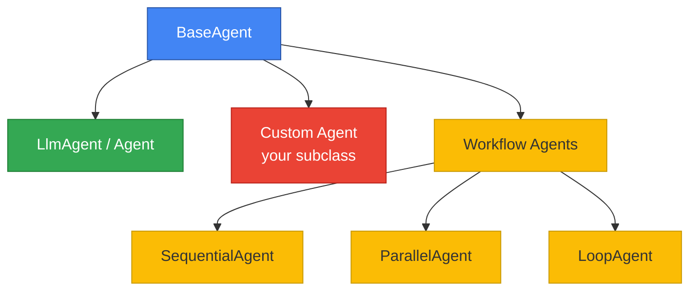

# Agent Definition Patterns in Google ADK

Google ADK provides multiple agent types, each designed for a different class of problem. Choosing the right pattern determines how cleanly your solution fits the task, how maintainable it stays as requirements evolve, and how well it composes with other agents in a larger system. In this lesson we explore the three core patterns — **LlmAgent**, **Custom Agents**, and **Workflow Agents** — and learn how to configure each one effectively.

**Prerequisites:**
- Completion of [ADK Architecture Overview](./01-adk-architecture-overview.md)
- Python 3.9+ with `google-adk` installed
- Familiarity with Pydantic models and async generators

---

## Agent Type Hierarchy

Before we dive into code, let's visualize how the agent types relate to each other. Every agent in ADK ultimately inherits from `BaseAgent`, which defines the execution contract. The framework ships three ready-made workflow agents and one LLM-powered agent; you can also subclass `BaseAgent` directly for full control.



`LlmAgent` (aliased as `Agent`) handles the vast majority of use cases. When you need deterministic orchestration logic — branching, looping, parallel fan-out — you reach for a Workflow Agent or a Custom Agent. Let's start with the most common pattern.

---

## LlmAgent — The Primary Agent Type

`LlmAgent` wraps a large language model call with tooling, state management, and delegation capabilities. The SDK aliases it as `Agent` for convenience, so you will see both names used interchangeably throughout the documentation.

### Key Parameters at a Glance

| Parameter | Type | Purpose |
|---|---|---|
| `name` | `str` | Unique identifier; used when other agents delegate to this one |
| `model` | `str` | Model string, e.g. `"gemini-2.0-flash"` or with a provider prefix |
| `description` | `str` | Tells a parent agent *when* to delegate here — critical in multi-agent trees |
| `instruction` | `str` | System prompt; supports `{variable}` templating from session state |
| `tools` | `list` | Tool functions or `Tool` objects the model may invoke |
| `sub_agents` | `list` | Child agents this agent can delegate to |
| `generate_content_config` | `GenerateContentConfig` | Temperature, top-p, safety settings, response modalities |
| `input_schema` | `BaseModel` | Pydantic model describing expected input structure |
| `output_schema` | `BaseModel` | Pydantic model enforcing structured output |
| `output_key` | `str` | Automatically persists the agent's output into session state under this key |
| `include_contents` | `str` | `"default"` (full history) or `"none"` (stateless, each turn independent) |
| `planner` | `Planner` | `BuiltInPlanner` or `PlanReActPlanner` for chain-of-thought reasoning |
| `code_executor` | `CodeExecutor` | `BuiltInCodeExecutor` for running model-generated code |

### A Minimal Agent

Let's create the simplest possible agent to confirm our mental model:

```python
from google.adk.agents import Agent

greeter = Agent(
    name="greeter",
    model="gemini-2.0-flash",
    instruction="You are a friendly greeter. Say hello and ask how you can help.",
)
```

```text
Expected output (when invoked with "Hi"):
> Hello! 👋 Welcome — how can I help you today?
```

Two lines of configuration and we have a working agent. The `name` uniquely identifies it, the `model` selects the LLM backend, and the `instruction` shapes its personality.

### Instruction Templating with Session State

Hard-coding every detail into the instruction is brittle. ADK supports `{variable}` placeholders that resolve against `session.state` at runtime, so the same agent definition adapts to different contexts without code changes.

```python
agent = Agent(
    name="support_agent",
    model="gemini-2.0-flash",
    instruction="""You are a support agent for {company_name}.
    The customer's tier is {user_tier}.
    Respond according to their service level.""",
)
# When session.state has {"company_name": "Acme", "user_tier": "premium"}
# the instruction automatically substitutes those values
```

```text
Expected behavior:
Instruction resolves to →
  "You are a support agent for Acme.
   The customer's tier is premium.
   Respond according to their service level."
```

This is especially powerful in multi-tenant applications where company name, user role, or feature flags vary per session.

### The `description` Field — Why It Matters

When an agent lives inside a multi-agent hierarchy, the parent agent reads each child's `description` to decide *which* child should handle the current request. A vague description leads to incorrect routing; a precise one makes delegation reliable.

```python
billing_agent = Agent(
    name="billing_agent",
    model="gemini-2.0-flash",
    description="Handles billing inquiries: invoices, payment methods, refunds, and subscription changes.",
    instruction="You are a billing specialist. Help the user with their billing question.",
)
```

```text
Expected effect:
A parent agent seeing a user ask "Where is my invoice?" will match
the description and delegate to billing_agent.
```

### `output_key` — Chaining Agents Through State

When you set `output_key`, ADK automatically writes the agent's final text output into `session.state[output_key]`. Downstream agents or tools can then read that value, creating a data pipeline without manual wiring.

```python
summarizer = Agent(
    name="summarizer",
    model="gemini-2.0-flash",
    instruction="Summarize the following text in two sentences.",
    output_key="summary",
)
# After the agent runs, session.state["summary"] contains the summary text.
```

```text
Expected state after invocation:
session.state == { "summary": "The document covers quarterly revenue..." }
```

### `include_contents` — Controlling History

By default (`"default"`), an agent sees the full conversation history. Setting `include_contents="none"` makes each turn independent — useful for stateless utility agents like classifiers or validators that should not be influenced by prior messages.

```python
classifier = Agent(
    name="intent_classifier",
    model="gemini-2.0-flash",
    instruction="Classify the user message as 'billing', 'technical', or 'general'. Output one word only.",
    include_contents="none",
    output_key="intent",
)
```

```text
Expected behavior:
Each invocation ignores previous turns.
Output: "billing"
State:  session.state["intent"] == "billing"
```

---

## Structured Output with Pydantic

Free-text responses are fine for conversation, but downstream code often needs reliable, typed data. ADK integrates with Pydantic `BaseModel` classes through `output_schema`, constraining the model to return valid JSON matching the schema.

```python
from pydantic import BaseModel
from google.adk.agents import Agent


class SentimentResult(BaseModel):
    sentiment: str  # "positive", "negative", "neutral"
    confidence: float
    reasoning: str


sentiment_agent = Agent(
    name="sentiment_analyzer",
    model="gemini-2.0-flash",
    instruction="Analyze the sentiment of the given text.",
    output_schema=SentimentResult,
    output_key="analysis_result",
)
```

```json
Expected output (parsed into SentimentResult):
{
  "sentiment": "positive",
  "confidence": 0.92,
  "reasoning": "The text uses enthusiastic language and expresses satisfaction."
}
```

Because `output_key` is also set, `session.state["analysis_result"]` holds the dictionary, making it available to the next agent in a pipeline.

### When to Use `input_schema`

If your agent expects a well-defined input payload (for example, from another agent or an API call), define `input_schema` the same way. ADK validates the incoming data before the model ever sees it, catching errors early.

---

## Custom Agents — Full Control

Sometimes you need logic that no declarative parameter can express: conditional branching based on external API calls, retry loops with back-off, or dynamic sub-agent selection. For these cases, subclass `BaseAgent` and implement the async execution method yourself.

### The Contract

A custom agent must:

1. Inherit from `BaseAgent`.
2. Implement `_run_async_impl(self, ctx: InvocationContext) -> AsyncGenerator[Event, None]`.
3. Declare any child agents as Pydantic fields and expose them via a `sub_agents` property so the framework can discover them.

### Router Agent Example

The following agent classifies the user's intent, then delegates to the appropriate specialist — a pattern that is impossible with a single `LlmAgent` because the routing logic is deterministic, not probabilistic.

```python
from google.adk.agents import BaseAgent, Agent
from google.adk.agents.invocation_context import InvocationContext
from google.adk.events import Event
from typing import AsyncGenerator
import pydantic


class RouterAgent(BaseAgent):
    """Routes requests to specialized agents based on intent."""

    classifier: Agent = pydantic.Field(...)
    specialist_a: Agent = pydantic.Field(...)
    specialist_b: Agent = pydantic.Field(...)

    @property
    def sub_agents(self):
        return [self.classifier, self.specialist_a, self.specialist_b]

    async def _run_async_impl(
        self, ctx: InvocationContext
    ) -> AsyncGenerator[Event, None]:
        # Run classifier first
        async for event in self.classifier.run_async(ctx):
            yield event

        # Check classification result from state
        intent = ctx.session.state.get("intent", "unknown")

        # Route to appropriate specialist
        target = self.specialist_a if intent == "type_a" else self.specialist_b
        async for event in target.run_async(ctx):
            yield event
```

```text
Expected flow:
1. classifier agent runs → sets session.state["intent"] = "type_a"
2. RouterAgent reads state → selects specialist_a
3. specialist_a runs → produces final response
```

### Why Use a Custom Agent Instead of Sub-Agents?

With plain `sub_agents` on an `LlmAgent`, the *model* decides which child to call. A custom agent lets *your code* decide, which is valuable when:

- Routing must follow business rules, not model judgment.
- You need loops, retries, or error-handling around child invocations.
- You want to compose workflow agents and LLM agents in the same execution flow.

---

## Workflow Agents — Declarative Orchestration

ADK includes three pre-built orchestration patterns that cover the most common multi-step pipelines. We introduce them briefly here; [Lesson 12](./12-workflow-agents.md) covers them in depth.

### SequentialAgent

Runs `sub_agents` one after another, in list order. Each agent can read state set by the previous one.

```python
from google.adk.agents import SequentialAgent

pipeline = SequentialAgent(
    name="analysis_pipeline",
    sub_agents=[classifier, sentiment_agent, summarizer],
)
```

```text
Expected execution order:
classifier → sentiment_agent → summarizer
```

### ParallelAgent

Runs `sub_agents` concurrently. Useful when tasks are independent — for example, fetching data from multiple sources at once.

```python
from google.adk.agents import ParallelAgent

multi_fetch = ParallelAgent(
    name="data_fetcher",
    sub_agents=[fetch_weather, fetch_news, fetch_stocks],
)
```

```text
Expected behavior:
All three agents run at the same time; results merge into session state.
```

### LoopAgent

Repeats its `sub_agents` in sequence until one of them emits an `escalate` action, signaling that the loop should terminate.

```python
from google.adk.agents import LoopAgent

refinement_loop = LoopAgent(
    name="refine_until_done",
    sub_agents=[drafter, reviewer],
)
```

```text
Expected behavior:
drafter → reviewer → drafter → reviewer → ... (until reviewer escalates)
```

---

## Agent Configuration Best Practices

| Practice | Rationale |
|---|---|
| Keep `instruction` focused and specific | Broad instructions cause the model to hallucinate scope it doesn't have |
| Write precise `description` values | Parent agents rely on descriptions for delegation — vague text leads to misrouting |
| Use `output_key` to chain outputs | Avoids manual state management; each agent deposits results for the next |
| Use `output_schema` for downstream code | Guarantees typed, parseable output; eliminates fragile regex parsing |
| Set `include_contents="none"` for utility agents | Prevents history contamination in classifiers, validators, and formatters |
| Prefer workflow agents over custom agents when possible | Less code, easier to test, and the framework handles concurrency for you |

---

## Common Pitfalls

| | Pitfall | Fix |
|---|---|---|
| ❌ | Omitting `description` on agents used as sub-agents | ✅ Always write a clear, specific `description` so the parent can delegate correctly |
| ❌ | Using the same `name` for two sibling agents | ✅ Names must be unique within a parent's `sub_agents` list |
| ❌ | Putting complex routing logic in `instruction` | ✅ Use a Custom Agent or Workflow Agent for deterministic control flow |
| ❌ | Relying on free-text output for data pipelines | ✅ Use `output_schema` with a Pydantic `BaseModel` for structured data |
| ❌ | Passing large history to stateless utility agents | ✅ Set `include_contents="none"` for classifiers and validators |
| ❌ | Forgetting `output_key` when chaining agents | ✅ Set `output_key` so downstream agents can read results from session state |
| ❌ | Hard-coding session-specific values in `instruction` | ✅ Use `{variable}` templating and populate values via session state |

---

## Hands-on Exercise

**Goal:** Build a two-agent pipeline where a classifier determines the language of a user message and a responder replies in that language.

**Requirements:**
1. Create a `language_classifier` agent that outputs structured data with `output_schema` and `output_key`.
2. Create a `multilingual_responder` agent whose `instruction` uses `{detected_language}` from session state.
3. Wire them together using a `SequentialAgent`.

<details>
<summary>💡 Hints</summary>

- Define a Pydantic model with a `language` field and a `confidence` field.
- Set `output_key="detected_language"` on the classifier (but note: structured output saves the full dict — you may need to adjust your templating or use a Custom Agent to extract the `language` field).
- The `SequentialAgent` simply takes a list: `sub_agents=[language_classifier, multilingual_responder]`.

</details>

<details>
<summary>✅ Solution</summary>

```python
from pydantic import BaseModel
from google.adk.agents import Agent, SequentialAgent


class LanguageDetection(BaseModel):
    language: str
    confidence: float


language_classifier = Agent(
    name="language_classifier",
    model="gemini-2.0-flash",
    instruction="Detect the language of the user's message. Return the language name in English.",
    output_schema=LanguageDetection,
    output_key="detected_language",
    include_contents="none",
)

multilingual_responder = Agent(
    name="multilingual_responder",
    model="gemini-2.0-flash",
    instruction="""The user's message was detected as: {detected_language}.
    Reply to the user in that same language. Be helpful and friendly.""",
)

pipeline = SequentialAgent(
    name="multilingual_pipeline",
    sub_agents=[language_classifier, multilingual_responder],
)
```

```text
Expected flow:
1. User sends: "Bonjour, comment ça va?"
2. language_classifier → {"language": "French", "confidence": 0.98}
   → session.state["detected_language"] = {"language": "French", ...}
3. multilingual_responder reads state, replies in French:
   "Bonjour ! Je vais bien, merci. Comment puis-je vous aider ?"
```

</details>

---

## Summary

✅ `LlmAgent` (aliased as `Agent`) is the primary building block — configure it with `instruction`, `tools`, `output_schema`, and `output_key` to cover most use cases.

✅ Instruction templating with `{variable}` keeps agent definitions reusable across sessions and tenants.

✅ `output_schema` with Pydantic models enforces structured, typed output that downstream code can rely on.

✅ Custom Agents (subclassing `BaseAgent`) give you full control over execution flow for conditional routing, retries, and loops.

✅ Workflow Agents (`SequentialAgent`, `ParallelAgent`, `LoopAgent`) handle common orchestration patterns declaratively.

✅ `description` is not optional in multi-agent systems — it is the primary signal the parent uses for delegation.

✅ `output_key` turns agents into composable pipeline stages by persisting results to session state.

---

## Next Steps

Continue to the next lesson where we explore how to give agents capabilities through tools:

→ **Next:** [Tool Creation in ADK](./03-tool-creation-in-adk.md)

← **Previous:** [ADK Architecture Overview](./01-adk-architecture-overview.md)

---

## Further Reading

- [Google ADK — Agent Configuration](https://google.github.io/adk-docs/agents/)
- [Google ADK — LLM Agent](https://google.github.io/adk-docs/agents/llm-agents/)
- [Google ADK — Custom Agents](https://google.github.io/adk-docs/agents/custom-agents/)
- [Google ADK — Workflow Agents](https://google.github.io/adk-docs/agents/workflow-agents/)
- [Pydantic Documentation — Models](https://docs.pydantic.dev/latest/concepts/models/)
- [Gemini API — Model Reference](https://ai.google.dev/gemini-api/docs/models)

---

[Back to Google ADK Overview](./00-google-agent-development-kit.md)

<!-- Sources:
- Google Agent Development Kit documentation: https://google.github.io/adk-docs/
- Google ADK GitHub repository: https://github.com/google/adk-python
- Google ADK Agents reference: https://google.github.io/adk-docs/agents/
- Google ADK LLM Agents: https://google.github.io/adk-docs/agents/llm-agents/
- Google ADK Custom Agents: https://google.github.io/adk-docs/agents/custom-agents/
- Google ADK Workflow Agents: https://google.github.io/adk-docs/agents/workflow-agents/
- Pydantic v2 documentation: https://docs.pydantic.dev/latest/
-->
