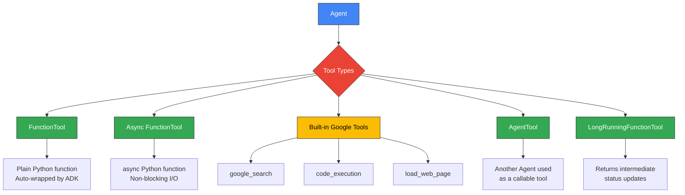

# Tool Creation in Google Agent Development Kit (ADK)

Tools are what transform an LLM from a sophisticated text generator into an agent that can *do things*. Without tools, an agent can only talk about the weather — with tools, it can actually check the forecast, book a flight, or update a database. In this lesson, we'll explore every tool type that Google ADK offers, from the simplest Python function to long-running asynchronous operations and agent-as-tool patterns.

**Prerequisites:**
- Familiarity with Python functions, type hints, and async/await
- Completion of [Agent Definition Patterns](./02-agent-definition-patterns.md)
- A working ADK environment (`google-adk` installed)

---

## How ADK Tools Work

When we attach a tool to an agent, ADK performs several things behind the scenes:

1. **Schema extraction** — ADK reads the function signature (parameter names, type hints) and docstring to build a JSON schema the LLM understands.
2. **Registration** — The tool is registered on the agent so the model knows it exists and when to call it.
3. **Invocation** — When the LLM decides to use a tool, ADK deserializes the model's arguments, calls our function, and feeds the return value back into the conversation.

The key insight is that **docstrings and type hints are not just for developers — they are the LLM's instruction manual** for each tool. A vague docstring produces vague tool usage.



---

## FunctionTool — The Most Common Tool Type

The simplest and most common way to create a tool in ADK is to write a plain Python function and pass it directly to the agent's `tools` list. ADK automatically wraps it in a `FunctionTool` for us.

Three parts of the function matter to the LLM:

| Part | What ADK Does With It |
|---|---|
| **Docstring** | Becomes the tool's description — the LLM reads this to decide *when* to use the tool |
| **Parameter type hints** | Become the tool's input schema — the LLM uses this to know *what* to pass |
| **Return value** | Becomes the tool result — the LLM reads this to formulate its response |

Let's build a weather tool:

```python
from google.adk import Agent

def get_weather(city: str) -> dict:
    """Get the current weather for a city.

    Args:
        city: The name of the city to get weather for.

    Returns:
        A dictionary with weather information.
    """
    # In production, call a real weather API
    return {
        "city": city,
        "temperature": 72,
        "condition": "sunny",
        "humidity": 45
    }

agent = Agent(
    name="weather_agent",
    model="gemini-2.0-flash",
    instruction="Help users check the weather.",
    tools=[get_weather],
)
```

Expected output (when the user asks "What's the weather in Tokyo?"):

```text
The weather in Tokyo is currently sunny with a temperature of 72°F and 45% humidity.
```

Notice we never instantiated `FunctionTool` ourselves — ADK handles that. The function's Google-style docstring is parsed so the LLM knows the tool "gets the current weather for a city" and requires a `city` string parameter.

### Multiple Parameters and Optional Arguments

Tools can accept multiple parameters, including optional ones with defaults:

```python
def search_products(
    query: str,
    category: str = "all",
    max_results: int = 5
) -> list[dict]:
    """Search for products in the catalog.

    Args:
        query: The search term to look for.
        category: Product category to filter by. Defaults to "all".
        max_results: Maximum number of results to return. Defaults to 5.

    Returns:
        A list of matching products.
    """
    # Simulated product search
    return [
        {"name": f"{query} Product {i}", "category": category, "price": 19.99 + i}
        for i in range(1, max_results + 1)
    ]
```

Expected output (when asked "Find me 3 electronics items about headphones"):

```text
Here are 3 electronics products matching "headphones":
1. headphones Product 1 — $20.99
2. headphones Product 2 — $21.99
3. headphones Product 3 — $22.99
```

The LLM can choose to pass or omit the optional parameters based on the user's request. ADK translates Python defaults into the schema so the model knows what's required vs. optional.

---

## Async Tools

When a tool calls an external API or performs I/O, we should make it asynchronous so it doesn't block the event loop. ADK handles `async` functions just like synchronous ones — we simply define the function with `async def`:

```python
import aiohttp
from google.adk import Agent

async def fetch_stock_price(symbol: str) -> dict:
    """Fetch the current stock price for a given ticker symbol.

    Args:
        symbol: The stock ticker symbol (e.g., "AAPL").

    Returns:
        A dictionary with the symbol and its current price.
    """
    async with aiohttp.ClientSession() as session:
        async with session.get(
            f"https://api.example.com/stocks/{symbol}"
        ) as resp:
            data = await resp.json()
            return {"symbol": symbol, "price": data["price"]}

agent = Agent(
    name="stock_agent",
    model="gemini-2.0-flash",
    instruction="Help users check stock prices.",
    tools=[fetch_stock_price],
)
```

Expected output (when asked "What's AAPL trading at?"):

```text
Apple (AAPL) is currently trading at $198.50.
```

From the LLM's perspective, nothing changes — async is purely an infrastructure concern. The docstring and type hints work identically.

---

## ToolContext — Accessing Session State and Artifacts

Sometimes a tool needs to read or write session state, store artifacts, or access information about the current session. ADK provides `ToolContext` for exactly this purpose.

The rules are simple:

1. Add `tool_context: ToolContext` as the **last** parameter of the function.
2. ADK injects it automatically at runtime — the LLM never sees it in the schema.
3. Use it to read/write state, save artifacts, or inspect session metadata.

```python
from google.adk import Agent
from google.adk.tools import ToolContext

def save_preference(preference: str, tool_context: ToolContext) -> str:
    """Save a user preference.

    Args:
        preference: The preference to save.

    Returns:
        A confirmation message.
    """
    tool_context.state["user:preference"] = preference
    return f"Preference '{preference}' saved successfully."

def get_preference(tool_context: ToolContext) -> str:
    """Retrieve the user's saved preference.

    Returns:
        The saved preference or a message if none is set.
    """
    pref = tool_context.state.get("user:preference")
    if pref:
        return f"Your saved preference is: {pref}"
    return "No preference has been saved yet."

agent = Agent(
    name="preference_agent",
    model="gemini-2.0-flash",
    instruction="Help users save and retrieve their preferences.",
    tools=[save_preference, get_preference],
)
```

Expected output (when the user says "Save my preference as dark mode"):

```text
Preference 'dark mode' saved successfully.
```

Expected output (when the user then asks "What's my preference?"):

```text
Your saved preference is: dark mode
```

### State Key Prefixes

ADK uses key prefixes to control state scope:

| Prefix | Scope | Example |
|---|---|---|
| `user:` | Persists across sessions for the same user | `tool_context.state["user:lang"] = "en"` |
| `app:` | Shared across all users of the application | `tool_context.state["app:version"] = "2.0"` |
| *(no prefix)* | Session-scoped, lost when session ends | `tool_context.state["temp_data"] = value` |

### Saving Artifacts

We can also store binary or text artifacts (files, images, generated content) via `ToolContext`:

```python
from google.genai import types as genai_types

def generate_report(topic: str, tool_context: ToolContext) -> str:
    """Generate and save a text report on a topic.

    Args:
        topic: The topic to generate a report about.

    Returns:
        Confirmation that the report was saved.
    """
    report_content = f"# Report on {topic}\n\nThis is a detailed report..."
    artifact = genai_types.Part.from_text(text=report_content)
    version = tool_context.save_artifact(filename=f"{topic}_report.md", artifact=artifact)
    return f"Report on '{topic}' saved (version {version})."
```

Expected output:

```text
Report on 'AI trends' saved (version 0).
```

---

## Built-in Google Tools

ADK ships with several pre-built tools that tap into Google's ecosystem. We don't need to write any implementation code — just import and attach them.

### google_search

Provides web search capabilities powered by Google Search:

```python
from google.adk import Agent
from google.adk.tools import google_search

agent = Agent(
    name="research_agent",
    model="gemini-2.0-flash",
    instruction="Research topics using Google Search. Cite your sources.",
    tools=[google_search],
)
```

Expected output (when asked "What are the latest developments in quantum computing?"):

```text
Based on recent search results, here are the latest developments in quantum computing:

1. Google's Willow chip achieved a breakthrough in error correction...
2. IBM announced their 1,000+ qubit processor roadmap...

Sources:
- nature.com/articles/quantum-2025
- techcrunch.com/quantum-update
```

### code_execution

Lets the agent write and run Python code in a sandboxed environment:

```python
from google.adk import Agent
from google.adk.tools.built_in_code_execution import built_in_code_execution

agent = Agent(
    name="data_agent",
    model="gemini-2.0-flash",
    instruction="Help users with data analysis. Write and run Python code when needed.",
    tools=[built_in_code_execution],
)
```

Expected output (when asked "Calculate the first 10 Fibonacci numbers"):

```text
I ran the following code:

def fibonacci(n):
    a, b = 0, 1
    result = []
    for _ in range(n):
        result.append(a)
        a, b = b, a + b
    return result

print(fibonacci(10))

Output: [0, 1, 1, 2, 3, 5, 8, 13, 21, 34]
```

---

## AgentTool — Using Agents as Tools

Sometimes we want a parent agent to explicitly invoke another agent as a tool, rather than delegating to it as a sub-agent. `AgentTool` wraps an agent so it can be called like any other tool.

**Key difference from sub-agents:** With `sub_agents`, the parent *transfers control* to the child. With `AgentTool`, the parent *calls* the child, gets a result back, and continues its own work.

```python
from google.adk import Agent
from google.adk.tools import AgentTool

summarizer = Agent(
    name="summarizer",
    model="gemini-2.0-flash",
    instruction="Summarize the given text concisely in 2-3 sentences.",
)

translator = Agent(
    name="translator",
    model="gemini-2.0-flash",
    instruction="Translate the given text to the requested language.",
)

main_agent = Agent(
    name="main_agent",
    model="gemini-2.0-flash",
    instruction=(
        "Help users with research and content processing. "
        "Use the summarizer for condensing text and the translator for translations."
    ),
    tools=[
        AgentTool(agent=summarizer),
        AgentTool(agent=translator),
    ],
)
```

Expected output (when asked "Summarize this article and then translate the summary to Spanish"):

```text
**Summary:** The article discusses recent advances in renewable energy,
highlighting that solar panel efficiency has reached 47% in lab conditions
and wind energy costs have dropped by 30% since 2020.

**Spanish Translation:** El artículo analiza los avances recientes en energía
renovable, destacando que la eficiencia de los paneles solares ha alcanzado
el 47% en condiciones de laboratorio y los costos de la energía eólica han
disminuido un 30% desde 2020.
```

---

## Long-Running Tools with LongRunningFunctionTool

Some operations — large file processing, complex API workflows, batch jobs — take too long for a single synchronous call. `LongRunningFunctionTool` lets us return intermediate status updates so the agent can inform the user or continue other work while waiting.

```python
import asyncio
from google.adk.tools import LongRunningFunctionTool, ToolContext

async def process_large_dataset(
    dataset_url: str, tool_context: ToolContext
) -> dict:
    """Process a large dataset from a URL. This may take several minutes.

    Args:
        dataset_url: The URL of the dataset to process.

    Returns:
        Processing results with row count and summary statistics.
    """
    # Simulate long-running processing with status updates
    tool_context.state["processing_status"] = "downloading"
    await asyncio.sleep(2)

    tool_context.state["processing_status"] = "analyzing"
    await asyncio.sleep(3)

    return {
        "status": "complete",
        "rows_processed": 150_000,
        "anomalies_found": 23,
        "processing_time": "5.2s",
    }

agent = Agent(
    name="data_processor",
    model="gemini-2.0-flash",
    instruction="Help users process and analyze large datasets.",
    tools=[LongRunningFunctionTool(func=process_large_dataset)],
)
```

Expected output:

```text
I've started processing your dataset. This may take a few minutes...

Processing complete! Here are the results:
- Rows processed: 150,000
- Anomalies found: 23
- Processing time: 5.2 seconds
```

The agent remains responsive during long operations and can report progress back to the user.

---

## Best Practices

| Practice | Why It Matters |
|---|---|
| Write detailed, specific docstrings | The docstring is the LLM's *only* guide for when and how to use the tool |
| Use precise type hints (`str`, `int`, `list[str]`) | Type hints become the JSON schema — vague types confuse the model |
| One tool, one responsibility | Focused tools are easier for the LLM to select correctly |
| Return structured data (dicts/lists) | Structured returns give the LLM more to work with in its response |
| Handle errors gracefully, return error messages | Unhandled exceptions break the agent loop — return a helpful string instead |
| Use `ToolContext` for state, not global variables | Global state isn't session-safe; `ToolContext` scopes state correctly |
| Keep parameter counts low (≤ 5) | Too many parameters reduce the LLM's accuracy in filling them |
| Document the `Args:` section in Google style | ADK parses this to generate per-parameter descriptions in the schema |

---

## Common Pitfalls

| ❌ Don't | ✅ Do |
|---|---|
| Write a bare function with no docstring | Write a clear docstring explaining what the tool does and when to use it |
| Use `**kwargs` or untyped parameters | Use explicit, typed parameters so ADK can generate a proper schema |
| Put `tool_context` as the first parameter | Always place `tool_context: ToolContext` as the **last** parameter |
| Raise unhandled exceptions | Catch exceptions and return an informative error string |
| Store session data in global variables | Use `tool_context.state` with appropriate key prefixes |
| Create one mega-tool that does everything | Split into focused, single-purpose tools |
| Forget to document the `Args:` section | Include Google-style `Args:` so each parameter gets a description |
| Use synchronous HTTP calls in async agents | Use `aiohttp` or `httpx` for non-blocking I/O in async tools |

---

## Hands-on Exercise

**Build a Task Manager Agent with Multiple Tools**

Create an agent with three tools:
1. `add_task(title: str, priority: str, tool_context: ToolContext)` — Adds a task to state and returns confirmation.
2. `list_tasks(tool_context: ToolContext)` — Lists all tasks from state.
3. `complete_task(title: str, tool_context: ToolContext)` — Marks a task as complete.

**Requirements:**
- Store tasks in `tool_context.state` using the `"tasks"` key as a list of dicts.
- Each task dict should have `title`, `priority`, and `completed` fields.
- All three tools need proper docstrings and type hints.
- The agent instruction should tell the LLM when to use each tool.

**Hints:**

<details>
<summary>Hint 1: State initialization</summary>

Check if `"tasks"` exists in state before appending. If it doesn't, initialize it as an empty list:

```python
tasks = tool_context.state.get("tasks", [])
```

</details>

<details>
<summary>Hint 2: Completing a task</summary>

Loop through the task list, find the matching title, and update its `completed` field:

```python
for task in tasks:
    if task["title"].lower() == title.lower():
        task["completed"] = True
```

</details>

<details>
<summary>Solution</summary>

```python
from google.adk import Agent
from google.adk.tools import ToolContext


def add_task(title: str, priority: str, tool_context: ToolContext) -> str:
    """Add a new task to the task list.

    Args:
        title: The title of the task.
        priority: The priority level (low, medium, high).

    Returns:
        A confirmation message.
    """
    tasks = tool_context.state.get("tasks", [])
    tasks.append({"title": title, "priority": priority, "completed": False})
    tool_context.state["tasks"] = tasks
    return f"Task '{title}' added with {priority} priority."


def list_tasks(tool_context: ToolContext) -> str:
    """List all tasks and their status.

    Returns:
        A formatted list of all tasks.
    """
    tasks = tool_context.state.get("tasks", [])
    if not tasks:
        return "No tasks found."
    lines = []
    for t in tasks:
        status = "✅" if t["completed"] else "⬜"
        lines.append(f"{status} {t['title']} [{t['priority']}]")
    return "\n".join(lines)


def complete_task(title: str, tool_context: ToolContext) -> str:
    """Mark a task as complete.

    Args:
        title: The title of the task to complete.

    Returns:
        A confirmation or error message.
    """
    tasks = tool_context.state.get("tasks", [])
    for task in tasks:
        if task["title"].lower() == title.lower():
            task["completed"] = True
            tool_context.state["tasks"] = tasks
            return f"Task '{title}' marked as complete."
    return f"Task '{title}' not found."


agent = Agent(
    name="task_manager",
    model="gemini-2.0-flash",
    instruction=(
        "You are a task management assistant. "
        "Use add_task to create new tasks, list_tasks to show all tasks, "
        "and complete_task to mark tasks as done."
    ),
    tools=[add_task, list_tasks, complete_task],
)
```

</details>

---

## Summary

✅ **FunctionTool** is the most common tool type — ADK auto-wraps plain Python functions using their docstrings and type hints as the LLM-facing schema.

✅ **Async tools** use `async def` for non-blocking I/O and work identically from the LLM's perspective.

✅ **ToolContext** gives tools access to session state (with `user:`, `app:`, and session-scoped prefixes) and artifact storage — always place it as the last parameter.

✅ **Built-in Google tools** (`google_search`, `code_execution`, `load_web_page`) provide instant access to Google's ecosystem with zero implementation effort.

✅ **AgentTool** wraps an agent so a parent can call it explicitly as a tool, unlike sub-agent delegation which transfers control.

✅ **LongRunningFunctionTool** handles operations that take extended time, providing intermediate status updates.

✅ **Docstrings are critical** — they are the LLM's only guide for understanding when and how to invoke each tool.

---

## Next Steps

Continue to the next lesson where we'll compose multiple agents into hierarchies:

➡️ [Multi-Agent Hierarchies](./04-multi-agent-hierarchies.md)

---

## Further Reading

- [Google ADK Tools Documentation](https://google.github.io/adk-docs/tools/)
- [Google ADK FunctionTool Reference](https://google.github.io/adk-docs/tools/function-tools/)
- [Google ADK Built-in Tools](https://google.github.io/adk-docs/tools/built-in-tools/)
- [Google ADK ToolContext API](https://google.github.io/adk-docs/tools/tool-context/)
- [Google ADK AgentTool Reference](https://google.github.io/adk-docs/tools/agent-tool/)
- [Python Type Hints Documentation](https://docs.python.org/3/library/typing.html)

---

[Back to Google ADK Overview](./00-google-agent-development-kit.md)

<!-- Sources:
- Google Agent Development Kit documentation: https://google.github.io/adk-docs/
- Google ADK Tools guide: https://google.github.io/adk-docs/tools/
- Google ADK GitHub repository: https://github.com/google/adk-python
- Google ADK FunctionTool reference: https://google.github.io/adk-docs/tools/function-tools/
- Google ADK Built-in Tools: https://google.github.io/adk-docs/tools/built-in-tools/
- Google ADK ToolContext: https://google.github.io/adk-docs/tools/tool-context/
-->
