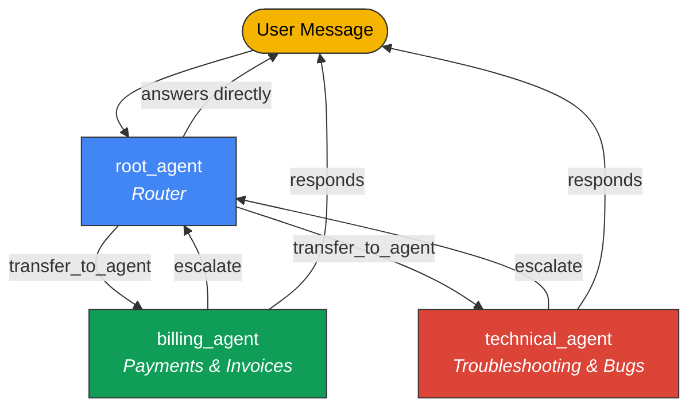
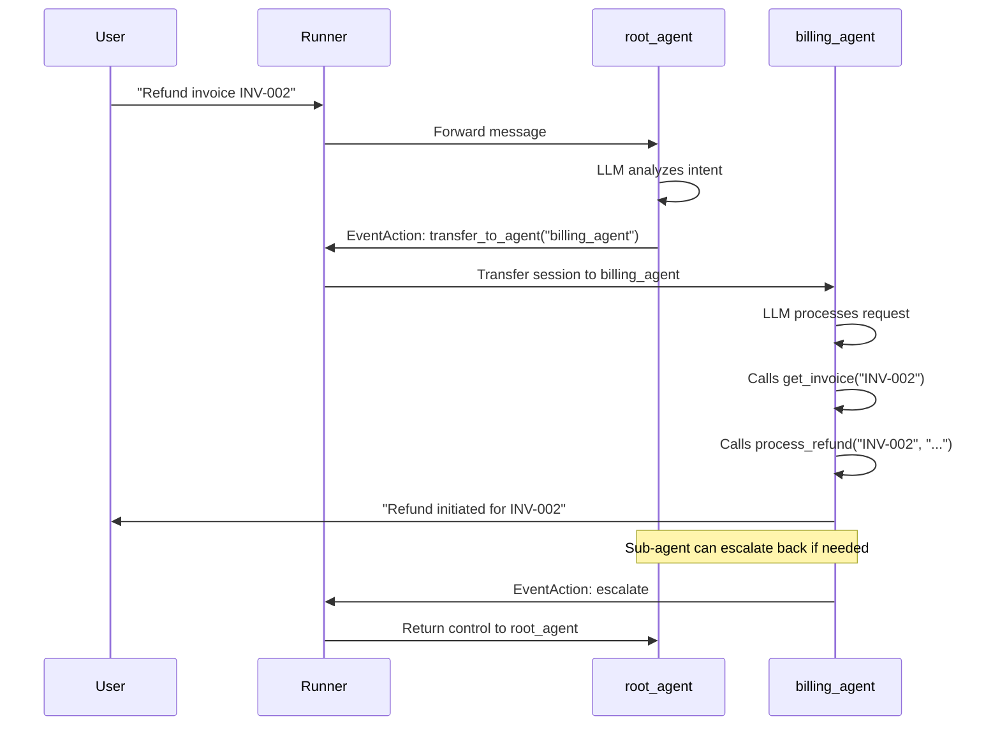

# Multi-Agent Hierarchies in Google ADK

Real-world AI applications rarely survive on a single agent. A customer-support bot needs to handle billing questions, technical troubleshooting, and account management—each requiring different tools, context, and expertise. Stuffing all of that into one monolithic agent leads to bloated instructions, confused routing, and brittle behavior.

Google's Agent Development Kit solves this with **multi-agent hierarchies**: a parent-child architecture where a root agent delegates work to specialized sub-agents, each scoped to a single responsibility. The parent's LLM decides *when* to delegate based on each sub-agent's `description` field—no manual routing logic, no if-else chains, no regex classifiers. The model reads the descriptions and transfers control to whichever agent best matches the user's intent.

In this lesson, we'll build a multi-agent customer support system from scratch, explore how delegation and escalation work under the hood, compare `sub_agents` with `AgentTool`, and design hierarchies that scale to three or more levels.

**Prerequisites:**

- Completion of [Tool Creation in ADK](./03-tool-creation-in-adk.md)
- Familiarity with the ADK `Agent` class and `Runner`
- Python 3.10+ with `google-adk` installed

---

## Agent Hierarchy Concepts

Before we write code, let's establish the vocabulary that ADK uses for multi-agent systems.

### The Root Agent

Every ADK application has exactly one **root agent**. This is the entry point for all user interactions—the `Runner` receives messages and forwards them to this agent first. The root agent can answer questions directly, but its primary role in a multi-agent system is to **analyze intent and delegate** to the right specialist.

### Sub-Agents

Sub-agents are child agents registered on a parent via the `sub_agents` parameter. Each sub-agent has its own `model`, `instruction`, and `tools`, making it a fully self-contained agent. The parent never calls sub-agent tools directly—it hands over the entire conversation.

### The Description Field

The `description` field is the single most important piece of a sub-agent's configuration. The parent agent's LLM reads every sub-agent's description to decide which one should handle the current request. A vague or overlapping description leads to misrouting. A precise description leads to reliable delegation.

### Transfer and Escalation

ADK provides two control-flow primitives for moving between agents:

- **`transfer_to_agent`** — An `EventAction` that transfers the active session from the current agent to a named target agent. The parent generates this when it decides to delegate.
- **`escalate`** — Returns control from a sub-agent back to its parent. The sub-agent generates this when a request falls outside its scope or when it has finished its task.



---

## Basic Multi-Agent Setup

Let's build a customer support system with two specialist agents—one for billing, one for technical support—and a root agent that routes between them.

### Defining Tool Functions

First, we create the tools each specialist will use:

```python
from google.adk.agents import Agent

# --- Billing tools ---
def get_invoice(invoice_id: str) -> dict:
    """Retrieve an invoice by its ID."""
    invoices = {
        "INV-001": {"id": "INV-001", "amount": 99.99, "status": "paid"},
        "INV-002": {"id": "INV-002", "amount": 249.00, "status": "overdue"},
    }
    return invoices.get(invoice_id, {"error": f"Invoice {invoice_id} not found"})


def process_refund(invoice_id: str, reason: str) -> dict:
    """Process a refund for a given invoice."""
    return {"status": "refund_initiated", "invoice_id": invoice_id, "reason": reason}


# --- Technical tools ---
def check_system_status(service_name: str) -> dict:
    """Check the operational status of a service."""
    return {"service": service_name, "status": "operational", "uptime": "99.97%"}


def create_ticket(title: str, description: str, priority: str = "medium") -> dict:
    """Create a support ticket."""
    return {"ticket_id": "TKT-4821", "title": title, "priority": priority}
```

### Building the Agent Hierarchy

Now we wire the agents together:

```python
# Specialist agents
billing_agent = Agent(
    name="billing_agent",
    model="gemini-2.0-flash",
    description="Handles billing inquiries, invoices, and payment issues.",
    instruction="""You are a billing specialist. Help with payment and invoice questions.
    If a request is outside billing scope, escalate back to the parent agent.""",
    tools=[get_invoice, process_refund],
)

technical_agent = Agent(
    name="technical_agent",
    model="gemini-2.0-flash",
    description="Handles technical support, troubleshooting, and bug reports.",
    instruction="""You are a technical support specialist. Help debug and resolve issues.
    If a request is outside technical scope, escalate back to the parent agent.""",
    tools=[check_system_status, create_ticket],
)

# Root agent delegates to specialists
root_agent = Agent(
    name="customer_support",
    model="gemini-2.0-flash",
    description="Main customer support agent that routes to specialists.",
    instruction="""You are the main customer support agent.
    Analyze the customer's request and delegate to the appropriate specialist:
    - For billing, payment, or invoice issues → delegate to billing_agent.
    - For technical problems, bugs, or outages → delegate to technical_agent.
    - For general questions, answer directly.""",
    sub_agents=[billing_agent, technical_agent],
)
```

Expected output when a user asks *"I was double-charged on invoice INV-002"*:

```text
[root_agent] → Analyzing intent... billing/payment issue detected.
[root_agent] → transfer_to_agent: billing_agent
[billing_agent] → Calling get_invoice("INV-002")
[billing_agent] → Invoice INV-002: $249.00, status: overdue
[billing_agent] → Calling process_refund("INV-002", "double charge")
[billing_agent] → Refund initiated for INV-002. You should see the credit within 5-7 business days.
```

---

## How Delegation Works

Let's trace the full lifecycle of a delegated request step by step.



Here is what happens at each stage:

1. **User sends a message** — The `Runner` receives the input and routes it to the `root_agent`.
2. **Root agent analyzes intent** — The root agent's LLM evaluates the message against every sub-agent's `description`. It does not call any tools itself; it decides *who* should handle the request.
3. **LLM generates `transfer_to_agent`** — When the LLM identifies the best sub-agent, ADK emits a `transfer_to_agent` event action with the target agent's name.
4. **Runner transfers the session** — The `Runner` re-routes the active session to the target sub-agent. The sub-agent now "owns" the conversation.
5. **Sub-agent processes and responds** — The sub-agent's LLM runs with its own instruction and tools. It can make multiple tool calls, carry on multi-turn dialogue, or respond directly.
6. **Escalation** — If the sub-agent encounters a request outside its scope, it generates an `escalate` action, and the `Runner` returns control to the parent.

---

## AgentTool vs sub_agents

ADK provides two mechanisms for one agent to leverage another. Choosing the wrong one leads to subtle bugs, so let's compare them clearly.

| Feature | `sub_agents` | `AgentTool` |
|---|---|---|
| **Control flow** | Full delegation — the sub-agent takes over the session | Tool call — the parent retains control |
| **Session history** | Sub-agent sees the full conversation history | Receives only the tool-call input string |
| **Use case** | Complex, multi-turn conversations requiring context | One-shot tasks (summarize, classify, extract) |
| **Response** | Sub-agent responds directly to the user | Returns a result string to the parent agent |
| **Escalation** | Sub-agent can escalate back to parent | Not applicable — parent already has control |

### When to Use Each

Use **`sub_agents`** when the child agent needs to carry on a conversation with the user—asking follow-up questions, making multiple tool calls, or maintaining dialogue context. The billing agent above is a good example: it may need to ask "Which invoice?" before proceeding.

Use **`AgentTool`** when you want a quick, self-contained computation. For instance, a `summarizer_agent` that condenses a long document into bullet points can run as a tool call—the parent sends the text, gets the summary back, and continues its own flow.

```python
from google.adk.tools import AgentTool

summarizer = Agent(
    name="summarizer",
    model="gemini-2.0-flash",
    description="Summarizes long text into concise bullet points.",
    instruction="Summarize the provided text into 3-5 bullet points.",
)

root_agent = Agent(
    name="assistant",
    model="gemini-2.0-flash",
    instruction="You are a helpful assistant. Use the summarizer for long documents.",
    tools=[AgentTool(agent=summarizer)],
)
```

Expected output when the parent calls the summarizer tool:

```text
[assistant] → AgentTool call: summarizer("The quarterly report shows revenue...")
[summarizer] → Returns: "• Revenue up 12% QoQ\n• Customer churn decreased..."
[assistant] → "Here's a summary of the report: • Revenue up 12% QoQ..."
```

---

## Hierarchical Depth: Multi-Level Agent Trees

For complex organizations, we can nest agents multiple levels deep. Each parent delegates to its own sub-agents, which can in turn delegate further.

```text
root_agent (customer_support)
├── sales_agent
│   ├── pricing_agent
│   └── demo_agent
├── support_agent
│   ├── billing_agent
│   └── technical_agent
└── general_agent
```

In code, this is simply nested `sub_agents` declarations:

```python
pricing_agent = Agent(
    name="pricing_agent",
    model="gemini-2.0-flash",
    description="Handles pricing questions, quotes, and discount requests.",
    instruction="You are a pricing specialist. Provide quotes and pricing info.",
)

demo_agent = Agent(
    name="demo_agent",
    model="gemini-2.0-flash",
    description="Schedules and manages product demos.",
    instruction="You help schedule product demonstrations.",
)

sales_agent = Agent(
    name="sales_agent",
    model="gemini-2.0-flash",
    description="Handles sales inquiries, pricing, and product demos.",
    instruction="Route pricing questions to pricing_agent, demo requests to demo_agent.",
    sub_agents=[pricing_agent, demo_agent],
)

root_agent = Agent(
    name="customer_support",
    model="gemini-2.0-flash",
    description="Main entry point for all customer interactions.",
    instruction="Route sales inquiries to sales_agent, support issues to support_agent.",
    sub_agents=[sales_agent, support_agent, general_agent],
)
```

Expected delegation path for *"Can I get a discount on the enterprise plan?"*:

```text
[customer_support] → transfer_to_agent: sales_agent
[sales_agent] → transfer_to_agent: pricing_agent
[pricing_agent] → "Enterprise plan starts at $499/mo. For teams over 50, we offer 15% off..."
```

> **⚠️ Keep hierarchy depth to 2–3 levels.** Each delegation adds latency (an extra LLM call for routing), and deeply nested trees become hard to debug. If you need more than three levels, consider flattening with `AgentTool` for leaf nodes.

---

## Shared State Across Agents

All agents in a hierarchy share the same `Session` object. This means state set by one agent is immediately visible to every other agent in the tree—no explicit message passing required.

Use the `output_key` parameter to write an agent's final response into session state under a named key:

```python
billing_agent = Agent(
    name="billing_agent",
    model="gemini-2.0-flash",
    description="Handles billing inquiries.",
    instruction="Help with billing questions.",
    output_key="billing_result",
    tools=[get_invoice],
)
```

After `billing_agent` responds, `session.state["billing_result"]` contains its output. Any other agent in the hierarchy can reference this value.

```python
# Another agent can read the billing result from shared session state
followup_agent = Agent(
    name="followup_agent",
    model="gemini-2.0-flash",
    description="Sends follow-up messages after support interactions.",
    instruction="""Check session state for 'billing_result'.
    If a refund was processed, confirm the timeline with the customer.""",
)
```

Expected behavior:

```text
[billing_agent] → Processes refund → state["billing_result"] = "Refund initiated for INV-002"
[followup_agent] → Reads state["billing_result"]
[followup_agent] → "Your refund for INV-002 has been initiated. Expect 5-7 business days."
```

---

## Best Practices

| Practice | Why It Matters |
|---|---|
| Write clear, distinct `description` fields | The parent LLM uses descriptions to route — vague descriptions cause misrouting |
| Keep agent responsibilities non-overlapping | Overlapping scopes force the LLM to guess, reducing reliability |
| Use the root agent as a router, not a doer | Mixing routing with task execution bloats instructions and confuses delegation |
| Limit hierarchy depth to 2–3 levels | Each level adds an LLM routing call; deep trees increase latency and debugging difficulty |
| Test delegation with ambiguous requests | Edge cases like "I have a billing bug" test whether routing holds under pressure |
| Add escalation instructions to every sub-agent | Without explicit escalation guidance, sub-agents may attempt tasks outside their scope |
| Use `output_key` for cross-agent data sharing | Structured state passing is more reliable than expecting agents to repeat information verbatim |

---

## Common Pitfalls

| ❌ Don't | ✅ Do |
|---|---|
| ❌ Write vague descriptions like `"Helps with stuff"` | ✅ Write specific descriptions: `"Handles billing inquiries, invoices, and payment issues"` |
| ❌ Give two sub-agents overlapping scopes | ✅ Define clear, non-overlapping boundaries for each agent |
| ❌ Nest agents 4+ levels deep | ✅ Keep hierarchies to 2–3 levels; flatten with `AgentTool` for leaf tasks |
| ❌ Forget escalation instructions in sub-agents | ✅ Always instruct sub-agents to escalate when requests are out of scope |
| ❌ Use `sub_agents` for one-shot tasks | ✅ Use `AgentTool` for single-turn, stateless computations |
| ❌ Rely on agents to relay data verbally between each other | ✅ Use `output_key` and shared session state for structured data passing |
| ❌ Put tool logic and routing logic in the same agent | ✅ Separate routing (parent) from execution (sub-agents) |

---

## Hands-on Exercise

**Build a multi-agent helpdesk system** with the following hierarchy:

```text
helpdesk_agent (root)
├── hr_agent — handles PTO requests, benefits, and policy questions
├── it_agent — handles password resets, software installs, and VPN issues
└── facilities_agent — handles room bookings, maintenance, and office supplies
```

**Requirements:**

1. Define at least one tool function for each specialist agent.
2. The root agent should route based on descriptions only — no hardcoded routing.
3. Each sub-agent should include escalation instructions.
4. Use `output_key` on at least one agent to demonstrate shared state.
5. Test with three messages: one clearly for HR, one for IT, and one ambiguous.

<details>
<summary>💡 Hints</summary>

- Start by defining your tool functions (e.g., `submit_pto_request`, `reset_password`, `book_room`).
- Give each agent a highly specific `description` — this is what drives routing.
- In each sub-agent's `instruction`, include a sentence like: *"If the request is outside your scope, escalate back to the parent agent."*
- For the ambiguous test, try something like *"My badge isn't working and I can't get into the building"* — this could be IT or Facilities.
- Set `output_key="last_action"` on one agent so the root can reference it.

</details>

<details>
<summary>✅ Solution</summary>

```python
from google.adk.agents import Agent


# --- HR Tools ---
def submit_pto_request(employee_id: str, start_date: str, end_date: str) -> dict:
    """Submit a PTO request for an employee."""
    return {
        "status": "submitted",
        "employee_id": employee_id,
        "dates": f"{start_date} to {end_date}",
    }


def check_benefits(employee_id: str) -> dict:
    """Look up benefits information for an employee."""
    return {
        "employee_id": employee_id,
        "health_plan": "Premium PPO",
        "pto_remaining": 12,
    }


# --- IT Tools ---
def reset_password(username: str) -> dict:
    """Reset a user's password and send a temporary one."""
    return {"status": "password_reset", "username": username, "temp_password": "Tmp!8x2q"}


def check_vpn_status(username: str) -> dict:
    """Check VPN connection status for a user."""
    return {"username": username, "vpn_status": "connected", "ip": "10.0.1.42"}


# --- Facilities Tools ---
def book_room(room_name: str, date: str, time_slot: str) -> dict:
    """Book a conference room."""
    return {"status": "booked", "room": room_name, "date": date, "time": time_slot}


def report_maintenance(location: str, issue: str) -> dict:
    """Report a maintenance issue."""
    return {"ticket_id": "MNT-1192", "location": location, "issue": issue}


# --- Specialist Agents ---
hr_agent = Agent(
    name="hr_agent",
    model="gemini-2.0-flash",
    description="Handles HR requests: PTO, benefits, company policies, and employee questions.",
    instruction="""You are an HR specialist. Help with PTO requests, benefits lookups,
    and policy questions. If the request is outside HR scope, escalate to the parent.""",
    tools=[submit_pto_request, check_benefits],
    output_key="last_action",
)

it_agent = Agent(
    name="it_agent",
    model="gemini-2.0-flash",
    description="Handles IT support: password resets, software installs, VPN, and access issues.",
    instruction="""You are an IT support specialist. Help with password resets, VPN issues,
    and software problems. If the request is outside IT scope, escalate to the parent.""",
    tools=[reset_password, check_vpn_status],
)

facilities_agent = Agent(
    name="facilities_agent",
    model="gemini-2.0-flash",
    description="Handles facilities: room bookings, maintenance, office supplies, and building access.",
    instruction="""You are a facilities coordinator. Help with room bookings, maintenance,
    and office supplies. If the request is outside facilities scope, escalate to the parent.""",
    tools=[book_room, report_maintenance],
)

# --- Root Agent ---
root_agent = Agent(
    name="helpdesk_agent",
    model="gemini-2.0-flash",
    description="Main helpdesk agent routing to HR, IT, or Facilities specialists.",
    instruction="""You are the company helpdesk. Analyze each request and delegate:
    - HR matters (PTO, benefits, policies) → hr_agent
    - IT issues (passwords, VPN, software) → it_agent
    - Facilities (rooms, maintenance, supplies) → facilities_agent
    For ambiguous requests, ask a clarifying question before delegating.""",
    sub_agents=[hr_agent, it_agent, facilities_agent],
)
```

**Test messages and expected routing:**

```text
1. "I need to request 3 days off next week"
   → helpdesk_agent → transfer_to_agent: hr_agent → submit_pto_request(...)

2. "I forgot my password and can't log in"
   → helpdesk_agent → transfer_to_agent: it_agent → reset_password(...)

3. "My badge isn't working and I can't get into the building"
   → helpdesk_agent → Asks clarifying question (IT badge system or Facilities building access?)
```

</details>

---

## Summary

✅ Multi-agent hierarchies let us decompose complex applications into focused, single-responsibility agents.

✅ The `root_agent` serves as the entry point and router — its LLM reads sub-agent `description` fields to decide where to delegate.

✅ `transfer_to_agent` hands full session control to a sub-agent; `escalate` returns control to the parent.

✅ `sub_agents` are best for multi-turn, context-rich conversations; `AgentTool` is best for one-shot, stateless tasks.

✅ All agents in a hierarchy share the same `Session` — use `output_key` for structured cross-agent data passing.

✅ Keep hierarchies at 2–3 levels deep, write precise descriptions, and always include escalation instructions.

---

**Previous:** [Tool Creation in ADK](./03-tool-creation-in-adk.md)

**Next:** [Session and State Management](./05-session-and-state-management.md)

---

## Further Reading

- [Google ADK — Multi-Agent Systems Documentation](https://google.github.io/adk-docs/agents/multi-agents/)
- [Google ADK — AgentTool Reference](https://google.github.io/adk-docs/tools/agent-tool/)
- [Google ADK — Session and State](https://google.github.io/adk-docs/sessions/state/)
- [Multi-Agent Design Patterns (DeepLearning.AI)](https://www.deeplearning.ai/short-courses/)
- [Google ADK GitHub Repository](https://github.com/google/adk-python)

[Back to Google ADK Overview](./00-google-agent-development-kit.md)

<!-- Sources:
  - Google ADK Documentation: https://google.github.io/adk-docs/
  - Google ADK Multi-Agent Systems: https://google.github.io/adk-docs/agents/multi-agents/
  - Google ADK GitHub: https://github.com/google/adk-python
  - ADK AgentTool API Reference: https://google.github.io/adk-docs/tools/agent-tool/
  - ADK Sessions and State: https://google.github.io/adk-docs/sessions/state/
  - Lesson authored: 2026-02-09
-->
