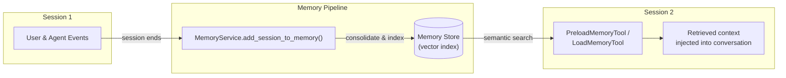

# Memory Systems in Google ADK

> **Prerequisites**: Familiarity with Google ADK agent basics ([Agent Definition Patterns](./02-agent-definition-patterns.md)) and [Session and State Management](./05-session-and-state-management.md).
>
> **What you'll learn**: How to give agents long-term recall across sessions using ADK's memory services, built-in memory tools, and custom memory backends.

Sessions store conversation history. State holds key-value data scoped to a session, user, or app. But what happens when a user returns days later and expects the agent to *remember* them? That's where **memory** comes in. Memory enables agents to recall information across sessions, giving them long-term knowledge about users, past decisions, and prior interactions — without stuffing everything into a prompt.

In this lesson we'll walk through ADK's memory architecture, explore the built-in `MemoryService` implementations, wire up automatic memory retrieval with `PreloadMemoryTool` and `LoadMemoryTool`, and build a custom memory backend.

---

## Session vs State vs Memory

Before we write any code, let's draw a clear line between the three persistence concepts in ADK.

| Concept | Scope | Content | Lifetime | Access |
|---------|-------|---------|----------|--------|
| **Session** | Single conversation | Events (user/agent messages, tool calls) | Until the session is closed or expires | Direct via `session.events` |
| **State** | Scoped — session, user, or app level | Key-value pairs (JSON-serialisable) | Depends on scope; user/app state persists across sessions | `state["key"]` or `{key}` in instruction templates |
| **Memory** | Cross-session, per user | Searchable knowledge distilled from past sessions | Until explicitly cleared | Via `MemoryService` + memory tools |

The key takeaway: **state** is structured data we set explicitly, while **memory** is *unstructured knowledge* the system extracts from conversations and makes searchable later.



> The diagram shows the full memory lifecycle. Events from a completed session flow into the `MemoryService`, which indexes them in a store. In a later session the agent's memory tools query that store and inject relevant context back into the conversation.

---

## How Memory Works in ADK

The memory lifecycle follows four steps:

1. **Session ends** — the conversation between user and agent concludes.
2. **Consolidation** — we call `MemoryService.add_session_to_memory()`, which processes the session's events and writes them to a searchable index.
3. **Storage** — memory entries live in a store (in-memory dict, Vertex AI RAG corpus, or a custom vector database).
4. **Retrieval** — in a future session the agent (or a tool on its behalf) searches memory with a natural-language query and receives relevant past context.

Memory is **user-scoped**: each `user_id` has its own isolated memory store, so user A never sees user B's history.

---

## MemoryService Implementations

ADK ships with two concrete implementations. Let's look at each.

### InMemoryMemoryService (Development)

The simplest option — memories live in a Python dictionary and vanish when the process stops. Perfect for local development and testing.

```python
from google.adk.memory import InMemoryMemoryService

memory_service = InMemoryMemoryService()
```

**Expected output** (no output — the service is instantiated and ready to use):

```text
# No output; memory_service is now an InMemoryMemoryService instance.
```

### VertexAiRagMemoryService (Production)

For production workloads we point ADK at a **Vertex AI RAG corpus**. This gives us scalable vector search, automatic embedding, and managed infrastructure.

```python
from google.adk.memory import VertexAiRagMemoryService

memory_service = VertexAiRagMemoryService(
    rag_corpus="projects/my-project/locations/us-central1/ragCorpora/my-corpus"
)
```

**Expected output**:

```text
# No output; memory_service is connected to the Vertex AI RAG corpus.
```

> **Tip**: Create the RAG corpus ahead of time via the Vertex AI console or the `google-cloud-aiplatform` SDK.

---

## Adding Memory After Sessions

Once a session is complete, we persist its contents to memory with a single call.

```python
import asyncio
from google.adk.sessions import InMemorySessionService
from google.adk.memory import InMemoryMemoryService

session_service = InMemorySessionService()
memory_service = InMemoryMemoryService()

async def save_session_to_memory(app_name: str, user_id: str, session_id: str):
    """Retrieve a finished session and add it to long-term memory."""
    session = await session_service.get_session(
        app_name=app_name,
        user_id=user_id,
        session_id=session_id,
    )
    await memory_service.add_session_to_memory(session)
    print(f"Session {session_id} saved to memory for user {user_id}.")

# Example call
asyncio.run(save_session_to_memory("my_app", "user_1", "sess_abc123"))
```

**Expected output**:

```text
Session sess_abc123 saved to memory for user user_1.
```

The `add_session_to_memory` method iterates over the session's events, consolidates them, and writes the result to the underlying store. We don't need to worry about chunking or embedding — the `MemoryService` handles that internally.

---

## Searching Memory

We can query a user's memory at any time with `search_memory`. The query is a natural-language string; the service performs a semantic search and returns the most relevant entries.

```python
from google.adk.memory import SearchMemoryResponse

async def recall_preferences(app_name: str, user_id: str):
    results: SearchMemoryResponse = await memory_service.search_memory(
        app_name=app_name,
        user_id=user_id,
        query="What food preferences does the user have?",
    )

    if not results.entries:
        print("No relevant memories found.")
        return

    for i, entry in enumerate(results.entries, 1):
        print(f"Memory {i}: {entry.content}")

import asyncio
asyncio.run(recall_preferences("my_app", "user_1"))
```

**Expected output** (assuming a prior session discussed food):

```text
Memory 1: The user mentioned they are vegetarian and allergic to peanuts.
Memory 2: The user prefers Italian cuisine for dinner reservations.
```

The quality of results depends on how much relevant conversation the memory store contains and the underlying embedding model.

---

## Built-in Memory Tools: PreloadMemoryTool and LoadMemoryTool

Manually calling `search_memory` is useful in orchestration code, but ADK also provides **built-in tools** that let agents search memory *from within a conversation* — no custom code required.

### PreloadMemoryTool

`PreloadMemoryTool` automatically searches memory **at the start of every turn**. It takes the user's latest message as the query, retrieves relevant memories, and injects them into the context before the model generates a response.

```python
from google.adk.agents import Agent
from google.adk.tools import PreloadMemoryTool
from google.adk.memory import InMemoryMemoryService

memory_service = InMemoryMemoryService()

agent = Agent(
    name="personal_assistant",
    model="gemini-2.0-flash",
    instruction=(
        "You are a personal assistant. Use memory to recall past conversations "
        "and personalise your responses."
    ),
    tools=[PreloadMemoryTool(memory_service=memory_service)],
)
```

**Expected output** (on instantiation):

```text
# No output; the agent is created with PreloadMemoryTool attached.
```

At runtime, every user message triggers a behind-the-scenes memory search. The agent sees the retrieved memories as additional context and can reference them naturally.

### LoadMemoryTool

`LoadMemoryTool` is the **on-demand** alternative. Instead of running automatically, the agent decides *when* to search memory and *what* to search for.

```python
from google.adk.tools import LoadMemoryTool

agent = Agent(
    name="research_assistant",
    model="gemini-2.0-flash",
    instruction=(
        "You are a research assistant. When the user references past conversations, "
        "use the load_memory tool to find relevant context."
    ),
    tools=[LoadMemoryTool(memory_service=memory_service)],
)
```

**Expected output**:

```text
# No output; the agent is created with LoadMemoryTool attached.
```

Use `LoadMemoryTool` when you want the model to be deliberate about memory access — for example, to avoid unnecessary latency on simple turns that don't need historical context.

### Choosing Between Them

| Tool | When It Runs | Best For |
|------|-------------|----------|
| `PreloadMemoryTool` | Automatically, every turn | Personal assistants, concierge bots |
| `LoadMemoryTool` | On-demand, agent decides | Research assistants, cost-sensitive apps |

---

## Custom Memory Integration

The built-in services cover many use cases, but sometimes we need to connect to our own vector database — Pinecone, Chroma, Weaviate, or a custom store. ADK makes this straightforward: extend `BaseMemoryService` and implement two methods.

```python
from google.adk.memory import BaseMemoryService, SearchMemoryResponse, MemoryEntry
from typing import List

class ChromaMemoryService(BaseMemoryService):
    """Custom MemoryService backed by ChromaDB."""

    def __init__(self, collection_name: str = "agent_memory"):
        import chromadb
        self.client = chromadb.Client()
        self.collection = self.client.get_or_create_collection(collection_name)

    async def add_session_to_memory(self, session) -> None:
        """Extract text from session events and upsert into Chroma."""
        texts: List[str] = []
        for event in session.events:
            if hasattr(event, "text") and event.text:
                texts.append(event.text)

        combined = "\n".join(texts)
        self.collection.upsert(
            ids=[f"{session.user_id}_{session.session_id}"],
            documents=[combined],
            metadatas=[{"user_id": session.user_id, "app": session.app_name}],
        )

    async def search_memory(
        self, *, app_name: str, user_id: str, query: str
    ) -> SearchMemoryResponse:
        """Semantic search over stored memories for a specific user."""
        results = self.collection.query(
            query_texts=[query],
            n_results=5,
            where={"user_id": user_id},
        )

        entries = [
            MemoryEntry(content=doc)
            for doc in (results["documents"][0] if results["documents"] else [])
        ]
        return SearchMemoryResponse(entries=entries)
```

**Expected output** (on instantiation):

```text
# No output; ChromaMemoryService is ready and backed by a local Chroma collection.
```

With a custom service in hand, we plug it in exactly like the built-in ones:

```python
memory_service = ChromaMemoryService(collection_name="my_agent_memories")

agent = Agent(
    name="custom_memory_agent",
    model="gemini-2.0-flash",
    instruction="You remember everything. Use memory to personalise responses.",
    tools=[PreloadMemoryTool(memory_service=memory_service)],
)
```

**Expected output**:

```text
# No output; agent is configured with the custom ChromaMemoryService.
```

---

## Best Practices

| Practice | Why It Matters |
|----------|---------------|
| **Be selective about what you store** | Storing every session creates noise. Save sessions that contain meaningful user preferences, decisions, or facts. |
| **Use user-scoped memory** | ADK scopes memory by `user_id` by default — don't bypass this. It prevents data leakage between users. |
| **Clear outdated memory periodically** | Preferences change. Build a review or expiration mechanism so stale memories don't mislead the agent. |
| **Test retrieval quality** | Write integration tests that assert the right memories surface for a given query. Poor retrieval = poor personalisation. |
| **Prefer `LoadMemoryTool` for cost-sensitive apps** | `PreloadMemoryTool` runs every turn, adding latency and cost. Use it only when consistent personalisation is critical. |
| **Combine memory with state** | Use state for structured, frequently accessed data (e.g., `user_tier`). Use memory for unstructured recall (e.g., "user mentioned they prefer dark mode"). |
| **Keep memory entries concise** | Long, verbose entries degrade search quality. Summarise or consolidate before storing when using custom backends. |

---

## Common Pitfalls

| ❌ Don't | ✅ Do |
|----------|-------|
| Store every session indiscriminately | Filter sessions by relevance before calling `add_session_to_memory()` |
| Use `InMemoryMemoryService` in production | Use `VertexAiRagMemoryService` or a custom persistent backend |
| Assume memory is always accurate | Validate retrieved memories; surface them as suggestions, not facts |
| Ignore memory size growth | Monitor memory store size and implement cleanup or summarisation strategies |
| Forget to scope memory by user | Always pass the correct `user_id` — never share memory across users |
| Skip testing memory retrieval | Write tests that verify the right context is returned for representative queries |
| Attach both `PreloadMemoryTool` and `LoadMemoryTool` | Choose one approach per agent to avoid duplicate searches and wasted tokens |

---

## Hands-on Exercise

**Goal**: Build a personal assistant agent that remembers a user's preferences across sessions.

**Requirements**:
1. Create an `InMemoryMemoryService` and an `InMemorySessionService`.
2. Simulate a first session where the user tells the agent: *"I'm vegetarian and I love hiking."*
3. After the session ends, save it to memory.
4. Start a second session and ask: *"Can you recommend a restaurant for me?"*
5. Verify the agent recalls the user's vegetarian preference from memory.

**Hints**:
- Use `PreloadMemoryTool` so the agent automatically retrieves relevant memories.
- Use `Runner` to execute the agent and `InMemorySessionService` to manage sessions.
- Print intermediate results to confirm memory was stored and retrieved.

<details>
<summary>Show Solution</summary>

```python
import asyncio
from google.adk.agents import Agent
from google.adk.runners import Runner
from google.adk.sessions import InMemorySessionService
from google.adk.memory import InMemoryMemoryService
from google.adk.tools import PreloadMemoryTool
from google.genai import types

async def main():
    # 1. Set up services
    session_service = InMemorySessionService()
    memory_service = InMemoryMemoryService()

    # 2. Create the agent with PreloadMemoryTool
    agent = Agent(
        name="personal_assistant",
        model="gemini-2.0-flash",
        instruction=(
            "You are a helpful personal assistant. "
            "Use memory to recall past conversations and personalise your responses."
        ),
        tools=[PreloadMemoryTool(memory_service=memory_service)],
    )

    runner = Runner(
        agent=agent,
        session_service=session_service,
        app_name="memory_demo",
    )

    # 3. First session: user shares preferences
    session1 = await session_service.create_session(
        app_name="memory_demo", user_id="user_1"
    )
    user_message = types.Content(
        parts=[types.Part(text="I'm vegetarian and I love hiking.")],
        role="user",
    )

    response1 = None
    async for event in runner.run_async(
        session_id=session1.id, user_id="user_1", new_message=user_message
    ):
        if event.is_final_response():
            response1 = event.content.parts[0].text

    print(f"Session 1 response: {response1}")

    # 4. Save session to memory
    session1 = await session_service.get_session(
        app_name="memory_demo",
        user_id="user_1",
        session_id=session1.id,
    )
    await memory_service.add_session_to_memory(session1)
    print("Session 1 saved to memory.")

    # 5. Second session: ask for a recommendation
    session2 = await session_service.create_session(
        app_name="memory_demo", user_id="user_1"
    )
    rec_message = types.Content(
        parts=[types.Part(text="Can you recommend a restaurant for me?")],
        role="user",
    )

    response2 = None
    async for event in runner.run_async(
        session_id=session2.id, user_id="user_1", new_message=rec_message
    ):
        if event.is_final_response():
            response2 = event.content.parts[0].text

    print(f"Session 2 response: {response2}")
    # The response should reference vegetarian options.

asyncio.run(main())
```

**Expected output** (responses will vary with the model):

```text
Session 1 response: That's great! Being vegetarian is wonderful, and hiking is such a
rewarding hobby. I'll remember that!
Session 1 saved to memory.
Session 2 response: Based on what I remember, you're vegetarian! I'd recommend trying
a place like "Green Garden Bistro" — they have an excellent plant-based menu. You might
also enjoy restaurants with outdoor seating since you love hiking and nature.
```

</details>

---

## Summary

✅ **Memory** gives ADK agents long-term, cross-session recall — distinct from session history and state.

✅ The memory lifecycle is: **session ends → consolidate → store → search in future sessions**.

✅ `InMemoryMemoryService` is ideal for development; `VertexAiRagMemoryService` is built for production.

✅ `add_session_to_memory()` persists a session's events; `search_memory()` retrieves relevant past context.

✅ `PreloadMemoryTool` searches automatically every turn; `LoadMemoryTool` lets the agent decide when to search.

✅ Custom backends are easy — extend `BaseMemoryService` and implement `add_session_to_memory` and `search_memory`.

✅ Memory is user-scoped by default, keeping each user's data isolated.

---

**Next**: [Workflow Patterns](./07-workflow-patterns.md)

**Previous**: [Session and State Management](./05-session-and-state-management.md)

**[Back to Google ADK Overview](./00-google-agent-development-kit.md)**

---

## Further Reading

- [Google ADK Documentation — Memory](https://google.github.io/adk-python/memory/)
- [Google ADK Documentation — Session & State](https://google.github.io/adk-python/sessions/)
- [Vertex AI RAG Engine](https://cloud.google.com/vertex-ai/docs/generative-ai/rag-engine/overview)
- [ChromaDB Documentation](https://docs.trychroma.com/)
- [Building Long-Term Memory for AI Agents (Google Cloud Blog)](https://cloud.google.com/blog/products/ai-machine-learning)

<!-- Sources:
- Google ADK Python SDK documentation: https://google.github.io/adk-python/
- Google ADK GitHub repository: https://github.com/google/adk-python
- ADK Memory module reference: https://google.github.io/adk-python/memory/
- ADK Tools reference (PreloadMemoryTool, LoadMemoryTool): https://google.github.io/adk-python/tools/
- Vertex AI RAG Engine documentation: https://cloud.google.com/vertex-ai/docs/generative-ai/rag-engine/overview
- ChromaDB documentation: https://docs.trychroma.com/
-->
