# Workflow Patterns in Google Agent Development Kit

Standalone AI agents can handle straightforward tasks, but real-world problems rarely fit inside a single prompt. We need agents that research, draft, review, and publish — often in parallel, sometimes in loops, and occasionally with a human making the final call. Google ADK gives us a composable toolkit of **workflow agents** (`SequentialAgent`, `ParallelAgent`, `LoopAgent`) alongside the familiar `LlmAgent` so we can wire up exactly the execution topology each job demands.

In this lesson we explore seven battle-tested workflow patterns, build working examples of each, learn how to combine them, and finish with a decision framework for choosing the right pattern.

**Prerequisites**

- Familiarity with [Agent Definition Patterns](./02-agent-definition-patterns.md) (LlmAgent, sub_agents, `output_key`)
- Understanding of [State Management](./04-state-management.md) and how agents share data
- Python 3.11+ with the `google-adk` package installed

---

## The Seven Workflow Patterns at a Glance

Before we dive in, here is a map of every pattern we will cover and how they relate to one another:


Each pattern addresses a different coordination need. Some are LLM-driven (the model decides what happens next), others are deterministic (the code dictates the order), and a few are iterative or human-centric. Let's walk through them one at a time.

---

## Pattern 1: Coordinator (Router)

The **Coordinator** pattern is the simplest multi-agent topology. A root `LlmAgent` receives the user request, reasons about intent, and delegates to the most appropriate specialist sub-agent. The LLM itself acts as the router — no hard-coded `if/else` branches required.


### Implementation

```python
from google.adk.agents import LlmAgent

billing_agent = LlmAgent(
    name="billing_agent",
    model="gemini-2.0-flash",
    instruction="You handle billing questions: invoices, payments, refunds.",
)

tech_agent = LlmAgent(
    name="tech_agent",
    model="gemini-2.0-flash",
    instruction="You handle technical issues: bugs, outages, integrations.",
)

general_agent = LlmAgent(
    name="general_agent",
    model="gemini-2.0-flash",
    instruction="You handle general inquiries: greetings, FAQs, company info.",
)

coordinator = LlmAgent(
    name="coordinator",
    model="gemini-2.0-flash",
    instruction=(
        "You are a customer support coordinator. "
        "Determine the user's intent and delegate to the appropriate specialist."
    ),
    sub_agents=[billing_agent, tech_agent, general_agent],
)
```

Expected output when a user asks *"I was double-charged on my last invoice"*:

```text
[coordinator] Delegating to billing_agent...
[billing_agent] I'm sorry to hear about the double charge. Let me look into
your most recent invoice and initiate a refund for the duplicate payment.
```

**Best for:** customer support routing, intent classification, triage systems.

---

## Pattern 2: Sequential Pipeline

When tasks must happen in a strict order — research → write → edit — we reach for `SequentialAgent`. Each sub-agent runs one after the other, and we use `output_key` to write results into shared state so the next agent can pick them up.


### Implementation

```python
from google.adk.agents import LlmAgent, SequentialAgent

researcher = LlmAgent(
    name="researcher",
    model="gemini-2.0-flash",
    instruction="Research the given topic. Provide detailed notes with sources.",
    output_key="research_notes",
)

writer = LlmAgent(
    name="writer",
    model="gemini-2.0-flash",
    instruction=(
        "Using the research notes in state, write a polished 500-word article. "
        "Research notes: {research_notes}"
    ),
    output_key="draft",
)

editor = LlmAgent(
    name="editor",
    model="gemini-2.0-flash",
    instruction=(
        "Edit the draft for clarity, grammar, and tone. "
        "Draft: {draft}"
    ),
    output_key="final_article",
)

pipeline = SequentialAgent(
    name="content_pipeline",
    sub_agents=[researcher, writer, editor],
)
```

Expected output:

```text
[researcher] Notes: The topic of quantum computing dates back to...
[writer]     Draft: Quantum computing is poised to revolutionize...
[editor]     Final: Quantum computing stands poised to revolutionize...
```

**Best for:** content creation, data processing pipelines, ETL workflows, any ordered chain of transformations.

---

## Pattern 3: Parallel Fan-Out / Gather

Some tasks are embarrassingly parallel — searching three databases, calling three APIs, or summarizing three documents. `ParallelAgent` runs every sub-agent concurrently and collects all their results into state.


### Implementation

```python
from google.adk.agents import LlmAgent, ParallelAgent

news_searcher = LlmAgent(
    name="news_searcher",
    model="gemini-2.0-flash",
    instruction="Search recent news articles about the given topic.",
    output_key="news_results",
)

academic_searcher = LlmAgent(
    name="academic_searcher",
    model="gemini-2.0-flash",
    instruction="Search academic papers and journals about the given topic.",
    output_key="academic_results",
)

social_searcher = LlmAgent(
    name="social_searcher",
    model="gemini-2.0-flash",
    instruction="Search social media discussions about the given topic.",
    output_key="social_results",
)

research = ParallelAgent(
    name="parallel_research",
    sub_agents=[news_searcher, academic_searcher, social_searcher],
)
```

Expected output (order may vary because agents run concurrently):

```text
[news_searcher]     Found 5 relevant articles from Reuters, AP...
[social_searcher]   Twitter threads and Reddit discussions about...
[academic_searcher] 3 papers from arXiv covering recent advances...
```

**Best for:** multi-source research, competitive analysis, parallel API calls, ensemble approaches.

---

## Pattern 4: Hierarchical

The Hierarchical pattern extends the Coordinator idea into multiple levels. A top-level manager delegates to team leads, and each team lead delegates to specialists. This mirrors real-world organizational charts and works well when tasks are naturally grouped.


### Implementation

```python
from google.adk.agents import LlmAgent

frontend_dev = LlmAgent(name="frontend_dev", model="gemini-2.0-flash",
    instruction="You implement frontend features using React.")
backend_dev = LlmAgent(name="backend_dev", model="gemini-2.0-flash",
    instruction="You implement backend services using Python/FastAPI.")
qa_tester = LlmAgent(name="qa_tester", model="gemini-2.0-flash",
    instruction="You write and run test cases for the feature.")

engineering_lead = LlmAgent(
    name="engineering_lead",
    model="gemini-2.0-flash",
    instruction="You manage the engineering team. Delegate frontend, backend, and QA tasks.",
    sub_agents=[frontend_dev, backend_dev, qa_tester],
)

copywriter = LlmAgent(name="copywriter", model="gemini-2.0-flash",
    instruction="You write marketing copy and blog posts.")
designer = LlmAgent(name="designer", model="gemini-2.0-flash",
    instruction="You create design briefs and visual concepts.")

marketing_lead = LlmAgent(
    name="marketing_lead",
    model="gemini-2.0-flash",
    instruction="You manage the marketing team. Delegate copy and design tasks.",
    sub_agents=[copywriter, designer],
)

project_manager = LlmAgent(
    name="project_manager",
    model="gemini-2.0-flash",
    instruction=(
        "You are the project manager. Break down the project and delegate "
        "engineering work to engineering_lead and marketing work to marketing_lead."
    ),
    sub_agents=[engineering_lead, marketing_lead],
)
```

Expected output:

```text
[project_manager]    Breaking down feature request into engineering and marketing tasks...
[engineering_lead]   Delegating frontend work to frontend_dev...
[frontend_dev]       Implementing the new dashboard component in React...
[engineering_lead]   Delegating backend work to backend_dev...
[backend_dev]        Creating the /api/dashboard endpoint in FastAPI...
[marketing_lead]     Delegating blog post to copywriter...
[copywriter]         Writing announcement blog post for the new dashboard...
```

**Best for:** complex organizational workflows, large project coordination, enterprise automation.

---

## Pattern 5: Generator-Critic (Loop)

The Generator-Critic pattern pairs a **generator** agent that produces content with a **critic** agent that evaluates it. Both agents sit inside a `LoopAgent`, so if the critic rejects the output, the generator tries again — up to a maximum number of iterations. The critic calls `escalate` when the result meets quality standards, which breaks the loop.

```mermaid
flowchart TD
    A[LoopAgent] --> B[Generator]
    B -->|state: draft| C[Critic]
    C -->|Approved| D[escalate → Exit Loop]
    C -->|Rejected + Feedback| B
```



### Implementation

```python
from google.adk.agents import LlmAgent, LoopAgent, SequentialAgent

generator_agent = LlmAgent(
    name="generator",
    model="gemini-2.0-flash",
    instruction=(
        "Write a professional email based on the user's request. "
        "If feedback exists in state, incorporate it. Feedback: {feedback}"
    ),
    output_key="draft",
)

critic_agent = LlmAgent(
    name="critic",
    model="gemini-2.0-flash",
    instruction=(
        "Review the draft email for tone, clarity, and completeness. "
        "If it meets professional standards, call the escalate tool to approve. "
        "Otherwise, provide specific feedback for improvement. "
        "Draft: {draft}"
    ),
    output_key="feedback",
)

review_loop = LoopAgent(
    name="review_loop",
    max_iterations=3,
    sub_agents=[SequentialAgent(
        name="generate_and_review",
        sub_agents=[generator_agent, critic_agent],
    )],
)
```

Expected output:

```text
[generator]  Draft: Dear Team, I wanted to let you know about the upcoming changes...
[critic]     Feedback: The opening is too vague. Specify which changes and the timeline.
[generator]  Draft: Dear Team, Starting March 1, we are migrating to the new CRM...
[critic]     Approved. Escalating. ✓
```

**Best for:** quality assurance, code review loops, iterative content refinement, self-healing pipelines.

---

## Pattern 6: Iterative Refinement

Iterative Refinement is closely related to Generator-Critic but places more emphasis on **incremental improvement**. Instead of a binary approve/reject, every iteration produces a better version of the artifact by building on prior feedback stored in state.

### Implementation

```python
from google.adk.agents import LlmAgent, LoopAgent, SequentialAgent

refiner = LlmAgent(
    name="refiner",
    model="gemini-2.0-flash",
    instruction=(
        "Improve the current draft based on accumulated feedback. "
        "Current draft: {current_draft}\n"
        "Feedback history: {feedback_history}\n"
        "Produce a better version."
    ),
    output_key="current_draft",
)

evaluator = LlmAgent(
    name="evaluator",
    model="gemini-2.0-flash",
    instruction=(
        "Score the draft from 1-10 on clarity, accuracy, and completeness. "
        "Draft: {current_draft}\n"
        "If the score is 8 or above, call escalate to finish. "
        "Otherwise, append your feedback to the feedback history."
    ),
    output_key="feedback_history",
)

refinement_loop = LoopAgent(
    name="iterative_refinement",
    max_iterations=5,
    sub_agents=[SequentialAgent(
        name="refine_cycle",
        sub_agents=[refiner, evaluator],
    )],
)
```

Expected output:

```text
[refiner]    Version 1: An introduction to neural networks...
[evaluator]  Score: 5/10. Needs concrete examples and a code snippet.
[refiner]    Version 2: Neural networks learn by adjusting weights... (includes example)
[evaluator]  Score: 7/10. Add a diagram description and fix the loss-function explanation.
[refiner]    Version 3: Neural networks... (with diagram and corrected explanation)
[evaluator]  Score: 9/10. Approved. Escalating. ✓
```

**Best for:** progressive document improvement, code optimization loops, report generation with quality gates.

---

## Pattern 7: Human-in-the-Loop (HITL)

Some decisions are too consequential to leave to an LLM — deleting production data, sending a legal contract, or approving a large purchase. The HITL pattern lets an agent **pause execution** and wait for a human to provide input or approval before continuing. ADK supports this through `LongRunningFunctionTool`, which creates an asynchronous checkpoint.

### Implementation

```python
import asyncio
from google.adk.agents import LlmAgent
from google.adk.tools import LongRunningFunctionTool

approval_event = asyncio.Event()
human_decision: dict = {}

async def request_human_approval(action: str, details: str) -> dict:
    """Pause the agent and wait for a human to approve or reject."""
    print(f"\n🔔 APPROVAL REQUIRED: {action}")
    print(f"   Details: {details}")
    print("   Waiting for human response...\n")

    # In production, this would send a notification (Slack, email, UI)
    # and wait for the response via webhook or polling.
    await approval_event.wait()
    return human_decision

approval_tool = LongRunningFunctionTool(func=request_human_approval)

approval_agent = LlmAgent(
    name="approval_agent",
    model="gemini-2.0-flash",
    instruction=(
        "Before executing any high-risk action, use the request_human_approval "
        "tool to get explicit human approval. Proceed only if approved."
    ),
    tools=[approval_tool],
)
```

Expected output:

```text
[approval_agent] This action requires deleting 1,200 user records.
                 Requesting human approval...

🔔 APPROVAL REQUIRED: Delete user records
   Details: 1,200 inactive accounts older than 2 years
   Waiting for human response...

[Human]          ✅ Approved
[approval_agent] Proceeding with deletion of 1,200 inactive accounts.
```

**Best for:** high-stakes decisions, regulatory compliance, content publishing approval, financial transactions.

---

## Combining Patterns

The real power of ADK emerges when we **nest patterns together**. Below we build a complete content-creation pipeline that combines Sequential, Parallel, and Loop patterns into a single agent tree.

```python
from google.adk.agents import LlmAgent, SequentialAgent, ParallelAgent, LoopAgent

# Step 1 — Intake & classify
intake_agent = LlmAgent(
    name="intake_agent", model="gemini-2.0-flash",
    instruction="Classify the topic and identify key research questions.",
    output_key="research_questions",
)

# Step 2 — Research in parallel
source_a = LlmAgent(name="source_a", model="gemini-2.0-flash",
    instruction="Search news sources for: {research_questions}",
    output_key="news_data")
source_b = LlmAgent(name="source_b", model="gemini-2.0-flash",
    instruction="Search academic databases for: {research_questions}",
    output_key="academic_data")
source_c = LlmAgent(name="source_c", model="gemini-2.0-flash",
    instruction="Search industry reports for: {research_questions}",
    output_key="industry_data")

# Step 3 — Draft & review loop
drafter = LlmAgent(name="drafter", model="gemini-2.0-flash",
    instruction=(
        "Write an article using: {news_data}, {academic_data}, {industry_data}. "
        "Incorporate feedback if present: {review_feedback}"
    ),
    output_key="article_draft")
reviewer = LlmAgent(name="reviewer", model="gemini-2.0-flash",
    instruction=(
        "Review the article draft: {article_draft}. "
        "If publication-ready, call escalate. Otherwise give feedback."
    ),
    output_key="review_feedback")

# Step 4 — Final formatting
formatter_agent = LlmAgent(
    name="formatter_agent", model="gemini-2.0-flash",
    instruction="Format the article for publication: {article_draft}",
    output_key="final_output",
)

# Compose everything
full_pipeline = SequentialAgent(
    name="full_pipeline",
    sub_agents=[
        intake_agent,                          # Step 1: Classify
        ParallelAgent(                         # Step 2: Research in parallel
            name="research",
            sub_agents=[source_a, source_b, source_c],
        ),
        LoopAgent(                             # Step 3: Generate & refine
            name="refinement",
            max_iterations=3,
            sub_agents=[SequentialAgent(
                name="draft_review",
                sub_agents=[drafter, reviewer],
            )],
        ),
        formatter_agent,                       # Step 4: Final formatting
    ],
)
```

Expected output:

```text
[intake_agent]  Topic classified. Research questions identified.
[source_a]      News results gathered.
[source_b]      Academic results gathered.
[source_c]      Industry results gathered.
[drafter]       First draft written (1,200 words).
[reviewer]      Feedback: Add more data citations in section 2.
[drafter]       Revised draft with citations added.
[reviewer]      Approved. Escalating. ✓
[formatter_agent] Article formatted for publication. Done.
```

---

## Choosing the Right Pattern

| Pattern | When to Use | Agent Types | Complexity |
|---|---|---|---|
| **Coordinator** | Dynamic routing based on user intent | `LlmAgent` + sub_agents | Low |
| **Sequential Pipeline** | Ordered, dependent steps | `SequentialAgent` | Low |
| **Parallel Fan-Out** | Independent tasks that can run concurrently | `ParallelAgent` | Medium |
| **Hierarchical** | Complex multi-team delegation | Nested `LlmAgent` trees | High |
| **Generator-Critic** | Quality gating with approve/reject loops | `LoopAgent` + `SequentialAgent` | Medium |
| **Iterative Refinement** | Progressive improvement over multiple passes | `LoopAgent` + `SequentialAgent` | Medium |
| **Human-in-the-Loop** | Approval workflows requiring human judgment | `LlmAgent` + `LongRunningFunctionTool` | High |

**Decision heuristic:** Start with the simplest pattern that solves the problem. Promote to a more complex pattern only when you observe failures or quality gaps that the simpler pattern cannot handle.

---

## Best Practices

| # | Practice | Why It Matters |
|---|----------|----------------|
| 1 | Start with a single `LlmAgent` before adding patterns | Proves the core task works before adding orchestration overhead |
| 2 | Always set `max_iterations` on `LoopAgent` | Prevents runaway loops that burn tokens and time |
| 3 | Use `output_key` consistently | Makes data flow between agents explicit and debuggable |
| 4 | Keep sub-agent instructions focused | Specialists outperform generalists in every pattern |
| 5 | Add logging or callbacks at each agent boundary | Gives observability into multi-step workflows |
| 6 | Test each agent in isolation before composing | Isolates failures to specific agents rather than the whole pipeline |
| 7 | Use `ParallelAgent` only for truly independent tasks | Shared-state mutations during parallel execution cause race conditions |
| 8 | Prefer deterministic patterns over LLM-driven routing when possible | Deterministic patterns are more predictable and cheaper |

---

## Common Pitfalls

| ❌ Don't | ✅ Do |
|----------|-------|
| Forget `max_iterations` on `LoopAgent` | Always cap iterations (e.g., 3-5) to prevent infinite loops |
| Use `ParallelAgent` when agents depend on each other's output | Use `SequentialAgent` for dependent tasks, `ParallelAgent` for independent ones |
| Put complex routing logic in Python `if/else` branches | Use the Coordinator pattern and let the LLM decide routing |
| Overload a single agent with multiple responsibilities | Split into specialist agents with focused instructions |
| Hardcode state keys as magic strings throughout agents | Define state key constants and share them across agent definitions |
| Skip the critic agent to save tokens | The review step catches errors early and saves costly downstream fixes |
| Build a deeply nested hierarchy on day one | Start flat, add hierarchy only when a team of agents exceeds 5-7 members |
| Use HITL for every decision | Reserve human-in-the-loop for genuinely high-stakes actions |

---

## Hands-on Exercise

**Build a "Blog Post Factory" Pipeline**

Create a multi-pattern agent system that:

1. Takes a topic from the user (Coordinator decides the blog category)
2. Researches the topic from two sources in parallel
3. Drafts a blog post, then reviews it in a loop (max 2 iterations)
4. Outputs the final formatted post

**Requirements:**
- Use at least three different workflow patterns
- All agents should use `output_key` to pass state
- The critic agent must call `escalate` when satisfied

<details>
<summary>💡 Hints</summary>

- Start by defining your state keys: `category`, `research_a`, `research_b`, `draft`, `feedback`, `final_post`
- The outer container is a `SequentialAgent`
- Step 2 is a `ParallelAgent` with two research agents
- Step 3 is a `LoopAgent` wrapping a `SequentialAgent` of [drafter, critic]
- The critic's instruction should reference `{draft}` from state and explicitly mention calling `escalate`

</details>

<details>
<summary>🔑 Solution</summary>

```python
from google.adk.agents import LlmAgent, SequentialAgent, ParallelAgent, LoopAgent

# Step 1: Coordinator categorizes the topic
coordinator = LlmAgent(
    name="coordinator",
    model="gemini-2.0-flash",
    instruction=(
        "Determine the blog category for the given topic "
        "(e.g., Technology, Health, Business). Output only the category."
    ),
    output_key="category",
)

# Step 2: Parallel research
research_web = LlmAgent(
    name="research_web",
    model="gemini-2.0-flash",
    instruction="Research '{category}' topics from web sources. Provide key facts.",
    output_key="research_a",
)

research_academic = LlmAgent(
    name="research_academic",
    model="gemini-2.0-flash",
    instruction="Research '{category}' topics from academic sources. Provide key facts.",
    output_key="research_b",
)

parallel_research = ParallelAgent(
    name="parallel_research",
    sub_agents=[research_web, research_academic],
)

# Step 3: Draft + Review loop
drafter = LlmAgent(
    name="drafter",
    model="gemini-2.0-flash",
    instruction=(
        "Write a 300-word blog post in the '{category}' category. "
        "Use these sources:\n- {research_a}\n- {research_b}\n"
        "If feedback exists, incorporate it: {feedback}"
    ),
    output_key="draft",
)

critic = LlmAgent(
    name="critic",
    model="gemini-2.0-flash",
    instruction=(
        "Review this blog draft: {draft}\n"
        "Check for clarity, accuracy, and engagement.\n"
        "If it is ready to publish, call the escalate tool.\n"
        "Otherwise, provide specific feedback for improvement."
    ),
    output_key="feedback",
)

review_loop = LoopAgent(
    name="review_loop",
    max_iterations=2,
    sub_agents=[SequentialAgent(
        name="draft_and_review",
        sub_agents=[drafter, critic],
    )],
)

# Step 4: Format final output
formatter = LlmAgent(
    name="formatter",
    model="gemini-2.0-flash",
    instruction="Format this draft as a final blog post with title, headings, and a conclusion: {draft}",
    output_key="final_post",
)

# Compose the full pipeline
blog_factory = SequentialAgent(
    name="blog_factory",
    sub_agents=[coordinator, parallel_research, review_loop, formatter],
)
```

</details>

---

## Summary

✅ The **Coordinator** pattern uses an LlmAgent to dynamically route requests to specialist sub-agents  
✅ **Sequential Pipeline** (`SequentialAgent`) chains agents in strict order, passing data through state via `output_key`  
✅ **Parallel Fan-Out** (`ParallelAgent`) runs independent agents concurrently for speed gains  
✅ **Hierarchical** patterns nest coordinators multiple levels deep for complex organizational workflows  
✅ **Generator-Critic** wraps a drafter and reviewer inside a `LoopAgent` for quality gating  
✅ **Iterative Refinement** builds on each pass, using accumulated feedback to progressively improve output  
✅ **Human-in-the-Loop** pauses execution with `LongRunningFunctionTool` for human approval on high-stakes decisions  
✅ Patterns compose naturally — combine Sequential, Parallel, and Loop agents to build sophisticated pipelines  
✅ Always start with the simplest pattern and promote to more complex topologies only when needed

---

## Navigation

| Previous | Next |
|----------|------|
| [Memory Systems](./06-memory-systems.md) | [Callbacks and Observability](./08-callbacks-and-observability.md) |

[Back to Google ADK Overview](./00-google-agent-development-kit.md)

---

## Further Reading

- [Google ADK — Multi-Agent Systems Documentation](https://google.github.io/adk-docs/agents/multi-agents/)
- [Google ADK — Workflow Agents Reference](https://google.github.io/adk-docs/agents/workflow-agents/)
- [Google ADK — LoopAgent and SequentialAgent API](https://google.github.io/adk-docs/api-reference/)
- [Multi-Agent Design Patterns — Andrew Ng (DeepLearning.AI)](https://www.deeplearning.ai/the-batch/agentic-design-patterns-part-2-reflection/)
- [Agent Design Patterns with AutoGen — Microsoft Research](https://www.microsoft.com/en-us/research/publication/autogen-enabling-next-gen-llm-applications-via-multi-agent-conversation/)

<!-- Sources:
- Google ADK Documentation: https://google.github.io/adk-docs/ (accessed 2025)
- Google ADK GitHub Repository: https://github.com/google/adk-python
- ADK Multi-Agent Documentation: https://google.github.io/adk-docs/agents/multi-agents/
- ADK Workflow Agents: https://google.github.io/adk-docs/agents/workflow-agents/
- Andrew Ng, "Agentic Design Patterns" series, DeepLearning.AI, 2024
- AutoGen Multi-Agent Conversation Framework, Microsoft Research, 2023
-->
