# Callbacks and Observability in Google ADK

In production AI systems, we need more than just agents that respond — we need **visibility** into every decision an agent makes and the ability to **intervene** when something goes wrong. Google Agent Development Kit (ADK) provides a powerful callback system that lets us intercept, inspect, modify, or block agent behavior at six critical points in the agent lifecycle.

In this lesson, we'll explore each callback type, learn how return values control execution flow, and build practical guardrail and observability patterns that prepare our agents for production deployment.

**Prerequisites:**

- Familiarity with ADK agent creation ([Agent Definition Patterns](./02-agent-definition-patterns.md))
- Understanding of LLM agents and tool use ([Tools and Function Calling](./04-tools-and-function-calling.md))
- Basic Python experience with type hints

---

## How Callbacks Work in ADK

Callbacks are hook functions we register on an agent. ADK calls them automatically at specific moments during execution — before and after each major operation. They give us a non-invasive way to add cross-cutting concerns like logging, security, and monitoring without modifying our core agent logic.

The key mental model: **return `None` to proceed normally, return a value to short-circuit.**

When a "before" callback returns a value instead of `None`, ADK skips the operation entirely and uses our returned value as the result. When an "after" callback returns a value, ADK overrides whatever the operation produced. This simple convention gives us enormous control.

---

## The Six Callback Types

ADK organizes callbacks into three categories — agent lifecycle, LLM interaction, and tool execution — each with a "before" and "after" variant:

| Category | Before | After |
|---|---|---|
| **Agent lifecycle** | `before_agent_callback` | `after_agent_callback` |
| **LLM interaction** | `before_model_callback` | `after_model_callback` |
| **Tool execution** | `before_tool_callback` | `after_tool_callback` |

Every callback receives a `CallbackContext` object as its first argument, giving us access to the agent's name, session state, and user information.

### Callback Return Value Behavior

Understanding return values is critical — they determine whether ADK proceeds with normal execution or short-circuits:

| Callback | Return `None` | Return a Value → Effect |
|---|---|---|
| `before_agent_callback` | Agent runs normally | Returns `Content` → skip agent entirely |
| `before_model_callback` | LLM called normally | Returns `LlmResponse` → skip LLM call |
| `before_tool_callback` | Tool runs normally | Returns `dict` → skip tool execution |
| `after_agent_callback` | Continue normally | Returns `Content` → override agent output |
| `after_model_callback` | Use LLM response as-is | Returns `LlmResponse` → override response |
| `after_tool_callback` | Use tool result as-is | Returns `dict` → override tool result |

---

## Callback Interception Points

The following diagram shows exactly where each callback fires in the agent execution lifecycle:

```mermaid
flowchart TD
    A["🧑 User Input"] --> B["before_agent_callback"]
    B -- "returns Content" --> K["⚡ Short-circuit: Skip Agent"]
    K --> J
    B -- "returns None" --> C["before_model_callback"]
    C -- "returns LlmResponse" --> E["⚡ Short-circuit: Skip LLM"]
    C -- "returns None" --> D["🤖 LLM Call"]
    D --> F["after_model_callback"]
    E --> F
    F -- "LLM requests tool" --> G["before_tool_callback"]
    F -- "No tool needed" --> I
    G -- "returns dict" --> H2["⚡ Short-circuit: Skip Tool"]
    G -- "returns None" --> H["🔧 Tool Execution"]
    H --> H1["after_tool_callback"]
    H2 --> H1
    H1 -- "Loop back" --> C
    F -- "returns None / LlmResponse" --> I["after_agent_callback"]
    I --> J["📤 Response to User"]

    style A fill:#e3f2fd,stroke:#1565c0,color:#000
    style D fill:#fff3e0,stroke:#e65100,color:#000
    style H fill:#e8f5e9,stroke:#2e7d32,color:#000
    style J fill:#f3e5f5,stroke:#6a1b9a,color:#000
    style K fill:#ffebee,stroke:#c62828,color:#000
    style E fill:#ffebee,stroke:#c62828,color:#000
    style H2 fill:#ffebee,stroke:#c62828,color:#000
```



Notice the loop: after a tool executes, control returns to `before_model_callback` because the LLM needs to process the tool's result. This cycle continues until the LLM produces a final text response with no further tool calls.

---

## Agent Callbacks

Agent callbacks wrap the entire execution of any agent — including workflow agents like `SequentialAgent` and `LoopAgent`. We set them directly on the agent definition.

### Logging Agent Lifecycle

```python
from google.adk.agents import Agent
from google.adk.agents.callback_context import CallbackContext
from google.genai import types
import time

_agent_timers = {}

def log_agent_start(callback_context: CallbackContext) -> types.Content | None:
    """Log when an agent starts processing."""
    agent_name = callback_context.agent_name
    _agent_timers[agent_name] = time.time()
    print(f"[LOG] Agent '{agent_name}' started processing")
    return None  # Continue normally

def log_agent_end(callback_context: CallbackContext) -> types.Content | None:
    """Log when an agent finishes processing."""
    agent_name = callback_context.agent_name
    elapsed = time.time() - _agent_timers.pop(agent_name, time.time())
    print(f"[LOG] Agent '{agent_name}' finished processing ({elapsed:.2f}s)")
    return None

agent = Agent(
    name="my_agent",
    model="gemini-2.0-flash",
    instruction="You are a helpful assistant.",
    before_agent_callback=log_agent_start,
    after_agent_callback=log_agent_end,
)
```

**Expected output** when the agent processes a request:

```text
[LOG] Agent 'my_agent' started processing
[LOG] Agent 'my_agent' finished processing (1.34s)
```

### Short-Circuiting an Agent

If we need to block an agent from running entirely — for example, outside business hours — we return a `Content` object from the before callback:

```python
from datetime import datetime

def business_hours_only(callback_context: CallbackContext) -> types.Content | None:
    """Only allow agent to run during business hours."""
    hour = datetime.now().hour
    if hour < 9 or hour >= 17:
        return types.Content(
            role="model",
            parts=[types.Part(text="This service is available Monday–Friday, 9 AM–5 PM.")]
        )
    return None  # Proceed during business hours
```

**Expected output** when called at 8 PM:

```text
This service is available Monday–Friday, 9 AM–5 PM.
```

---

## Model Callbacks

Model callbacks intercept the LLM call itself. They're set on `LlmAgent` (or its alias `Agent`) and receive the `LlmRequest` or `LlmResponse` alongside the callback context.

### Content Filtering with before_model_callback

This is one of the most common patterns — implementing a guardrail that blocks sensitive requests before they reach the LLM:

```python
from google.adk.agents.callback_context import CallbackContext
from google.genai import types
from google.genai.types import LlmRequest, LlmResponse

def content_filter(
    callback_context: CallbackContext, llm_request: LlmRequest
) -> LlmResponse | None:
    """Block requests containing sensitive topics."""
    user_message = str(llm_request.contents[-1])
    blocked_words = ["password", "credit card", "ssn"]

    if any(word in user_message.lower() for word in blocked_words):
        return LlmResponse(
            content=types.Content(
                role="model",
                parts=[types.Part(text="I cannot process requests involving sensitive information.")]
            )
        )
    return None  # Allow the request

agent = Agent(
    name="secure_agent",
    model="gemini-2.0-flash",
    instruction="You are a helpful assistant.",
    before_model_callback=content_filter,
)
```

**Expected output** when the user asks "What's my credit card balance?":

```text
I cannot process requests involving sensitive information.
```

### Modifying LLM Responses with after_model_callback

We can also post-process LLM responses — for example, appending a disclaimer:

```python
def add_disclaimer(
    callback_context: CallbackContext, llm_response: LlmResponse
) -> LlmResponse | None:
    """Append a disclaimer to every LLM response."""
    if llm_response.content and llm_response.content.parts:
        original_text = llm_response.content.parts[0].text or ""
        llm_response.content.parts[0].text = (
            original_text + "\n\n_Disclaimer: This is AI-generated content._"
        )
    return llm_response  # Return modified response
```

**Expected output:**

```text
Here's the information you requested about Python decorators...

_Disclaimer: This is AI-generated content._
```

---

## Tool Callbacks

Tool callbacks let us audit, validate, or override tool execution. They're set on `LlmAgent` and fire every time the LLM decides to call a tool.

### Auditing Tool Calls

```python
def audit_tool_call(
    callback_context: CallbackContext, tool_name: str, tool_args: dict
) -> dict | None:
    """Log all tool calls for audit trail."""
    print(f"[AUDIT] Tool: {tool_name}, Args: {tool_args}")
    callback_context.state["temp:last_tool"] = tool_name
    return None  # Allow the tool to execute

def validate_tool_result(
    callback_context: CallbackContext, tool_name: str, tool_args: dict, tool_response: dict
) -> dict | None:
    """Validate tool results before returning to LLM."""
    if "error" in str(tool_response).lower():
        return {"status": "error", "message": "Tool encountered an error. Please try again."}
    return None  # Use original result

agent = Agent(
    name="audited_agent",
    model="gemini-2.0-flash",
    instruction="You help users check the weather.",
    tools=[get_weather],
    before_tool_callback=audit_tool_call,
    after_tool_callback=validate_tool_result,
)
```

**Expected output** when the agent calls the weather tool:

```text
[AUDIT] Tool: get_weather, Args: {'city': 'London'}
```

### Blocking a Tool Call

We can prevent a tool from executing by returning a `dict` from the before callback:

```python
ALLOWED_TOOLS = {"get_weather", "get_time"}

def tool_allowlist(
    callback_context: CallbackContext, tool_name: str, tool_args: dict
) -> dict | None:
    """Only allow pre-approved tools to execute."""
    if tool_name not in ALLOWED_TOOLS:
        return {"error": f"Tool '{tool_name}' is not permitted."}
    return None
```

**Expected output** when the LLM tries to call an unapproved tool:

```text
Tool 'delete_database' is not permitted.
```

---

## The CallbackContext Object

Every callback receives a `CallbackContext` instance. Here are the properties we use most:

```python
def inspect_context(callback_context: CallbackContext) -> types.Content | None:
    """Demonstrate CallbackContext properties."""
    # Name of the agent this callback is attached to
    agent_name = callback_context.agent_name

    # Access session state (supports all prefix scopes)
    callback_context.state["temp:request_count"] = (
        callback_context.state.get("temp:request_count", 0) + 1
    )

    # Current user identifier
    user_id = callback_context.user_id

    print(f"Agent: {agent_name}, User: {user_id}, "
          f"Request #{callback_context.state['temp:request_count']}")
    return None
```

**Expected output:**

```text
Agent: my_agent, User: user_123, Request #1
```

State key prefixes work the same way as in tools:

- `temp:` — cleared after each invocation
- `app:` — shared across all users
- No prefix — persisted per session

---

## Guardrails Pattern

One of the highest-value uses of callbacks is building guardrails — safety mechanisms that protect our agents from misuse. Let's combine multiple checks into a single before-model callback:

```python
import re

PII_PATTERNS = [
    r"\b\d{3}-\d{2}-\d{4}\b",      # SSN
    r"\b\d{4}[\s-]?\d{4}[\s-]?\d{4}[\s-]?\d{4}\b",  # Credit card
    r"\b[A-Za-z0-9._%+-]+@[A-Za-z0-9.-]+\.[A-Z|a-z]{2,}\b",  # Email
]

def guardrails(
    callback_context: CallbackContext, llm_request: LlmRequest
) -> LlmResponse | None:
    """Multi-layered guardrail: PII detection + rate limiting + topic filtering."""
    user_message = str(llm_request.contents[-1])

    # 1. PII Detection
    for pattern in PII_PATTERNS:
        if re.search(pattern, user_message):
            return LlmResponse(
                content=types.Content(
                    role="model",
                    parts=[types.Part(text="Please don't share personal information like SSNs, "
                                           "credit card numbers, or email addresses.")]
                )
            )

    # 2. Rate Limiting
    count = callback_context.state.get("request_count", 0) + 1
    callback_context.state["request_count"] = count
    if count > 50:
        return LlmResponse(
            content=types.Content(
                role="model",
                parts=[types.Part(text="Rate limit exceeded. Please try again later.")]
            )
        )

    # 3. Topic Filtering
    blocked_topics = ["illegal activity", "weapons", "hacking"]
    if any(topic in user_message.lower() for topic in blocked_topics):
        return LlmResponse(
            content=types.Content(
                role="model",
                parts=[types.Part(text="I'm not able to discuss that topic.")]
            )
        )

    return None  # All checks passed
```

**Expected output** when the user sends an SSN:

```text
Please don't share personal information like SSNs, credit card numbers, or email addresses.
```

---

## Observability Pattern

For production systems, we need full visibility into agent behavior. Here's a comprehensive observability setup using all six callbacks:

```python
import time
import json
import logging

logging.basicConfig(level=logging.INFO)
logger = logging.getLogger("agent_observability")

_timers = {}

def obs_before_agent(callback_context: CallbackContext) -> types.Content | None:
    _timers["agent"] = time.time()
    logger.info(f"AGENT_START | agent={callback_context.agent_name} | user={callback_context.user_id}")
    return None

def obs_after_agent(callback_context: CallbackContext) -> types.Content | None:
    elapsed = time.time() - _timers.pop("agent", time.time())
    logger.info(f"AGENT_END | agent={callback_context.agent_name} | duration={elapsed:.3f}s")
    return None

def obs_before_model(callback_context: CallbackContext, llm_request: LlmRequest) -> LlmResponse | None:
    _timers["model"] = time.time()
    msg_count = len(llm_request.contents)
    logger.info(f"MODEL_START | agent={callback_context.agent_name} | messages={msg_count}")
    return None

def obs_after_model(callback_context: CallbackContext, llm_response: LlmResponse) -> LlmResponse | None:
    elapsed = time.time() - _timers.pop("model", time.time())
    logger.info(f"MODEL_END | agent={callback_context.agent_name} | duration={elapsed:.3f}s")
    return None

def obs_before_tool(callback_context: CallbackContext, tool_name: str, tool_args: dict) -> dict | None:
    _timers[f"tool_{tool_name}"] = time.time()
    logger.info(f"TOOL_START | tool={tool_name} | args={json.dumps(tool_args)}")
    return None

def obs_after_tool(
    callback_context: CallbackContext, tool_name: str, tool_args: dict, tool_response: dict
) -> dict | None:
    elapsed = time.time() - _timers.pop(f"tool_{tool_name}", time.time())
    logger.info(f"TOOL_END | tool={tool_name} | duration={elapsed:.3f}s")
    return None

observable_agent = Agent(
    name="observable_agent",
    model="gemini-2.0-flash",
    instruction="You are a helpful assistant.",
    tools=[get_weather],
    before_agent_callback=obs_before_agent,
    after_agent_callback=obs_after_agent,
    before_model_callback=obs_before_model,
    after_model_callback=obs_after_model,
    before_tool_callback=obs_before_tool,
    after_tool_callback=obs_after_tool,
)
```

**Expected log output** for a request that triggers a tool call:

```text
INFO:agent_observability:AGENT_START | agent=observable_agent | user=user_42
INFO:agent_observability:MODEL_START | agent=observable_agent | messages=1
INFO:agent_observability:MODEL_END | agent=observable_agent | duration=0.872s
INFO:agent_observability:TOOL_START | tool=get_weather | args={"city": "London"}
INFO:agent_observability:TOOL_END | tool=get_weather | duration=0.215s
INFO:agent_observability:MODEL_START | agent=observable_agent | messages=3
INFO:agent_observability:MODEL_END | agent=observable_agent | duration=0.654s
INFO:agent_observability:AGENT_END | agent=observable_agent | duration=1.893s
```

Notice the two `MODEL_START`/`MODEL_END` pairs: the first LLM call decided to use a tool, and the second processed the tool's result to generate the final answer.

---

## Best Practices

| Practice | Description |
|---|---|
| **Return `None` by default** | Always end callbacks with `return None` unless intentionally short-circuiting. Forgetting the return statement works in Python (returns `None` implicitly), but being explicit improves readability. |
| **Keep callbacks fast** | Callbacks run synchronously in the agent loop. Avoid expensive I/O — use async logging or buffer writes. |
| **Use `temp:` state for scratch data** | Store per-invocation data (timers, counters) in `temp:` keys so they auto-clean. |
| **Compose callbacks from small functions** | Build a single callback that calls multiple validators rather than trying to attach multiple callbacks of the same type. |
| **Log structured data** | Use key=value pairs or JSON in log messages for easy parsing by observability tools. |
| **Test callbacks in isolation** | Unit test each callback by constructing mock `CallbackContext` and request objects. |
| **Apply to workflow agents too** | `before_agent_callback` and `after_agent_callback` work on `SequentialAgent`, `ParallelAgent`, and `LoopAgent`. |

---

## Common Pitfalls

| | Pitfall | Fix |
|---|---|---|
| ❌ | Returning a value unintentionally from a before callback, causing the operation to be silently skipped | ✅ Always explicitly `return None` at the end of callbacks that should not short-circuit |
| ❌ | Performing slow network calls inside callbacks, blocking the entire agent loop | ✅ Buffer events and flush asynchronously, or use a background queue |
| ❌ | Mutating `llm_request.contents` in `before_model_callback` without understanding side effects | ✅ Create copies of data if you need to modify request contents |
| ❌ | Using plain (unprefixed) state keys for temporary callback data, polluting the session | ✅ Use `temp:` prefix for data that should not persist beyond the current invocation |
| ❌ | Attaching `before_model_callback` or tool callbacks to a non-LLM agent (e.g., `SequentialAgent`) | ✅ Model and tool callbacks only work on `LlmAgent` / `Agent` — use agent callbacks for workflow agents |
| ❌ | Building one massive callback that handles logging, guardrails, and transformations | ✅ Compose a dispatcher callback that calls focused helper functions for separation of concerns |
| ❌ | Forgetting that the LLM → tool → LLM loop means `before_model_callback` fires multiple times per turn | ✅ Design model callbacks to be idempotent — they may execute more than once per user message |

---

## Hands-on Exercise

**Build a Safety and Observability Layer**

Create an agent with the following callback-based features:

1. **Input guardrail** (`before_model_callback`): Block any message containing a phone number (use regex pattern `\b\d{3}[-.]?\d{3}[-.]?\d{4}\b`).
2. **Tool audit log** (`before_tool_callback`): Print each tool call with a timestamp.
3. **Response sanitizer** (`after_model_callback`): If the LLM response contains the word "definitely", replace it with "likely" (to reduce overconfidence).
4. **Performance tracker** (`before_agent_callback` / `after_agent_callback`): Measure and print total agent processing time.

Test your agent with these scenarios:
- A normal question: "What's the weather in Paris?"
- A message with a phone number: "Call me at 555-123-4567"
- Verify the audit log prints when a tool is called

<details>
<summary>💡 Hints</summary>

- For the phone number regex, use `re.search(r"\b\d{3}[-.]?\d{3}[-.]?\d{4}\b", message)`.
- To replace text in the LLM response, access `llm_response.content.parts[0].text` and use Python's `.replace()` method.
- Store the start time in a module-level dict keyed by agent name (or in `temp:` state) so the after callback can compute elapsed time.
- Remember: `before_model_callback` returns `LlmResponse | None`, not `Content`.

</details>

<details>
<summary>✅ Solution</summary>

```python
import re
import time
from google.adk.agents import Agent
from google.adk.agents.callback_context import CallbackContext
from google.genai import types
from google.genai.types import LlmRequest, LlmResponse

_perf_timers = {}

# 1. Performance tracker — before
def perf_start(callback_context: CallbackContext) -> types.Content | None:
    _perf_timers[callback_context.agent_name] = time.time()
    return None

# 2. Performance tracker — after
def perf_end(callback_context: CallbackContext) -> types.Content | None:
    start = _perf_timers.pop(callback_context.agent_name, time.time())
    print(f"[PERF] Total time: {time.time() - start:.2f}s")
    return None

# 3. Input guardrail
def phone_guardrail(
    callback_context: CallbackContext, llm_request: LlmRequest
) -> LlmResponse | None:
    user_message = str(llm_request.contents[-1])
    if re.search(r"\b\d{3}[-.]?\d{3}[-.]?\d{4}\b", user_message):
        return LlmResponse(
            content=types.Content(
                role="model",
                parts=[types.Part(text="Please do not share phone numbers.")]
            )
        )
    return None

# 4. Response sanitizer
def sanitize_response(
    callback_context: CallbackContext, llm_response: LlmResponse
) -> LlmResponse | None:
    if llm_response.content and llm_response.content.parts:
        text = llm_response.content.parts[0].text or ""
        if "definitely" in text.lower():
            llm_response.content.parts[0].text = text.replace("definitely", "likely").replace("Definitely", "Likely")
            return llm_response
    return None

# 5. Tool audit
def tool_audit(
    callback_context: CallbackContext, tool_name: str, tool_args: dict
) -> dict | None:
    print(f"[AUDIT {time.strftime('%H:%M:%S')}] Tool: {tool_name}, Args: {tool_args}")
    return None

# Assemble the agent
def get_weather(city: str) -> dict:
    """Get weather for a city."""
    return {"city": city, "temp": "18°C", "condition": "Partly cloudy"}

safe_agent = Agent(
    name="safe_agent",
    model="gemini-2.0-flash",
    instruction="You are a helpful weather assistant.",
    tools=[get_weather],
    before_agent_callback=perf_start,
    after_agent_callback=perf_end,
    before_model_callback=phone_guardrail,
    after_model_callback=sanitize_response,
    before_tool_callback=tool_audit,
)
```

**Expected output** for "Call me at 555-123-4567":

```text
Please do not share phone numbers.
[PERF] Total time: 0.00s
```

**Expected output** for "What's the weather in Paris?":

```text
[AUDIT 14:32:07] Tool: get_weather, Args: {'city': 'Paris'}
The weather in Paris is likely partly cloudy at 18°C.
[PERF] Total time: 1.47s
```

</details>

---

## Summary

✅ ADK provides **six callbacks** organized as 3 categories × 2 timing (before/after) for agent, model, and tool operations.

✅ The return value convention is simple: **`None` continues normally**, a returned value **short-circuits or overrides** the operation.

✅ **Agent callbacks** (`before_agent_callback`, `after_agent_callback`) work on all agent types, including workflow agents.

✅ **Model callbacks** intercept LLM requests and responses — ideal for **guardrails**, content filtering, and response transformation.

✅ **Tool callbacks** enable **audit logging**, tool allowlisting, and result validation.

✅ The `CallbackContext` gives access to `agent_name`, `state` (with prefix scopes), and `user_id`.

✅ Callbacks should be **fast, idempotent, and composable** — avoid heavy I/O and remember that model callbacks can fire multiple times per turn.

✅ Combining all six callbacks creates a comprehensive **observability layer** with structured logging, latency tracking, and audit trails.

---

**Next:** [ADK Web Integration](./09-adk-web-integration.md)

**Previous:** [Workflow Patterns](./07-workflow-patterns.md)

[Back to Google ADK Overview](./00-google-agent-development-kit.md)

---

## Further Reading

- [Google ADK Callbacks Documentation](https://google.github.io/adk-docs/callbacks/)
- [Google ADK CallbackContext API Reference](https://google.github.io/adk-docs/api-reference/callback-context/)
- [OpenTelemetry Python SDK](https://opentelemetry.io/docs/languages/python/) — for integrating callback data with industry-standard observability platforms
- [Google Cloud Logging](https://cloud.google.com/logging/docs) — structured logging destination for production ADK agents
- [OWASP LLM Top 10](https://owasp.org/www-project-top-10-for-large-language-model-applications/) — security risks that guardrail callbacks help mitigate

<!-- Sources:
- Google ADK official documentation: https://google.github.io/adk-docs/
- Google ADK GitHub repository: https://github.com/google/adk-python
- Google ADK Callbacks guide: https://google.github.io/adk-docs/callbacks/
- Google GenAI SDK types reference: https://googleapis.github.io/python-genai/
-->
