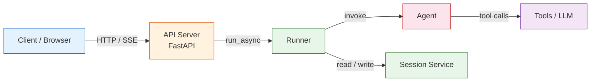

# ADK Web Integration

## Prerequisites

Before starting this lesson, you should be familiar with:

- Google ADK agent definition and tool use ([Agent Definition Patterns](./02-agent-definition-patterns.md))
- ADK Runners and session management ([Runners and Session Management](./05-runners-and-session-management.md))
- Callbacks and observability ([Callbacks and Observability](./08-callbacks-and-observability.md))
- Basic FastAPI or Flask knowledge ([HTTP & API Communication](../../01-web-development-fundamentals/06-http-api-communication/_complete-unit.md))

## Introduction

Building an agent is only half the story — we need a way for users (and other systems) to actually talk to it. Google ADK ships with two built-in web surfaces that cover the entire development-to-production lifecycle: **`adk web`**, a rich development UI for interactive testing, and **`adk api_server`**, a production-grade FastAPI REST API. For teams that need full control over routing, middleware, and deployment, ADK's `Runner` also plugs directly into any custom FastAPI or Flask application.

In this lesson we'll explore all three approaches, wire up Server-Sent Events (SSE) streaming, and survey the deployment options available on Google Cloud.



> **Architecture overview** — The client sends HTTP requests (or opens an SSE connection) to the API server. The server delegates to the ADK `Runner`, which orchestrates the `Agent`, manages sessions through the `SessionService`, and streams events back to the caller.

---

## adk web — The Development UI

The fastest way to interact with an agent during development is `adk web`. A single command launches a full-featured browser interface that auto-discovers every agent in the target directory.

### Starting the Dev UI

```bash
# Start the dev UI with default settings (port 8000)
adk web my_agent/

# Specify a custom port
adk web --port 8080 my_agent/
```

```
Expected output:

INFO:     Started server process [12345]
INFO:     Uvicorn running on http://localhost:8080 (Press CTRL+C to quit)
INFO:     Discovered agent: my_agent
```

ADK discovers agents by scanning for a `root_agent` variable exported from each package's `__init__.py`. If the variable is missing or misspelled, the agent won't appear in the sidebar.

### What the Dev UI Gives Us

The dev UI is far more than a chat window. Let's walk through its panels:

1. **Interactive Chat Interface** — Send messages, view formatted responses, and test multi-turn conversations exactly as a user would experience them.
2. **Event Inspector** — Every event the `Runner` produces is listed chronologically. We can expand any event to inspect tool calls, function arguments, return values, and state mutations.
3. **Session Viewer** — Browse, create, and delete sessions. Inspect the full session state dictionary at any point in the conversation.
4. **Trace Viewer** — Visualize the execution graph: which sub-agents were invoked, which tools fired, and how long each step took.
5. **Visual Builder (Experimental)** — A drag-and-drop canvas for assembling agent graphs without writing code. As of early 2026 this feature is experimental and best suited for rapid prototyping.

> **Tip:** Keep the Event Inspector open while developing tool functions — it shows the raw JSON the LLM receives and returns, which is invaluable for debugging prompt/tool mismatches.

---

## adk api_server — Production REST API

When we're ready to serve real traffic, `adk api_server` wraps our agent in a production-ready FastAPI application with auto-generated OpenAPI docs.

### Starting the API Server

```bash
# Start with defaults (127.0.0.1:8000)
adk api_server my_agent/

# Bind to all interfaces on a custom port
adk api_server --host 0.0.0.0 --port 8080 my_agent/
```

```
Expected output:

INFO:     Started server process [67890]
INFO:     Uvicorn running on http://0.0.0.0:8080 (Press CTRL+C to quit)
INFO:     Application startup complete.
```

Once running, Swagger UI is available at `http://localhost:8080/docs`, giving us a clickable reference for every endpoint.

### Key REST Endpoints

| Method | Endpoint | Description |
|--------|----------|-------------|
| `POST` | `/run` | Run agent and receive a batch (complete) response |
| `POST` | `/run_sse` | Run agent with SSE streaming |
| `POST` | `/apps/{app}/users/{user}/sessions` | Create a new session |
| `GET` | `/apps/{app}/users/{user}/sessions` | List all sessions for a user |
| `GET` | `/apps/{app}/users/{user}/sessions/{session}` | Get a specific session |
| `DELETE` | `/apps/{app}/users/{user}/sessions/{session}` | Delete a session |

### Run Request Body

Both `/run` and `/run_sse` accept the same JSON payload:

```json
{
  "app_name": "my_agent",
  "user_id": "user_1",
  "session_id": "session_123",
  "new_message": {
    "role": "user",
    "parts": [{"text": "What's the weather in London?"}]
  }
}
```

```
Expected response (batch — /run):

{
  "events": [
    {
      "author": "weather_agent",
      "content": {
        "parts": [{"text": "The current weather in London is 12°C with light rain."}]
      }
    }
  ]
}
```

For the `/run_sse` endpoint the response arrives as a stream of `data:` lines — each line is a JSON-encoded event. This is ideal for chat UIs that want to display tokens as they arrive.

---

## Custom FastAPI Integration

The built-in servers cover most scenarios, but sometimes we need custom middleware, authentication, or endpoint shapes. In those cases we import the ADK `Runner` directly into our own FastAPI application.

### Minimal Custom Server

```python
from fastapi import FastAPI
from google.adk.runners import Runner
from google.adk.sessions import InMemorySessionService
from my_agent import root_agent

app = FastAPI()
session_service = InMemorySessionService()
runner = Runner(
    agent=root_agent,
    app_name="my_app",
    session_service=session_service,
)


@app.post("/chat")
async def chat(user_id: str, session_id: str, message: str):
    """Send a message and receive the full response."""
    response_parts = []
    async for event in runner.run_async(
        user_id=user_id,
        session_id=session_id,
        new_message=message,
    ):
        if event.content and event.content.parts:
            response_parts.append(event.content.parts[0].text)
    return {"response": " ".join(response_parts)}
```

```
Expected output (POST /chat?user_id=u1&session_id=s1&message=Hello):

{
  "response": "Hello! How can I help you today?"
}
```

A few things to notice:

- **`InMemorySessionService`** is fine for development but doesn't survive restarts. Swap it for `DatabaseSessionService` or a custom implementation in production.
- **`run_async`** is an async generator — it yields events as they happen, so we can process or forward them incrementally.
- We collect all parts and join them, but in practice an agent may yield multiple events (tool calls, intermediate thoughts, final answer). Filtering by `event.author` or `event.actions` lets us separate those concerns.

### SSE Streaming Endpoint

Real-time chat interfaces feel much snappier when we stream tokens to the client instead of waiting for the full response. FastAPI's `StreamingResponse` pairs perfectly with `run_async`:

```python
from fastapi.responses import StreamingResponse


@app.post("/chat/stream")
async def chat_stream(user_id: str, session_id: str, message: str):
    """Stream agent responses as Server-Sent Events."""

    async def event_generator():
        async for event in runner.run_async(
            user_id=user_id,
            session_id=session_id,
            new_message=message,
        ):
            if event.content and event.content.parts:
                yield f"data: {event.content.parts[0].text}\n\n"
        yield "data: [DONE]\n\n"

    return StreamingResponse(
        event_generator(),
        media_type="text/event-stream",
    )
```

```
Expected output (SSE stream):

data: The current
data: weather in
data: London is 12°C
data: with light rain.
data: [DONE]
```

On the client side, the browser's `EventSource` API or a library like `eventsource-parser` consumes these events effortlessly:

```javascript
const evtSource = new EventSource("/chat/stream?user_id=u1&session_id=s1&message=Hello");

evtSource.onmessage = (event) => {
  if (event.data === "[DONE]") {
    evtSource.close();
    return;
  }
  console.log("Received:", event.data);
};
```

```
Expected browser console output:

Received: Hello!
Received: How can I help you today?
```

> **Note:** SSE is unidirectional (server → client). If you need bidirectional streaming, consider WebSockets with the same `run_async` generator pattern.

---

## Session Management via REST

Managing sessions through the API is straightforward. Here's a typical lifecycle:

### Create a Session

```bash
curl -X POST http://localhost:8080/apps/my_agent/users/user_1/sessions \
  -H "Content-Type: application/json" \
  -d '{}'
```

```
Expected output:

{
  "id": "a1b2c3d4-e5f6-7890-abcd-ef1234567890",
  "app_name": "my_agent",
  "user_id": "user_1",
  "state": {},
  "events": []
}
```

### List Sessions

```bash
curl http://localhost:8080/apps/my_agent/users/user_1/sessions
```

```
Expected output:

[
  {
    "id": "a1b2c3d4-e5f6-7890-abcd-ef1234567890",
    "app_name": "my_agent",
    "user_id": "user_1"
  }
]
```

### Delete a Session

```bash
curl -X DELETE http://localhost:8080/apps/my_agent/users/user_1/sessions/a1b2c3d4-e5f6-7890-abcd-ef1234567890
```

```
Expected output:

HTTP/1.1 200 OK
```

---

## Deployment Options

Once our agent works locally, we need to push it somewhere users can reach it. ADK supports several deployment targets:

| Platform | How | Best For |
|----------|-----|----------|
| **Local** | `adk web` / `adk api_server` | Development and demos |
| **Cloud Run** | Container deployment via `gcloud run deploy` | Serverless production workloads |
| **GKE** | Kubernetes pods with horizontal scaling | High-scale, multi-agent production |
| **Agent Engine** | `adk deploy cloud_run` (managed) | Fully managed Google Cloud hosting |

For Cloud Run, we typically containerize with a simple `Dockerfile`:

```dockerfile
FROM python:3.11-slim

WORKDIR /app
COPY requirements.txt .
RUN pip install --no-cache-dir -r requirements.txt

COPY . .
CMD ["adk", "api_server", "--host", "0.0.0.0", "--port", "8080", "my_agent/"]
```

```
Expected build output:

Successfully built 9f3a2b1c4d5e
Successfully tagged my-adk-agent:latest
```

Then deploy with:

```bash
gcloud run deploy my-adk-agent \
  --source . \
  --region us-central1 \
  --allow-unauthenticated
```

```
Expected output:

Service [my-adk-agent] revision [my-adk-agent-00001] has been deployed
Service URL: https://my-adk-agent-abc123-uc.a.run.app
```

---

## Best Practices

| Practice | Why It Matters |
|----------|---------------|
| Use `adk web` during development, `adk api_server` or custom FastAPI for production | Dev UI adds overhead and exposes debugging tools not meant for end users |
| Stream responses with SSE for chat interfaces | Users perceive latency as lower when tokens appear incrementally |
| Swap `InMemorySessionService` for a persistent store in production | In-memory state is lost on every restart or scale-to-zero event |
| Put the API behind an API gateway or load balancer | Handles TLS termination, rate limiting, and auth centrally |
| Set `--host 0.0.0.0` when running in containers | The default `127.0.0.1` is unreachable from outside the container |
| Add health-check endpoints (`/healthz`, `/readyz`) in custom servers | Required by Cloud Run, GKE, and most orchestrators |
| Use structured logging with request IDs | Makes tracing a single conversation across services possible |

---

## Common Pitfalls

| ❌ Pitfall | ✅ Fix |
|-----------|--------|
| Agent not appearing in `adk web` | Export `root_agent` from `__init__.py` — ADK looks for that exact variable name |
| "Connection refused" in Docker | Use `--host 0.0.0.0` instead of the default `127.0.0.1` |
| SSE connection drops after 30 seconds | Configure your reverse proxy / Cloud Run timeout to exceed the expected response time |
| Session data disappears after redeploy | Replace `InMemorySessionService` with `DatabaseSessionService` or a Cloud-backed store |
| Swagger UI shows no endpoints | Make sure you pass the agent directory, not the agent file, to `adk api_server` |
| CORS errors from browser clients | Add `CORSMiddleware` in your custom FastAPI app or set allowed origins on the API gateway |
| Streaming responses arrive as one chunk | Ensure you yield individual `data:` lines with `\n\n` and set `media_type="text/event-stream"` |

---

## Hands-on Exercise

**Goal:** Build a custom FastAPI server that exposes both a batch `/chat` endpoint and a streaming `/chat/stream` endpoint for an ADK agent, then test both with `curl`.

**Requirements:**
1. Create a simple agent with at least one tool (e.g., a `get_time` tool that returns the current UTC time).
2. Write a FastAPI application that wires the agent to a `Runner` with `InMemorySessionService`.
3. Implement `POST /chat` returning the full response as JSON.
4. Implement `POST /chat/stream` returning SSE events.
5. Test the batch endpoint with `curl` and verify the response.
6. Test the streaming endpoint with `curl --no-buffer` and verify incremental output.

<details>
<summary>💡 Hints</summary>

- Define your agent in a separate module (e.g., `my_agent/__init__.py`) with `root_agent`.
- Use `runner.run_async(user_id=..., session_id=..., new_message=...)` to drive the agent.
- For streaming, wrap an async generator in `StreamingResponse(generator(), media_type="text/event-stream")`.
- To test SSE with curl: `curl -N --no-buffer -X POST "http://localhost:8000/chat/stream?..."`.
- Remember to create a session first (or let ADK auto-create one).

</details>

<details>
<summary>✅ Solution</summary>

**`my_agent/__init__.py`:**

```python
import datetime
from google.adk.agents import Agent


def get_time() -> dict:
    """Return the current UTC time."""
    return {"utc_time": datetime.datetime.now(datetime.timezone.utc).isoformat()}


root_agent = Agent(
    name="time_agent",
    model="gemini-2.0-flash",
    instruction="You are a helpful assistant. Use the get_time tool when asked about the current time.",
    tools=[get_time],
)
```

**`server.py`:**

```python
from fastapi import FastAPI
from fastapi.responses import StreamingResponse
from google.adk.runners import Runner
from google.adk.sessions import InMemorySessionService
from my_agent import root_agent

app = FastAPI()
session_service = InMemorySessionService()
runner = Runner(
    agent=root_agent,
    app_name="time_app",
    session_service=session_service,
)


@app.post("/chat")
async def chat(user_id: str, session_id: str, message: str):
    response_parts = []
    async for event in runner.run_async(
        user_id=user_id,
        session_id=session_id,
        new_message=message,
    ):
        if event.content and event.content.parts:
            response_parts.append(event.content.parts[0].text)
    return {"response": " ".join(response_parts)}


@app.post("/chat/stream")
async def chat_stream(user_id: str, session_id: str, message: str):
    async def event_generator():
        async for event in runner.run_async(
            user_id=user_id,
            session_id=session_id,
            new_message=message,
        ):
            if event.content and event.content.parts:
                yield f"data: {event.content.parts[0].text}\n\n"
        yield "data: [DONE]\n\n"

    return StreamingResponse(
        event_generator(),
        media_type="text/event-stream",
    )
```

**Testing:**

```bash
# Start the server
uvicorn server:app --reload

# Test batch endpoint
curl -X POST "http://localhost:8000/chat?user_id=u1&session_id=s1&message=What%20time%20is%20it"

# Test streaming endpoint
curl -N --no-buffer -X POST "http://localhost:8000/chat/stream?user_id=u1&session_id=s1&message=What%20time%20is%20it"
```

</details>

---

## Summary

In this lesson we explored the three ways to serve ADK agents over the web:

- ✅ **`adk web`** launches a feature-rich development UI with chat, event inspection, session management, and trace visualization.
- ✅ **`adk api_server`** provides a production-ready FastAPI REST API with `/run`, `/run_sse`, and full session CRUD endpoints.
- ✅ **Custom FastAPI integration** gives us complete control — we import `Runner` and `SessionService` directly and build any endpoint shape we need.
- ✅ **SSE streaming** via `StreamingResponse` and `run_async` delivers tokens to the client in real time, dramatically improving perceived latency.
- ✅ **Session management** is available through REST endpoints for creating, listing, retrieving, and deleting sessions.
- ✅ **Deployment targets** range from local development to fully managed Google Cloud hosting via Cloud Run, GKE, and Agent Engine.

---

## Navigation

| | |
|---|---|
| ⬅️ Previous | [Callbacks and Observability](./08-callbacks-and-observability.md) |
| ➡️ Next | [Multi-Language SDK Support](./10-multi-language-sdk-support.md) |
| 🏠 Overview | [Back to Google ADK Overview](./00-google-agent-development-kit.md) |

## Further Reading

- [ADK Web UI Documentation](https://google.github.io/adk-docs/get-started/quickstart/) — Official quickstart guide covering `adk web` setup
- [ADK API Server Reference](https://google.github.io/adk-docs/runtime/api-server/) — Full endpoint documentation for `adk api_server`
- [FastAPI Documentation](https://fastapi.tiangolo.com/) — Comprehensive guide to building APIs with FastAPI
- [Server-Sent Events (MDN)](https://developer.mozilla.org/en-US/docs/Web/API/Server-sent_events) — Browser-side SSE API reference
- [Cloud Run Deployment Guide](https://cloud.google.com/run/docs/deploying) — Deploying containerized applications on Google Cloud Run
- [ADK Deploy CLI Reference](https://google.github.io/adk-docs/deploy/cloud-run/) — Using `adk deploy` for managed deployments

<!-- Sources:
  - Google ADK Documentation: https://google.github.io/adk-docs/
  - ADK GitHub Repository: https://github.com/google/adk-python
  - FastAPI Documentation: https://fastapi.tiangolo.com/
  - MDN Server-Sent Events: https://developer.mozilla.org/en-US/docs/Web/API/Server-sent_events
  - Google Cloud Run Docs: https://cloud.google.com/run/docs
  - ADK API Server source code and CLI help output
-->
