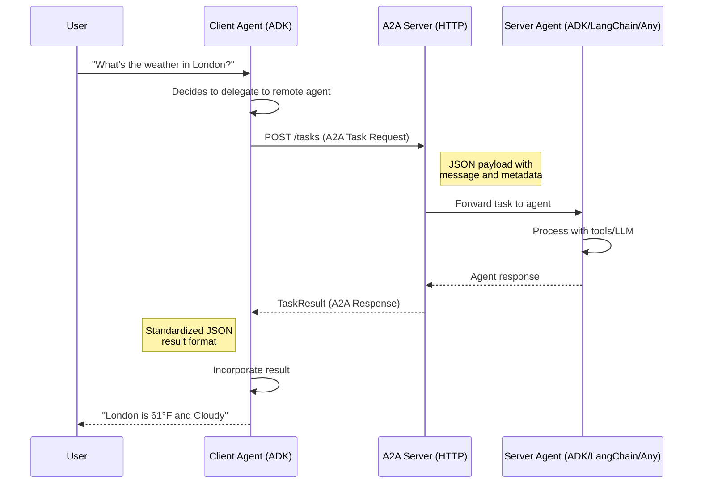

# A2A Protocol: Cross-Framework Agent Communication in Google ADK

Modern AI systems rarely live in isolation. As organizations scale their agent architectures, they inevitably encounter a challenge: how do agents built by different teams, in different languages, on different frameworks, communicate with each other? Google's **Agent-to-Agent (A2A) protocol** answers this question with an open standard now housed under the Linux Foundation. In this lesson, we'll explore how A2A works, how ADK natively supports it, and how we can wire up agents across framework boundaries as easily as calling a REST API.

---

## What Is the A2A Protocol?

The Agent-to-Agent (A2A) protocol is an **open, interoperable standard** for agent communication. Think of it as HTTP for AI agents — a shared language that any agent can speak, regardless of its internal implementation.

### Core Principles

- **Framework-agnostic**: An ADK agent can talk to a LangChain agent, a CrewAI agent, or a fully custom agent — all through the same protocol.
- **Language-agnostic**: Python agents communicate seamlessly with TypeScript, Go, or Java agents.
- **Network-based**: Agents communicate over **HTTP/HTTPS**, meaning they can run on different machines, different clouds, or different continents.
- **Standardized message format**: Every A2A message follows a well-defined JSON schema — no custom serialization needed.
- **Discovery via Agent Cards**: Agents advertise their capabilities through a machine-readable manifest served at a well-known URL.

A2A doesn't replace your agent framework — it sits **alongside** it, providing the communication layer between independently deployed agent services.

---

## A2A vs. `sub_agents` (Local Multi-Agent)

ADK already supports multi-agent orchestration through `sub_agents`. So when should we reach for A2A instead? Let's compare the two approaches directly.

| Feature | `sub_agents` | A2A |
|---|---|---|
| **Communication** | In-process function calls | Over network (HTTP/HTTPS) |
| **Memory sharing** | Shared session state | Isolated — each agent owns its state |
| **Language** | Same language (Python) | Any language (Python, TS, Go, Java) |
| **Framework** | Same framework (ADK) | Any framework (ADK, LangChain, CrewAI…) |
| **Deployment** | Same process / container | Separate services / containers |
| **Discovery** | Compile-time imports | Runtime discovery via Agent Card |
| **Latency** | Microseconds (in-memory) | Milliseconds (network round-trip) |
| **Use case** | Internal tightly-coupled agents | Cross-team, cross-service agents |

The key insight: **`sub_agents` are for agents you own and co-deploy; A2A is for agents you connect to as services.**

---

## When to Use A2A

### ✅ Use A2A When

- **Agents are built by different teams** — each team deploys and versions their agent independently.
- **Agents use different frameworks** — your team uses ADK, another uses LangChain.
- **Agents run as separate services** — microservice architecture for agents.
- **You need a formal API contract** — the Agent Card serves as a machine-readable interface definition.
- **Agents are written in different languages** — a Python orchestrator delegates to a Go specialist agent.
- **Third-party agent integration** — consuming agents from external vendors or open-source communities.

### ❌ Don't Use A2A When

- **All agents live in one codebase** — `sub_agents` is simpler and faster.
- **Agents need shared memory/state** — A2A agents have isolated sessions.
- **Simple parent-child delegation suffices** — don't add network overhead for internal routing.
- **Ultra-low latency is critical** — HTTP round-trips add milliseconds that in-process calls avoid.

---

## The Agent Card: Discovery Mechanism

Before an agent can communicate via A2A, it needs to be **discoverable**. The Agent Card is a JSON manifest served at a well-known URL (`/.well-known/agent.json`) that describes what the agent can do.

```json
{
  "name": "weather-agent",
  "description": "Provides weather information for any city worldwide",
  "url": "http://localhost:8001",
  "capabilities": ["text"],
  "skills": [
    {
      "name": "get_weather",
      "description": "Get current weather conditions for a specified city"
    },
    {
      "name": "get_forecast",
      "description": "Get a 5-day weather forecast for a specified city"
    }
  ]
}
```

**Expected output** when fetching `http://localhost:8001/.well-known/agent.json`:

```text
HTTP/1.1 200 OK
Content-Type: application/json

{
  "name": "weather-agent",
  "description": "Provides weather information for any city worldwide",
  "url": "http://localhost:8001",
  "capabilities": ["text"],
  "skills": [...]
}
```

The Agent Card tells client agents:

- **What** the agent does (name, description, skills).
- **Where** to reach it (url).
- **How** it communicates (capabilities — text, streaming, etc.).

This is analogous to an OpenAPI spec for REST APIs, but purpose-built for agent interactions.

---

## Exposing an ADK Agent via A2A (Server Side)

Let's build a weather agent and expose it as an A2A service. First, we define a standard ADK agent with a tool, then wrap it in an `A2AServer`.

```python
from google.adk.agents import Agent
from google.adk.a2a import A2AServer


def get_weather(city: str) -> dict:
    """Get current weather for a city."""
    # In production, call a real weather API
    weather_data = {
        "New York": {"temp": 72, "condition": "Sunny"},
        "London": {"temp": 61, "condition": "Cloudy"},
        "Tokyo": {"temp": 78, "condition": "Partly Cloudy"},
    }
    return weather_data.get(city, {"temp": 0, "condition": "Unknown city"})


# Define the ADK agent
weather_agent = Agent(
    name="weather_agent",
    model="gemini-2.0-flash",
    instruction="You provide weather information. Use the get_weather tool to look up current conditions for any city the user asks about.",
    tools=[get_weather],
)

# Expose as an A2A service
a2a_server = A2AServer(
    agent=weather_agent,
    host="0.0.0.0",
    port=8001,
)

a2a_server.start()
```

**Expected output:**

```text
INFO:     A2A Server starting...
INFO:     Agent Card published at http://0.0.0.0:8001/.well-known/agent.json
INFO:     Uvicorn running on http://0.0.0.0:8001
INFO:     A2A Server ready to accept tasks
```

That's it. Our weather agent is now a network service that any A2A-compatible client can discover and invoke — regardless of what language or framework that client uses.

---

## Consuming an A2A Agent (Client Side)

Now let's build a client agent that **discovers** and **uses** the remote weather agent. ADK provides the `RemoteA2aAgent` class that wraps an A2A endpoint as a local sub-agent.

```python
from google.adk.agents import Agent
from google.adk.a2a import RemoteA2aAgent

# Connect to the remote A2A weather agent
remote_weather = RemoteA2aAgent(
    name="remote_weather",
    description="Remote weather service agent providing real-time weather data",
    agent_card_url="http://localhost:8001/.well-known/agent.json",
)

# Use it as a sub-agent in a local orchestrator
root_agent = Agent(
    name="assistant",
    model="gemini-2.0-flash",
    instruction="""You are a helpful assistant. You can help users with various tasks.
    When users ask about weather, delegate to the remote_weather agent.
    When users ask about other topics, answer directly.""",
    sub_agents=[remote_weather],
)
```

**Expected output** when running a query like *"What's the weather in Tokyo?"*:

```text
User: What's the weather in Tokyo?
[assistant] → Delegating to remote_weather agent...
[remote_weather] → Sending A2A task to http://localhost:8001
[weather_agent] → Tool call: get_weather(city="Tokyo")
[weather_agent] → Result: {"temp": 78, "condition": "Partly Cloudy"}
Assistant: The current weather in Tokyo is 78°F and Partly Cloudy.
```

Notice that `root_agent` treats `remote_weather` exactly like any other sub-agent. The A2A communication is completely transparent — the orchestrator doesn't know or care that the weather agent runs in a separate process.

---

## A2A Communication Flow

Let's visualize how messages flow between a client agent and an A2A server agent:



The flow follows four key steps:

1. **Task creation** — The client agent sends a `Task` to the A2A server's HTTP endpoint.
2. **Agent processing** — The server's internal agent (any framework) processes the task using its tools and LLM.
3. **Result return** — The server returns a `TaskResult` with the agent's response (or streams updates for long-running tasks).
4. **Result integration** — The client agent incorporates the result into its own conversation.

---

## Cross-Framework Example: ADK ↔ LangChain

One of A2A's most powerful features is cross-framework communication. Let's look at a scenario where an ADK orchestrator connects to a LangChain research agent.

### LangChain Agent (Server — Port 8002)

```python
# langchain_research_server.py
from langchain.agents import AgentExecutor, create_tool_calling_agent
from langchain_google_genai import ChatGoogleGenerativeAI
from langchain.tools import tool
from a2a.server import A2AServer  # A2A Python SDK

@tool
def search_papers(query: str) -> str:
    """Search academic papers on a given topic."""
    return f"Found 3 papers on '{query}': [Paper1], [Paper2], [Paper3]"

llm = ChatGoogleGenerativeAI(model="gemini-2.0-flash")
agent = create_tool_calling_agent(llm, [search_papers], prompt=...)
executor = AgentExecutor(agent=agent, tools=[search_papers])

# Wrap LangChain agent in A2A server
server = A2AServer(agent_executor=executor, port=8002)
server.start()
```

**Expected output:**

```text
INFO:     LangChain A2A Server running on http://0.0.0.0:8002
INFO:     Agent Card: http://0.0.0.0:8002/.well-known/agent.json
```

### ADK Orchestrator (Client)

```python
# adk_orchestrator.py
from google.adk.agents import Agent
from google.adk.a2a import RemoteA2aAgent

# Connect to LangChain agent — no LangChain import needed!
remote_researcher = RemoteA2aAgent(
    name="researcher",
    description="Academic research agent that searches papers",
    agent_card_url="http://localhost:8002/.well-known/agent.json",
)

orchestrator = Agent(
    name="orchestrator",
    model="gemini-2.0-flash",
    instruction="You coordinate research tasks. Delegate paper searches to the researcher agent.",
    sub_agents=[remote_researcher],
)
```

**Expected output** for a research query:

```text
User: Find papers about transformer architectures
[orchestrator] → Delegating to researcher agent...
[researcher] → A2A call to http://localhost:8002
Researcher: Found 3 papers on 'transformer architectures': [Paper1], [Paper2], [Paper3]
Orchestrator: I found 3 relevant papers on transformer architectures...
```

Neither agent knows what framework the other uses. The ADK orchestrator doesn't import LangChain. The LangChain agent doesn't import ADK. **A2A is the shared language.**

---

## Security Considerations

Exposing agents over the network demands proper security practices. A2A supports several security mechanisms.

### Authentication

```python
# API key authentication
a2a_server = A2AServer(
    agent=weather_agent,
    host="0.0.0.0",
    port=8001,
    auth_config={
        "type": "api_key",
        "header": "X-API-Key",
        "keys": ["sk-prod-abc123", "sk-staging-xyz789"],
    },
)

# Client with API key
remote_weather = RemoteA2aAgent(
    name="remote_weather",
    description="Authenticated weather agent",
    agent_card_url="http://localhost:8001/.well-known/agent.json",
    headers={"X-API-Key": "sk-prod-abc123"},
)
```

**Expected output** without a valid key:

```text
HTTP/1.1 401 Unauthorized
{"error": "Invalid or missing API key"}
```

### Security Checklist

- **TLS/HTTPS** — Always use encrypted connections in production.
- **Authentication** — Require API keys or OAuth tokens on every A2A endpoint.
- **Rate limiting** — Protect A2A endpoints from excessive requests.
- **Input validation** — Sanitize all incoming task payloads before processing.
- **Network policies** — Restrict which services can reach your A2A endpoints.

---

## Best Practices

| Practice | Description |
|---|---|
| **Descriptive Agent Cards** | Write clear, specific descriptions and skill names — client agents use these to decide when to delegate |
| **Versioned endpoints** | Include version info in your Agent Card to avoid breaking changes |
| **Health checks** | Implement a `/health` endpoint alongside your A2A server for monitoring |
| **Graceful degradation** | Handle cases where a remote A2A agent is unavailable — provide fallback behavior |
| **Timeout configuration** | Set reasonable timeouts on `RemoteA2aAgent` to avoid hanging on slow responses |
| **Structured logging** | Log all A2A task requests and responses for debugging cross-agent interactions |
| **Idempotent tasks** | Design agent tasks to be safely retryable in case of network failures |
| **Minimize payload size** | Send only necessary data in A2A messages to reduce latency |

---

## Common Pitfalls

| ❌ Don't | ✅ Do |
|---|---|
| Use A2A for agents in the same process | Use `sub_agents` for co-located agents — no network overhead |
| Hardcode agent URLs | Use service discovery or environment variables for agent endpoints |
| Skip authentication on A2A endpoints | Always authenticate — agents are API surfaces exposed over the network |
| Share session state across A2A boundaries | Design agents to be self-contained; pass needed context in the task message |
| Ignore error handling for remote calls | Wrap A2A calls in try/except with retries and fallback logic |
| Use A2A for latency-sensitive hot paths | Reserve A2A for cross-team/cross-framework scenarios where isolation matters |
| Deploy without TLS in production | Always use HTTPS for A2A communication outside localhost |
| Create vague Agent Card descriptions | Write precise descriptions so client agents route tasks correctly |

---

## Hands-on Exercise

**Build a two-agent A2A system**: Create a math agent that exposes basic arithmetic operations over A2A, then build an orchestrator agent that discovers and uses it.

### Requirements

1. Create a `math_agent` with tools for `add`, `multiply`, and `factorial`.
2. Expose the math agent as an A2A server on port `8003`.
3. Create an `orchestrator` agent that connects to the math agent via `RemoteA2aAgent`.
4. Test with the query: *"What is 5 factorial plus 3 times 7?"*

<details>
<summary>💡 Hints</summary>

- Define each math operation as a separate Python function with type hints.
- The `A2AServer` wraps any ADK `Agent` — just pass it to the constructor.
- The `RemoteA2aAgent` needs the agent card URL: `http://localhost:8003/.well-known/agent.json`.
- Run the server in one terminal, the client in another.
- The orchestrator should break the query into steps: compute factorial(5) = 120, compute 3 × 7 = 21, then add 120 + 21 = 141.

</details>

<details>
<summary>🔑 Solution</summary>

**Server (math_server.py):**

```python
import math
from google.adk.agents import Agent
from google.adk.a2a import A2AServer


def add(a: float, b: float) -> float:
    """Add two numbers together."""
    return a + b


def multiply(a: float, b: float) -> float:
    """Multiply two numbers together."""
    return a * b


def factorial(n: int) -> int:
    """Calculate the factorial of a non-negative integer."""
    return math.factorial(n)


math_agent = Agent(
    name="math_agent",
    model="gemini-2.0-flash",
    instruction="You are a math agent. Use your tools to perform calculations accurately.",
    tools=[add, multiply, factorial],
)

a2a_server = A2AServer(
    agent=math_agent,
    host="0.0.0.0",
    port=8003,
)

if __name__ == "__main__":
    a2a_server.start()
```

**Client (orchestrator.py):**

```python
from google.adk.agents import Agent
from google.adk.a2a import RemoteA2aAgent
from google.adk.runners import Runner
from google.adk.sessions import InMemorySessionService

remote_math = RemoteA2aAgent(
    name="math_service",
    description="Remote math agent for arithmetic and factorial calculations",
    agent_card_url="http://localhost:8003/.well-known/agent.json",
)

orchestrator = Agent(
    name="orchestrator",
    model="gemini-2.0-flash",
    instruction="""You are a helpful assistant. For any math calculations, 
    delegate to the math_service agent. Break complex expressions into steps.""",
    sub_agents=[remote_math],
)

# Run the orchestrator
session_service = InMemorySessionService()
runner = Runner(agent=orchestrator, app_name="math_app", session_service=session_service)
```

**Expected output:**

```text
User: What is 5 factorial plus 3 times 7?
[orchestrator] → Delegating math to math_service...
[math_service] → factorial(5) = 120
[math_service] → multiply(3, 7) = 21
[math_service] → add(120, 21) = 141
Orchestrator: 5! + (3 × 7) = 120 + 21 = **141**
```

</details>

---

## Summary

✅ A2A is an open protocol (Linux Foundation) enabling agent communication across frameworks, languages, and organizations.

✅ Agent Cards provide runtime discovery — agents advertise their capabilities at `/.well-known/agent.json`.

✅ ADK supports A2A natively with `A2AServer` (expose agents) and `RemoteA2aAgent` (consume agents).

✅ Use A2A for cross-team, cross-framework, cross-language agent communication; use `sub_agents` for co-located agents.

✅ A2A is framework-agnostic — ADK agents can communicate with LangChain, CrewAI, or any A2A-compatible agent.

✅ Security is critical — always use authentication, TLS, rate limiting, and input validation on A2A endpoints.

✅ The protocol follows a Task → Process → TaskResult flow over standard HTTP.

---

## Next

[Workflow Agents](./12-workflow-agents.md)

## Further Reading

- [A2A Protocol Specification (Linux Foundation)](https://github.com/a2aprotocol/a2a)
- [Google ADK A2A Documentation](https://google.github.io/adk-docs/a2a/)
- [Agent Card Schema Reference](https://google.github.io/adk-docs/a2a/agent-card/)
- [A2A Python SDK](https://pypi.org/project/a2a-sdk/)
- [Building Multi-Agent Systems with A2A — Google Cloud Blog](https://cloud.google.com/blog/topics/ai-machine-learning/a2a-protocol)
- [A2A vs MCP: Complementary Protocols for AI Agents](https://google.github.io/adk-docs/a2a/a2a-vs-mcp/)

---

[← Multi-Language SDK Support](./10-multi-language-sdk-support.md) · [Back to Google ADK Overview](./00-google-agent-development-kit.md)

<!-- Sources:
  - A2A Protocol Specification: https://github.com/a2aprotocol/a2a
  - Google ADK Documentation - A2A: https://google.github.io/adk-docs/a2a/
  - Google Developers Blog - A2A Announcement: https://developers.googleblog.com/en/a2a-a-new-era-of-agent-interoperability/
  - Linux Foundation AI & Data - A2A: https://lfaidata.foundation/projects/a2a/
  - Google ADK GitHub Repository: https://github.com/google/adk-python
  - A2A Protocol Samples: https://github.com/google/adk-python/tree/main/samples/a2a
-->
