# Workflow Agents: SequentialAgent, ParallelAgent, and LoopAgent in Google ADK

Not every orchestration decision needs an LLM. When we already know the exact steps a pipeline should follow, paying for an LLM call at every routing point is wasteful — and introduces unnecessary non-determinism. Google ADK's **workflow agents** solve this by giving us three composable primitives — `SequentialAgent`, `ParallelAgent`, and `LoopAgent` — that orchestrate sub-agents with zero LLM overhead. In this lesson we'll build with each one, compose them together, and learn when to reach for deterministic orchestration over LLM-based routing.

**Prerequisites:**

- Familiarity with Google ADK agent basics ([Agent Definition Patterns](./02-agent-definition-patterns.md))
- Understanding of `output_key` and session state ([State Management](./06-state-management.md))
- Python 3.10+ with `google-adk` installed

---

## Why Workflow Agents?

Before we dive into code, let's clarify the problem workflow agents address. An `LlmAgent` (or simply `Agent`) uses a language model to decide *what to do next*. That's powerful for open-ended tasks, but it comes with trade-offs:

- **Cost** — every routing decision burns tokens.
- **Latency** — each decision requires a round-trip to the model.
- **Non-determinism** — the model might choose a different path on every run.

Workflow agents eliminate all three issues for scenarios where the execution pattern is known ahead of time:

| Benefit | Description |
|---|---|
| **Predictable execution order** | Steps always run in the same sequence, in parallel, or in a loop — no surprises. |
| **No LLM cost for orchestration** | The workflow agent itself never calls an LLM; only its leaf sub-agents do. |
| **Reliable, deterministic pipelines** | Given the same input, you get the same execution graph every time. |
| **Composable with LLM agents** | Workflow agents nest freely — mix deterministic structure with intelligent sub-agents. |

Think of workflow agents as the *skeleton* of your pipeline and LLM agents as the *muscles* that do the actual reasoning at each step.

---

## SequentialAgent

`SequentialAgent` is the simplest workflow primitive. It runs its sub-agents **one after another**, in the order we provide them. Each sub-agent can write to session state via `output_key`, and the next sub-agent can read that state through template variables in its instruction.

### How It Works


The `SequentialAgent` iterates through `sub_agents` from index 0 to n−1. It does not make any decisions — it simply advances to the next agent after the current one completes.

### Building a Content Pipeline

Let's build a three-step content generation pipeline where each agent builds on the previous agent's output:

```python
from google.adk.agents import SequentialAgent, Agent

step1 = Agent(
    name="researcher",
    model="gemini-2.0-flash",
    instruction="Research the given topic. Save findings.",
    output_key="research_findings",
)

step2 = Agent(
    name="writer",
    model="gemini-2.0-flash",
    instruction="Write an article based on these findings: {research_findings}",
    output_key="draft_article",
)

step3 = Agent(
    name="editor",
    model="gemini-2.0-flash",
    instruction="Edit and polish this article: {draft_article}",
    output_key="final_article",
)

content_pipeline = SequentialAgent(
    name="content_pipeline",
    sub_agents=[step1, step2, step3],
)
```

```text
Expected execution flow:
───────────────────────
1. "researcher" runs → writes to state["research_findings"]
2. "writer" runs   → reads {research_findings}, writes to state["draft_article"]
3. "editor" runs   → reads {draft_article}, writes to state["final_article"]

Final state contains all three keys with their respective outputs.
```

### Data Flow Through State

The key mechanism here is `output_key`. When an agent finishes, ADK stores its final response text in `session.state[output_key]`. Subsequent agents reference that value using curly-brace template syntax inside their `instruction` string. This is how data flows between steps without any explicit wiring — the session state acts as a shared blackboard.

---

## ParallelAgent

When sub-agents don't depend on each other's output, we can run them **concurrently** with `ParallelAgent`. This dramatically reduces wall-clock time for tasks like multi-source research, simultaneous API calls, or fan-out data gathering.

### How It Works


All sub-agents start at the same time. The `ParallelAgent` waits for every sub-agent to complete before it finishes. Each sub-agent writes to its own `output_key`, so there are no write conflicts.

### Multi-Source Research Example

```python
from google.adk.agents import ParallelAgent, Agent

news_search = Agent(
    name="news_search",
    model="gemini-2.0-flash",
    instruction="Search for recent news about {topic}.",
    output_key="news_results",
)

academic_search = Agent(
    name="academic_search",
    model="gemini-2.0-flash",
    instruction="Search for academic papers about {topic}.",
    output_key="academic_results",
)

social_search = Agent(
    name="social_search",
    model="gemini-2.0-flash",
    instruction="Search for social media discussions about {topic}.",
    output_key="social_results",
)

parallel_research = ParallelAgent(
    name="parallel_research",
    sub_agents=[news_search, academic_search, social_search],
)
```

```text
Expected execution flow:
───────────────────────
All three agents run concurrently:
  ├─ "news_search"     → writes to state["news_results"]
  ├─ "academic_search" → writes to state["academic_results"]
  └─ "social_search"   → writes to state["social_results"]

Wall-clock time ≈ max(time_news, time_academic, time_social)
                  instead of sum of all three.
```

> **Important:** Each sub-agent in a `ParallelAgent` must use a **unique** `output_key`. If two agents write to the same key, the last one to finish wins — and that order is non-deterministic.

---

## LoopAgent

`LoopAgent` repeats its sub-agents until one of them triggers an **escalate** action, or until a `max_iterations` safety limit is reached. This is ideal for iterative refinement workflows — generate, review, improve, repeat.

### How It Works



```mermaid
flowchart TD
    Start(["LoopAgent: refinement_loop"]) --> Gen["Generator"]
    Gen --> Critic["Critic"]
    Critic -->|"Needs improvement"| Gen
    Critic -->|"APPROVED → escalate"| Done(["Loop exits"])
    Start -.->|"max_iterations reached"| Done
    style Start fill:#4285F4,color:#fff
    style Done fill:#34A853,color:#fff
    style Gen fill:#FBBC05,color:#000
    style Critic fill:#EA4335,color:#fff
```

Each iteration runs all sub-agents once (in order, like a `SequentialAgent`). After each full pass, the `LoopAgent` checks whether any agent triggered the `escalate` action. If yes, the loop stops. If no, and we haven't hit `max_iterations`, we go again.

### Iterative Refinement Example

```python
from google.adk.agents import LoopAgent, SequentialAgent, Agent

generator = Agent(
    name="generator",
    model="gemini-2.0-flash",
    instruction="""Generate or improve content based on feedback: {feedback}.
    Current draft: {current_draft}""",
    output_key="current_draft",
)

critic = Agent(
    name="critic",
    model="gemini-2.0-flash",
    instruction="""Review this draft: {current_draft}
    If it's good enough, say 'APPROVED' and use the escalate tool.
    If it needs improvement, provide specific feedback.""",
    output_key="feedback",
)

refinement_loop = LoopAgent(
    name="refinement_loop",
    max_iterations=5,
    sub_agents=[SequentialAgent(
        name="generate_and_review",
        sub_agents=[generator, critic],
    )],
)
```

```text
Expected execution flow:
───────────────────────
Iteration 1:
  generator → produces initial draft → state["current_draft"]
  critic    → reviews draft → state["feedback"] = "Needs more examples"

Iteration 2:
  generator → improves draft using feedback → state["current_draft"]
  critic    → reviews again → state["feedback"] = "APPROVED" + escalate

Loop exits after 2 iterations. Final output in state["current_draft"].

If the critic never approves, loop stops after max_iterations=5.
```

### The Escalate Action

The `escalate` action is the mechanism that breaks a `LoopAgent` out of its cycle. Here's how it works:

1. **The critic agent** includes the word "escalate" in its tool usage or ADK detects an escalation signal from the agent's response.
2. **ADK intercepts** the escalate event at the `LoopAgent` level.
3. **The loop stops** — no further iterations run.
4. **`max_iterations`** serves as a safety net. If the critic never escalates (perhaps it's stuck in an infinite improvement cycle), the loop will still terminate after the specified number of passes.

This two-layer exit strategy — explicit escalation plus a hard cap — ensures that our loops are both intelligent *and* safe.

---

## Composing Workflow Agents

The real power of workflow agents emerges when we **nest** them. Since every workflow agent is itself an agent, we can freely combine `SequentialAgent`, `ParallelAgent`, and `LoopAgent` into arbitrarily complex pipelines.

### Full Composed Pipeline

```python
full_pipeline = SequentialAgent(
    name="full_pipeline",
    sub_agents=[
        intake_agent,              # Step 1: Classify input
        ParallelAgent(             # Step 2: Research in parallel
            name="research_phase",
            sub_agents=[searcher_a, searcher_b, searcher_c],
        ),
        LoopAgent(                 # Step 3: Refine output
            name="refinement",
            max_iterations=3,
            sub_agents=[SequentialAgent(
                name="draft_review",
                sub_agents=[drafter, reviewer],
            )],
        ),
        formatter_agent,           # Step 4: Final formatting
    ],
)
```

```text
Expected execution flow:
───────────────────────
Step 1: intake_agent classifies the user's request
    │
Step 2: Three searchers run IN PARALLEL
    ├─ searcher_a
    ├─ searcher_b
    └─ searcher_c
    │
Step 3: Draft/review LOOP (up to 3 iterations)
    ├─ Iteration 1: drafter → reviewer → "needs work"
    └─ Iteration 2: drafter → reviewer → escalate → done
    │
Step 4: formatter_agent produces the final output
```


This pattern — **classify → fan-out → refine → format** — is remarkably common in production AI pipelines, and workflow agents let us express it with zero ambiguity about execution order.

---

## Workflow Agents vs LLM-Based Orchestration

When should we use workflow agents, and when should we let an LLM decide the path? Here's a direct comparison:

| Feature | Workflow Agents | LLM Orchestration |
|---|---|---|
| **Decision making** | Predetermined | Dynamic |
| **Cost** | No LLM calls for routing | LLM call per decision |
| **Reliability** | Deterministic | Probabilistic |
| **Flexibility** | Fixed paths | Adaptive |
| **Latency** | Near zero for routing | Added latency per decision |
| **Debugging** | Easy — same path every time | Harder — path may vary |
| **Best for** | Known workflows | Open-ended tasks |

**Rule of thumb:** If we can draw the pipeline on a whiteboard before writing code, we should use workflow agents. If the next step depends on *understanding* the content of the previous step's output, we need an LLM orchestrator.

In practice, the best architectures **blend both**: workflow agents handle the structural skeleton while LLM agents handle the reasoning at each node.

---

## Callbacks on Workflow Agents

All three workflow agent types support `before_agent_callback` and `after_agent_callback`. These fire before and after the **entire** workflow agent runs — not before each sub-agent.

```python
from google.adk.agents import SequentialAgent

def log_start(callback_context):
    print(f"Pipeline starting at {callback_context.state.get('start_time')}")

def log_end(callback_context):
    print(f"Pipeline completed. Final output: {callback_context.state.get('final_article')}")

pipeline = SequentialAgent(
    name="logged_pipeline",
    sub_agents=[step1, step2, step3],
    before_agent_callback=log_start,
    after_agent_callback=log_end,
)
```

```text
Expected output:
───────────────
Pipeline starting at 2026-02-09T10:00:00
  ... (sub-agents execute) ...
Pipeline completed. Final output: <polished article text>
```

Callbacks are invaluable for logging, metrics collection, and injecting pre-/post-processing logic without modifying the sub-agents themselves.

---

## Best Practices

| Practice | Details |
|---|---|
| **Use unique `output_key` values** | Especially in `ParallelAgent` — conflicting keys cause race conditions. |
| **Always set `max_iterations`** | Every `LoopAgent` should have a hard cap to prevent runaway loops. |
| **Keep sub-agent lists short** | Break complex workflows into nested workflow agents for readability. |
| **Name agents descriptively** | Names appear in logs and traces — `"step1"` is less helpful than `"research_classifier"`. |
| **Test each sub-agent independently** | Verify each agent works in isolation before composing them. |
| **Use callbacks for cross-cutting concerns** | Logging, timing, and validation belong in callbacks, not in agent instructions. |
| **Prefer `SequentialAgent` as the outer wrapper** | Most real pipelines are sequential at the top level with parallel/loop sections nested inside. |

---

## Common Pitfalls

| | Pitfall | Fix |
|---|---|---|
| ❌ | Using the same `output_key` for two parallel sub-agents | ✅ Assign a unique `output_key` to every sub-agent |
| ❌ | Forgetting `max_iterations` on a `LoopAgent` | ✅ Always set a reasonable `max_iterations` (3–10 is typical) |
| ❌ | Putting dependent agents inside a `ParallelAgent` | ✅ Only parallelize agents that are truly independent |
| ❌ | Writing complex routing logic in agent instructions | ✅ Use workflow agents for deterministic routing; reserve instructions for reasoning |
| ❌ | Nesting too many levels deep (>4) | ✅ Flatten or refactor into named sub-pipelines for clarity |
| ❌ | Expecting `before_agent_callback` to fire per sub-agent | ✅ Callbacks fire on the workflow agent itself; use sub-agent callbacks for per-step hooks |
| ❌ | Not providing an escalation path in `LoopAgent` | ✅ Ensure at least one sub-agent can trigger `escalate` to exit the loop cleanly |

---

## Hands-on Exercise

**Build a research-and-summarize pipeline** that:

1. Takes a topic from the user.
2. Runs three research agents **in parallel** (news, academic, blog sources).
3. Passes all results to a **sequential** synthesis step: first a combiner agent merges the research, then a summarizer agent produces a final summary.
4. Wraps the synthesis in a **loop** (max 3 iterations) where a quality checker either approves (escalates) or sends feedback for improvement.

Your final pipeline should be a single `SequentialAgent` with a `ParallelAgent` and a `LoopAgent` nested inside.

<details>
<summary>💡 Hints</summary>

- Start by defining the three parallel research agents with distinct `output_key` values like `"news_data"`, `"academic_data"`, and `"blog_data"`.
- The combiner agent's instruction should reference all three keys: `{news_data}`, `{academic_data}`, `{blog_data}`.
- The quality checker needs explicit instructions to use `escalate` when the summary meets a defined quality bar.
- Nest the combiner + summarizer + checker inside a `LoopAgent` wrapped in a `SequentialAgent`.

</details>

<details>
<summary>✅ Solution</summary>

```python
from google.adk.agents import SequentialAgent, ParallelAgent, LoopAgent, Agent

# Step 1: Parallel research
news_agent = Agent(
    name="news_researcher",
    model="gemini-2.0-flash",
    instruction="Find recent news articles about {topic}. Summarize key findings.",
    output_key="news_data",
)

academic_agent = Agent(
    name="academic_researcher",
    model="gemini-2.0-flash",
    instruction="Find academic papers and research about {topic}. Summarize key findings.",
    output_key="academic_data",
)

blog_agent = Agent(
    name="blog_researcher",
    model="gemini-2.0-flash",
    instruction="Find blog posts and opinion pieces about {topic}. Summarize key findings.",
    output_key="blog_data",
)

research_phase = ParallelAgent(
    name="research_phase",
    sub_agents=[news_agent, academic_agent, blog_agent],
)

# Step 2: Synthesis loop
combiner = Agent(
    name="combiner",
    model="gemini-2.0-flash",
    instruction="""Combine these research findings into a coherent summary:
    News: {news_data}
    Academic: {academic_data}
    Blogs: {blog_data}
    Previous feedback (if any): {review_feedback}""",
    output_key="combined_summary",
)

quality_checker = Agent(
    name="quality_checker",
    model="gemini-2.0-flash",
    instruction="""Review this summary: {combined_summary}
    Check for: completeness, accuracy, clarity, and balanced perspectives.
    If the summary is publication-ready, say 'APPROVED' and use the escalate tool.
    Otherwise, provide specific, actionable feedback for improvement.""",
    output_key="review_feedback",
)

synthesis_loop = LoopAgent(
    name="synthesis_loop",
    max_iterations=3,
    sub_agents=[SequentialAgent(
        name="combine_and_review",
        sub_agents=[combiner, quality_checker],
    )],
)

# Full pipeline
research_pipeline = SequentialAgent(
    name="research_pipeline",
    sub_agents=[research_phase, synthesis_loop],
)
```

</details>

---

## Summary

✅ **Workflow agents** provide deterministic, LLM-free orchestration using three primitives: `SequentialAgent`, `ParallelAgent`, and `LoopAgent`.

✅ **`SequentialAgent`** runs sub-agents one after another — ideal for multi-step pipelines where each step builds on the previous one.

✅ **`ParallelAgent`** runs sub-agents concurrently — perfect for independent tasks like multi-source research.

✅ **`LoopAgent`** repeats sub-agents until an `escalate` action fires or `max_iterations` is reached — great for iterative refinement.

✅ **Data flows through session state** via `output_key` and curly-brace template references in agent instructions.

✅ **Workflow agents compose freely** — nest them to build complex, readable pipelines that blend deterministic structure with LLM reasoning.

✅ **All workflow agents support callbacks** (`before_agent_callback`, `after_agent_callback`) for logging, metrics, and cross-cutting concerns.

✅ **Use workflow agents for known paths** and LLM orchestration for open-ended decisions — the best architectures combine both.

---

**Next:** [Visual Builder](./13-visual-builder.md)

**Previous:** [A2A Protocol](./11-a2a-protocol.md)

---

## Further Reading

- [Google ADK — Workflow Agents Documentation](https://google.github.io/adk-docs/agents/workflow-agents/)
- [Google ADK — SequentialAgent API Reference](https://google.github.io/adk-docs/api-reference/agents/#sequentialagent)
- [Google ADK — ParallelAgent API Reference](https://google.github.io/adk-docs/api-reference/agents/#parallelagent)
- [Google ADK — LoopAgent API Reference](https://google.github.io/adk-docs/api-reference/agents/#loopagent)
- [Google ADK — Multi-Agent Systems Guide](https://google.github.io/adk-docs/agents/multi-agents/)

[Back to Google ADK Overview](./00-google-agent-development-kit.md)

<!-- Sources:
  - Google Agent Development Kit (ADK) Documentation: https://google.github.io/adk-docs/
  - ADK Workflow Agents: https://google.github.io/adk-docs/agents/workflow-agents/
  - ADK Multi-Agent Systems: https://google.github.io/adk-docs/agents/multi-agents/
  - ADK API Reference: https://google.github.io/adk-docs/api-reference/
  - ADK GitHub Repository: https://github.com/google/adk-python
  - Lesson last verified: 2026-02-09
-->
