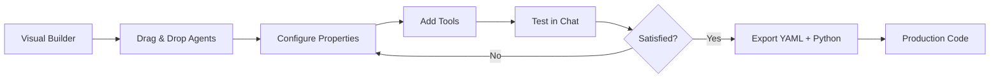

# Visual Builder in Google Agent Development Kit

The Google Agent Development Kit (ADK) provides a powerful programmatic API for building agents, but not every stage of development demands hand-written code. Starting with ADK Python **v1.18.0**, an experimental **Visual Builder** ships directly inside the `adk web` developer UI. It gives us a drag-and-drop canvas for designing agents, an AI-powered assistant for generating tool code, and automatic export to Agent Config YAML files alongside Python tool modules. In this lesson we explore the Visual Builder end-to-end—from launching it to converting its output into production-ready code.

> **Prerequisites**
>
> - Google ADK Python ≥ 1.18.0 installed (`pip install google-adk>=1.18.0`)
> - Familiarity with LLM Agents and workflow agents (see [Workflow Agents](./12-workflow-agents.md))
> - A working Gemini API key or Vertex AI project

---

## What Is the Visual Builder?

The Visual Builder is a **no-code / low-code interface** embedded in the `adk web` development server. Instead of writing Python classes and wiring sub-agents together manually, we manipulate a graphical canvas:

- **Drag-and-drop nodes** represent agents (Root, LLM, Sequential, Parallel, Loop).
- **Property panels** let us set the model, instruction, and tools for each node.
- **An AI-powered assistant** can generate tool function code, agent instructions, and descriptions from a natural-language prompt.
- **Integrated chat** lets us test the agent graph without leaving the browser.
- **Export** produces an `agent_config.yaml` plus any Python tool files we need.

Because the Visual Builder is still marked **experimental**, the interface and output format may change between releases. Treat it as a rapid-prototyping power tool rather than a replacement for hand-crafted production code.

---

## Accessing the Visual Builder

We launch the Visual Builder the same way we launch the regular ADK developer UI—via the `adk web` command:

```bash
# Start the ADK dev server pointing at our agent directory
adk web my_agent/
```

```text
Expected output:
╭──────────────────────────────────────────╮
│  ADK Web Server running on port 8000     │
│  Open: http://localhost:8000             │
╰──────────────────────────────────────────╯
```

Once the server is running, we open `http://localhost:8000` in a browser and switch to the **Visual Builder** tab in the top navigation bar. The canvas loads with an empty workspace ready for us to add agent nodes.

---

## Supported Agent Types

Not every ADK agent type is available on the canvas yet. The table below summarises current support:

| Agent Type | Visual Builder Support | Notes |
|---|---|---|
| **Root Agent** (LlmAgent) | ✅ Full support | Entry-point of every graph |
| **LLM Agent** | ✅ Full support | Standard sub-agent |
| **SequentialAgent** | ✅ Full support | Runs children in order |
| **ParallelAgent** | ✅ Full support | Runs children concurrently |
| **LoopAgent** | ✅ Full support | Repeats children until exit |
| **Custom Agent** (BaseAgent) | ❌ Code only | Requires Python subclass |

If our design needs a custom agent we build that part in code and integrate the Visual Builder–generated YAML around it.

---

## Building an Agent Visually — Step by Step

Let's walk through creating a **customer support** multi-agent system entirely inside the Visual Builder.

### Step 1 — Add the Root Agent

Every graph begins with a **Root Agent** node. We click the **+ Root Agent** button in the toolbar, and a node appears on the canvas. In its property panel we fill in:

| Property | Value |
|---|---|
| Name | `customer_support` |
| Model | `gemini-2.0-flash` |
| Instruction | *"You are a customer support agent. Route billing questions to billing_agent. Route technical issues to technical_agent."* |

### Step 2 — Attach Tools

We click **Add Tool** on the Root Agent node. The Visual Builder offers two options:

1. **Prebuilt tools** — a library of common utilities (search, code execution, etc.).
2. **Custom Python function** — we write (or ask the AI assistant to generate) a function in a `tools.py` file.

For our example we add a custom tool called `get_customer_info`:

```python
# tools.py (generated / edited in the Visual Builder)
def get_customer_info(customer_id: str) -> dict:
    """Retrieve customer profile by ID."""
    # Placeholder — connect to a real database in production
    return {
        "customer_id": customer_id,
        "name": "Alice Martin",
        "plan": "Enterprise",
        "open_tickets": 2,
    }
```

```text
Expected output (when tested in the integrated chat):
{'customer_id': 'C-1024', 'name': 'Alice Martin', 'plan': 'Enterprise', 'open_tickets': 2}
```

### Step 3 — Add Sub-Agents

We drag two **LLM Agent** nodes onto the canvas—`billing_agent` and `technical_agent`—and draw delegation edges from the Root Agent to each of them. Each sub-agent gets its own model, instruction, and tools configured through the property panel.

### Step 4 — Configure Sub-Agent Properties

For `billing_agent` we set:

| Property | Value |
|---|---|
| Name | `billing_agent` |
| Model | `gemini-2.0-flash` |
| Instruction | *"Handle billing inquiries. Use the check_invoice tool when the customer asks about charges."* |

We also attach a `check_invoice` tool that we write (or generate) in `tools.py`.

### Step 5 — Test in the Integrated Chat

Without leaving the browser we open the **Chat** pane and send a message:

```text
User: I need help with my last invoice, customer ID C-1024.
```

```text
Expected output:
Agent [customer_support]: Routing to billing_agent...
Agent [billing_agent]: Let me look up invoice details for customer C-1024.
  → Called check_invoice(customer_id="C-1024")
Agent [billing_agent]: Your last invoice (#INV-5587) was $249.00, due on 2026-02-28.
```

If the response isn't satisfactory we go back to the canvas, tweak instructions or tools, and test again—this tight feedback loop is the core value of the Visual Builder.

---

## Visual Builder Workflow

The following diagram captures the iterative design loop we just walked through:



We stay inside the loop until the agent behaves correctly, then export the artefacts for integration into our production pipeline.

---

## Visual Builder Output — Agent Config YAML

When we click **Export**, the Visual Builder writes an `agent_config.yaml` file (and any associated Python tool files) into our project directory:

```yaml
# agent_config.yaml (generated by Visual Builder)
name: customer_support
model: gemini-2.0-flash
instruction: |
  You are a customer support agent.
  Route billing questions to billing_agent.
  Route technical issues to technical_agent.
tools:
  - name: get_customer_info
    type: function
    source: tools.py
sub_agents:
  - name: billing_agent
    model: gemini-2.0-flash
    instruction: Handle billing inquiries.
    tools:
      - name: check_invoice
        type: function
        source: tools.py
  - name: technical_agent
    model: gemini-2.0-flash
    instruction: Handle technical support.
```

```text
Expected output (directory listing after export):
my_agent/
├── agent_config.yaml
└── tools.py
```

The YAML file is the single source of truth the Visual Builder works with. Every change we make on the canvas is serialised back to this format.

---

## AI-Powered Development Assistant

One of the most compelling features of the Visual Builder is its built-in **AI assistant**. We can open the assistant panel and type a natural-language request such as:

```text
Create a tool that fetches weather data for a given city using an HTTP request.
```

```text
Expected output (generated by the assistant):
✅ Generated tool: get_weather
   File: tools.py
   Function: get_weather(city: str) -> dict
```

The assistant produces Python code that we can review and edit directly in the browser:

```python
# tools.py — generated by Visual Builder AI assistant
import requests

def get_weather(city: str) -> dict:
    """Fetch current weather data for a city."""
    url = f"https://wttr.in/{city}?format=j1"
    response = requests.get(url, timeout=10)
    response.raise_for_status()
    data = response.json()
    return {
        "city": city,
        "temp_c": data["current_condition"][0]["temp_C"],
        "description": data["current_condition"][0]["weatherDesc"][0]["value"],
    }
```

```text
Expected output (when invoked inside the chat):
{'city': 'London', 'temp_c': '8', 'description': 'Partly cloudy'}
```

The assistant can also generate agent **instructions** and **descriptions**—we simply ask: *"Write an instruction for a billing support agent that is polite and references company policy."*

---

## Converting Visual Builder Output to Code

For production deployments we often need more control than YAML provides (callbacks, state management, error handling). We can load the YAML directly or convert it to Python objects:

```python
# load_from_yaml.py
from google.adk.agents import Agent
import yaml

with open("agent_config.yaml") as f:
    config = yaml.safe_load(f)

# Build the root agent from the parsed config
root_agent = Agent(
    name=config["name"],
    model=config["model"],
    instruction=config["instruction"],
    tools=[],       # resolve tool references here
    sub_agents=[],  # recursively build sub-agents
)

print(f"Loaded agent: {root_agent.name}")
```

```text
Expected output:
Loaded agent: customer_support
```

In practice we write a small loader utility that resolves `source: tools.py` references into actual callables, instantiates sub-agents recursively, and attaches any callbacks our production system requires. This keeps the Visual Builder as the rapid-design step while Python remains the deployment artefact.

---

## Limitations

Because the Visual Builder is **experimental**, several constraints apply:

| Limitation | Detail |
|---|---|
| No custom agents | Cannot design `BaseAgent` subclasses on the canvas |
| Limited callbacks | `before_agent_callback` / `after_agent_callback` not configurable in the UI |
| No MCP tool integration | MCP servers must be wired in code |
| Python SDK only | TypeScript/Java SDKs do not include the Visual Builder |
| Interface may change | Experimental status means breaking changes between releases |

We should always validate exported YAML against the latest ADK docs before relying on it in CI/CD pipelines.

---

## Use Cases

The Visual Builder shines in scenarios where speed and accessibility matter more than fine-grained control:

- **Rapid prototyping** — sketch an agent architecture in minutes, not hours.
- **Stakeholder collaboration** — non-technical team members can participate in agent design sessions.
- **Architecture exploration** — quickly compare sequential vs. parallel delegation strategies.
- **Teaching and demos** — visually explain multi-agent concepts without boilerplate code.

---

## Best Practices

| Practice | Why It Matters |
|---|---|
| Start simple, add complexity | A Root Agent with one tool is easier to debug than a five-agent graph |
| Use the AI assistant for boilerplate | Let it generate tool stubs; we refine the logic |
| Test after every change | The integrated chat catches instruction regressions immediately |
| Export frequently | Keep YAML in version control so we can diff changes |
| Convert to Python for production | YAML is great for prototyping; Python gives us callbacks, tests, and typing |
| Pin the ADK version | The Visual Builder is experimental—lock the version in `requirements.txt` |

---

## Common Pitfalls

| ❌ Pitfall | ✅ Better Approach |
|---|---|
| Designing the entire system in Visual Builder without testing incrementally | Add one agent/tool at a time and test in the integrated chat |
| Assuming YAML output is production-ready | Always review and extend with Python for error handling and callbacks |
| Ignoring tool return types | Ensure every tool function has type hints and a docstring so the LLM uses it correctly |
| Skipping version control on exported YAML | Commit `agent_config.yaml` alongside `tools.py` after each export |
| Using Visual Builder for custom agent logic | Write `BaseAgent` subclasses in Python and compose them with the YAML-generated agents |
| Relying on the AI assistant output without review | Generated code may contain placeholder logic—always verify before deploying |

---

## Hands-on Exercise

**Goal:** Build a two-agent travel assistant using the Visual Builder.

**Requirements:**

1. Create a **Root Agent** named `travel_assistant` using `gemini-2.0-flash`.
2. Add a sub-agent named `flight_search_agent` with an instruction to search for flights.
3. Add a sub-agent named `hotel_search_agent` with an instruction to search for hotels.
4. Create a tool `search_flights(origin: str, destination: str, date: str) -> list` in `tools.py` that returns dummy flight data.
5. Create a tool `search_hotels(city: str, checkin: str, checkout: str) -> list` in `tools.py` that returns dummy hotel data.
6. Test the system in the integrated chat with the query: *"Find me flights from NYC to London on March 15 and a hotel in London for March 15–18."*
7. Export the YAML and verify the file structure.

<details>
<summary>💡 Hints</summary>

- Start `adk web` pointing at an empty directory so the Visual Builder creates fresh files.
- Attach `search_flights` only to `flight_search_agent`, and `search_hotels` only to `hotel_search_agent`.
- In the Root Agent instruction, explicitly mention when to delegate to each sub-agent.
- The AI assistant can generate the dummy tool code—just describe what you need.

</details>

<details>
<summary>🔑 Solution</summary>

**Exported `agent_config.yaml`:**

```yaml
name: travel_assistant
model: gemini-2.0-flash
instruction: |
  You are a travel assistant.
  Delegate flight searches to flight_search_agent.
  Delegate hotel searches to hotel_search_agent.
  Combine results into a single travel plan.
sub_agents:
  - name: flight_search_agent
    model: gemini-2.0-flash
    instruction: Search for flights based on origin, destination, and date.
    tools:
      - name: search_flights
        type: function
        source: tools.py
  - name: hotel_search_agent
    model: gemini-2.0-flash
    instruction: Search for hotels based on city and dates.
    tools:
      - name: search_hotels
        type: function
        source: tools.py
```

**`tools.py`:**

```python
def search_flights(origin: str, destination: str, date: str) -> list:
    """Search for available flights."""
    return [
        {"flight": "AA100", "origin": origin, "destination": destination,
         "date": date, "price": "$450", "departure": "08:00"},
        {"flight": "BA202", "origin": origin, "destination": destination,
         "date": date, "price": "$520", "departure": "14:30"},
    ]


def search_hotels(city: str, checkin: str, checkout: str) -> list:
    """Search for available hotels."""
    return [
        {"hotel": "The Grand London", "city": city,
         "checkin": checkin, "checkout": checkout, "price_per_night": "$180"},
        {"hotel": "City View Inn", "city": city,
         "checkin": checkin, "checkout": checkout, "price_per_night": "$95"},
    ]
```

**Test interaction:**

```text
User: Find me flights from NYC to London on March 15 and a hotel in London for March 15-18.

Agent [travel_assistant]: Let me search for flights and hotels for you.
Agent [flight_search_agent]: → Called search_flights("NYC", "London", "2026-03-15")
  Found 2 flights: AA100 ($450, 08:00) and BA202 ($520, 14:30).
Agent [hotel_search_agent]: → Called search_hotels("London", "2026-03-15", "2026-03-18")
  Found 2 hotels: The Grand London ($180/night) and City View Inn ($95/night).
Agent [travel_assistant]: Here is your travel plan:
  ✈ Flights NYC → London on Mar 15: AA100 at 08:00 ($450) or BA202 at 14:30 ($520).
  🏨 Hotels in London Mar 15–18: The Grand London ($180/night) or City View Inn ($95/night).
```

</details>

---

## Summary

✅ The **Visual Builder** is an experimental drag-and-drop interface inside `adk web` (ADK Python ≥ 1.18.0).

✅ It supports **Root Agent, LLM Agent, SequentialAgent, ParallelAgent, and LoopAgent** nodes on the canvas.

✅ An **AI-powered assistant** generates tool code, agent instructions, and descriptions from natural-language prompts.

✅ The output is an **`agent_config.yaml`** file plus Python tool modules that we can version-control and deploy.

✅ We should **test iteratively** inside the integrated chat and **convert to Python** for production use.

✅ **Custom agents, callbacks, and MCP tools** still require hand-written code—the Visual Builder handles the common cases.

✅ The Visual Builder is ideal for **rapid prototyping, stakeholder demos, and architecture exploration**.

---

## Next

[Plugins System →](./14-plugins-system.md)

## Further Reading

- [Google ADK Documentation — Agent Config YAML](https://google.github.io/adk-docs/get-started/quickstart/#agent-config)
- [Google ADK GitHub — Visual Builder Source](https://github.com/google/adk-python)
- [ADK Web Dev UI Reference](https://google.github.io/adk-docs/tools/web-dev-ui/)
- [Workflow Agents in ADK](https://google.github.io/adk-docs/agents/workflow-agents/)
- [ADK Release Notes — v1.18.0](https://github.com/google/adk-python/releases)

## Navigation

[← Workflow Agents](./12-workflow-agents.md) · [Back to Google ADK Overview](./00-google-agent-development-kit.md)

<!-- Sources:
  - Google ADK Documentation: https://google.github.io/adk-docs/
  - Google ADK Python GitHub Repository: https://github.com/google/adk-python
  - ADK Web Dev UI Docs: https://google.github.io/adk-docs/tools/web-dev-ui/
  - ADK Agent Config Reference: https://google.github.io/adk-docs/get-started/quickstart/#agent-config
  - ADK Release Notes: https://github.com/google/adk-python/releases
-->
