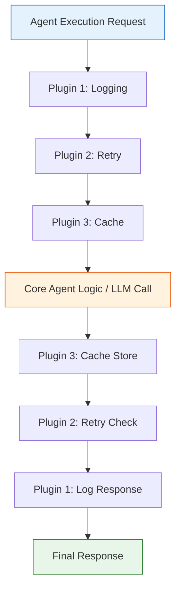

# Plugins System in Google Agent Development Kit

Google ADK's plugin system enables extensible agent behavior through composable, reusable modules. Plugins inject additional functionality into the agent lifecycle without modifying core agent code — letting us add logging, caching, retries, guardrails, and more by simply wiring up callback hooks. In this lesson, we'll explore how plugins work, examine built-in patterns, build custom plugins, and learn to compose multiple plugins into a single agent pipeline.

**Prerequisites:**
- Familiarity with [Agent Definition Patterns](./02-agent-definition-patterns.md) and ADK callbacks
- Python 3.10+ with `google-adk` installed
- Understanding of agent lifecycle events (before/after agent, model, and tool execution)

---

## What Are Plugins?

A **plugin** in ADK is a reusable module that extends agent capabilities by hooking into defined extension points in the agent lifecycle. Rather than embedding cross-cutting logic — retry handling, audit logging, response caching — directly into our agent instructions or tool code, we encapsulate that logic in a plugin and attach it via ADK's callback system.

Plugins share four key characteristics:

1. **Reusable** — We write the plugin once and attach it to any agent.
2. **Lifecycle-aware** — Plugins hook into specific moments: before/after agent execution, before/after model calls, and before/after tool invocations.
3. **Composable** — Multiple plugins chain together into a pipeline, each processing in sequence.
4. **Non-invasive** — Core agent code stays clean; plugins wrap around it without modification.

Common patterns plugins enable include:

- **Reflect/Retry** — Automatically retry failed operations with adjusted parameters.
- **Caching** — Store and reuse LLM responses for identical inputs.
- **Error Recovery** — Catch failures and provide graceful fallbacks.
- **Guardrails** — Validate inputs/outputs, filter content, and redact PII.
- **Audit Trails** — Log every interaction for compliance and debugging.

---

## Plugin Architecture

Plugins form a pipeline that wraps around agent execution. Each plugin gets a chance to inspect or modify the request before it reaches the core agent logic, and again after the response is generated.



The pipeline follows an **onion model**: the outermost plugin (Logging) runs first on the way in and last on the way out. The innermost plugin (Cache) runs closest to the actual LLM call. If any plugin returns a non-`None` value, it **short-circuits** the pipeline — downstream plugins and the core logic are skipped, and the returned value becomes the response.

### Extension Points

ADK exposes six callback extension points that plugins can hook into:

| Extension Point | When It Fires | Typical Use |
|---|---|---|
| `before_agent_callback` | Before agent starts processing | Authentication, input validation |
| `after_agent_callback` | After agent completes | Logging, cleanup |
| `before_model_callback` | Before LLM API call | Cache lookup, prompt modification |
| `after_model_callback` | After LLM response arrives | Cache storage, response filtering |
| `before_tool_callback` | Before a tool executes | Parameter validation, rate limiting |
| `after_tool_callback` | After a tool returns | Error handling, result transformation |

---

## Built-in Plugin Patterns

Let's walk through the most common plugin patterns we can implement with ADK callbacks.

### 1. Reflect/Retry Plugin

The reflect/retry pattern automatically retries failed operations. The agent "reflects" on errors and adjusts its approach before trying again. We implement this with the `after_tool_callback`:

```python
from google.adk.agents import Agent

def retry_on_error(callback_context, tool_name, tool_args, tool_response):
    """After-tool callback implementing retry logic."""
    if "error" in str(tool_response).lower():
        # Track retry attempts in temporary state
        attempt = callback_context.state.get("temp:retry_count", 0)
        if attempt < 3:
            callback_context.state["temp:retry_count"] = attempt + 1
            print(f"[RETRY] Attempt {attempt + 1} for tool '{tool_name}'")
            # Return None to let the agent try again
            return None
        print(f"[RETRY] Max retries exceeded for tool '{tool_name}'")
        return {"error": "Max retries exceeded", "last_error": str(tool_response)}
    # Reset retry count on success
    callback_context.state["temp:retry_count"] = 0
    return None


def my_tool(query: str) -> dict:
    """A sample tool that might fail."""
    return {"result": f"Processed: {query}"}


agent = Agent(
    name="resilient_agent",
    model="gemini-2.0-flash",
    instruction="Complete tasks reliably. If a tool fails, try a different approach.",
    tools=[my_tool],
    after_tool_callback=retry_on_error,
)
```

```text
# Expected output (on tool failure):
[RETRY] Attempt 1 for tool 'my_tool'
[RETRY] Attempt 2 for tool 'my_tool'
[RETRY] Attempt 3 for tool 'my_tool'
[RETRY] Max retries exceeded for tool 'my_tool'
```

The `temp:` prefix on the state key ensures the retry count lives only for the current invocation and doesn't persist across sessions.

### 2. Caching Plugin

Caching LLM responses for identical inputs reduces API costs and latency dramatically. We use a pair of callbacks — `before_model_callback` to check the cache and `after_model_callback` to store the response:

```python
import hashlib
import json
import time

# Simple in-memory cache with TTL
cache = {}
CACHE_TTL_SECONDS = 300  # 5-minute TTL


def check_cache(callback_context, llm_request):
    """Before-model callback: return cached response if available."""
    cache_key = hashlib.md5(
        json.dumps(str(llm_request.contents)).encode()
    ).hexdigest()

    if cache_key in cache:
        entry = cache[cache_key]
        age = time.time() - entry["timestamp"]
        if age < CACHE_TTL_SECONDS:
            print(f"[CACHE HIT] key={cache_key[:8]}... age={age:.1f}s")
            return entry["response"]  # Short-circuit: skip LLM call
        else:
            print(f"[CACHE EXPIRED] key={cache_key[:8]}...")
            del cache[cache_key]

    # Store key in temp state for the after-model callback
    callback_context.state["temp:cache_key"] = cache_key
    return None  # Proceed to LLM


def store_in_cache(callback_context, llm_request, llm_response):
    """After-model callback: store the LLM response in cache."""
    cache_key = callback_context.state.get("temp:cache_key")
    if cache_key:
        cache[cache_key] = {
            "response": llm_response,
            "timestamp": time.time(),
        }
        print(f"[CACHE STORE] key={cache_key[:8]}...")
    return None
```

```text
# Expected output (first call):
[CACHE STORE] key=a3f8c1d2...

# Expected output (second identical call within TTL):
[CACHE HIT] key=a3f8c1d2... age=12.3s
```

> **Tip:** For production use, replace the in-memory `dict` with Redis or Memcached. The callback interface stays identical.

### 3. Error Recovery Plugin

The error recovery pattern catches failures at any lifecycle stage and provides graceful fallback behavior:

```python
def safe_tool_execution(callback_context, tool_name, tool_args, tool_response):
    """After-tool callback that catches errors and provides fallback."""
    if isinstance(tool_response, Exception) or "error" in str(tool_response).lower():
        error_msg = str(tool_response)
        print(f"[ERROR RECOVERY] Tool '{tool_name}' failed: {error_msg}")

        # Store error for debugging
        errors = callback_context.state.get("session:errors", [])
        errors.append({"tool": tool_name, "error": error_msg})
        callback_context.state["session:errors"] = errors

        # Return a fallback response instead of propagating the error
        return {
            "status": "fallback",
            "message": f"Tool '{tool_name}' encountered an issue. Using default behavior.",
        }
    return None
```

```text
# Expected output (when a tool fails):
[ERROR RECOVERY] Tool 'search_database' failed: Connection timeout
```

### 4. Guardrail Plugin

Guardrails validate inputs and outputs to enforce safety, compliance, and quality standards:

```python
import re

BLOCKED_PATTERNS = [
    r"\b\d{3}-\d{2}-\d{4}\b",  # SSN
    r"\b\d{16}\b",              # Credit card
]


def input_guardrail(callback_context, llm_request):
    """Before-model callback: block requests containing PII."""
    content_str = str(llm_request.contents)
    for pattern in BLOCKED_PATTERNS:
        if re.search(pattern, content_str):
            print("[GUARDRAIL] PII detected in input — blocking request")
            return "I cannot process requests containing personal information."
    return None


def output_guardrail(callback_context, llm_request, llm_response):
    """After-model callback: redact PII from responses."""
    response_text = str(llm_response)
    redacted = response_text
    for pattern in BLOCKED_PATTERNS:
        redacted = re.sub(pattern, "[REDACTED]", redacted)
    if redacted != response_text:
        print("[GUARDRAIL] PII redacted from output")
    return None
```

```text
# Expected output (PII detected in input):
[GUARDRAIL] PII detected in input — blocking request

# Expected output (PII found in response):
[GUARDRAIL] PII redacted from output
```

---

## Creating Custom Plugins

We can encapsulate any plugin pattern into a reusable class. The class methods align with ADK's callback signatures, and we pass them as callbacks when constructing an agent.

```python
import datetime


class AuditPlugin:
    """Plugin that creates an audit trail of all agent interactions."""

    def __init__(self, log_file: str = "audit.log"):
        self.log_file = log_file

    def before_agent(self, callback_context):
        """Log agent activation."""
        self._log(f"AGENT_START | agent='{callback_context.agent_name}'")
        return None

    def after_agent(self, callback_context):
        """Log agent completion."""
        self._log(f"AGENT_END   | agent='{callback_context.agent_name}'")
        return None

    def after_tool(self, callback_context, tool_name, tool_args, tool_response):
        """Log tool usage with arguments and response summary."""
        self._log(
            f"TOOL_CALL   | tool='{tool_name}' args={tool_args} "
            f"response_len={len(str(tool_response))}"
        )
        return None

    def _log(self, message: str):
        timestamp = datetime.datetime.now().isoformat()
        entry = f"[{timestamp}] {message}"
        with open(self.log_file, "a") as f:
            f.write(entry + "\n")
        print(entry)


# Apply the plugin to an agent
audit = AuditPlugin(log_file="my_agent_audit.log")

agent = Agent(
    name="audited_agent",
    model="gemini-2.0-flash",
    instruction="You are a helpful assistant.",
    before_agent_callback=audit.before_agent,
    after_agent_callback=audit.after_agent,
    after_tool_callback=audit.after_tool,
)
```

```text
# Expected output:
[2026-02-09T14:30:01.123456] AGENT_START | agent='audited_agent'
[2026-02-09T14:30:02.456789] TOOL_CALL   | tool='search' args={'query': 'ADK docs'} response_len=1482
[2026-02-09T14:30:03.789012] AGENT_END   | agent='audited_agent'
```

The `AuditPlugin` class is fully independent of any specific agent — we can instantiate it with different log files and attach it to as many agents as we need.

---

## Composing Multiple Plugins

Since each ADK callback parameter accepts a single function, we need a composition strategy to chain multiple plugins together. Let's build a lightweight plugin pipeline:

```python
from typing import Callable, Optional


def compose_callbacks(*callbacks: Callable) -> Callable:
    """Chain multiple callbacks; first non-None return wins."""
    def composed(callback_context, *args, **kwargs):
        for cb in callbacks:
            result = cb(callback_context, *args, **kwargs)
            if result is not None:
                return result  # Short-circuit
        return None
    return composed


# Example: compose audit + guardrail + cache into one pipeline
audit = AuditPlugin()

agent = Agent(
    name="fully_plugged_agent",
    model="gemini-2.0-flash",
    instruction="You are a helpful assistant.",
    before_agent_callback=audit.before_agent,
    before_model_callback=compose_callbacks(input_guardrail, check_cache),
    after_model_callback=compose_callbacks(store_in_cache, output_guardrail),
    after_tool_callback=compose_callbacks(audit.after_tool, retry_on_error),
)
```

```text
# Expected output (composed pipeline on a cached request):
[2026-02-09T14:30:01.000000] AGENT_START | agent='fully_plugged_agent'
[CACHE HIT] key=a3f8c1d2... age=45.2s
[2026-02-09T14:30:01.005000] AGENT_END   | agent='fully_plugged_agent'
```

The `compose_callbacks` helper iterates through each callback in order. The first callback to return a non-`None` value short-circuits the chain — this is essential for caching (a cache hit should skip the LLM call) and guardrails (a blocked input should skip everything downstream).

---

## Plugin vs. Callback

Understanding when to use a raw callback versus a structured plugin pattern helps us keep our codebase maintainable.

| Aspect | Raw Callback | Plugin Pattern |
|---|---|---|
| **Reusability** | Tied to a single agent | Shared across any agent |
| **Configuration** | Hardcoded values | Parameterized via constructor |
| **Composition** | Manual chaining with helper | Clean pipeline via `compose_callbacks` |
| **Testing** | Coupled to agent setup | Independently unit-testable |
| **State Management** | Closure variables | Instance attributes |
| **Readability** | Scattered functions | Cohesive class with clear intent |

**Rule of thumb:** Start with raw callbacks for quick experiments. Promote to a plugin class once we reuse the same logic across two or more agents.

---

## Best Practices

| Practice | Why It Matters |
|---|---|
| Use the `temp:` state prefix for transient plugin data | Prevents leaking state across invocations |
| Keep plugins focused on a single concern | Easier to test, reuse, and compose |
| Order plugins intentionally in `compose_callbacks` | Guardrails should run before cache checks |
| Return `None` unless you intend to short-circuit | Avoids accidentally swallowing responses |
| Make plugins configurable via constructor args | Enables different setups for dev vs. production |
| Log plugin actions at DEBUG level in production | Provides observability without noise |
| Use `session:` state prefix for cross-turn data | Persists across conversation turns |
| Write unit tests for each plugin independently | Validates behavior without needing a live LLM |

---

## Common Pitfalls

| ❌ Don't | ✅ Do |
|---|---|
| Mutate `llm_request` in a before-model callback without returning `None` | Return `None` to proceed or return a response to short-circuit |
| Store large objects in `callback_context.state` without cleanup | Use `temp:` prefix so transient data auto-clears |
| Catch all exceptions silently in error recovery | Log errors and store them in state for debugging |
| Apply guardrails only on input OR output | Apply guardrails on both input and output for defense-in-depth |
| Hardcode retry counts and TTLs | Accept them as constructor parameters for flexibility |
| Chain plugins without considering order | Put guardrails first, then cache, then retry logic |
| Write one monolithic callback that does everything | Split into focused plugins composed via `compose_callbacks` |
| Forget to handle the short-circuit case in composed callbacks | Test each plugin's return behavior individually |

---

## Hands-on Exercise

**Challenge:** Build a `RateLimiterPlugin` that limits the number of LLM calls an agent can make within a time window.

**Requirements:**
1. Accept `max_calls` (int) and `window_seconds` (int) as constructor parameters.
2. Implement a `before_model` callback that tracks call timestamps.
3. If the limit is exceeded, return a polite refusal message instead of calling the LLM.
4. After the window resets, allow calls again.

<details>
<summary>💡 Hints</summary>

- Store call timestamps in a list on the plugin instance.
- In `before_model`, filter out timestamps older than `window_seconds`.
- If `len(timestamps) >= max_calls`, return a short-circuit string response.
- Use `time.time()` for timestamps.

</details>

<details>
<summary>✅ Solution</summary>

```python
import time
from google.adk.agents import Agent


class RateLimiterPlugin:
    """Plugin that limits LLM calls within a sliding time window."""

    def __init__(self, max_calls: int = 10, window_seconds: int = 60):
        self.max_calls = max_calls
        self.window_seconds = window_seconds
        self.call_timestamps: list[float] = []

    def before_model(self, callback_context, llm_request):
        """Check rate limit before each LLM call."""
        now = time.time()
        cutoff = now - self.window_seconds

        # Remove timestamps outside the current window
        self.call_timestamps = [t for t in self.call_timestamps if t > cutoff]

        if len(self.call_timestamps) >= self.max_calls:
            wait_time = self.call_timestamps[0] - cutoff
            print(f"[RATE LIMIT] Exceeded {self.max_calls} calls in {self.window_seconds}s")
            return (
                f"Rate limit reached. Please wait {wait_time:.0f} seconds "
                f"before making another request."
            )

        self.call_timestamps.append(now)
        print(f"[RATE LIMIT] {len(self.call_timestamps)}/{self.max_calls} calls used")
        return None


# Usage
limiter = RateLimiterPlugin(max_calls=5, window_seconds=60)

agent = Agent(
    name="rate_limited_agent",
    model="gemini-2.0-flash",
    instruction="You are a helpful assistant.",
    before_model_callback=limiter.before_model,
)
```

```text
# Expected output:
[RATE LIMIT] 1/5 calls used
[RATE LIMIT] 2/5 calls used
...
[RATE LIMIT] 5/5 calls used
[RATE LIMIT] Exceeded 5 calls in 60s
```

</details>

---

## Summary

✅ Plugins are reusable modules that hook into ADK's agent lifecycle via callbacks.
✅ Six extension points exist: before/after agent, model, and tool execution.
✅ Built-in patterns include reflect/retry, caching, error recovery, and guardrails.
✅ Custom plugins are classes whose methods match callback signatures.
✅ `compose_callbacks` chains multiple plugins — first non-`None` return short-circuits.
✅ Use `temp:` state prefix for transient data and `session:` for cross-turn data.
✅ Guardrails should run before cache and retry plugins in the composition order.
✅ Promote raw callbacks to plugin classes once reuse is needed.

---

## Next Steps

**Next:** [Resume Agents](./15-resume-agents.md) — Learn how agents can pause execution and resume where they left off.

**Previous:** [Visual Builder](./13-visual-builder.md)

---

## Further Reading

- [Google ADK — Callbacks Documentation](https://google.github.io/adk-python/agents/callbacks/)
- [Google ADK — Agent Lifecycle](https://google.github.io/adk-python/agents/llm-agents/)
- [Google ADK — State Management](https://google.github.io/adk-python/sessions/state/)
- [Google ADK GitHub — Examples](https://github.com/google/adk-python/tree/main/examples)
- [Plugin Architecture Patterns — Martin Fowler](https://martinfowler.com/articles/patterns-of-distributed-systems/)

---

[Back to Google ADK Overview](./00-google-agent-development-kit.md)

<!-- Sources:
  - Google ADK Python documentation: https://google.github.io/adk-python/
  - Google ADK GitHub repository: https://github.com/google/adk-python
  - ADK Callbacks reference: https://google.github.io/adk-python/agents/callbacks/
  - ADK Agent lifecycle: https://google.github.io/adk-python/agents/llm-agents/
  - ADK State management: https://google.github.io/adk-python/sessions/state/
  - Lesson created: 2026-02-09
-->
