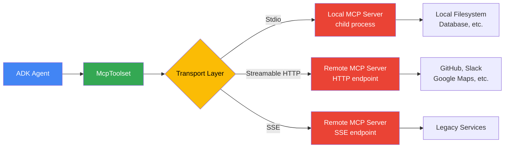

# Third-Party Tool Integrations in Google ADK

## Prerequisites

Before starting this lesson, ensure you have:

- Completed [Agent Definition Patterns](./02-agent-definition-patterns.md) and [Tool Use in ADK](./05-tool-use.md)
- A working Google ADK environment with `google-adk` installed
- Node.js/npx available for running local MCP servers
- Familiarity with async/await patterns in Python

---

## Introduction

Building powerful AI agents often means reaching beyond the tools we write ourselves. Agents need to read files, query databases, search the web, post messages to Slack, and interact with dozens of other services. Writing custom integrations for each of these is tedious and error-prone.

Google ADK solves this through first-class support for the **Model Context Protocol (MCP)** — an open standard that gives our agents instant access to hundreds of pre-built tool servers. With a single `McpToolset` class, we can connect an ADK agent to any MCP-compatible server and let it discover, invoke, and receive results from external tools automatically.

In this lesson, we'll explore how MCP integrates with ADK, walk through the three transport types, learn to filter tools for security, and cover deployment patterns for production.

---

## What Is MCP in ADK?

The **Model Context Protocol** is an open standard that defines how AI applications communicate with external tool providers. Think of it as a universal adapter: any tool that speaks MCP can plug into any agent framework that supports it — including Google ADK.

ADK's `McpToolset` class handles three responsibilities:

1. **Connection** — Establishes a transport channel to the MCP server (local process, HTTP, or SSE).
2. **Tool Discovery** — Queries the server for its available tools, their names, descriptions, and parameter schemas.
3. **Call Proxying** — When the LLM decides to invoke a tool, `McpToolset` forwards the call to the MCP server and returns the result to the agent.

### Transport Types

ADK supports three transport mechanisms for connecting to MCP servers:

| Transport | Class | Use Case |
|-----------|-------|----------|
| **Stdio** | `StdioConnectionParams` | Local MCP server running as a child process |
| **Streamable HTTP** | `StreamableHTTPConnectionParams` | Modern remote MCP server over HTTP |
| **SSE** | `SseConnectionParams` | Legacy remote MCP server using Server-Sent Events |

### Architecture Overview

The following diagram shows how an ADK agent communicates with external services through MCP:



The key insight is that our agent code never changes regardless of which transport we use. We swap the connection parameters, and `McpToolset` handles the rest.

---

## McpToolset with Stdio (Local Process)

The Stdio transport launches an MCP server as a local child process. The agent communicates with it over standard input/output streams. This is the simplest approach and works well for development and self-contained deployments.

Let's connect an agent to the official MCP filesystem server:

```python
from google.adk.agents import Agent
from google.adk.tools.mcp_tool import McpToolset, StdioConnectionParams

# Connect to a local MCP server (e.g., filesystem)
filesystem_tools, exit_stack = await McpToolset.from_server(
    connection_params=StdioConnectionParams(
        command="npx",
        args=["-y", "@modelcontextprotocol/server-filesystem", "/tmp/workspace"],
    )
)

agent = Agent(
    name="file_agent",
    model="gemini-2.0-flash",
    instruction="Help users manage files in the workspace.",
    tools=filesystem_tools,
)

print(f"Agent loaded with {len(filesystem_tools)} tools")
for tool in filesystem_tools:
    print(f"  - {tool.name}")
```

**Expected output:**

```
Agent loaded with 11 tools
  - read_file
  - read_multiple_files
  - write_file
  - edit_file
  - create_directory
  - list_directory
  - directory_tree
  - move_file
  - search_files
  - get_file_info
  - list_allowed_directories
```

When we call `McpToolset.from_server()`, ADK:

1. Spawns `npx -y @modelcontextprotocol/server-filesystem /tmp/workspace` as a subprocess.
2. Sends an MCP `initialize` message over stdin.
3. Reads the server's tool list from stdout.
4. Wraps each tool as an ADK-compatible `Tool` object.

The agent can now use any of these tools naturally during conversation — the LLM sees their descriptions and decides when to call them.

---

## McpToolset with Streamable HTTP (Remote)

For production microservice architectures, we connect to remote MCP servers over HTTP. The **Streamable HTTP** transport is the modern standard and supports bidirectional streaming.

```python
from google.adk.agents import Agent
from google.adk.tools.mcp_tool import McpToolset, StreamableHTTPConnectionParams

# Connect to a remote MCP server
remote_tools, exit_stack = await McpToolset.from_server(
    connection_params=StreamableHTTPConnectionParams(
        url="https://mcp-server.example.com/mcp",
    )
)

agent = Agent(
    name="remote_agent",
    model="gemini-2.0-flash",
    instruction="Use remote tools to assist users.",
    tools=remote_tools,
)

print(f"Connected to remote server with {len(remote_tools)} tools")
```

**Expected output:**

```
Connected to remote server with 5 tools
```

Streamable HTTP is the recommended transport for any remote MCP server. It uses standard HTTP POST requests with optional streaming responses, making it firewall-friendly and compatible with load balancers.

---

## McpToolset with SSE (Legacy Remote)

Some older MCP servers use **Server-Sent Events (SSE)** for communication. ADK supports this transport for backward compatibility.

```python
from google.adk.agents import Agent
from google.adk.tools.mcp_tool import McpToolset, SseConnectionParams

# Connect via SSE (older protocol)
sse_tools, exit_stack = await McpToolset.from_server(
    connection_params=SseConnectionParams(
        url="https://mcp-server.example.com/sse",
    )
)

agent = Agent(
    name="sse_agent",
    model="gemini-2.0-flash",
    instruction="Use legacy tools to assist users.",
    tools=sse_tools,
)

print(f"Connected via SSE with {len(sse_tools)} tools")
```

**Expected output:**

```
Connected via SSE with 3 tools
```

> **Note:** Prefer Streamable HTTP over SSE for new integrations. SSE is a unidirectional protocol and has limitations around connection management.

---

## Tool Filtering for Security

MCP servers often expose more tools than our agent needs. Giving an agent unrestricted access to a filesystem server — including `write_file` and `move_file` — when it only needs to read files creates unnecessary risk. The `tool_filter` parameter lets us whitelist specific tools.

```python
from google.adk.agents import Agent
from google.adk.tools.mcp_tool import McpToolset, StdioConnectionParams

# Only expose specific tools to the agent
tools, exit_stack = await McpToolset.from_server(
    connection_params=StdioConnectionParams(
        command="npx",
        args=["-y", "@modelcontextprotocol/server-filesystem", "/tmp"],
    ),
    tool_filter=["read_file", "list_directory"],  # Whitelist specific tools
)

agent = Agent(
    name="readonly_agent",
    model="gemini-2.0-flash",
    instruction="Help users browse files. You have read-only access.",
    tools=tools,
)

print(f"Filtered tools: {[t.name for t in tools]}")
```

**Expected output:**

```
Filtered tools: ['read_file', 'list_directory']
```

This is a critical security practice. Even though the LLM's instructions say "read-only," tool filtering enforces it at the infrastructure level. The agent literally cannot call `write_file` because the tool was never loaded.

---

## Popular MCP Servers for ADK

The MCP ecosystem provides hundreds of pre-built servers. Here are the most useful ones for ADK agents:

| MCP Server | Tools Provided | Use Case |
|-----------|---------------|----------|
| `@modelcontextprotocol/server-filesystem` | read, write, list files | File management |
| `@modelcontextprotocol/server-github` | repos, issues, PRs | Code collaboration |
| `@modelcontextprotocol/server-slack` | messages, channels | Team communication |
| `@modelcontextprotocol/server-google-maps` | directions, places | Location services |
| `@modelcontextprotocol/server-postgres` | queries, schema | Database access |
| `@modelcontextprotocol/server-brave-search` | web search | Research |
| `@modelcontextprotocol/server-memory` | key-value storage | Persistence |

We can combine multiple MCP servers in a single agent by concatenating their tool lists:

```python
fs_tools, fs_exit = await McpToolset.from_server(
    connection_params=StdioConnectionParams(
        command="npx",
        args=["-y", "@modelcontextprotocol/server-filesystem", "/tmp"],
    )
)

search_tools, search_exit = await McpToolset.from_server(
    connection_params=StdioConnectionParams(
        command="npx",
        args=["-y", "@modelcontextprotocol/server-brave-search"],
        env={"BRAVE_API_KEY": "your-key-here"},
    )
)

all_tools = fs_tools + search_tools

agent = Agent(
    name="research_agent",
    model="gemini-2.0-flash",
    instruction="Search the web and save findings to files.",
    tools=all_tools,
)

print(f"Agent has {len(all_tools)} tools from 2 MCP servers")
```

**Expected output:**

```
Agent has 12 tools from 2 MCP servers
```

---

## Connection Management

`McpToolset.from_server()` returns an `exit_stack` alongside the tools. This exit stack holds references to open connections and child processes. We must clean these up when the agent is no longer needed.

### Using AsyncExitStack (Recommended)

```python
import contextlib
from google.adk.agents import Agent
from google.adk.tools.mcp_tool import McpToolset, StdioConnectionParams

async def create_agent_with_mcp():
    async with contextlib.AsyncExitStack() as stack:
        tools, _ = await McpToolset.from_server(
            connection_params=StdioConnectionParams(
                command="npx",
                args=["-y", "@modelcontextprotocol/server-filesystem", "/tmp"],
            )
        )

        agent = Agent(
            name="file_agent",
            model="gemini-2.0-flash",
            instruction="Manage files.",
            tools=tools,
        )

        # Agent is usable within this context
        yield agent
    # Connections automatically cleaned up

print("Context manager ensures cleanup on exit")
```

**Expected output:**

```
Context manager ensures cleanup on exit
```

Failing to close the exit stack can leave orphaned child processes consuming memory and file descriptors — a common source of resource leaks in long-running services.

---

## Deployment Patterns

How we deploy MCP servers alongside our ADK agents depends on the infrastructure:

| Pattern | Description | Best For |
|---------|-------------|----------|
| **Self-contained (Stdio)** | MCP server runs as a child process of the agent | Simple deployments, development |
| **Remote (HTTP)** | MCP server on a separate host/service | Microservices, shared tool servers |
| **Sidecar (GKE)** | MCP server in the same Kubernetes pod | Kubernetes / GKE deployments |

### Synchronous Agent Definition for Deployment

When deploying to **Cloud Run** or **Vertex AI Agent Engine**, we must define agents synchronously at module level. These platforms import our agent module and expect `root_agent` to be available immediately — not behind an `await`.

```python
import asyncio
from google.adk.agents import Agent
from google.adk.tools.mcp_tool import McpToolset, StdioConnectionParams

# ✅ Correct for deployment — synchronous top-level definition
tools, exit_stack = asyncio.get_event_loop().run_until_complete(
    McpToolset.from_server(
        connection_params=StdioConnectionParams(
            command="npx",
            args=["-y", "@modelcontextprotocol/server-filesystem", "/tmp"],
        )
    )
)

root_agent = Agent(
    name="file_agent",
    model="gemini-2.0-flash",
    instruction="Manage files.",
    tools=tools,
)

print(f"root_agent defined synchronously with {len(tools)} tools")
```

**Expected output:**

```
root_agent defined synchronously with 11 tools
```

This pattern uses `asyncio.get_event_loop().run_until_complete()` to bridge async MCP initialization into synchronous module-level code. The resulting `root_agent` is a plain variable that deployment platforms can discover through module import.

---

## Best Practices

| Practice | Rationale |
|----------|-----------|
| Use `tool_filter` to whitelist tools | Limits agent capabilities to only what's needed, reducing risk |
| Prefer Streamable HTTP over SSE | Modern protocol with better streaming and connection handling |
| Always close `exit_stack` connections | Prevents resource leaks from orphaned processes |
| Set environment variables via `env` param | Keeps secrets out of command-line args visible in process lists |
| Combine tools from multiple MCP servers | Gives agents broader capabilities without custom code |
| Use Stdio for development, HTTP for production | Stdio is simpler to debug; HTTP scales across services |
| Define agents synchronously for Cloud Run | Deployment platforms require module-level agent definitions |
| Pin MCP server versions in production | Avoids breaking changes from automatic `npx` updates |

---

## Common Pitfalls

| ❌ Mistake | ✅ Fix |
|-----------|--------|
| Exposing all tools without filtering | Use `tool_filter` to whitelist only necessary tools |
| Forgetting to close `exit_stack` | Wrap in `AsyncExitStack` context manager or call `exit_stack.aclose()` |
| Using `await` at module top-level for deployment | Use `asyncio.get_event_loop().run_until_complete()` instead |
| Hardcoding API keys in `args` | Pass secrets via `env` parameter in `StdioConnectionParams` |
| Using SSE for new integrations | Use `StreamableHTTPConnectionParams` — SSE is legacy |
| Not checking if `npx` is installed | Verify Node.js/npx availability before running Stdio servers |
| Ignoring MCP server startup time | Add timeout handling; Stdio servers may take seconds to initialize |
| Running untrusted MCP servers | Only use well-known, audited MCP server packages |

---

## Hands-on Exercise

**Goal:** Create an ADK agent that connects to the MCP filesystem server with read-only access, then add a second MCP server for web search.

### Requirements

1. Connect to `@modelcontextprotocol/server-filesystem` via Stdio, scoped to `/tmp/exercise`.
2. Filter tools to only `read_file`, `list_directory`, and `directory_tree`.
3. Connect to a second MCP server (use `@modelcontextprotocol/server-brave-search` or mock it).
4. Combine both tool sets into a single agent named `"research_assistant"`.
5. Print the full list of available tool names.
6. Ensure proper connection cleanup using `AsyncExitStack`.

<details>
<summary>💡 Hints</summary>

- Use `McpToolset.from_server()` twice — once for each MCP server.
- Concatenate tool lists with `+` before passing to the agent.
- The `tool_filter` parameter only applies to the server you pass it to.
- Wrap everything in an `async` function and use `contextlib.AsyncExitStack`.
- For Brave Search, you'll need a `BRAVE_API_KEY` environment variable.

</details>

<details>
<summary>✅ Solution</summary>

```python
import asyncio
import contextlib
from google.adk.agents import Agent
from google.adk.tools.mcp_tool import McpToolset, StdioConnectionParams


async def main():
    async with contextlib.AsyncExitStack() as stack:
        # 1. Filesystem tools (read-only)
        fs_tools, _ = await McpToolset.from_server(
            connection_params=StdioConnectionParams(
                command="npx",
                args=["-y", "@modelcontextprotocol/server-filesystem", "/tmp/exercise"],
            ),
            tool_filter=["read_file", "list_directory", "directory_tree"],
        )

        # 2. Search tools
        search_tools, _ = await McpToolset.from_server(
            connection_params=StdioConnectionParams(
                command="npx",
                args=["-y", "@modelcontextprotocol/server-brave-search"],
                env={"BRAVE_API_KEY": "your-key-here"},
            ),
        )

        # 3. Combine and create agent
        all_tools = fs_tools + search_tools

        agent = Agent(
            name="research_assistant",
            model="gemini-2.0-flash",
            instruction=(
                "You are a research assistant. "
                "Search the web for information and read local files for context. "
                "You have read-only filesystem access."
            ),
            tools=all_tools,
        )

        # 4. Print tool names
        print(f"Agent '{agent.name}' loaded with {len(all_tools)} tools:")
        for tool in all_tools:
            print(f"  - {tool.name}")

    print("All MCP connections cleaned up.")


asyncio.run(main())
```

**Expected output:**

```
Agent 'research_assistant' loaded with 4 tools:
  - read_file
  - list_directory
  - directory_tree
  - brave_web_search
All MCP connections cleaned up.
```

</details>

---

## Summary

In this lesson, we covered how Google ADK integrates with the broader MCP tool ecosystem:

- ✅ **MCP** is an open standard for tool integration — `McpToolset` handles connection, discovery, and call proxying automatically
- ✅ **Stdio transport** launches local MCP servers as child processes, ideal for development and self-contained deployments
- ✅ **Streamable HTTP** is the modern transport for remote MCP servers in production architectures
- ✅ **SSE transport** provides backward compatibility with older MCP servers but should be avoided for new integrations
- ✅ **Tool filtering** with `tool_filter` enforces least-privilege access at the infrastructure level
- ✅ **Multiple MCP servers** can be combined by concatenating their tool lists into a single agent
- ✅ **Connection cleanup** via `AsyncExitStack` prevents resource leaks from orphaned processes
- ✅ **Synchronous definition** using `run_until_complete()` is required when deploying to Cloud Run or Agent Engine

---

## Next

[Bidi-Streaming Live](./17-bidi-streaming-live.md)

---

## Further Reading

- [Google ADK — MCP Tools Documentation](https://google.github.io/adk-python/tools/mcp-tools/)
- [Model Context Protocol Specification](https://modelcontextprotocol.io/specification)
- [MCP Server Registry](https://github.com/modelcontextprotocol/servers)
- [Google ADK — Deployment Guide](https://google.github.io/adk-python/deploy/)
- [MCP Python SDK](https://github.com/modelcontextprotocol/python-sdk)

---

[Back to Google ADK Overview](./00-google-agent-development-kit.md) · Previous: [Resume Agents](./15-resume-agents.md)

<!-- Sources:
  - Google ADK Documentation: https://google.github.io/adk-python/tools/mcp-tools/
  - Model Context Protocol Specification: https://modelcontextprotocol.io/specification
  - MCP Servers Repository: https://github.com/modelcontextprotocol/servers
  - Google ADK GitHub: https://github.com/google/adk-python
  - ADK Deployment Docs: https://google.github.io/adk-python/deploy/
-->
