# Bidi-Streaming Live in Google ADK

Real-time voice assistants, live video analysis, and interactive audio agents all share a common requirement: the ability to send and receive data at the same time without waiting for one side to finish. Google's Agent Development Kit (ADK) addresses this with **bidi-streaming**, a full-duplex communication mode built on top of the Gemini Live API. In this lesson, we'll explore how bidi-streaming works, walk through the core components, wire up a FastAPI WebSocket server, configure audio pipelines, and handle the lifecycle of a live session from start to finish.

**Prerequisites:**

- Familiarity with ADK agent definitions and runners (Lessons 02–05)
- Basic understanding of async Python (`asyncio`, `async for`)
- A Google AI API key or Vertex AI project configured
- Python 3.10+

---

## What Is Bidi-Streaming?

Traditional request-response APIs follow a strict ping-pong pattern: the client sends a request, waits, and then receives a response. Bidi-streaming breaks out of that model entirely.

| Characteristic | Request-Response | Server-Sent Events (SSE) | Bidi-Streaming |
|---|---|---|---|
| Direction | Client → Server → Client | Server → Client (push) | Client ↔ Server (simultaneous) |
| Latency | High (round-trip per turn) | Medium (one-way push) | Low (continuous both ways) |
| Media support | Text/JSON | Text only | Audio, video, and text |
| Interruptions | Not possible | Not possible | User can interrupt the agent mid-response |
| Connection type | HTTP | HTTP (long-lived) | WebSocket / gRPC |

With bidi-streaming we get:

- **Full-duplex communication** — send and receive simultaneously over a single connection.
- **Real-time audio and video** — stream microphone input and receive spoken responses with sub-second latency.
- **Natural conversation flow** — Voice Activity Detection (VAD) lets the agent detect when we start speaking and yield the floor automatically.
- **WebSocket foundation** — under the hood, ADK maintains a persistent WebSocket connection to the Gemini Live API (or Vertex AI Live API).

---

## Streaming Modes in ADK

ADK exposes three streaming modes through `RunConfig`. We choose the mode that matches our application's needs.

| Mode | Constant | Description | Use Case |
|---|---|---|---|
| Batch | `StreamingMode.NONE` | No streaming; wait for the full response | Simple chatbots, offline processing |
| SSE | `StreamingMode.SSE` | Server-Sent Events; text tokens stream to the client | Typing-indicator UIs, text chat |
| Bidi | `StreamingMode.BIDI` | Bidirectional; audio, video, and text flow both ways | Voice assistants, video analysis, live agents |

```python
from google.genai.types import StreamingMode

# Choose the mode that fits your application
mode = StreamingMode.BIDI  # Full-duplex audio/video/text
```

**Expected output** (informational — this import produces no console output):

```
(no output)
```

---

## Core Components

Three ADK primitives power every bidi-streaming session.

### LiveRequestQueue

`LiveRequestQueue` is the **upstream channel**. We push data into it, and the runner forwards that data to the agent (and on to the Gemini Live API).

| Method | Purpose |
|---|---|
| `send_content(content)` | Send a `Content` object containing text parts |
| `send_realtime(data)` | Send raw bytes — typically PCM audio or video frames |
| `close()` | Signal that we are done sending; triggers graceful shutdown |

### Runner.run_live()

`runner.run_live()` is an **async generator**. It yields `Event` objects as the agent produces responses — text tokens, audio chunks, tool-call results, or state updates. Because it is an async generator, we consume it with `async for`.

### RunConfig

`RunConfig` bundles every setting the runner needs: the streaming mode, which response modalities we expect (`"TEXT"`, `"AUDIO"`, or both), speech configuration, and the optional `LiveConnectConfig` for advanced tuning.

```python
from google.adk.runners import Runner
from google.adk.agents import LlmAgent
from google.adk.sessions import InMemorySessionService
from google.genai.types import RunConfig, StreamingMode

root_agent = LlmAgent(
    name="voice_assistant",
    model="gemini-2.0-flash-live-001",
    instruction="You are a helpful voice assistant. Respond concisely.",
)

run_config = RunConfig(
    streaming_mode=StreamingMode.BIDI,
    response_modalities=["AUDIO"],  # or ["TEXT"], or ["AUDIO", "TEXT"]
)

runner = Runner(
    agent=root_agent,
    app_name="voice_app",
    session_service=InMemorySessionService(),
)
```

**Expected output:**

```
(no output — objects are created in memory)
```

---

## The Bidi-Streaming Lifecycle

Every bidi-streaming session moves through four distinct phases. The sequence diagram below shows how data flows between the client, the runner, the queue, and the Gemini Live API.

```mermaid
sequenceDiagram
    participant Client
    participant Runner
    participant LiveRequestQueue
    participant Agent
    participant Gemini Live API

    Client->>Runner: run_live(session, config)
    Runner->>LiveRequestQueue: Create queue
    Runner->>Agent: Initialize live connection

    par Upstream (Client → Agent)
        Client->>LiveRequestQueue: send_content("Hello")
        LiveRequestQueue->>Agent: Forward message
        Agent->>Gemini Live API: Stream input
    and Downstream (Agent → Client)
        Gemini Live API-->>Agent: Stream response chunks
        Agent-->>Runner: Yield Events
        Runner-->>Client: Events with audio / text parts
    end

    Client->>LiveRequestQueue: close()
    Runner->>Agent: Terminate live connection
```



### Phase 1 — App Initialization

We create the runner, session service, and agent once at application startup. These objects are long-lived and shared across sessions.

### Phase 2 — Session Initialization

For each user conversation, we create a new session and a `LiveRequestQueue`. We also finalize the `RunConfig` (streaming mode, voice, modalities).

### Phase 3 — Bidi-Streaming Loop

This is the heart of the interaction. Two coroutines run concurrently:

- **Upstream** reads input from the user (microphone bytes, typed text, video frames) and pushes it into the `LiveRequestQueue`.
- **Downstream** iterates over the async generator returned by `run_live()` and forwards events back to the user.

### Phase 4 — Termination

When the user disconnects or we call `live_request_queue.close()`, the runner tears down the live connection and the async generator completes.

---

## FastAPI WebSocket Integration

The most common deployment pattern pairs ADK bidi-streaming with a FastAPI WebSocket endpoint. Here is a complete working example.

```python
import asyncio
from contextlib import asynccontextmanager

from fastapi import FastAPI, WebSocket, WebSocketDisconnect
from google.adk.agents import LlmAgent
from google.adk.runners import Runner
from google.adk.sessions import InMemorySessionService
from google.genai.types import Content, Part, RunConfig, StreamingMode

# -- Agent & runner (created once) ------------------------------------------

session_service = InMemorySessionService()

root_agent = LlmAgent(
    name="live_assistant",
    model="gemini-2.0-flash-live-001",
    instruction="You are a concise, friendly voice assistant.",
)

runner = Runner(
    agent=root_agent,
    app_name="live_app",
    session_service=session_service,
)

app = FastAPI()


@app.websocket("/ws/chat")
async def websocket_chat(websocket: WebSocket):
    await websocket.accept()

    # Phase 2 — Session init
    session = await session_service.create_session(
        app_name="live_app", user_id="user_1"
    )

    run_config = RunConfig(streaming_mode=StreamingMode.BIDI)
    live_request_queue = runner.create_live_request_queue()

    live_events = runner.run_live(
        session=session,
        live_request_queue=live_request_queue,
        run_config=run_config,
    )

    # Phase 3 — Bidi-streaming loop
    async def upstream():
        """Receive from the WebSocket client, forward to the agent."""
        try:
            while True:
                data = await websocket.receive_text()
                live_request_queue.send_content(
                    Content(parts=[Part(text=data)])
                )
        except WebSocketDisconnect:
            live_request_queue.close()

    async def downstream():
        """Receive events from the agent, forward to the WebSocket client."""
        async for event in live_events:
            if event.content and event.content.parts:
                for part in event.content.parts:
                    if part.text:
                        await websocket.send_text(part.text)
                    elif part.inline_data:
                        await websocket.send_bytes(part.inline_data.data)

    # Run both directions concurrently
    await asyncio.gather(upstream(), downstream())
```

**Expected output** (when starting with `uvicorn`):

```
INFO:     Uvicorn running on http://0.0.0.0:8000
INFO:     Application startup complete.
```

> **Key insight:** `asyncio.gather` keeps both coroutines alive at the same time. If either raises an exception the other is cancelled, which naturally handles client disconnects.

---

## Audio Configuration

Voice-based agents need precise audio settings to sound natural and respond quickly.

### Input Format

- **Encoding:** 16-bit Linear PCM (little-endian)
- **Sample rate:** 16 kHz
- **Channels:** Mono

### Output Format

- **Encoding:** 16-bit Linear PCM
- **Sample rate:** 24 kHz
- **Channels:** Mono

### Choosing a Voice

ADK exposes Gemini's prebuilt voices through `SpeechConfig`. Each voice has a distinct tone and cadence.

```python
from google.genai.types import (
    SpeechConfig,
    VoiceConfig,
    PrebuiltVoiceConfig,
    RunConfig,
    StreamingMode,
)

run_config = RunConfig(
    streaming_mode=StreamingMode.BIDI,
    response_modalities=["AUDIO"],
    speech_config=SpeechConfig(
        voice_config=VoiceConfig(
            prebuilt_voice_config=PrebuiltVoiceConfig(
                voice_name="Kore"  # Other options: "Puck", "Charon", "Fenrir", "Aoede"
            )
        )
    ),
)
```

**Expected output:**

```
(no output — configuration object created in memory)
```

### Voice Activity Detection and Interruptions

The Gemini Live API supports **server-side VAD**. When the user starts speaking, the API automatically:

1. Detects speech onset.
2. Interrupts any in-progress agent audio.
3. Begins buffering the new user utterance.

This creates a natural, conversational feel where the user never has to wait for the agent to finish before interjecting.

---

## Streaming Audio Bytes

When dealing with raw audio, we use `send_realtime()` instead of `send_content()`. This path is optimized for high-throughput binary data.

```python
import asyncio

async def stream_microphone(live_request_queue):
    """Read 16-bit PCM from a microphone and stream to the agent."""
    import pyaudio

    CHUNK = 1024
    FORMAT = pyaudio.paInt16
    CHANNELS = 1
    RATE = 16000

    pa = pyaudio.PyAudio()
    stream = pa.open(
        format=FORMAT, channels=CHANNELS, rate=RATE,
        input=True, frames_per_buffer=CHUNK,
    )

    try:
        while True:
            audio_bytes = stream.read(CHUNK, exception_on_overflow=False)
            live_request_queue.send_realtime(audio_bytes)
            await asyncio.sleep(0)  # Yield control to the event loop
    finally:
        stream.stop_stream()
        stream.close()
        pa.terminate()
        live_request_queue.close()
```

**Expected output** (when running with a connected microphone):

```
(audio bytes are streamed continuously — no console output)
```

---

## API Backend Options

ADK can route bidi-streaming traffic to either of Google's two Live API backends.

| Backend | Environment Variable | Best For |
|---|---|---|
| **Gemini Live API** | *(default — no variable needed)* | Prototyping, free tier, direct API key access |
| **Vertex AI Live API** | `GOOGLE_GENAI_USE_VERTEXAI=1` | Enterprise workloads, SLAs, VPC-SC, compliance |

Switching backends requires **no code changes** — only the environment variable.

```bash
# Use the Vertex AI backend
export GOOGLE_GENAI_USE_VERTEXAI=1
export GOOGLE_CLOUD_PROJECT="my-project"
export GOOGLE_CLOUD_LOCATION="us-central1"
```

**Expected output:**

```
(no output — environment variables are set in the shell)
```

---

## Transcription

In many production systems we need a text record of the audio conversation — for compliance, debugging, or accessibility. The Gemini Live API can return **transcriptions** alongside audio.

- **Input transcription** — a text version of what the user said.
- **Output transcription** — a text version of what the agent said.

We detect transcriptions by inspecting event parts:

```python
async for event in live_events:
    if not event.content or not event.content.parts:
        continue
    for part in event.content.parts:
        if part.text:
            print(f"[transcript] {event.content.role}: {part.text}")
        elif part.inline_data:
            # Raw audio bytes — forward to speaker / WebSocket
            pass
```

**Expected output** (example during a live session):

```
[transcript] user: What is the weather today?
[transcript] model: It's currently 72 degrees and sunny.
```

---

## Best Practices

| Practice | Why It Matters |
|---|---|
| Use `asyncio.gather` for upstream/downstream | Keeps both directions alive; one failure cancels the other cleanly |
| Set `response_modalities` explicitly | Avoids ambiguity — the API defaults may change between model versions |
| Handle `WebSocketDisconnect` in upstream | Prevents orphaned live connections when the client drops |
| Close the `LiveRequestQueue` in a `finally` block | Guarantees the server-side connection is released even on errors |
| Use 16 kHz / 16-bit PCM for input audio | Matches the expected format; other rates cause distortion or errors |
| Enable transcription for production | Provides an audit trail and aids debugging |
| Choose the right backend early | Vertex AI has different auth and quotas; switching later adds friction |

---

## Common Pitfalls

| ❌ Mistake | ✅ Fix |
|---|---|
| Calling `run_live()` without `StreamingMode.BIDI` | Always set `streaming_mode=StreamingMode.BIDI` in `RunConfig` |
| Sending audio at the wrong sample rate (e.g., 44.1 kHz) | Resample to 16 kHz mono before calling `send_realtime()` |
| Forgetting to call `close()` on the queue | Always close the queue in a `finally` or exception handler to free resources |
| Running upstream and downstream sequentially | Use `asyncio.gather()` or `asyncio.create_task()` so both run concurrently |
| Ignoring `WebSocketDisconnect` exceptions | Catch the exception, close the queue, and log the disconnection |
| Using `send_content()` for raw audio bytes | Use `send_realtime()` for binary audio/video; `send_content()` is for text `Content` objects |
| Blocking the event loop with synchronous I/O | Wrap blocking calls (e.g., `pyaudio.read`) with `await asyncio.sleep(0)` or `run_in_executor` |

---

## Hands-on Exercise

**Goal:** Build a minimal bidi-streaming endpoint that echoes the user's text input back with a prefix, while also printing events to the server console.

**Requirements:**

1. Create a FastAPI app with a WebSocket endpoint at `/ws/echo`.
2. Define an `LlmAgent` that echoes back whatever the user says, prefixed with "Echo: ".
3. Wire up the upstream (WebSocket → `LiveRequestQueue`) and downstream (`run_live()` → WebSocket) coroutines.
4. Log every event's text content to the server console.
5. Gracefully handle disconnections.

<details>
<summary>💡 Hints</summary>

- Start by copying the FastAPI pattern from the lesson.
- Set the agent instruction to: `"Repeat the user's message exactly, but prefix it with 'Echo: '."`
- Remember to catch `WebSocketDisconnect` in the upstream coroutine.
- Use `print()` in the downstream coroutine to log events.

</details>

<details>
<summary>✅ Solution</summary>

```python
import asyncio
from fastapi import FastAPI, WebSocket, WebSocketDisconnect
from google.adk.agents import LlmAgent
from google.adk.runners import Runner
from google.adk.sessions import InMemorySessionService
from google.genai.types import Content, Part, RunConfig, StreamingMode

session_service = InMemorySessionService()

echo_agent = LlmAgent(
    name="echo_agent",
    model="gemini-2.0-flash-live-001",
    instruction="Repeat the user's message exactly, but prefix it with 'Echo: '.",
)

runner = Runner(
    agent=echo_agent,
    app_name="echo_app",
    session_service=session_service,
)

app = FastAPI()


@app.websocket("/ws/echo")
async def websocket_echo(websocket: WebSocket):
    await websocket.accept()

    session = await session_service.create_session(
        app_name="echo_app", user_id="user_echo"
    )
    run_config = RunConfig(streaming_mode=StreamingMode.BIDI)
    live_request_queue = runner.create_live_request_queue()

    live_events = runner.run_live(
        session=session,
        live_request_queue=live_request_queue,
        run_config=run_config,
    )

    async def upstream():
        try:
            while True:
                data = await websocket.receive_text()
                live_request_queue.send_content(
                    Content(parts=[Part(text=data)])
                )
        except WebSocketDisconnect:
            print("[server] Client disconnected.")
        finally:
            live_request_queue.close()

    async def downstream():
        async for event in live_events:
            if event.content and event.content.parts:
                for part in event.content.parts:
                    if part.text:
                        print(f"[server] Event: {part.text}")
                        await websocket.send_text(part.text)

    await asyncio.gather(upstream(), downstream())
```

**Expected output** (with a client sending "Hello"):

```
[server] Event: Echo: Hello
```

</details>

---

## Summary

✅ Bidi-streaming provides full-duplex, low-latency communication for audio, video, and text through a single persistent connection.

✅ ADK's `StreamingMode.BIDI` activates the Gemini Live API (or Vertex AI Live API) backend automatically.

✅ `LiveRequestQueue` handles upstream traffic with `send_content()` for text and `send_realtime()` for binary audio/video data.

✅ `runner.run_live()` returns an async generator of `Event` objects that we consume with `async for` in a downstream coroutine.

✅ The FastAPI WebSocket pattern uses `asyncio.gather()` to run upstream and downstream concurrently in a single handler.

✅ Audio input must be 16-bit PCM at 16 kHz; output arrives at 24 kHz — and VAD enables natural turn-taking with automatic interruption handling.

✅ Transcription gives us a text record of both sides of an audio conversation for logging, debugging, and accessibility.

✅ Switching between the Gemini Live API and Vertex AI Live API requires only an environment variable — no code changes.

---

**Next:** [Back to Google ADK Overview](./00-google-agent-development-kit.md)

**Previous:** [Third-Party Tool Integrations](./16-third-party-tool-integrations.md)

---

## Further Reading

- [Google ADK Documentation — Streaming](https://google.github.io/adk-docs/streaming/)
- [Gemini Live API Reference](https://ai.google.dev/gemini-api/docs/live)
- [Vertex AI Live API](https://cloud.google.com/vertex-ai/docs/generative-ai/live-api)
- [FastAPI WebSocket Documentation](https://fastapi.tiangolo.com/advanced/websockets/)
- [Python `asyncio` — Streams](https://docs.python.org/3/library/asyncio-stream.html)

---

[Back to Google ADK Overview](./00-google-agent-development-kit.md)

<!-- Sources:
  - Google ADK Documentation: https://google.github.io/adk-docs/
  - ADK Streaming Guide: https://google.github.io/adk-docs/streaming/
  - Gemini Live API: https://ai.google.dev/gemini-api/docs/live
  - Vertex AI Live API: https://cloud.google.com/vertex-ai/docs/generative-ai/live-api
  - FastAPI WebSockets: https://fastapi.tiangolo.com/advanced/websockets/
  - ADK GitHub Repository: https://github.com/google/adk-python
-->
