# Model Context Protocol (MCP)

## Overview

The **Model Context Protocol (MCP)** is an open standard that provides a universal interface for connecting AI applications to external tools, data sources, and services. Think of MCP as a **USB-C port for AI** — just as USB-C standardizes how devices connect to peripherals, MCP standardizes how AI models connect to the outside world.

Before MCP, every AI application had to build custom integrations for each tool or data source. This created an **M×N problem**: M applications each needing N custom connectors. MCP reduces this to an **M+N solution** where applications and tools each implement the protocol once and work together automatically.

MCP was originally created by Anthropic and is now governed by the **Linux Foundation** as an open-source project. As of 2025, over **100 clients** and thousands of servers support MCP, making it the de facto standard for AI tool integration.

---

## Why MCP Matters

| Before MCP | With MCP |
|------------|----------|
| Custom integration per tool per app | One protocol, universal compatibility |
| Fragmented developer experience | Consistent API patterns |
| Vendor lock-in | Open standard, any provider |
| Security as an afterthought | Built-in capability negotiation |
| Difficult multi-tool orchestration | Seamless multi-server support |

---

## What We'll Cover

This lesson explores MCP from architecture to production deployment across **8 sub-lessons**:

| # | Lesson | Focus |
|---|--------|-------|
| 01 | [MCP Architecture Fundamentals](./01-mcp-architecture-fundamentals.md) | Host/client/server model, JSON-RPC 2.0, lifecycle management |
| 02 | [MCP Primitives](./02-mcp-primitives.md) | Tools, Resources, Prompts, Sampling, and Roots |
| 03 | [Building MCP Servers](./03-building-mcp-servers.md) | Python FastMCP SDK, tool/resource/prompt registration |
| 04 | [Building MCP Clients](./04-building-mcp-clients.md) | Client initialization, tool invocation, multi-server orchestration |
| 05 | [Transport Implementations](./05-transport-implementations.md) | stdio, Streamable HTTP, SSE (legacy), custom transports |
| 06 | [MCP with Agent Frameworks](./06-mcp-with-agent-frameworks.md) | OpenAI Agents SDK, LangChain, CrewAI integration patterns |
| 07 | [Popular MCP Servers](./07-popular-mcp-servers.md) | Filesystem, Git, database, GitHub, search, and browser servers |
| 08 | [Security Considerations](./08-security-considerations.md) | Capability permissions, sandboxing, validation, trust model |

---

## Prerequisites

Before starting this lesson, you should be comfortable with:

- **Python async programming** — `async`/`await`, `asyncio` basics (Unit 2, Lesson 9)
- **JSON and APIs** — REST concepts, JSON-RPC basics (Unit 1, Lesson 6)
- **Agent fundamentals** — What agents are and how they use tools (Unit 11, Lessons 1–3)
- **Command-line tools** — Basic terminal usage, `pip`/`uv` package management

---

## Key Concepts at a Glance

```mermaid
flowchart LR
    subgraph Host["Host Application"]
        C1[MCP Client 1]
        C2[MCP Client 2]
    end
    
    C1 -->|JSON-RPC| S1[MCP Server A<br/>Filesystem]
    C1 -->|JSON-RPC| S2[MCP Server B<br/>Database]
    C2 -->|JSON-RPC| S3[MCP Server C<br/>GitHub]
    
    S1 --- T1[📁 Files]
    S2 --- T2[🗄️ Data]
    S3 --- T3[🔗 APIs]
```

**Three participants** define the MCP architecture:

- **Host** — The AI application (Claude Desktop, VS Code, custom app) that manages client instances
- **Client** — Protocol handler inside the host that maintains a 1:1 connection with a server
- **Server** — Lightweight program that exposes capabilities (tools, resources, prompts) via MCP

---

## How MCP Fits in the AI Agent Ecosystem

```mermaid
flowchart TD
    User[👤 User] --> Host[AI Host App]
    Host --> LLM[LLM Provider<br/>OpenAI / Anthropic / Google]
    Host --> MC1[MCP Client]
    MC1 --> MS1[MCP Server<br/>Tools + Data]
    
    LLM -->|"Decides which<br/>tools to call"| MC1
    MS1 -->|"Returns results"| MC1
    MC1 -->|"Feeds context<br/>back to LLM"| LLM
```

MCP operates at the **tool and context layer** of the AI stack. The LLM decides *what* to do, and MCP servers provide *how* to do it — reading files, querying databases, calling APIs, and more.

---

**Next:** [MCP Architecture Fundamentals](./01-mcp-architecture-fundamentals.md)

---

## Further Reading

- [MCP Official Website](https://modelcontextprotocol.io/) — Specification, guides, and examples
- [MCP GitHub Repository](https://github.com/modelcontextprotocol) — SDKs, reference servers, community
- [MCP Specification (2025-06-18)](https://modelcontextprotocol.io/specification/2025-06-18) — Latest protocol revision
- [Example Clients](https://modelcontextprotocol.io/clients) — 100+ applications supporting MCP
- [Example Servers](https://modelcontextprotocol.io/examples) — Reference implementations and community servers

<!-- Sources Consulted:
- MCP Introduction: https://modelcontextprotocol.io/introduction
- MCP Architecture: https://modelcontextprotocol.io/docs/concepts/architecture
- MCP Specification 2025-06-18: https://modelcontextprotocol.io/specification/2025-06-18
- MCP Example Clients: https://modelcontextprotocol.io/clients
- MCP Example Servers: https://modelcontextprotocol.io/examples
-->
