# MCP Architecture Fundamentals

## Introduction

Every time an AI assistant reads a file, queries a database, or calls an API, there is a communication protocol working behind the scenes. The **Model Context Protocol (MCP)** defines exactly how that communication happens — who talks to whom, in what format, and through what lifecycle stages.

Understanding MCP's architecture is essential because it determines how we build servers, connect clients, and debug integration issues. In this lesson, we explore the three participants in every MCP interaction, the JSON-RPC message format that carries all communication, and the lifecycle that governs how connections start, operate, and end.

### What We'll Cover

- The three MCP participants: Host, Client, and Server
- Two architectural layers: Data and Transport
- JSON-RPC 2.0 message format and conventions
- Connection lifecycle: initialization, capability negotiation, and shutdown
- Notifications and the event-driven model

### Prerequisites

- Basic understanding of client-server architecture
- Familiarity with JSON data format
- Awareness of what AI agents do (Unit 11, Lesson 1)

---

## The Three Participants

MCP defines three distinct roles in every interaction. Understanding these roles is critical because each has different responsibilities and security boundaries.

```mermaid
flowchart TD
    subgraph Host["🖥️ Host Application"]
        direction TB
        H[Host Process<br/>e.g., Claude Desktop, VS Code]
        C1[MCP Client 1]
        C2[MCP Client 2]
        H --> C1
        H --> C2
    end
    
    C1 -->|"1:1 Connection<br/>JSON-RPC"| S1["🔧 MCP Server A<br/>Filesystem"]
    C2 -->|"1:1 Connection<br/>JSON-RPC"| S2["🗄️ MCP Server B<br/>Database"]
```



### Host

The **host** is the user-facing application that orchestrates AI interactions. It creates and manages MCP client instances, controls which servers a client can connect to, and enforces security policies like user consent for tool execution.

Examples of hosts include:
- **Claude Desktop** — Anthropic's desktop application
- **VS Code with GitHub Copilot** — Microsoft's editor with AI agent mode
- **Cursor** — AI-first code editor
- **Custom applications** — Your own AI-powered apps

The host is the **trust boundary**. It decides which MCP servers to connect, what data to share, and whether to allow tool execution.

### Client

The **client** lives inside the host and maintains a **1:1 connection** with a single MCP server. Each client instance handles:

- Protocol negotiation during initialization
- Sending requests to its connected server
- Receiving responses and notifications
- Forwarding server capabilities to the host

> **Important:** One client connects to exactly one server. If a host needs three servers, it creates three separate client instances.

### Server

The **server** is a lightweight program that exposes specific capabilities through the MCP protocol. Servers are designed to be:

- **Focused** — Each server handles one domain (files, database, GitHub, etc.)
- **Composable** — Multiple servers work together through the host
- **Isolated** — Servers don't communicate directly with each other

A server declares what it can do through three **primitives**:

| Primitive | Purpose | Who Controls It |
|-----------|---------|----------------|
| **Tools** | Functions the LLM can call | Model-driven |
| **Resources** | Data the application can read | Application-driven |
| **Prompts** | Reusable templates for workflows | User-driven |

---

## Two Architectural Layers

MCP separates concerns into two distinct layers, making the protocol flexible and transport-agnostic.

```mermaid
flowchart TD
    subgraph DL["📦 Data Layer"]
        direction TB
        JR[JSON-RPC 2.0 Messages]
        PR[Primitives<br/>Tools / Resources / Prompts]
        LC[Lifecycle Management]
        NT[Notifications]
    end
    
    subgraph TL["🔌 Transport Layer"]
        direction TB
        ST[stdio<br/>Local processes]
        SH[Streamable HTTP<br/>Remote servers]
        CT[Custom Transports]
    end
    
    DL --> TL
```



### Data Layer

The data layer defines *what* is communicated:

- **JSON-RPC 2.0** — The message format for all requests, responses, and notifications
- **Primitives** — Tools, Resources, and Prompts that servers expose
- **Lifecycle** — Initialization, capability negotiation, and shutdown procedures
- **Notifications** — One-way messages for events like "tools list changed"

### Transport Layer

The transport layer defines *how* messages travel:

- **stdio** — Standard input/output for local subprocess communication
- **Streamable HTTP** — HTTP POST/GET with optional SSE streaming for remote servers
- **Custom** — Any bidirectional channel that preserves JSON-RPC format

This separation means you can build a server once and run it over stdio locally or Streamable HTTP remotely without changing any business logic.

---

## JSON-RPC 2.0 Message Format

All MCP communication uses **JSON-RPC 2.0**, a lightweight remote procedure call protocol. Every message is a UTF-8 encoded JSON object.

### Requests

A request asks the other side to do something and expects a response:

```json
{
  "jsonrpc": "2.0",
  "id": 1,
  "method": "tools/list",
  "params": {}
}
```

Key fields:
- `jsonrpc` — Always `"2.0"`
- `id` — Unique identifier for matching request to response (number or string)
- `method` — The operation to perform (e.g., `"tools/list"`, `"tools/call"`)
- `params` — Optional arguments for the method

### Responses

A response answers a request, carrying either a result or an error:

**Success response:**

```json
{
  "jsonrpc": "2.0",
  "id": 1,
  "result": {
    "tools": [
      {
        "name": "read_file",
        "description": "Read contents of a file",
        "inputSchema": {
          "type": "object",
          "properties": {
            "path": { "type": "string" }
          },
          "required": ["path"]
        }
      }
    ]
  }
}
```

**Error response:**

```json
{
  "jsonrpc": "2.0",
  "id": 1,
  "error": {
    "code": -32602,
    "message": "Invalid params",
    "data": { "reason": "Missing required field: path" }
  }
}
```

Standard JSON-RPC error codes apply:

| Code | Meaning |
|------|---------|
| `-32700` | Parse error — invalid JSON |
| `-32600` | Invalid request — missing required fields |
| `-32601` | Method not found |
| `-32602` | Invalid params |
| `-32603` | Internal error |

### Notifications

Notifications are **one-way messages** — they have no `id` and expect no response:

```json
{
  "jsonrpc": "2.0",
  "method": "notifications/tools/list_changed"
}
```

Common MCP notifications include:

| Notification | Direction | Purpose |
|-------------|-----------|---------|
| `notifications/initialized` | Client → Server | Signals initialization is complete |
| `notifications/tools/list_changed` | Server → Client | Tool definitions have changed |
| `notifications/resources/list_changed` | Server → Client | Resource list has changed |
| `notifications/resources/updated` | Server → Client | A specific resource has been updated |
| `notifications/prompts/list_changed` | Server → Client | Prompt list has changed |

---

## Connection Lifecycle

Every MCP connection follows a strict lifecycle with three phases: **initialization**, **operation**, and **shutdown**.


### Phase 1: Initialization

Initialization is a **three-step handshake** where client and server negotiate capabilities:

**Step 1 — Client sends `initialize` request:**

```json
{
  "jsonrpc": "2.0",
  "id": 1,
  "method": "initialize",
  "params": {
    "protocolVersion": "2025-06-18",
    "capabilities": {
      "roots": { "listChanged": true },
      "sampling": {}
    },
    "clientInfo": {
      "name": "my-ai-app",
      "version": "1.0.0"
    }
  }
}
```

**Step 2 — Server responds with its capabilities:**

```json
{
  "jsonrpc": "2.0",
  "id": 1,
  "result": {
    "protocolVersion": "2025-06-18",
    "capabilities": {
      "tools": { "listChanged": true },
      "resources": { "subscribe": true, "listChanged": true },
      "prompts": { "listChanged": true }
    },
    "serverInfo": {
      "name": "weather-server",
      "version": "2.0.0"
    }
  }
}
```

**Step 3 — Client sends `initialized` notification:**

```json
{
  "jsonrpc": "2.0",
  "method": "notifications/initialized"
}
```

> **Note:** The client and server negotiate a shared `protocolVersion`. If they cannot agree on a version, the connection fails. The server MUST respond with a version it supports that is equal to or older than the client's requested version.

### Capability Negotiation

The initialization handshake establishes what each side **can do**. This prevents errors from calling unsupported features.

**Server capabilities:**

| Capability | Meaning |
|-----------|---------|
| `tools` | Server provides callable functions |
| `resources` | Server provides readable data |
| `prompts` | Server provides reusable templates |
| `logging` | Server supports log messages |

**Client capabilities:**

| Capability | Meaning |
|-----------|---------|
| `roots` | Client can provide filesystem root boundaries |
| `sampling` | Client can fulfill LLM completion requests from server |
| `elicitation` | Client can request user input on server's behalf |

### Phase 2: Operation

Once initialized, the connection enters the operation phase where the real work happens. The client can:

1. **Discover tools** — `tools/list` to see what the server offers
2. **Call tools** — `tools/call` to execute a function
3. **Read resources** — `resources/read` to fetch data
4. **Get prompts** — `prompts/get` to retrieve templates
5. **Subscribe to changes** — Receive notifications when capabilities change

### Phase 3: Shutdown

Either side can terminate the connection. For stdio transport, the client closes stdin and terminates the subprocess. For HTTP transport, the client sends an HTTP DELETE request with the session ID.

---

## A Complete Interaction Example

Let's trace a full MCP interaction where a user asks an AI to check the weather:


**What happened:**

1. The user asks a question through the host application
2. The host sends the question to the LLM along with available tool descriptions
3. The LLM decides to use the `get_forecast` tool and specifies arguments
4. The host routes the tool call through the MCP client to the weather server
5. The server executes the function and returns the result
6. The result flows back through the client to the host, then to the LLM
7. The LLM formulates a natural language response for the user

---

## Best Practices

| Practice | Why It Matters |
|----------|----------------|
| Always check capabilities before calling methods | Prevents "method not found" errors |
| Use unique, incrementing IDs for requests | Enables correct request-response matching |
| Handle notifications gracefully | Servers can update capabilities at any time |
| Implement proper shutdown procedures | Prevents resource leaks and orphaned processes |
| Log all JSON-RPC exchanges during development | Essential for debugging protocol issues |

---

## Common Pitfalls

| ❌ Mistake | ✅ Solution |
|-----------|-------------|
| Assuming all servers support all primitives | Check `capabilities` in the initialization response |
| Sending requests before initialization completes | Wait for the `initialized` notification exchange |
| Ignoring `list_changed` notifications | Re-fetch tool/resource lists when notified |
| Using the same ID for multiple requests | Each request needs a unique ID |
| Writing to stdout in stdio servers | Use stderr for logging — stdout is reserved for JSON-RPC |

---

## Hands-on Exercise

### Your Task

Trace through an MCP initialization handshake by writing out the JSON-RPC messages for a hypothetical "note-taking" MCP server.

### Requirements

1. Write the client's `initialize` request, declaring `roots` and `sampling` capabilities
2. Write the server's response, declaring `tools` (with `listChanged: true`) and `prompts` capabilities
3. Write the `initialized` notification
4. Write a `tools/list` request and a response containing a single tool: `create_note` that takes `title` (string, required) and `content` (string, required)

### Expected Result

Four complete JSON-RPC messages that follow the MCP initialization and tool discovery flow.

<details>
<summary>💡 Hints (click to expand)</summary>

- The `initialize` request uses method `"initialize"` with `params` containing `protocolVersion`, `capabilities`, and `clientInfo`
- The server's response goes in `result` (not `params`)
- The `initialized` notification has no `id` field
- Tool input schemas use JSON Schema format

</details>

<details>
<summary>✅ Solution (click to expand)</summary>

**1. Client → Server: `initialize` request**

```json
{
  "jsonrpc": "2.0",
  "id": 1,
  "method": "initialize",
  "params": {
    "protocolVersion": "2025-06-18",
    "capabilities": {
      "roots": { "listChanged": true },
      "sampling": {}
    },
    "clientInfo": {
      "name": "note-app",
      "version": "1.0.0"
    }
  }
}
```

**2. Server → Client: `InitializeResult`**

```json
{
  "jsonrpc": "2.0",
  "id": 1,
  "result": {
    "protocolVersion": "2025-06-18",
    "capabilities": {
      "tools": { "listChanged": true },
      "prompts": {}
    },
    "serverInfo": {
      "name": "notes-server",
      "version": "1.0.0"
    }
  }
}
```

**3. Client → Server: `initialized` notification**

```json
{
  "jsonrpc": "2.0",
  "method": "notifications/initialized"
}
```

**4. Client → Server: `tools/list` and response**

```json
{
  "jsonrpc": "2.0",
  "id": 2,
  "method": "tools/list",
  "params": {}
}
```

```json
{
  "jsonrpc": "2.0",
  "id": 2,
  "result": {
    "tools": [
      {
        "name": "create_note",
        "title": "Create Note",
        "description": "Create a new note with a title and content",
        "inputSchema": {
          "type": "object",
          "properties": {
            "title": {
              "type": "string",
              "description": "The title of the note"
            },
            "content": {
              "type": "string",
              "description": "The body content of the note"
            }
          },
          "required": ["title", "content"]
        }
      }
    ]
  }
}
```

</details>

### Bonus Challenges

- [ ] Add a `resources/list` request and response for a `notes://all` resource
- [ ] Write a `tools/call` request that creates a note, and the server's success response
- [ ] Add a `notifications/tools/list_changed` message that the server might send after adding a new tool

---

## Summary

✅ MCP has three participants: **Host** (user-facing app), **Client** (protocol handler, 1:1 with server), and **Server** (exposes capabilities)

✅ Two layers keep concerns separate: the **Data layer** (JSON-RPC, primitives, lifecycle) and the **Transport layer** (stdio, HTTP)

✅ All communication uses **JSON-RPC 2.0** with requests (have `id`), responses (match `id`), and notifications (no `id`)

✅ The lifecycle follows **initialize → operate → shutdown**, with capability negotiation ensuring both sides understand each other

✅ Notifications enable a reactive model where servers can signal changes to tools, resources, and prompts

**Next:** [MCP Primitives](./02-mcp-primitives.md)

---

## Further Reading

- [MCP Architecture Documentation](https://modelcontextprotocol.io/docs/learn/architecture) — Official architecture guide
- [MCP Specification — Lifecycle](https://modelcontextprotocol.io/specification/2025-06-18/basic/lifecycle) — Full lifecycle specification
- [JSON-RPC 2.0 Specification](https://www.jsonrpc.org/specification) — The underlying message protocol
- [Understanding MCP Servers](https://modelcontextprotocol.io/docs/learn/server-concepts) — Server concepts and design

---

[Back to MCP Overview](./00-model-context-protocol-mcp.md)

<!-- Sources Consulted:
- MCP Architecture: https://modelcontextprotocol.io/docs/concepts/architecture
- MCP Introduction: https://modelcontextprotocol.io/introduction
- MCP Specification 2025-06-18: https://modelcontextprotocol.io/specification/2025-06-18
- MCP Specification 2025-03-26: https://modelcontextprotocol.io/specification/2025-03-26
- MCP Server Concepts: https://modelcontextprotocol.io/docs/learn/server-concepts
-->
