# MCP Primitives

## Introduction

MCP servers expose their capabilities through a set of well-defined **primitives** — standardized building blocks that determine how AI applications interact with external systems. Each primitive serves a distinct purpose and is controlled by a different participant in the interaction.

Understanding these primitives is the key to designing effective MCP servers. Choose the wrong primitive and your integration becomes awkward — expose a database query as a Prompt when it should be a Tool, and the LLM cannot call it automatically. Get the primitives right, and everything flows naturally.

### What We'll Cover

- **Tools** — Functions the LLM can invoke to perform actions
- **Resources** — Data sources the application can read for context
- **Prompts** — Reusable templates that users can select
- **Sampling** — Server-initiated requests for LLM completions
- **Roots** — Filesystem boundaries that define server access

### Prerequisites

- MCP architecture fundamentals (previous lesson)
- Understanding of JSON Schema basics
- Familiarity with REST API concepts

---

## The Five Primitives at a Glance

```mermaid
flowchart TD
    subgraph Server["MCP Server"]
        T["🔧 Tools<br/>Model calls these"]
        R["📄 Resources<br/>App reads these"]
        P["📋 Prompts<br/>User selects these"]
    end
    
    subgraph Client["MCP Client"]
        S["🤖 Sampling<br/>Server requests LLM"]
        RO["📁 Roots<br/>Server reads boundaries"]
    end
    
    LLM["LLM"] -->|"Decides to call"| T
    App["Application"] -->|"Reads data from"| R
    User["User"] -->|"Selects"| P
    S -->|"Requests completion"| LLM
    RO -->|"Provides filesystem scope"| Server
```



| Primitive | Direction | Controlled By | Example |
|-----------|-----------|--------------|---------|
| **Tools** | Client → Server | Model (LLM) | Search flights, send email |
| **Resources** | Client → Server | Application | Read file, get calendar data |
| **Prompts** | Client → Server | User | "Plan a vacation" template |
| **Sampling** | Server → Client | Server | Ask LLM to summarize data |
| **Roots** | Server → Client | Client | Expose project directories |

---

## Tools

Tools are **functions that the LLM can invoke** to perform actions in the real world. They are the most commonly used primitive and the core of most MCP integrations.

### How Tools Work

When a server declares tools, it provides a **JSON Schema** for each tool's inputs. The LLM reads these schemas, decides which tool to call based on the user's request, and generates the appropriate arguments.


### Tool Definition

Every tool has a name, description, and input schema:

```json
{
  "name": "get_weather",
  "title": "Get Weather",
  "description": "Get current weather conditions for a city",
  "inputSchema": {
    "type": "object",
    "properties": {
      "city": {
        "type": "string",
        "description": "City name (e.g., 'New York', 'London')"
      },
      "units": {
        "type": "string",
        "enum": ["celsius", "fahrenheit"],
        "description": "Temperature units"
      }
    },
    "required": ["city"]
  }
}
```

> **🔑 Key Concept:** The `description` field is critical — the LLM reads it to decide *when* to use the tool. Write descriptions that clearly explain what the tool does, not just its name.

### Tool Results

When a tool executes, it returns content in one or more typed blocks:

```json
{
  "content": [
    {
      "type": "text",
      "text": "Weather in New York: 72°F, partly cloudy, humidity 45%"
    }
  ],
  "isError": false
}
```

MCP supports multiple content types in tool results:

| Type | Use Case | Example |
|------|----------|---------|
| `text` | Plain text data | Weather reports, search results |
| `image` | Base64-encoded images | Charts, screenshots |
| `audio` | Base64-encoded audio | Voice recordings, generated speech |
| `resource` | Embedded resource reference | Links to files or data |

### Tool Errors

MCP distinguishes between two types of errors:

**Protocol errors** — Something went wrong with the communication:

```json
{
  "jsonrpc": "2.0",
  "id": 5,
  "error": {
    "code": -32602,
    "message": "Unknown tool: nonexistent_tool"
  }
}
```

**Tool execution errors** — The tool ran but encountered a problem:

```json
{
  "content": [
    {
      "type": "text",
      "text": "Error: City 'Atlantis' not found in weather database"
    }
  ],
  "isError": true
}
```

> **Note:** When `isError` is `true`, the LLM sees the error message and can try a different approach — perhaps asking the user to clarify the city name.

### Tool Annotations

Tools can include **annotations** that hint at their behavior without affecting execution:

```json
{
  "name": "delete_file",
  "description": "Permanently delete a file",
  "annotations": {
    "title": "Delete File",
    "readOnlyHint": false,
    "destructiveHint": true,
    "idempotentHint": true,
    "openWorldHint": false
  },
  "inputSchema": { ... }
}
```

| Annotation | Default | Meaning |
|-----------|---------|---------|
| `readOnlyHint` | `false` | Tool does not modify state |
| `destructiveHint` | `true` | Tool may perform irreversible actions |
| `idempotentHint` | `false` | Calling multiple times has same effect as once |
| `openWorldHint` | `true` | Tool interacts with external entities |

> **Warning:** Annotations are **hints** from the server. Hosts MUST NOT trust them for security decisions unless the server is verified and trusted.

---

## Resources

Resources provide **structured read access to data** that the application can use as context. Unlike tools (which the LLM actively calls), resources are **application-controlled** — the host decides when and how to fetch them.

### How Resources Work

Resources are identified by **URIs** and can be either direct (fixed) or templated (dynamic):

```json
{
  "uri": "file:///project/README.md",
  "name": "Project README",
  "title": "Project Documentation",
  "description": "Main project documentation file",
  "mimeType": "text/markdown"
}
```

**Resource Templates** use URI templates (RFC 6570) for dynamic data:

```json
{
  "uriTemplate": "weather://forecast/{city}/{date}",
  "name": "weather-forecast",
  "title": "Weather Forecast",
  "description": "Get weather forecast for any city and date",
  "mimeType": "application/json"
}
```

### Reading Resources

To read a resource, the client sends a `resources/read` request:

```json
{
  "jsonrpc": "2.0",
  "id": 3,
  "method": "resources/read",
  "params": {
    "uri": "file:///project/README.md"
  }
}
```

The server responds with the content:

```json
{
  "jsonrpc": "2.0",
  "id": 3,
  "result": {
    "contents": [
      {
        "uri": "file:///project/README.md",
        "mimeType": "text/markdown",
        "text": "# My Project\n\nThis project does amazing things..."
      }
    ]
  }
}
```

Resource content can be **text** (with a `text` field) or **binary** (with a `blob` field containing base64-encoded data).

### Resource Subscriptions

Clients can subscribe to resource changes, receiving notifications when content updates:

```json
{
  "jsonrpc": "2.0",
  "id": 4,
  "method": "resources/subscribe",
  "params": {
    "uri": "file:///project/config.json"
  }
}
```

When the resource changes, the server sends:

```json
{
  "jsonrpc": "2.0",
  "method": "notifications/resources/updated",
  "params": {
    "uri": "file:///project/config.json"
  }
}
```

### Resource Annotations

Resources can include annotations to help the application decide how to use them:

| Annotation | Type | Purpose |
|-----------|------|---------|
| `audience` | `["user"]`, `["assistant"]`, or both | Who should see this resource |
| `priority` | `0.0` to `1.0` | Relative importance for context selection |
| `lastModified` | ISO 8601 string | When the resource was last changed |

### Tools vs Resources: When to Use Which

| Scenario | Use Tool | Use Resource |
|----------|----------|-------------|
| Execute a database query with parameters | ✅ | — |
| Read a static configuration file | — | ✅ |
| Send an email | ✅ | — |
| Get a list of project files | — | ✅ |
| Run a calculation | ✅ | — |
| Fetch API documentation | — | ✅ |

> **🤖 AI Context:** Tools are for *actions* — they change state or compute results. Resources are for *context* — they provide information the LLM needs to make decisions.

---

## Prompts

Prompts are **reusable templates** that define structured workflows. They are **user-controlled** — the user explicitly selects them, typically through slash commands or a UI picker.

### How Prompts Work

Prompts define a name, description, and optional arguments:

```json
{
  "name": "code-review",
  "title": "Code Review",
  "description": "Review code for bugs, style issues, and improvements",
  "arguments": [
    {
      "name": "language",
      "description": "Programming language of the code",
      "required": true
    },
    {
      "name": "focus",
      "description": "What to focus on (security, performance, style)",
      "required": false
    }
  ]
}
```

### Getting a Prompt

When a user selects a prompt, the client calls `prompts/get`:

```json
{
  "jsonrpc": "2.0",
  "id": 5,
  "method": "prompts/get",
  "params": {
    "name": "code-review",
    "arguments": {
      "language": "python",
      "focus": "security"
    }
  }
}
```

The server returns structured messages:

```json
{
  "jsonrpc": "2.0",
  "id": 5,
  "result": {
    "description": "Python security-focused code review",
    "messages": [
      {
        "role": "user",
        "content": {
          "type": "text",
          "text": "Please review the following Python code with a focus on security vulnerabilities. Look for: SQL injection, path traversal, insecure deserialization, and hardcoded credentials."
        }
      }
    ]
  }
}
```

### Prompts in Practice

Applications typically expose prompts as **slash commands**:

| User Types | What Happens |
|-----------|-------------|
| `/code-review python security` | Fetches the code-review prompt with args |
| `/plan-vacation Barcelona 7` | Fetches a vacation planning prompt |
| `/summarize` | Fetches a summarization prompt |

> **Tip:** Prompts can embed resource references, creating powerful workflows that combine templates with live data.

---

## Sampling

Sampling is a unique primitive where the **server requests the client** to perform an LLM completion. This inverts the normal flow — instead of the client asking the server to do something, the server asks the client's LLM for help.

### Why Sampling Exists

Servers sometimes need LLM intelligence to process data. For example:
- A code analysis server might need the LLM to summarize findings
- A data server might need natural language descriptions of complex results
- An agent server might need to plan next steps

Without sampling, the server would need its own LLM API keys and connections. Sampling lets the server **reuse the client's LLM access**.

### How Sampling Works

```mermaid
sequenceDiagram
    participant Server as MCP Server
    participant Client as MCP Client
    participant LLM
    participant User as 👤 User
    
    Server->>Client: sampling/createMessage
    Client->>User: Request approval (required)
    User-->>Client: Approved
    Client->>LLM: Generate completion
    LLM-->>Client: Response
    Client-->>Server: SamplingResult
```



The server sends a `sampling/createMessage` request:

```json
{
  "jsonrpc": "2.0",
  "id": 10,
  "method": "sampling/createMessage",
  "params": {
    "messages": [
      {
        "role": "user",
        "content": {
          "type": "text",
          "text": "Summarize these database query results in plain English: [results data]"
        }
      }
    ],
    "modelPreferences": {
      "hints": [{ "name": "claude-3-haiku" }],
      "costPriority": 0.8,
      "speedPriority": 0.9,
      "intelligencePriority": 0.3
    },
    "systemPrompt": "You are a data analyst. Be concise.",
    "maxTokens": 200
  }
}
```

### Model Preferences

The server can suggest model characteristics without specifying exact models:

| Preference | Range | Meaning |
|-----------|-------|---------|
| `costPriority` | 0.0–1.0 | How much to prioritize low cost |
| `speedPriority` | 0.0–1.0 | How much to prioritize fast responses |
| `intelligencePriority` | 0.0–1.0 | How much to prioritize capability |
| `hints` | Array | Substring hints for model names |

> **Important:** The client **always controls** which model to actually use. The server's preferences are suggestions, not commands. Human approval is required before any sampling occurs.

---

## Roots

Roots define **filesystem boundaries** that tell servers where they can operate. They are a **client-provided** primitive — the client exposes root directories, and the server respects those boundaries.

### How Roots Work

```json
{
  "roots": [
    {
      "uri": "file:///home/user/projects/myproject",
      "name": "My Project"
    },
    {
      "uri": "file:///home/user/repos/shared-lib",
      "name": "Shared Library"
    }
  ]
}
```

Servers request roots with `roots/list` and receive notifications via `notifications/roots/list_changed` when the user changes their workspace.

### Why Roots Matter

Roots serve as a **security boundary**:

- Servers SHOULD only operate within declared roots
- Clients validate all root URIs to prevent path traversal
- Users consent to sharing specific directories with servers

Without roots, a filesystem server could potentially access any file on the system. With roots, the server knows it should only look in `/home/user/projects/myproject`.

> **🔒 Security:** Roots are advisory — servers SHOULD respect them, but clients and hosts MUST implement additional access controls to enforce boundaries.

---

## Best Practices

| Practice | Why It Matters |
|----------|----------------|
| Use Tools for actions, Resources for context | Matches the control model (LLM vs application) |
| Write detailed tool descriptions | The LLM relies on descriptions to choose tools |
| Use JSON Schema `required` properly | Prevents missing argument errors |
| Include `mimeType` on resources | Helps applications render content correctly |
| Keep prompts focused and composable | Users should understand what each prompt does |
| Request only necessary sampling permissions | Minimal capability exposure improves security |

---

## Common Pitfalls

| ❌ Mistake | ✅ Solution |
|-----------|-------------|
| Making everything a Tool | Use Resources for read-only data, Prompts for templates |
| Vague tool descriptions like "does stuff" | Write specific: "Search for flights between two cities" |
| Forgetting `isError: true` on tool failures | LLM needs to know when tools fail to try alternatives |
| Ignoring resource subscriptions | Subscribe to changing resources to keep context fresh |
| Trusting tool annotations for security | Annotations are hints — implement real access controls |

---

## Hands-on Exercise

### Your Task

Design the primitives for a "Project Manager" MCP server that helps developers manage their project tasks.

### Requirements

1. Define **2 tools**: `create_task` (title, description, priority) and `complete_task` (task_id)
2. Define **2 resources**: `tasks://all` (list all tasks) and `tasks://active` (only incomplete tasks)
3. Define **1 prompt**: `daily-standup` that generates a standup report (takes a `date` argument)
4. Write the JSON definitions for each primitive

### Expected Result

Complete JSON definitions for all five primitives, following the MCP specification format.

<details>
<summary>💡 Hints (click to expand)</summary>

- Tools need `name`, `description`, and `inputSchema` (JSON Schema object)
- Resources need `uri`, `name`, `description`, and `mimeType`
- Prompts need `name`, `description`, and `arguments` array
- Tool input schemas follow standard JSON Schema format

</details>

<details>
<summary>✅ Solution (click to expand)</summary>

**Tools:**

```json
[
  {
    "name": "create_task",
    "title": "Create Task",
    "description": "Create a new project task with title, description, and priority level",
    "inputSchema": {
      "type": "object",
      "properties": {
        "title": { "type": "string", "description": "Task title" },
        "description": { "type": "string", "description": "Detailed task description" },
        "priority": {
          "type": "string",
          "enum": ["low", "medium", "high", "critical"],
          "description": "Task priority level"
        }
      },
      "required": ["title", "priority"]
    }
  },
  {
    "name": "complete_task",
    "title": "Complete Task",
    "description": "Mark an existing task as completed by its ID",
    "inputSchema": {
      "type": "object",
      "properties": {
        "task_id": { "type": "string", "description": "Unique task identifier" }
      },
      "required": ["task_id"]
    }
  }
]
```

**Resources:**

```json
[
  {
    "uri": "tasks://all",
    "name": "All Tasks",
    "description": "Complete list of all project tasks with their status",
    "mimeType": "application/json"
  },
  {
    "uri": "tasks://active",
    "name": "Active Tasks",
    "description": "List of incomplete tasks sorted by priority",
    "mimeType": "application/json"
  }
]
```

**Prompt:**

```json
{
  "name": "daily-standup",
  "title": "Daily Standup Report",
  "description": "Generate a daily standup report summarizing completed and upcoming tasks",
  "arguments": [
    {
      "name": "date",
      "description": "Date for the standup report (YYYY-MM-DD format)",
      "required": true
    }
  ]
}
```

</details>

### Bonus Challenges

- [ ] Add annotations to both tools (which is destructive? which is idempotent?)
- [ ] Design a resource template: `tasks://priority/{level}` that filters by priority
- [ ] Add a sampling use case: the server asks the LLM to categorize a task from its description

---

## Summary

✅ **Tools** are model-controlled functions — the LLM decides when to call them based on user intent

✅ **Resources** are application-controlled data — the host decides when to read them for context

✅ **Prompts** are user-controlled templates — the user explicitly selects them through slash commands or UI

✅ **Sampling** inverts the flow — the server asks the client's LLM for completions, with human approval required

✅ **Roots** define filesystem boundaries — the client tells servers where they are allowed to operate

**Next:** [Building MCP Servers](./03-building-mcp-servers.md)

---

## Further Reading

- [MCP Tools Specification](https://modelcontextprotocol.io/specification/2025-06-18/server/tools) — Complete tools protocol reference
- [MCP Resources Specification](https://modelcontextprotocol.io/specification/2025-06-18/server/resources) — Full resources specification
- [MCP Prompts Specification](https://modelcontextprotocol.io/specification/2025-06-18/server/prompts) — Prompts protocol details
- [MCP Sampling Specification](https://modelcontextprotocol.io/specification/2025-06-18/client/sampling) — Sampling mechanism reference
- [MCP Roots Specification](https://modelcontextprotocol.io/specification/2025-06-18/client/roots) — Roots and filesystem boundaries

---

[Back to MCP Overview](./00-model-context-protocol-mcp.md)

<!-- Sources Consulted:
- MCP Tools Spec: https://modelcontextprotocol.io/specification/2025-06-18/server/tools
- MCP Resources Spec: https://modelcontextprotocol.io/specification/2025-06-18/server/resources
- MCP Prompts Spec: https://modelcontextprotocol.io/specification/2025-06-18/server/prompts
- MCP Sampling Spec: https://modelcontextprotocol.io/specification/2025-06-18/client/sampling
- MCP Roots Spec: https://modelcontextprotocol.io/specification/2025-06-18/client/roots
- MCP Server Concepts: https://modelcontextprotocol.io/docs/learn/server-concepts
-->
