# Building MCP Clients

## Introduction

An MCP **client** lives inside a host application and manages the connection between the AI system and one or more MCP servers. While most developers interact with MCP through existing host applications like Claude Desktop or VS Code, understanding how to build a client is essential for creating **custom AI applications** that leverage MCP servers.

In this lesson, we build an MCP client in Python that connects to servers, discovers tools, invokes them through an LLM, and manages the full request-response lifecycle.

### What We'll Cover

- Client architecture and responsibilities
- Setting up an MCP client with the Python SDK
- Connecting to servers via stdio transport
- Discovering and listing available tools
- Building a query-processing loop with tool calling
- Multi-server orchestration with `MCPServerManager`
- Resource management and cleanup

### Prerequisites

- Python async programming (Unit 2, Lesson 9)
- MCP architecture fundamentals (Lesson 01)
- Understanding of MCP primitives (Lesson 02)
- An Anthropic or OpenAI API key (for LLM integration)

---

## Client Architecture

An MCP client has four core responsibilities:


| Responsibility | What It Does |
|---------------|-------------|
| **Connection Management** | Launch servers, complete initialization handshake |
| **Tool Discovery** | List available tools and expose them to the LLM |
| **Tool Invocation** | Execute tool calls requested by the LLM |
| **Resource Cleanup** | Close connections, terminate subprocesses |

---

## Setting Up the Environment

```bash
# Create project
uv init mcp-client
cd mcp-client

# Set up virtual environment
uv venv
source .venv/bin/activate

# Install dependencies
uv add mcp anthropic python-dotenv
```

Create a `.env` file for your API key:

```bash
echo "ANTHROPIC_API_KEY=your-key-here" > .env
echo ".env" >> .gitignore
```

> **🔒 Security:** Never hardcode API keys in source files. Always use environment variables or `.env` files that are excluded from version control.

---

## Basic Client Structure

The core client class manages sessions and handles the async lifecycle:

```python
import asyncio
from typing import Optional
from contextlib import AsyncExitStack

from mcp import ClientSession, StdioServerParameters
from mcp.client.stdio import stdio_client

from anthropic import Anthropic
from dotenv import load_dotenv

load_dotenv()


class MCPClient:
    """An MCP client that connects to servers and processes queries via an LLM."""

    def __init__(self):
        self.session: Optional[ClientSession] = None
        self.exit_stack = AsyncExitStack()
        self.anthropic = Anthropic()

    async def connect_to_server(self, server_script_path: str):
        """Connect to an MCP server.

        Args:
            server_script_path: Path to the server script (.py or .js)
        """
        is_python = server_script_path.endswith(".py")
        is_js = server_script_path.endswith(".js")
        if not (is_python or is_js):
            raise ValueError("Server script must be a .py or .js file")

        command = "python" if is_python else "node"
        server_params = StdioServerParameters(
            command=command,
            args=[server_script_path],
            env=None,
        )

        # Launch server subprocess and establish connection
        stdio_transport = await self.exit_stack.enter_async_context(
            stdio_client(server_params)
        )
        self.stdio, self.write = stdio_transport

        # Create session and complete initialization handshake
        self.session = await self.exit_stack.enter_async_context(
            ClientSession(self.stdio, self.write)
        )
        await self.session.initialize()

        # Discover available tools
        response = await self.session.list_tools()
        tools = response.tools
        print(f"\nConnected to server with tools: {[t.name for t in tools]}")

    async def cleanup(self):
        """Clean up resources and close connections."""
        await self.exit_stack.aclose()
```

### Key Components Explained

| Component | Purpose |
|-----------|---------|
| `AsyncExitStack` | Manages async context managers for clean resource cleanup |
| `StdioServerParameters` | Configures how to launch the server subprocess |
| `stdio_client()` | Establishes stdio transport with the server process |
| `ClientSession` | Handles the MCP protocol — initialization, requests, responses |
| `session.initialize()` | Performs the three-step initialization handshake |
| `session.list_tools()` | Discovers all tools the server provides |

---

## Query Processing with Tool Calling

The heart of the client is the query-processing loop. We send the user's question to the LLM along with available tool descriptions, then execute any tools the LLM requests:

```python
async def process_query(self, query: str) -> str:
    """Process a user query using the LLM and available MCP tools.

    Args:
        query: The user's question or request
    """
    messages = [{"role": "user", "content": query}]

    # Get available tools from the MCP server
    response = await self.session.list_tools()
    available_tools = [
        {
            "name": tool.name,
            "description": tool.description,
            "input_schema": tool.inputSchema,
        }
        for tool in response.tools
    ]

    # Send to LLM with tool descriptions
    response = self.anthropic.messages.create(
        model="claude-sonnet-4-20250514",
        max_tokens=1000,
        messages=messages,
        tools=available_tools,
    )

    # Process response — handle text and tool calls
    final_text = []
    for content in response.content:
        if content.type == "text":
            final_text.append(content.text)
        elif content.type == "tool_use":
            tool_name = content.name
            tool_args = content.input

            # Execute the tool through MCP
            result = await self.session.call_tool(tool_name, tool_args)
            final_text.append(f"[Called {tool_name}]")

            # Feed tool result back to the LLM
            messages.append({"role": "assistant", "content": response.content})
            messages.append({
                "role": "user",
                "content": [
                    {
                        "type": "tool_result",
                        "tool_use_id": content.id,
                        "content": result.content,
                    }
                ],
            })

            # Get final response from the LLM
            response = self.anthropic.messages.create(
                model="claude-sonnet-4-20250514",
                max_tokens=1000,
                messages=messages,
                tools=available_tools,
            )
            final_text.append(response.content[0].text)

    return "\n".join(final_text)
```

### The Tool Calling Flow

```mermaid
sequenceDiagram
    participant User
    participant Client as MCP Client
    participant LLM
    participant Server as MCP Server
    
    User->>Client: "What's the weather in NYC?"
    Client->>LLM: Query + tool descriptions
    LLM-->>Client: tool_use: get_weather(city="NYC")
    Client->>Server: tools/call get_weather
    Server-->>Client: "72°F, sunny"
    Client->>LLM: tool_result + conversation
    LLM-->>Client: "The weather in NYC is 72°F and sunny."
    Client-->>User: Final response
```



---

## Interactive Chat Loop

Add an interactive loop for continuous conversation:

```python
async def chat_loop(self):
    """Run an interactive chat session."""
    print("\nMCP Client Started!")
    print("Type your queries or 'quit' to exit.\n")

    while True:
        try:
            query = input("Query: ").strip()
            if query.lower() == "quit":
                break
            if not query:
                continue

            response = await self.process_query(query)
            print(f"\n{response}\n")

        except Exception as e:
            print(f"\nError: {e}\n")
```

### Main Entry Point

```python
async def main():
    import sys

    if len(sys.argv) < 2:
        print("Usage: python client.py <path_to_server_script>")
        sys.exit(1)

    client = MCPClient()
    try:
        await client.connect_to_server(sys.argv[1])
        await client.chat_loop()
    finally:
        await client.cleanup()


if __name__ == "__main__":
    asyncio.run(main())
```

### Running the Client

```bash
# Connect to a Python MCP server
uv run client.py /path/to/weather_server.py

# Connect to a Node.js MCP server
uv run client.py /path/to/server/build/index.js
```

**Expected output:**

```
Connected to server with tools: ['get_weather', 'get_alerts']

MCP Client Started!
Type your queries or 'quit' to exit.

Query: What's the weather in San Francisco?

[Called get_weather]
The current weather in San Francisco is 65°F with fog and moderate
humidity. It's a typical day for the Bay Area!
```

---

## Multi-Server Orchestration

Real-world applications often connect to **multiple MCP servers** simultaneously. The approach is to create a separate `ClientSession` for each server and aggregate their tools:

```python
class MultiServerClient:
    """An MCP client that connects to multiple servers."""

    def __init__(self):
        self.sessions: dict[str, ClientSession] = {}
        self.exit_stack = AsyncExitStack()
        self.tool_to_session: dict[str, str] = {}

    async def connect_servers(self, server_configs: dict[str, str]):
        """Connect to multiple MCP servers.

        Args:
            server_configs: Mapping of server name to script path
        """
        for name, script_path in server_configs.items():
            command = "python" if script_path.endswith(".py") else "node"
            params = StdioServerParameters(command=command, args=[script_path])

            transport = await self.exit_stack.enter_async_context(
                stdio_client(params)
            )
            stdio, write = transport
            session = await self.exit_stack.enter_async_context(
                ClientSession(stdio, write)
            )
            await session.initialize()

            self.sessions[name] = session

            # Map each tool to its server
            tools = await session.list_tools()
            for tool in tools.tools:
                self.tool_to_session[tool.name] = name

            print(f"Connected to '{name}': {[t.name for t in tools.tools]}")

    async def call_tool(self, tool_name: str, arguments: dict):
        """Route a tool call to the correct server."""
        server_name = self.tool_to_session.get(tool_name)
        if not server_name:
            raise ValueError(f"Unknown tool: {tool_name}")

        session = self.sessions[server_name]
        return await session.call_tool(tool_name, arguments)
```

**Usage:**

```python
client = MultiServerClient()
await client.connect_servers({
    "files": "/path/to/filesystem_server.py",
    "weather": "/path/to/weather_server.py",
    "notes": "/path/to/notes_server.py",
})

# The client can now route tool calls to the right server
result = await client.call_tool("read_file", {"path": "/tmp/data.txt"})
```

> **Tip:** When aggregating tools from multiple servers, watch for **name collisions**. If two servers expose a tool with the same name, prefix with the server name or use a naming convention.

---

## Resource Fetching

Beyond tools, clients can also read resources from servers:

```python
async def read_resource(self, uri: str) -> str:
    """Read a resource from the connected server.

    Args:
        uri: The resource URI to read
    """
    result = await self.session.read_resource(uri)
    return result.contents[0].text
```

**Example:**

```python
# Read all notes from a notes server
all_notes = await client.read_resource("notes://all")
print(all_notes)
```

---

## Best Practices

| Practice | Why It Matters |
|----------|----------------|
| Use `AsyncExitStack` for cleanup | Ensures connections close even if errors occur |
| Cache tool lists when possible | Avoids repeated `tools/list` calls on every query |
| Map tools to sessions in multi-server setups | Enables correct routing of tool calls |
| Handle server disconnections gracefully | Servers may crash — reconnect or report clearly |
| Validate server script paths | Fail fast with clear messages for wrong paths |
| Use absolute paths for server scripts | Relative paths may not resolve in all contexts |

---

## Common Pitfalls

| ❌ Mistake | ✅ Solution |
|-----------|-------------|
| Not calling `session.initialize()` | Always initialize — the handshake is mandatory |
| Forgetting to clean up resources | Use `AsyncExitStack` and `try/finally` |
| Sending tool results in wrong format | Follow the LLM provider's tool result format exactly |
| Ignoring tool call errors | Catch exceptions and report them to the LLM |
| Not handling multiple tool calls in one response | Loop through all `content` blocks, not just the first |
| Using relative paths for server scripts | Convert to absolute paths with `Path().resolve()` |

---

## Hands-on Exercise

### Your Task

Build a minimal MCP client that connects to a server, lists available tools, and makes one tool call.

### Requirements

1. Create a Python script that takes a server path and a query as command-line arguments
2. Connect to the server using stdio transport
3. List and print all available tools
4. Send the query to the LLM with tool descriptions
5. Execute any tool calls and print the final result
6. Clean up properly on exit

### Expected Result

```bash
python my_client.py weather_server.py "What is the weather in Tokyo?"
```

```
Available tools: get_weather, get_alerts
Calling tool: get_weather(city="Tokyo")
Result: The weather in Tokyo is 28°C with partly cloudy skies and 70% humidity.
```

<details>
<summary>💡 Hints (click to expand)</summary>

- Start with the `MCPClient` class from this lesson
- Use `sys.argv[1]` for the server path and `sys.argv[2]` for the query
- Call `process_query()` once instead of entering a chat loop
- Make sure to call `cleanup()` in a `finally` block

</details>

<details>
<summary>✅ Solution (click to expand)</summary>

```python
"""Minimal MCP client for single-query execution."""

import asyncio
import sys
from contextlib import AsyncExitStack

from mcp import ClientSession, StdioServerParameters
from mcp.client.stdio import stdio_client
from anthropic import Anthropic
from dotenv import load_dotenv

load_dotenv()


async def main():
    if len(sys.argv) < 3:
        print("Usage: python my_client.py <server_path> <query>")
        sys.exit(1)

    server_path = sys.argv[1]
    query = sys.argv[2]

    exit_stack = AsyncExitStack()
    anthropic = Anthropic()

    try:
        # Connect to server
        params = StdioServerParameters(
            command="python",
            args=[server_path],
        )
        transport = await exit_stack.enter_async_context(stdio_client(params))
        stdio, write = transport
        session = await exit_stack.enter_async_context(ClientSession(stdio, write))
        await session.initialize()

        # List tools
        tools_response = await session.list_tools()
        tool_names = [t.name for t in tools_response.tools]
        print(f"Available tools: {', '.join(tool_names)}")

        # Prepare tools for the LLM
        tools = [
            {
                "name": t.name,
                "description": t.description,
                "input_schema": t.inputSchema,
            }
            for t in tools_response.tools
        ]

        # Send query to LLM
        messages = [{"role": "user", "content": query}]
        response = anthropic.messages.create(
            model="claude-sonnet-4-20250514",
            max_tokens=1000,
            messages=messages,
            tools=tools,
        )

        # Handle response
        for content in response.content:
            if content.type == "text":
                print(f"Result: {content.text}")
            elif content.type == "tool_use":
                print(f"Calling tool: {content.name}({content.input})")
                result = await session.call_tool(content.name, content.input)

                messages.append({"role": "assistant", "content": response.content})
                messages.append({
                    "role": "user",
                    "content": [
                        {
                            "type": "tool_result",
                            "tool_use_id": content.id,
                            "content": result.content,
                        }
                    ],
                })

                final = anthropic.messages.create(
                    model="claude-sonnet-4-20250514",
                    max_tokens=1000,
                    messages=messages,
                    tools=tools,
                )
                print(f"Result: {final.content[0].text}")

    finally:
        await exit_stack.aclose()


if __name__ == "__main__":
    asyncio.run(main())
```

</details>

### Bonus Challenges

- [ ] Add support for **multiple tool calls** in a single LLM response
- [ ] Implement **conversation history** so follow-up queries have context
- [ ] Add a `--servers` flag that accepts multiple server paths for multi-server mode

---

## Summary

✅ MCP clients use `ClientSession` and `stdio_client()` to establish connections with servers

✅ The **initialization handshake** (`session.initialize()`) must complete before any operations

✅ Tool discovery (`list_tools()`) provides schemas that are passed to the LLM for decision-making

✅ Tool results flow back through the LLM to produce natural language responses

✅ Multi-server setups map tool names to sessions for correct routing

**Next:** [Transport Implementations](./05-transport-implementations.md)

---

## Further Reading

- [Build an MCP Client — Official Tutorial](https://modelcontextprotocol.io/docs/develop/build-client) — Complete client walkthrough
- [MCP Client Quickstart Resources](https://github.com/modelcontextprotocol/quickstart-resources/tree/main/mcp-client-python) — Official example code
- [Example MCP Clients](https://modelcontextprotocol.io/clients) — 100+ applications with MCP support
- [Python SDK — ClientSession API](https://github.com/modelcontextprotocol/python-sdk) — SDK reference

---

[Back to MCP Overview](./00-model-context-protocol-mcp.md)

<!-- Sources Consulted:
- Build MCP Client Tutorial: https://modelcontextprotocol.io/docs/develop/build-client
- MCP Python SDK: https://github.com/modelcontextprotocol/python-sdk
- MCP Client Quickstart: https://github.com/modelcontextprotocol/quickstart-resources/tree/main/mcp-client-python
- MCP Example Clients: https://modelcontextprotocol.io/clients
-->
