# Transport Implementations

## Introduction

MCP is **transport-agnostic** — the protocol defines *what* messages look like, but not *how* they travel between client and server. The transport layer determines whether messages flow over local process pipes, HTTP connections, or custom channels.

Choosing the right transport affects latency, security, deployment complexity, and scalability. In this lesson, we examine each transport option, when to use it, and how to implement it.

### What We'll Cover

- **stdio** — Local subprocess communication
- **Streamable HTTP** — Remote server communication (2025 standard)
- **SSE (HTTP+SSE)** — Legacy HTTP transport (deprecated)
- **Custom transports** — Building your own transport layer
- Choosing the right transport for your use case

### Prerequisites

- MCP architecture fundamentals (Lesson 01)
- Basic understanding of HTTP and server-sent events
- Familiarity with subprocess management in Python

---

## Transport Comparison

| Feature | stdio | Streamable HTTP | SSE (Legacy) |
|---------|-------|----------------|--------------|
| **Use case** | Local tools | Remote servers | Legacy remote |
| **Network** | No network | HTTP | HTTP |
| **Latency** | Very low | Medium | Medium |
| **Authentication** | Process-level | OAuth 2.1 / tokens | Custom headers |
| **Session management** | Process lifetime | `Mcp-Session-Id` header | SSE connection |
| **Streaming** | Natural (pipes) | SSE within HTTP | SSE only |
| **Multiple clients** | No (1:1 process) | Yes | Yes |
| **Status** | ✅ Recommended | ✅ Recommended | ⚠️ Deprecated |

---

## stdio Transport

The **stdio** transport is the simplest and most common option. The client launches the MCP server as a **child process** and communicates through standard input (stdin) and standard output (stdout).

### How It Works


### Key Rules

1. The server reads JSON-RPC messages from **stdin** and writes responses to **stdout**
2. Each message is a complete JSON object followed by a **newline**
3. Messages MUST NOT contain embedded newlines
4. The server MAY write UTF-8 strings to **stderr** for logging
5. The server MUST NOT write anything to stdout that is not a valid MCP message

### Python Implementation

**Starting a stdio server:**

```python
from mcp.server.fastmcp import FastMCP

mcp = FastMCP("my-server")

@mcp.tool()
async def greet(name: str) -> str:
    """Greet someone by name.

    Args:
        name: Person's name
    """
    return f"Hello, {name}!"

# Run with stdio transport
mcp.run(transport="stdio")
```

**Connecting a client via stdio:**

```python
from mcp import ClientSession, StdioServerParameters
from mcp.client.stdio import stdio_client

server_params = StdioServerParameters(
    command="python",
    args=["server.py"],
    env=None,  # Inherits parent environment
)

async with stdio_client(server_params) as (read, write):
    async with ClientSession(read, write) as session:
        await session.initialize()
        tools = await session.list_tools()
        print(f"Tools: {[t.name for t in tools.tools]}")
```

### Configuring with Host Applications

Most host applications use a JSON configuration to launch stdio servers:

```json
{
  "mcpServers": {
    "my-server": {
      "command": "uv",
      "args": ["--directory", "/path/to/project", "run", "server.py"],
      "env": {
        "API_KEY": "your-api-key"
      }
    }
  }
}
```

> **Warning:** Always use **absolute paths** in the `args` array. The working directory when the host launches the subprocess may differ from what you expect.

### When to Use stdio

✅ **Best for:**
- Local development and testing
- Desktop applications (Claude Desktop, VS Code, Cursor)
- Servers that access local files or databases
- Quick prototypes and proof-of-concept work

❌ **Not suitable for:**
- Remote server deployment
- Multi-client access to the same server
- Web application backends

---

## Streamable HTTP Transport

The **Streamable HTTP** transport is the modern standard for remote MCP servers. It uses a single HTTP endpoint that accepts both POST (for sending messages) and GET (for receiving server-initiated messages via SSE streams).

### How It Works


### Key Concepts

**Single MCP endpoint:** The server exposes one URL (e.g., `https://example.com/mcp`) that handles everything.

**Two response modes:**
- **JSON response** — For simple request-response patterns
- **SSE stream** — For streaming results or sending multiple messages

**Session management:** The server can assign a `Mcp-Session-Id` header during initialization. Clients include this header on all subsequent requests:

```
POST /mcp HTTP/1.1
Content-Type: application/json
Accept: application/json, text/event-stream
Mcp-Session-Id: a1b2c3d4-e5f6-7890-abcd-ef1234567890
MCP-Protocol-Version: 2025-06-18
```

### Security Requirements

Streamable HTTP servers MUST implement several security measures:

| Requirement | Purpose |
|------------|---------|
| Validate `Origin` header | Prevent DNS rebinding attacks |
| Bind to localhost when local | Block external access to local servers |
| Implement authentication | OAuth 2.1, API keys, or bearer tokens |
| Use HTTPS in production | Encrypt all MCP traffic |

### Connecting a Client to Streamable HTTP

Using the OpenAI Agents SDK:

```python
from agents.mcp import MCPServerStreamableHttp

async with MCPServerStreamableHttp(
    name="Remote MCP Server",
    params={
        "url": "https://example.com/mcp",
        "headers": {"Authorization": "Bearer my-token"},
        "timeout": 10,
    },
    cache_tools_list=True,
) as server:
    # Server is now connected and initialized
    tools = await server.list_tools()
```

### Session Termination

When a client no longer needs the session:

```
DELETE /mcp HTTP/1.1
Mcp-Session-Id: a1b2c3d4-e5f6-7890-abcd-ef1234567890
```

If the server receives a request with an expired session ID, it returns **HTTP 404**, signaling the client to re-initialize.

### Resumability

Streamable HTTP supports **stream resumption** for reliability:

1. Servers attach `id` fields to SSE events
2. If a connection drops, the client sends `Last-Event-ID` on reconnect
3. The server replays missed events from that point

### When to Use Streamable HTTP

✅ **Best for:**
- Remote server deployments
- Web applications and cloud services
- Multi-client access to shared servers
- Production environments requiring authentication

❌ **Not ideal for:**
- Quick local development (stdio is simpler)
- Extremely low-latency requirements
- Environments where HTTP overhead matters

---

## SSE Transport (Legacy)

The **HTTP+SSE** transport was the original remote transport in MCP protocol version `2024-11-05`. It used two separate endpoints: a GET for the SSE stream and a POST for sending messages.

> **Warning:** This transport is **deprecated**. Use Streamable HTTP for new integrations. SSE is documented here for compatibility with legacy servers.

### How Legacy SSE Worked


The key difference from Streamable HTTP:
- **Two endpoints** instead of one
- The SSE stream was **always open** for server-to-client communication
- The POST endpoint was separate for client-to-server messages

### Backward Compatibility

Clients that want to support both old and new servers can use a fallback strategy:

1. Try POST to the server URL with an `InitializeRequest`
2. If it succeeds → use Streamable HTTP
3. If it returns 4xx (e.g., 404 or 405) → fall back to GET for SSE endpoint discovery

```python
# Pseudocode for backward-compatible client
try:
    response = await http.post(server_url, json=init_request)
    if response.ok:
        transport = "streamable_http"
    else:
        raise ConnectionError("Try legacy SSE")
except:
    # Fall back to legacy SSE
    sse_stream = await http.get(server_url)
    transport = "legacy_sse"
```

---

## Custom Transports

MCP allows **custom transport implementations** for specialized use cases. Any bidirectional channel that preserves JSON-RPC message format and MCP lifecycle requirements can serve as a transport.

### Requirements for Custom Transports

1. Support bidirectional message exchange
2. Preserve the complete JSON-RPC message format
3. Implement the full MCP lifecycle (initialization, operation, shutdown)
4. Document connection establishment and message exchange patterns

### Example Use Cases

| Custom Transport | Use Case |
|-----------------|----------|
| WebSocket | Real-time bidirectional with lower overhead than HTTP |
| Unix domain socket | Fast inter-process communication on the same machine |
| gRPC | Existing microservice infrastructure |
| Message queue | Decoupled, asynchronous server communication |

### WebSocket Transport Example (Conceptual)

```python
# Conceptual — not part of the official SDK
import websockets
import json

async def websocket_mcp_client(uri: str):
    async with websockets.connect(uri) as ws:
        # Send initialize request
        await ws.send(json.dumps({
            "jsonrpc": "2.0",
            "id": 1,
            "method": "initialize",
            "params": {
                "protocolVersion": "2025-06-18",
                "capabilities": {},
                "clientInfo": {"name": "ws-client", "version": "1.0"},
            },
        }))

        # Receive initialize response
        response = json.loads(await ws.recv())
        print(f"Server: {response['result']['serverInfo']['name']}")

        # Send initialized notification
        await ws.send(json.dumps({
            "jsonrpc": "2.0",
            "method": "notifications/initialized",
        }))
```

> **Note:** WebSocket is not part of the official MCP specification but is a natural fit for bidirectional communication. Some community implementations support it.

---

## Choosing the Right Transport


### Decision Matrix

| Scenario | Recommended Transport |
|----------|----------------------|
| Local dev with Claude Desktop | stdio |
| VS Code extension with local tools | stdio |
| Remote API server for multiple users | Streamable HTTP |
| Legacy MCP server you cannot update | SSE (HTTP+SSE) |
| Internal microservice architecture | Streamable HTTP or Custom |
| Embedded system with Unix sockets | Custom transport |

---

## Best Practices

| Practice | Why It Matters |
|----------|----------------|
| Default to stdio for local development | Simplest setup, no network configuration |
| Use Streamable HTTP for production remotes | Modern standard with session management |
| Always validate the `Origin` header on HTTP | Prevents DNS rebinding attacks |
| Bind local HTTP servers to `127.0.0.1` | Blocks external access |
| Implement stream resumability | Handles network interruptions gracefully |
| Use `MCP-Protocol-Version` header | Ensures version compatibility |

---

## Common Pitfalls

| ❌ Mistake | ✅ Solution |
|-----------|-------------|
| Using SSE for new projects | Use Streamable HTTP — SSE is deprecated |
| Not setting `Origin` validation on HTTP servers | Add middleware to check `Origin` header |
| Binding HTTP servers to `0.0.0.0` locally | Bind to `127.0.0.1` to prevent external access |
| Forgetting `Mcp-Session-Id` in subsequent requests | Store and include it after initialization |
| Ignoring HTTP 404 on session expiry | Re-initialize when receiving 404 |
| Mixing stdout logging with stdio transport | Route all logs to stderr |

---

## Hands-on Exercise

### Your Task

Create a decision guide that recommends the right transport for different deployment scenarios.

### Requirements

1. For each scenario below, identify the recommended transport and explain why:
   - A coding assistant that reads local files in VS Code
   - A shared company MCP server for CRM data, accessed by 50 employees
   - A Raspberry Pi home automation server on the local network
   - A migration from a 2024 legacy SSE server
2. For the shared company server scenario, describe the authentication flow
3. Draw a sequence diagram (in Mermaid) for the Streamable HTTP initialization with session management

### Expected Result

A document with four transport recommendations, one authentication flow description, and one Mermaid diagram.

<details>
<summary>💡 Hints (click to expand)</summary>

- VS Code extensions launch processes locally — which transport avoids network?
- 50 employees need shared access — which transport supports multiple clients?
- A Raspberry Pi on the local network is remote but local — consider HTTP with localhost considerations
- Migration from SSE means maintaining backward compatibility initially

</details>

<details>
<summary>✅ Solution (click to expand)</summary>

**1. Transport Recommendations:**

| Scenario | Transport | Reasoning |
|----------|-----------|-----------|
| VS Code coding assistant | **stdio** | Local process, low latency, no auth needed |
| Shared CRM server (50 users) | **Streamable HTTP** | Multi-client, needs auth, remote access |
| Raspberry Pi home automation | **Streamable HTTP** | Network access needed, bind to LAN IP |
| Legacy SSE migration | **SSE → Streamable HTTP** | Support both temporarily, migrate clients |

**2. Authentication Flow for CRM Server:**

The company CRM server uses OAuth 2.1:
1. User authenticates through the company SSO portal
2. Client receives an access token
3. Client includes `Authorization: Bearer <token>` on every POST/GET to the MCP endpoint
4. Server validates the token against the identity provider
5. Token refresh happens automatically before expiry

**3. Streamable HTTP Initialization Diagram:**

```mermaid
sequenceDiagram
    participant C as MCP Client
    participant S as MCP Server
    
    C->>S: POST /mcp {initialize}
    S-->>C: 200 OK + InitializeResult<br/>Mcp-Session-Id: abc123
    C->>S: POST /mcp {initialized}<br/>Mcp-Session-Id: abc123
    S-->>C: 202 Accepted
    
    Note over C,S: Session active — include Mcp-Session-Id on all requests
    
    C->>S: POST /mcp {tools/list}<br/>Mcp-Session-Id: abc123<br/>MCP-Protocol-Version: 2025-06-18
    S-->>C: 200 OK + tools array
```



</details>

### Bonus Challenges

- [ ] Implement a simple WebSocket transport wrapper that bridges WebSocket messages to MCP JSON-RPC
- [ ] Write a health check endpoint for a Streamable HTTP server that returns server info without authentication
- [ ] Create a script that tests backward compatibility by trying Streamable HTTP first, then falling back to SSE

---

## Summary

✅ **stdio** is the default for local development — client launches server as subprocess, communicates via stdin/stdout

✅ **Streamable HTTP** is the modern remote transport — single endpoint, SSE streaming, session management via `Mcp-Session-Id`

✅ **SSE (HTTP+SSE)** is deprecated — use only for backward compatibility with protocol version `2024-11-05`

✅ **Custom transports** are possible for any bidirectional channel — WebSocket, Unix sockets, message queues

✅ Always validate `Origin` headers and bind local HTTP servers to `127.0.0.1` for security

**Next:** [MCP with Agent Frameworks](./06-mcp-with-agent-frameworks.md)

---

## Further Reading

- [MCP Transports Specification](https://modelcontextprotocol.io/specification/2025-06-18/basic/transports) — Official transport specification
- [Streamable HTTP Details](https://modelcontextprotocol.io/specification/2025-06-18/basic/transports#streamable-http) — Session management and streaming
- [MCP Authorization](https://modelcontextprotocol.io/specification/2025-06-18/basic/authorization) — OAuth 2.1 for remote servers
- [Connect to Remote MCP Servers](https://modelcontextprotocol.io/docs/develop/connect-remote-servers) — Remote server setup guide

---

[Back to MCP Overview](./00-model-context-protocol-mcp.md)

<!-- Sources Consulted:
- MCP Transports Spec: https://modelcontextprotocol.io/specification/2025-06-18/basic/transports
- MCP Build Server Tutorial: https://modelcontextprotocol.io/docs/develop/build-server
- MCP Build Client Tutorial: https://modelcontextprotocol.io/docs/develop/build-client
- MCP Specification 2025-03-26: https://modelcontextprotocol.io/specification/2025-03-26
-->
