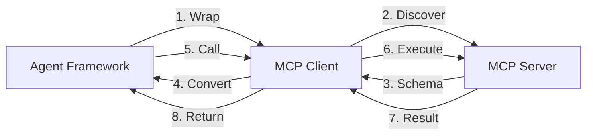

# MCP with Agent Frameworks

## Introduction

MCP truly shines when integrated into **AI agent frameworks** — systems where LLMs autonomously decide which tools to call. Rather than each framework building custom tool integrations, MCP provides a universal interface that works across all of them.

In this lesson, we connect MCP servers to real agent frameworks. We focus primarily on the **OpenAI Agents SDK** (which has the most comprehensive MCP support), then cover integration patterns for other frameworks.

### What We'll Cover

- Connecting MCP servers to the OpenAI Agents SDK
- Using hosted, remote, and local MCP servers with agents
- Tool filtering and caching for production use
- Multi-server management with `MCPServerManager`
- Integration patterns for LangChain and other frameworks
- Approval flows and human-in-the-loop for sensitive tools

### Prerequisites

- MCP server building (Lesson 03)
- MCP client architecture (Lesson 04)
- Understanding of agent tool-calling loops
- Familiarity with at least one agent framework

---

## OpenAI Agents SDK + MCP

The **OpenAI Agents SDK** provides first-class MCP support with five transport options, tool filtering, caching, and approval flows. It treats MCP servers as dynamic tool providers — the agent discovers available tools at runtime.

### Transport Options

| Class | Transport | Use Case |
|-------|-----------|----------|
| `MCPServerStdio` | stdio | Local servers launched as subprocesses |
| `MCPServerStreamableHttp` | Streamable HTTP | Remote servers over HTTP |
| `MCPServerSse` | SSE (legacy) | Backward-compatible remote servers |
| `HostedMCPTool` | Hosted by OpenAI | Zero-infrastructure MCP via OpenAI Responses API |
| `MCPServerManager` | Multi-server | Manages multiple servers as a group |

---

## Local Server with MCPServerStdio

The most common setup connects a local MCP server to an agent:

```python
import asyncio
from agents import Agent, Runner
from agents.mcp import MCPServerStdio

async def main():
    # Connect to a local filesystem MCP server
    async with MCPServerStdio(
        name="Filesystem",
        params={
            "command": "npx",
            "args": ["-y", "@modelcontextprotocol/server-filesystem", "/tmp/data"],
        },
    ) as server:
        # Create an agent that can use the server's tools
        agent = Agent(
            name="File Assistant",
            instructions="Help users manage their files.",
            mcp_servers=[server],
        )

        # The agent discovers tools automatically
        result = await Runner.run(
            agent,
            input="List all files in the /tmp/data directory",
        )
        print(result.final_output)

asyncio.run(main())
```

**What happens under the hood:**

1. `MCPServerStdio` launches `npx @modelcontextprotocol/server-filesystem` as a subprocess
2. The SDK calls `tools/list` to discover available tools
3. Tool schemas are converted to OpenAI function-calling format
4. The agent's LLM receives the tools and decides which to call
5. The SDK routes tool calls through `tools/call` on the MCP server
6. Results flow back to the LLM for the final response

---

## Remote Server with Streamable HTTP

For remote MCP servers, use `MCPServerStreamableHttp`:

```python
from agents.mcp import MCPServerStreamableHttp

async with MCPServerStreamableHttp(
    name="Company CRM",
    params={
        "url": "https://crm.example.com/mcp",
        "headers": {
            "Authorization": "Bearer eyJhbGciOi...",
        },
        "timeout": 15,
    },
    cache_tools_list=True,
) as server:
    agent = Agent(
        name="Sales Assistant",
        instructions="Help the sales team query customer data.",
        mcp_servers=[server],
    )
    result = await Runner.run(agent, input="Show me top 10 customers by revenue")
```

The `cache_tools_list=True` flag is important for production — it avoids calling `tools/list` on every agent run, reducing latency significantly.

### Invalidating the Cache

When the server's tools change, invalidate the cache:

```python
# Force the next run to re-fetch tools
server.invalidate_tools_cache()
```

---

## Hosted MCP (Zero Infrastructure)

**Hosted MCP** is unique to the OpenAI Agents SDK — it runs MCP servers on OpenAI's infrastructure, so you don't deploy anything:

```python
from agents import Agent, Runner
from agents.mcp import HostedMCPTool

agent = Agent(
    name="Research Assistant",
    instructions="Help users find information online.",
    tools=[
        HostedMCPTool(
            tool_config={
                "type": "mcp",
                "server_label": "fetch",
                "server_url": "https://router.mcp.pipedream.net/fetch",
                "require_approval": "never",
            },
        ),
    ],
)

async def main():
    result = await Runner.run(
        agent,
        input="Fetch the homepage of python.org and summarize it",
    )
    print(result.final_output)
```

> **Note:** Hosted MCP tools are passed as `tools=[]` on the agent, not `mcp_servers=[]`. The server runs remotely on OpenAI's side, so no local `async with` context manager is needed.

### Approval Flows

For sensitive hosted tools, require human approval:

```python
agent = Agent(
    name="Data Manager",
    tools=[
        HostedMCPTool(
            tool_config={
                "type": "mcp",
                "server_label": "database",
                "server_url": "https://db-server.example.com/mcp",
                "require_approval": "always",
            },
            on_approval_request=handle_approval,
        ),
    ],
)

async def handle_approval(request):
    """Called when a tool needs human approval."""
    print(f"Tool: {request.tool_name}")
    print(f"Arguments: {request.arguments}")
    answer = input("Approve? (y/n): ")
    return answer.lower() == "y"
```

**Approval modes:**

| Mode | Behavior |
|------|----------|
| `"never"` | All tool calls execute automatically |
| `"always"` | Every tool call requires approval |
| Per-tool config | Specify approval rules per tool name |

---

## Tool Filtering

In production, you often want to **restrict which tools** an agent can access — especially when connecting to MCP servers with many capabilities.

### Static Filtering

Use `allowed_tools` or `blocked_tools` to statically control tool access:

```python
from agents.mcp import MCPServerStdio

async with MCPServerStdio(
    name="Filesystem",
    params={
        "command": "npx",
        "args": ["-y", "@modelcontextprotocol/server-filesystem", "/tmp/data"],
    },
) as server:
    # Only expose read operations
    agent = Agent(
        name="Read-Only File Assistant",
        instructions="Help users read files. Do not modify anything.",
        mcp_servers=[server],
        mcp_config={
            "allowed_tools": ["read_file", "list_directory", "search_files"],
        },
    )
```

Alternatively, block specific tools:

```python
agent = Agent(
    name="Safe File Assistant",
    mcp_servers=[server],
    mcp_config={
        "blocked_tools": ["write_file", "delete_file", "move_file"],
    },
)
```

### Dynamic Filtering

For context-dependent filtering, use a dynamic filter function:

```python
from agents.mcp import ToolFilterContext

def role_based_filter(context: ToolFilterContext, tool) -> bool:
    """Filter tools based on user role."""
    admin_tools = {"write_file", "delete_file", "create_directory"}

    if context.run_context.context.get("role") == "admin":
        return True  # Admins get all tools

    # Non-admins cannot use admin tools
    return tool.name not in admin_tools

agent = Agent(
    name="File Assistant",
    mcp_servers=[server],
    mcp_config={
        "tool_filter": role_based_filter,
    },
)
```

---

## Multi-Server Management

Production agents often need tools from **multiple MCP servers**. The `MCPServerManager` manages connections to several servers as a group:

```python
from agents.mcp import (
    MCPServerStdio,
    MCPServerStreamableHttp,
    MCPServerManager,
)

servers = MCPServerManager(
    servers=[
        MCPServerStdio(
            name="Filesystem",
            params={"command": "npx", "args": ["-y", "@modelcontextprotocol/server-filesystem", "/tmp"]},
        ),
        MCPServerStreamableHttp(
            name="Search API",
            params={"url": "https://search.example.com/mcp"},
        ),
        MCPServerStdio(
            name="Git",
            params={"command": "uvx", "args": ["mcp-server-git"]},
        ),
    ],
    drop_failed_servers=True,  # Continue if one server fails
)

async with servers:
    agent = Agent(
        name="Developer Assistant",
        instructions="Help developers with files, search, and git operations.",
        mcp_servers=servers.active_servers,
    )

    if servers.failed_servers:
        print(f"Warning: {len(servers.failed_servers)} server(s) failed to connect")

    result = await Runner.run(agent, input="Find all TODO comments in the project")
    print(result.final_output)
```

**Key features of MCPServerManager:**

| Feature | Description |
|---------|-------------|
| `drop_failed_servers=True` | Continue even if some servers fail |
| `active_servers` | List of successfully connected servers |
| `failed_servers` | List of servers that failed to connect |
| Automatic cleanup | All servers cleaned up on context exit |

---

## Agent-Level MCP Configuration

The `mcp_config` parameter on `Agent` controls global MCP behavior:

```python
agent = Agent(
    name="Assistant",
    mcp_servers=[server1, server2],
    mcp_config={
        "convert_schemas_to_strict": True,
        "allowed_tools": ["read_file", "search"],
        "tool_filter": my_dynamic_filter,
    },
)
```

| Option | Purpose |
|--------|---------|
| `convert_schemas_to_strict` | Convert MCP tool schemas to OpenAI strict mode |
| `allowed_tools` | Static allowlist of tool names |
| `blocked_tools` | Static blocklist of tool names |
| `tool_filter` | Dynamic function for context-based filtering |

> **Warning:** `allowed_tools` and `blocked_tools` are mutually exclusive. Use one or the other, not both.

---

## LangChain Integration

LangChain supports MCP through the `langchain-mcp-adapters` package, which wraps MCP tools as LangChain tools:

```python
# pip install langchain-mcp-adapters

from langchain_mcp_adapters.tools import load_mcp_tools
from mcp import ClientSession, StdioServerParameters
from mcp.client.stdio import stdio_client

server_params = StdioServerParameters(
    command="python",
    args=["my_server.py"],
)

async with stdio_client(server_params) as (read, write):
    async with ClientSession(read, write) as session:
        await session.initialize()

        # Convert MCP tools to LangChain tools
        tools = await load_mcp_tools(session)

        # Use with any LangChain agent
        from langchain_openai import ChatOpenAI
        from langgraph.prebuilt import create_react_agent

        model = ChatOpenAI(model="gpt-4o")
        agent = create_react_agent(model, tools)

        result = await agent.ainvoke(
            {"messages": [{"role": "user", "content": "What tools do you have?"}]}
        )
```

### Key Differences from OpenAI Agents SDK

| Feature | OpenAI Agents SDK | LangChain |
|---------|------------------|-----------|
| MCP support | First-class, built-in | Via adapter package |
| Tool filtering | Static + dynamic | Manual filtering |
| Multi-server | `MCPServerManager` | Manual management |
| Hosted MCP | Yes (`HostedMCPTool`) | No |
| Caching | Built-in (`cache_tools_list`) | Manual |

---

## Integration Pattern: Any Framework

For frameworks without native MCP support, the pattern is always the same:



1. **Initialize** the MCP client and connect to the server
2. **Discover** tools via `tools/list`
3. **Convert** MCP tool schemas to the framework's tool format
4. **Register** converted tools with the agent
5. **Route** tool calls from the agent through the MCP client
6. **Return** results back to the agent

```python
# Generic adapter pattern
class MCPToolAdapter:
    """Adapts MCP tools for any agent framework."""

    def __init__(self, session: ClientSession):
        self.session = session
        self.tools = []

    async def discover_tools(self):
        """Discover and store MCP tools."""
        response = await self.session.list_tools()
        self.tools = response.tools
        return self.tools

    def to_framework_format(self, framework: str):
        """Convert MCP tools to target framework format."""
        converted = []
        for tool in self.tools:
            converted.append({
                "name": tool.name,
                "description": tool.description,
                "parameters": tool.inputSchema,
            })
        return converted

    async def call_tool(self, name: str, arguments: dict):
        """Execute a tool call through MCP."""
        result = await self.session.call_tool(name, arguments)
        return result.content
```

---

## Best Practices

| Practice | Why It Matters |
|----------|----------------|
| Enable `cache_tools_list` in production | Avoids repeated `tools/list` calls |
| Use `drop_failed_servers=True` for multi-server | Prevents one failure from blocking everything |
| Apply tool filtering for security | Limits agent actions to what's needed |
| Use dynamic filtering for multi-tenant apps | Different users get different tool access |
| Prefer `MCPServerStdio` for local development | Simplest setup, no network config |
| Handle `failed_servers` gracefully | Log warnings, degrade functionality |

---

## Common Pitfalls

| ❌ Mistake | ✅ Solution |
|-----------|-------------|
| Passing `MCPServerStdio` to `tools=[]` | Use `mcp_servers=[]` (except `HostedMCPTool`) |
| Forgetting `async with` for server connections | Always use context managers for lifecycle |
| Using both `allowed_tools` and `blocked_tools` | Choose one — they are mutually exclusive |
| Not caching tools in production loops | Set `cache_tools_list=True` to reduce latency |
| Hardcoding tool names that may change | Use `list_tools()` and filter dynamically |
| Ignoring `failed_servers` in multi-server setups | Check and log failures for observability |

---

## Hands-on Exercise

### Your Task

Build a multi-server agent using the OpenAI Agents SDK that connects to two MCP servers and includes tool filtering.

### Requirements

1. Create two simple MCP servers:
   - A **notes server** with `create_note`, `list_notes`, and `delete_note` tools
   - A **calculator server** with `add`, `subtract`, `multiply`, and `divide` tools
2. Connect both servers to an agent using `MCPServerManager`
3. Apply **static tool filtering** to block the `delete_note` tool
4. Handle the case where one server fails to start

### Expected Result

An agent that can create/list notes and perform calculations, but cannot delete notes. If the calculator server fails, the agent should still work with the notes server.

<details>
<summary>💡 Hints (click to expand)</summary>

- Each MCP server is its own Python file with `FastMCP`
- Use `MCPServerManager` with `drop_failed_servers=True`
- Put `mcp_config={"blocked_tools": ["delete_note"]}` on the Agent
- Check `servers.failed_servers` after connecting

</details>

<details>
<summary>✅ Solution (click to expand)</summary>

**notes_server.py:**

```python
from mcp.server.fastmcp import FastMCP

mcp = FastMCP("Notes")
notes = {}

@mcp.tool()
async def create_note(title: str, content: str) -> str:
    """Create a new note."""
    notes[title] = content
    return f"Created note: {title}"

@mcp.tool()
async def list_notes() -> str:
    """List all notes."""
    if not notes:
        return "No notes found."
    return "\n".join(f"- {title}" for title in notes)

@mcp.tool()
async def delete_note(title: str) -> str:
    """Delete a note by title."""
    if title in notes:
        del notes[title]
        return f"Deleted: {title}"
    return f"Note not found: {title}"

mcp.run(transport="stdio")
```

**calculator_server.py:**

```python
from mcp.server.fastmcp import FastMCP

mcp = FastMCP("Calculator")

@mcp.tool()
async def add(a: float, b: float) -> float:
    """Add two numbers."""
    return a + b

@mcp.tool()
async def subtract(a: float, b: float) -> float:
    """Subtract b from a."""
    return a - b

@mcp.tool()
async def multiply(a: float, b: float) -> float:
    """Multiply two numbers."""
    return a * b

@mcp.tool()
async def divide(a: float, b: float) -> float:
    """Divide a by b."""
    if b == 0:
        raise ValueError("Cannot divide by zero")
    return a / b

mcp.run(transport="stdio")
```

**agent.py:**

```python
import asyncio
from agents import Agent, Runner
from agents.mcp import MCPServerStdio, MCPServerManager

async def main():
    servers = MCPServerManager(
        servers=[
            MCPServerStdio(
                name="Notes",
                params={"command": "python", "args": ["notes_server.py"]},
            ),
            MCPServerStdio(
                name="Calculator",
                params={"command": "python", "args": ["calculator_server.py"]},
            ),
        ],
        drop_failed_servers=True,
    )

    async with servers:
        if servers.failed_servers:
            print(f"⚠️ Failed: {[s.name for s in servers.failed_servers]}")

        agent = Agent(
            name="Assistant",
            instructions="Help with notes and calculations. Never delete notes.",
            mcp_servers=servers.active_servers,
            mcp_config={
                "blocked_tools": ["delete_note"],
            },
        )

        result = await Runner.run(
            agent,
            input="Create a note titled 'Meeting' with content 'Discuss MCP'. Then calculate 42 * 3.",
        )
        print(result.final_output)

asyncio.run(main())
```

</details>

### Bonus Challenges

- [ ] Add a dynamic tool filter that checks user permissions from a config file
- [ ] Implement tool caching with a manual invalidation trigger
- [ ] Replace `MCPServerStdio` with `MCPServerStreamableHttp` for the calculator and configure authentication headers

---

## Summary

✅ The **OpenAI Agents SDK** has the most comprehensive MCP support — five transport options, tool filtering, caching, and approval flows

✅ **MCPServerStdio** connects local servers; **MCPServerStreamableHttp** connects remote servers; **HostedMCPTool** uses zero-infrastructure cloud servers

✅ **Tool filtering** (static via `allowed_tools`/`blocked_tools`, dynamic via `tool_filter`) controls which tools agents can access

✅ **MCPServerManager** handles multi-server setups with `drop_failed_servers` for resilience

✅ Any framework can integrate MCP by wrapping the `ClientSession` as an adapter that converts tool schemas to the framework's format

**Next:** [Popular MCP Servers and Ecosystem](./07-popular-mcp-servers.md)

---

## Further Reading

- [OpenAI Agents SDK — MCP](https://openai.github.io/openai-agents-python/mcp/) — Official Agents SDK MCP documentation
- [LangChain MCP Adapters](https://github.com/langchain-ai/langchain-mcp-adapters) — LangChain integration for MCP
- [MCP Client List](https://modelcontextprotocol.io/clients) — 100+ MCP-compatible clients
- [MCP Server Concepts](https://modelcontextprotocol.io/docs/concepts/servers) — How agents use MCP servers

---

[Back to MCP Overview](./00-model-context-protocol-mcp.md)

<!-- Sources Consulted:
- OpenAI Agents SDK MCP: https://openai.github.io/openai-agents-python/mcp/
- MCP Clients Directory: https://modelcontextprotocol.io/clients
- MCP Server Concepts: https://modelcontextprotocol.io/docs/concepts/servers
- LangChain MCP Adapters: https://github.com/langchain-ai/langchain-mcp-adapters
-->
