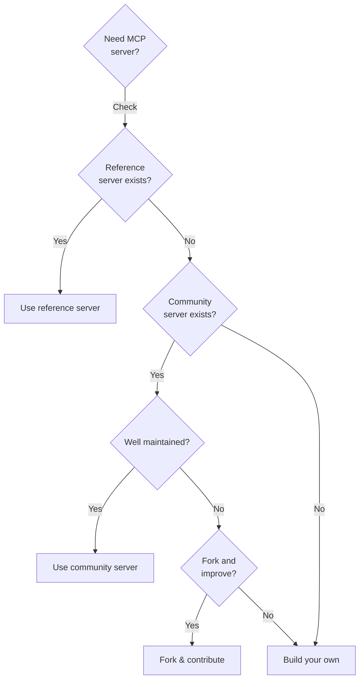

# Popular MCP Servers and Ecosystem

## Introduction

The MCP ecosystem has grown rapidly since the protocol's release. Dozens of **reference implementations**, **official integrations**, and **community servers** provide ready-to-use capabilities that agents can connect to immediately — no custom code required.

Understanding what's already available saves you from building tools that already exist. In this lesson, we explore the most popular MCP servers, how to configure them, and where the ecosystem is heading.

### What We'll Cover

- Official reference servers maintained by the MCP project
- How to install and configure popular servers
- MCP client compatibility across applications
- Community server ecosystem and discovery
- Building on existing servers vs creating your own

### Prerequisites

- MCP architecture fundamentals (Lesson 01)
- Building MCP servers (Lesson 03)
- Transport implementations (Lesson 05)

---

## Reference Servers

The MCP project maintains a set of **reference implementations** that demonstrate protocol capabilities and serve as production-ready tools. These are officially maintained and follow MCP best practices.

### Overview of Reference Servers

| Server | Purpose | Transport | Package |
|--------|---------|-----------|---------|
| **Everything** | Protocol testing — exposes every MCP feature | stdio | `@modelcontextprotocol/server-everything` |
| **Filesystem** | Read, write, search files and directories | stdio | `@modelcontextprotocol/server-filesystem` |
| **Fetch** | Retrieve and convert web content | stdio | `@modelcontextprotocol/server-fetch` |
| **Git** | Git repository operations (log, diff, status) | stdio | `mcp-server-git` (Python) |
| **Memory** | Knowledge graph with entity/relation storage | stdio | `@modelcontextprotocol/server-memory` |
| **Sequential Thinking** | Structured multi-step reasoning | stdio | `@modelcontextprotocol/server-sequential-thinking` |
| **Time** | Time queries and timezone conversions | stdio | `@modelcontextprotocol/server-time` |

---

## Filesystem Server

The **Filesystem server** gives agents controlled access to local files and directories. It is one of the most widely used MCP servers.

### Installation and Configuration

```json
{
  "mcpServers": {
    "filesystem": {
      "command": "npx",
      "args": [
        "-y",
        "@modelcontextprotocol/server-filesystem",
        "/Users/you/projects",
        "/Users/you/documents"
      ]
    }
  }
}
```

The paths at the end are the **allowed directories** — the server will only grant access to files within these paths, providing a security boundary.

### Available Tools

| Tool | Description | Arguments |
|------|-------------|-----------|
| `read_file` | Read the complete contents of a file | `path` |
| `read_multiple_files` | Read several files at once | `paths[]` |
| `write_file` | Create or overwrite a file | `path`, `content` |
| `edit_file` | Make targeted edits with a diff-based approach | `path`, `edits[]`, `dryRun` |
| `create_directory` | Create a directory (and parents) | `path` |
| `list_directory` | List contents of a directory | `path` |
| `move_file` | Move or rename a file | `source`, `destination` |
| `search_files` | Recursive regex search across files | `path`, `pattern`, `excludePatterns` |
| `get_file_info` | Get metadata (size, dates, permissions) | `path` |
| `list_allowed_directories` | Show which directories are accessible | none |

### Example Usage

When connected to Claude Desktop, you can say:

> "Search my projects folder for all Python files containing `import openai` and list them."

The agent calls `search_files` with `pattern: "import openai"` and `path: "/Users/you/projects"`, then formats the results.

---

## Fetch Server

The **Fetch server** retrieves web content and converts it to agent-friendly formats (Markdown or plain text), making web pages usable as context.

### Configuration

```json
{
  "mcpServers": {
    "fetch": {
      "command": "uvx",
      "args": ["mcp-server-fetch"]
    }
  }
}
```

### Available Tools

| Tool | Description |
|------|-------------|
| `fetch` | Retrieve a URL and convert to Markdown or plain text |

### Practical Example

```
User: "Fetch the Python 3.13 changelog and summarize the new features."

Agent calls: fetch(url="https://docs.python.org/3/whatsnew/3.13.html")
Agent receives: Markdown-converted page content
Agent responds: Summary of key features
```

> **🤖 AI Context:** The Fetch server is particularly useful for RAG-like workflows where agents need to pull fresh information from the web before answering questions.

---

## Git Server

The **Git server** provides git repository operations, allowing agents to inspect commit history, diffs, branches, and repository status.

### Configuration

```json
{
  "mcpServers": {
    "git": {
      "command": "uvx",
      "args": ["mcp-server-git", "--repository", "/path/to/repo"]
    }
  }
}
```

### Available Tools

| Tool | Description |
|------|-------------|
| `git_status` | Show working tree status |
| `git_diff_unstaged` | Show unstaged changes |
| `git_diff_staged` | Show staged changes |
| `git_diff` | Compare two branches or commits |
| `git_commit` | Create a commit with a message |
| `git_add` | Stage files for commit |
| `git_reset` | Unstage files |
| `git_log` | Show commit history |
| `git_create_branch` | Create a new branch |
| `git_checkout` | Switch branches |
| `git_show` | Show the contents of a commit |

### Example Workflow

> "Show me what changed in the last 5 commits and summarize the main themes."

The agent calls `git_log` to get recent commits, then `git_show` for each, and synthesizes a summary.

---

## Memory Server

The **Memory server** provides a persistent **knowledge graph** that agents can use to store and retrieve structured information across conversations.

### Configuration

```json
{
  "mcpServers": {
    "memory": {
      "command": "npx",
      "args": ["-y", "@modelcontextprotocol/server-memory"]
    }
  }
}
```

### Available Tools

| Tool | Description |
|------|-------------|
| `create_entities` | Create named entities with types and observations |
| `create_relations` | Create relationships between entities |
| `add_observations` | Add facts to existing entities |
| `delete_entities` | Remove entities from the graph |
| `delete_observations` | Remove specific facts |
| `delete_relations` | Remove relationships |
| `read_graph` | Get the entire knowledge graph |
| `search_nodes` | Find entities by name or content |
| `open_nodes` | Get details of specific entities |

### Use Case: Persistent Memory for Agents

```
Session 1:
User: "Remember that Alice is our lead developer and she prefers Python."
Agent calls: create_entities([{name: "Alice", type: "person", observations: ["lead developer", "prefers Python"]}])

Session 2 (days later):
User: "What do we know about Alice?"
Agent calls: search_nodes("Alice")
Agent responds: "Alice is our lead developer who prefers Python."
```

> **🤖 AI Context:** Knowledge graphs are a powerful alternative to vector databases for structured information. The Memory server shows how MCP can provide persistent state across agent sessions.

---

## Sequential Thinking Server

The **Sequential Thinking** server helps agents break down complex problems into structured reasoning steps.

### Configuration

```json
{
  "mcpServers": {
    "sequential-thinking": {
      "command": "npx",
      "args": ["-y", "@modelcontextprotocol/server-sequential-thinking"]
    }
  }
}
```

### How It Works

The server provides a `sequentialthinking` tool that guides the LLM through a structured thought process:

1. The agent describes the problem
2. The server asks for step-by-step reasoning
3. Each step can revise or branch from previous steps
4. The final output is a structured chain of thought

This is useful for complex planning, debugging multi-step problems, and analysis tasks.

---

## MCP Client Compatibility

MCP servers are only useful if there's a **client** to connect them to. Here's the current landscape of MCP-compatible clients:

### Major MCP Clients

| Client | Tools | Resources | Prompts | Sampling | Roots |
|--------|-------|-----------|---------|----------|-------|
| **Claude Desktop** | ✅ | ✅ | ✅ | ✅ | ✅ |
| **VS Code (GitHub Copilot)** | ✅ | ❌ | ❌ | ❌ | ❌ |
| **Cursor** | ✅ | ❌ | ❌ | ❌ | ❌ |
| **ChatGPT Desktop** | ✅ | ❌ | ❌ | ❌ | ❌ |
| **Windsurf** | ✅ | ❌ | ❌ | ❌ | ❌ |
| **Cline** | ✅ | ✅ | ✅ | ❌ | ❌ |
| **Continue** | ✅ | ✅ | ✅ | ❌ | ❌ |
| **Zed** | ✅ | ❌ | ✅ | ❌ | ❌ |
| **Gemini CLI** | ✅ | ❌ | ❌ | ❌ | ❌ |

> **Note:** Client support is evolving rapidly. Check the [official clients page](https://modelcontextprotocol.io/clients) for the latest compatibility matrix.

### What Client Support Means

- **Tools ✅** — The client can discover and call MCP tools (most common)
- **Resources ✅** — The client can read MCP resources (file-like data)
- **Prompts ✅** — The client exposes MCP prompts as slash commands
- **Sampling ✅** — The server can request LLM completions through the client
- **Roots ✅** — The client tells the server which directories it can access

Most clients currently support **tools only**, which covers the majority of use cases.

---

## Community Servers

Beyond reference implementations, a thriving community has built MCP servers for hundreds of services:

### Database Servers

| Server | Database | Key Features |
|--------|----------|--------------|
| `mcp-server-sqlite` | SQLite | Query, create tables, analyze data |
| `mcp-server-postgres` | PostgreSQL | Read-only queries, schema inspection |
| `mcp-server-mysql` | MySQL | Query execution, table management |
| `mongodb-mcp-server` | MongoDB | Aggregation, CRUD, schema analysis |

### Cloud & SaaS Servers

| Server | Service | Key Features |
|--------|---------|--------------|
| `mcp-server-github` | GitHub | Issues, PRs, repository management |
| `mcp-server-slack` | Slack | Send messages, read channels, search |
| `mcp-server-google-drive` | Google Drive | File listing, content reading |
| `mcp-server-google-maps` | Google Maps | Geocoding, directions, places |
| `mcp-server-brave-search` | Brave Search | Web and local search |

### Developer Tool Servers

| Server | Tool | Key Features |
|--------|------|--------------|
| `mcp-server-docker` | Docker | Container management, images, networks |
| `mcp-server-kubernetes` | Kubernetes | Pod management, deployments, logs |
| `mcp-server-puppeteer` | Puppeteer | Browser automation, screenshots |
| `mcp-server-sentry` | Sentry | Error tracking, issue management |

### Discovering Servers

Several resources help you find MCP servers:

| Resource | Description |
|----------|-------------|
| [MCP Servers Directory](https://github.com/modelcontextprotocol/servers) | Official repository listing |
| [mcp.so](https://mcp.so) | Community server registry |
| [Smithery](https://smithery.ai) | MCP server marketplace |
| [Glama MCP Directory](https://glama.ai/mcp/servers) | Curated server listings |

---

## Configuring Multiple Servers

A typical production setup connects several servers. Here's a configuration for a developer workflow:

```json
{
  "mcpServers": {
    "filesystem": {
      "command": "npx",
      "args": ["-y", "@modelcontextprotocol/server-filesystem", "/home/dev/projects"]
    },
    "git": {
      "command": "uvx",
      "args": ["mcp-server-git", "--repository", "/home/dev/projects/myapp"]
    },
    "github": {
      "command": "npx",
      "args": ["-y", "@modelcontextprotocol/server-github"],
      "env": {
        "GITHUB_PERSONAL_ACCESS_TOKEN": "ghp_your_token_here"
      }
    },
    "fetch": {
      "command": "uvx",
      "args": ["mcp-server-fetch"]
    },
    "memory": {
      "command": "npx",
      "args": ["-y", "@modelcontextprotocol/server-memory"]
    }
  }
}
```

This gives the agent access to:
- 📁 Local files via Filesystem
- 🔀 Git history and diffs via Git
- 🐙 GitHub issues and PRs via GitHub
- 🌐 Web content via Fetch
- 🧠 Persistent memory via Memory

---

## Build vs Reuse Decision

Before building a custom server, check if one already exists:



### When to Build Your Own

| Scenario | Recommendation |
|----------|---------------|
| Need access to internal company APIs | Build custom |
| Standard database access | Use existing (sqlite, postgres, etc.) |
| Custom business logic | Build custom |
| File system access | Use Filesystem reference server |
| Web scraping | Use Fetch reference server |
| Proprietary data format | Build custom |

---

## Best Practices

| Practice | Why It Matters |
|----------|----------------|
| Check reference servers first | Saves development time, follows best practices |
| Verify client compatibility before choosing a server | Not all clients support all primitives |
| Pin server versions in production | Prevents unexpected breaking changes |
| Limit directories for Filesystem server | Security boundary — only expose what's needed |
| Set environment variables securely | Never hardcode API keys in config files |
| Test with MCP Inspector before deployment | Catch issues before connecting to an LLM |

---

## Common Pitfalls

| ❌ Mistake | ✅ Solution |
|-----------|-------------|
| Building a file access tool from scratch | Use the Filesystem reference server |
| Exposing entire home directory to Filesystem | Restrict to specific project directories |
| Using community servers without reviewing code | Audit security-sensitive servers before trusting |
| Assuming all clients support Resources | Most clients only support Tools currently |
| Hardcoding tokens in `mcpServers` config | Use environment variables or a secret manager |
| Using `npm install -g` for MCP servers | Use `npx -y` or `uvx` for isolated execution |

---

## Hands-on Exercise

### Your Task

Set up a multi-server development environment configuration and test it with the MCP Inspector.

### Requirements

1. Create a JSON configuration for **three MCP servers**:
   - Filesystem (limited to a specific project directory)
   - Git (pointed at the same project)
   - Fetch (for web content retrieval)
2. Test each server individually using `mcp dev` or the MCP Inspector
3. Verify that each server's tools appear correctly
4. Document which tools each server provides

### Expected Result

A working `mcp_config.json` file and a summary table of all available tools across your three servers.

<details>
<summary>💡 Hints (click to expand)</summary>

- Use `npx -y @modelcontextprotocol/server-filesystem` for the filesystem server
- Use `uvx mcp-server-git --repository /path` for the git server
- Use `uvx mcp-server-fetch` for the fetch server
- Test with `npx @modelcontextprotocol/inspector`

</details>

<details>
<summary>✅ Solution (click to expand)</summary>

**mcp_config.json:**

```json
{
  "mcpServers": {
    "filesystem": {
      "command": "npx",
      "args": ["-y", "@modelcontextprotocol/server-filesystem", "/home/dev/myproject"]
    },
    "git": {
      "command": "uvx",
      "args": ["mcp-server-git", "--repository", "/home/dev/myproject"]
    },
    "fetch": {
      "command": "uvx",
      "args": ["mcp-server-fetch"]
    }
  }
}
```

**Testing each server:**

```bash
# Test filesystem server
npx @modelcontextprotocol/inspector npx -y @modelcontextprotocol/server-filesystem /home/dev/myproject

# Test git server
npx @modelcontextprotocol/inspector uvx mcp-server-git --repository /home/dev/myproject

# Test fetch server
npx @modelcontextprotocol/inspector uvx mcp-server-fetch
```

**Combined tool summary:**

| Server | Tools | Count |
|--------|-------|-------|
| Filesystem | `read_file`, `write_file`, `edit_file`, `create_directory`, `list_directory`, `move_file`, `search_files`, `get_file_info`, `read_multiple_files`, `list_allowed_directories` | 10 |
| Git | `git_status`, `git_diff_unstaged`, `git_diff_staged`, `git_diff`, `git_commit`, `git_add`, `git_reset`, `git_log`, `git_create_branch`, `git_checkout`, `git_show` | 11 |
| Fetch | `fetch` | 1 |
| **Total** | | **22** |

</details>

### Bonus Challenges

- [ ] Add the Memory server and use it to store notes about your project's architecture
- [ ] Find a community server for a service you use (GitHub, Slack, etc.) and add it to your configuration
- [ ] Write a script that validates your `mcp_config.json` by attempting to connect to each server

---

## Summary

✅ **Seven reference servers** cover the most common needs — Filesystem, Fetch, Git, Memory, Sequential Thinking, Time, and Everything

✅ Most MCP clients support **tools only** — Claude Desktop has the broadest primitive support

✅ **Community servers** exist for databases, cloud services, and developer tools — check before building

✅ Use `npx -y` for Node.js servers and `uvx` for Python servers — both provide isolated execution

✅ Always **restrict access** (directories, permissions) and **secure credentials** (environment variables, not hardcoded)

**Next:** [Security and Best Practices](./08-security-considerations.md)

---

## Further Reading

- [MCP Servers Repository](https://github.com/modelcontextprotocol/servers) — Official server directory
- [MCP Clients List](https://modelcontextprotocol.io/clients) — Client compatibility matrix
- [MCP Inspector](https://modelcontextprotocol.io/docs/tools/inspector) — Visual testing tool
- [Smithery MCP Marketplace](https://smithery.ai) — Community server marketplace

---

[Back to MCP Overview](./00-model-context-protocol-mcp.md)

<!-- Sources Consulted:
- MCP Example Servers: https://modelcontextprotocol.io/docs/develop/example-servers
- MCP Clients: https://modelcontextprotocol.io/clients
- MCP Server Concepts: https://modelcontextprotocol.io/docs/concepts/servers
- GitHub MCP Servers Repo: https://github.com/modelcontextprotocol/servers
-->
