# Security and Best Practices

## Introduction

MCP connects AI agents to powerful capabilities — file systems, databases, APIs, and more. This power demands careful security design. A poorly secured MCP deployment could allow an agent to read sensitive files, execute destructive operations, or leak credentials.

In this lesson, we examine MCP's security model from the ground up: how capabilities are negotiated, how servers are sandboxed, how trust flows through the system, and what you must implement to run MCP safely in production.

### What We'll Cover

- MCP's capability-based permission model
- Server sandboxing with roots and filesystem boundaries
- Transport-layer security (Origin validation, TLS, authentication)
- Human-in-the-loop approval for sensitive operations
- Input validation and injection prevention
- Trust model — annotations are hints, not guarantees
- Production security checklist

### Prerequisites

- MCP architecture fundamentals (Lesson 01)
- MCP primitives, especially roots (Lesson 02)
- Transport implementations (Lesson 05)
- Basic understanding of web security concepts

---

## The MCP Security Model

MCP's security is built on several layers that work together:


| Layer | Question It Answers | Mechanism |
|-------|-------------------|-----------|
| Capabilities | What can the server do? | Initialization handshake |
| Roots | Where can the server act? | Client-provided file boundaries |
| Transport | How are messages protected? | TLS, Origin validation, auth tokens |
| Human approval | Who authorizes actions? | Tool approval prompts, sampling consent |
| Input validation | What data is accepted? | JSON Schema, path sanitization |

---

## Capability-Based Permissions

During initialization, the server and client **negotiate capabilities** — each side declares what it supports. This means a server cannot use features the client hasn't agreed to, and vice versa.

### Server Capabilities

```json
{
  "capabilities": {
    "tools": { "listChanged": true },
    "resources": { "subscribe": true, "listChanged": true },
    "prompts": { "listChanged": true },
    "logging": {}
  }
}
```

### Client Capabilities

```json
{
  "capabilities": {
    "roots": { "listChanged": true },
    "sampling": {}
  }
}
```

### Security Implications

| Capability | Risk Without Control | Mitigation |
|-----------|---------------------|------------|
| `tools` | Server exposes destructive operations | Client filters tools, requires approval |
| `resources` | Server reads sensitive data | Client limits which resources are exposed |
| `sampling` | Server requests LLM completions at client's cost | Client requires human approval |
| `roots` | Server accesses unauthorized directories | Client restricts roots to specific paths |

> **🔑 Key concept:** Capabilities are declared at initialization and cannot be expanded later without re-initialization. This provides a **static security boundary** for each session.

---

## Roots: Filesystem Sandboxing

**Roots** are the primary mechanism for limiting a server's filesystem access. The client tells the server which directories it's allowed to work with.

### How Roots Work

```mermaid
sequenceDiagram
    participant Client
    participant Server
    
    Client->>Server: Initialize (capabilities: roots)
    Server->>Client: roots/list
    Client-->>Server: [{uri: "file:///home/user/project", name: "My Project"}]
    
    Note over Server: Server should ONLY access<br/>files under /home/user/project
    
    Server->>Client: Read file (within root) ✅
    Server->>Client: Read /etc/passwd (outside root) ❌
```



### Setting Roots

Roots are `file://` URIs that the client provides:

```json
{
  "roots": [
    {
      "uri": "file:///home/user/project",
      "name": "Current Project"
    },
    {
      "uri": "file:///home/user/docs",
      "name": "Documentation"
    }
  ]
}
```

### Dynamic Root Updates

Roots can change during a session. When they do, the client sends a notification:

```json
{
  "jsonrpc": "2.0",
  "method": "notifications/roots/list_changed"
}
```

The server should then re-request the root list and adjust its behavior accordingly.

### Security Rules for Roots

| Rule | Implementation |
|------|----------------|
| Validate all file paths against roots | Check that requested paths start with a root URI |
| Prevent path traversal | Reject paths containing `../` or symbolic links escaping roots |
| Treat roots as advisory | Servers SHOULD respect roots, but clients MUST enforce |
| Monitor root accessibility | Check that root directories still exist and are readable |
| Require user consent | Prompt users before adding new roots |

> **Warning:** Roots are **advisory** — a malicious server could ignore them. The client-side application (host) is ultimately responsible for enforcing access boundaries. Do not trust a server to self-enforce root restrictions.

---

## Transport Security

Each transport has its own security requirements. Getting these wrong can expose your MCP server to attacks.

### stdio Security

| Aspect | Guideline |
|--------|-----------|
| Process isolation | Server runs as child process with limited permissions |
| Environment variables | Pass secrets via `env` in config, not command-line args |
| Stderr only for logs | Never leak sensitive data in log output |
| No network | stdio servers have no network exposure by default |

```json
{
  "mcpServers": {
    "secure-server": {
      "command": "python",
      "args": ["server.py"],
      "env": {
        "API_KEY": "sk-..."
      }
    }
  }
}
```

> **Note:** Command-line arguments are visible in process listings (`ps aux`). Always use environment variables for secrets.

### Streamable HTTP Security

Remote HTTP servers face significantly more threats:

| Threat | Defense |
|--------|---------|
| DNS rebinding | Validate `Origin` header on every request |
| Unauthorized access | Implement OAuth 2.1 or bearer token authentication |
| Man-in-the-middle | Use HTTPS (TLS) for all remote connections |
| Session hijacking | Generate cryptographically random `Mcp-Session-Id` values |
| External exposure | Bind local servers to `127.0.0.1`, never `0.0.0.0` |

### Origin Header Validation

Every Streamable HTTP server MUST validate the `Origin` header:

```python
from starlette.middleware.base import BaseHTTPMiddleware
from starlette.responses import JSONResponse

class OriginValidationMiddleware(BaseHTTPMiddleware):
    ALLOWED_ORIGINS = {
        "https://claude.ai",
        "vscode-webview://",
        "http://localhost:3000",
    }

    async def dispatch(self, request, call_next):
        origin = request.headers.get("Origin")

        if origin and origin not in self.ALLOWED_ORIGINS:
            return JSONResponse(
                {"error": "Origin not allowed"},
                status_code=403,
            )

        return await call_next(request)
```

### Binding to Localhost

When running MCP servers locally for development:

```python
# ✅ CORRECT — only accessible from this machine
uvicorn.run(app, host="127.0.0.1", port=8000)

# ❌ DANGEROUS — accessible from the entire network
uvicorn.run(app, host="0.0.0.0", port=8000)
```

---

## Human-in-the-Loop Approval

MCP supports **human approval** for two critical operations: tool calls and sampling requests.

### Tool Approval

Clients SHOULD prompt users before executing tools that modify state:


### Tool Annotations for Approval Decisions

Tool annotations help clients decide whether to prompt for approval:

| Annotation | Value | Implication |
|-----------|-------|-------------|
| `readOnlyHint` | `true` | Low risk — auto-approve is reasonable |
| `destructiveHint` | `true` | High risk — always prompt for approval |
| `idempotentHint` | `true` | Safe to retry — medium risk |
| `openWorldHint` | `true` | Interacts with external systems — higher risk |

> **Important:** Annotations are **hints**, not security guarantees. A malicious server could mark a destructive tool as `readOnlyHint: true`. Clients should apply their own risk assessment on top of annotations.

### Sampling Approval

When a server requests LLM completions via `sampling/createMessage`, the client MUST:

1. Show the user what the server is asking the LLM to do
2. Allow the user to modify or reject the request
3. Control which model is used (the server's `modelPreferences` are suggestions)
4. Review the LLM's response before sending it to the server

```python
# Client-side sampling handler (conceptual)
async def handle_sampling_request(request):
    """Human reviews what the server is asking the LLM."""
    print(f"Server wants LLM to process:")
    for msg in request.messages:
        print(f"  [{msg.role}]: {msg.content.text}")
    print(f"Max tokens: {request.maxTokens}")

    approval = input("Allow this LLM request? (y/n): ")
    if approval.lower() != "y":
        raise PermissionError("User denied sampling request")

    # Forward to LLM
    response = await llm.complete(request.messages)

    # Let user review the response before sending to server
    print(f"LLM response: {response.text}")
    send_approval = input("Send this response to server? (y/n): ")
    if send_approval.lower() != "y":
        raise PermissionError("User denied response delivery")

    return response
```

---

## Input Validation

Every MCP server must validate all inputs rigorously. The LLM constructs tool arguments, and prompt injection attacks could craft malicious inputs.

### Path Traversal Prevention

```python
import os

ALLOWED_ROOT = "/home/user/project"

def validate_path(requested_path: str) -> str:
    """Ensure the path is within the allowed root."""
    # Resolve to absolute path
    abs_path = os.path.realpath(requested_path)

    # Check it starts with the allowed root
    if not abs_path.startswith(os.path.realpath(ALLOWED_ROOT)):
        raise ValueError(
            f"Access denied: {requested_path} is outside allowed directory"
        )

    return abs_path
```

### SQL Injection Prevention

```python
# ❌ DANGEROUS — LLM-generated input directly in query
@mcp.tool()
async def query_db(sql: str) -> str:
    """Run a SQL query."""
    cursor.execute(sql)  # LLM could inject: "; DROP TABLE users; --"
    return str(cursor.fetchall())

# ✅ SAFE — parameterized queries with validated inputs
@mcp.tool()
async def get_user(user_id: int) -> str:
    """Get a user by ID.

    Args:
        user_id: The numeric user ID
    """
    cursor.execute("SELECT name, email FROM users WHERE id = ?", (user_id,))
    result = cursor.fetchone()
    if result:
        return f"Name: {result[0]}, Email: {result[1]}"
    return "User not found"
```

### Command Injection Prevention

```python
import subprocess
import shlex

# ❌ DANGEROUS — shell injection
@mcp.tool()
async def run_command(cmd: str) -> str:
    """Run a shell command."""
    result = subprocess.run(cmd, shell=True, capture_output=True)
    return result.stdout.decode()

# ✅ SAFE — no shell, validated command
ALLOWED_COMMANDS = {"ls", "cat", "head", "tail", "wc", "grep"}

@mcp.tool()
async def safe_command(command: str, args: list[str]) -> str:
    """Run a whitelisted command.

    Args:
        command: Command name (ls, cat, head, tail, wc, grep)
        args: Command arguments
    """
    if command not in ALLOWED_COMMANDS:
        raise ValueError(f"Command not allowed: {command}")

    # Validate no shell metacharacters in args
    for arg in args:
        if any(c in arg for c in "; | & $ ` ( ) { }".split()):
            raise ValueError(f"Invalid character in argument: {arg}")

    result = subprocess.run(
        [command] + args,
        capture_output=True,
        text=True,
        timeout=30,
    )
    return result.stdout
```

---

## Trust Model

Understanding what to trust — and what not to trust — is critical for secure MCP deployments.

### What the Client Can Trust

| Component | Trust Level | Why |
|-----------|------------|-----|
| MCP protocol format | High | JSON-RPC is well-specified and parseable |
| Server capability declarations | Medium | Honest servers declare accurately, but verify |
| Tool annotations | Low | Annotations are **hints**, not guarantees |
| Tool results | Low | Results come from server-side code you may not control |
| Server identity | Depends | Only if transport provides authentication |

### What the Server Can Trust

| Component | Trust Level | Why |
|-----------|------------|-----|
| Client initialization data | Medium | Could be spoofed by malicious clients |
| Roots | Medium | Client provides them, but server can't verify enforcement |
| Tool arguments | Low | LLM-generated, potentially prompt-injected |
| Sampling responses | Medium | Client controls the LLM, but client is trusted party |

### The Principal Hierarchy

MCP defines a clear trust hierarchy:


1. **User** — Ultimate authority, approves sensitive operations
2. **Host** — Enforces security policies, manages client behavior
3. **Client** — Manages server connections, routes messages
4. **Server** — Least trusted, operates within boundaries set by the layers above

> **🔑 Key concept:** Trust flows **downward**. The host trusts the user. The client trusts the host. But the server is NOT automatically trusted by anyone — it must earn trust through capability negotiation and observed behavior.

---

## Production Security Checklist

Use this checklist when deploying MCP servers in production:

### Server-Side Checklist

- [ ] **Input validation** — All tool arguments validated against JSON Schema
- [ ] **Path sanitization** — Resolve paths, check against roots, reject traversal
- [ ] **No shell execution** — Avoid `shell=True` in subprocess calls
- [ ] **Parameterized queries** — Never concatenate user input into SQL/commands
- [ ] **Rate limiting** — Limit tool calls per minute per session
- [ ] **Timeout enforcement** — Set timeouts on all external operations
- [ ] **Error sanitization** — Don't leak stack traces or internal paths in error messages
- [ ] **Logging** — Log all tool calls with arguments for audit trails
- [ ] **Minimal permissions** — Run server process with least-privilege account

### Client-Side Checklist

- [ ] **Root restrictions** — Provide minimal root directories
- [ ] **Tool approval** — Prompt for destructive or unknown tools
- [ ] **Sampling review** — Show users what servers ask the LLM to do
- [ ] **Server verification** — Verify server identity for remote connections
- [ ] **Session management** — Invalidate sessions on timeout or error
- [ ] **Capability review** — Log and review server capability requests

### Transport Checklist

- [ ] **HTTPS for remote** — All Streamable HTTP over TLS
- [ ] **Origin validation** — Check Origin header on every HTTP request
- [ ] **Localhost binding** — Bind local servers to `127.0.0.1`
- [ ] **Authentication** — OAuth 2.1 or bearer tokens for remote servers
- [ ] **Session IDs** — Cryptographically random, rotated periodically
- [ ] **Environment variables** — Secrets via env vars, never in args or config

---

## Best Practices

| Practice | Why It Matters |
|----------|----------------|
| Apply defense in depth | Multiple layers catch what one layer misses |
| Treat tool arguments as untrusted | LLM-generated inputs may contain injections |
| Use annotations as hints only | A server may misrepresent tool risk levels |
| Implement audit logging | Track what tools were called with what arguments |
| Rotate secrets regularly | Limits exposure window if credentials leak |
| Test with adversarial prompts | Verify tools handle malicious input safely |

---

## Common Pitfalls

| ❌ Mistake | ✅ Solution |
|-----------|-------------|
| Trusting tool annotations as security controls | Annotations are hints — apply your own risk assessment |
| Running servers with root/admin privileges | Use a dedicated low-privilege service account |
| Exposing raw SQL tools to agents | Provide specific query tools with parameterized inputs |
| Skipping Origin validation on HTTP servers | Add middleware to check Origin on every request |
| Logging full tool arguments including secrets | Redact sensitive fields before logging |
| No rate limiting on tool calls | Implement per-session rate limits to prevent abuse |

---

## Hands-on Exercise

### Your Task

Perform a security audit on an MCP server and fix the vulnerabilities you find.

### The Server to Audit

```python
from mcp.server.fastmcp import FastMCP
import subprocess
import sqlite3

mcp = FastMCP("Vulnerable Server")
db = sqlite3.connect("data.db")

@mcp.tool()
async def read_file(path: str) -> str:
    """Read any file."""
    with open(path) as f:
        return f.read()

@mcp.tool()
async def run_query(sql: str) -> str:
    """Run a SQL query."""
    cursor = db.execute(sql)
    return str(cursor.fetchall())

@mcp.tool()
async def execute(command: str) -> str:
    """Execute a shell command."""
    result = subprocess.run(command, shell=True, capture_output=True, text=True)
    return result.stdout

mcp.run(transport="stdio")
```

### Requirements

1. Identify at least **5 security vulnerabilities** in the server above
2. Fix each vulnerability with a secure implementation
3. Add tool annotations to indicate risk levels
4. Add input validation to all tools

### Expected Result

A hardened version of the server with all vulnerabilities fixed and documented.

<details>
<summary>💡 Hints (click to expand)</summary>

- What happens if the agent tries `read_file("/etc/shadow")`?
- What happens if `sql = "DROP TABLE users; --"`?
- What happens if `command = "rm -rf /"`?
- Are there any annotations to help clients decide on approval?
- What about error messages revealing internal details?

</details>

<details>
<summary>✅ Solution (click to expand)</summary>

**Vulnerabilities Found:**

| # | Vulnerability | Risk |
|---|--------------|------|
| 1 | `read_file` has no path restriction — can read `/etc/shadow` | Critical |
| 2 | `run_query` accepts raw SQL — SQL injection | Critical |
| 3 | `execute` runs arbitrary shell commands | Critical |
| 4 | No tool annotations — client can't assess risk | Medium |
| 5 | No input validation on any tool | High |
| 6 | No error handling — stack traces may leak | Medium |

**Fixed Server:**

```python
import os
import logging
import subprocess
import sqlite3
from mcp.server.fastmcp import FastMCP

logging.basicConfig(level=logging.INFO)
logger = logging.getLogger("secure-server")

mcp = FastMCP("Secure Server")
db = sqlite3.connect("data.db")

ALLOWED_ROOT = os.path.realpath("/home/user/project")
ALLOWED_COMMANDS = {"ls", "cat", "head", "tail", "wc"}

def validate_path(path: str) -> str:
    """Ensure path is within allowed root."""
    abs_path = os.path.realpath(path)
    if not abs_path.startswith(ALLOWED_ROOT):
        raise ValueError("Access denied: path outside allowed directory")
    return abs_path

@mcp.tool(
    annotations={
        "readOnlyHint": True,
        "destructiveHint": False,
        "openWorldHint": False,
    }
)
async def read_file(path: str) -> str:
    """Read a file within the project directory.

    Args:
        path: Path to the file (must be within the project)
    """
    safe_path = validate_path(path)
    logger.info(f"Reading file: {safe_path}")

    try:
        with open(safe_path) as f:
            return f.read()
    except FileNotFoundError:
        return "Error: File not found"
    except PermissionError:
        return "Error: Permission denied"

@mcp.tool(
    annotations={
        "readOnlyHint": True,
        "destructiveHint": False,
    }
)
async def get_user(user_id: int) -> str:
    """Get a user by their numeric ID.

    Args:
        user_id: The user's numeric ID
    """
    logger.info(f"Querying user: {user_id}")
    cursor = db.execute(
        "SELECT name, email FROM users WHERE id = ?",
        (user_id,),
    )
    result = cursor.fetchone()
    if result:
        return f"Name: {result[0]}, Email: {result[1]}"
    return "User not found"

@mcp.tool(
    annotations={
        "readOnlyHint": True,
        "destructiveHint": False,
        "openWorldHint": False,
    }
)
async def safe_command(command: str, args: list[str]) -> str:
    """Run a whitelisted command on project files.

    Args:
        command: Command name (ls, cat, head, tail, wc)
        args: Command arguments (file paths must be in project)
    """
    if command not in ALLOWED_COMMANDS:
        raise ValueError(f"Command not allowed: {command}")

    # Validate paths in arguments
    validated_args = []
    for arg in args:
        if not arg.startswith("-"):
            validated_args.append(validate_path(arg))
        else:
            if any(c in arg for c in "; | & $ `".split()):
                raise ValueError(f"Invalid character in argument")
            validated_args.append(arg)

    logger.info(f"Running: {command} {validated_args}")

    try:
        result = subprocess.run(
            [command] + validated_args,
            capture_output=True,
            text=True,
            timeout=30,
        )
        return result.stdout if result.stdout else "No output"
    except subprocess.TimeoutExpired:
        return "Error: Command timed out"

mcp.run(transport="stdio")
```

</details>

---

## Summary

✅ MCP uses **capability negotiation** at initialization — servers and clients declare what they support, creating a static security boundary

✅ **Roots** sandbox filesystem access, but they are advisory — the host application must enforce access restrictions

✅ **Transport security** requires Origin validation, localhost binding, HTTPS, and authentication for remote servers

✅ **Human-in-the-loop** approval is critical for destructive tools and sampling requests — never auto-approve high-risk operations

✅ **Tool annotations are hints, not guarantees** — always apply your own risk assessment on top of server-provided metadata

---

## Further Reading

- [MCP Security Best Practices](https://modelcontextprotocol.io/specification/2025-06-18/basic/security) — Official security guidelines
- [MCP Roots Specification](https://modelcontextprotocol.io/specification/2025-06-18/basic/roots) — Filesystem sandboxing
- [MCP Authorization](https://modelcontextprotocol.io/specification/2025-06-18/basic/authorization) — OAuth 2.1 for remote servers
- [OWASP LLM Security](https://owasp.org/www-project-top-10-for-large-language-model-applications/) — Broader AI application security

---

[Back to MCP Overview](./00-model-context-protocol-mcp.md)

<!-- Sources Consulted:
- MCP Specification 2025-06-18 (Roots): https://modelcontextprotocol.io/specification/2025-06-18/basic/roots
- MCP Specification 2025-06-18 (Transports - Security): https://modelcontextprotocol.io/specification/2025-06-18/basic/transports
- MCP Architecture: https://modelcontextprotocol.io/docs/concepts/architecture
- MCP Introduction: https://modelcontextprotocol.io/introduction
-->
