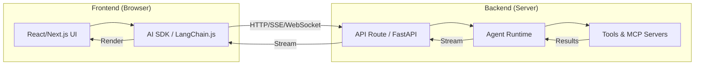

# Agent Web Integration Patterns

## Overview

Building an AI agent is only half the battle — the other half is **delivering that agent to users through a web interface**. Agent web integration patterns bridge the gap between backend agent logic (Python/Node.js) and frontend experiences (React, Next.js, Vue). This lesson covers the full stack: how to host agents on servers, stream their responses to browsers, and build rich, real-time UIs that show thinking indicators, tool execution progress, and error recovery.

Unlike simple chatbot UIs that display text responses, agent interfaces must handle **multi-step tool calls**, **streaming thought processes**, **real-time status updates**, and **human-in-the-loop interactions** — all while maintaining a responsive, intuitive user experience.

---

## Why This Matters

- **Agents are backend-heavy** — but users interact through browsers and mobile apps
- **Streaming is essential** — agents take seconds to minutes; users need real-time feedback
- **Tool execution visibility** — users must see what the agent is doing (searching, coding, analyzing)
- **Framework ecosystem is rich** — Vercel AI SDK, LangChain.js, LangGraph.js all provide battle-tested patterns
- **Production readiness** — understanding SSE, WebSockets, and edge runtimes is critical for deployment

---

## What We'll Cover

This lesson explores agent web integration across **8 sub-lessons**:

| # | Lesson | Focus |
|---|--------|-------|
| 01 | [Server-Side Agent Hosting](./01-server-side-agent-hosting.md) | FastAPI, Express.js, WebSocket connections, Server-Sent Events |
| 02 | [Streaming Agents to Browser](./02-streaming-agents-to-browser.md) | Token-by-token streaming, thought/action streaming, progress updates |
| 03 | [LangChain.js Essentials](./03-langchainjs-essentials.md) | Browser & Node.js support, React/Vue integration, streaming UI |
| 04 | [LangGraph.js for Frontend](./04-langgraphjs-for-frontend.md) | Browser-compatible graphs, React state management, real-time updates |
| 05 | [Next.js Agent Integration](./05-nextjs-agent-integration.md) | API routes, server actions, edge runtime, streaming with RSC |
| 06 | [Vercel AI SDK Integration](./06-vercel-ai-sdk-integration.md) | useChat hook, tool calling UI, multi-step agents, generative UI |
| 07 | [Real-Time Agent Interfaces](./07-real-time-agent-interfaces.md) | WebSocket agents, voice integration, live collaboration, status indicators |
| 08 | [Agent UI/UX Patterns](./08-agent-ui-ux-patterns.md) | Thinking indicators, tool visualization, error handling UI, feedback loops |

---

## Prerequisites

Before starting this lesson, you should be comfortable with:

- **Agent fundamentals** — ReAct loop, tool calling, memory (Unit 11, Lessons 1–5)
- **JavaScript/TypeScript** — ES6+, async/await, Promises (Unit 1, Lessons 3, 5, 12)
- **HTTP & APIs** — REST, streaming, WebSockets, SSE (Unit 1, Lessons 6–7)
- **React basics** — Components, hooks, state management (helpful but not required)
- **Python web frameworks** — FastAPI basics (Unit 2, Lesson 8)
- **OpenAI Agents SDK** — Agent creation and tool integration (Unit 11, Lesson 11)

---

## Architecture Overview

The typical flow:

1. **User sends a message** through the frontend UI
2. **Frontend SDK** (AI SDK, LangChain.js) sends it to the backend API
3. **Backend agent** processes the request, calling tools as needed
4. **Agent streams responses** back through SSE or WebSockets
5. **Frontend renders** tokens, tool calls, and status updates in real-time

---

## Technology Landscape (2025–2026)

| Category | Technology | Best For |
|----------|-----------|----------|
| **Python Backend** | FastAPI + OpenAI Agents SDK | Production Python agents with streaming |
| **Node.js Backend** | Express.js / Next.js API Routes | JavaScript-native agent hosting |
| **Frontend SDK** | Vercel AI SDK 6 | React/Next.js chat and agent UIs |
| **JS Agent Framework** | LangChain.js / LangGraph.js | Complex stateful agent workflows in JS |
| **Full-Stack Framework** | Next.js App Router | End-to-end agent applications |
| **Real-Time** | WebSockets / SSE | Live agent communication |
| **Edge Runtime** | Vercel Edge / Cloudflare Workers | Low-latency global agent deployment |

---

## Key Concepts at a Glance

| Concept | What It Is | Why It Matters |
|---------|-----------|----------------|
| **SSE (Server-Sent Events)** | One-way server-to-client streaming over HTTP | Simple streaming without WebSocket complexity |
| **WebSockets** | Full-duplex bidirectional communication | Real-time agent interactions, voice agents |
| **`useChat` hook** | AI SDK React hook for chat interfaces | Handles message state, streaming, tool calls automatically |
| **`ToolLoopAgent`** | AI SDK 6 agent class | Encapsulates agent config, loop control, and tools |
| **Streaming UI** | Progressive rendering of agent output | Users see results as they're generated |
| **Generative UI** | Dynamic React components from agent responses | Rich, interactive tool result displays |
| **Edge Runtime** | Serverless execution at CDN edge nodes | Lower latency for agent API routes |

---

**Next:** [Server-Side Agent Hosting](./01-server-side-agent-hosting.md)

---

## Further Reading

- [Vercel AI SDK Documentation](https://ai-sdk.dev/docs/introduction) - Complete AI SDK reference
- [LangChain.js Documentation](https://docs.langchain.com/oss/javascript/langchain/overview) - JavaScript agent framework
- [LangGraph.js Documentation](https://docs.langchain.com/oss/javascript/langgraph/overview) - Stateful JS agent orchestration
- [FastAPI WebSockets](https://fastapi.tiangolo.com/advanced/websockets/) - Real-time Python server
- [FastAPI StreamingResponse](https://fastapi.tiangolo.com/advanced/custom-response/#streamingresponse) - SSE and streaming in FastAPI
- [Next.js Route Handlers](https://nextjs.org/docs/app/building-your-application/routing/route-handlers) - API routes in App Router

<!--
Sources Consulted:
- Vercel AI SDK 6 docs: https://ai-sdk.dev/docs/introduction
- AI SDK Chatbot Tool Usage: https://ai-sdk.dev/docs/ai-sdk-ui/chatbot-tool-usage
- AI SDK Building Agents: https://ai-sdk.dev/docs/agents/building-agents
- AI SDK Agents Overview: https://ai-sdk.dev/docs/agents/overview
- LangChain.js Overview: https://docs.langchain.com/oss/javascript/langchain/overview
- LangGraph.js Overview: https://docs.langchain.com/oss/javascript/langgraph/overview
- FastAPI WebSockets: https://fastapi.tiangolo.com/advanced/websockets/
- FastAPI StreamingResponse: https://fastapi.tiangolo.com/advanced/custom-response/#streamingresponse
-->
