# Server-Side Agent Hosting

## Introduction

AI agents need a home on the server — a place where they can receive requests, execute reasoning loops, call tools, and stream results back to clients. Whether we're building with Python (FastAPI) or JavaScript (Express.js, Node.js), the server is where agent logic lives, where API keys are secured, and where compute-intensive operations run.

This lesson covers the foundational patterns for hosting agents on web servers, including REST endpoints, streaming responses via Server-Sent Events (SSE), and real-time bidirectional communication via WebSockets. We'll focus on practical, production-ready patterns that work with modern agent frameworks.

### What we'll cover

- Hosting Python agents with FastAPI
- Hosting Node.js agents with Express.js
- Server-Sent Events (SSE) for one-way streaming
- WebSocket connections for bidirectional communication
- Choosing the right transport for your agent

### Prerequisites

- Python async/await (Unit 2, Lesson 9)
- HTTP fundamentals (Unit 1, Lesson 6)
- WebSocket basics (Unit 1, Lesson 7)
- Agent fundamentals (Unit 11, Lessons 1–3)

---

## FastAPI for Python agents

FastAPI is the most popular choice for hosting Python-based AI agents. Its native async support, automatic OpenAPI documentation, and built-in streaming capabilities make it ideal for agent backends.

### Basic agent endpoint

We start with the simplest pattern — a synchronous endpoint that receives a message, runs the agent, and returns the complete result:

```python
from fastapi import FastAPI
from fastapi.middleware.cors import CORSMiddleware
from pydantic import BaseModel
from openai import OpenAI

app = FastAPI(title="Agent API")

# Enable CORS for frontend access
app.add_middleware(
    CORSMiddleware,
    allow_origins=["http://localhost:3000"],
    allow_methods=["*"],
    allow_headers=["*"],
)

client = OpenAI()


class ChatRequest(BaseModel):
    message: str
    conversation_id: str | None = None


class ChatResponse(BaseModel):
    reply: str
    conversation_id: str


@app.post("/api/chat", response_model=ChatResponse)
async def chat(request: ChatRequest):
    """Simple non-streaming agent endpoint."""
    response = client.chat.completions.create(
        model="gpt-4o",
        messages=[
            {"role": "system", "content": "You are a helpful assistant."},
            {"role": "user", "content": request.message},
        ],
    )
    
    return ChatResponse(
        reply=response.choices[0].message.content,
        conversation_id=request.conversation_id or "new-session",
    )
```

**Output (curl test):**
```json
{
  "reply": "Hello! How can I help you today?",
  "conversation_id": "new-session"
}
```

> **Note:** This synchronous pattern works for quick responses, but agents that call tools or reason over multiple steps need streaming to avoid timeouts and keep users informed.

### Streaming with SSE (Server-Sent Events)

SSE is the preferred transport for agent streaming. It's simpler than WebSockets, works over standard HTTP, and is natively supported by browsers via the `EventSource` API.

```python
import json
import asyncio
from fastapi import FastAPI
from fastapi.responses import StreamingResponse
from pydantic import BaseModel
from openai import AsyncOpenAI

app = FastAPI()
client = AsyncOpenAI()


class ChatRequest(BaseModel):
    message: str
    session_id: str | None = None


async def agent_stream(message: str):
    """Generator that yields SSE-formatted events."""
    
    # Event 1: Agent is thinking
    yield f"data: {json.dumps({'type': 'status', 'content': 'Thinking...'})}\n\n"
    
    # Event 2: Stream the LLM response token by token
    stream = await client.chat.completions.create(
        model="gpt-4o",
        messages=[
            {"role": "system", "content": "You are a helpful AI assistant."},
            {"role": "user", "content": message},
        ],
        stream=True,
    )
    
    async for chunk in stream:
        if chunk.choices[0].delta.content:
            token = chunk.choices[0].delta.content
            yield f"data: {json.dumps({'type': 'token', 'content': token})}\n\n"
    
    # Event 3: Signal completion
    yield f"data: {json.dumps({'type': 'done', 'content': ''})}\n\n"


@app.post("/api/chat/stream")
async def chat_stream(request: ChatRequest):
    """SSE streaming endpoint for agent responses."""
    return StreamingResponse(
        agent_stream(request.message),
        media_type="text/event-stream",
        headers={
            "Cache-Control": "no-cache",
            "Connection": "keep-alive",
            "X-Accel-Buffering": "no",  # Disable nginx buffering
        },
    )
```

**SSE output (raw):**
```
data: {"type": "status", "content": "Thinking..."}

data: {"type": "token", "content": "Hello"}

data: {"type": "token", "content": "!"}

data: {"type": "token", "content": " How"}

data: {"type": "done", "content": ""}
```

> **Important:** Each SSE message must be prefixed with `data: ` and followed by two newlines (`\n\n`). The `X-Accel-Buffering: no` header prevents reverse proxies like nginx from buffering the stream.

### Streaming agent with tool calls

Real agents call tools during their execution loop. We stream each step — thinking, tool invocation, tool result, and final response:

```python
import json
import asyncio
from fastapi import FastAPI
from fastapi.responses import StreamingResponse
from pydantic import BaseModel

app = FastAPI()


# Simulated tool functions
async def search_web(query: str) -> str:
    await asyncio.sleep(1)  # Simulate API call
    return f"Found 3 results for '{query}': ..."


async def get_weather(city: str) -> str:
    await asyncio.sleep(0.5)
    return f"Weather in {city}: 72°F, sunny"


TOOLS = {
    "search_web": search_web,
    "get_weather": get_weather,
}


class AgentRequest(BaseModel):
    message: str


async def agent_with_tools_stream(message: str):
    """Stream agent execution including tool calls."""
    
    # Step 1: Agent decides to use a tool
    yield f"data: {json.dumps({
        'type': 'thinking',
        'content': 'Analyzing your request...'
    })}\n\n"
    
    await asyncio.sleep(0.5)
    
    # Step 2: Tool invocation
    yield f"data: {json.dumps({
        'type': 'tool_call',
        'tool': 'search_web',
        'input': {'query': message},
        'status': 'running'
    })}\n\n"
    
    # Execute the tool
    result = await search_web(message)
    
    # Step 3: Tool result
    yield f"data: {json.dumps({
        'type': 'tool_result',
        'tool': 'search_web',
        'output': result,
        'status': 'complete'
    })}\n\n"
    
    # Step 4: Final response tokens
    response = f"Based on my research about '{message}', here's what I found..."
    for word in response.split():
        yield f"data: {json.dumps({
            'type': 'token',
            'content': word + ' '
        })}\n\n"
        await asyncio.sleep(0.05)
    
    yield f"data: {json.dumps({'type': 'done'})}\n\n"


@app.post("/api/agent/stream")
async def agent_stream_endpoint(request: AgentRequest):
    return StreamingResponse(
        agent_with_tools_stream(request.message),
        media_type="text/event-stream",
    )
```

**SSE output (raw):**
```
data: {"type": "thinking", "content": "Analyzing your request..."}

data: {"type": "tool_call", "tool": "search_web", "input": {"query": "AI trends"}, "status": "running"}

data: {"type": "tool_result", "tool": "search_web", "output": "Found 3 results for 'AI trends': ...", "status": "complete"}

data: {"type": "token", "content": "Based "}

data: {"type": "token", "content": "on "}

data: {"type": "done"}
```

---

## Express.js for Node.js agents

If your tech stack is JavaScript/TypeScript, Express.js provides a straightforward way to host agents. The patterns mirror FastAPI but use Node.js streams.

### Basic streaming endpoint

```javascript
import express from 'express';
import cors from 'cors';
import OpenAI from 'openai';

const app = express();
app.use(cors());
app.use(express.json());

const openai = new OpenAI();

app.post('/api/chat/stream', async (req, res) => {
  const { message } = req.body;

  // Set SSE headers
  res.setHeader('Content-Type', 'text/event-stream');
  res.setHeader('Cache-Control', 'no-cache');
  res.setHeader('Connection', 'keep-alive');

  // Status event
  res.write(`data: ${JSON.stringify({ type: 'status', content: 'Thinking...' })}\n\n`);

  // Stream from OpenAI
  const stream = await openai.chat.completions.create({
    model: 'gpt-4o',
    messages: [
      { role: 'system', content: 'You are a helpful assistant.' },
      { role: 'user', content: message },
    ],
    stream: true,
  });

  for await (const chunk of stream) {
    const content = chunk.choices[0]?.delta?.content;
    if (content) {
      res.write(`data: ${JSON.stringify({ type: 'token', content })}\n\n`);
    }
  }

  // Done event
  res.write(`data: ${JSON.stringify({ type: 'done' })}\n\n`);
  res.end();
});

app.listen(3001, () => {
  console.log('Agent server running on http://localhost:3001');
});
```

**Output:**
```
Server: Agent server running on http://localhost:3001
```

### Express with tool-calling agent

```javascript
import express from 'express';
import OpenAI from 'openai';

const app = express();
app.use(express.json());

const openai = new OpenAI();

// Define tools
const tools = [
  {
    type: 'function',
    function: {
      name: 'get_stock_price',
      description: 'Get the current stock price for a ticker symbol',
      parameters: {
        type: 'object',
        properties: {
          ticker: { type: 'string', description: 'Stock ticker symbol (e.g., AAPL)' },
        },
        required: ['ticker'],
      },
    },
  },
];

// Tool implementations
const toolHandlers = {
  get_stock_price: async ({ ticker }) => {
    // Simulated stock lookup
    const prices = { AAPL: 189.25, GOOGL: 141.80, MSFT: 378.50 };
    return JSON.stringify({
      ticker,
      price: prices[ticker] || 0,
      currency: 'USD',
    });
  },
};

app.post('/api/agent/stream', async (req, res) => {
  const { messages } = req.body;

  res.setHeader('Content-Type', 'text/event-stream');
  res.setHeader('Cache-Control', 'no-cache');
  res.setHeader('Connection', 'keep-alive');

  let currentMessages = [...messages];
  let continueLoop = true;

  while (continueLoop) {
    const response = await openai.chat.completions.create({
      model: 'gpt-4o',
      messages: currentMessages,
      tools,
      stream: true,
    });

    let toolCalls = [];
    let assistantContent = '';

    for await (const chunk of response) {
      const delta = chunk.choices[0]?.delta;
      const finishReason = chunk.choices[0]?.finish_reason;

      // Stream text content
      if (delta?.content) {
        assistantContent += delta.content;
        res.write(`data: ${JSON.stringify({
          type: 'token',
          content: delta.content,
        })}\n\n`);
      }

      // Accumulate tool calls
      if (delta?.tool_calls) {
        for (const tc of delta.tool_calls) {
          if (tc.index !== undefined) {
            if (!toolCalls[tc.index]) {
              toolCalls[tc.index] = {
                id: tc.id || '',
                function: { name: '', arguments: '' },
              };
            }
            if (tc.id) toolCalls[tc.index].id = tc.id;
            if (tc.function?.name) toolCalls[tc.index].function.name += tc.function.name;
            if (tc.function?.arguments) toolCalls[tc.index].function.arguments += tc.function.arguments;
          }
        }
      }

      if (finishReason === 'stop') {
        continueLoop = false;
      }
    }

    // Process tool calls
    if (toolCalls.length > 0) {
      currentMessages.push({
        role: 'assistant',
        tool_calls: toolCalls.map(tc => ({
          id: tc.id,
          type: 'function',
          function: tc.function,
        })),
      });

      for (const tc of toolCalls) {
        const args = JSON.parse(tc.function.arguments);

        // Notify client about tool execution
        res.write(`data: ${JSON.stringify({
          type: 'tool_call',
          tool: tc.function.name,
          input: args,
          status: 'running',
        })}\n\n`);

        // Execute the tool
        const result = await toolHandlers[tc.function.name](args);

        // Send tool result
        res.write(`data: ${JSON.stringify({
          type: 'tool_result',
          tool: tc.function.name,
          output: JSON.parse(result),
          status: 'complete',
        })}\n\n`);

        currentMessages.push({
          role: 'tool',
          tool_call_id: tc.id,
          content: result,
        });
      }
    }
  }

  res.write(`data: ${JSON.stringify({ type: 'done' })}\n\n`);
  res.end();
});

app.listen(3001);
```

---

## WebSocket connections for agents

WebSockets provide full-duplex communication — both client and server can send messages at any time. This is essential for agents that need to:

- **Ask clarifying questions** during execution
- **Support cancellation** mid-stream
- **Handle voice input/output** in real-time
- **Maintain long-lived sessions** with ongoing state

### FastAPI WebSocket agent

```python
import json
import asyncio
from fastapi import FastAPI, WebSocket, WebSocketDisconnect
from openai import AsyncOpenAI

app = FastAPI()
client = AsyncOpenAI()


class AgentSession:
    """Manages state for a WebSocket agent session."""
    
    def __init__(self, websocket: WebSocket):
        self.websocket = websocket
        self.messages: list[dict] = [
            {"role": "system", "content": "You are a helpful AI assistant."}
        ]
        self.is_running = False
    
    async def send_event(self, event_type: str, data: dict):
        """Send a typed event to the client."""
        await self.websocket.send_json({
            "type": event_type,
            **data,
        })
    
    async def run_agent(self, user_message: str):
        """Execute the agent loop and stream results."""
        self.is_running = True
        self.messages.append({"role": "user", "content": user_message})
        
        await self.send_event("status", {"content": "Thinking..."})
        
        try:
            stream = await client.chat.completions.create(
                model="gpt-4o",
                messages=self.messages,
                stream=True,
            )
            
            full_response = ""
            async for chunk in stream:
                if not self.is_running:
                    break  # Support cancellation
                    
                content = chunk.choices[0].delta.content
                if content:
                    full_response += content
                    await self.send_event("token", {"content": content})
            
            self.messages.append({"role": "assistant", "content": full_response})
            await self.send_event("done", {"content": full_response})
            
        except Exception as e:
            await self.send_event("error", {"content": str(e)})
        finally:
            self.is_running = False
    
    async def cancel(self):
        """Cancel the current agent execution."""
        self.is_running = False
        await self.send_event("cancelled", {"content": "Agent execution cancelled"})


@app.websocket("/ws/agent")
async def agent_websocket(websocket: WebSocket):
    await websocket.accept()
    session = AgentSession(websocket)
    
    try:
        while True:
            data = await websocket.receive_json()
            
            match data.get("type"):
                case "message":
                    await session.run_agent(data["content"])
                case "cancel":
                    await session.cancel()
                case _:
                    await session.send_event("error", {
                        "content": f"Unknown event type: {data.get('type')}"
                    })
    except WebSocketDisconnect:
        print("Client disconnected")
```

### Client-side WebSocket connection

```javascript
class AgentWebSocket {
  constructor(url) {
    this.ws = new WebSocket(url);
    this.handlers = {};
    
    this.ws.onmessage = (event) => {
      const data = JSON.parse(event.data);
      const handler = this.handlers[data.type];
      if (handler) handler(data);
    };
    
    this.ws.onerror = (error) => {
      console.error('WebSocket error:', error);
    };
  }
  
  on(eventType, handler) {
    this.handlers[eventType] = handler;
    return this; // Enable chaining
  }
  
  send(message) {
    this.ws.send(JSON.stringify({
      type: 'message',
      content: message,
    }));
  }
  
  cancel() {
    this.ws.send(JSON.stringify({ type: 'cancel' }));
  }
  
  close() {
    this.ws.close();
  }
}

// Usage
const agent = new AgentWebSocket('ws://localhost:8000/ws/agent');

agent
  .on('status', (data) => console.log('Status:', data.content))
  .on('token', (data) => process.stdout.write(data.content))
  .on('tool_call', (data) => console.log(`\n🔧 Calling ${data.tool}...`))
  .on('done', (data) => console.log('\n✅ Complete'))
  .on('error', (data) => console.error('❌ Error:', data.content));

agent.send('What is the weather in Tokyo?');
```

**Output:**
```
Status: Thinking...
The weather in Tokyo today is...
✅ Complete
```

---

## SSE vs WebSocket: choosing the right transport

| Feature | SSE | WebSocket |
|---------|-----|-----------|
| **Direction** | Server → Client (one-way) | Bidirectional |
| **Protocol** | HTTP | WS (upgrade from HTTP) |
| **Reconnection** | Built-in auto-reconnect | Manual reconnection needed |
| **Browser support** | `EventSource` API | `WebSocket` API |
| **Proxy/CDN friendly** | ✅ Works through HTTP proxies | ⚠️ May need special config |
| **Cancellation** | Close the HTTP request | Send cancel message |
| **Binary data** | ❌ Text only | ✅ Text and binary |
| **Connection limit** | ~6 per domain (HTTP/1.1) | No limit per domain |
| **Best for** | Token streaming, agent output | Voice agents, interactive sessions |

### Decision guide

```mermaid
flowchart TD
    A[Agent Communication Need] --> B{Bidirectional?}
    B -->|No - Server to Client only| C{Need binary data?}
    B -->|Yes - Both directions| D[Use WebSocket]
    C -->|No| E[Use SSE ✅ Recommended]
    C -->|Yes| D
    D --> F{Long-lived session?}
    F -->|Yes| G[WebSocket with heartbeat]
    F -->|No| H[Consider SSE instead]
```



> **🤖 AI Context:** For most agent UIs (chatbots, assistants, code generators), **SSE is the recommended choice**. It's simpler, works through CDNs and proxies, and handles the primary use case — streaming agent output to the browser. Use WebSockets only when you need true bidirectional communication (voice agents, real-time collaboration, user interrupts during agent execution).

---

## Best practices

| Practice | Why It Matters |
|----------|----------------|
| Always set `Cache-Control: no-cache` on SSE responses | Prevents intermediaries from buffering the stream |
| Use structured event types (`token`, `tool_call`, `done`) | Enables rich UI rendering on the client side |
| Include a `done` or `[DONE]` terminal event | Client knows when to stop listening |
| Add heartbeat events for long-running agents | Prevents connection timeouts (send `data: {"type": "heartbeat"}\n\n` every 15s) |
| Implement CORS properly | Frontend and backend usually run on different ports/domains |
| Use `async` endpoints in FastAPI | Avoids blocking the event loop during streaming |
| Validate input with Pydantic models | Prevents malformed requests from crashing the agent |

---

## Common pitfalls

| ❌ Mistake | ✅ Solution |
|-----------|-------------|
| Forgetting `\n\n` after SSE data lines | Each SSE event must end with double newline |
| Not disabling nginx/proxy buffering | Add `X-Accel-Buffering: no` header |
| Using sync functions in FastAPI | Use `async def` and `AsyncOpenAI` for non-blocking I/O |
| No CORS configuration | Frontend can't connect; add `CORSMiddleware` |
| Missing error handling in streams | Wrap generator logic in try/except, send error events |
| Not handling WebSocket disconnects | Use try/except `WebSocketDisconnect` in FastAPI |
| Hardcoding localhost URLs | Use environment variables for server URLs |

---

## Hands-on exercise

### Your task

Build a FastAPI server that hosts an AI agent with SSE streaming. The agent should accept a user message, stream its "thinking" process, simulate calling a tool, and stream the final response token by token.

### Requirements

1. Create a `POST /api/agent/stream` endpoint that returns SSE
2. Stream at least 4 event types: `thinking`, `tool_call`, `tool_result`, `token`, `done`
3. Simulate a tool call (e.g., `calculate` or `lookup`) with a 1-second delay
4. Stream the final response word by word with 50ms delays between tokens
5. Add proper CORS headers for frontend access

### Expected result

When you `POST` to the endpoint, you should see a stream of SSE events showing the agent's thought process, tool execution, and final answer arriving token by token.

<details>
<summary>💡 Hints (click to expand)</summary>

- Use `StreamingResponse` from `fastapi.responses`
- Set `media_type="text/event-stream"`
- Format each event as `data: {json}\n\n`
- Use `asyncio.sleep()` to simulate delays
- Remember to add `CORSMiddleware`

</details>

<details>
<summary>✅ Solution (click to expand)</summary>

```python
import json
import asyncio
from fastapi import FastAPI
from fastapi.responses import StreamingResponse
from fastapi.middleware.cors import CORSMiddleware
from pydantic import BaseModel

app = FastAPI()

app.add_middleware(
    CORSMiddleware,
    allow_origins=["*"],
    allow_methods=["*"],
    allow_headers=["*"],
)


class AgentRequest(BaseModel):
    message: str


async def agent_stream(message: str):
    # Thinking
    yield f"data: {json.dumps({'type': 'thinking', 'content': 'Analyzing your question...'})}\n\n"
    await asyncio.sleep(0.5)
    
    # Tool call
    yield f"data: {json.dumps({'type': 'tool_call', 'tool': 'knowledge_search', 'input': {'query': message}, 'status': 'running'})}\n\n"
    await asyncio.sleep(1.0)
    
    # Tool result
    yield f"data: {json.dumps({'type': 'tool_result', 'tool': 'knowledge_search', 'output': 'Found relevant information...', 'status': 'complete'})}\n\n"
    await asyncio.sleep(0.3)
    
    # Final response tokens
    response = f"Based on my research, here is the answer to your question about {message}. The key points are: first, this is an important topic. Second, there are multiple perspectives to consider."
    for word in response.split():
        yield f"data: {json.dumps({'type': 'token', 'content': word + ' '})}\n\n"
        await asyncio.sleep(0.05)
    
    yield f"data: {json.dumps({'type': 'done'})}\n\n"


@app.post("/api/agent/stream")
async def stream_agent(request: AgentRequest):
    return StreamingResponse(
        agent_stream(request.message),
        media_type="text/event-stream",
        headers={
            "Cache-Control": "no-cache",
            "Connection": "keep-alive",
            "X-Accel-Buffering": "no",
        },
    )
```

Test with curl:
```bash
curl -N -X POST http://localhost:8000/api/agent/stream \
  -H "Content-Type: application/json" \
  -d '{"message": "What is machine learning?"}'
```

</details>

### Bonus challenges

- [ ] Add WebSocket support alongside the SSE endpoint
- [ ] Implement a heartbeat mechanism that sends a ping every 15 seconds
- [ ] Add authentication middleware to protect the agent endpoint

---

## Summary

✅ **FastAPI** is the go-to choice for Python agent backends — use `StreamingResponse` with async generators for SSE  
✅ **Express.js** provides equivalent patterns for Node.js — set SSE headers and use `res.write()` for streaming  
✅ **SSE is recommended** for most agent UIs — simpler than WebSockets, works through proxies, handles one-way streaming  
✅ **WebSockets** are needed for bidirectional communication — voice agents, cancellation, interactive sessions  
✅ **Structured events** (`thinking`, `tool_call`, `token`, `done`) enable rich frontend rendering

**Next:** [Streaming Agents to Browser](./02-streaming-agents-to-browser.md)

---

## Further Reading

- [FastAPI StreamingResponse](https://fastapi.tiangolo.com/advanced/custom-response/#streamingresponse) - Official streaming docs
- [FastAPI WebSockets](https://fastapi.tiangolo.com/advanced/websockets/) - WebSocket support in FastAPI
- [MDN Server-Sent Events](https://developer.mozilla.org/en-US/docs/Web/API/Server-sent_events) - Browser SSE API reference
- [MDN WebSocket API](https://developer.mozilla.org/en-US/docs/Web/API/WebSocket) - Browser WebSocket reference
- [OpenAI Streaming Guide](https://platform.openai.com/docs/guides/streaming) - OpenAI's streaming best practices

<!--
Sources Consulted:
- FastAPI StreamingResponse: https://fastapi.tiangolo.com/advanced/custom-response/#streamingresponse
- FastAPI WebSockets: https://fastapi.tiangolo.com/advanced/websockets/
- OpenAI API streaming: https://platform.openai.com/docs/api-reference/streaming
- MDN Server-Sent Events: https://developer.mozilla.org/en-US/docs/Web/API/Server-sent_events
- MDN WebSocket API: https://developer.mozilla.org/en-US/docs/Web/API/WebSocket
-->
