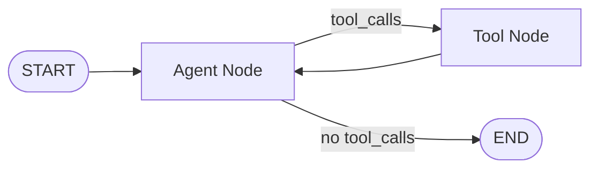
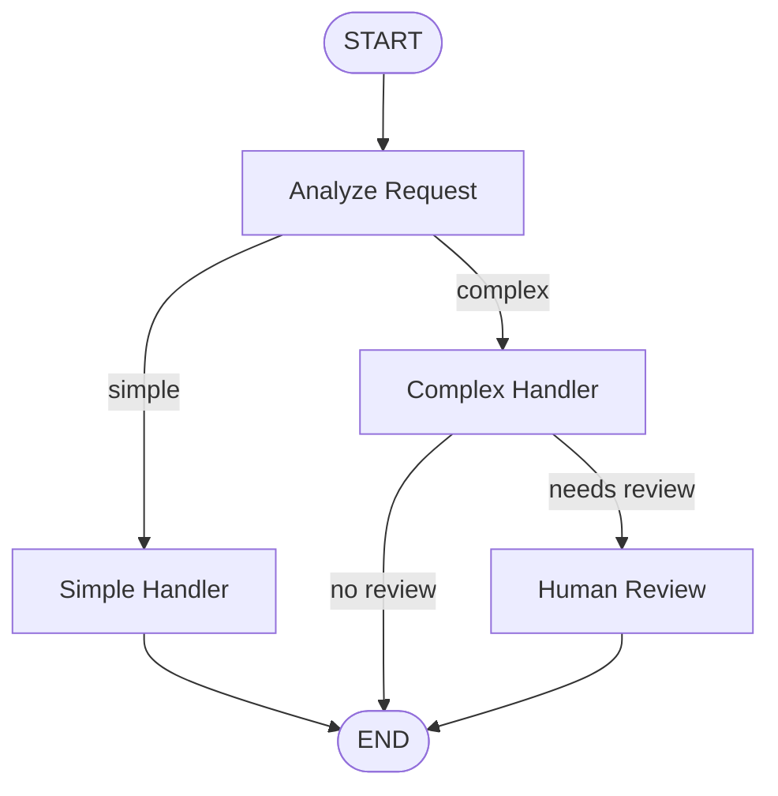

# LangGraph.js for Frontend

## Introduction

LangGraph.js is the JavaScript counterpart to LangGraph (Python) — a low-level orchestration framework for building **stateful, graph-based agent workflows**. While `createAgent` from LangChain.js handles simple tool-calling loops, LangGraph.js gives you full control over **cycles, branching, state persistence, and human-in-the-loop** patterns.

For frontend integration, LangGraph.js enables building complex agent workflows that run on Node.js servers and stream state updates to React or other frontend frameworks in real-time. This lesson covers how to define graphs, manage state, integrate with React, and deploy to edge runtimes.

### What we'll cover

- LangGraph.js core concepts: nodes, edges, state
- Building graph-based agent workflows
- State management and React integration
- Real-time graph updates with streaming
- Edge runtime compatibility
- LangGraph Platform for production deployment

### Prerequisites

- LangChain.js basics (Lesson 17-03)
- JavaScript async/await (Unit 1, Lesson 5)
- React state management (helpful)
- Graph concepts (nodes, edges) — helpful but not required

---

## Core concepts

LangGraph.js models agent workflows as **directed graphs** where:

- **Nodes** are functions that process and transform state
- **Edges** connect nodes and determine execution flow
- **State** is a typed schema that flows through the graph
- **Conditional edges** enable dynamic routing based on state



### Installing LangGraph.js

```bash
npm install @langchain/langgraph @langchain/core @langchain/anthropic
```

---

## Building a graph-based agent

Here's a complete agent built as a LangGraph state graph:

```typescript
import {
  StateSchema,
  MessagesValue,
  StateGraph,
  START,
  END,
} from '@langchain/langgraph';
import { ChatAnthropic } from '@langchain/anthropic';
import { tool } from '@langchain/core/tools';
import { ToolNode } from '@langchain/langgraph/prebuilt';
import * as z from 'zod';

// 1. Define the state schema
const AgentState = new StateSchema({
  messages: MessagesValue,
});

// 2. Create the model
const model = new ChatAnthropic({
  modelName: 'claude-sonnet-4-5-20250929',
});

// 3. Define tools
const getWeather = tool(
  async ({ city }) => {
    const temps: Record<string, number> = {
      'Tokyo': 72, 'London': 58, 'New York': 65,
    };
    return `${city}: ${temps[city] || 60}°F`;
  },
  {
    name: 'get_weather',
    description: 'Get weather for a city',
    schema: z.object({ city: z.string() }),
  }
);

const tools = [getWeather];
const toolNode = new ToolNode(tools);

// Bind tools to model
const modelWithTools = model.bindTools(tools);

// 4. Define graph nodes
async function agentNode(state: typeof AgentState.Type) {
  const response = await modelWithTools.invoke(state.messages);
  return { messages: [response] };
}

// 5. Define conditional routing
function shouldContinue(state: typeof AgentState.Type) {
  const lastMessage = state.messages[state.messages.length - 1];
  if (lastMessage.tool_calls?.length > 0) {
    return 'tools';
  }
  return END;
}

// 6. Build the graph
const graph = new StateGraph(AgentState)
  .addNode('agent', agentNode)
  .addNode('tools', toolNode)
  .addEdge(START, 'agent')
  .addConditionalEdges('agent', shouldContinue, {
    tools: 'tools',
    [END]: END,
  })
  .addEdge('tools', 'agent')
  .compile();

// 7. Run the graph
const result = await graph.invoke({
  messages: [{ role: 'user', content: 'What is the weather in Tokyo?' }],
});

const lastMsg = result.messages[result.messages.length - 1];
console.log(lastMsg.content);
```

**Output:**
```
The weather in Tokyo is currently 72°F.
```

---

## Streaming graph execution

LangGraph.js supports fine-grained streaming of graph execution. We can stream both node updates and individual tokens:

### Stream mode: updates

```typescript
// Stream node-level updates
const stream = await graph.stream(
  { messages: [{ role: 'user', content: 'Weather in London?' }] },
  { streamMode: 'updates' }
);

for await (const update of stream) {
  // Each update shows which node ran and its output
  for (const [nodeName, nodeOutput] of Object.entries(update)) {
    console.log(`[${nodeName}]`, JSON.stringify(nodeOutput, null, 2));
  }
}
```

**Output:**
```
[agent] { "messages": [{"role": "assistant", "tool_calls": [{"name": "get_weather", ...}]}] }
[tools] { "messages": [{"role": "tool", "content": "London: 58°F"}] }
[agent] { "messages": [{"role": "assistant", "content": "The weather in London is 58°F."}] }
```

### Stream mode: messages

For token-by-token streaming of the LLM output:

```typescript
const stream = await graph.stream(
  { messages: [{ role: 'user', content: 'Explain quantum computing briefly' }] },
  { streamMode: 'messages' }
);

for await (const [message, metadata] of stream) {
  if (message.content) {
    process.stdout.write(message.content);
  }
}
```

### SSE endpoint with LangGraph.js streaming

```typescript
import express from 'express';

const app = express();
app.use(express.json());

app.post('/api/agent/stream', async (req, res) => {
  const { messages } = req.body;

  res.setHeader('Content-Type', 'text/event-stream');
  res.setHeader('Cache-Control', 'no-cache');
  res.setHeader('Connection', 'keep-alive');

  try {
    // Stream node updates for tool call visibility
    const stream = await graph.stream(
      { messages },
      { streamMode: 'updates' }
    );

    for await (const update of stream) {
      for (const [nodeName, nodeOutput] of Object.entries(update)) {
        const nodeData = nodeOutput as any;

        if (nodeName === 'agent') {
          const lastMsg = nodeData.messages[nodeData.messages.length - 1];

          if (lastMsg.tool_calls?.length) {
            // Agent decided to call tools
            for (const tc of lastMsg.tool_calls) {
              res.write(`data: ${JSON.stringify({
                type: 'tool_call',
                node: nodeName,
                tool: tc.name,
                input: tc.args,
              })}\n\n`);
            }
          } else if (lastMsg.content) {
            // Agent generated final response
            res.write(`data: ${JSON.stringify({
              type: 'response',
              node: nodeName,
              content: lastMsg.content,
            })}\n\n`);
          }
        }

        if (nodeName === 'tools') {
          // Tool execution results
          for (const msg of nodeData.messages) {
            res.write(`data: ${JSON.stringify({
              type: 'tool_result',
              node: nodeName,
              content: msg.content,
            })}\n\n`);
          }
        }
      }
    }

    res.write(`data: ${JSON.stringify({ type: 'done' })}\n\n`);
  } catch (error: any) {
    res.write(`data: ${JSON.stringify({
      type: 'error',
      content: error.message,
    })}\n\n`);
  }

  res.end();
});

app.listen(3001);
```

---

## State management in React

LangGraph's typed state schema maps naturally to React state. Here's how to visualize graph execution in a React component:

```tsx
import { useState, useCallback, useRef } from 'react';

interface GraphStep {
  node: string;
  type: 'tool_call' | 'tool_result' | 'response' | 'error';
  content?: string;
  tool?: string;
  input?: Record<string, unknown>;
  timestamp: number;
}

interface GraphExecution {
  steps: GraphStep[];
  finalResponse: string;
  isComplete: boolean;
}

function useLangGraphAgent(endpoint: string) {
  const [execution, setExecution] = useState<GraphExecution>({
    steps: [],
    finalResponse: '',
    isComplete: true,
  });
  const controllerRef = useRef<AbortController | null>(null);

  const run = useCallback(async (messages: Array<{ role: string; content: string }>) => {
    controllerRef.current = new AbortController();
    setExecution({ steps: [], finalResponse: '', isComplete: false });

    try {
      const response = await fetch(endpoint, {
        method: 'POST',
        headers: { 'Content-Type': 'application/json' },
        body: JSON.stringify({ messages }),
        signal: controllerRef.current.signal,
      });

      const reader = response.body!.getReader();
      const decoder = new TextDecoder();
      let buffer = '';

      while (true) {
        const { done, value } = await reader.read();
        if (done) break;

        buffer += decoder.decode(value, { stream: true });
        const events = buffer.split('\n\n');
        buffer = events.pop()!;

        for (const raw of events) {
          if (!raw.startsWith('data: ')) continue;
          const event = JSON.parse(raw.slice(6));

          setExecution(prev => {
            const step: GraphStep = {
              node: event.node || 'unknown',
              type: event.type,
              content: event.content,
              tool: event.tool,
              input: event.input,
              timestamp: Date.now(),
            };

            return {
              ...prev,
              steps: [...prev.steps, step],
              finalResponse: event.type === 'response'
                ? event.content
                : prev.finalResponse,
              isComplete: event.type === 'done',
            };
          });
        }
      }
    } catch (error) {
      if ((error as Error).name !== 'AbortError') {
        setExecution(prev => ({
          ...prev,
          isComplete: true,
          steps: [...prev.steps, {
            node: 'error',
            type: 'error',
            content: (error as Error).message,
            timestamp: Date.now(),
          }],
        }));
      }
    }
  }, [endpoint]);

  const cancel = useCallback(() => {
    controllerRef.current?.abort();
    setExecution(prev => ({ ...prev, isComplete: true }));
  }, []);

  return { execution, run, cancel };
}

// Graph visualization component
function GraphExecutionView({ execution }: { execution: GraphExecution }) {
  return (
    <div className="graph-execution">
      <div className="steps">
        {execution.steps.map((step, i) => (
          <div key={i} className={`step step-${step.type}`}>
            <div className="step-header">
              <span className="node-badge">{step.node}</span>
              <span className="step-type">
                {step.type === 'tool_call' && '🔧 Tool Call'}
                {step.type === 'tool_result' && '✅ Tool Result'}
                {step.type === 'response' && '💬 Response'}
                {step.type === 'error' && '❌ Error'}
              </span>
            </div>
            <div className="step-body">
              {step.tool && <code>{step.tool}({JSON.stringify(step.input)})</code>}
              {step.content && <p>{step.content}</p>}
            </div>
          </div>
        ))}
      </div>

      {!execution.isComplete && (
        <div className="running-indicator">
          <span className="pulse" /> Agent is running...
        </div>
      )}

      {execution.finalResponse && (
        <div className="final-response">
          <h4>Agent Response</h4>
          <p>{execution.finalResponse}</p>
        </div>
      )}
    </div>
  );
}
```

---

## Multi-step workflows with conditional edges

LangGraph.js shines when agents need complex routing logic:

```typescript
import { StateSchema, MessagesValue, StateGraph, START, END } from '@langchain/langgraph';

// Extended state with custom fields
const WorkflowState = new StateSchema({
  messages: MessagesValue,
  currentStep: { default: () => 'analyze' },
  analysisResult: { default: () => '' },
  needsHumanReview: { default: () => false },
});

// Node: Analyze the request
async function analyzeNode(state: typeof WorkflowState.Type) {
  // Determine complexity of the request
  const lastMsg = state.messages[state.messages.length - 1];
  const isComplex = lastMsg.content.length > 100;

  return {
    analysisResult: isComplex ? 'complex' : 'simple',
    currentStep: 'route',
  };
}

// Node: Handle simple requests
async function simpleHandler(state: typeof WorkflowState.Type) {
  return {
    messages: [{ role: 'assistant', content: 'Quick answer: ...' }],
    currentStep: 'done',
  };
}

// Node: Handle complex requests with tools
async function complexHandler(state: typeof WorkflowState.Type) {
  // Run multi-step reasoning with tools
  return {
    messages: [{ role: 'assistant', content: 'Detailed analysis: ...' }],
    needsHumanReview: true,
    currentStep: 'review',
  };
}

// Node: Human review checkpoint
async function humanReview(state: typeof WorkflowState.Type) {
  // In production, this would pause and wait for human input
  return { currentStep: 'done' };
}

// Routing function
function routeRequest(state: typeof WorkflowState.Type) {
  if (state.analysisResult === 'complex') return 'complex';
  return 'simple';
}

function afterComplex(state: typeof WorkflowState.Type) {
  if (state.needsHumanReview) return 'review';
  return END;
}

// Build the workflow graph
const workflow = new StateGraph(WorkflowState)
  .addNode('analyze', analyzeNode)
  .addNode('simple', simpleHandler)
  .addNode('complex', complexHandler)
  .addNode('review', humanReview)
  .addEdge(START, 'analyze')
  .addConditionalEdges('analyze', routeRequest, {
    simple: 'simple',
    complex: 'complex',
  })
  .addEdge('simple', END)
  .addConditionalEdges('complex', afterComplex, {
    review: 'review',
    [END]: END,
  })
  .addEdge('review', END)
  .compile();
```



---

## Edge runtime compatibility

LangGraph.js can run in edge runtimes (Vercel Edge, Cloudflare Workers) with some constraints:

| Feature | Node.js | Edge Runtime |
|---------|---------|-------------|
| Full graph execution | ✅ | ✅ |
| Model API calls | ✅ | ✅ |
| File system tools | ✅ | ❌ |
| Database connections | ✅ | ⚠️ HTTP-only |
| Execution time limit | None | 30s (Vercel) |
| Package size | No limit | ~1MB bundle |
| State persistence | File/DB | KV stores only |

```typescript
// Vercel Edge runtime example
// app/api/agent/route.ts
import { NextRequest } from 'next/server';

export const runtime = 'edge';

export async function POST(req: NextRequest) {
  const { messages } = await req.json();

  // Use a lightweight graph for edge
  const stream = await graph.stream(
    { messages },
    { streamMode: 'messages' }
  );

  const encoder = new TextEncoder();
  const readable = new ReadableStream({
    async start(controller) {
      for await (const [message] of stream) {
        if (message.content) {
          controller.enqueue(
            encoder.encode(`data: ${JSON.stringify({
              type: 'token',
              content: message.content,
            })}\n\n`)
          );
        }
      }
      controller.enqueue(
        encoder.encode(`data: ${JSON.stringify({ type: 'done' })}\n\n`)
      );
      controller.close();
    },
  });

  return new Response(readable, {
    headers: {
      'Content-Type': 'text/event-stream',
      'Cache-Control': 'no-cache',
    },
  });
}
```

> **Warning:** Edge runtimes have strict limits on execution time (typically 30 seconds). Complex agent workflows with multiple tool calls may exceed these limits. For production agents, use Node.js runtime or LangGraph Platform.

---

## LangGraph Platform

For production deployment, LangGraph Platform provides managed infrastructure:

| Feature | Self-Hosted | LangGraph Platform |
|---------|------------|-------------------|
| State persistence | You manage DB | Built-in |
| Long-running agents | You manage queues | Automatic |
| Human-in-the-loop | Custom implementation | First-class support |
| Observability | LangSmith integration | Built-in tracing |
| Scaling | You manage infra | Auto-scaling |
| Cost | Infrastructure costs | Usage-based pricing |

> **🤖 AI Context:** LangGraph Platform is particularly useful when agents need **durable execution** — the ability to pause mid-execution, survive server restarts, and resume from where they left off. This is critical for agents that wait on human approval or external events.

---

## Best practices

| Practice | Why It Matters |
|----------|----------------|
| Start with `createAgent`, graduate to LangGraph | Don't over-engineer simple agent use cases |
| Use typed state schemas | Catches state-related bugs at compile time |
| Stream `updates` for UI, `messages` for text | Different stream modes serve different frontend needs |
| Keep graph nodes focused | Each node should do one thing well |
| Use conditional edges for routing | Clearer than complex if/else inside nodes |
| Test graphs with mocked tool nodes | Isolate graph logic from external API calls |

---

## Common pitfalls

| ❌ Mistake | ✅ Solution |
|-----------|-------------|
| Creating infinite loops in graphs | Always have a terminal condition that reaches `END` |
| Putting all logic in one node | Break into focused nodes connected by edges |
| Ignoring state typing | Use `StateSchema` for compile-time safety |
| Running heavy graphs on edge runtime | Use Node.js runtime for complex agents |
| Not streaming graph updates to UI | Users can't see what the agent is doing internally |

---

## Hands-on exercise

### Your task

Build a LangGraph.js agent that routes between simple and complex request handlers based on the user's query, streams the execution steps to a web frontend, and shows which graph nodes are being executed.

### Requirements

1. Define a `StateGraph` with at least 3 nodes (analyze, simple, complex)
2. Use conditional edges for routing based on query analysis
3. Stream node execution updates as SSE events
4. Build a frontend that shows which nodes have been visited

### Expected result

A visual representation of the graph execution path, showing each node being activated in sequence, with the final response displayed at the end.

<details>
<summary>💡 Hints (click to expand)</summary>

- Use `streamMode: 'updates'` to get node-level events
- Each update is keyed by node name — use this for the visual timeline
- Add a `currentStep` field to your state schema for routing
- Use `addConditionalEdges` with a routing function

</details>

### Bonus challenges

- [ ] Add a human-in-the-loop checkpoint using LangGraph interrupts
- [ ] Implement state persistence so conversations survive server restarts
- [ ] Create a visual graph diagram that highlights active nodes during execution

---

## Summary

✅ **LangGraph.js** provides graph-based agent orchestration with full control over execution flow  
✅ Use **nodes** for processing steps and **conditional edges** for dynamic routing  
✅ **Stream modes** (`updates`, `messages`) enable different frontend rendering strategies  
✅ **Typed state schemas** catch bugs at compile time and flow naturally into React state  
✅ For production, consider **LangGraph Platform** for durable execution and auto-scaling

**Next:** [Next.js Agent Integration](./05-nextjs-agent-integration.md)

---

## Further Reading

- [LangGraph.js Documentation](https://docs.langchain.com/oss/javascript/langgraph/overview) - Official docs
- [LangGraph Tutorials](https://docs.langchain.com/oss/javascript/langgraph/overview) - Step-by-step guides
- [LangGraph Platform](https://www.langchain.com/langgraph-platform) - Production deployment
- [LangChain Academy](https://academy.langchain.com/) - Free LangGraph courses

<!--
Sources Consulted:
- LangGraph.js overview: https://docs.langchain.com/oss/javascript/langgraph/overview
- LangGraph core concepts: https://docs.langchain.com/oss/javascript/langgraph/overview
- LangChain.js overview: https://docs.langchain.com/oss/javascript/langchain/overview
-->
