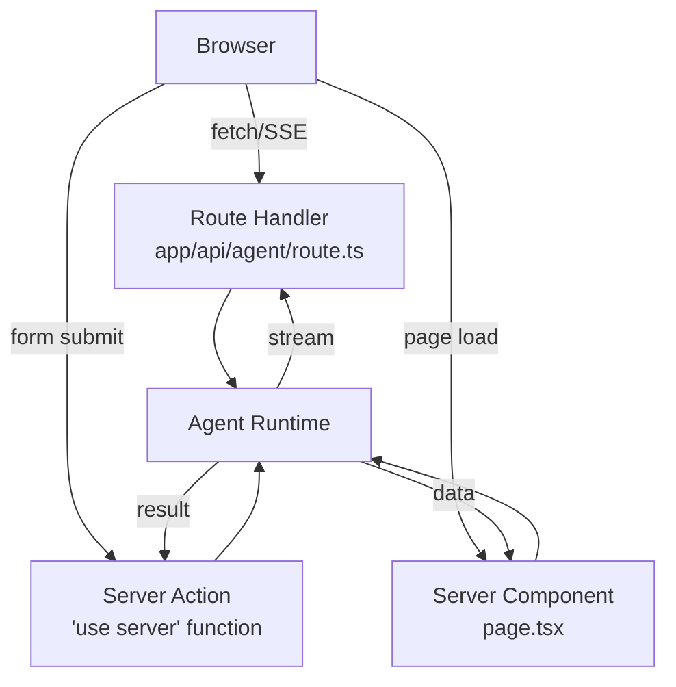

# Next.js Agent Integration

## Introduction

Next.js is the most popular React framework for production AI applications — and for good reason. Its **App Router** provides route handlers for API endpoints, **Server Components** for secure server-side rendering, **Server Actions** for direct server function calls, and **edge runtime** support for low-latency global deployment.

In this lesson, we build AI agents that run inside Next.js applications. We cover every integration pattern: route handlers for streaming, Server Actions for form-based interactions, React Server Components for agent-powered pages, and edge runtime deployment.

### What we'll cover

- Route handlers for agent API endpoints
- Streaming agent responses to the client
- Server Actions for agent interactions
- React Server Components with agent data
- Edge vs. Node.js runtime selection
- Project structure best practices

### Prerequisites

- Next.js App Router basics (pages, layouts, route handlers)
- React fundamentals (hooks, components, state)
- Server-side agent hosting (Lesson 17-01)
- Streaming agents to the browser (Lesson 17-02)

---

## Next.js architecture for agents

Before writing code, we need to understand where agents fit in the Next.js rendering model:



| Pattern | Use Case | Streaming | Realtime |
|---------|----------|-----------|----------|
| **Route Handler** | Chat interfaces, long-running agents | ✅ | ✅ |
| **Server Action** | Form submissions, one-shot tasks | ❌ | ❌ |
| **Server Component** | Pre-rendered agent content | ❌ | ❌ |
| **Route Handler + RSC** | Initial data + live updates | ✅ | ✅ |

---

## Route handlers for agent APIs

Route handlers are the primary pattern for agent integration. They handle HTTP requests and return streaming responses.

### Basic agent route handler

```typescript
// app/api/agent/route.ts
import { NextRequest } from 'next/server';
import { ChatAnthropic } from '@langchain/anthropic';

const model = new ChatAnthropic({
  modelName: 'claude-sonnet-4-5-20250929',
  apiKey: process.env.ANTHROPIC_API_KEY,
});

export async function POST(req: NextRequest) {
  const { messages } = await req.json();

  const response = await model.invoke(messages);

  return Response.json({
    role: 'assistant',
    content: response.content,
  });
}
```

**Output (response body):**
```json
{
  "role": "assistant",
  "content": "Here's what I found about quantum computing..."
}
```

### Streaming agent route handler

For real-time token streaming, we return a `ReadableStream` with SSE formatting:

```typescript
// app/api/agent/stream/route.ts
import { NextRequest } from 'next/server';
import { ChatAnthropic } from '@langchain/anthropic';

const model = new ChatAnthropic({
  modelName: 'claude-sonnet-4-5-20250929',
  streaming: true,
});

export async function POST(req: NextRequest) {
  const { messages } = await req.json();

  const encoder = new TextEncoder();
  const stream = new ReadableStream({
    async start(controller) {
      try {
        const response = await model.stream(messages);

        for await (const chunk of response) {
          const content = typeof chunk.content === 'string'
            ? chunk.content
            : '';

          if (content) {
            controller.enqueue(
              encoder.encode(`data: ${JSON.stringify({
                type: 'token',
                content,
              })}\n\n`)
            );
          }
        }

        controller.enqueue(
          encoder.encode(`data: ${JSON.stringify({ type: 'done' })}\n\n`)
        );
      } catch (error: any) {
        controller.enqueue(
          encoder.encode(`data: ${JSON.stringify({
            type: 'error',
            content: error.message,
          })}\n\n`)
        );
      } finally {
        controller.close();
      }
    },
  });

  return new Response(stream, {
    headers: {
      'Content-Type': 'text/event-stream',
      'Cache-Control': 'no-cache',
      'Connection': 'keep-alive',
    },
  });
}
```

### Agent with tool calls

This route handler runs an agent loop — the model calls tools, we execute them, and feed results back until the agent is done:

```typescript
// app/api/agent/tools/route.ts
import { NextRequest } from 'next/server';
import { ChatAnthropic } from '@langchain/anthropic';
import { tool } from '@langchain/core/tools';
import * as z from 'zod';

const searchWeb = tool(
  async ({ query }) => {
    // Simulated search
    return `Results for "${query}": Next.js 16 released with improved streaming...`;
  },
  {
    name: 'search_web',
    description: 'Search the web for current information',
    schema: z.object({ query: z.string() }),
  }
);

const calculate = tool(
  async ({ expression }) => {
    return String(eval(expression)); // Use a safe math parser in production
  },
  {
    name: 'calculate',
    description: 'Evaluate a math expression',
    schema: z.object({ expression: z.string() }),
  }
);

const tools = [searchWeb, calculate];
const model = new ChatAnthropic({
  modelName: 'claude-sonnet-4-5-20250929',
}).bindTools(tools);

export async function POST(req: NextRequest) {
  const { messages } = await req.json();

  const encoder = new TextEncoder();
  const stream = new ReadableStream({
    async start(controller) {
      const send = (event: Record<string, unknown>) => {
        controller.enqueue(
          encoder.encode(`data: ${JSON.stringify(event)}\n\n`)
        );
      };

      try {
        let currentMessages = [...messages];
        const MAX_STEPS = 10;

        for (let step = 0; step < MAX_STEPS; step++) {
          const response = await model.invoke(currentMessages);
          currentMessages.push(response);

          // Check for tool calls
          if (response.tool_calls?.length) {
            for (const tc of response.tool_calls) {
              send({
                type: 'tool_call',
                tool: tc.name,
                input: tc.args,
                step,
              });

              // Execute the tool
              const toolFn = tools.find(t => t.name === tc.name);
              const result = toolFn
                ? await toolFn.invoke(tc.args)
                : 'Tool not found';

              send({
                type: 'tool_result',
                tool: tc.name,
                result,
                step,
              });

              currentMessages.push({
                role: 'tool',
                content: result,
                tool_call_id: tc.id,
              });
            }
          } else {
            // No tool calls — agent is done
            send({
              type: 'response',
              content: response.content,
            });
            break;
          }
        }

        send({ type: 'done' });
      } catch (error: any) {
        send({ type: 'error', content: error.message });
      } finally {
        controller.close();
      }
    },
  });

  return new Response(stream, {
    headers: {
      'Content-Type': 'text/event-stream',
      'Cache-Control': 'no-cache',
    },
  });
}
```

---

## Server Actions for agent tasks

Server Actions let you call server-side functions directly from client components — no API route needed. They're ideal for **one-shot agent tasks** like form processing, data extraction, or content generation.

```typescript
// app/actions/agent.ts
'use server';

import { ChatAnthropic } from '@langchain/anthropic';

const model = new ChatAnthropic({
  modelName: 'claude-sonnet-4-5-20250929',
});

export async function summarizeDocument(formData: FormData) {
  const document = formData.get('document') as string;

  if (!document || document.length < 10) {
    return { error: 'Please provide a document with at least 10 characters.' };
  }

  const response = await model.invoke([
    {
      role: 'system',
      content: 'Summarize the document in 3 bullet points. Be concise.',
    },
    {
      role: 'user',
      content: document,
    },
  ]);

  return {
    summary: response.content as string,
    wordCount: document.split(/\s+/).length,
    timestamp: new Date().toISOString(),
  };
}

export async function classifyFeedback(text: string) {
  const response = await model.invoke([
    {
      role: 'system',
      content: `Classify the feedback as "positive", "negative", or "neutral". 
Respond with JSON: { "sentiment": "...", "confidence": 0.0-1.0, "key_topics": [...] }`,
    },
    { role: 'user', content: text },
  ]);

  return JSON.parse(response.content as string);
}
```

### Client component using Server Actions

```tsx
// app/components/SummaryForm.tsx
'use client';

import { useState } from 'react';
import { summarizeDocument } from '@/app/actions/agent';

export function SummaryForm() {
  const [result, setResult] = useState<{
    summary?: string;
    error?: string;
    wordCount?: number;
  } | null>(null);
  const [loading, setLoading] = useState(false);

  async function handleSubmit(formData: FormData) {
    setLoading(true);
    try {
      const response = await summarizeDocument(formData);
      setResult(response);
    } catch (error) {
      setResult({ error: 'Failed to process document' });
    } finally {
      setLoading(false);
    }
  }

  return (
    <div>
      <form action={handleSubmit}>
        <textarea
          name="document"
          placeholder="Paste your document here..."
          rows={8}
          required
        />
        <button type="submit" disabled={loading}>
          {loading ? 'Summarizing...' : 'Summarize'}
        </button>
      </form>

      {result?.summary && (
        <div className="result">
          <h3>Summary ({result.wordCount} words analyzed)</h3>
          <p>{result.summary}</p>
        </div>
      )}

      {result?.error && (
        <div className="error">{result.error}</div>
      )}
    </div>
  );
}
```

> **Note:** Server Actions cannot stream responses. If you need real-time token streaming, use a route handler instead. Server Actions are best for **request → response** patterns where the user waits for a complete result.

---

## React Server Components with agents

Server Components run on the server and send rendered HTML to the client. We can call agents during rendering to produce AI-powered pages:

```tsx
// app/insights/page.tsx
import { ChatAnthropic } from '@langchain/anthropic';

const model = new ChatAnthropic({
  modelName: 'claude-sonnet-4-5-20250929',
});

async function getMarketInsights() {
  const response = await model.invoke([
    {
      role: 'system',
      content: 'You are a market analyst. Provide brief market insights.',
    },
    {
      role: 'user',
      content: 'Give 3 key technology trends for 2025 in bullet points.',
    },
  ]);

  return response.content as string;
}

export default async function InsightsPage() {
  const insights = await getMarketInsights();

  return (
    <main>
      <h1>AI Market Insights</h1>
      <div className="insights">
        {insights}
      </div>
      <p className="timestamp">
        Generated at {new Date().toLocaleString()}
      </p>
    </main>
  );
}
```

### Streaming Server Components with Suspense

Combine Server Components with `<Suspense>` to show a loading state while the agent runs:

```tsx
// app/dashboard/page.tsx
import { Suspense } from 'react';

function AgentSkeleton() {
  return <div className="skeleton">Generating insights...</div>;
}

async function AgentInsights() {
  // This async component calls the agent
  const insights = await getMarketInsights();
  return <div className="insights">{insights}</div>;
}

async function AgentRecommendations() {
  const recommendations = await getRecommendations();
  return <div className="recommendations">{recommendations}</div>;
}

export default function DashboardPage() {
  return (
    <main>
      <h1>AI Dashboard</h1>

      {/* These load in parallel, each showing a skeleton until ready */}
      <Suspense fallback={<AgentSkeleton />}>
        <AgentInsights />
      </Suspense>

      <Suspense fallback={<AgentSkeleton />}>
        <AgentRecommendations />
      </Suspense>
    </main>
  );
}
```

> **🤖 AI Context:** Suspense boundaries let Next.js stream HTML to the browser incrementally. The page shell loads instantly, and each agent-powered section appears as its LLM call completes. This provides a much better user experience than waiting for all agent calls to finish before showing anything.

---

## Edge vs. Node.js runtime

Next.js supports two server runtimes. The choice affects agent behavior:

```typescript
// Force Node.js runtime (default)
export const runtime = 'nodejs';

// Use edge runtime for low-latency
export const runtime = 'edge';
```

| Consideration | Node.js Runtime | Edge Runtime |
|---------------|----------------|--------------|
| **Cold start** | ~250ms | ~0ms |
| **Execution limit** | No limit | 30s (Vercel) |
| **Location** | Single region | Global (closest) |
| **Node.js APIs** | Full access | Subset only |
| **File system** | ✅ | ❌ |
| **WebSockets** | ✅ | ❌ |
| **npm packages** | All | Edge-compatible only |
| **Database** | Direct connections | HTTP-based only |
| **Best for** | Complex agents, tool calls | Simple chat, fast responses |

### Edge runtime agent

```typescript
// app/api/chat/route.ts
export const runtime = 'edge';

export async function POST(req: Request) {
  const { messages } = await req.json();

  // Use fetch-based API calls only (no native Node.js modules)
  const response = await fetch('https://api.anthropic.com/v1/messages', {
    method: 'POST',
    headers: {
      'Content-Type': 'application/json',
      'x-api-key': process.env.ANTHROPIC_API_KEY!,
      'anthropic-version': '2023-06-01',
    },
    body: JSON.stringify({
      model: 'claude-sonnet-4-5-20250929',
      max_tokens: 1024,
      messages,
      stream: true,
    }),
  });

  // Pass through the SSE stream from Anthropic
  return new Response(response.body, {
    headers: {
      'Content-Type': 'text/event-stream',
      'Cache-Control': 'no-cache',
    },
  });
}
```

> **Warning:** Edge runtime doesn't support all npm packages. Libraries that use Node.js native modules (`fs`, `net`, `child_process`) won't work. Check your agent's dependency tree before choosing edge runtime.

---

## Project structure

Here's how to organize a Next.js agent application:

```
📁 app/
├── 📁 api/
│   ├── 📁 agent/
│   │   ├── route.ts          ← Main agent endpoint
│   │   └── 📁 stream/
│   │       └── route.ts      ← Streaming agent endpoint
│   └── 📁 feedback/
│       └── route.ts          ← Feedback classification
├── 📁 actions/
│   └── agent.ts              ← Server Actions
├── 📁 components/
│   ├── ChatWindow.tsx         ← Client component: chat UI
│   ├── AgentStream.tsx        ← Client component: stream display
│   └── SummaryForm.tsx        ← Client component: form + action
├── 📁 lib/
│   ├── agent.ts               ← Agent configuration
│   ├── tools.ts               ← Tool definitions
│   └── types.ts               ← Shared TypeScript types
├── 📁 chat/
│   └── page.tsx               ← Chat page
├── 📁 insights/
│   └── page.tsx               ← RSC agent page
└── layout.tsx
```

### Separating agent logic

Keep your agent configuration in `lib/` so both route handlers and Server Actions can share it:

```typescript
// app/lib/agent.ts
import { ChatAnthropic } from '@langchain/anthropic';
import { tool } from '@langchain/core/tools';
import * as z from 'zod';

export function createChatAgent() {
  const model = new ChatAnthropic({
    modelName: 'claude-sonnet-4-5-20250929',
  });

  const tools = [
    tool(
      async ({ query }) => `Results for: ${query}`,
      {
        name: 'search',
        description: 'Search for information',
        schema: z.object({ query: z.string() }),
      }
    ),
  ];

  return { model: model.bindTools(tools), tools };
}
```

```typescript
// app/lib/types.ts
export interface AgentEvent {
  type: 'token' | 'tool_call' | 'tool_result' | 'response' | 'done' | 'error';
  content?: string;
  tool?: string;
  input?: Record<string, unknown>;
  step?: number;
}

export interface ChatMessage {
  role: 'user' | 'assistant' | 'system';
  content: string;
}
```

---

## Best practices

| Practice | Why It Matters |
|----------|----------------|
| Use route handlers for streaming, Server Actions for one-shot | Each pattern has different strengths |
| Keep agent logic in `lib/`, not in route files | Reusable across route handlers and Server Actions |
| Set appropriate runtime per route | Edge for speed, Node.js for complexity |
| Use environment variables for API keys | Never expose keys in client code |
| Add error boundaries around agent components | LLM calls can fail; handle gracefully |
| Implement request cancellation with `AbortController` | Stop wasting tokens when users navigate away |

---

## Common pitfalls

| ❌ Mistake | ✅ Solution |
|-----------|-------------|
| Importing agent libraries in client components | Keep all LLM code in server files (route handlers, Server Actions, Server Components) |
| Using Server Actions for streaming | Server Actions return a single response; use route handlers for SSE |
| Hardcoding API keys in source code | Use `process.env` and `.env.local` |
| Running complex agent loops on edge runtime | Edge has a 30s limit; use Node.js runtime for multi-step agents |
| Not handling partial stream failures | Implement reconnection logic and show error states |
| Creating a new model instance per request | Initialize the model outside the handler for connection reuse |

---

## Hands-on exercise

### Your task

Build a Next.js App Router application with an AI agent that:
1. Has a streaming route handler at `/api/agent/stream`
2. Includes a Server Action for document summarization
3. Uses a chat page with real-time streaming display

### Requirements

1. Create a route handler that streams SSE events for agent responses
2. Create a Server Action that accepts a document and returns a summary
3. Build a client component that consumes the SSE stream and renders tokens
4. Organize shared agent logic in `app/lib/agent.ts`

### Expected result

A chat interface where messages stream in token-by-token, plus a separate form where users can paste text and get an instant summary via Server Action.

<details>
<summary>💡 Hints (click to expand)</summary>

- Use `ReadableStream` in the route handler to return SSE
- Mark Server Action files with `'use server'` at the top
- Use `'use client'` on components that need `useState` or `useEffect`
- Parse SSE events in the client with `getReader()` and split on `\n\n`

</details>

<details>
<summary>✅ Solution (click to expand)</summary>

**Route Handler:**
```typescript
// app/api/agent/stream/route.ts
import { NextRequest } from 'next/server';
import { createChatAgent } from '@/app/lib/agent';

export async function POST(req: NextRequest) {
  const { messages } = await req.json();
  const { model } = createChatAgent();

  const encoder = new TextEncoder();
  const stream = new ReadableStream({
    async start(controller) {
      try {
        const response = await model.stream(messages);
        for await (const chunk of response) {
          if (chunk.content) {
            controller.enqueue(
              encoder.encode(`data: ${JSON.stringify({
                type: 'token', content: chunk.content
              })}\n\n`)
            );
          }
        }
        controller.enqueue(
          encoder.encode(`data: ${JSON.stringify({ type: 'done' })}\n\n`)
        );
      } catch (err: any) {
        controller.enqueue(
          encoder.encode(`data: ${JSON.stringify({
            type: 'error', content: err.message
          })}\n\n`)
        );
      } finally {
        controller.close();
      }
    },
  });

  return new Response(stream, {
    headers: { 'Content-Type': 'text/event-stream' },
  });
}
```

**Server Action:**
```typescript
// app/actions/summarize.ts
'use server';

import { createChatAgent } from '@/app/lib/agent';

export async function summarize(formData: FormData) {
  const text = formData.get('text') as string;
  if (!text) return { error: 'No text provided' };

  const { model } = createChatAgent();
  const result = await model.invoke([
    { role: 'system', content: 'Summarize in 3 bullet points.' },
    { role: 'user', content: text },
  ]);

  return { summary: result.content };
}
```

**Client Component:**
```tsx
// app/components/ChatWindow.tsx
'use client';
import { useState, useRef } from 'react';

export function ChatWindow() {
  const [messages, setMessages] = useState<Array<{
    role: string; content: string;
  }>>([]);
  const [input, setInput] = useState('');
  const [streaming, setStreaming] = useState('');
  const controllerRef = useRef<AbortController | null>(null);

  async function sendMessage() {
    const userMsg = { role: 'user', content: input };
    const updated = [...messages, userMsg];
    setMessages(updated);
    setInput('');
    setStreaming('');

    controllerRef.current = new AbortController();

    const res = await fetch('/api/agent/stream', {
      method: 'POST',
      headers: { 'Content-Type': 'application/json' },
      body: JSON.stringify({ messages: updated }),
      signal: controllerRef.current.signal,
    });

    const reader = res.body!.getReader();
    const decoder = new TextDecoder();
    let buffer = '';
    let fullResponse = '';

    while (true) {
      const { done, value } = await reader.read();
      if (done) break;

      buffer += decoder.decode(value, { stream: true });
      const parts = buffer.split('\n\n');
      buffer = parts.pop()!;

      for (const part of parts) {
        if (!part.startsWith('data: ')) continue;
        const event = JSON.parse(part.slice(6));

        if (event.type === 'token') {
          fullResponse += event.content;
          setStreaming(fullResponse);
        }
        if (event.type === 'done') {
          setMessages(prev => [
            ...prev,
            { role: 'assistant', content: fullResponse },
          ]);
          setStreaming('');
        }
      }
    }
  }

  return (
    <div>
      {messages.map((m, i) => (
        <div key={i} className={m.role}>{m.content}</div>
      ))}
      {streaming && <div className="assistant streaming">{streaming}</div>}
      <input
        value={input}
        onChange={e => setInput(e.target.value)}
        onKeyDown={e => e.key === 'Enter' && sendMessage()}
        placeholder="Ask the agent..."
      />
    </div>
  );
}
```
</details>

### Bonus challenges

- [ ] Add tool call visualization showing which tools the agent uses during streaming
- [ ] Implement conversation persistence using a database (Vercel KV or Postgres)
- [ ] Add an edge-runtime route handler for simple queries and route complex ones to Node.js

---

## Summary

✅ **Route handlers** are the primary pattern for streaming agent responses in Next.js  
✅ **Server Actions** work best for one-shot agent tasks like summarization and classification  
✅ **Server Components** with Suspense let you build agent-powered pages with progressive loading  
✅ Choose **Node.js runtime** for complex agents with tools, **edge runtime** for fast simple chat  
✅ Keep agent logic in shared `lib/` files so route handlers and Server Actions can reuse it

**Next:** [Vercel AI SDK Integration](./06-vercel-ai-sdk-integration.md)

---

## Further Reading

- [Next.js Route Handlers](https://nextjs.org/docs/app/api-reference/file-conventions/route) - Official docs
- [Next.js Server Actions](https://nextjs.org/docs/app/building-your-application/data-fetching/server-actions-and-mutations) - Form handling
- [AI SDK Introduction](https://ai-sdk.dev/docs/introduction) - Vercel's AI framework for Next.js
- [Next.js Edge Runtime](https://nextjs.org/docs/app/api-reference/edge) - Edge runtime constraints

<!--
Sources Consulted:
- Next.js Route Handlers: https://nextjs.org/docs/app/api-reference/file-conventions/route
- Next.js Server and Client Components: https://nextjs.org/docs/app/getting-started/server-and-client-components
- AI SDK Introduction: https://ai-sdk.dev/docs/introduction
- Next.js Streaming: https://nextjs.org/docs/app/api-reference/file-conventions/route#streaming
-->
