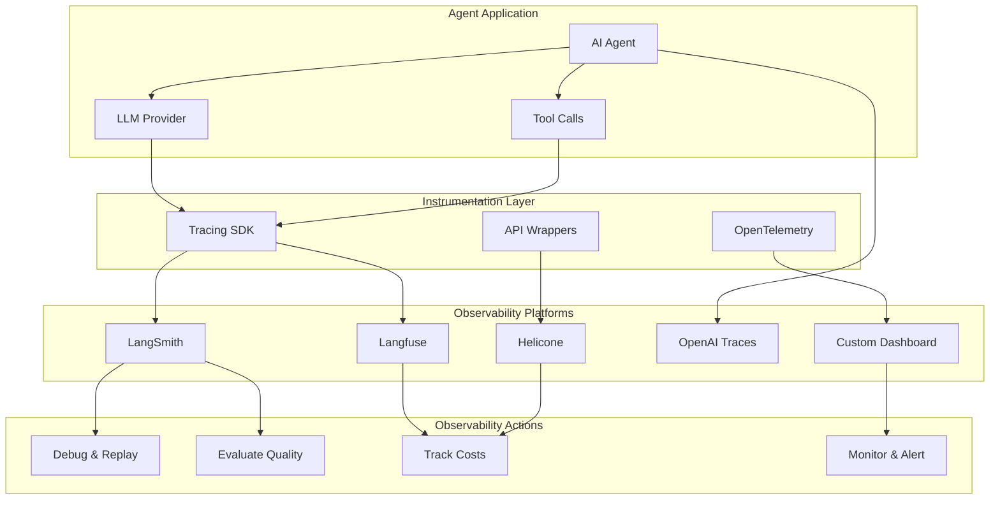

# Agent Observability Platforms

## Overview

You can't improve what you can't measure. AI agents are **non-deterministic, multi-step systems** that call LLMs, use tools, make decisions, and sometimes fail in subtle ways. Without observability, debugging an agent that gave a wrong answer is like debugging a program without logs — you're guessing. This lesson covers the platforms, patterns, and practices that give you **full visibility into every step your agents take**, from development through production.

Observability for agents goes far beyond traditional application monitoring. We need to trace entire reasoning chains, track token costs across multi-step workflows, evaluate output quality at scale, and set up alerts for drift and degradation.

---

## Why This Matters

- **Agents are opaque** — without tracing, you can't see why an agent chose tool A over tool B
- **Costs compound** — multi-step agents can burn through tokens fast; you need cost visibility
- **Quality is measurable** — evaluation frameworks catch regressions before users do
- **Production is different** — an agent that works in development may degrade under real-world load
- **Debugging is hard** — traces let you replay exact agent behavior step by step

---

## What We'll Cover

This lesson explores agent observability across **7 sub-lessons**:

| # | Lesson | Focus |
|---|--------|-------|
| 01 | [LangSmith Observability](./01-langsmith-observability.md) | Trace visualization, run trees, token/cost tracking, evaluation datasets, prompt hub |
| 02 | [OpenAI Agents Tracing](./02-openai-agents-tracing.md) | Built-in dashboard tracing, custom trace processors, span annotations, external export |
| 03 | [Langfuse Open-Source](./03-langfuse-open-source.md) | Self-hosted tracing, cost analytics, prompt management, evaluation framework |
| 04 | [Helicone Integration](./04-helicone-integration.md) | AI gateway, request logging, cost monitoring, rate limit tracking, user analytics |
| 05 | [Custom Observability Setup](./05-custom-observability-setup.md) | OpenTelemetry integration, custom trace exporters, metric collection, dashboards |
| 06 | [Evaluation Frameworks](./06-evaluation-frameworks.md) | LangSmith evaluators, custom eval functions, benchmark datasets, regression testing |
| 07 | [Production Monitoring](./07-production-monitoring.md) | Success/failure rates, latency percentiles, error categorization, alert configuration |

---

## Prerequisites

Before starting this lesson, you should be comfortable with:

- **Agent fundamentals** — ReAct loop, tool calling, execution patterns (Unit 11, Lessons 1–6)
- **OpenAI Agents SDK** — Agent creation, streaming, tool use (Unit 11, Lesson 11)
- **LangGraph agent orchestration** — Stateful workflows (Unit 11, Lesson 12)
- **Python fundamentals** — Decorators, async/await, context managers (Unit 2)
- **HTTP & APIs** — REST endpoints, environment variables (Unit 1, Lesson 6)

---

## Architecture Overview

---

## Platform Landscape (2025–2026)

| Platform | Type | Key Strength | Pricing | Self-Host |
|----------|------|-------------|---------|-----------|
| **LangSmith** | Full platform | Deep LangChain/LangGraph integration, evaluation | Free tier + paid | ✅ (Enterprise) |
| **OpenAI Traces** | Built-in | Zero-config for OpenAI Agents SDK | Free with API | ❌ |
| **Langfuse** | Open-source | Full-featured, self-hostable, framework-agnostic | Free (self-host) + cloud | ✅ |
| **Helicone** | AI gateway | Unified API proxy, 100+ models, cost tracking | Free tier + paid | ✅ |
| **Arize Phoenix** | Open-source | Experiment tracking, embeddings analysis | Free (OSS) | ✅ |
| **Weights & Biases Weave** | ML platform | Experiment tracking, model evaluation | Free tier + paid | ❌ |
| **OpenTelemetry** | Standard | Vendor-neutral, extensible, industry standard | Free (OSS) | ✅ |

---

## Key Concepts

| Concept | Definition |
|---------|-----------|
| **Trace** | A complete record of a single agent workflow execution |
| **Span** | A single operation within a trace (LLM call, tool call, guardrail) |
| **Run tree** | Hierarchical view of nested spans within a trace |
| **Token cost** | Cumulative input + output tokens × price per token |
| **Evaluation score** | Numeric quality metric applied to a trace or span |
| **Latency percentile** | P50/P95/P99 response times for performance monitoring |
| **Dataset** | Curated input/output pairs for systematic evaluation |
| **Trace processor** | Custom handler that exports spans to external systems |

---

## Further Reading

- [LangSmith Documentation](https://docs.langchain.com/langsmith) — Full platform docs
- [OpenAI Agents Tracing](https://openai.github.io/openai-agents-python/tracing/) — Built-in tracing guide
- [Langfuse Documentation](https://langfuse.com/docs) — Open-source observability platform
- [Helicone Documentation](https://docs.helicone.ai/) — AI gateway and monitoring
- [Arize Phoenix](https://phoenix.arize.com/) — Open-source agent tracing
- [OpenTelemetry](https://opentelemetry.io/) — Industry-standard distributed tracing

---

**Previous:** [Agent Web Integration Patterns](../17-agent-web-integration-patterns/00-agent-web-integration-patterns.md)
**Next:** [Agent Deployment Strategies](../19-agent-deployment-strategies.md)

<!--
Sources Consulted:
- LangSmith docs: https://docs.langchain.com/langsmith
- OpenAI Agents tracing: https://openai.github.io/openai-agents-python/tracing/
- Langfuse docs: https://langfuse.com/docs
- Helicone quickstart: https://docs.helicone.ai/getting-started/quick-start
-->
