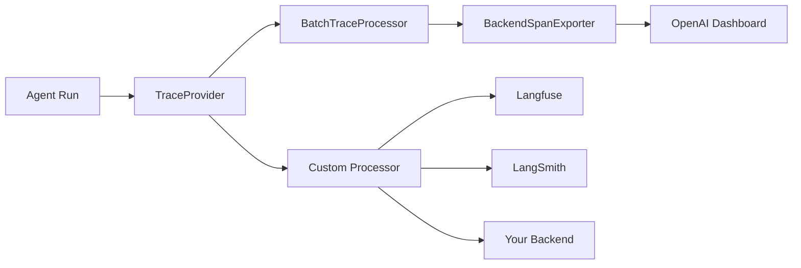

# OpenAI Agents Tracing

## Introduction

The OpenAI Agents SDK ships with **built-in tracing** that captures every event during an agent run — LLM generations, tool calls, handoffs, guardrails, and custom events. With no extra configuration, traces are sent to the [OpenAI Traces dashboard](https://platform.openai.com/traces) where you can debug, visualize, and monitor agent workflows in development and production.

What makes this tracing system powerful is its **zero-config default** combined with full extensibility. You can add custom spans, group multi-turn conversations, export to third-party platforms (LangSmith, Langfuse, Arize, and dozens more), and control sensitive data capture — all through a clean Python API.

### What we'll cover

- Default tracing behavior and the Traces dashboard
- Creating custom traces with `trace()` context manager
- Span types: agent, generation, function, guardrail, handoff
- Custom trace processors for third-party export
- Sensitive data configuration
- Tracing with non-OpenAI models

### Prerequisites

- OpenAI Agents SDK installed (`pip install openai-agents`)
- An OpenAI API key
- OpenAI Agents SDK fundamentals (Unit 11, Lesson 11)
- Python context managers and decorators (Unit 2)

---

## Default tracing

Tracing is enabled by default. Every call to `Runner.run()`, `Runner.run_sync()`, or `Runner.run_streamed()` automatically creates a trace with nested spans.

### What gets traced automatically

| Operation | Span Type | What It Captures |
|-----------|-----------|-----------------|
| Full runner execution | `trace()` | Top-level wrapper for the entire run |
| Agent execution | `agent_span()` | Each time an agent runs |
| LLM generation | `generation_span()` | Input/output messages, token count |
| Tool call | `function_span()` | Function arguments and return value |
| Guardrail check | `guardrail_span()` | Guardrail input/output and pass/fail |
| Handoff | `handoff_span()` | Source and target agents |
| Speech-to-text | `transcription_span()` | Audio input transcription |
| Text-to-speech | `speech_span()` | Audio output generation |

### Basic traced agent

```python
from agents import Agent, Runner

agent = Agent(
    name="Research Assistant",
    instructions="Help users find information. Be concise.",
)

result = Runner.run_sync(agent, "What is observability in AI?")
print(result.final_output)
```

**Output:**
```
Observability in AI is the ability to understand what an AI system is doing
internally by examining its outputs — traces, logs, metrics, and evaluations.
```

After running this, visit [platform.openai.com/traces](https://platform.openai.com/traces). You'll see a trace named "Agent workflow" with:
- An `agent_span` for "Research Assistant"
- A `generation_span` showing the LLM call with input/output messages

---

## Creating custom traces

By default, each `Runner.run()` call creates its own trace. To group multiple runs into a **single trace** (e.g., a multi-turn conversation), wrap them with the `trace()` context manager.

### Grouping multiple runs

```python
from agents import Agent, Runner, trace

agent = Agent(
    name="Joke Agent",
    instructions="Tell funny jokes.",
)

async def multi_turn_conversation():
    with trace("Joke Workflow"):
        # First run — tell a joke
        first = await Runner.run(agent, "Tell me a joke about Python")
        print(f"Joke: {first.final_output}")
        
        # Second run — rate the joke
        second = await Runner.run(
            agent,
            f"Rate this joke on a scale of 1-10: {first.final_output}",
        )
        print(f"Rating: {second.final_output}")
```

**Output:**
```
Joke: Why do Python programmers prefer dark mode? Because light attracts bugs!
Rating: 7/10 — A classic developer joke with solid execution.
```

In the dashboard, both runs appear under a single "Joke Workflow" trace, making it easy to see the full conversation flow.

### Trace properties

```python
with trace(
    workflow_name="Customer Support",
    group_id="thread_abc123",   # Group by conversation thread
    metadata={"user_id": "u42", "channel": "web"},
    disabled=False,             # Set True to skip recording
):
    result = await Runner.run(agent, user_message)
```

| Property | Purpose |
|----------|---------|
| `workflow_name` | Logical name for this workflow type |
| `trace_id` | Auto-generated; format `trace_<32_alphanum>` |
| `group_id` | Link multiple traces from the same conversation |
| `metadata` | Custom key-value pairs for filtering |
| `disabled` | Suppress recording for this trace |

---

## Creating custom spans

While the SDK traces most operations automatically, you can add **custom spans** to track your own logic — database queries, API calls, data processing, etc.

```python
from agents import Agent, Runner, trace, custom_span

async def process_with_custom_tracking():
    with trace("Document Analysis"):
        # Custom span for data loading
        with custom_span("load_documents"):
            documents = load_from_database("project_docs")
        
        # Custom span for preprocessing
        with custom_span("preprocess"):
            cleaned = [clean(doc) for doc in documents]
        
        # Agent runs are traced automatically
        agent = Agent(
            name="Analyst",
            instructions=f"Analyze these documents: {cleaned[:3]}",
        )
        result = await Runner.run(agent, "Summarize the key findings")
        print(result.final_output)
```

The resulting trace tree looks like:

```
Document Analysis (5.2s)
├── load_documents (0.3s)
├── preprocess (0.1s)
└── Analyst (4.8s)
    └── generation_span (4.7s, 1,203 tokens)
```

---

## Custom trace processors

The SDK sends traces to OpenAI's backend by default. You can **add** additional processors to export traces to third-party platforms, or **replace** the default entirely.

### Architecture



### Adding a custom processor

```python
from agents import Agent, Runner, add_trace_processor
from agents.tracing import TracingProcessor, Trace, Span

class ConsoleTraceProcessor(TracingProcessor):
    """Print trace events to console for debugging."""
    
    def on_trace_start(self, trace: Trace) -> None:
        print(f"🟢 Trace started: {trace.workflow_name}")
    
    def on_trace_end(self, trace: Trace) -> None:
        print(f"🔴 Trace ended: {trace.workflow_name}")
    
    def on_span_start(self, span: Span) -> None:
        print(f"  ├── Span started: {span.span_data.__class__.__name__}")
    
    def on_span_end(self, span: Span) -> None:
        duration = (span.ended_at - span.started_at).total_seconds()
        print(f"  └── Span ended: {duration:.2f}s")
    
    def shutdown(self) -> None:
        pass
    
    def force_flush(self) -> None:
        pass

# Add processor — traces still go to OpenAI AND to console
add_trace_processor(ConsoleTraceProcessor())

agent = Agent(name="Test", instructions="Say hello")
result = Runner.run_sync(agent, "Hi")
```

**Output:**
```
🟢 Trace started: Agent workflow
  ├── Span started: AgentSpanData
  ├── Span started: GenerationSpanData
  └── Span ended: 1.23s
  └── Span ended: 1.25s
🔴 Trace ended: Agent workflow
```

### Replacing default processors

To send traces **only** to your custom backend (not to OpenAI):

```python
from agents import set_trace_processors

# Replace defaults — traces go ONLY to your processor
set_trace_processors([MyCustomProcessor()])
```

> **Warning:** Using `set_trace_processors` removes the default OpenAI exporter. Traces will no longer appear in the OpenAI dashboard unless you include a processor that sends them there.

---

## External platform export

The OpenAI Agents SDK has a growing ecosystem of trace processors for third-party platforms. Here are the most popular:

| Platform | Integration |
|----------|-------------|
| **LangSmith** | [docs.smith.langchain.com](https://docs.smith.langchain.com/observability/how_to_guides/trace_with_openai_agents_sdk) |
| **Langfuse** | [langfuse.com/docs/integrations/openaiagentssdk](https://langfuse.com/docs/integrations/openaiagentssdk/openai-agents) |
| **Arize Phoenix** | [docs.arize.com/phoenix](https://docs.arize.com/phoenix/tracing/integrations-tracing/openai-agents-sdk) |
| **Weights & Biases Weave** | [weave-docs.wandb.ai](https://weave-docs.wandb.ai/guides/integrations/openai_agents) |
| **Braintrust** | [braintrust.dev/docs](https://braintrust.dev/docs/guides/traces/integrations#openai-agents-sdk) |
| **Pydantic Logfire** | [logfire.pydantic.dev](https://logfire.pydantic.dev/docs/integrations/llms/openai/#openai-agents) |
| **AgentOps** | [docs.agentops.ai](https://docs.agentops.ai/v1/integrations/agentssdk) |
| **PostHog** | [posthog.com/docs](https://posthog.com/docs/llm-analytics/installation/openai-agents) |

---

## Sensitive data configuration

By default, the SDK captures all inputs and outputs — including potentially sensitive user data. You can control this behavior:

```python
from agents import Agent, Runner, RunConfig

# Disable sensitive data in traces
result = await Runner.run(
    agent,
    user_message,
    run_config=RunConfig(
        trace_include_sensitive_data=False,
    ),
)
```

Or set it globally via environment variable:

```bash
export OPENAI_AGENTS_TRACE_INCLUDE_SENSITIVE_DATA=false
```

| Setting | Effect |
|---------|--------|
| `True` (default) | Full input/output captured in `generation_span` and `function_span` |
| `False` | Inputs/outputs omitted; only structure and timing captured |

> **🔒 Security:** For production systems handling PII, set this to `False` and handle logging separately with your own redaction pipeline.

---

## Tracing with non-OpenAI models

If you use non-OpenAI models (via LiteLLM or other providers), you can still use the OpenAI Traces dashboard by providing a tracing API key:

```python
import os
from agents import set_tracing_export_api_key, Agent, Runner
from agents.extensions.models.litellm_model import LitellmModel

# Use an OpenAI API key just for tracing
set_tracing_export_api_key(os.environ["OPENAI_API_KEY"])

# Use Anthropic via LiteLLM for the actual model
model = LitellmModel(
    model="anthropic/claude-sonnet-4-20250514",
    api_key=os.environ["ANTHROPIC_API_KEY"],
)

agent = Agent(name="Claude Agent", model=model)
result = Runner.run_sync(agent, "Hello from Claude!")
print(result.final_output)
```

For per-run tracing keys:

```python
result = await Runner.run(
    agent,
    "Hello",
    run_config=RunConfig(tracing={"api_key": "sk-tracing-key-123"}),
)
```

---

## Disabling tracing

Two options:

```bash
# Global: disable all tracing
export OPENAI_AGENTS_DISABLE_TRACING=1
```

```python
# Per-run: disable for a specific execution
result = await Runner.run(
    agent,
    "Hello",
    run_config=RunConfig(tracing_disabled=True),
)
```

---

## Best practices

| Practice | Why It Matters |
|----------|----------------|
| Keep default tracing enabled | Zero overhead in most cases; invaluable for debugging |
| Use `group_id` for conversations | Links multi-turn interactions in the dashboard |
| Add metadata for filtering | Experiment names, user IDs, versions help analysis |
| Export to a third-party platform | OpenAI dashboard is great; a dedicated platform gives more depth |
| Disable sensitive data in production | Avoid storing PII in trace backends |
| Use `trace()` context manager | Group related runs into logical workflows |

---

## Common pitfalls

| ❌ Mistake | ✅ Solution |
|-----------|-------------|
| Assuming tracing is off by default | It's **on** by default — disable explicitly if needed |
| Using `set_trace_processors` and losing OpenAI traces | Use `add_trace_processor` to keep OpenAI + add your platform |
| Not grouping multi-turn conversations | Use `group_id` parameter in `trace()` |
| Storing PII in production traces | Set `trace_include_sensitive_data=False` for production |
| Forgetting `shutdown()` in custom processors | Implement `shutdown()` to flush pending spans on process exit |
| Not checking the Traces dashboard | Visit [platform.openai.com/traces](https://platform.openai.com/traces) — it's free |

---

## Hands-on exercise

### Your task

Build an agent with custom tracing that groups a multi-turn conversation and exports span data to the console.

### Requirements

1. Create a `ConsoleTraceProcessor` that prints span names and durations
2. Register it with `add_trace_processor`
3. Create an agent that uses a tool (e.g., a calculator)
4. Wrap two runs in a single `trace()` with `group_id`
5. Verify console output shows nested spans

### Expected result

Console output showing the trace structure with agent, generation, and function spans, plus the trace visible in the OpenAI Traces dashboard.

<details>
<summary>💡 Hints (click to expand)</summary>

- Implement `TracingProcessor` with `on_trace_start`, `on_trace_end`, `on_span_start`, `on_span_end`
- Use `with trace("My Workflow", group_id="conv_1"):` to group runs
- Define a tool with `@function_tool` decorator
- Both `shutdown()` and `force_flush()` are required methods

</details>

<details>
<summary>✅ Solution (click to expand)</summary>

```python
from agents import Agent, Runner, trace, add_trace_processor, function_tool
from agents.tracing import TracingProcessor, Trace, Span

class ConsoleTraceProcessor(TracingProcessor):
    def on_trace_start(self, trace: Trace) -> None:
        print(f"🟢 {trace.workflow_name}")
    
    def on_trace_end(self, trace: Trace) -> None:
        print(f"🔴 {trace.workflow_name} complete")
    
    def on_span_start(self, span: Span) -> None:
        print(f"  ▶ {span.span_data.__class__.__name__}")
    
    def on_span_end(self, span: Span) -> None:
        dt = (span.ended_at - span.started_at).total_seconds()
        print(f"  ◼ {span.span_data.__class__.__name__} ({dt:.2f}s)")
    
    def shutdown(self): pass
    def force_flush(self): pass

add_trace_processor(ConsoleTraceProcessor())

@function_tool
def add(a: int, b: int) -> int:
    """Add two numbers."""
    return a + b

agent = Agent(
    name="Calculator",
    instructions="Use the add tool to answer math questions.",
    tools=[add],
)

import asyncio

async def main():
    with trace("Math Session", group_id="conv_math_1"):
        r1 = await Runner.run(agent, "What is 3 + 5?")
        print(f"Answer 1: {r1.final_output}")
        r2 = await Runner.run(agent, "Now add 10 + 20")
        print(f"Answer 2: {r2.final_output}")

asyncio.run(main())
```

</details>

### Bonus challenges

- [ ] Create a processor that writes traces to a JSON file
- [ ] Add `metadata` with a version tag and filter by it in the dashboard
- [ ] Use `RunConfig(trace_include_sensitive_data=False)` and verify inputs are omitted

---

## Summary

✅ **Default tracing** captures agent, LLM, tool, guardrail, and handoff spans automatically  
✅ **`trace()` context manager** groups multiple runs into a single logical workflow  
✅ **Custom spans** via `custom_span()` track your own logic alongside agent operations  
✅ **Trace processors** enable export to 15+ third-party platforms  
✅ **Sensitive data controls** prevent PII from being stored in trace backends  

**Previous:** [LangSmith Observability](./01-langsmith-observability.md)  
**Next:** [Langfuse Open-Source](./03-langfuse-open-source.md)

---

## Further Reading

- [OpenAI Agents Tracing Guide](https://openai.github.io/openai-agents-python/tracing/) — Official documentation
- [OpenAI Traces Dashboard](https://platform.openai.com/traces) — View traces in the browser
- [External Tracing Processors List](https://openai.github.io/openai-agents-python/tracing/#external-tracing-processors-list) — All supported integrations

<!--
Sources Consulted:
- OpenAI Agents SDK tracing: https://openai.github.io/openai-agents-python/tracing/
- OpenAI Agents SDK reference: https://openai.github.io/openai-agents-python/ref/tracing/
-->
