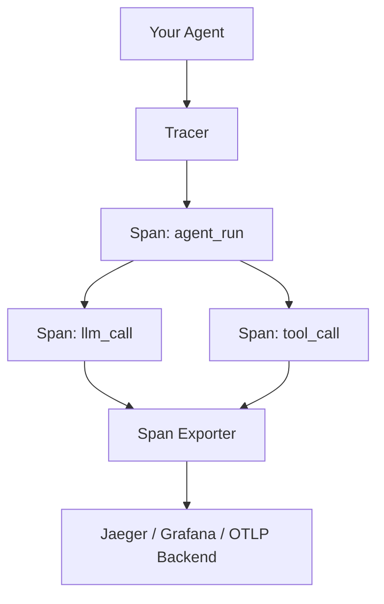

# Custom Observability Setup

## Introduction

What if the managed platforms don't fit your needs? Maybe you're in an air-gapped environment, have strict data residency requirements, or want to integrate LLM tracing into your **existing observability stack** (Grafana, Prometheus, Jaeger, Datadog). This lesson covers building custom observability using **OpenTelemetry** — the vendor-neutral, industry-standard framework for distributed tracing and metrics.

OpenTelemetry (OTel) is the second most active CNCF project after Kubernetes. By instrumenting your agents with OTel, you can export traces to any compatible backend — Jaeger, Zipkin, Grafana Tempo, Datadog, or your own storage — while maintaining full control over your data pipeline.

### What we'll cover

- OpenTelemetry fundamentals for LLM tracing
- Instrumenting agent workflows with spans and attributes
- Building custom trace exporters
- Metric collection patterns (counters, histograms, gauges)
- Creating observability dashboards
- Integrating with existing infrastructure

### Prerequisites

- Python 3.10+ installed
- Understanding of traces and spans (Lesson 18-01 or 18-02)
- Basic knowledge of monitoring concepts (metrics, logs, traces)
- Docker (optional, for running Jaeger locally)

---

## OpenTelemetry fundamentals

OpenTelemetry provides three pillars of observability:

| Pillar | What It Captures | LLM Example |
|--------|-----------------|-------------|
| **Traces** | Request flow through services | Agent → LLM → Tool → LLM → Response |
| **Metrics** | Numeric measurements over time | Tokens/sec, cost/day, error rate |
| **Logs** | Discrete events with context | "Tool call failed: timeout after 30s" |

### Installation

```bash
pip install opentelemetry-api opentelemetry-sdk opentelemetry-exporter-otlp
pip install opentelemetry-exporter-jaeger  # For Jaeger export
pip install openai
```

### Core concepts



---

## Instrumenting agent workflows

### Setting up the tracer

```python
from opentelemetry import trace
from opentelemetry.sdk.trace import TracerProvider
from opentelemetry.sdk.trace.export import (
    BatchSpanProcessor,
    ConsoleSpanExporter,
)
from opentelemetry.sdk.resources import Resource

# Configure the tracer
resource = Resource.create({
    "service.name": "ai-agent-service",
    "service.version": "1.0.0",
    "deployment.environment": "development",
})

provider = TracerProvider(resource=resource)

# Export spans to console (for development)
provider.add_span_processor(
    BatchSpanProcessor(ConsoleSpanExporter())
)

trace.set_tracer_provider(provider)
tracer = trace.get_tracer("agent.tracer")
```

### Tracing an agent workflow

```python
from openai import OpenAI
from opentelemetry import trace

tracer = trace.get_tracer("agent.tracer")
client = OpenAI()

def traced_agent(question: str) -> str:
    with tracer.start_as_current_span("agent_workflow") as workflow_span:
        workflow_span.set_attribute("agent.input", question)
        
        # Step 1: Retrieve context
        with tracer.start_as_current_span("retrieval") as retrieval_span:
            docs = ["Doc 1: AI observability basics", "Doc 2: Tracing patterns"]
            retrieval_span.set_attribute("retrieval.doc_count", len(docs))
        
        # Step 2: LLM call
        with tracer.start_as_current_span("llm_call") as llm_span:
            llm_span.set_attribute("llm.model", "gpt-4o-mini")
            llm_span.set_attribute("llm.provider", "openai")
            
            response = client.chat.completions.create(
                model="gpt-4o-mini",
                messages=[
                    {"role": "system", "content": f"Context: {docs}"},
                    {"role": "user", "content": question},
                ],
            )
            
            result = response.choices[0].message.content
            usage = response.usage
            
            # Record token metrics as span attributes
            llm_span.set_attribute("llm.tokens.input", usage.prompt_tokens)
            llm_span.set_attribute("llm.tokens.output", usage.completion_tokens)
            llm_span.set_attribute("llm.tokens.total", usage.total_tokens)
        
        workflow_span.set_attribute("agent.output_length", len(result))
        return result

answer = traced_agent("What is observability?")
print(answer)
```

**Console span output:**
```json
{
  "name": "agent_workflow",
  "context": {"trace_id": "0x3f2a...", "span_id": "0x7b1c..."},
  "start_time": "2026-02-10T10:00:00Z",
  "end_time": "2026-02-10T10:00:02Z",
  "attributes": {
    "agent.input": "What is observability?",
    "agent.output_length": 142
  },
  "children": [
    {"name": "retrieval", "attributes": {"retrieval.doc_count": 2}},
    {"name": "llm_call", "attributes": {"llm.model": "gpt-4o-mini", "llm.tokens.total": 847}}
  ]
}
```

---

## Building a reusable tracing decorator

To avoid repeating `tracer.start_as_current_span()` everywhere, we create a decorator:

```python
import functools
import time
from opentelemetry import trace

tracer = trace.get_tracer("agent.tracer")

def traced(span_name: str = None, attributes: dict = None):
    """Decorator that wraps a function in an OpenTelemetry span."""
    def decorator(func):
        @functools.wraps(func)
        def wrapper(*args, **kwargs):
            name = span_name or func.__name__
            with tracer.start_as_current_span(name) as span:
                # Add custom attributes
                if attributes:
                    for k, v in attributes.items():
                        span.set_attribute(k, v)
                
                try:
                    result = func(*args, **kwargs)
                    span.set_attribute("status", "success")
                    return result
                except Exception as e:
                    span.set_attribute("status", "error")
                    span.set_attribute("error.type", type(e).__name__)
                    span.set_attribute("error.message", str(e))
                    span.record_exception(e)
                    span.set_status(trace.StatusCode.ERROR, str(e))
                    raise
        return wrapper
    return decorator

# Usage
@traced("document_retrieval", {"component": "rag"})
def retrieve_docs(query: str) -> list[str]:
    return ["doc1", "doc2"]

@traced("llm_generation", {"component": "rag"})
def generate_answer(question: str, context: list[str]) -> str:
    # LLM call here
    return "The answer is..."
```

---

## Custom trace exporters

Beyond console output, export traces to real backends.

### OTLP exporter (universal)

```python
from opentelemetry.exporter.otlp.proto.grpc.trace_exporter import OTLPSpanExporter
from opentelemetry.sdk.trace.export import BatchSpanProcessor

# Export to any OTLP-compatible backend
otlp_exporter = OTLPSpanExporter(
    endpoint="http://localhost:4317",  # Jaeger, Grafana Tempo, etc.
    insecure=True,
)

provider.add_span_processor(BatchSpanProcessor(otlp_exporter))
```

### Jaeger exporter

```python
from opentelemetry.exporter.jaeger.thrift import JaegerExporter

jaeger_exporter = JaegerExporter(
    agent_host_name="localhost",
    agent_port=6831,
)

provider.add_span_processor(BatchSpanProcessor(jaeger_exporter))
```

### JSON file exporter (custom)

```python
import json
from opentelemetry.sdk.trace.export import SpanExporter, SpanExportResult

class JSONFileExporter(SpanExporter):
    """Export spans to a JSON file for offline analysis."""
    
    def __init__(self, filepath: str = "traces.jsonl"):
        self.filepath = filepath
    
    def export(self, spans) -> SpanExportResult:
        with open(self.filepath, "a") as f:
            for span in spans:
                record = {
                    "name": span.name,
                    "trace_id": format(span.context.trace_id, "032x"),
                    "span_id": format(span.context.span_id, "016x"),
                    "start_time": span.start_time,
                    "end_time": span.end_time,
                    "attributes": dict(span.attributes) if span.attributes else {},
                    "status": span.status.status_code.name,
                }
                f.write(json.dumps(record) + "\n")
        return SpanExportResult.SUCCESS
    
    def shutdown(self) -> None:
        pass

# Use it
provider.add_span_processor(
    BatchSpanProcessor(JSONFileExporter("agent_traces.jsonl"))
)
```

### Running Jaeger locally

```bash
docker run -d --name jaeger \
  -p 6831:6831/udp \
  -p 16686:16686 \
  -p 4317:4317 \
  jaegertracing/all-in-one:latest
```

Then visit `http://localhost:16686` to explore traces in the Jaeger UI.

---

## Metric collection patterns

Metrics complement traces by providing **aggregate measurements** over time.

### Setting up metrics

```python
from opentelemetry import metrics
from opentelemetry.sdk.metrics import MeterProvider
from opentelemetry.sdk.metrics.export import (
    PeriodicExportingMetricReader,
    ConsoleMetricExporter,
)

# Configure metrics
metric_reader = PeriodicExportingMetricReader(
    ConsoleMetricExporter(),
    export_interval_millis=10000,  # Export every 10 seconds
)
meter_provider = MeterProvider(metric_readers=[metric_reader])
metrics.set_meter_provider(meter_provider)

meter = metrics.get_meter("agent.metrics")
```

### Agent-specific metrics

```python
# Counter: total requests
request_counter = meter.create_counter(
    "agent.requests.total",
    description="Total agent requests",
    unit="1",
)

# Histogram: request latency
latency_histogram = meter.create_histogram(
    "agent.request.duration",
    description="Agent request duration in seconds",
    unit="s",
)

# Counter: total tokens
token_counter = meter.create_counter(
    "agent.tokens.total",
    description="Total tokens consumed",
    unit="tokens",
)

# Up/down counter: active requests
active_requests = meter.create_up_down_counter(
    "agent.requests.active",
    description="Currently active agent requests",
    unit="1",
)

# Usage in agent code
import time

def traced_agent_with_metrics(question: str) -> str:
    start = time.time()
    active_requests.add(1)
    request_counter.add(1, {"model": "gpt-4o-mini", "agent": "rag"})
    
    try:
        # ... agent logic ...
        result = "Answer here"
        tokens_used = 847
        
        token_counter.add(tokens_used, {"model": "gpt-4o-mini"})
        return result
    finally:
        duration = time.time() - start
        latency_histogram.record(duration, {"model": "gpt-4o-mini"})
        active_requests.add(-1)
```

### Key metrics for agents

| Metric | Type | What It Measures |
|--------|------|-----------------|
| `agent.requests.total` | Counter | Total requests processed |
| `agent.requests.errors` | Counter | Failed requests |
| `agent.request.duration` | Histogram | Request latency distribution |
| `agent.tokens.total` | Counter | Total tokens consumed |
| `agent.tokens.cost` | Counter | Estimated cost in USD |
| `agent.tools.calls` | Counter | Tool invocations per tool name |
| `agent.tools.errors` | Counter | Tool call failures |
| `agent.requests.active` | UpDownCounter | Concurrent requests |

---

## Dashboard creation

### Grafana + Prometheus

Export metrics to Prometheus and visualize in Grafana:

```python
from opentelemetry.exporter.prometheus import PrometheusMetricReader
from prometheus_client import start_http_server

# Start Prometheus metrics server
prometheus_reader = PrometheusMetricReader()
meter_provider = MeterProvider(metric_readers=[prometheus_reader])

# Expose metrics on port 8000
start_http_server(8000)
```

Then configure Grafana to scrape `http://localhost:8000/metrics`.

### Essential dashboard panels

| Panel | Query | Purpose |
|-------|-------|---------|
| Request Rate | `rate(agent_requests_total[5m])` | Requests per second |
| Error Rate | `rate(agent_requests_errors[5m]) / rate(agent_requests_total[5m])` | Error percentage |
| P95 Latency | `histogram_quantile(0.95, agent_request_duration_bucket)` | 95th percentile response time |
| Token Throughput | `rate(agent_tokens_total[5m])` | Tokens consumed per second |
| Active Requests | `agent_requests_active` | Current concurrency |
| Cost per Hour | `increase(agent_tokens_cost[1h])` | Estimated hourly spend |

---

## Best practices

| Practice | Why It Matters |
|----------|----------------|
| Use OpenTelemetry as the instrumentation layer | Vendor-neutral; switch backends without changing code |
| Add semantic attributes to spans | `llm.model`, `llm.tokens.total`, `agent.step` enable meaningful queries |
| Record both traces and metrics | Traces for debugging; metrics for alerting and dashboards |
| Use batch processors | Buffer and send in batches to minimize performance overhead |
| Export to multiple backends | Send traces to Jaeger AND metrics to Prometheus simultaneously |
| Set `service.name` in resources | Distinguish your agent service from other services |

---

## Common pitfalls

| ❌ Mistake | ✅ Solution |
|-----------|-------------|
| Creating too many unique span names | Use a fixed set of names; put variable data in attributes |
| Forgetting to end spans on errors | Use `with` context manager; it handles exceptions automatically |
| Not setting `service.name` | Add it to the Resource so traces are grouped by service |
| High-cardinality attributes | Avoid user IDs as metric labels; use them in span attributes instead |
| Synchronous exporters in production | Always use `BatchSpanProcessor`, never `SimpleSpanProcessor` |
| Not shutting down the provider | Call `provider.shutdown()` or register with `atexit` |

---

## Hands-on exercise

### Your task

Build a custom OpenTelemetry-instrumented agent with both traces and metrics, exporting to the console.

### Requirements

1. Set up a `TracerProvider` with `ConsoleSpanExporter`
2. Set up a `MeterProvider` with `ConsoleMetricExporter`
3. Create a `@traced` decorator for instrumenting functions
4. Build a 2-step agent (retrieve → generate) with traced spans
5. Record metrics: request count, token count, and latency

### Expected result

Console output showing structured span data with trace IDs, attributes (including token counts), and periodic metric exports.

<details>
<summary>💡 Hints (click to expand)</summary>

- Use `tracer.start_as_current_span("name")` as a context manager
- Set attributes with `span.set_attribute("key", value)`
- Metrics: `meter.create_counter()` for counts, `meter.create_histogram()` for latency
- Call `provider.shutdown()` at the end to flush all pending spans

</details>

<details>
<summary>✅ Solution (click to expand)</summary>

```python
import time
from opentelemetry import trace, metrics
from opentelemetry.sdk.trace import TracerProvider
from opentelemetry.sdk.trace.export import BatchSpanProcessor, ConsoleSpanExporter
from opentelemetry.sdk.metrics import MeterProvider
from opentelemetry.sdk.metrics.export import (
    PeriodicExportingMetricReader,
    ConsoleMetricExporter,
)
from opentelemetry.sdk.resources import Resource
from openai import OpenAI

# Setup
resource = Resource.create({"service.name": "exercise-agent"})
trace_provider = TracerProvider(resource=resource)
trace_provider.add_span_processor(BatchSpanProcessor(ConsoleSpanExporter()))
trace.set_tracer_provider(trace_provider)

metric_reader = PeriodicExportingMetricReader(ConsoleMetricExporter(), export_interval_millis=5000)
meter_provider = MeterProvider(resource=resource, metric_readers=[metric_reader])
metrics.set_meter_provider(meter_provider)

tracer = trace.get_tracer("exercise")
meter = metrics.get_meter("exercise")

request_count = meter.create_counter("requests_total")
token_count = meter.create_counter("tokens_total")
latency = meter.create_histogram("request_duration_s")

client = OpenAI()

def agent(question: str) -> str:
    start = time.time()
    request_count.add(1)
    
    with tracer.start_as_current_span("agent_run") as root:
        root.set_attribute("input", question)
        
        with tracer.start_as_current_span("retrieve"):
            docs = ["OpenTelemetry is a CNCF project."]
        
        with tracer.start_as_current_span("generate") as gen_span:
            resp = client.chat.completions.create(
                model="gpt-4o-mini",
                messages=[
                    {"role": "system", "content": f"Context: {docs}"},
                    {"role": "user", "content": question},
                ],
            )
            tokens = resp.usage.total_tokens
            gen_span.set_attribute("llm.tokens.total", tokens)
            token_count.add(tokens)
    
    latency.record(time.time() - start)
    return resp.choices[0].message.content

print(agent("What is OpenTelemetry?"))
trace_provider.shutdown()
```

</details>

### Bonus challenges

- [ ] Run Jaeger in Docker and export traces to it via OTLP
- [ ] Create a custom `JSONFileExporter` that writes spans to a `.jsonl` file
- [ ] Set up Prometheus metrics export and visualize in Grafana

---

## Summary

✅ **OpenTelemetry** provides vendor-neutral instrumentation for traces and metrics  
✅ **Span attributes** like `llm.model`, `llm.tokens.total` enable meaningful trace queries  
✅ **Custom exporters** send data to Jaeger, Grafana Tempo, JSON files, or any OTLP backend  
✅ **Metrics** (counters, histograms) power dashboards and alerts  
✅ **Batch processors** ensure minimal performance overhead in production  

**Previous:** [Helicone Integration](./04-helicone-integration.md)  
**Next:** [Evaluation Frameworks](./06-evaluation-frameworks.md)

---

## Further Reading

- [OpenTelemetry Python Documentation](https://opentelemetry.io/docs/languages/python/) — Official SDK docs
- [OpenTelemetry Specification](https://opentelemetry.io/docs/specs/otel/) — Protocol and data model
- [Jaeger Documentation](https://www.jaegertracing.io/docs/) — Distributed tracing backend
- [Grafana + Prometheus](https://grafana.com/docs/grafana/latest/) — Dashboard and metrics platform

<!--
Sources Consulted:
- OpenTelemetry Python docs: https://opentelemetry.io/docs/languages/python/
- OpenTelemetry specification: https://opentelemetry.io/docs/specs/otel/
- Jaeger getting started: https://www.jaegertracing.io/docs/getting-started/
-->
