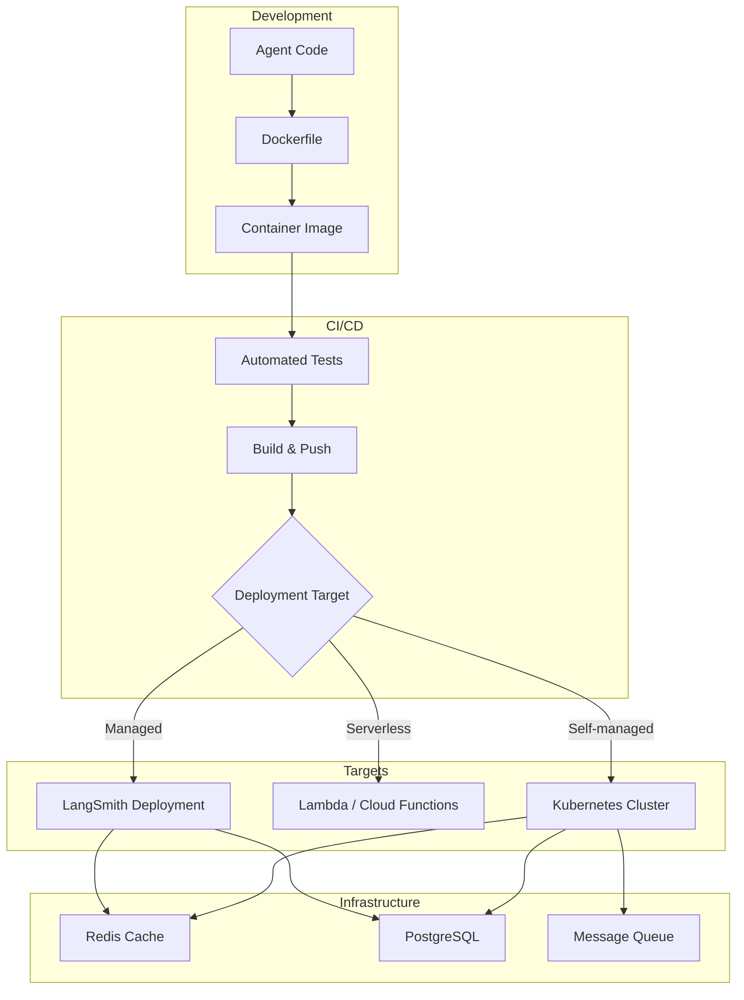

# Agent Deployment Strategies

## Overview

Building a capable AI agent is only half the challenge — deploying it reliably, scaling it under load, and maintaining it over time is where production engineering meets AI. This lesson covers the full deployment lifecycle: from containerizing an agent with Docker, to orchestrating with Kubernetes, to leveraging managed platforms like LangSmith Deployment, and automating everything with CI/CD pipelines.

Agent deployments differ from traditional web applications. Agents have **long-running requests** (30s–5min vs. sub-second), **unpredictable resource usage** (token counts vary wildly), **external API dependencies** (LLM providers, tool servers), and **stateful conversations** that must persist across interactions. These characteristics demand specialized deployment strategies.

### Lesson structure

| # | Lesson | Focus |
|---|--------|-------|
| 01 | [Containerized Agent Deployment](./01-containerized-agent-deployment.md) | Docker, multi-stage builds, health checks |
| 02 | [Kubernetes for Agents](./02-kubernetes-for-agents.md) | Pods, scaling, resource limits, secrets |
| 03 | [Serverless Agent Hosting](./03-serverless-agent-hosting.md) | Lambda, Cloud Functions, cold starts |
| 04 | [LangSmith Deployment](./04-langsmith-deployment.md) | Managed platform, cron jobs, double-texting |
| 05 | [Agent Scaling Patterns](./05-agent-scaling-patterns.md) | Horizontal scaling, queues, load balancing |
| 06 | [Production Infrastructure](./06-production-infrastructure.md) | Redis, PostgreSQL, message queues |
| 07 | [CI/CD for Agents](./07-cicd-for-agents.md) | Testing, canary deploys, rollbacks |

### Deployment architecture

### Deployment platform comparison

| Platform | Best For | Scaling | Cold Start | State Management | Cost Model |
|----------|----------|---------|------------|------------------|------------|
| **Docker + VMs** | Simple deployments | Manual | None | Self-managed | Fixed |
| **Kubernetes** | Complex, multi-agent | Auto (HPA) | None | ConfigMaps/Secrets | Variable |
| **AWS Lambda** | Short, stateless tasks | Auto | 1–10s | External (DynamoDB) | Per-invocation |
| **Google Cloud Functions** | Event-driven agents | Auto | 1–5s | External (Firestore) | Per-invocation |
| **LangSmith Deployment** | LangGraph agents | Built-in | None | Built-in persistence | Subscription |
| **Vercel Edge Functions** | Low-latency chat | Auto | Minimal | External | Per-request |

### Key concepts

| Concept | Description |
|---------|-------------|
| **Multi-stage build** | Dockerfile pattern that separates build and runtime for smaller images |
| **Horizontal Pod Autoscaler** | Kubernetes resource that scales pods based on CPU/memory/custom metrics |
| **Cold start** | Latency penalty when serverless functions initialize from zero |
| **Double-texting** | When a user sends a second message before the first run completes |
| **Canary deployment** | Gradually routing traffic to a new version to detect problems early |
| **Task queue** | Persistent queue (Redis/RabbitMQ) that decouples request intake from processing |
| **Blue-green deployment** | Running two identical environments and switching traffic between them |

### Prerequisites

- Agent development fundamentals (Lessons 01–18)
- Basic Docker knowledge (containers, images, volumes)
- Command-line proficiency
- Git and version control basics
- Understanding of HTTP APIs and web servers

---

## Further Reading

- [Docker Documentation](https://docs.docker.com/) — Container fundamentals
- [Kubernetes Documentation](https://kubernetes.io/docs/) — Container orchestration
- [LangSmith Deployment Docs](https://docs.langchain.com/langsmith/deployments) — Managed agent hosting
- [AWS Lambda Developer Guide](https://docs.aws.amazon.com/lambda/latest/dg/) — Serverless compute
- [GitHub Actions Documentation](https://docs.github.com/en/actions) — CI/CD workflows

---

**Previous:** [Agent Observability Platforms](../18-agent-observability-platforms/00-agent-observability-platforms.md)  
**Next:** [Containerized Agent Deployment](./01-containerized-agent-deployment.md)  
**Back to Unit:** [AI Agents Overview](../00-overview.md)

<!--
Sources Consulted:
- Docker multi-stage builds: https://docs.docker.com/build/building/multi-stage/
- Kubernetes Pods: https://kubernetes.io/docs/concepts/workloads/pods/
- LangSmith Deployment: https://docs.langchain.com/langsmith/deployments
- LangSmith Agent Server: https://docs.langchain.com/langsmith/langgraph-server
- GitHub Actions Docker publishing: https://docs.github.com/en/actions/tutorials/publish-packages/publish-docker-images
-->
