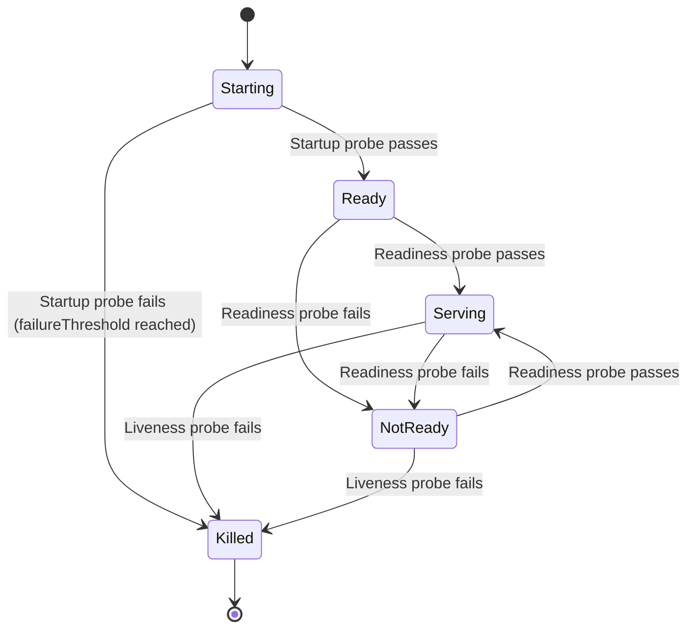

# Kubernetes for Agents

## Introduction

Docker gets your agent into a container. Kubernetes gets that container running reliably at scale. When a single Docker container isn't enough — when you need automatic scaling, rolling updates, self-healing, and secrets management — Kubernetes provides the orchestration layer that production agent systems demand.

In this lesson, we create Kubernetes manifests for agent deployments, configure horizontal pod autoscaling, manage secrets and configuration, and implement the health probes that keep agents running through failures.

### What we'll cover

- Kubernetes Deployment manifests for agents
- Resource requests and limits for LLM workloads
- Horizontal Pod Autoscaler (HPA) configuration
- Secrets and ConfigMap management
- Liveness, readiness, and startup probes
- Services and Ingress for agent APIs

### Prerequisites

- Docker containerization (Lesson 19-01)
- `kubectl` CLI installed ([Install kubectl](https://kubernetes.io/docs/tasks/tools/))
- Access to a Kubernetes cluster (local: minikube, kind, or Docker Desktop)

---

## Agent deployment manifest

A Kubernetes Deployment manages a set of identical pods running your agent. It handles rolling updates, rollbacks, and replica management.

### Basic deployment

```yaml
# k8s/deployment.yaml
apiVersion: apps/v1
kind: Deployment
metadata:
  name: ai-agent
  labels:
    app: ai-agent
    version: v1
spec:
  replicas: 3
  selector:
    matchLabels:
      app: ai-agent
  template:
    metadata:
      labels:
        app: ai-agent
        version: v1
    spec:
      containers:
        - name: agent
          image: ghcr.io/myorg/ai-agent:1.0.0
          ports:
            - containerPort: 8000
              name: http
          envFrom:
            - configMapRef:
                name: agent-config
            - secretRef:
                name: agent-secrets
          resources:
            requests:
              cpu: "500m"
              memory: "512Mi"
            limits:
              cpu: "2000m"
              memory: "2Gi"
          livenessProbe:
            httpGet:
              path: /health
              port: http
            initialDelaySeconds: 10
            periodSeconds: 30
            timeoutSeconds: 5
            failureThreshold: 3
          readinessProbe:
            httpGet:
              path: /ready
              port: http
            initialDelaySeconds: 5
            periodSeconds: 10
            timeoutSeconds: 5
            failureThreshold: 3
          startupProbe:
            httpGet:
              path: /health
              port: http
            initialDelaySeconds: 5
            periodSeconds: 5
            failureThreshold: 12
      restartPolicy: Always
```

Apply and verify:

```bash
kubectl apply -f k8s/deployment.yaml
kubectl get pods -l app=ai-agent
```

**Output:**
```
NAME                        READY   STATUS    RESTARTS   AGE
ai-agent-6d4f8b9c7-2xkm9   1/1     Running   0          45s
ai-agent-6d4f8b9c7-7pnlv   1/1     Running   0          45s
ai-agent-6d4f8b9c7-q8rnx   1/1     Running   0          45s
```

---

## Resource requests and limits

Agents have unique resource profiles: low CPU during idle, high memory for context, and burst CPU during LLM calls (if running local models) or network I/O (if calling APIs).

### Resource sizing guidelines

| Agent Type | CPU Request | CPU Limit | Memory Request | Memory Limit |
|------------|------------|-----------|----------------|--------------|
| **API-calling agent** | 250m | 1000m | 256Mi | 1Gi |
| **Agent + embeddings** | 500m | 2000m | 512Mi | 2Gi |
| **Agent + local model** | 2000m | 4000m | 4Gi | 8Gi |
| **Multi-agent orchestrator** | 1000m | 4000m | 1Gi | 4Gi |

> **Note:** `requests` guarantee minimum resources. `limits` cap maximum usage. Setting limits too low causes OOMKilled pods; setting requests too high wastes cluster capacity.

```yaml
resources:
  requests:
    cpu: "500m"       # 0.5 CPU cores guaranteed
    memory: "512Mi"   # 512 MB guaranteed
  limits:
    cpu: "2000m"      # Can burst to 2 CPU cores
    memory: "2Gi"     # Hard cap at 2 GB (OOMKilled if exceeded)
```

---

## ConfigMaps and Secrets

### ConfigMap for non-sensitive settings

```yaml
# k8s/configmap.yaml
apiVersion: v1
kind: ConfigMap
metadata:
  name: agent-config
data:
  MODEL_NAME: "gpt-4o-mini"
  TEMPERATURE: "0.7"
  MAX_TOKENS: "4096"
  ENABLE_STREAMING: "true"
  ENABLE_TRACING: "true"
  REDIS_URL: "redis://redis-service:6379"
  DATABASE_URL: "postgresql://postgres:5432/agents"
  LOG_LEVEL: "INFO"
```

### Secret for API keys

```bash
# Create secret from literal values
kubectl create secret generic agent-secrets \
  --from-literal=OPENAI_API_KEY=sk-proj-... \
  --from-literal=LANGSMITH_API_KEY=lsv2_... \
  --from-literal=DATABASE_PASSWORD=supersecret

# Or from a file
kubectl create secret generic agent-secrets \
  --from-env-file=.env.production
```

```yaml
# k8s/secret.yaml (for version control — values are base64-encoded)
apiVersion: v1
kind: Secret
metadata:
  name: agent-secrets
type: Opaque
data:
  OPENAI_API_KEY: c2stcHJvai0uLi4=    # base64 encoded
  LANGSMITH_API_KEY: bHN2Ml8uLi4=      # base64 encoded
```

> **Warning:** Base64 is encoding, not encryption. Use tools like [Sealed Secrets](https://github.com/bitnami-labs/sealed-secrets) or [External Secrets Operator](https://external-secrets.io/) for production secret management.

### Referencing in the deployment

```yaml
# In the container spec:
envFrom:
  - configMapRef:
      name: agent-config    # All keys become env vars
  - secretRef:
      name: agent-secrets   # All keys become env vars
```

---

## Health probes

Kubernetes uses three types of probes to manage pod lifecycle:



| Probe | Purpose | Failure Action |
|-------|---------|---------------|
| **Startup** | Wait for app to initialize | Kill + restart pod |
| **Liveness** | Detect deadlocks/crashes | Kill + restart pod |
| **Readiness** | Check if ready for traffic | Remove from Service (no traffic) |

### Agent-specific probe configuration

```yaml
# Startup: agent may need time to load tools, establish connections
startupProbe:
  httpGet:
    path: /health
    port: 8000
  initialDelaySeconds: 5
  periodSeconds: 5
  failureThreshold: 12      # 5 + (5 × 12) = 65s max startup time

# Liveness: is the process alive?
livenessProbe:
  httpGet:
    path: /health
    port: 8000
  periodSeconds: 30
  timeoutSeconds: 5
  failureThreshold: 3       # 3 failures → restart

# Readiness: can it handle requests?
readinessProbe:
  httpGet:
    path: /ready
    port: 8000
  periodSeconds: 10
  timeoutSeconds: 5
  failureThreshold: 3       # 3 failures → remove from Service
```

---

## Horizontal Pod Autoscaler

The HPA automatically adjusts pod count based on observed metrics.

```yaml
# k8s/hpa.yaml
apiVersion: autoscaling/v2
kind: HorizontalPodAutoscaler
metadata:
  name: ai-agent-hpa
spec:
  scaleTargetRef:
    apiVersion: apps/v1
    kind: Deployment
    name: ai-agent
  minReplicas: 2
  maxReplicas: 10
  metrics:
    - type: Resource
      resource:
        name: cpu
        target:
          type: Utilization
          averageUtilization: 70
    - type: Resource
      resource:
        name: memory
        target:
          type: Utilization
          averageUtilization: 80
  behavior:
    scaleUp:
      stabilizationWindowSeconds: 60
      policies:
        - type: Pods
          value: 2
          periodSeconds: 60
    scaleDown:
      stabilizationWindowSeconds: 300
      policies:
        - type: Pods
          value: 1
          periodSeconds: 120
```

Apply and monitor:

```bash
kubectl apply -f k8s/hpa.yaml
kubectl get hpa ai-agent-hpa --watch
```

**Output:**
```
NAME            REFERENCE             TARGETS           MINPODS   MAXPODS   REPLICAS   AGE
ai-agent-hpa   Deployment/ai-agent   42%/70%, 35%/80%  2         10        3          2m
```

| HPA Parameter | Value | Why |
|---------------|-------|-----|
| `minReplicas` | 2 | Always have redundancy |
| `maxReplicas` | 10 | Cost ceiling |
| `scaleUp.stabilizationWindow` | 60s | React quickly to traffic spikes |
| `scaleDown.stabilizationWindow` | 300s | Scale down slowly to avoid flapping |

---

## Service and Ingress

### ClusterIP Service

```yaml
# k8s/service.yaml
apiVersion: v1
kind: Service
metadata:
  name: ai-agent-service
spec:
  type: ClusterIP
  selector:
    app: ai-agent
  ports:
    - name: http
      port: 80
      targetPort: 8000
      protocol: TCP
```

### Ingress for external access

```yaml
# k8s/ingress.yaml
apiVersion: networking.k8s.io/v1
kind: Ingress
metadata:
  name: ai-agent-ingress
  annotations:
    nginx.ingress.kubernetes.io/proxy-read-timeout: "300"
    nginx.ingress.kubernetes.io/proxy-send-timeout: "300"
spec:
  rules:
    - host: agent.example.com
      http:
        paths:
          - path: /
            pathType: Prefix
            backend:
              service:
                name: ai-agent-service
                port:
                  number: 80
```

> **Important:** Agent requests are long-running. Set `proxy-read-timeout` to at least 300s (5 minutes) to prevent Nginx from terminating active agent runs.

---

## Best practices

| Practice | Why It Matters |
|----------|----------------|
| Set both `requests` and `limits` | Prevents resource starvation and noisy neighbor issues |
| Use all three probe types | Startup for slow init, liveness for crashes, readiness for dependencies |
| Scale down slowly (5 min window) | Agent requests are long; sudden scale-down kills active runs |
| Use `envFrom` over individual `env` | Cleaner manifests, easier to update ConfigMaps/Secrets |
| Pin image tags (never use `latest`) | Prevents unpredictable deployments |
| Set pod disruption budgets | Ensures minimum availability during node maintenance |

---

## Common pitfalls

| ❌ Mistake | ✅ Solution |
|-----------|-------------|
| Memory limits too low for agents | Profile actual usage with `kubectl top pods` before setting limits |
| No readiness probe on agents | Failed dependency (Redis down) sends traffic to broken pods |
| Using `latest` image tag | Pin to specific versions: `ai-agent:1.2.3` |
| Short Ingress timeouts | Set `proxy-read-timeout` to 300s+ for long-running agent calls |
| Scaling down too aggressively | Use `stabilizationWindowSeconds: 300` to avoid killing active runs |
| Secrets in ConfigMaps | Always use `Secret` resources for API keys and credentials |

---

## Hands-on exercise

### Your task

Create a complete Kubernetes deployment for an agent with ConfigMap, Secret, HPA, Service, and health probes.

### Requirements

1. Write a Deployment with 2 replicas and all three probe types
2. Create a ConfigMap with model settings and a Secret with API keys
3. Configure an HPA that scales from 2 to 8 pods at 70% CPU
4. Add a Service and Ingress with appropriate timeouts
5. Apply all manifests and verify with `kubectl get all`

### Expected result

Two agent pods running, HPA monitoring metrics, Service routing traffic, all probes passing.

<details>
<summary>💡 Hints (click to expand)</summary>

- Apply manifests in order: ConfigMap/Secret → Deployment → Service → HPA → Ingress
- Use `kubectl describe pod <name>` to debug probe failures
- Check HPA status with `kubectl get hpa --watch`
- Verify Service endpoints: `kubectl get endpoints ai-agent-service`

</details>

<details>
<summary>✅ Solution (click to expand)</summary>

```bash
# Apply all manifests
kubectl apply -f k8s/configmap.yaml
kubectl apply -f k8s/secret.yaml
kubectl apply -f k8s/deployment.yaml
kubectl apply -f k8s/service.yaml
kubectl apply -f k8s/hpa.yaml
kubectl apply -f k8s/ingress.yaml

# Verify everything
kubectl get all -l app=ai-agent
kubectl get hpa
kubectl get ingress
```

**Expected output:**
```
NAME                            READY   STATUS    RESTARTS   AGE
pod/ai-agent-6d4f8b9c7-2xkm9   1/1     Running   0          2m
pod/ai-agent-6d4f8b9c7-7pnlv   1/1     Running   0          2m

NAME                        TYPE        CLUSTER-IP      PORT(S)
service/ai-agent-service    ClusterIP   10.96.123.45    80/TCP

NAME                       READY   UP-TO-DATE   AVAILABLE
deployment.apps/ai-agent   2/2     2            2
```

</details>

### Bonus challenges

- [ ] Add a PodDisruptionBudget (`minAvailable: 1`)
- [ ] Configure NetworkPolicy to restrict agent pod network access
- [ ] Set up a CronJob for scheduled agent tasks

---

## Summary

✅ **Deployments** manage replicated pods with rolling updates and rollback support  
✅ **Resource requests and limits** prevent agents from starving or overwhelming the cluster  
✅ **ConfigMaps and Secrets** separate configuration from code — Secrets for API keys, ConfigMaps for settings  
✅ **Three probe types** (startup, liveness, readiness) handle agent initialization, crashes, and dependency failures  
✅ **HPA** automatically scales pods based on CPU/memory, with stabilization windows for long-running agents  

**Previous:** [Containerized Agent Deployment](./01-containerized-agent-deployment.md)  
**Next:** [Serverless Agent Hosting](./03-serverless-agent-hosting.md)  
**Back to:** [Agent Deployment Strategies](./00-agent-deployment-strategies.md)

---

## Further Reading

- [Kubernetes Pods](https://kubernetes.io/docs/concepts/workloads/pods/) — Pod fundamentals
- [Horizontal Pod Autoscaler](https://kubernetes.io/docs/tasks/run-application/horizontal-pod-autoscale/) — Auto-scaling guide
- [Configure Liveness, Readiness, and Startup Probes](https://kubernetes.io/docs/tasks/configure-pod-container/configure-liveness-readiness-startup-probes/) — Probe configuration
- [Kubernetes Secrets](https://kubernetes.io/docs/concepts/configuration/secret/) — Secret management

<!--
Sources Consulted:
- Kubernetes Pods: https://kubernetes.io/docs/concepts/workloads/pods/
- Kubernetes HPA: https://kubernetes.io/docs/tasks/run-application/horizontal-pod-autoscale/
- Kubernetes Probes: https://kubernetes.io/docs/tasks/configure-pod-container/configure-liveness-readiness-startup-probes/
- Kubernetes Secrets: https://kubernetes.io/docs/concepts/configuration/secret/
-->
