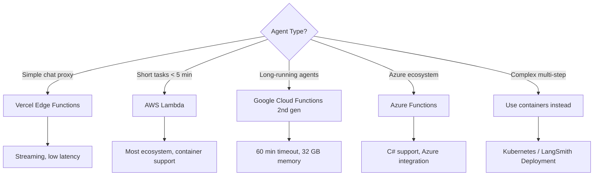

# Serverless Agent Hosting

## Introduction

Serverless platforms run your agent code without provisioning or managing servers. You deploy a function, the platform handles scaling, and you pay only for actual execution time. For agents, serverless is a powerful choice for low-traffic, event-driven, or bursty workloads — but it comes with constraints around timeout limits and cold starts that demand careful design.

In this lesson, we deploy agents to AWS Lambda, Google Cloud Functions, Azure Functions, and Vercel Edge Functions, comparing their strengths, limitations, and agent-specific trade-offs.

### What we'll cover

- AWS Lambda agent deployment
- Google Cloud Functions for agents
- Azure Functions setup
- Vercel Edge Functions for chat interfaces
- Cold start mitigation strategies
- Choosing the right serverless platform for your agent

### Prerequisites

- Containerized agent deployment (Lesson 19-01)
- Basic cloud platform familiarity (AWS, GCP, or Azure)
- Understanding of HTTP APIs and event-driven patterns

---

## Serverless platform comparison

| Feature | AWS Lambda | Google Cloud Functions | Azure Functions | Vercel Edge |
|---------|-----------|----------------------|----------------|-------------|
| **Max timeout** | 15 min | 60 min (2nd gen) | 10 min (Consumption) | 30s (Edge) / 5 min (Serverless) |
| **Max memory** | 10 GB | 32 GB | 1.5 GB (Consumption) | 1 GB |
| **Cold start** | 1–10s | 1–5s | 3–10s | <1s |
| **Languages** | Python, Node, Java, etc. | Python, Node, Go, etc. | Python, C#, Node, etc. | JavaScript/TypeScript |
| **Container support** | ✅ | ✅ | ✅ | ❌ |
| **Streaming** | Response streaming | ❌ | ❌ | ✅ |
| **Pricing** | Per request + duration | Per request + duration | Per execution | Per request |

> **🤖 AI Context:** Most AI agent calls take 5–60 seconds. AWS Lambda's 15-minute limit handles most cases. Google Cloud Functions' 60-minute limit is best for complex, multi-step agents. Vercel Edge is ideal for lightweight chat proxies, not heavy agent logic.

---

## AWS Lambda agent deployment

### Lambda handler

```python
# lambda_function.py
import json
import os
from openai import OpenAI

# Initialize outside the handler (reused across warm invocations)
client = OpenAI(api_key=os.environ["OPENAI_API_KEY"])

def lambda_handler(event, context):
    """AWS Lambda handler for agent requests."""
    try:
        body = json.loads(event.get("body", "{}"))
        message = body.get("message", "")
        
        if not message:
            return {
                "statusCode": 400,
                "body": json.dumps({"error": "Message is required"}),
            }
        
        response = client.chat.completions.create(
            model=os.environ.get("MODEL_NAME", "gpt-4o-mini"),
            messages=[
                {"role": "system", "content": "You are a helpful assistant."},
                {"role": "user", "content": message},
            ],
            max_tokens=int(os.environ.get("MAX_TOKENS", "1024")),
        )
        
        result = response.choices[0].message.content
        
        return {
            "statusCode": 200,
            "headers": {"Content-Type": "application/json"},
            "body": json.dumps({
                "response": result,
                "tokens": response.usage.total_tokens,
                "remaining_time_ms": context.get_remaining_time_in_millis(),
            }),
        }
    
    except Exception as e:
        return {
            "statusCode": 500,
            "body": json.dumps({"error": str(e)}),
        }
```

### Deployment with container image

```dockerfile
# Dockerfile.lambda
FROM public.ecr.aws/lambda/python:3.12

COPY requirements.txt .
RUN pip install --no-cache-dir -r requirements.txt

COPY lambda_function.py .

CMD ["lambda_function.lambda_handler"]
```

```bash
# Build and push
docker build -t ai-agent-lambda -f Dockerfile.lambda .
aws ecr create-repository --repository-name ai-agent-lambda
docker tag ai-agent-lambda:latest 123456789.dkr.ecr.us-east-1.amazonaws.com/ai-agent-lambda:latest
docker push 123456789.dkr.ecr.us-east-1.amazonaws.com/ai-agent-lambda:latest

# Create function
aws lambda create-function \
  --function-name ai-agent \
  --package-type Image \
  --code ImageUri=123456789.dkr.ecr.us-east-1.amazonaws.com/ai-agent-lambda:latest \
  --role arn:aws:iam::123456789:role/lambda-role \
  --timeout 300 \
  --memory-size 1024 \
  --environment Variables="{OPENAI_API_KEY=sk-...}"
```

### Lambda configuration for agents

| Setting | Recommended Value | Why |
|---------|-------------------|-----|
| **Timeout** | 300s (5 min) | Agent calls can take 30–120s with tool use |
| **Memory** | 1024 MB | More memory = more CPU = faster execution |
| **Reserved concurrency** | 10–50 | Prevents runaway API costs |
| **Provisioned concurrency** | 2–5 | Eliminates cold starts for critical agents |

---

## Google Cloud Functions

Google Cloud Functions 2nd generation supports up to 60 minutes timeout — the best option for complex, long-running agents.

### Cloud Function handler

```python
# main.py
import functions_framework
import os
from openai import OpenAI

client = OpenAI(api_key=os.environ["OPENAI_API_KEY"])

@functions_framework.http
def agent_handler(request):
    """Google Cloud Function HTTP handler."""
    if request.method == "OPTIONS":
        return ("", 204, {
            "Access-Control-Allow-Origin": "*",
            "Access-Control-Allow-Methods": "POST",
            "Access-Control-Allow-Headers": "Content-Type",
        })
    
    data = request.get_json(silent=True) or {}
    message = data.get("message", "")
    
    if not message:
        return {"error": "Message is required"}, 400
    
    response = client.chat.completions.create(
        model=os.environ.get("MODEL_NAME", "gpt-4o-mini"),
        messages=[
            {"role": "system", "content": "You are a helpful assistant."},
            {"role": "user", "content": message},
        ],
    )
    
    return {
        "response": response.choices[0].message.content,
        "tokens": response.usage.total_tokens,
    }
```

Deploy:

```bash
gcloud functions deploy ai-agent \
  --gen2 \
  --runtime=python312 \
  --trigger-http \
  --allow-unauthenticated \
  --timeout=540 \
  --memory=1Gi \
  --set-env-vars OPENAI_API_KEY=sk-... \
  --entry-point=agent_handler \
  --source=.
```

**Output:**
```
Deploying function...done.
availableMemoryMb: 1024
httpsTrigger:
  url: https://us-central1-myproject.cloudfunctions.net/ai-agent
status: ACTIVE
```

---

## Azure Functions

```python
# function_app.py
import azure.functions as func
import json
import os
from openai import OpenAI

app = func.FunctionApp()
client = OpenAI(api_key=os.environ["OPENAI_API_KEY"])

@app.route(route="agent", methods=["POST"])
def agent_handler(req: func.HttpRequest) -> func.HttpResponse:
    """Azure Functions HTTP trigger for agent."""
    try:
        body = req.get_json()
        message = body.get("message", "")
        
        response = client.chat.completions.create(
            model=os.environ.get("MODEL_NAME", "gpt-4o-mini"),
            messages=[
                {"role": "system", "content": "You are a helpful assistant."},
                {"role": "user", "content": message},
            ],
        )
        
        return func.HttpResponse(
            json.dumps({
                "response": response.choices[0].message.content,
                "tokens": response.usage.total_tokens,
            }),
            mimetype="application/json",
        )
    except Exception as e:
        return func.HttpResponse(
            json.dumps({"error": str(e)}),
            status_code=500,
            mimetype="application/json",
        )
```

---

## Vercel Edge Functions

Edge Functions run at the CDN edge, providing ultra-low latency for chat interfaces. They proxy to LLM APIs and stream responses back to users.

```typescript
// api/agent/route.ts (Next.js App Router)
import { OpenAI } from "openai";

export const runtime = "edge";

const openai = new OpenAI({
  apiKey: process.env.OPENAI_API_KEY,
});

export async function POST(request: Request) {
  const { message } = await request.json();

  const response = await openai.chat.completions.create({
    model: "gpt-4o-mini",
    messages: [
      { role: "system", content: "You are a helpful assistant." },
      { role: "user", content: message },
    ],
    stream: true,
  });

  // Stream the response using ReadableStream
  const stream = new ReadableStream({
    async start(controller) {
      for await (const chunk of response) {
        const content = chunk.choices[0]?.delta?.content || "";
        if (content) {
          controller.enqueue(new TextEncoder().encode(content));
        }
      }
      controller.close();
    },
  });

  return new Response(stream, {
    headers: { "Content-Type": "text/plain; charset=utf-8" },
  });
}
```

> **Tip:** Vercel Edge Functions are best for **chat proxy** patterns — receive user input, call LLM API, stream response. For complex agent workflows with tool use, use a backend Lambda or Cloud Function.

---

## Cold start mitigation

Cold starts happen when the platform creates a new function instance from scratch. This can add 1–10 seconds of latency.

### Strategies

| Strategy | Platform | How It Works |
|----------|----------|-------------|
| **Provisioned concurrency** | AWS Lambda | Pre-warms N instances (costs money) |
| **Min instances** | Google Cloud Functions | Keeps N instances warm |
| **Premium plan** | Azure Functions | Pre-warmed instances |
| **Initialize outside handler** | All | Module-level code runs once on cold start |
| **Smaller packages** | All | Fewer dependencies = faster cold start |
| **Container images** | Lambda, GCF | Faster than zip packages at large sizes |

### Module-level initialization pattern

```python
# ✅ Good: Initialize expensive resources OUTSIDE the handler
import os
from openai import OpenAI

# These run ONCE on cold start, then reuse on warm invocations
client = OpenAI(api_key=os.environ["OPENAI_API_KEY"])
SYSTEM_PROMPT = open("prompts/system.txt").read()

def handler(event, context):
    # ✅ Reuses client and prompt from module scope
    response = client.chat.completions.create(
        model="gpt-4o-mini",
        messages=[
            {"role": "system", "content": SYSTEM_PROMPT},
            {"role": "user", "content": event["message"]},
        ],
    )
    return {"response": response.choices[0].message.content}
```

```python
# ❌ Bad: Initialize inside the handler (runs every invocation)
def handler(event, context):
    # ❌ Creates a new client every single call
    client = OpenAI(api_key=os.environ["OPENAI_API_KEY"])
    prompt = open("prompts/system.txt").read()
    ...
```

---

## Choosing the right platform



---

## Best practices

| Practice | Why It Matters |
|----------|----------------|
| Initialize resources outside the handler | Reused across warm invocations, faster response times |
| Set appropriate timeouts | Too short = killed mid-run; too long = wasted cost on failures |
| Use provisioned concurrency for critical agents | Eliminates cold starts for user-facing agents |
| Set reserved concurrency limits | Prevents runaway API costs from auto-scaling |
| Return structured JSON responses | Consistent API contract for all callers |
| Monitor with platform-native tools | CloudWatch (AWS), Cloud Monitoring (GCP), Application Insights (Azure) |

---

## Common pitfalls

| ❌ Mistake | ✅ Solution |
|-----------|-------------|
| Timeout too short (default 3–30s) | Set to 300s+ for agent workloads |
| Initializing OpenAI client inside handler | Move to module level for connection reuse |
| No concurrency limits | Set reserved concurrency to prevent cost spikes |
| Storing state in function memory | Use external state (DynamoDB, Firestore, Redis) |
| Using serverless for multi-step agents | Use containers/Kubernetes for agents needing 5+ tool calls |
| Not handling cold starts | Use provisioned concurrency for latency-sensitive agents |

---

## Hands-on exercise

### Your task

Deploy a simple agent to a serverless platform (AWS Lambda, Google Cloud Functions, or a local simulation).

### Requirements

1. Create a handler function with module-level initialization
2. Handle the request/response format for your chosen platform
3. Add error handling and proper HTTP status codes
4. Configure timeout (300s) and memory (1024 MB)
5. Test with a sample request

### Expected result

A deployed function URL that accepts POST requests with `{"message": "..."}` and returns `{"response": "...", "tokens": N}`.

<details>
<summary>💡 Hints (click to expand)</summary>

- For local testing without cloud: use `functions-framework` (Google) or SAM CLI (AWS)
- `pip install functions-framework` → `functions-framework --target=agent_handler --port=8080`
- Use `curl -X POST localhost:8080 -H "Content-Type: application/json" -d '{"message":"Hello"}'`

</details>

<details>
<summary>✅ Solution (click to expand)</summary>

```python
# main.py — Google Cloud Functions local test
import functions_framework
import os
from openai import OpenAI

client = OpenAI(api_key=os.environ.get("OPENAI_API_KEY", "test"))

@functions_framework.http
def agent_handler(request):
    data = request.get_json(silent=True) or {}
    message = data.get("message", "Hello")
    
    try:
        response = client.chat.completions.create(
            model="gpt-4o-mini",
            messages=[{"role": "user", "content": message}],
        )
        return {
            "response": response.choices[0].message.content,
            "tokens": response.usage.total_tokens,
        }
    except Exception as e:
        return {"error": str(e)}, 500
```

```bash
# Test locally
pip install functions-framework openai
functions-framework --target=agent_handler --port=8080 &
curl -X POST localhost:8080 \
  -H "Content-Type: application/json" \
  -d '{"message": "What is AI?"}'
```

</details>

### Bonus challenges

- [ ] Add streaming response support on AWS Lambda using response streaming
- [ ] Implement a warm-up handler that the scheduler can invoke periodically
- [ ] Compare cold start times between zip and container deployments

---

## Summary

✅ **AWS Lambda** offers the broadest ecosystem with 15-minute timeout and container support  
✅ **Google Cloud Functions** (2nd gen) provides 60-minute timeout — best for long-running agents  
✅ **Vercel Edge Functions** deliver ultra-low latency for streaming chat proxies  
✅ **Module-level initialization** reuses expensive resources (clients, prompts) across warm invocations  
✅ **Cold start mitigation** (provisioned concurrency, min instances) is essential for user-facing agents  

**Previous:** [Kubernetes for Agents](./02-kubernetes-for-agents.md)  
**Next:** [LangSmith Deployment](./04-langsmith-deployment.md)  
**Back to:** [Agent Deployment Strategies](./00-agent-deployment-strategies.md)

---

## Further Reading

- [AWS Lambda Python Handler](https://docs.aws.amazon.com/lambda/latest/dg/python-handler.html) — Lambda handler patterns
- [Google Cloud Functions](https://cloud.google.com/functions/docs) — Cloud Functions documentation
- [Azure Functions Python Guide](https://learn.microsoft.com/en-us/azure/azure-functions/functions-reference-python) — Azure Functions reference
- [Vercel Edge Functions](https://vercel.com/docs/functions/edge-functions) — Edge runtime documentation

<!--
Sources Consulted:
- AWS Lambda Python handler: https://docs.aws.amazon.com/lambda/latest/dg/python-handler.html
- Google Cloud Functions: https://cloud.google.com/functions/docs
- Azure Functions Python: https://learn.microsoft.com/en-us/azure/azure-functions/functions-reference-python
- Vercel Edge Functions: https://vercel.com/docs/functions/edge-functions
-->
