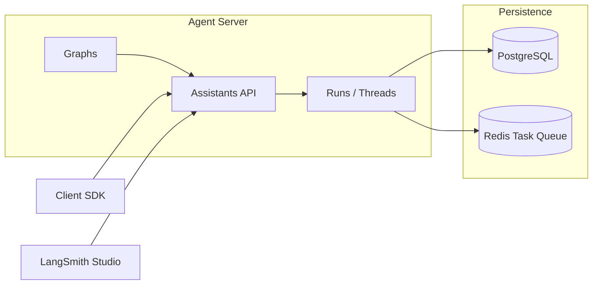
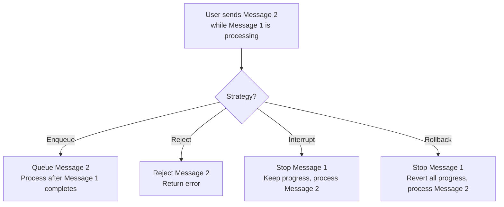

# LangSmith Deployment

## Introduction

LangSmith Deployment (formerly LangGraph Platform) is a managed infrastructure service purpose-built for deploying and running agent applications. Instead of configuring Docker, Kubernetes, databases, and task queues yourself, LangSmith Deployment provides all of these out of the box — with features specifically designed for agent workloads like double-texting handling, cron job scheduling, and built-in conversation persistence.

In this lesson, we explore the Agent Server architecture, deploy a LangGraph application, configure cron jobs for scheduled agents, and handle the double-texting problem that occurs when users send multiple messages before an agent finishes processing.

### What we'll cover

- Agent Server architecture and deployment workflow
- Application structure and configuration
- Assistants API for agent management
- Cron jobs for scheduled agent runs
- Double-texting strategies (enqueue, reject, interrupt, rollback)
- Deployment options (cloud, hybrid, self-hosted)

### Prerequisites

- LangGraph agent development (Lesson 12)
- Docker fundamentals (Lesson 19-01)
- LangSmith account ([smith.langchain.com](https://smith.langchain.com))

---

## Agent Server architecture

The Agent Server is the runtime that hosts your graphs and provides APIs for interacting with them. Each deployment consists of three components:



| Component | Purpose |
|-----------|---------|
| **Graphs** | Your agent logic (LangGraph `StateGraph` or any framework) |
| **Assistants** | A graph paired with specific configuration (model, tools, prompts) |
| **Threads** | Conversation contexts with persistent state |
| **Runs** | Individual agent executions within a thread |
| **PostgreSQL** | Persists threads, checkpoints, and state |
| **Redis** | Task queue for managing concurrent runs |

---

## Application structure

LangSmith Deployment expects a specific project structure:

```
my-agent/
├── src/
│   └── agent/
│       ├── __init__.py
│       └── graph.py       # Your LangGraph application
├── langgraph.json         # Deployment configuration
├── requirements.txt       # Python dependencies
└── .env                   # Environment variables
```

### The graph

```python
# src/agent/graph.py
from langgraph.graph import StateGraph, MessagesState, START, END
from langchain_openai import ChatOpenAI

model = ChatOpenAI(model="gpt-4o-mini")

def chatbot(state: MessagesState):
    response = model.invoke(state["messages"])
    return {"messages": [response]}

# Build the graph
graph_builder = StateGraph(MessagesState)
graph_builder.add_node("chatbot", chatbot)
graph_builder.add_edge(START, "chatbot")
graph_builder.add_edge("chatbot", END)

graph = graph_builder.compile()
```

### Deployment configuration

```json
// langgraph.json
{
  "dependencies": ["."],
  "graphs": {
    "agent": "./src/agent/graph.py:graph"
  },
  "env": ".env"
}
```

The `graphs` field maps graph names to their Python import paths. The format is `path/to/file.py:variable_name`.

---

## Deploying to LangSmith

### Local testing first

```bash
# Install the CLI
pip install langgraph-cli

# Test locally
langgraph dev
```

**Output:**
```
Ready!
- API: http://localhost:2024
- Docs: http://localhost:2024/docs
- LangGraph Studio: https://smith.langchain.com/studio/?baseUrl=http://127.0.0.1:2024
```

### Cloud deployment

```bash
# Deploy to LangSmith Cloud (from GitHub repo)
# 1. Push your code to GitHub
# 2. In LangSmith UI: Deployments → New Deployment → Select repo
# 3. Configure environment variables
# 4. Deploy
```

### Deployment options

| Option | Infrastructure | Management | Plan |
|--------|---------------|------------|------|
| **Cloud** | LangSmith-managed | Fully managed | All plans |
| **Hybrid** | Your cloud, LangSmith control plane | Docker images, deploy via UI | Enterprise |
| **Self-hosted** | Fully self-managed | Full control, full responsibility | Enterprise |
| **Standalone** | Your infrastructure | No control plane, direct deployment | Any |

---

## Interacting with deployed agents

### Using the SDK

```python
from langgraph_sdk import get_client

# Connect to the deployed agent
client = get_client(url="https://your-deployment.langsmith.dev")

# Create a thread (conversation context)
thread = await client.threads.create()
print(f"Thread ID: {thread['thread_id']}")

# Run the agent
result = await client.runs.create(
    thread["thread_id"],
    assistant_id="agent",
    input={"messages": [{"role": "user", "content": "What is AI?"}]},
)

# Get the result
state = await client.threads.get_state(thread["thread_id"])
messages = state["values"]["messages"]
print(f"Agent: {messages[-1].content}")
```

**Output:**
```
Thread ID: 9dde5490-2b67-47c8-aa14-4bfec88af217
Agent: AI (Artificial Intelligence) refers to the simulation of human intelligence...
```

### Streaming responses

```python
# Stream the agent's response
async for event in client.runs.stream(
    thread["thread_id"],
    assistant_id="agent",
    input={"messages": [{"role": "user", "content": "Explain ML in 3 sentences."}]},
):
    if event.event == "values":
        messages = event.data.get("messages", [])
        if messages:
            print(messages[-1].content)
```

---

## Cron jobs

Cron jobs run agents on a schedule — perfect for daily reports, periodic data gathering, or recurring analysis tasks.

### Creating a cron job

```python
from langgraph_sdk import get_client

client = get_client(url="https://your-deployment.langsmith.dev")

# Create a thread for the cron job
thread = await client.threads.create()

# Schedule: run at 8:00 AM UTC every weekday
cron_job = await client.crons.create_for_thread(
    thread["thread_id"],
    assistant_id="agent",
    schedule="0 8 * * 1-5",    # cron expression (UTC)
    input={
        "messages": [{
            "role": "user",
            "content": "Generate today's AI news summary.",
        }],
    },
)

print(f"Cron ID: {cron_job['cron_id']}")
```

### Stateless cron jobs

Stateless crons create a new thread for each execution — useful when runs are independent:

```python
# Stateless: new thread each time
cron_job = await client.crons.create(
    assistant_id="agent",
    schedule="0 8 * * *",      # 8:00 AM UTC daily
    input={
        "messages": [{
            "role": "user",
            "content": "What's the weather forecast?",
        }],
    },
    on_run_completed="keep",   # Keep threads for retrieval (default: "delete")
)

# Later: retrieve results from past runs
runs = await client.runs.search(
    metadata={"cron_id": cron_job["cron_id"]}
)
```

### Managing cron jobs

```python
# List all cron jobs
crons = await client.crons.search()
for cron in crons:
    print(f"  {cron['cron_id']}: {cron['schedule']}")

# Delete a cron job (important — prevents unwanted API charges!)
await client.crons.delete(cron_job["cron_id"])
```

> **Warning:** Always delete cron jobs you no longer need. Each execution calls your LLM API, which incurs costs even when no one is watching.

### Common cron expressions

| Expression | Schedule |
|-----------|----------|
| `0 8 * * *` | Daily at 8:00 AM UTC |
| `0 8 * * 1-5` | Weekdays at 8:00 AM UTC |
| `*/30 * * * *` | Every 30 minutes |
| `0 0 * * 0` | Weekly on Sunday at midnight |
| `0 9 1 * *` | First day of each month at 9:00 AM |

---

## Double-texting strategies

Double-texting occurs when a user sends a second message before the agent finishes processing the first. LangSmith Deployment provides four strategies:



| Strategy | Behavior | Best For |
|----------|----------|----------|
| **Enqueue** (default) | Queue the new run, process after current finishes | Most applications — preserves all messages |
| **Reject** | Reject the new run with an error | When parallel runs must be prevented |
| **Interrupt** | Stop current run, keep progress, start new run | Chat UIs where users "correct" their prompt |
| **Rollback** | Stop current run, revert all progress, start new run | When partial state would cause issues |

### Configuring double-texting

```python
# Enqueue (default) — no special configuration needed
result = await client.runs.create(
    thread_id,
    assistant_id="agent",
    input={"messages": [{"role": "user", "content": "New message"}]},
    # multitask_strategy="enqueue"  # This is the default
)

# Reject concurrent runs
result = await client.runs.create(
    thread_id,
    assistant_id="agent",
    input={"messages": [{"role": "user", "content": "New message"}]},
    multitask_strategy="reject",
)

# Interrupt current run
result = await client.runs.create(
    thread_id,
    assistant_id="agent",
    input={"messages": [{"role": "user", "content": "Actually, I meant..."}]},
    multitask_strategy="interrupt",
)

# Rollback and start fresh
result = await client.runs.create(
    thread_id,
    assistant_id="agent",
    input={"messages": [{"role": "user", "content": "Start over"}]},
    multitask_strategy="rollback",
)
```

---

## Best practices

| Practice | Why It Matters |
|----------|----------------|
| Test locally with `langgraph dev` first | Catches issues before cloud deployment |
| Use `enqueue` as default double-texting strategy | Preserves all user messages without data loss |
| Always delete unused cron jobs | Prevents unwanted API costs |
| Pin dependency versions in `requirements.txt` | Reproducible deployments |
| Use threads for conversation context | Built-in persistence, no external state store needed |
| Monitor deployments in LangSmith Studio | Visual debugging, real-time interaction |

---

## Common pitfalls

| ❌ Mistake | ✅ Solution |
|-----------|-------------|
| Forgetting to delete cron jobs | Always `client.crons.delete()` when done; set up cleanup scripts |
| Using `rollback` when you need `interrupt` | Rollback discards progress; interrupt preserves it |
| Not testing locally before deploying | Use `langgraph dev` for fast iteration |
| Hardcoding configuration in graph code | Use `langgraph.json` env settings and environment variables |
| Ignoring the task queue | Long-running agents need proper queue-based execution |
| Not using the Assistants API | Assistants let you reuse graphs with different configs |

---

## Hands-on exercise

### Your task

Set up a LangGraph application for deployment with proper configuration, test it locally, and create a cron job schedule.

### Requirements

1. Create a LangGraph `StateGraph` with at least two nodes
2. Write a `langgraph.json` configuration file
3. Test locally with `langgraph dev` (or simulate the structure)
4. Write SDK code to create a thread, run the agent, and set up a cron job
5. Demonstrate the `interrupt` double-texting strategy

### Expected result

A properly structured project that can be deployed to LangSmith, with a cron job running daily and double-texting handled via interrupt.

<details>
<summary>💡 Hints (click to expand)</summary>

- The graph export format in `langgraph.json` is `path/to/file.py:variable_name`
- Use `MessagesState` for simple chat agents
- Cron expressions are in UTC — convert your local time
- The `langgraph-sdk` package provides the `get_client` function

</details>

<details>
<summary>✅ Solution (click to expand)</summary>

```python
# src/agent/graph.py
from langgraph.graph import StateGraph, MessagesState, START, END
from langchain_openai import ChatOpenAI

model = ChatOpenAI(model="gpt-4o-mini")

def router(state: MessagesState):
    last_msg = state["messages"][-1].content.lower()
    if "search" in last_msg:
        return "search"
    return "respond"

def search_node(state: MessagesState):
    return {"messages": [{"role": "assistant", "content": "Search result: ..."}]}

def respond_node(state: MessagesState):
    response = model.invoke(state["messages"])
    return {"messages": [response]}

builder = StateGraph(MessagesState)
builder.add_node("search", search_node)
builder.add_node("respond", respond_node)
builder.add_conditional_edges(START, router)
builder.add_edge("search", END)
builder.add_edge("respond", END)

graph = builder.compile()
```

```json
// langgraph.json
{
  "dependencies": ["."],
  "graphs": {
    "agent": "./src/agent/graph.py:graph"
  },
  "env": ".env"
}
```

```python
# deploy_and_test.py
from langgraph_sdk import get_client

async def main():
    client = get_client(url="http://localhost:2024")
    
    # Create thread and run
    thread = await client.threads.create()
    await client.runs.create(
        thread["thread_id"],
        assistant_id="agent",
        input={"messages": [{"role": "user", "content": "Hello!"}]},
    )
    
    # Cron job
    cron = await client.crons.create(
        assistant_id="agent",
        schedule="0 8 * * *",
        input={"messages": [{"role": "user", "content": "Daily summary"}]},
    )
    print(f"Cron: {cron['cron_id']}")
```

</details>

### Bonus challenges

- [ ] Create multiple assistants from the same graph with different configurations
- [ ] Implement a webhook that triggers on run completion
- [ ] Set up thread TTL to auto-cleanup old conversations

---

## Summary

✅ **Agent Server** provides purpose-built infrastructure with graphs, assistants, threads, and runs  
✅ **Deployment options** range from fully managed cloud to self-hosted — use `langgraph.json` for configuration  
✅ **Cron jobs** schedule agents for periodic tasks — always delete when no longer needed  
✅ **Double-texting** strategies (enqueue, reject, interrupt, rollback) handle concurrent user input gracefully  
✅ **LangSmith Studio** provides visual debugging and real-time agent interaction  

**Previous:** [Serverless Agent Hosting](./03-serverless-agent-hosting.md)  
**Next:** [Agent Scaling Patterns](./05-agent-scaling-patterns.md)  
**Back to:** [Agent Deployment Strategies](./00-agent-deployment-strategies.md)

---

## Further Reading

- [LangSmith Deployment Docs](https://docs.langchain.com/langsmith/deployments) — Official deployment guide
- [Agent Server API Reference](https://docs.langchain.com/langsmith/server-api-ref) — API endpoints
- [Cron Jobs Guide](https://docs.langchain.com/langsmith/cron-jobs) — Scheduled agent runs
- [Double-Texting Docs](https://docs.langchain.com/langsmith/double-texting) — Concurrent run handling

<!--
Sources Consulted:
- LangSmith Deployment: https://docs.langchain.com/langsmith/deployments
- Agent Server: https://docs.langchain.com/langsmith/langgraph-server
- Cron jobs: https://docs.langchain.com/langsmith/cron-jobs
- Double-texting: https://docs.langchain.com/langsmith/double-texting
- LangGraph Platform: https://www.langchain.com/langgraph-platform
-->
