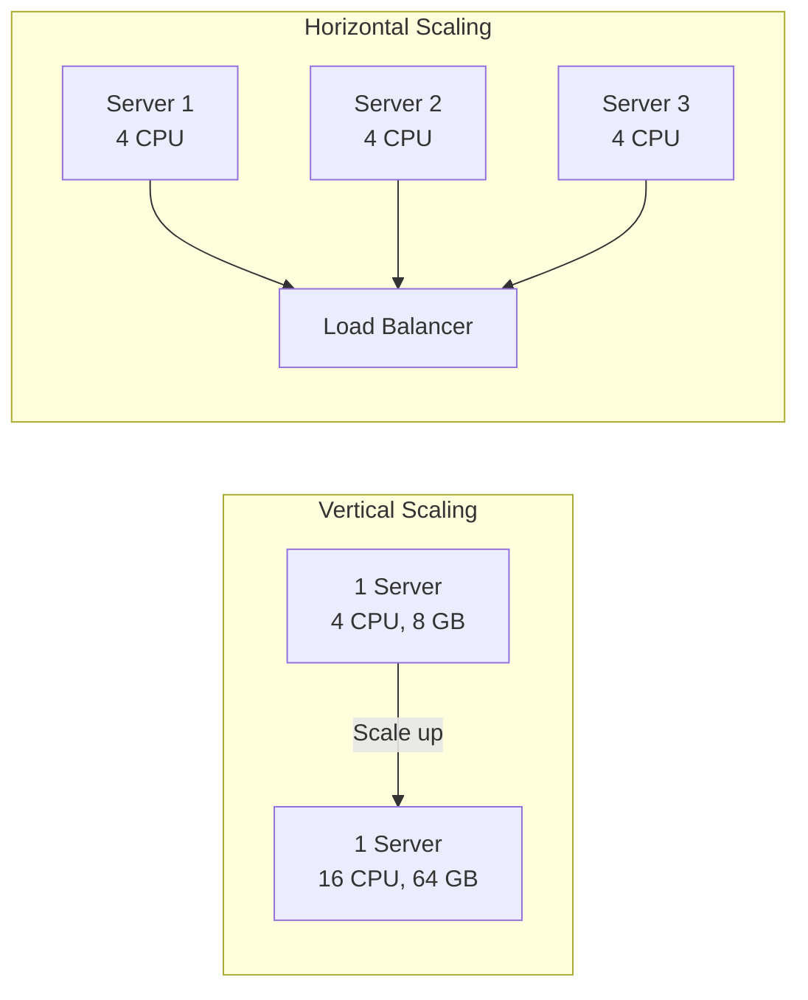
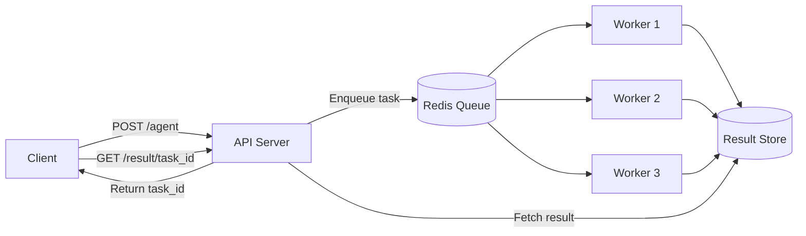

# Agent Scaling Patterns

## Introduction

An agent that works for one user often collapses under 100 concurrent users. Scaling agents is harder than scaling traditional web APIs because each agent request may run for 30 seconds to 5 minutes, make multiple external API calls, and consume unpredictable amounts of memory. The strategies in this lesson — queue-based processing, horizontal scaling, rate limiting, and connection pooling — keep agents responsive and reliable as traffic grows.

In this lesson, we implement production scaling patterns that handle bursty traffic, long-running requests, and expensive external API calls without overwhelming your infrastructure or your API budget.

### What we'll cover

- Horizontal vs. vertical scaling for agents
- Queue-based processing with Redis and Celery
- Load balancing strategies for long-running requests
- Rate limiting to control API costs
- Connection pooling for external services
- Auto-scaling configuration

### Prerequisites

- Docker and container deployment (Lesson 19-01)
- Kubernetes fundamentals (Lesson 19-02)
- Basic understanding of message queues

---

## Horizontal vs. vertical scaling

| Approach | How It Works | Best For | Limitation |
|----------|-------------|----------|------------|
| **Vertical** | Add more CPU/RAM to one machine | Quick fix, local models | Single point of failure |
| **Horizontal** | Add more machines/pods | Production, API-calling agents | Needs state management |



For API-calling agents, **horizontal scaling is almost always the right choice**. Each agent request is I/O-bound (waiting on LLM API responses), so adding more instances handles more concurrent users without needing larger machines.

---

## Queue-based processing

Agents should not run synchronously inside the web request. A request that takes 60 seconds blocks the web worker and reduces throughput. Instead, use a task queue: the API server accepts requests immediately and workers process them in the background.

### Architecture



### Implementation with Celery

```python
# tasks.py
from celery import Celery
from openai import OpenAI

app = Celery("agent_tasks", broker="redis://redis:6379/0", backend="redis://redis:6379/1")

client = OpenAI()

@app.task(bind=True, max_retries=3, default_retry_delay=30)
def run_agent(self, message: str, session_id: str) -> dict:
    """Run an agent as a background task."""
    try:
        response = client.chat.completions.create(
            model="gpt-4o-mini",
            messages=[
                {"role": "system", "content": "You are a helpful assistant."},
                {"role": "user", "content": message},
            ],
        )
        
        return {
            "response": response.choices[0].message.content,
            "tokens": response.usage.total_tokens,
            "session_id": session_id,
        }
    
    except Exception as exc:
        self.retry(exc=exc)
```

### API server with task submission

```python
# main.py
from fastapi import FastAPI
from celery.result import AsyncResult
from tasks import run_agent

app = FastAPI()

@app.post("/agent")
async def submit_agent_task(message: str, session_id: str = "default"):
    """Submit an agent task and return immediately."""
    task = run_agent.delay(message, session_id)
    return {"task_id": task.id, "status": "queued"}

@app.get("/result/{task_id}")
async def get_result(task_id: str):
    """Check the result of an agent task."""
    result = AsyncResult(task_id)
    
    if result.ready():
        return {"status": "complete", "result": result.get()}
    elif result.failed():
        return {"status": "failed", "error": str(result.result)}
    else:
        return {"status": "processing"}
```

**Output (submit):**
```json
{"task_id": "a1b2c3d4-e5f6-7890-abcd-ef1234567890", "status": "queued"}
```

**Output (result — processing):**
```json
{"status": "processing"}
```

**Output (result — complete):**
```json
{
  "status": "complete",
  "result": {
    "response": "AI stands for Artificial Intelligence...",
    "tokens": 156,
    "session_id": "default"
  }
}
```

### Worker scaling

```bash
# Start workers (scale to demand)
celery -A tasks worker --concurrency=4 --loglevel=info     # Worker 1
celery -A tasks worker --concurrency=4 --loglevel=info     # Worker 2
celery -A tasks worker --concurrency=4 --loglevel=info     # Worker 3
```

| Parameter | Value | Effect |
|-----------|-------|--------|
| `--concurrency` | 4 | 4 tasks run in parallel per worker |
| Workers × concurrency | 3 × 4 = 12 | 12 concurrent agent runs |

---

## Rate limiting

Without rate limits, a traffic spike can exhaust your LLM API quota, incur massive costs, or hit provider rate limits that degrade service for everyone.

### Token bucket rate limiter

```python
import time
import asyncio
from dataclasses import dataclass, field

@dataclass
class TokenBucketLimiter:
    """Rate limiter using the token bucket algorithm."""
    
    rate: float           # Tokens added per second
    max_tokens: float     # Maximum bucket capacity
    tokens: float = field(init=False)
    last_refill: float = field(init=False)
    
    def __post_init__(self):
        self.tokens = self.max_tokens
        self.last_refill = time.monotonic()
    
    def _refill(self):
        now = time.monotonic()
        elapsed = now - self.last_refill
        self.tokens = min(self.max_tokens, self.tokens + elapsed * self.rate)
        self.last_refill = now
    
    async def acquire(self, tokens: int = 1) -> bool:
        """Try to acquire tokens. Returns True if allowed."""
        self._refill()
        if self.tokens >= tokens:
            self.tokens -= tokens
            return True
        return False
    
    async def wait_and_acquire(self, tokens: int = 1):
        """Wait until tokens are available, then acquire."""
        while True:
            self._refill()
            if self.tokens >= tokens:
                self.tokens -= tokens
                return
            wait_time = (tokens - self.tokens) / self.rate
            await asyncio.sleep(wait_time)

# Configure: 10 requests per second, burst up to 20
limiter = TokenBucketLimiter(rate=10.0, max_tokens=20.0)
```

### FastAPI rate limiting middleware

```python
# middleware.py
from fastapi import Request, HTTPException

async def rate_limit_middleware(request: Request, call_next):
    """Rate limit incoming requests."""
    if not await limiter.acquire():
        raise HTTPException(
            status_code=429,
            detail="Rate limit exceeded. Try again later.",
            headers={"Retry-After": "5"},
        )
    return await call_next(request)
```

### Per-user rate limiting with Redis

```python
import redis.asyncio as redis

redis_client = redis.from_url("redis://localhost:6379")

async def check_user_rate_limit(user_id: str, limit: int = 60, window: int = 3600) -> bool:
    """Allow `limit` requests per user per `window` seconds."""
    key = f"rate_limit:{user_id}"
    
    pipe = redis_client.pipeline()
    pipe.incr(key)
    pipe.expire(key, window)
    count, _ = await pipe.execute()
    
    return count <= limit

# Usage in endpoint
@app.post("/agent")
async def agent_endpoint(request: AgentRequest):
    if not await check_user_rate_limit(request.user_id, limit=60, window=3600):
        raise HTTPException(429, "Rate limit: 60 requests per hour")
    
    task = run_agent.delay(request.message, request.session_id)
    return {"task_id": task.id}
```

---

## Connection pooling

Each agent request may call multiple external APIs. Without connection pooling, every request opens a new TCP connection — slow and wasteful.

```python
import httpx
from openai import AsyncOpenAI

# ✅ Shared client with connection pooling
http_client = httpx.AsyncClient(
    timeout=httpx.Timeout(60.0),
    limits=httpx.Limits(
        max_connections=100,         # Total connections
        max_keepalive_connections=20, # Keep-alive connections
    ),
)

openai_client = AsyncOpenAI(http_client=http_client)

# ❌ Bad: new client per request
async def bad_handler(message):
    client = AsyncOpenAI()  # New connection each time
    return await client.chat.completions.create(...)

# ✅ Good: shared client
async def good_handler(message):
    return await openai_client.chat.completions.create(
        model="gpt-4o-mini",
        messages=[{"role": "user", "content": message}],
    )
```

### Connection pool sizing

| Workload | `max_connections` | `max_keepalive_connections` |
|----------|-------------------|---------------------------|
| Low traffic (< 10 req/s) | 20 | 5 |
| Medium traffic (10–100 req/s) | 100 | 20 |
| High traffic (100+ req/s) | 500 | 50 |

---

## Auto-scaling configuration

### Kubernetes HPA with custom metrics

For agents, CPU-based scaling alone isn't enough. Queue depth is often a better scaling signal:

```yaml
# k8s/hpa-custom.yaml
apiVersion: autoscaling/v2
kind: HorizontalPodAutoscaler
metadata:
  name: agent-worker-hpa
spec:
  scaleTargetRef:
    apiVersion: apps/v1
    kind: Deployment
    name: agent-worker
  minReplicas: 2
  maxReplicas: 20
  metrics:
    # Scale on CPU
    - type: Resource
      resource:
        name: cpu
        target:
          type: Utilization
          averageUtilization: 60
    # Scale on queue depth (custom metric)
    - type: External
      external:
        metric:
          name: celery_queue_length
        target:
          type: AverageValue
          averageValue: "5"
  behavior:
    scaleUp:
      stabilizationWindowSeconds: 30
      policies:
        - type: Pods
          value: 4
          periodSeconds: 60
    scaleDown:
      stabilizationWindowSeconds: 300
      policies:
        - type: Pods
          value: 1
          periodSeconds: 120
```

| Scaling Signal | Threshold | Action |
|---------------|-----------|--------|
| CPU > 60% | Scale up 4 pods / minute | Handle compute-heavy agents |
| Queue depth > 5 per worker | Scale up 4 pods / minute | Clear queue backlog |
| CPU < 20% for 5 min | Scale down 1 pod / 2 min | Reduce idle cost |

---

## Best practices

| Practice | Why It Matters |
|----------|----------------|
| Use queue-based processing | Decouples intake from execution; handles bursts gracefully |
| Rate limit per user, not just globally | Prevents one user from consuming all capacity |
| Pool external connections | Reuses TCP connections; reduces latency and socket exhaustion |
| Scale on queue depth, not just CPU | Agent CPU usage is low (I/O-bound); queue depth reflects real demand |
| Set max replicas as a cost ceiling | Prevents auto-scaling from creating a budget crisis |
| Return task IDs, not blocking responses | Client polls for results; server handles more concurrent requests |

---

## Common pitfalls

| ❌ Mistake | ✅ Solution |
|-----------|-------------|
| Running agents synchronously in the web handler | Use a task queue (Celery, Redis Queue) for background processing |
| No rate limiting | Add per-user rate limits with Redis |
| Creating new HTTP clients per request | Use shared `httpx.AsyncClient` or `AsyncOpenAI` with connection pooling |
| Scaling on CPU only | Add queue depth or request latency as scaling signals |
| No max replicas on auto-scaler | Set `maxReplicas` to prevent unbounded scaling costs |
| Aggressive scale-down | Use 5-minute stabilization window; agents run long |

---

## Hands-on exercise

### Your task

Build a queue-based agent API with rate limiting and connection pooling.

### Requirements

1. Create a Celery task that runs an agent with automatic retries
2. Build a FastAPI API with `/agent` (submit) and `/result/{task_id}` (poll) endpoints
3. Implement per-user rate limiting using Redis (60 requests/hour)
4. Use a shared `AsyncOpenAI` client with connection pooling
5. Test by submitting 5 requests and polling for results

### Expected result

Requests are accepted immediately with a `task_id`, workers process them in background, and results are retrievable by polling.

<details>
<summary>💡 Hints (click to expand)</summary>

- Use `celery.delay()` for async task submission
- `AsyncResult(task_id).ready()` checks if a task is complete
- Redis `INCR` + `EXPIRE` implements a simple rate counter
- `httpx.AsyncClient(limits=...)` configures connection pooling

</details>

<details>
<summary>✅ Solution (click to expand)</summary>

```python
# tasks.py
from celery import Celery
from openai import OpenAI

app = Celery("tasks", broker="redis://localhost:6379/0", backend="redis://localhost:6379/1")
client = OpenAI()

@app.task(bind=True, max_retries=3)
def run_agent(self, message: str) -> dict:
    try:
        r = client.chat.completions.create(
            model="gpt-4o-mini",
            messages=[{"role": "user", "content": message}],
        )
        return {"response": r.choices[0].message.content, "tokens": r.usage.total_tokens}
    except Exception as exc:
        self.retry(exc=exc, countdown=30)
```

```python
# main.py
from fastapi import FastAPI, HTTPException
from celery.result import AsyncResult
from tasks import run_agent
import redis

app = FastAPI()
r = redis.Redis()

@app.post("/agent")
async def submit(message: str, user_id: str = "anon"):
    key = f"rl:{user_id}"
    count = r.incr(key)
    r.expire(key, 3600)
    if count > 60:
        raise HTTPException(429, "Rate limit exceeded")
    task = run_agent.delay(message)
    return {"task_id": task.id}

@app.get("/result/{task_id}")
async def result(task_id: str):
    res = AsyncResult(task_id)
    if res.ready():
        return {"status": "complete", "result": res.get()}
    return {"status": "processing"}
```

</details>

### Bonus challenges

- [ ] Add priority queues (high-priority users get processed first)
- [ ] Implement WebSocket streaming for real-time progress updates
- [ ] Add circuit breaker pattern for external API failures

---

## Summary

✅ **Queue-based processing** decouples request intake from agent execution — handle bursts gracefully  
✅ **Rate limiting** with Redis prevents cost overruns and ensures fair usage across users  
✅ **Connection pooling** reuses TCP connections for external APIs, reducing latency and socket exhaustion  
✅ **Auto-scaling on queue depth** responds to actual demand, not just CPU utilization  
✅ **Horizontal scaling** with multiple workers handles I/O-bound agent workloads efficiently  

**Previous:** [LangSmith Deployment](./04-langsmith-deployment.md)  
**Next:** [Production Infrastructure](./06-production-infrastructure.md)  
**Back to:** [Agent Deployment Strategies](./00-agent-deployment-strategies.md)

---

## Further Reading

- [Celery Documentation](https://docs.celeryq.dev/) — Distributed task queue
- [Redis Rate Limiting](https://redis.io/glossary/rate-limiting/) — Rate limiting patterns
- [HTTPX Connection Pooling](https://www.python-httpx.org/advanced/clients/) — Async HTTP client configuration
- [Kubernetes HPA](https://kubernetes.io/docs/tasks/run-application/horizontal-pod-autoscale/) — Auto-scaling pods

<!--
Sources Consulted:
- Celery docs: https://docs.celeryq.dev/
- Redis rate limiting: https://redis.io/glossary/rate-limiting/
- HTTPX advanced: https://www.python-httpx.org/advanced/clients/
- Kubernetes HPA: https://kubernetes.io/docs/tasks/run-application/horizontal-pod-autoscale/
-->
