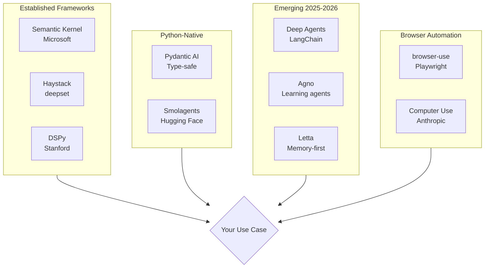

# Additional Frameworks & Tools

## Overview

The agent framework landscape extends far beyond the five major SDKs covered in Lessons 11-15 (OpenAI Agents SDK, LangGraph, CrewAI, AutoGen, Google ADK). A rich ecosystem of specialized frameworks addresses specific needs — from enterprise plugin architectures to declarative prompt optimization, type-safe development, browser automation, and self-improving memory agents.

This lesson surveys the broader landscape so you can match the right tool to each problem.

### Lessons in this section

| # | Lesson | Focus |
|---|--------|-------|
| 01 | [Established Frameworks](./01-established-frameworks.md) | Semantic Kernel, Haystack, DSPy |
| 02 | [Python-Native Frameworks](./02-python-native-frameworks.md) | Pydantic AI, Smolagents |
| 03 | [Emerging Frameworks](./03-emerging-frameworks.md) | Deep Agents, Agno, Letta |
| 04 | [Browser Automation Agents](./04-browser-automation-agents.md) | browser-use, Playwright MCP, Stagehand |
| 05 | [Framework Selection Guide](./05-framework-selection-guide.md) | Decision flowcharts, comparison matrices |

### Framework landscape (January 2026)

### Framework comparison

| Framework | Language | Focus | GitHub Stars | Best For |
|-----------|----------|-------|-------------|----------|
| **Semantic Kernel** | C#, Python, Java | Enterprise plugins | 22k+ | Azure/.NET enterprises |
| **Haystack** | Python | Pipelines & RAG | 18k+ | Production RAG systems |
| **DSPy** | Python | Declarative LM programming | 32k+ | Prompt optimization |
| **Pydantic AI** | Python | Type-safe agents | 15k+ | Validated structured output |
| **Smolagents** | Python | Lightweight code agents | 15k+ | Quick prototyping |
| **Deep Agents** | Python | Multi-step planning | 8k+ | Claude Code-like workflows |
| **Agno** | Python | Learning multi-agent | 37k+ | High-performance systems |
| **Letta** | Python, TS | Memory-first agents | 21k+ | Self-improving assistants |
| **browser-use** | Python | Browser automation | 76k+ | Web automation tasks |

### Key concepts

| Concept | Description |
|---------|-------------|
| **Plugin architecture** | Modular functions exposed to the AI kernel (Semantic Kernel pattern) |
| **Pipeline design** | Composable component chains with typed I/O (Haystack pattern) |
| **Declarative programming** | Define behavior as signatures, not prompt strings (DSPy pattern) |
| **Code agents** | Agents that write Python code as actions instead of JSON tool calls |
| **Learning agents** | Agents that improve across sessions via persistent memory |
| **Browser automation** | AI-driven web interaction through Playwright or CDP |
| **Prompt optimization** | Automatic tuning of prompts using training data and metrics |

### Prerequisites

- Agent fundamentals (Lessons 01-10)
- Familiarity with at least one major framework (Lessons 11-15)
- Python async/await proficiency

---

**Previous:** [Agent Deployment Strategies](../19-agent-deployment-strategies/00-agent-deployment-strategies.md)  
**Next:** [Agent Testing Strategies](../21-agent-testing-strategies.md)

---

## Further Reading

- [Semantic Kernel Documentation](https://learn.microsoft.com/en-us/semantic-kernel/) — Microsoft's enterprise AI SDK
- [Haystack Documentation](https://docs.haystack.deepset.ai/) — Pipeline-based AI framework
- [DSPy](https://dspy.ai/) — Declarative LM programming
- [Pydantic AI](https://ai.pydantic.dev/) — Type-safe agent framework
- [Smolagents](https://huggingface.co/docs/smolagents/) — HuggingFace lightweight agents
- [Deep Agents](https://docs.langchain.com/oss/python/deepagents/overview) — LangChain deep agent harness
- [Agno](https://docs.agno.com/) — Learning multi-agent platform
- [Letta](https://docs.letta.com/) — Stateful memory-first agents
- [browser-use](https://docs.browser-use.com/) — AI browser automation

<!--
Sources Consulted:
- Semantic Kernel: https://learn.microsoft.com/en-us/semantic-kernel/overview/
- Haystack: https://docs.haystack.deepset.ai/docs/intro
- DSPy: https://dspy.ai/
- Pydantic AI: https://ai.pydantic.dev/
- Smolagents: https://huggingface.co/docs/smolagents/en/index
- Deep Agents: https://docs.langchain.com/oss/python/deepagents/overview
- Agno: https://docs.agno.com/introduction
- Letta: https://docs.letta.com/introduction
- browser-use: https://docs.browser-use.com/quickstart
-->
