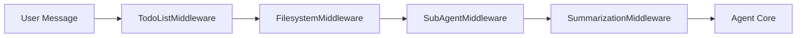
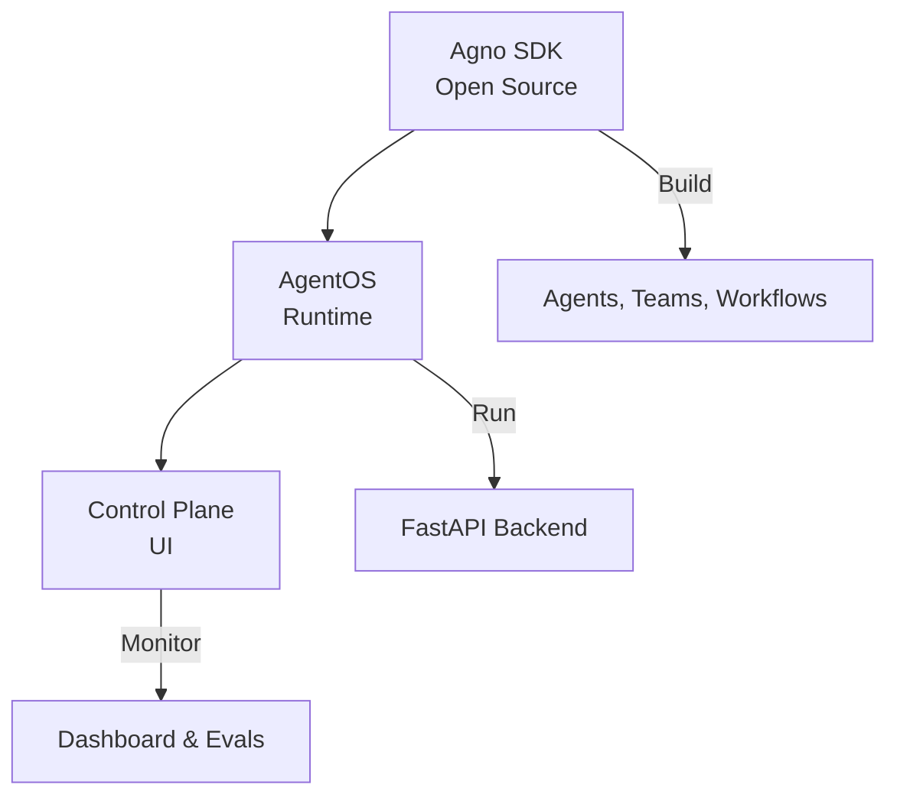
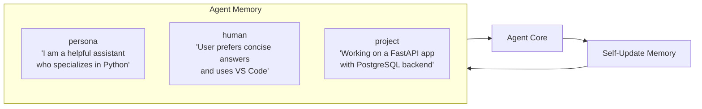

# Emerging Frameworks

## Introduction

The agent landscape evolved dramatically in 2025-2026, producing three frameworks that each pioneered a new paradigm: **Deep Agents** from LangChain introduced middleware-based extensibility inspired by Claude Code, **Agno** built the fastest agent framework with built-in learning across sessions, and **Letta** (formerly MemGPT) made memory a first-class architectural concern.

These frameworks are production-ready despite their recent origins, each backed by strong communities and rapid release cycles.

### What we'll cover

- Deep Agents' middleware architecture and subagent spawning
- Agno's learning agents and high-performance multi-agent teams
- Letta's memory-first agents that self-improve over time
- When to choose each emerging framework

### Prerequisites

- Agent fundamentals (Lessons 01-10)
- LangGraph basics helpful for Deep Agents (Lesson 12)
- Understanding of agent memory systems (Lesson 04)

---

## Deep Agents (LangChain)

Deep Agents is LangChain's official harness for building agents that handle complex, multi-step tasks. It uses a **middleware architecture** — each middleware adds a capability (planning, file system, subagents) — and is built on top of LangGraph for durable execution.

### Core concept: create a deep agent

```python
# pip install deepagents
from deepagents import create_deep_agent

def search_web(query: str) -> str:
    """Search the web for information."""
    return f"Results for '{query}': AI frameworks are evolving rapidly in 2026."

def calculate(expression: str) -> str:
    """Evaluate a math expression."""
    return str(eval(expression))

agent = create_deep_agent(
    tools=[search_web, calculate],
    system_prompt="You are a helpful research assistant.",
)

result = agent.invoke(
    {"messages": [{"role": "user", "content": "What is 25 * 4 and what's new in AI?"}]}
)
print(result["messages"][-1].content)
```

**Output:**
```
25 × 4 = 100. In AI news, frameworks are evolving rapidly in 2026 with new
approaches to middleware, learning agents, and memory-first architectures.
```

### Middleware architecture

Middleware layers add capabilities without modifying core agent logic:



| Middleware | Tools Added | Purpose |
|-----------|------------|---------|
| **TodoListMiddleware** | `write_todos`, `read_todos` | Task planning and tracking |
| **FilesystemMiddleware** | `ls`, `read_file`, `write_file`, `edit_file`, `glob`, `grep` | Context management |
| **SubAgentMiddleware** | `task` | Spawn specialized subagents |
| **SummarizationMiddleware** | — | Auto-summarize at 170k tokens |
| **HumanInTheLoopMiddleware** | — | Approval gates via `interrupt_on` |

### Subagent spawning

Deep Agents can spawn child agents for context isolation. The parent agent stays clean while the subagent goes deep on a subtask:

```python
from deepagents import create_deep_agent

# The main agent automatically gets a `task` tool
# that can spawn subagents for focused work
agent = create_deep_agent(
    system_prompt="You are a project manager. Delegate research to subagents.",
    subagents={
        "researcher": {
            "system_prompt": "You are a research specialist. Be thorough.",
            "tools": [search_web],
        },
        "analyst": {
            "system_prompt": "You are a data analyst. Focus on numbers.",
            "tools": [calculate],
        },
    },
)

result = agent.invoke(
    {"messages": [{"role": "user", "content": "Research AI market size and calculate growth rate"}]}
)
```

### Backend options

Deep Agents supports different storage backends:

| Backend | Storage | Use Case |
|---------|---------|----------|
| **StateBackend** | In-memory | Default, ephemeral sessions |
| **FilesystemBackend** | Disk | Real file operations |
| **StoreBackend** | LangGraph Store | Persistent across threads |
| **CompositeBackend** | Hybrid | Route different paths to different backends |

```python
from deepagents import create_deep_agent
from deepagents.backends import FilesystemBackend

agent = create_deep_agent(
    system_prompt="You are a coding assistant.",
    backend=FilesystemBackend(root_dir="/workspace/project"),
)
```

---

## Agno

Agno is a high-performance agent framework designed for **learning agents** — agents that remember users, accumulate knowledge, and improve over time. It claims 529× faster instantiation and 24× lower memory usage than LangGraph.

### Core concept: learning agents

```python
# pip install agno
from agno.agent import Agent
from agno.models.openai import OpenAIResponses

agent = Agent(
    model=OpenAIResponses(id="gpt-4o"),
    learning=True,  # One line — agent now remembers and improves
)
```

> **🔑 Key concept:** `learning=True` enables the agent to accumulate knowledge across conversations. Insights from one user benefit everyone.

### Agent with tools and knowledge

```python
from agno.agent import Agent
from agno.models.openai import OpenAIResponses
from agno.tools.duckduckgo import DuckDuckGoTools
from agno.db.sqlite import SqliteDb

agent = Agent(
    model=OpenAIResponses(id="gpt-4o"),
    tools=[DuckDuckGoTools()],
    db=SqliteDb(db_file="tmp/agents.db"),
    learning=True,
    instructions=[
        "You are a research assistant.",
        "Always cite your sources.",
    ],
    markdown=True,
)

# Run the agent
response = agent.run("What are the latest trends in AI agents?")
print(response.content)
```

**Output:**
```markdown
## Latest Trends in AI Agents (2026)

1. **Learning agents** that improve across sessions
2. **Middleware architectures** for composable capabilities
3. **Memory-first design** for persistent context
...
```

### Multi-agent teams

Agno provides built-in team orchestration:

```python
from agno.agent import Agent
from agno.team import Team
from agno.models.openai import OpenAIResponses

researcher = Agent(
    name="Researcher",
    role="Research specialist",
    model=OpenAIResponses(id="gpt-4o"),
    tools=[DuckDuckGoTools()],
    instructions=["Find accurate, up-to-date information."],
)

writer = Agent(
    name="Writer",
    role="Content writer",
    model=OpenAIResponses(id="gpt-4o"),
    instructions=["Write clear, engaging content based on research."],
)

team = Team(
    agents=[researcher, writer],
    instructions=["Research first, then write."],
)

result = team.run("Write a brief report on quantum computing progress in 2026")
print(result.content)
```

### Three-layer architecture



| Layer | What It Does | Deployment |
|-------|-------------|-----------|
| **Agno SDK** | Build agents, teams, workflows | Open source, `pip install agno` |
| **AgentOS** | Production FastAPI runtime | Self-hosted or cloud |
| **Control Plane** | Monitor, manage, evaluate | Web UI |

### Key differentiators

| Feature | Agno | Other Frameworks |
|---------|------|-----------------|
| **Instantiation speed** | 529× faster than LangGraph | — |
| **Memory usage** | 24× lower | — |
| **Learning** | Built-in, one line | Custom implementation |
| **100+ toolkits** | Built-in | Community plugins |
| **MCP + A2A** | First-class support | Varies |
| **Multimodal** | Native (text, image, audio, video) | Often text-only |

---

## Letta (formerly MemGPT)

Letta makes **memory** the central architectural concern. Born from the MemGPT research project at UC Berkeley, Letta agents have structured memory blocks that persist across sessions, enabling agents that genuinely learn about users and self-improve over time.

### Core concept: memory blocks

Instead of simple chat history, Letta agents maintain labeled memory blocks that the agent itself can read and update:



### Letta Code CLI

The quickest way to use Letta is through the CLI:

```bash
# Install Letta Code CLI
npm install -g @letta-ai/letta-code

# Start a coding session
letta-code
```

### Building with the Letta API

```python
# pip install letta-client
from letta_client import Letta

client = Letta()

# Create an agent with memory blocks
agent = client.agents.create(
    model="openai/gpt-4o",
    instructions="You are a personal assistant. Remember user preferences.",
    memory_blocks=[
        {"label": "human", "value": ""},
        {"label": "persona", "value": "I am a helpful, friendly assistant."},
    ],
)

# Chat with the agent
response = client.agents.messages.create(
    agent_id=agent.id,
    messages=[{"role": "user", "content": "I prefer dark mode and Python over JavaScript."}],
)
print(response.messages[-1].content)
```

**Output:**
```
Got it! I've noted that you prefer dark mode and Python over JavaScript.
I'll keep that in mind for future conversations.
```

> **🤖 AI Context:** The agent didn't just acknowledge the preference — it updated its `human` memory block. The next conversation, even in a new session, will remember this.

### Self-improving agents

Letta agents can update their own instructions based on experience:

```python
# The agent's memory blocks evolve over time:
# Session 1: human = ""
# Session 5: human = "Prefers Python. Uses VS Code. Works on FastAPI projects."
# Session 20: human = "Senior dev. Prefers concise answers with code examples.
#              Uses FastAPI + PostgreSQL. Dark mode. Dislikes verbose explanations."

# The agent genuinely gets better at helping this specific user
```

### Sleep-time agents

Letta introduces **sleep-time processing** — agents that work on their memory between conversations:

```python
# Between sessions, the agent can:
# - Consolidate scattered notes into organized memory
# - Resolve contradictions in memory blocks
# - Generate insights from accumulated knowledge
# - Pre-compute likely next requests
```

### Two deployment paths

| Path | Install | Best For |
|------|---------|----------|
| **Letta Code CLI** | `npm install -g @letta-ai/letta-code` | Terminal-based coding agents |
| **Letta API** | `pip install letta-client` | Building apps with stateful agents |

---

## Comparison: emerging frameworks

| Feature | Deep Agents | Agno | Letta |
|---------|------------|------|-------|
| **Core paradigm** | Middleware extensibility | Learning multi-agent | Memory-first |
| **Best for** | Complex multi-step tasks | High-performance teams | Personalized assistants |
| **Memory** | StoreBackend (LangGraph) | Built-in learning | Memory blocks (core) |
| **Multi-agent** | Subagent spawning | Teams with orchestration | Skills and subagents |
| **Performance** | LangGraph runtime | 529× faster instantiation | Standard |
| **Built on** | LangGraph | Custom framework | Custom framework |
| **Install** | `pip install deepagents` | `pip install agno` | `pip install letta-client` |
| **GitHub stars** | 8k+ | 37k+ | 21k+ |

---

## Best practices

| Practice | Why It Matters |
|----------|----------------|
| Use Deep Agents for Claude Code-like workflows | Middleware + subagents handle long-horizon tasks |
| Use Agno when performance matters | 529× faster instantiation enables real-time systems |
| Use Letta when personalization is key | Memory blocks create agents that truly know users |
| Start with `learning=True` in Agno | One-line addition enables cross-session improvement |
| Design memory block schemas in Letta | Labeled blocks (human, persona, project) organize knowledge |
| Use CompositeBackend in Deep Agents | Hybrid routing balances ephemeral + persistent storage |

---

## Common pitfalls

| ❌ Mistake | ✅ Solution |
|-----------|-------------|
| Using Deep Agents for simple chat | Use `create_agent` from LangChain instead |
| Ignoring Agno's learning feature | Set `learning=True` — it's the framework's key differentiator |
| Treating Letta like a regular chatbot | Design memory blocks intentionally — they're the core feature |
| Not defining subagent roles in Deep Agents | Specialized subagents with clear system prompts work better |
| Skipping Agno's `db` parameter | Without persistence, learning is lost on restart |
| Overloading Letta memory blocks | Keep blocks focused — one concept per block |

---

## Hands-on exercise

### Your task

Build a learning assistant using Agno that remembers user preferences across sessions and uses tools to answer questions.

### Requirements

1. Create an Agno agent with `learning=True` and a SQLite database
2. Add a search tool for answering factual questions
3. Run multiple conversation turns where the agent learns preferences
4. Verify the agent remembers preferences in a new session

### Expected result

The agent provides better, more personalized responses over multiple interactions.

<details>
<summary>💡 Hints (click to expand)</summary>

- Use `SqliteDb(db_file="tmp/agent.db")` for persistent storage
- Add `DuckDuckGoTools()` for web search capability
- Run 3-4 turns telling the agent your preferences, then ask it what it remembers
- The `learning=True` flag handles the rest automatically

</details>

<details>
<summary>✅ Solution (click to expand)</summary>

```python
from agno.agent import Agent
from agno.models.openai import OpenAIResponses
from agno.tools.duckduckgo import DuckDuckGoTools
from agno.db.sqlite import SqliteDb

agent = Agent(
    model=OpenAIResponses(id="gpt-4o-mini"),
    tools=[DuckDuckGoTools()],
    db=SqliteDb(db_file="tmp/learning_agent.db"),
    learning=True,
    instructions=["You are a helpful assistant.", "Remember user preferences."],
)

# Session 1: Teach preferences
agent.run("I prefer Python over JavaScript")
agent.run("I use VS Code with dark theme")
agent.run("I work on FastAPI projects mostly")

# Session 2: Test memory
response = agent.run("What do you know about my preferences?")
print(response.content)
# Should mention: Python, VS Code, dark theme, FastAPI
```

</details>

### Bonus challenges

- [ ] Build a Deep Agents workflow with researcher + writer subagents
- [ ] Create a Letta agent with custom memory blocks for a project management use case
- [ ] Compare Agno team orchestration with CrewAI crews for the same task

---

## Summary

✅ **Deep Agents** provides middleware-based extensibility for complex multi-step tasks with subagent spawning  
✅ **Agno** delivers the fastest agent framework with built-in learning that improves across sessions  
✅ **Letta** makes memory a first-class concern with self-updating memory blocks and sleep-time processing  
✅ Each framework pioneered a new paradigm: middleware, learning, and memory-first  
✅ All three are production-ready with active communities and rapid release cycles  

**Previous:** [Python-Native Frameworks](./02-python-native-frameworks.md)  
**Next:** [Browser Automation Agents](./04-browser-automation-agents.md)  
**Back to:** [Additional Frameworks & Tools](./00-additional-frameworks-tools.md)

---

## Further Reading

- [Deep Agents Documentation](https://docs.langchain.com/oss/python/deepagents/overview) — SDK and CLI reference
- [Deep Agents Middleware Guide](https://docs.langchain.com/oss/python/deepagents/middleware) — Built-in middleware details
- [Agno Documentation](https://docs.agno.com/) — Framework reference and tutorials
- [Agno First Agent Guide](https://docs.agno.com/first-agent) — Getting started
- [Letta Documentation](https://docs.letta.com/) — API and memory architecture
- [Letta Stateful Agents Guide](https://docs.letta.com/guides/core-concepts/stateful-agents/) — Memory blocks in depth

<!--
Sources Consulted:
- Deep Agents: https://docs.langchain.com/oss/python/deepagents/overview
- Agno: https://docs.agno.com/introduction
- Letta: https://docs.letta.com/introduction
- Letta stateful agents: https://docs.letta.com/guides/core-concepts/stateful-agents/
-->
