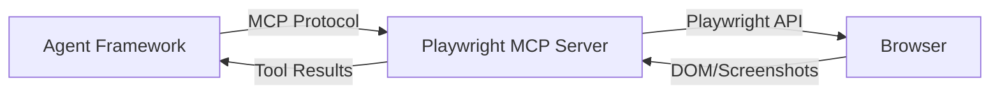
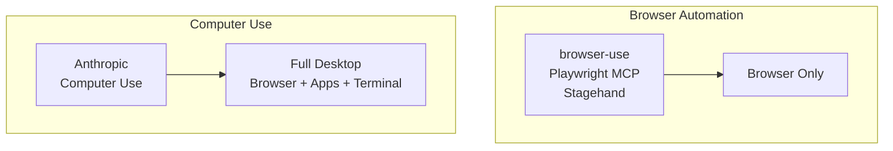

# Browser Automation Agents

## Introduction

Browser automation is one of the most practical agent capabilities: agents that can navigate websites, fill forms, extract data, and complete multi-step web workflows. The 2025-2026 landscape has matured rapidly, with **browser-use** emerging as the dominant open-source solution (76k+ GitHub stars), alongside **Playwright MCP** for tool integration, **Stagehand** for AI-native browser control, and **Anthropic Computer Use** for full desktop automation.

These tools let agents interact with the web the way humans do — clicking, typing, reading — but at scale.

### What we'll cover

- browser-use's agent architecture and sandbox deployment
- Playwright MCP for integrating browsers as agent tools
- Stagehand for AI-native browser control
- Anthropic Computer Use for desktop automation
- Production deployment patterns

### Prerequisites

- Agent tool-calling concepts (Lesson 05)
- Basic understanding of web browsers and HTML
- Python async/await proficiency

---

## browser-use

browser-use is the most widely adopted AI browser automation framework. It makes websites accessible to AI agents using Playwright under the hood, with support for local execution, cloud deployment, and production sandboxing.

### Quick start

```python
# Install
# pip install browser-use
# uvx browser-use install  (installs Chromium)

from browser_use import Agent, ChatBrowserUse
from dotenv import load_dotenv
import asyncio

load_dotenv()

async def main():
    llm = ChatBrowserUse()  # Optimized model for browser tasks
    agent = Agent(
        task="Find the top post on Hacker News and return its title",
        llm=llm,
    )
    result = await agent.run()
    print(result)

asyncio.run(main())
```

**Output:**
```
Show HN: I built an AI browser automation framework
```

### Using different LLMs

```python
from browser_use import Agent
from langchain_openai import ChatOpenAI
from langchain_anthropic import ChatAnthropic

# OpenAI
agent = Agent(
    task="Search for Python tutorials on MDN",
    llm=ChatOpenAI(model="gpt-4o"),
)

# Anthropic
agent = Agent(
    task="Find the latest Python release notes",
    llm=ChatAnthropic(model="claude-sonnet-4-20250514"),
)

result = await agent.run()
```

### Custom browser configuration

```python
from browser_use import Agent, Browser, BrowserConfig, ChatBrowserUse

# Configure browser settings
config = BrowserConfig(
    headless=True,           # Run without visible window
    disable_security=False,  # Keep security features
)

browser = Browser(config=config)

agent = Agent(
    task="Navigate to example.com and extract the page title",
    llm=ChatBrowserUse(),
    browser=browser,
)
result = await agent.run()
await browser.close()
```

### Production deployment with sandbox

For production, browser-use provides a `@sandbox` decorator that handles browser lifecycle, authentication, and cloud execution:

```python
from browser_use import Browser, sandbox, ChatBrowserUse
from browser_use.agent.service import Agent
import asyncio

@sandbox(cloud_profile_id="your-profile-id")
async def scrape_prices(browser: Browser):
    """Production-ready browser task with cloud sandbox."""
    agent = Agent(
        task="Go to amazon.com, search for 'mechanical keyboard', and list top 3 results with prices",
        browser=browser,
        llm=ChatBrowserUse(),
    )
    result = await agent.run()
    return result

asyncio.run(scrape_prices())
```

### Multi-step workflows

```python
from browser_use import Agent, ChatBrowserUse

agent = Agent(
    task="""
    1. Go to github.com/trending
    2. Find the top trending Python repository today
    3. Navigate to that repository
    4. Read the README and summarize what the project does
    5. Return the repo name, stars count, and summary
    """,
    llm=ChatBrowserUse(),
)

result = await agent.run()
print(result)
```

**Output:**
```
Repository: awesome-ai-agents
Stars: 12,400
Summary: A curated list of AI agent frameworks, tools, and resources
organized by category with comparison tables and usage examples.
```

---

## Playwright MCP

Playwright MCP turns a browser into an **MCP tool server**, allowing any MCP-compatible agent to control a browser. This is the integration path for frameworks like OpenAI Agents SDK, LangGraph, or Pydantic AI.

### How it works



### Using with an MCP-compatible agent

```python
# The Playwright MCP server exposes tools like:
# - browser_navigate(url)
# - browser_click(selector)
# - browser_type(selector, text)
# - browser_screenshot()
# - browser_get_text(selector)

# With Pydantic AI:
from pydantic_ai import Agent
from pydantic_ai.mcp import MCPServerStdio

mcp_server = MCPServerStdio("npx", args=["@playwright/mcp@latest"])

agent = Agent(
    "openai:gpt-4o",
    mcp_servers=[mcp_server],
    instructions="You can browse the web using the Playwright tools.",
)

async with agent.run_mcp_servers():
    result = await agent.run("Go to python.org and find the latest version number")
    print(result.output)
```

### Starting the MCP server

```bash
# Run Playwright MCP server
npx @playwright/mcp@latest

# Or with specific browser
npx @playwright/mcp@latest --browser firefox
```

### Available tools

| Tool | Description |
|------|-------------|
| `browser_navigate` | Navigate to a URL |
| `browser_click` | Click an element by selector or text |
| `browser_type` | Type text into an input field |
| `browser_screenshot` | Take a screenshot (returns base64 image) |
| `browser_get_text` | Extract text content from the page |
| `browser_wait` | Wait for an element or condition |
| `browser_select` | Select an option from a dropdown |
| `browser_evaluate` | Execute JavaScript in the page |

---

## Stagehand

Stagehand by Browserbase provides an AI-native browser control layer that translates natural language instructions into Playwright actions. Instead of selectors, you describe what you want in plain English.

### Key concept: natural language selectors

```typescript
// npm install @browserbasehq/stagehand
import { Stagehand } from "@browserbasehq/stagehand";

const stagehand = new Stagehand({
  env: "LOCAL",
  modelName: "gpt-4o",
});

await stagehand.init();
await stagehand.page.goto("https://example.com");

// Act — describe the action in natural language
await stagehand.act("Click the login button");
await stagehand.act("Type 'user@example.com' into the email field");

// Extract — pull structured data from the page
const data = await stagehand.extract({
  instruction: "Get the main heading and first paragraph",
  schema: {
    heading: { type: "string" },
    paragraph: { type: "string" },
  },
});

// Observe — understand what's on the page
const observations = await stagehand.observe("What actions can I take on this page?");
```

### Three core methods

| Method | Purpose | Returns |
|--------|---------|---------|
| `act()` | Perform an action on the page | Action result |
| `extract()` | Pull structured data from the page | Typed data matching schema |
| `observe()` | Understand page state and available actions | List of possible actions |

---

## Anthropic Computer Use

Anthropic's Computer Use goes beyond browser automation — it gives agents control of an entire **desktop environment** through screenshots and mouse/keyboard actions.

### How it differs



### Using Computer Use

```python
import anthropic

client = anthropic.Anthropic()

response = client.messages.create(
    model="claude-sonnet-4-20250514",
    max_tokens=1024,
    tools=[
        {
            "type": "computer_20241022",
            "name": "computer",
            "display_height_px": 768,
            "display_width_px": 1024,
        }
    ],
    messages=[
        {
            "role": "user",
            "content": "Open the terminal and check the Python version installed.",
        }
    ],
)
```

### When Computer Use makes sense

| ✅ Use Computer Use | ✅ Use Browser Automation |
|--------------------|--------------------------|
| Need desktop app interaction | Web-only tasks |
| Terminal + browser combined | Form filling and scraping |
| Legacy apps without APIs | Structured data extraction |
| Full OS-level control needed | High-volume web workflows |

> **Warning:** Computer Use is in beta and slower than purpose-built browser automation. Use browser-use or Playwright MCP for pure web tasks.

---

## Comparison: browser automation tools

| Feature | browser-use | Playwright MCP | Stagehand | Computer Use |
|---------|------------|----------------|-----------|-------------|
| **Type** | Full agent | MCP tool server | AI browser SDK | Desktop control |
| **Language** | Python | Any (MCP) | TypeScript | Python |
| **Scope** | Browser | Browser | Browser | Full desktop |
| **Selectors** | AI-driven | CSS/text | Natural language | Screenshots |
| **Cloud deploy** | ✅ sandbox | Via Browserbase | Browserbase | Docker container |
| **GitHub stars** | 76k+ | Part of Playwright | 12k+ | Part of Claude |
| **Best for** | Python agents | MCP integration | TypeScript apps | Desktop automation |

---

## Best practices

| Practice | Why It Matters |
|----------|----------------|
| Use browser-use for Python agent workflows | Most mature, largest community, production sandbox |
| Use Playwright MCP for framework integration | Works with any MCP-compatible agent |
| Run browsers headless in production | No GUI needed, lower resource usage |
| Always set timeouts on browser actions | Web pages can hang — agents need graceful failure |
| Use cloud/sandbox for production | Local Chromium doesn't scale, sandbox handles auth |
| Cache browser sessions when possible | Avoid re-authentication on every run |

---

## Common pitfalls

| ❌ Mistake | ✅ Solution |
|-----------|-------------|
| Running browser-use without Chromium installed | Run `uvx browser-use install` first |
| Using Computer Use for simple web scraping | Use browser-use — it's faster and cheaper |
| Not handling page load delays | Add explicit waits or use `browser_wait` tool |
| Exposing browser agents to untrusted input | Sandbox browser execution — agents can navigate to malicious sites |
| Ignoring CAPTCHAs in production | Use browser-use Cloud which handles CAPTCHA solving |
| Running browsers with full security disabled | Only disable security features in development |

---

## Hands-on exercise

### Your task

Build a browser automation agent that searches the web and extracts structured data from search results.

### Requirements

1. Install browser-use and set up a local browser
2. Create an agent that navigates to a search engine
3. Search for a specific topic
4. Extract the top 3 results with titles, URLs, and descriptions
5. Return the data as structured output

### Expected result

The agent navigates the browser, performs the search, and returns a list of search results with structured data.

<details>
<summary>💡 Hints (click to expand)</summary>

- Install with `pip install browser-use` and `uvx browser-use install`
- Use `ChatBrowserUse()` for the optimized browser model
- Write a clear multi-step task description for the agent
- Use `BrowserConfig(headless=True)` for background execution

</details>

<details>
<summary>✅ Solution (click to expand)</summary>

```python
from browser_use import Agent, Browser, BrowserConfig, ChatBrowserUse
import asyncio

async def search_and_extract():
    browser = Browser(config=BrowserConfig(headless=True))
    
    agent = Agent(
        task="""
        1. Go to duckduckgo.com
        2. Search for "Python AI agent frameworks 2026"
        3. Extract the top 3 results: title, URL, and snippet
        4. Return them as a formatted list
        """,
        llm=ChatBrowserUse(),
        browser=browser,
    )
    
    result = await agent.run()
    await browser.close()
    return result

result = asyncio.run(search_and_extract())
print(result)
```

</details>

### Bonus challenges

- [ ] Add Playwright MCP to a Pydantic AI agent for browser control
- [ ] Build a multi-page scraping workflow that follows links
- [ ] Compare browser-use accuracy with Stagehand for form filling

---

## Summary

✅ **browser-use** is the dominant Python browser automation framework with production sandbox deployment  
✅ **Playwright MCP** turns the browser into an MCP tool server for any agent framework  
✅ **Stagehand** provides natural language selectors for TypeScript applications  
✅ **Anthropic Computer Use** enables full desktop control beyond just browsers  
✅ Use browser-specific tools for web tasks — Computer Use for desktop automation  

**Previous:** [Emerging Frameworks](./03-emerging-frameworks.md)  
**Next:** [Framework Selection Guide](./05-framework-selection-guide.md)  
**Back to:** [Additional Frameworks & Tools](./00-additional-frameworks-tools.md)

---

## Further Reading

- [browser-use Documentation](https://docs.browser-use.com/) — Quickstart and API reference
- [browser-use GitHub](https://github.com/browser-use/browser-use) — Source and examples
- [Playwright MCP](https://github.com/microsoft/playwright-mcp) — MCP server for Playwright
- [Stagehand Documentation](https://docs.stagehand.dev/) — AI browser control SDK
- [Anthropic Computer Use](https://docs.anthropic.com/en/docs/agents-and-tools/computer-use) — Desktop automation guide

<!--
Sources Consulted:
- browser-use quickstart: https://docs.browser-use.com/quickstart
- browser-use introduction: https://docs.browser-use.com/introduction
- Playwright MCP: https://github.com/microsoft/playwright-mcp
- Stagehand: https://docs.stagehand.dev/
- Anthropic Computer Use: https://docs.anthropic.com/en/docs/agents-and-tools/computer-use
-->
