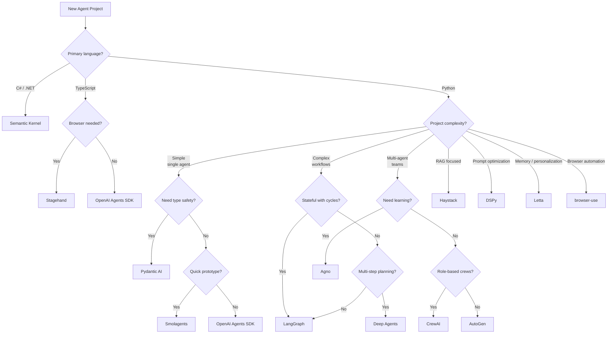
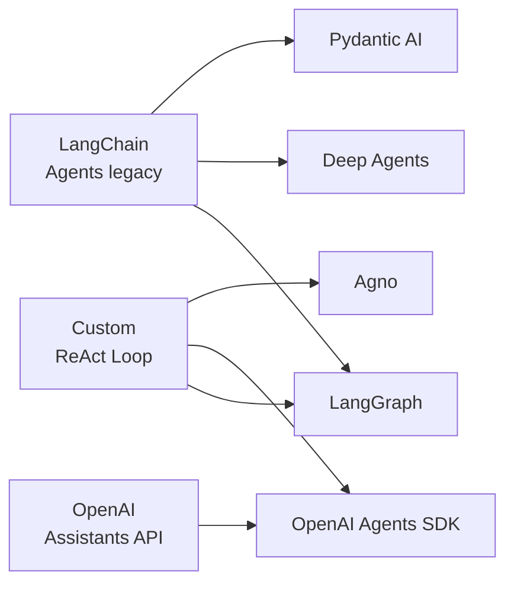

# Framework Selection Guide

## Introduction

With 14+ agent frameworks available in 2026, choosing the right one is itself a complex decision. The wrong choice means rewriting code when you hit limitations, while the right choice accelerates development and matches your team's strengths.

This lesson provides decision frameworks, comparison matrices, and use-case mappings to help you select — or migrate between — agent frameworks with confidence.

### What we'll cover

- Decision flowchart for framework selection
- Comprehensive comparison matrix
- Use-case-to-framework mapping
- Migration considerations between frameworks
- Evaluation criteria for your specific needs

### Prerequisites

- Understanding of all frameworks covered in Lessons 11-15 and 20
- Real project requirements to evaluate against

---

## Decision flowchart

Start here when choosing a framework for a new project:



---

## Comprehensive comparison matrix

### Core capabilities

| Framework | Tool Calling | Structured Output | Streaming | Memory | Multi-Agent | MCP |
|-----------|:-----------:|:-----------------:|:---------:|:------:|:-----------:|:---:|
| **OpenAI Agents SDK** | ✅ | ✅ | ✅ | ✅ | ✅ Handoffs | ✅ |
| **LangGraph** | ✅ | ✅ | ✅ | ✅ | ✅ | ✅ |
| **CrewAI** | ✅ | ✅ | ✅ | ✅ | ✅ Crews | ✅ |
| **AutoGen** | ✅ | ✅ | ✅ | ✅ | ✅ Teams | ✅ |
| **Google ADK** | ✅ | ✅ | ✅ | ✅ | ✅ | ✅ |
| **Semantic Kernel** | ✅ | ✅ | ✅ | ✅ | ⚠️ Limited | ⚠️ |
| **Haystack** | ✅ | ✅ | ✅ | ⚠️ | ❌ | ⚠️ |
| **DSPy** | ✅ | ✅ | ✅ | ❌ | ❌ | ✅ |
| **Pydantic AI** | ✅ | ✅ | ✅ | ⚠️ | ✅ | ✅ |
| **Smolagents** | ✅ Code | ⚠️ | ✅ | ❌ | ✅ | ✅ |
| **Deep Agents** | ✅ | ✅ | ✅ | ✅ | ✅ Subagents | ✅ |
| **Agno** | ✅ | ✅ | ✅ | ✅ Learning | ✅ Teams | ✅ |
| **Letta** | ✅ | ✅ | ✅ | ✅ Blocks | ✅ | ⚠️ |
| **browser-use** | ✅ Browser | ⚠️ | ❌ | ⚠️ | ❌ | ✅ |

✅ = Full support &nbsp; ⚠️ = Partial/community &nbsp; ❌ = Not supported

### Production readiness

| Framework | Maturity | Documentation | Community | Enterprise Support |
|-----------|---------|--------------|-----------|-------------------|
| **OpenAI Agents SDK** | ⭐⭐⭐⭐ | ⭐⭐⭐⭐ | ⭐⭐⭐⭐⭐ | OpenAI |
| **LangGraph** | ⭐⭐⭐⭐⭐ | ⭐⭐⭐⭐⭐ | ⭐⭐⭐⭐⭐ | LangChain |
| **CrewAI** | ⭐⭐⭐⭐ | ⭐⭐⭐⭐ | ⭐⭐⭐⭐ | CrewAI Inc |
| **AutoGen** | ⭐⭐⭐⭐ | ⭐⭐⭐ | ⭐⭐⭐⭐ | Microsoft |
| **Google ADK** | ⭐⭐⭐ | ⭐⭐⭐⭐ | ⭐⭐⭐ | Google |
| **Semantic Kernel** | ⭐⭐⭐⭐⭐ | ⭐⭐⭐⭐⭐ | ⭐⭐⭐⭐ | Microsoft |
| **Haystack** | ⭐⭐⭐⭐⭐ | ⭐⭐⭐⭐⭐ | ⭐⭐⭐⭐ | deepset |
| **DSPy** | ⭐⭐⭐ | ⭐⭐⭐ | ⭐⭐⭐ | Stanford |
| **Pydantic AI** | ⭐⭐⭐⭐ | ⭐⭐⭐⭐⭐ | ⭐⭐⭐⭐ | Pydantic |
| **Smolagents** | ⭐⭐⭐ | ⭐⭐⭐⭐ | ⭐⭐⭐ | HuggingFace |
| **Deep Agents** | ⭐⭐⭐ | ⭐⭐⭐ | ⭐⭐⭐ | LangChain |
| **Agno** | ⭐⭐⭐⭐ | ⭐⭐⭐⭐ | ⭐⭐⭐⭐⭐ | Agno Inc |
| **Letta** | ⭐⭐⭐⭐ | ⭐⭐⭐⭐ | ⭐⭐⭐⭐ | Letta Inc |
| **browser-use** | ⭐⭐⭐⭐ | ⭐⭐⭐ | ⭐⭐⭐⭐⭐ | browser-use |

---

## Use-case-to-framework mapping

### By application type

| Application | Primary Choice | Alternative |
|-------------|---------------|-------------|
| **Simple chatbot** | OpenAI Agents SDK | Pydantic AI |
| **Customer support agent** | Pydantic AI | OpenAI Agents SDK |
| **RAG application** | Haystack | LangGraph |
| **Multi-step research** | Deep Agents | LangGraph |
| **Multi-agent teams** | CrewAI | Agno |
| **Complex stateful workflows** | LangGraph | — |
| **Prompt optimization** | DSPy | — |
| **Browser automation** | browser-use | Stagehand (TS) |
| **Desktop automation** | Anthropic Computer Use | — |
| **Personalized assistant** | Letta | Agno |
| **Enterprise .NET** | Semantic Kernel | — |
| **Google Cloud native** | Google ADK | — |
| **Quick prototype** | Smolagents | OpenAI Agents SDK |
| **High-performance system** | Agno | — |
| **Code generation agent** | Deep Agents | Smolagents |

### By team profile

| Team | Recommended Framework | Why |
|------|----------------------|-----|
| Python startup, small team | Pydantic AI | Type-safe, minimal config, fast iteration |
| Enterprise with Azure | Semantic Kernel | Native Azure integration, C# support |
| ML/Research lab | DSPy | Declarative, optimizable, reproducible |
| Full-stack web team | OpenAI Agents SDK | Simple API, minimal learning curve |
| Platform engineering | LangGraph | Most control, stateful orchestration |
| Data engineering | Haystack | Pipeline architecture matches ETL thinking |
| DevOps/automation | browser-use + agents | Automate web-based operational tasks |

---

## Evaluation criteria

When evaluating a framework for your project, score each criterion from 1-5:

### Technical criteria

| Criterion | Questions to Ask |
|-----------|-----------------|
| **Model flexibility** | Does it support all models you might need? Can you switch providers? |
| **Structured output** | Can it return validated typed objects, not just strings? |
| **Streaming** | Does it support token-by-token streaming for real-time UIs? |
| **Memory/State** | How does it persist conversation state? Across sessions? |
| **Tool integration** | How easy is it to add custom tools? MCP support? |
| **Observability** | Built-in tracing? OpenTelemetry? Cost tracking? |
| **Testing** | How do you write unit tests? Mock LLM calls? |

### Operational criteria

| Criterion | Questions to Ask |
|-----------|-----------------|
| **Learning curve** | How long until a new developer is productive? |
| **Documentation** | Are docs complete, up-to-date, with examples? |
| **Community** | Active Discord/forum? Response time on issues? |
| **Release cadence** | How often are updates shipped? Breaking changes? |
| **Vendor lock-in** | Can you switch models without rewriting? |
| **Deployment** | Does it prescribe deployment, or is it flexible? |
| **Cost** | Open source? Cloud offering pricing? LLM costs? |

### Scoring template

```markdown
## Framework Evaluation: [Framework Name]

| Criterion | Score (1-5) | Notes |
|-----------|:-----------:|-------|
| Model flexibility | _ | |
| Structured output | _ | |
| Streaming | _ | |
| Memory/State | _ | |
| Tool integration | _ | |
| Observability | _ | |
| Testing | _ | |
| Learning curve | _ | |
| Documentation | _ | |
| Community | _ | |
| **Total** | _/55 | |
```

---

## Migration considerations

### Common migration paths



### Migration effort estimates

| From → To | Effort | What Changes |
|-----------|--------|-------------|
| LangChain → LangGraph | Medium | Agent loop → graph nodes |
| LangChain → Pydantic AI | Medium | Chains → typed agents |
| LangChain → Deep Agents | Low | Same ecosystem, add middleware |
| OpenAI Assistants → Agents SDK | Low | Thread API → SDK patterns |
| Custom ReAct → Any framework | High | Rewrite core loop |
| CrewAI → Agno | Medium | Crews → teams, different API |
| Haystack → LangGraph | High | Different paradigms |

### Migration checklist

When migrating between frameworks:

- [ ] Map existing tools to new framework's tool format
- [ ] Verify all models you use are supported
- [ ] Check memory/state migration path
- [ ] Test structured output compatibility
- [ ] Validate streaming behavior
- [ ] Update observability/tracing integration
- [ ] Rewrite tests for new testing patterns
- [ ] Update deployment configuration

---

## Best practices

| Practice | Why It Matters |
|----------|----------------|
| Start with the decision flowchart | Narrows 14 options to 2-3 candidates quickly |
| Prototype with 2 frameworks before committing | A day of testing saves weeks of migration |
| Score frameworks against YOUR criteria | Generic comparisons miss your specific needs |
| Prefer frameworks with MCP support | MCP is becoming the universal tool standard |
| Check the release cadence | Stale frameworks become liabilities |
| Consider your team's existing skills | A "better" framework that nobody knows is worse |

---

## Common pitfalls

| ❌ Mistake | ✅ Solution |
|-----------|-------------|
| Choosing by GitHub stars alone | Stars measure popularity, not fit for your use case |
| Using LangGraph for a simple chatbot | OpenAI Agents SDK or Pydantic AI is simpler |
| Picking a framework because of one feature | Evaluate the full matrix — you'll use many features |
| Ignoring migration cost | Factor in rewriting tests, tools, and deployment |
| Choosing the newest framework | Maturity, docs, and community matter more than novelty |
| Not evaluating vendor lock-in | Can you switch models? Deploy anywhere? |

---

## Hands-on exercise

### Your task

Evaluate three frameworks for a specific use case using the scoring template, then build a minimal proof-of-concept with the winner.

### Requirements

1. Pick a realistic use case (e.g., "customer support agent with tool calling")
2. Select 3 candidate frameworks from the decision flowchart
3. Score each using the evaluation criteria (technical + operational)
4. Build a minimal agent with the highest-scoring framework
5. Document your decision rationale

### Expected result

A scored comparison table and a working minimal agent that validates your framework choice.

<details>
<summary>💡 Hints (click to expand)</summary>

- Use the scoring template with all 11 criteria
- Weight criteria by importance for YOUR use case (not all are equal)
- The proof-of-concept should include: agent creation, one tool, structured output
- Keep the PoC under 50 lines — you're testing the framework, not building the app

</details>

<details>
<summary>✅ Solution (click to expand)</summary>

```markdown
## Use Case: Customer Support Agent

| Criterion | Pydantic AI | OpenAI SDK | LangGraph |
|-----------|:-----------:|:----------:|:---------:|
| Model flexibility | 5 | 3 | 5 |
| Structured output | 5 | 4 | 4 |
| Streaming | 4 | 4 | 5 |
| Memory/State | 3 | 4 | 5 |
| Tool integration | 5 | 4 | 5 |
| Observability | 5 | 3 | 4 |
| Testing | 5 | 3 | 4 |
| Learning curve | 5 | 5 | 3 |
| Documentation | 5 | 4 | 5 |
| Community | 4 | 5 | 5 |
| **Total** | **46** | **39** | **45** |

Winner: Pydantic AI (for type-safe support with validated responses)
```

```python
# Proof-of-concept: Customer support agent with Pydantic AI
from pydantic import BaseModel, Field
from pydantic_ai import Agent

class SupportResponse(BaseModel):
    answer: str
    category: str = Field(description="billing, technical, or general")
    priority: int = Field(ge=1, le=5)

agent = Agent(
    "openai:gpt-4o-mini",
    output_type=SupportResponse,
    instructions="You are a customer support agent.",
)

result = agent.run_sync("I can't log into my account")
print(f"Category: {result.output.category}, Priority: {result.output.priority}")
```

</details>

### Bonus challenges

- [ ] Evaluate the same use case with 5 frameworks instead of 3
- [ ] Build the same agent in two different frameworks and compare DX
- [ ] Create a weighted scoring matrix where some criteria count more

---

## Summary

✅ The **decision flowchart** narrows 14+ frameworks to 2-3 candidates based on language, complexity, and use case  
✅ **Comparison matrices** reveal capability differences across tool calling, memory, multi-agent, and MCP support  
✅ **Use-case mapping** matches application types and team profiles to optimal frameworks  
✅ **Evaluation scoring** provides a structured way to compare frameworks against your specific requirements  
✅ **Migration paths** help you switch frameworks when needs evolve  

**Previous:** [Browser Automation Agents](./04-browser-automation-agents.md)  
**Back to:** [Additional Frameworks & Tools](./00-additional-frameworks-tools.md)

---

## Further Reading

- [LangChain Framework Comparison](https://docs.langchain.com/oss/python/concepts/products) — LangChain vs LangGraph vs Deep Agents
- [Pydantic AI vs Others](https://ai.pydantic.dev/) — Why Pydantic AI was built
- [Agno Performance Benchmarks](https://docs.agno.com/) — Speed and memory comparisons
- [Haystack Integration Hub](https://haystack.deepset.ai/integrations) — Available connectors
- [DSPy vs Prompt Engineering](https://dspy.ai/learn/) — Why declarative programming

<!--
Sources Consulted:
- LangChain products: https://docs.langchain.com/oss/python/concepts/products
- Pydantic AI: https://ai.pydantic.dev/
- Agno: https://docs.agno.com/introduction
- All framework docs from lessons 01-04 in this section
-->
