# Agent Testing Strategies

## Overview

Testing AI agents is fundamentally different from testing traditional software. Agents are non-deterministic — the same input can produce different outputs across runs. They make autonomous decisions, call external tools, and maintain evolving state. These characteristics demand specialized testing strategies that go beyond conventional unit and integration testing.

This lesson explores comprehensive approaches to testing agent systems, from isolating individual components to validating end-to-end workflows, and from mocking LLM responses to building regression suites that catch quality degradation before it reaches production.

### Why Agent Testing Is Different

| Traditional Software | AI Agents |
|---------------------|-----------|
| Deterministic output | Non-deterministic output |
| Fixed control flow | Dynamic planning and branching |
| Known dependencies | LLM calls with variable latency |
| Binary pass/fail | Quality scoring on a spectrum |
| Static interfaces | Evolving tool/memory interactions |

### Lessons in This Section

| # | Lesson | Topics Covered |
|---|--------|----------------|
| 01 | [Unit Testing Agent Components](./01-unit-testing-agent-components.md) | Function tests, tool handlers, memory systems, parser validation |
| 02 | [Mocking AI Responses](./02-mocking-ai-responses.md) | TestModel, FunctionModel, response fixtures, AsyncMock, deterministic patterns |
| 03 | [Integration & Scenario Testing](./03-integration-scenario-testing.md) | End-to-end flows, multi-step workflows, edge cases, failure scenarios |
| 04 | [Deterministic & Regression Testing](./04-deterministic-regression-testing.md) | Golden test sets, behavioral baselines, eval frameworks, change detection |
| 05 | [Test Coverage & CI/CD](./05-test-coverage-ci-cd.md) | Path enumeration, branch coverage, CI/CD pipelines, automated regression |

### The Agent Testing Pyramid

```mermaid
graph TD
    A["🔺 E2E Agent Tests<br/>Full agent runs with real/mock LLMs<br/><i>Slow, expensive, high confidence</i>"] --> B
    B["🔶 Integration Tests<br/>Multi-step workflows, tool chains<br/><i>Medium speed, medium confidence</i>"] --> C
    C["🟩 Component Tests<br/>Tools, memory, parsers, prompts<br/><i>Fast, cheap, focused</i>"] --> D
    D["✅ Unit Tests<br/>Pure functions, utilities, validators<br/><i>Fastest, most reliable</i>"]

    style A fill:#ff6b6b,color:#fff
    style B fill:#ffa94d,color:#fff
    style C fill:#69db7c,color:#fff
    style D fill:#4ecdc4,color:#fff
```

### Testing Strategy by Agent Type

| Agent Type | Unit Tests | Mock Tests | Integration | Regression |
|------------|-----------|------------|-------------|------------|
| Simple ReAct | Tools, parser | LLM responses | Single-loop flow | Golden outputs |
| Multi-step planner | Planner, executor | Plan generation | Full plan execution | Plan quality scores |
| Multi-agent | Individual agents | Inter-agent messages | Full orchestration | Cross-agent metrics |
| RAG agent | Retriever, ranker | Retrieval + generation | Query → answer flow | Retrieval precision |
| Tool-heavy agent | Each tool handler | Tool selection | Tool chains | Tool accuracy baselines |

### Key Concepts

| Concept | Description |
|---------|-------------|
| **TestModel** | Pydantic AI's mock model that calls all tools without real LLM calls |
| **FunctionModel** | Custom mock that lets you control exactly what the "LLM" returns |
| **Golden Test Set** | Curated input/output pairs defining expected agent behavior |
| **Behavioral Testing** | Validating agent behavior patterns rather than exact outputs |
| **Eval Framework** | Systematic evaluation with datasets, evaluators, and scoring (Pydantic Evals, LangSmith) |
| **Regression Suite** | Tests that detect quality degradation when code or prompts change |
| **Agent Coverage** | Measuring which decision paths, tools, and branches an agent exercises |

### Prerequisites

- Python testing with pytest (Unit 2, Lesson 15)
- Agent fundamentals (Lessons 1-10)
- Framework basics — at least one of: OpenAI Agents SDK, LangGraph, Pydantic AI (Lessons 11-15, 20)
- Understanding of tools and memory (Lessons 5, 4)

### Tools We'll Use

| Tool | Purpose |
|------|---------|
| `pytest` | Test runner and assertion framework |
| `pytest-asyncio` | Async test support for agent tests |
| `unittest.mock` | Mocking LLM calls and external services |
| `Pydantic AI TestModel` | Zero-cost mock model for Pydantic AI agents |
| `Pydantic Evals` | Dataset-based evaluation framework |
| `LangSmith` | Evaluation platform with datasets and experiments |
| `dirty-equals` | Flexible assertion matching for non-deterministic outputs |

---

**Next:** [Unit Testing Agent Components](./01-unit-testing-agent-components.md)

**Previous:** [Additional Frameworks & Tools](../20-additional-frameworks-tools/00-additional-frameworks-tools.md)

---

## Further Reading

- [Pydantic AI Testing Guide](https://ai.pydantic.dev/testing/) - TestModel, FunctionModel, and best practices
- [Pydantic Evals Documentation](https://ai.pydantic.dev/evals/) - Dataset-based evaluation framework
- [LangSmith Evaluation Concepts](https://docs.langchain.com/langsmith/evaluation-concepts) - Offline/online evaluation strategies
- [pytest Documentation](https://docs.pytest.org/en/stable/) - Python testing framework
- [unittest.mock Documentation](https://docs.python.org/3/library/unittest.mock.html) - Python mocking library

<!-- 
Sources Consulted:
- Pydantic AI Testing: https://ai.pydantic.dev/testing/
- Pydantic Evals Core Concepts: https://ai.pydantic.dev/evals/core-concepts/
- LangSmith Evaluation Concepts: https://docs.langchain.com/langsmith/evaluation-concepts
- CrewAI Testing: https://docs.crewai.com/concepts/testing
- pytest Fixtures: https://docs.pytest.org/en/stable/how-to/fixtures.html
- unittest.mock: https://docs.python.org/3/library/unittest.mock.html
-->
