# Deterministic & Regression Testing

## Introduction

AI agents are non-deterministic by nature — the same input can produce different outputs across runs. Deterministic testing tames this chaos by defining what "correct" means through golden test sets, behavioral baselines, and evaluation frameworks. Regression testing ensures that agent improvements don't break what already works.

This lesson covers two powerful evaluation frameworks — Pydantic Evals and LangSmith — alongside practical patterns for building golden test sets and detecting behavioral regressions.

### What We'll Cover

- Golden test sets and how to build them
- Behavioral testing approaches for non-deterministic outputs
- Pydantic Evals: datasets, cases, and evaluators
- LangSmith evaluation: offline benchmarking and regression detection
- Seed-based determinism for reproducible tests
- Continuous regression monitoring

### Prerequisites

- Unit testing and mocking (Lessons 01-02)
- Integration and scenario testing (Lesson 03)
- Understanding of AI evaluation concepts

---

## Golden test sets

A golden test set is a curated collection of input-output pairs that define expected agent behavior. Unlike unit tests with exact assertions, golden tests verify behavioral correctness — the output must be "right enough," not character-identical.

### Building a golden test set

```python
# tests/golden/test_cases.py
"""
Golden test cases for the support agent.
Each case defines:
  - input: What the user says
  - expected_behavior: What the agent MUST do
  - expected_content: Keywords that MUST appear in the response
  - forbidden_content: Keywords that must NOT appear
"""

GOLDEN_CASES = [
    {
        "name": "order_lookup_happy_path",
        "input": "Where is my order ORD-12345?",
        "expected_behavior": "calls lookup_order tool",
        "expected_content": ["ORD-12345", "status"],
        "forbidden_content": ["error", "sorry"],
    },
    {
        "name": "refund_request",
        "input": "I want a refund for ORD-67890, the item was damaged",
        "expected_behavior": "calls process_refund tool",
        "expected_content": ["refund", "ORD-67890"],
        "forbidden_content": [],
    },
    {
        "name": "unknown_order_format",
        "input": "Where is order ABC-999?",
        "expected_behavior": "returns error about invalid format",
        "expected_content": ["invalid", "ORD-"],
        "forbidden_content": ["shipped", "delivered"],
    },
    {
        "name": "greeting",
        "input": "Hello!",
        "expected_behavior": "responds with greeting, no tool calls",
        "expected_content": [],
        "forbidden_content": ["error"],
    },
    {
        "name": "ambiguous_request",
        "input": "Can you help me?",
        "expected_behavior": "asks clarifying question",
        "expected_content": [],
        "forbidden_content": ["error", "cannot"],
    },
]
```

### Running golden tests

```python
# tests/golden/test_golden.py
import pytest
from unittest.mock import MagicMock
from tests.golden.test_cases import GOLDEN_CASES


def make_agent_response(content: str) -> MagicMock:
    """Create a mock LLM response."""
    return MagicMock(
        choices=[MagicMock(message=MagicMock(content=content))]
    )


# Map golden case names to mock responses
MOCK_RESPONSES = {
    "order_lookup_happy_path": "Order ORD-12345 status: Shipped, arriving March 15.",
    "refund_request": "Refund initiated for ORD-67890. Processing in 3-5 days.",
    "unknown_order_format": "Invalid order ID. Order IDs must start with ORD-.",
    "greeting": "Hello! How can I help you today?",
    "ambiguous_request": "I'd be happy to help! Could you tell me more about what you need?",
}


@pytest.mark.parametrize(
    "case",
    GOLDEN_CASES,
    ids=[c["name"] for c in GOLDEN_CASES],
)
def test_golden_case(case):
    """Validate agent output against golden test case."""
    response = MOCK_RESPONSES[case["name"]]
    
    # Check required content
    for keyword in case["expected_content"]:
        assert keyword.lower() in response.lower(), (
            f"Golden case '{case['name']}': "
            f"Expected '{keyword}' in response: {response}"
        )
    
    # Check forbidden content
    for keyword in case["forbidden_content"]:
        assert keyword.lower() not in response.lower(), (
            f"Golden case '{case['name']}': "
            f"Forbidden '{keyword}' found in response: {response}"
        )
```

**Output:**
```
$ pytest tests/golden/test_golden.py -v
tests/golden/test_golden.py::test_golden_case[order_lookup_happy_path] PASSED
tests/golden/test_golden.py::test_golden_case[refund_request] PASSED
tests/golden/test_golden.py::test_golden_case[unknown_order_format] PASSED
tests/golden/test_golden.py::test_golden_case[greeting] PASSED
tests/golden/test_golden.py::test_golden_case[ambiguous_request] PASSED
======================== 5 passed in 0.02s =========================
```

> **🔑 Key Concept:** Golden tests check behavioral properties (keywords present, keywords absent), not exact text. This makes them resilient to LLM rewording while still catching meaningful regressions.

---

## Behavioral testing approaches

When exact matching is too strict, behavioral testing offers flexible validation strategies:

### Approach 1: Property-based assertions

```python
def test_response_properties(agent_response: str):
    """Test structural properties, not exact content."""
    # Length bounds
    assert 10 < len(agent_response) < 5000
    
    # Contains required structure
    assert not agent_response.startswith(" ")  # No leading whitespace
    assert agent_response.strip()  # Not empty
    
    # No hallucinated data patterns
    assert "undefined" not in agent_response.lower()
    assert "null" not in agent_response.lower()
```

### Approach 2: Semantic similarity scoring

```python
# tests/test_semantic.py
from difflib import SequenceMatcher

def semantic_similarity(text1: str, text2: str) -> float:
    """Simple semantic similarity using SequenceMatcher."""
    return SequenceMatcher(None, text1.lower(), text2.lower()).ratio()


def test_response_semantically_similar():
    """Response should be semantically close to expected."""
    expected = "The order has been shipped and will arrive on March 15."
    actual = "Your order was shipped. Expected delivery: March 15th."
    
    similarity = semantic_similarity(expected, actual)
    assert similarity > 0.5, f"Similarity {similarity:.2f} below threshold"
```

### Approach 3: Structured output validation

```python
# tests/test_structured.py
import pytest
from pydantic import BaseModel, ValidationError


class AgentResponse(BaseModel):
    """Expected structure of agent output."""
    answer: str
    confidence: float
    sources: list[str]
    tool_calls_made: list[str]


def test_response_matches_schema():
    """Agent output conforms to expected schema."""
    raw_output = {
        "answer": "The order is in transit.",
        "confidence": 0.92,
        "sources": ["order_db"],
        "tool_calls_made": ["lookup_order"],
    }
    
    # Pydantic validates the structure
    response = AgentResponse(**raw_output)
    assert response.confidence > 0.8
    assert len(response.sources) > 0


def test_invalid_response_caught():
    """Missing fields are caught by schema validation."""
    with pytest.raises(ValidationError):
        AgentResponse(answer="Incomplete response")  # Missing fields
```

---

## Pydantic Evals framework

Pydantic Evals provides a structured way to define evaluation datasets, run experiments, and compare results across agent versions.

### Core concepts

```python
from pydantic_evals import Dataset, Case
from pydantic_evals.evaluators import EqualsExpected, LLMJudge


# Define a dataset of test cases
dataset = Dataset(
    cases=[
        Case(
            name="capital_question",
            inputs="What is the capital of France?",
            expected_output="Paris",
            metadata={"category": "geography", "difficulty": "easy"},
        ),
        Case(
            name="math_question",
            inputs="What is 2 + 2?",
            expected_output="4",
            metadata={"category": "math", "difficulty": "easy"},
        ),
        Case(
            name="complex_question",
            inputs="Explain quantum entanglement simply",
            expected_output=None,  # No exact answer expected
            metadata={"category": "science", "difficulty": "hard"},
        ),
    ],
    evaluators=[
        EqualsExpected(),  # Checks exact match where expected_output is set
    ],
)
```

### Running evaluations

```python
# tests/test_evals.py
from pydantic_evals import Dataset, Case
from pydantic_evals.evaluators import EqualsExpected


def simple_agent(inputs: str) -> str:
    """A deterministic agent for testing (no LLM)."""
    answers = {
        "What is the capital of France?": "Paris",
        "What is 2 + 2?": "4",
    }
    return answers.get(inputs, "I don't know")


# Create dataset
dataset = Dataset(
    cases=[
        Case(
            name="capital",
            inputs="What is the capital of France?",
            expected_output="Paris",
        ),
        Case(
            name="math",
            inputs="What is 2 + 2?",
            expected_output="4",
        ),
    ],
    evaluators=[EqualsExpected()],
)

# Run evaluation
report = dataset.evaluate_sync(simple_agent)
print(report)
```

**Output:**
```
EvaluationReport:
  Case 'capital': ✅ EqualsExpected: PASS
  Case 'math': ✅ EqualsExpected: PASS
  
  Overall: 2/2 passed (100.0%)
```

### Custom evaluators

```python
from pydantic_evals import Evaluator, EvaluatorContext


class ContainsKeywords(Evaluator):
    """Check that output contains all required keywords."""
    
    keywords: list[str]
    
    def evaluate(self, ctx: EvaluatorContext) -> bool:
        output = str(ctx.output).lower()
        return all(kw.lower() in output for kw in self.keywords)


class ResponseLength(Evaluator):
    """Check that output length is within bounds."""
    
    min_length: int = 10
    max_length: int = 1000
    
    def evaluate(self, ctx: EvaluatorContext) -> bool:
        length = len(str(ctx.output))
        return self.min_length <= length <= self.max_length


# Use custom evaluators
dataset = Dataset(
    cases=[
        Case(
            name="weather_query",
            inputs="What's the weather in London?",
            expected_output=None,
            evaluators=[
                ContainsKeywords(keywords=["london", "temperature"]),
                ResponseLength(min_length=20, max_length=500),
            ],
        ),
    ],
)
```

### Comparing agent versions

```python
def agent_v1(inputs: str) -> str:
    """Version 1: simple keyword matching."""
    if "capital" in inputs.lower():
        return "Paris"
    return "I don't know"


def agent_v2(inputs: str) -> str:
    """Version 2: better coverage."""
    answers = {
        "capital of france": "Paris",
        "capital of germany": "Berlin",
        "2 + 2": "4",
    }
    for key, answer in answers.items():
        if key in inputs.lower():
            return answer
    return "I'm not sure about that."


# Same dataset, different agents
dataset = Dataset(
    cases=[
        Case(name="france", inputs="What is the capital of France?", expected_output="Paris"),
        Case(name="germany", inputs="What is the capital of Germany?", expected_output="Berlin"),
        Case(name="math", inputs="What is 2 + 2?", expected_output="4"),
    ],
    evaluators=[EqualsExpected()],
)

report_v1 = dataset.evaluate_sync(agent_v1)
report_v2 = dataset.evaluate_sync(agent_v2)

print("V1:", report_v1)
print("V2:", report_v2)
```

**Output:**
```
V1: 1/3 passed (33.3%)  — Only France correct
V2: 3/3 passed (100.0%) — All correct
```

> **🤖 AI Context:** Pydantic Evals treats agent evaluation like unit testing — `Case` = test case, `Dataset` = test suite, `evaluate_sync()` = test runner, `EvaluationReport` = test results. This mental model makes evaluation accessible to developers already comfortable with pytest.

---

## LangSmith evaluation

LangSmith provides cloud-based evaluation with dataset management, experiment tracking, and comparison dashboards.

### Evaluation concepts

| Concept | Description | Analogy |
|---------|-------------|---------|
| **Dataset** | Collection of examples with inputs and reference outputs | Test suite |
| **Example** | Single input/output pair | Test case |
| **Experiment** | Running a target function against a dataset | Test run |
| **Evaluator** | Function that scores each result | Assertion |
| **Run** | Traced execution of the target function | Test execution |

### Offline evaluation pattern

```python
# evals/langsmith_eval.py
"""
LangSmith evaluation pattern (conceptual — requires LangSmith account).
"""

# Step 1: Define the dataset (typically done in LangSmith UI or SDK)
evaluation_dataset = [
    {
        "input": "What's the weather in London?",
        "reference": "The weather in London is currently 15°C and cloudy.",
    },
    {
        "input": "Book a flight to Paris",
        "reference": "I've found flights to Paris. The cheapest option is $450.",
    },
]

# Step 2: Define evaluators
def contains_location(outputs: dict, reference_outputs: dict) -> dict:
    """Check if the response mentions the expected location."""
    # Extract location from the reference
    for city in ["London", "Paris", "Tokyo", "Berlin"]:
        if city.lower() in reference_outputs["output"].lower():
            return {
                "key": "contains_location",
                "score": 1.0 if city.lower() in outputs["output"].lower() else 0.0,
            }
    return {"key": "contains_location", "score": 0.0}


def response_not_empty(outputs: dict, reference_outputs: dict) -> dict:
    """Check that the response is not empty."""
    return {
        "key": "not_empty",
        "score": 1.0 if outputs.get("output", "").strip() else 0.0,
    }


# Step 3: Run evaluation
# from langsmith import Client
# client = Client()
# results = client.evaluate(
#     target=my_agent_function,
#     data="my-agent-eval-dataset",
#     evaluators=[contains_location, response_not_empty],
#     experiment_prefix="agent-v2",
# )
```

### Evaluation types

| Type | Use Case | Evaluator Style |
|------|----------|-----------------|
| **Code evaluator** | Exact matches, keyword checks, regex | Deterministic function |
| **LLM-as-judge** | Semantic correctness, tone, helpfulness | LLM scores the output |
| **Human evaluator** | Subjective quality, edge cases | Human annotation queue |
| **Pairwise** | A/B comparison between agent versions | Compare two outputs side-by-side |

### Best practices for building evaluation datasets

```python
# evals/dataset_builder.py
"""
Best practices for constructing evaluation datasets.
"""

# 1. Start with manually curated examples (10-20)
manual_examples = [
    {"input": "Track order ORD-001", "output": "Order ORD-001: Shipped"},
    {"input": "Return item from ORD-002", "output": "Return initiated for ORD-002"},
]

# 2. Add examples from production traces (historical data)
# Export real user interactions that had good outcomes
production_examples = [
    # Curated from logs where users gave positive feedback
]

# 3. Generate synthetic edge cases
edge_cases = [
    {"input": "", "output": "Please provide your question."},
    {"input": "x" * 10000, "output": "Your message is too long."},
    {"input": "DROP TABLE orders;", "output": "I can help with order inquiries."},
]

# 4. Organize with splits
dataset_splits = {
    "core": manual_examples,        # Run on every commit
    "extended": production_examples, # Run nightly
    "edge": edge_cases,             # Run weekly
}
```

---

## Seed-based determinism

Some LLM APIs support seed parameters for more reproducible outputs. While not perfectly deterministic, seeds significantly reduce variance:

```python
# agent_app/deterministic_agent.py
from openai import OpenAI

def get_deterministic_response(
    prompt: str,
    seed: int = 42,
    temperature: float = 0.0,
) -> str:
    """Get a more deterministic response using seed and low temperature."""
    client = OpenAI()
    response = client.chat.completions.create(
        model="gpt-4o",
        messages=[{"role": "user", "content": prompt}],
        seed=seed,
        temperature=temperature,
    )
    
    # Check if the response used the same system fingerprint
    fingerprint = response.system_fingerprint
    
    return response.choices[0].message.content
```

```python
# tests/test_deterministic.py
import pytest
from unittest.mock import patch, MagicMock


def test_seed_parameter_passed():
    """Verify seed is sent to the API for reproducibility."""
    with patch("agent_app.deterministic_agent.OpenAI") as mock_openai:
        mock_client = MagicMock()
        mock_openai.return_value = mock_client
        mock_client.chat.completions.create.return_value = MagicMock(
            choices=[MagicMock(message=MagicMock(content="Response"))],
            system_fingerprint="fp_abc123",
        )
        
        from agent_app.deterministic_agent import get_deterministic_response
        get_deterministic_response("Test prompt", seed=42)
        
        # Verify seed was passed
        call_kwargs = mock_client.chat.completions.create.call_args.kwargs
        assert call_kwargs["seed"] == 42
        assert call_kwargs["temperature"] == 0.0
```

> **Warning:** Seeds provide "mostly deterministic" results. The same seed + prompt usually produces the same output, but model updates or infrastructure changes can alter results. Don't rely on seeds for exact-match testing.

---

## Continuous regression monitoring

Regression testing for agents means running golden tests and evaluations automatically to detect when changes degrade performance.

### Regression test workflow

```mermaid
flowchart TD
    A[Code Change] --> B[Run Unit Tests]
    B --> C{Pass?}
    C -->|No| D[Fix Code]
    C -->|Yes| E[Run Golden Tests]
    E --> F{Pass?}
    F -->|No| G[Review Regression]
    F -->|Yes| H[Run Evals]
    H --> I{Scores ≥ Baseline?}
    I -->|No| J[Investigate Degradation]
    I -->|Yes| K[✅ Deploy]
    D --> A
    G --> A
    J --> A
    
    style K fill:#28a745,color:white
    style D fill:#dc3545,color:white
    style G fill:#dc3545,color:white
    style J fill:#ffc107,color:black
```



### Storing baselines

```python
# tests/baselines/baseline_scores.json
{
    "version": "2.1.0",
    "date": "2025-06-15",
    "scores": {
        "golden_test_pass_rate": 0.95,
        "avg_response_relevance": 0.88,
        "avg_response_length": 150,
        "tool_call_accuracy": 0.92,
        "error_rate": 0.03
    }
}
```

```python
# tests/test_regression.py
import json
import pytest
from pathlib import Path


@pytest.fixture
def baseline_scores():
    """Load baseline scores from file."""
    path = Path(__file__).parent / "baselines" / "baseline_scores.json"
    with open(path) as f:
        return json.load(f)["scores"]


def test_golden_pass_rate(baseline_scores):
    """Golden test pass rate should not regress."""
    current_pass_rate = run_golden_tests()  # Returns float 0-1
    baseline = baseline_scores["golden_test_pass_rate"]
    
    assert current_pass_rate >= baseline * 0.95, (
        f"Regression detected: {current_pass_rate:.2%} < "
        f"{baseline * 0.95:.2%} (95% of baseline {baseline:.2%})"
    )


def test_tool_call_accuracy(baseline_scores):
    """Tool call accuracy should not drop."""
    current_accuracy = evaluate_tool_calls()
    baseline = baseline_scores["tool_call_accuracy"]
    
    assert current_accuracy >= baseline - 0.05, (
        f"Tool accuracy regressed: {current_accuracy:.2%} < "
        f"{baseline - 0.05:.2%} (baseline {baseline:.2%} - 5%)"
    )


def run_golden_tests() -> float:
    """Run golden tests and return pass rate."""
    # Placeholder — integrate with your golden test runner
    return 0.96


def evaluate_tool_calls() -> float:
    """Evaluate tool call accuracy and return score."""
    # Placeholder — integrate with your evaluation framework
    return 0.93
```

### Version comparison pattern

```python
# tests/test_version_comparison.py
"""Compare current agent version against previous."""

def test_no_regression_from_previous_version():
    """Current version should match or exceed previous version scores."""
    previous = {"accuracy": 0.90, "completeness": 0.85, "tool_usage": 0.92}
    current = {"accuracy": 0.91, "completeness": 0.87, "tool_usage": 0.90}
    
    regressions = []
    for metric, prev_score in previous.items():
        curr_score = current[metric]
        if curr_score < prev_score - 0.02:  # 2% tolerance
            regressions.append(
                f"{metric}: {curr_score:.2%} < {prev_score:.2%} (regressed)"
            )
    
    assert not regressions, (
        f"Regressions detected:\n" + "\n".join(regressions)
    )
```

---

## Best Practices

| Practice | Why It Matters |
|----------|----------------|
| Start with 10-20 manually curated golden cases | High-quality cases catch more issues than hundreds of auto-generated ones |
| Test behavioral properties, not exact text | Resilient to LLM rewording while catching real bugs |
| Use `EqualsExpected` only for deterministic outputs | Exact match fails on any LLM variation |
| Store baseline scores in version control | Track regression trends over time |
| Allow a tolerance margin (2-5%) | Avoids false alarms from normal LLM variance |
| Run eval datasets on every PR | Catches regressions before merge |

---

## Common Pitfalls

| ❌ Mistake | ✅ Solution |
|-----------|-------------|
| Exact string matching for LLM outputs | Use keyword checks, semantic similarity, or LLM-as-judge |
| Relying solely on seeds for determinism | Seeds reduce variance but don't eliminate it |
| Never updating golden test sets | Add new cases as you discover production failures |
| Too many golden cases with no organization | Use splits (core/extended/edge) and run subsets |
| No tolerance in regression checks | Allow 2-5% margin to avoid false failures |
| Comparing against a single baseline | Track trends over multiple versions |

---

## Hands-on Exercise

### Your Task

Build a golden test set and evaluation pipeline for a Q&A agent.

### Requirements

1. Define 10 golden test cases for a knowledge-base Q&A agent:
   - 5 factual questions with expected answers
   - 3 edge cases (empty input, very long input, off-topic)
   - 2 ambiguous questions that should trigger clarification
2. Create a `Dataset` with `Case` objects and custom evaluators:
   - `ContainsAnswer` evaluator for factual questions
   - `ResponseLength` evaluator for all cases
3. Write a deterministic mock agent function that returns canned responses
4. Run `dataset.evaluate_sync()` and verify all cases pass
5. Create a second agent version and compare results

### Expected Result

Both agent versions are evaluated. The comparison shows which version performs better.

<details>
<summary>💡 Hints (click to expand)</summary>

- Store golden cases as a list of dicts with `input`, `expected_keywords`, and `category`
- Custom evaluators return `bool` (pass/fail), `float` (score), or `str` (label)
- The mock agent can use a dictionary lookup — no LLM needed
- Use `metadata={"category": "factual"}` to tag cases
</details>

<details>
<summary>✅ Solution (click to expand)</summary>

```python
# qa_golden_tests.py
from pydantic_evals import Dataset, Case, Evaluator, EvaluatorContext

class ContainsAnswer(Evaluator):
    keywords: list[str]
    
    def evaluate(self, ctx: EvaluatorContext) -> bool:
        output = str(ctx.output).lower()
        return all(kw.lower() in output for kw in self.keywords)

class ResponseLength(Evaluator):
    min_len: int = 5
    max_len: int = 500
    
    def evaluate(self, ctx: EvaluatorContext) -> bool:
        return self.min_len <= len(str(ctx.output)) <= self.max_len

# Golden test cases
dataset = Dataset(
    cases=[
        # Factual (5)
        Case(name="python_creator", inputs="Who created Python?",
             expected_output="Guido van Rossum",
             evaluators=[ContainsAnswer(keywords=["guido"])]),
        Case(name="python_year", inputs="When was Python released?",
             expected_output="1991",
             evaluators=[ContainsAnswer(keywords=["1991"])]),
        Case(name="python_typing", inputs="Is Python statically typed?",
             expected_output="No",
             evaluators=[ContainsAnswer(keywords=["dynamic"])]),
        Case(name="python_paradigm", inputs="What paradigm is Python?",
             expected_output="Multi-paradigm",
             evaluators=[ContainsAnswer(keywords=["multi"])]),
        Case(name="python_extension", inputs="What is Python's file extension?",
             expected_output=".py",
             evaluators=[ContainsAnswer(keywords=[".py"])]),
        # Edge cases (3)
        Case(name="empty_input", inputs="", expected_output=None,
             evaluators=[ResponseLength(min_len=5)]),
        Case(name="long_input", inputs="x " * 5000, expected_output=None,
             evaluators=[ResponseLength(min_len=5)]),
        Case(name="off_topic", inputs="What's the best pizza?",
             expected_output=None,
             evaluators=[ResponseLength(min_len=5)]),
        # Ambiguous (2)
        Case(name="vague_q1", inputs="How does it work?",
             expected_output=None,
             evaluators=[ContainsAnswer(keywords=["clarify"])]),
        Case(name="vague_q2", inputs="Tell me more",
             expected_output=None,
             evaluators=[ContainsAnswer(keywords=["specific"])]),
    ],
    evaluators=[ResponseLength()],  # Applied to all cases
)

# Agent versions
def agent_v1(inputs: str) -> str:
    answers = {
        "Who created Python?": "Python was created by Guido van Rossum.",
        "When was Python released?": "Python was first released in 1991.",
        "Is Python statically typed?": "No, Python uses dynamic typing.",
        "What paradigm is Python?": "Python is a multi-paradigm language.",
        "What is Python's file extension?": "Python files use the .py extension.",
    }
    if not inputs.strip():
        return "Please provide a question."
    if len(inputs) > 5000:
        return "Your input is too long. Please shorten it."
    for key, answer in answers.items():
        if key.lower() in inputs.lower():
            return answer
    if len(inputs.split()) < 4:
        return "Could you clarify or be more specific?"
    return "I don't have information about that topic."

report_v1 = dataset.evaluate_sync(agent_v1)
print(report_v1)
```
</details>

### Bonus Challenges

- [ ] Add an `LLMJudge` evaluator for the ambiguous cases (requires API key)
- [ ] Save evaluation reports to JSON and compare across git commits
- [ ] Create a GitHub Action that runs the golden tests on every PR

---

## Summary

✅ Golden test sets define expected behavior through keywords and properties, not exact text

✅ Behavioral testing uses property checks, semantic similarity, and schema validation for flexible assertions

✅ Pydantic Evals provides `Dataset`, `Case`, and custom `Evaluator` classes for structured evaluation

✅ LangSmith enables cloud-based evaluation with datasets, experiments, and version comparison

✅ Regression testing stores baseline scores and compares current results with a tolerance margin

**Next:** [Test Coverage & CI/CD](./05-test-coverage-ci-cd.md)

---

## Further Reading

- [Pydantic Evals Core Concepts](https://ai.pydantic.dev/evals/core-concepts/) - Datasets, cases, and evaluators
- [LangSmith Evaluation Concepts](https://docs.langchain.com/langsmith/evaluation-concepts) - Offline and online evaluation
- [pytest parametrize](https://docs.pytest.org/en/stable/how-to/parametrize.html) - Running golden tests with parametrize

<!-- 
Sources Consulted:
- Pydantic Evals Core Concepts: https://ai.pydantic.dev/evals/core-concepts/
- LangSmith Evaluation Concepts: https://docs.langchain.com/langsmith/evaluation-concepts
- Pydantic AI Testing: https://ai.pydantic.dev/testing/
- pytest Documentation: https://docs.pytest.org/en/stable/
-->
