# Test Coverage & CI/CD

## Introduction

Traditional code coverage (line, branch, function) tells us which code paths our tests execute. Agent coverage goes further — we must also track which decision branches, tool combinations, and conversational paths our tests explore. Combining coverage metrics with CI/CD automation ensures every code change is validated before deployment.

This lesson covers agent-specific coverage strategies, pytest-cov for code coverage, and CI/CD pipeline integration for automated testing and evaluation.

### What We'll Cover

- Code coverage with pytest-cov
- Agent-specific coverage: decision paths and tool usage
- Enumerating agent decision branches
- CI/CD pipeline setup with GitHub Actions
- Automated regression testing in pipelines
- CrewAI's built-in testing CLI

### Prerequisites

- Deterministic and regression testing (Lesson 04)
- Basic understanding of CI/CD concepts
- Familiarity with GitHub Actions (helpful but not required)

---

## Code coverage with pytest-cov

`pytest-cov` measures how much of your code is executed during tests. For agents, this answers: "Which tool functions, parsers, and utilities are actually tested?"

### Setting up coverage

```bash
# Install pytest-cov
pip install pytest-cov
```

```bash
# Run tests with coverage
pytest --cov=agent_app --cov-report=term-missing tests/
```

**Output:**
```
======================== test session starts ========================
tests/test_tools.py .......... [40%]
tests/test_memory.py ........ [72%]
tests/test_parsers.py ....... [100%]

---------- coverage: platform linux, python 3.12 ----------
Name                        Stmts   Miss  Cover   Missing
---------------------------------------------------------
agent_app/__init__.py           0      0   100%
agent_app/tools.py             18      0   100%
agent_app/memory.py            22      3    86%   45-47
agent_app/parsers.py           15      0   100%
agent_app/prompts.py           12      2    83%   28-29
agent_app/async_tools.py       10      4    60%   15-18
---------------------------------------------------------
TOTAL                          77      9    88%

======================== 25 passed in 0.15s =========================
```

### Coverage configuration

```ini
# pyproject.toml
[tool.pytest.ini_options]
addopts = "--cov=agent_app --cov-report=term-missing --cov-report=html"
testpaths = ["tests"]
markers = [
    "scenario_common: common usage scenarios",
    "scenario_edge: edge case scenarios",
    "scenario_failure: failure scenarios",
    "scenario_perf: performance scenarios",
]

[tool.coverage.run]
branch = true
source = ["agent_app"]
omit = [
    "*/tests/*",
    "*/__pycache__/*",
]

[tool.coverage.report]
fail_under = 80
show_missing = true
exclude_lines = [
    "pragma: no cover",
    "if __name__ == .__main__.",
    "if TYPE_CHECKING:",
]
```

> **Tip:** Set `fail_under = 80` in CI to enforce minimum coverage. Start at 80% and gradually increase as your test suite matures.

---

## Agent-specific coverage

Code coverage alone doesn't tell us if we've tested all the ways an agent can behave. Agent coverage requires tracking three additional dimensions:

### The agent coverage model


### Tracking tool usage coverage

```python
# tests/coverage/tool_coverage.py
"""Track which tools have been tested and in what combinations."""

from dataclasses import dataclass, field
from typing import Set


@dataclass
class ToolCoverageTracker:
    """Tracks tool usage across test runs."""
    
    registered_tools: set[str] = field(default_factory=set)
    tested_tools: set[str] = field(default_factory=set)
    tested_combinations: set[frozenset[str]] = field(default_factory=set)
    tested_error_cases: set[str] = field(default_factory=set)
    
    def register_tools(self, tools: list[str]) -> None:
        """Register all available tools."""
        self.registered_tools.update(tools)
    
    def record_tool_call(self, tool_name: str) -> None:
        """Record that a tool was called in a test."""
        self.tested_tools.add(tool_name)
    
    def record_combination(self, tools: list[str]) -> None:
        """Record a tool combination that was tested."""
        self.tested_combinations.add(frozenset(tools))
    
    def record_error_test(self, tool_name: str) -> None:
        """Record that error handling was tested for a tool."""
        self.tested_error_cases.add(tool_name)
    
    def report(self) -> dict:
        """Generate coverage report."""
        untested = self.registered_tools - self.tested_tools
        no_error_tests = self.registered_tools - self.tested_error_cases
        
        return {
            "total_tools": len(self.registered_tools),
            "tested_tools": len(self.tested_tools),
            "tool_coverage": len(self.tested_tools) / max(len(self.registered_tools), 1),
            "untested_tools": list(untested),
            "combinations_tested": len(self.tested_combinations),
            "tools_without_error_tests": list(no_error_tests),
        }
```

```python
# tests/conftest.py
import pytest
from tests.coverage.tool_coverage import ToolCoverageTracker

# Global tracker instance
tool_tracker = ToolCoverageTracker()
tool_tracker.register_tools([
    "get_weather", "search_flights", "search_hotels",
    "lookup_order", "process_refund", "check_inventory",
])


@pytest.fixture
def tracker():
    return tool_tracker


def pytest_terminal_summary(terminalreporter, exitstatus, config):
    """Print tool coverage at the end of the test run."""
    report = tool_tracker.report()
    terminalreporter.write_sep("=", "Agent Tool Coverage")
    terminalreporter.write_line(
        f"Tools: {report['tested_tools']}/{report['total_tools']} "
        f"({report['tool_coverage']:.0%})"
    )
    if report["untested_tools"]:
        terminalreporter.write_line(
            f"⚠️  Untested: {', '.join(report['untested_tools'])}"
        )
    if report["tools_without_error_tests"]:
        terminalreporter.write_line(
            f"⚠️  No error tests: {', '.join(report['tools_without_error_tests'])}"
        )
    terminalreporter.write_line(
        f"Combinations tested: {report['combinations_tested']}"
    )
```

```python
# tests/test_with_tracking.py
def test_weather_tool(tracker):
    """Test weather tool and record coverage."""
    from agent_app.tools import get_weather
    from datetime import date, timedelta
    
    result = get_weather("London", date.today() + timedelta(days=1))
    assert "London" in result
    
    tracker.record_tool_call("get_weather")


def test_weather_error(tracker):
    """Test weather tool error handling."""
    from agent_app.tools import get_weather
    import pytest
    
    with pytest.raises(ValueError):
        get_weather("", None)
    
    tracker.record_tool_call("get_weather")
    tracker.record_error_test("get_weather")
```

**Output:**
```
======================== test session starts ========================
tests/test_with_tracking.py ..
======================== Agent Tool Coverage ========================
Tools: 1/6 (17%)
⚠️  Untested: search_flights, search_hotels, lookup_order, process_refund, check_inventory
⚠️  No error tests: search_flights, search_hotels, lookup_order, process_refund, check_inventory
Combinations tested: 0
======================== 2 passed in 0.03s =========================
```

---

## Enumerating agent decision paths

Agents make decisions at each step: which tool to call, whether to retry, when to stop. We enumerate these paths to ensure test coverage:

```python
# tests/coverage/path_enumeration.py
"""Enumerate and track agent decision paths."""

# Define all possible paths through the agent
AGENT_PATHS = {
    "direct_answer": {
        "description": "User asks simple question, agent answers without tools",
        "steps": ["receive_input", "generate_response"],
        "tested": False,
    },
    "single_tool_success": {
        "description": "Agent calls one tool, gets result, answers",
        "steps": ["receive_input", "select_tool", "call_tool", "process_result", "generate_response"],
        "tested": False,
    },
    "single_tool_error": {
        "description": "Agent calls tool, tool fails, agent handles error",
        "steps": ["receive_input", "select_tool", "call_tool", "handle_error", "generate_response"],
        "tested": False,
    },
    "multi_tool_sequence": {
        "description": "Agent calls multiple tools in sequence",
        "steps": ["receive_input", "select_tool_1", "call_tool_1", "select_tool_2", "call_tool_2", "generate_response"],
        "tested": False,
    },
    "tool_retry": {
        "description": "Tool fails, agent retries with different parameters",
        "steps": ["receive_input", "select_tool", "call_tool", "handle_error", "retry_tool", "generate_response"],
        "tested": False,
    },
    "max_iterations_reached": {
        "description": "Agent hits iteration limit and stops",
        "steps": ["receive_input", "loop_N_times", "hit_limit", "generate_fallback"],
        "tested": False,
    },
    "clarification_request": {
        "description": "Agent asks user for more information",
        "steps": ["receive_input", "detect_ambiguity", "ask_clarification"],
        "tested": False,
    },
}


def mark_path_tested(path_name: str) -> None:
    """Mark a decision path as tested."""
    if path_name in AGENT_PATHS:
        AGENT_PATHS[path_name]["tested"] = True


def get_coverage_report() -> dict:
    """Report on decision path coverage."""
    total = len(AGENT_PATHS)
    tested = sum(1 for p in AGENT_PATHS.values() if p["tested"])
    untested = [
        name for name, path in AGENT_PATHS.items() 
        if not path["tested"]
    ]
    
    return {
        "total_paths": total,
        "tested_paths": tested,
        "coverage": tested / total if total > 0 else 0,
        "untested": untested,
    }
```

```python
# tests/test_decision_paths.py
import pytest
from tests.coverage.path_enumeration import mark_path_tested, get_coverage_report


def test_direct_answer_path():
    """Test the no-tool direct answer path."""
    # ... test implementation ...
    mark_path_tested("direct_answer")


def test_single_tool_success_path():
    """Test single tool call with success."""
    # ... test implementation ...
    mark_path_tested("single_tool_success")


def test_single_tool_error_path():
    """Test tool failure and error handling."""
    # ... test implementation ...
    mark_path_tested("single_tool_error")


# After all tests, check path coverage
def test_path_coverage():
    """Verify minimum decision path coverage."""
    report = get_coverage_report()
    assert report["coverage"] >= 0.7, (
        f"Decision path coverage {report['coverage']:.0%} below 70%. "
        f"Untested: {report['untested']}"
    )
```

---

## CI/CD pipeline with GitHub Actions

Automate your agent test suite with GitHub Actions:

### Basic pipeline

```yaml
# .github/workflows/agent-tests.yml
name: Agent Tests

on:
  push:
    branches: [main]
  pull_request:
    branches: [main]

jobs:
  test:
    runs-on: ubuntu-latest
    
    steps:
      - uses: actions/checkout@v4
      
      - name: Set up Python
        uses: actions/setup-python@v5
        with:
          python-version: "3.12"
      
      - name: Install dependencies
        run: |
          python -m pip install --upgrade pip
          pip install -r requirements.txt
          pip install pytest pytest-cov pytest-asyncio
      
      - name: Run unit tests
        run: pytest tests/test_unit/ -v --cov=agent_app --cov-report=xml
      
      - name: Run integration tests
        run: pytest tests/test_integration/ -v
      
      - name: Run golden tests
        run: pytest tests/golden/ -v
      
      - name: Check coverage threshold
        run: |
          coverage report --fail-under=80
      
      - name: Upload coverage report
        uses: actions/upload-artifact@v4
        with:
          name: coverage-report
          path: htmlcov/
```

### Multi-stage pipeline

```yaml
# .github/workflows/agent-ci-cd.yml
name: Agent CI/CD Pipeline

on:
  push:
    branches: [main]
  pull_request:
    branches: [main]

jobs:
  # Stage 1: Fast tests (unit + mocks)
  unit-tests:
    runs-on: ubuntu-latest
    steps:
      - uses: actions/checkout@v4
      - uses: actions/setup-python@v5
        with:
          python-version: "3.12"
      - run: pip install -r requirements.txt && pip install pytest pytest-cov
      - name: Unit tests with coverage
        run: pytest tests/test_unit/ -v --cov=agent_app --cov-fail-under=80

  # Stage 2: Integration tests (after unit tests pass)
  integration-tests:
    needs: unit-tests
    runs-on: ubuntu-latest
    steps:
      - uses: actions/checkout@v4
      - uses: actions/setup-python@v5
        with:
          python-version: "3.12"
      - run: pip install -r requirements.txt && pip install pytest
      - name: Integration tests
        run: pytest tests/test_integration/ -v -m "not scenario_perf"

  # Stage 3: Golden tests + regression (after integration)
  regression-tests:
    needs: integration-tests
    runs-on: ubuntu-latest
    steps:
      - uses: actions/checkout@v4
      - uses: actions/setup-python@v5
        with:
          python-version: "3.12"
      - run: pip install -r requirements.txt && pip install pytest
      - name: Golden tests
        run: pytest tests/golden/ -v
      - name: Regression check
        run: pytest tests/test_regression.py -v

  # Stage 4: Evaluation (nightly or on release)
  evaluation:
    needs: regression-tests
    if: github.event_name == 'push' && github.ref == 'refs/heads/main'
    runs-on: ubuntu-latest
    steps:
      - uses: actions/checkout@v4
      - uses: actions/setup-python@v5
        with:
          python-version: "3.12"
      - run: pip install -r requirements.txt && pip install pydantic-evals
      - name: Run evaluations
        run: python evals/run_evals.py
        env:
          OPENAI_API_KEY: ${{ secrets.OPENAI_API_KEY }}
      - name: Upload evaluation report
        uses: actions/upload-artifact@v4
        with:
          name: eval-report
          path: evals/reports/
```

### Pipeline visualization

```mermaid
flowchart LR
    A[Push / PR] --> B[Unit Tests]
    B -->|Pass| C[Integration Tests]
    C -->|Pass| D[Golden + Regression]
    D -->|Pass| E{Main branch?}
    E -->|Yes| F[Evaluations]
    E -->|No| G[✅ PR Ready]
    F --> H[✅ Deploy]
    
    B -->|Fail| X[❌ Fix Required]
    C -->|Fail| X
    D -->|Fail| X
    
    style H fill:#28a745,color:white
    style G fill:#28a745,color:white
    style X fill:#dc3545,color:white
```



> **🔑 Key Concept:** The pipeline runs fast tests first. If unit tests fail in 10 seconds, there's no need to wait 5 minutes for integration tests. This saves CI minutes and gives developers faster feedback.

---

## CrewAI's built-in testing

CrewAI provides a CLI-based testing command for evaluating crew performance:

```bash
# Run crew tests with 5 iterations
crewai test --n_iterations 5 --model gpt-4o
```

**Output:**
```
Running crew tests...
Iteration 1/5: ✅ Score: 0.87 (Time: 12.3s)
Iteration 2/5: ✅ Score: 0.91 (Time: 11.8s)
Iteration 3/5: ✅ Score: 0.85 (Time: 13.1s)
Iteration 4/5: ✅ Score: 0.89 (Time: 12.0s)
Iteration 5/5: ✅ Score: 0.92 (Time: 11.5s)

Performance Summary:
┌─────────────────────┬───────┬───────┬───────┐
│ Task                │ Min   │ Max   │ Avg   │
├─────────────────────┼───────┼───────┼───────┤
│ Research Task       │ 0.83  │ 0.92  │ 0.88  │
│ Analysis Task       │ 0.85  │ 0.91  │ 0.87  │
│ Writing Task        │ 0.87  │ 0.94  │ 0.90  │
├─────────────────────┼───────┼───────┼───────┤
│ Overall Crew Score  │ 0.85  │ 0.92  │ 0.88  │
└─────────────────────┴───────┴───────┴───────┘
```

### Integrating CrewAI tests in CI

```yaml
# In your GitHub Actions workflow
- name: Run CrewAI tests
  run: crewai test --n_iterations 3 --model gpt-4o-mini
  env:
    OPENAI_API_KEY: ${{ secrets.OPENAI_API_KEY }}
```

> **Note:** CrewAI tests use real LLM calls, so they cost money and are slower. Run them in nightly builds or before releases, not on every commit.

---

## Putting it all together

A complete agent test strategy combines all the layers:

```
pytest.ini / pyproject.toml
│
├── tests/
│   ├── conftest.py                    ← Shared fixtures, ALLOW_MODEL_REQUESTS=False
│   ├── test_unit/                     ← Fast, no LLM (< 1s)
│   │   ├── test_tools.py
│   │   ├── test_memory.py
│   │   └── test_parsers.py
│   ├── test_integration/              ← TestModel, mocked services (< 5s)
│   │   ├── test_e2e_flow.py
│   │   └── test_rag_pipeline.py
│   ├── test_scenarios/                ← Comprehensive scenarios (< 10s)
│   │   ├── test_common.py
│   │   ├── test_edge_cases.py
│   │   └── test_failures.py
│   ├── golden/                        ← Golden test cases (< 5s)
│   │   ├── test_cases.py
│   │   └── test_golden.py
│   ├── baselines/                     ← Stored baseline scores
│   │   └── baseline_scores.json
│   └── coverage/                      ← Coverage tracking
│       ├── tool_coverage.py
│       └── path_enumeration.py
│
├── evals/                             ← Evaluation scripts (uses LLM)
│   ├── run_evals.py
│   └── datasets/
│       ├── core.json
│       └── extended.json
│
└── .github/workflows/
    └── agent-tests.yml                ← CI/CD pipeline
```

### Test execution order

| Stage | Tests | When | Duration |
|-------|-------|------|----------|
| 1 | Unit tests | Every commit | ~1s |
| 2 | Integration tests | Every commit | ~5s |
| 3 | Golden + regression | Every PR | ~10s |
| 4 | Evaluations (with LLM) | Nightly / release | ~5min |
| 5 | CrewAI performance tests | Weekly / release | ~10min |

---

## Best Practices

| Practice | Why It Matters |
|----------|----------------|
| Set `--cov-fail-under=80` in CI | Enforces minimum code coverage on every commit |
| Track tool coverage separately | Code coverage doesn't measure tool combination testing |
| Run fast tests first in CI | Fail fast, save CI minutes on obvious errors |
| Gate deployments on golden tests | No deploy if behavioral regressions detected |
| Store baseline scores in git | Track performance trends across versions |
| Use secrets for API keys in CI | Never hardcode keys in workflow files |

---

## Common Pitfalls

| ❌ Mistake | ✅ Solution |
|-----------|-------------|
| 100% code coverage = fully tested agent | Track decision path and tool coverage too |
| Running LLM-based evals on every commit | Reserve for nightly builds — too slow and expensive |
| No pipeline stages | Use stages: unit → integration → golden → evals |
| Ignoring CI test performance | Monitor test duration, remove slow redundant tests |
| Hardcoding API keys in workflows | Use repository secrets and environment variables |
| No baseline comparison | Store and compare scores to detect gradual degradation |

---

## Hands-on Exercise

### Your Task

Set up a complete test infrastructure for a simple agent project.

### Requirements

1. Create a `pyproject.toml` with:
   - pytest configuration (test paths, markers, coverage settings)
   - Coverage threshold of 80%
   - Branch coverage enabled
2. Create a `conftest.py` that:
   - Blocks real model requests
   - Provides shared fixtures
   - Prints tool coverage in the terminal summary
3. Create a GitHub Actions workflow that:
   - Runs unit tests with coverage
   - Runs golden tests
   - Fails if coverage drops below 80%
4. Define 5 agent decision paths and create tests for at least 3

### Expected Result

Running `pytest` locally shows coverage report and tool coverage summary. The GitHub Actions workflow would pass all stages.

<details>
<summary>💡 Hints (click to expand)</summary>

- Use `pytest_terminal_summary` hook for custom output
- `--cov-fail-under` can be set in `pyproject.toml` under `[tool.coverage.report]`
- Decision paths can be tracked with a simple dict in conftest
- GitHub Actions needs `actions/setup-python@v5` for Python 3.12
</details>

<details>
<summary>✅ Solution (click to expand)</summary>

```toml
# pyproject.toml
[tool.pytest.ini_options]
addopts = "--cov=agent_app --cov-report=term-missing"
testpaths = ["tests"]
markers = [
    "scenario_common: common scenarios",
    "scenario_edge: edge cases",
    "scenario_failure: failure scenarios",
]

[tool.coverage.run]
branch = true
source = ["agent_app"]

[tool.coverage.report]
fail_under = 80
show_missing = true
```

```python
# conftest.py
import pytest

# Block real API calls
try:
    import pydantic_ai.models
    pydantic_ai.models.ALLOW_MODEL_REQUESTS = False
except ImportError:
    pass

# Decision path tracking
PATHS = {
    "direct_answer": False,
    "single_tool": False,
    "tool_error": False,
    "multi_tool": False,
    "max_iterations": False,
}

@pytest.fixture
def mark_path():
    def _mark(name):
        PATHS[name] = True
    return _mark

def pytest_terminal_summary(terminalreporter, exitstatus, config):
    tested = sum(1 for v in PATHS.values() if v)
    total = len(PATHS)
    terminalreporter.write_sep("=", "Decision Path Coverage")
    terminalreporter.write_line(f"Paths: {tested}/{total} ({tested/total:.0%})")
    for name, tested in PATHS.items():
        status = "✅" if tested else "❌"
        terminalreporter.write_line(f"  {status} {name}")
```

```yaml
# .github/workflows/agent-tests.yml
name: Agent Tests
on: [push, pull_request]
jobs:
  test:
    runs-on: ubuntu-latest
    steps:
      - uses: actions/checkout@v4
      - uses: actions/setup-python@v5
        with:
          python-version: "3.12"
      - run: pip install -r requirements.txt && pip install pytest pytest-cov
      - run: pytest tests/ -v --cov=agent_app --cov-fail-under=80
```
</details>

### Bonus Challenges

- [ ] Add a coverage badge to your README using [Codecov](https://codecov.io/)
- [ ] Create a nightly scheduled workflow that runs LLM-based evaluations
- [ ] Add a custom pytest plugin that generates an HTML agent coverage report

---

## Summary

✅ `pytest-cov` with `fail_under=80` enforces minimum code coverage on every CI run

✅ Agent coverage extends beyond code to track tool usage, decision paths, and tool combinations

✅ CI/CD pipelines should run tests in stages — fast unit tests first, expensive evaluations last

✅ GitHub Actions workflows automate testing on every push and pull request

✅ CrewAI's `crewai test` provides built-in performance benchmarking for crew-based agents

**Previous:** [Deterministic & Regression Testing](./04-deterministic-regression-testing.md) | **Back to:** [Agent Testing Strategies](./00-agent-testing-strategies.md)

---

## Further Reading

- [pytest-cov Documentation](https://pytest-cov.readthedocs.io/) - Coverage plugin for pytest
- [GitHub Actions for Python](https://docs.github.com/en/actions/automating-builds-and-tests/building-and-testing-python) - CI/CD setup guide
- [CrewAI Testing](https://docs.crewai.com/concepts/testing) - Built-in crew testing CLI
- [Coverage.py Configuration](https://coverage.readthedocs.io/en/latest/config.html) - Advanced coverage settings

<!-- 
Sources Consulted:
- pytest Documentation: https://docs.pytest.org/en/stable/
- pytest-cov: https://pytest-cov.readthedocs.io/
- CrewAI Testing: https://docs.crewai.com/concepts/testing
- GitHub Actions Python: https://docs.github.com/en/actions/automating-builds-and-tests/building-and-testing-python
- Coverage.py: https://coverage.readthedocs.io/
-->
