# Agent Debugging Techniques

## Overview

Debugging AI agents is fundamentally harder than debugging traditional software. Agents are non-deterministic, make autonomous decisions across multi-step loops, call external tools with generated parameters, and maintain evolving state that influences every subsequent action. A bug in step one might not surface until step seven — and the same agent code might succeed on one run and fail on the next.

Traditional debugging tools like breakpoints and print statements still matter, but they're not enough. We need specialized techniques: structured thought/action logging to reconstruct the agent's reasoning, visual tools to map decision paths, replay systems to reproduce elusive failures, and pattern recognition for the failure modes unique to agent systems.

This lesson covers the full debugging toolkit for AI agents — from IDE-level step-through debugging to production-grade observability and replay.

### Why Agent Debugging Is Different

| Traditional Software | AI Agents |
|---------------------|-----------|
| Deterministic control flow | Non-deterministic LLM decisions |
| Fixed function calls | Dynamic tool selection |
| Static parameters | LLM-generated arguments |
| Predictable state | Evolving context window |
| Single execution path | Branching reasoning chains |
| Errors fail loudly | Errors degrade silently |

### Lessons in This Section

| # | Lesson | Topics Covered |
|---|--------|----------------|
| 01 | [Step-Through Debugging](./01-step-through-debugging.md) | Breakpoint placement, step execution, state inspection, async debugging |
| 02 | [Thought/Action Logging](./02-thought-action-logging.md) | Verbose logging, structured formats, log levels, capture_run_messages |
| 03 | [Visualization of Agent Decisions](./03-visualization-agent-decisions.md) | Agent graph visualization, trace viewers, decision tree display, Mermaid diagrams |
| 04 | [Breakpoints in Agent Loops](./04-breakpoints-in-agent-loops.md) | Conditional breakpoints, tool call interception, state change triggers |
| 05 | [Replay and Reproduce Issues](./05-replay-reproduce-issues.md) | Session recording, deterministic replay, state restoration, bug reproduction |
| 06 | [Common Debugging Patterns](./06-common-debugging-patterns.md) | Infinite loops, wrong tool selection, parameter errors, context loss |

### The Agent Debugging Toolkit

```mermaid
flowchart TD
    A["🔍 Agent Bug Detected"] --> B{Where did it fail?}
    B -->|"Don't know"| C["📋 Thought/Action Logging<br/>Reconstruct the reasoning chain"]
    B -->|"Know the area"| D["🔴 Step-Through Debugging<br/>Breakpoints in agent code"]
    B -->|"Need the big picture"| E["📊 Visualization<br/>Graph + trace viewers"]
    C --> F{Can you reproduce?}
    D --> F
    E --> F
    F -->|"No"| G["🔄 Replay & Reproduce<br/>Session recording, state restore"]
    F -->|"Yes"| H["🛠️ Fix & Verify"]
    G --> H
    H --> I["✅ Regression Test"]

    style A fill:#ff6b6b,color:#fff
    style H fill:#69db7c,color:#fff
    style I fill:#4ecdc4,color:#fff
```

### Key Concepts

| Concept | Description |
|---------|-------------|
| **Trace** | A complete record of an agent run — every LLM call, tool invocation, and state change |
| **Span** | A single operation within a trace (e.g., one LLM generation or one tool call) |
| **Thought/Action Log** | Structured record of the agent's reasoning steps and the actions it took |
| **Deterministic Replay** | Re-running an agent session with recorded LLM responses to reproduce exact behavior |
| **Agent Graph** | Visual representation of agent structure — handoffs, tools, and decision paths |
| **Conditional Breakpoint** | A breakpoint that triggers only when a specific condition is met (e.g., tool name matches) |
| **State Snapshot** | Captured agent state at a point in time — memory, context, tool results |

### Prerequisites

- Agent fundamentals (Lessons 1-10)
- Agent testing strategies (Lesson 21)
- Python debugging basics (`pdb`, IDE debugger)
- At least one agent framework: OpenAI Agents SDK, Pydantic AI, or LangGraph (Lessons 11-15)
- Understanding of tools and memory (Lessons 4-5)

### Tools We'll Use

| Tool | Purpose |
|------|---------|
| `pdb` / `breakpoint()` | Python built-in step-through debugger |
| VS Code Debugger | IDE-level debugging with visual state inspection |
| `logging` module | Python standard library structured logging |
| `capture_run_messages()` | Pydantic AI message capture for debugging |
| `trace()` / `custom_span()` | OpenAI Agents SDK tracing primitives |
| `draw_graph()` | OpenAI Agents SDK agent visualization |
| Pydantic Logfire | Observability platform with trace visualization |
| Langfuse | Open-source LLM tracing and debugging |

---

**Next:** [Step-Through Debugging](./01-step-through-debugging.md)

**Previous:** [Agent Testing Strategies](../21-agent-testing-strategies/00-agent-testing-strategies.md)

---

## Further Reading

- [OpenAI Agents SDK Tracing](https://openai.github.io/openai-agents-python/tracing/) - Built-in tracing and debugging
- [OpenAI Agents SDK Visualization](https://openai.github.io/openai-agents-python/visualization/) - Agent graph visualization
- [Pydantic AI Testing](https://ai.pydantic.dev/testing/) - TestModel, FunctionModel for debugging
- [Pydantic Logfire](https://ai.pydantic.dev/logfire/) - Debugging and monitoring with OpenTelemetry
- [Langfuse Tracing](https://langfuse.com/docs/tracing) - Open-source observability
- [Python Debugging Guide](https://docs.python.org/3/library/pdb.html) - Built-in debugger reference
