# Step-through debugging

## Introduction

When an agent produces unexpected output — a wrong tool call, a hallucinated parameter, or an infinite loop — the fastest path to understanding is stepping through the code line by line. Step-through debugging lets us pause execution at any point, inspect every variable, examine the agent's state, and watch the reasoning unfold in real time.

Agent code introduces unique challenges for step-through debugging. The execution bounces between your Python code, framework internals, and async LLM calls. Knowing where to place breakpoints — and what to inspect when you hit them — makes the difference between productive debugging and aimless stepping.

### What we'll cover

- Setting up Python's built-in debugger for agent code
- Placing breakpoints at strategic locations in agent workflows
- Inspecting agent state, messages, and tool call arguments
- Debugging async agent code with `asyncio` support
- Configuring VS Code for agent debugging

### Prerequisites

- Python debugging basics (`breakpoint()`, `pdb`)
- Agent fundamentals (Lessons 1-5)
- Understanding of async/await in Python
- At least one agent framework installed (OpenAI Agents SDK or Pydantic AI)

---

## Python's built-in debugger for agents

Python's `pdb` debugger works with any agent framework. The `breakpoint()` built-in (Python 3.7+) drops us into an interactive debugging session wherever we place it.

### Strategic breakpoint placement

The key to debugging agents is knowing where to pause. Agent execution follows a predictable pattern — and each phase has its own failure modes:

```mermaid
flowchart LR
    A["📝 Prompt<br/>Construction"] --> B["🤖 LLM<br/>Generation"]
    B --> C["🔧 Tool Call<br/>Parsing"]
    C --> D["⚡ Tool<br/>Execution"]
    D --> E["📋 Result<br/>Integration"]
    E --> F{Done?}
    F -->|No| B
    F -->|Yes| G["✅ Final<br/>Output"]

    style A fill:#ffd43b,color:#000
    style C fill:#ff6b6b,color:#fff
    style D fill:#ff6b6b,color:#fff
```



> **🔑 Key Concept:** Most agent bugs occur at the boundaries — where the LLM's output is parsed into tool calls, and where tool results are fed back into the next prompt. Place your first breakpoints there.

### Basic breakpoint in a tool function

The simplest and most effective debugging location is inside a tool function. This is where you can see exactly what arguments the LLM generated:

```python
from pydantic_ai import Agent, RunContext

agent = Agent(
    "openai:gpt-4o",
    instructions="You help users check the weather.",
)

@agent.tool
def get_weather(ctx: RunContext[None], location: str, units: str = "celsius") -> str:
    """Get current weather for a location."""
    breakpoint()  # Pause here to inspect what the LLM sent
    
    # At the breakpoint, inspect:
    # - location: Did the LLM extract the right city?
    # - units: Did it default correctly?
    # - ctx: What's in the run context?
    
    return f"Weather in {location}: 22°{units[0].upper()}, partly cloudy"

result = agent.run_sync("What's the weather like in Paris?")
```

**When you hit the breakpoint, use these `pdb` commands:**

```
(Pdb) p location        # Print the location argument
'Paris'
(Pdb) p units           # Check the units parameter
'celsius'
(Pdb) p ctx.run_id      # Inspect the run context
'run_abc123'
(Pdb) n                 # Step to next line
(Pdb) c                 # Continue execution
```

### Essential pdb commands for agent debugging

| Command | Short | Purpose |
|---------|-------|---------|
| `print(var)` | `p var` | Print variable value |
| `pretty-print(var)` | `pp var` | Pretty-print complex objects (messages, state) |
| `next` | `n` | Execute current line, step over function calls |
| `step` | `s` | Step into function call |
| `continue` | `c` | Continue until next breakpoint |
| `where` | `w` | Show current call stack |
| `up` / `down` | `u` / `d` | Navigate the call stack |
| `list` | `l` | Show source code around current line |
| `display var` | — | Auto-print variable on each step |
| `commands` | — | Run commands automatically at a breakpoint |

---

## Inspecting agent state at breakpoints

Agents carry rich state — messages, memory, tool results, and configuration. Knowing how to inspect this state is critical.

### Inspecting Pydantic AI agent messages

Pydantic AI's `capture_run_messages()` context manager captures all messages exchanged during a run. We can combine it with breakpoints:

```python
from pydantic_ai import Agent, capture_run_messages

agent = Agent(
    "openai:gpt-4o",
    instructions="You are a helpful math tutor.",
)

@agent.tool
def calculate(ctx, expression: str) -> str:
    """Evaluate a math expression."""
    try:
        result = eval(expression)
        return str(result)
    except Exception as e:
        return f"Error: {e}"

with capture_run_messages() as messages:
    result = agent.run_sync("What is 15% of 240?")
    breakpoint()  # Pause AFTER the run completes
```

**At the breakpoint, inspect the full conversation:**

```
(Pdb) pp messages
[
    ModelRequest(
        parts=[
            UserPromptPart(content='What is 15% of 240?', ...)
        ],
        instructions='You are a helpful math tutor.',
    ),
    ModelResponse(
        parts=[
            ToolCallPart(
                tool_name='calculate',
                args={'expression': '0.15 * 240'},
                tool_call_id='call_abc123',
            )
        ],
        model_name='gpt-4o',
    ),
    ModelRequest(
        parts=[
            ToolReturnPart(
                tool_name='calculate',
                content='36.0',
                tool_call_id='call_abc123',
            )
        ],
    ),
    ModelResponse(
        parts=[TextPart(content='15% of 240 is 36.')],
        model_name='gpt-4o',
    ),
]
```

> **💡 Tip:** The message list shows the complete conversation flow — user prompt, LLM's tool call decision, tool result, and final response. This is the most valuable debugging artifact for understanding why an agent did what it did.

### Inspecting OpenAI Agents SDK run results

The OpenAI Agents SDK's `Runner.run()` returns a `RunResult` with detailed execution information:

```python
from agents import Agent, Runner, function_tool

@function_tool
def search_database(query: str) -> str:
    """Search the product database."""
    return f"Found 3 results for '{query}'"

agent = Agent(
    name="Product Assistant",
    instructions="Help users find products.",
    tools=[search_database],
)

async def debug_agent():
    result = await Runner.run(agent, "Find me wireless headphones under $50")
    breakpoint()
    
    # At the breakpoint, inspect:
    # result.final_output   → The agent's final text response
    # result.new_items      → All items generated during the run
    # result.raw_responses  → Raw LLM API responses
    # result.input          → Original input
    
    return result.final_output
```

**At the breakpoint:**

```
(Pdb) p result.final_output
'I found 3 wireless headphones under $50...'
(Pdb) pp [item for item in result.new_items if hasattr(item, 'tool_calls')]
[ToolCallItem(tool_name='search_database', arguments='{"query": "wireless headphones under $50"}')]
(Pdb) p len(result.raw_responses)
2
```

---

## Debugging async agent code

Most agent frameworks use async/await. Debugging async code requires special handling because `pdb` doesn't natively understand the event loop.

### The problem with async debugging

```python
import asyncio
from agents import Agent, Runner

agent = Agent(name="Assistant", instructions="Be helpful.")

async def main():
    # breakpoint() works here but can behave unexpectedly
    # with concurrent tasks
    result = await Runner.run(agent, "Hello")
    breakpoint()  # This works — we're in a single coroutine
    print(result.final_output)

asyncio.run(main())
```

> **Warning:** Placing `breakpoint()` inside a callback or concurrent task can freeze the event loop. Always place breakpoints in the main coroutine path when debugging async agents.

### Using asyncio debug mode

Python's `asyncio` has a built-in debug mode that catches common async issues in agent code:

```python
import asyncio
import logging

# Enable asyncio debug mode
asyncio.get_event_loop().set_debug(True)

# Show warnings for slow coroutines (>0.1s is default)
logging.basicConfig(level=logging.DEBUG)

async def main():
    from agents import Agent, Runner
    
    agent = Agent(name="Slow Agent", instructions="Think carefully.")
    
    # asyncio debug mode will warn if this takes too long
    # or if we forget to await a coroutine
    result = await Runner.run(agent, "Solve this complex problem")
    print(result.final_output)

asyncio.run(main(), debug=True)
```

**Output with debug mode enabled:**

```
DEBUG:asyncio:Using selector: EpollSelector
DEBUG:asyncio:Running <Task pending name='Task-1' coro=<main()>>
WARNING:asyncio:Executing <Task pending name='Task-1'> took 2.341 seconds
```

### Debugging concurrent agent runs

When running multiple agents concurrently, isolate the problematic agent:

```python
import asyncio
from agents import Agent, Runner

research_agent = Agent(name="Researcher", instructions="Find information.")
writer_agent = Agent(name="Writer", instructions="Write content.")

async def debug_concurrent():
    # Instead of running both concurrently during debugging:
    # results = await asyncio.gather(
    #     Runner.run(research_agent, "Research AI trends"),
    #     Runner.run(writer_agent, "Write about AI"),
    # )
    
    # Run sequentially so breakpoints work predictably:
    research_result = await Runner.run(research_agent, "Research AI trends")
    breakpoint()  # Inspect research result before proceeding
    
    writer_result = await Runner.run(writer_agent, "Write about AI")
    breakpoint()  # Inspect writer result
    
    return research_result, writer_result
```

> **💡 Tip:** During debugging, convert `asyncio.gather()` to sequential `await` calls. This lets you step through each agent run independently. Restore concurrency after the bug is fixed.

---

## VS Code debugger configuration

VS Code's debugger provides a visual interface for stepping through agent code — with variable inspection, watch expressions, and call stack navigation.

### Launch configuration for agent scripts

Create a `.vscode/launch.json` configuration for debugging agent code:

```json
{
    "version": "0.2.0",
    "configurations": [
        {
            "name": "Debug Agent Script",
            "type": "debugpy",
            "request": "launch",
            "program": "${file}",
            "console": "integratedTerminal",
            "justMyCode": false,
            "env": {
                "OPENAI_API_KEY": "${env:OPENAI_API_KEY}",
                "OPENAI_AGENTS_DISABLE_TRACING": "1"
            }
        },
        {
            "name": "Debug Agent (My Code Only)",
            "type": "debugpy",
            "request": "launch",
            "program": "${file}",
            "console": "integratedTerminal",
            "justMyCode": true,
            "env": {
                "OPENAI_API_KEY": "${env:OPENAI_API_KEY}"
            }
        },
        {
            "name": "Debug Agent Tests",
            "type": "debugpy",
            "request": "launch",
            "module": "pytest",
            "args": ["tests/", "-x", "-v", "--tb=short"],
            "console": "integratedTerminal",
            "justMyCode": false
        }
    ]
}
```

### Key VS Code settings for agent debugging

| Setting | Value | Purpose |
|---------|-------|---------|
| `justMyCode` | `false` | Step into framework internals (OpenAI SDK, Pydantic AI) |
| `justMyCode` | `true` | Skip framework code, focus on your tool/agent logic |
| `OPENAI_AGENTS_DISABLE_TRACING` | `"1"` | Disable tracing during debug (reduces noise) |
| `console` | `"integratedTerminal"` | Required for `input()` and interactive debugging |

### Watch expressions for agent debugging

Add these watch expressions in VS Code's debug panel to monitor agent state:

```
# For Pydantic AI agents
messages[-1].parts          # Latest message parts
messages[-1].parts[0].content  # Latest message content
len(messages)               # Total messages in conversation

# For OpenAI Agents SDK
result.final_output         # Agent's final answer
result.new_items            # All items from the run
[i.tool_calls for i in result.new_items if hasattr(i, 'tool_calls')]
```

> **Note:** Set `justMyCode: false` when you need to understand why the framework is making certain decisions. Set it to `true` when you're debugging your own tool functions and don't want to step through framework internals.

---

## Practical debugging workflow

Here's a systematic workflow for debugging an agent issue:

### Step 1: Reproduce with minimal input

```python
# Don't debug with the original complex prompt
# Simplify to the minimal case that triggers the bug

# ❌ Original complex prompt
# result = agent.run_sync("Plan a 2-week trip to Japan including flights, 
#     hotels, activities, local restaurants, transportation, and budget...")

# ✅ Minimal reproduction
result = agent.run_sync("Book a flight to Tokyo")
```

### Step 2: Add strategic breakpoints

```python
from pydantic_ai import Agent, RunContext, capture_run_messages

agent = Agent("openai:gpt-4o", instructions="You are a travel agent.")

@agent.tool
def search_flights(ctx: RunContext[None], origin: str, destination: str, date: str) -> str:
    """Search for available flights."""
    breakpoint()  # BP1: Check what arguments the LLM generated
    return f"Flight from {origin} to {destination} on {date}: $450"

@agent.tool
def book_flight(ctx: RunContext[None], flight_id: str, passenger_name: str) -> str:
    """Book a specific flight."""
    breakpoint()  # BP2: Check if the LLM passed a valid flight_id
    return f"Booked flight {flight_id} for {passenger_name}"

with capture_run_messages() as messages:
    result = agent.run_sync("Book me a flight from NYC to Tokyo next Friday")
    breakpoint()  # BP3: Inspect the full conversation after completion
    print(result.output)
```

### Step 3: Examine the evidence

At each breakpoint, ask these questions:

| Breakpoint | Questions to Ask |
|-----------|-----------------|
| Tool function entry | Are the arguments correct? Did the LLM extract the right values? |
| After tool execution | Did the tool return the expected result? Any exceptions? |
| After run completes | Did the agent use the right tools in the right order? Is the final output correct? |
| Message inspection | How many turns did the agent take? Any unexpected loops? |

### Step 4: Fix and verify

```python
# After finding the bug, write a test that reproduces it
import pytest
from pydantic_ai.models.test import TestModel

def test_flight_booking_uses_correct_date():
    """Regression test: agent should pass 'next Friday' as an actual date."""
    with agent.override(model=TestModel()):
        result = agent.run_sync("Book a flight next Friday")
        # Verify the tool was called with a proper date format
        # (not the literal string "next Friday")
```

---

## Best practices

| Practice | Why It Matters |
|----------|----------------|
| Place breakpoints at tool function entry | This is where you see the LLM's actual decisions |
| Use `capture_run_messages()` after every suspicious run | Full conversation history reveals the reasoning chain |
| Debug sequentially, not concurrently | Async `gather()` makes breakpoints unpredictable |
| Set `justMyCode: false` for framework issues | Sometimes the bug is in how you configured the framework |
| Simplify the prompt before debugging | Fewer steps = faster isolation of the bug |
| Disable tracing during debugging | Reduces noise and avoids network calls to tracing backends |

---

## Common pitfalls

| ❌ Mistake | ✅ Solution |
|-----------|-------------|
| Placing breakpoints inside tight loops without conditions | Use conditional breakpoints: `if tool_name == 'search'` |
| Debugging with production API keys and real data | Use test models or mock responses during debugging |
| Ignoring the async event loop when debugging | Use `asyncio.run(main(), debug=True)` for async visibility |
| Only inspecting the final output | Inspect intermediate messages — the bug is usually mid-chain |
| Stepping through framework code without purpose | Use `justMyCode: true` first, then dive into framework only if needed |

---

## Hands-on exercise

### Your task

Debug a broken travel agent that's supposed to search for flights and book them, but keeps booking flights with wrong dates and missing passenger names.

### Requirements

1. Set up the agent with `search_flights` and `book_flight` tools
2. Place strategic breakpoints to find where the data goes wrong
3. Use `capture_run_messages()` to inspect the full conversation
4. Identify whether the bug is in the LLM's tool call arguments or in the tool function logic
5. Fix the bug and verify with a test

### Expected result

You should discover that the LLM is passing the raw date string (e.g., "next Friday") instead of a parsed date, and the `book_flight` tool is receiving a `flight_id` that doesn't match any search result.

<details>
<summary>💡 Hints (click to expand)</summary>

- Start with `breakpoint()` inside `search_flights` — check if `date` is in ISO format
- Look at the messages between `search_flights` returning and `book_flight` being called
- The `flight_id` issue is often caused by the LLM hallucinating an ID instead of using the one from search results
- Add type hints (`date: date` instead of `date: str`) to constrain the LLM's output

</details>

<details>
<summary>✅ Solution (click to expand)</summary>

```python
from datetime import date, timedelta
from pydantic_ai import Agent, RunContext, capture_run_messages

agent = Agent(
    "openai:gpt-4o",
    instructions="You are a travel booking agent. Always use ISO date format (YYYY-MM-DD).",
)

# Fix 1: Use proper type hints to constrain LLM output
@agent.tool
def search_flights(
    ctx: RunContext[None], 
    origin: str, 
    destination: str, 
    departure_date: date,  # date type instead of str
) -> str:
    """Search for available flights. Returns flight IDs and prices."""
    # The date type hint forces the LLM to produce a valid date
    flight_id = f"FL-{origin[:3].upper()}-{destination[:3].upper()}-{departure_date.isoformat()}"
    return f"Flight {flight_id}: {origin} → {destination} on {departure_date}, $450"

# Fix 2: Validate the flight_id format
@agent.tool  
def book_flight(
    ctx: RunContext[None], 
    flight_id: str, 
    passenger_name: str,
) -> str:
    """Book a flight. flight_id must be from search results (format: FL-XXX-XXX-YYYY-MM-DD)."""
    if not flight_id.startswith("FL-"):
        return f"Error: Invalid flight_id '{flight_id}'. Use the ID from search results."
    if not passenger_name.strip():
        return f"Error: passenger_name is required."
    return f"✅ Booked {flight_id} for {passenger_name}. Confirmation: BK-{flight_id[3:]}"

# Debug run with message capture
with capture_run_messages() as messages:
    next_friday = date.today() + timedelta(days=(4 - date.today().weekday()) % 7 or 7)
    result = agent.run_sync(
        f"Book a flight from New York to Tokyo for next Friday ({next_friday.isoformat()}) "
        f"for passenger Jane Smith"
    )
    print(result.output)
    
    # Verify the conversation flow
    for i, msg in enumerate(messages):
        print(f"\n--- Message {i} ---")
        for part in msg.parts:
            print(f"  {part.part_kind}: {getattr(part, 'content', getattr(part, 'tool_name', ''))}")
```

**Output:**

```
✅ Booked FL-NEW-TOK-2026-02-20 for Jane Smith. Confirmation: BK-NEW-TOK-2026-02-20

--- Message 0 ---
  user-prompt: Book a flight from New York to Tokyo...
--- Message 1 ---
  tool-call: search_flights
--- Message 2 ---
  tool-return: Flight FL-NEW-TOK-2026-02-20: New York → Tokyo on 2026-02-20, $450
--- Message 3 ---
  tool-call: book_flight
--- Message 4 ---
  tool-return: ✅ Booked FL-NEW-TOK-2026-02-20 for Jane Smith...
--- Message 5 ---
  text: Your flight has been booked!...
```

</details>

### Bonus challenges

- [ ] Add a VS Code `launch.json` configuration and debug the agent visually with watch expressions
- [ ] Use `asyncio.run(main(), debug=True)` to detect any slow coroutines in the agent run
- [ ] Create a conditional breakpoint that only triggers when the LLM calls `book_flight` with an invalid `flight_id`

---

## Summary

✅ Python's `breakpoint()` is the fastest way to inspect agent state — place it inside tool functions to see the LLM's generated arguments

✅ `capture_run_messages()` in Pydantic AI captures the full conversation flow, revealing the agent's reasoning chain mid-run

✅ Async agent code requires special care — debug sequentially, use `asyncio.run(debug=True)`, and avoid breakpoints inside concurrent tasks

✅ VS Code's debugger with `justMyCode: false` lets you step into framework internals when the bug isn't in your code

✅ Simplify the prompt first, then add strategic breakpoints at tool entry points — most bugs live at the boundary between LLM output and tool execution

---

**Next:** [Thought/Action Logging](./02-thought-action-logging.md)

**Previous:** [Agent Debugging Techniques Overview](./00-agent-debugging-techniques.md)

---

## Further Reading

- [Python pdb Documentation](https://docs.python.org/3/library/pdb.html) - Built-in debugger reference
- [VS Code Python Debugging](https://code.visualstudio.com/docs/python/debugging) - Visual debugging setup
- [Pydantic AI Testing Guide](https://ai.pydantic.dev/testing/) - TestModel and capture_run_messages
- [asyncio Debug Mode](https://docs.python.org/3/library/asyncio-dev.html#debug-mode) - Async debugging tools
- [OpenAI Agents SDK Results](https://openai.github.io/openai-agents-python/results/) - RunResult inspection

<!-- 
Sources Consulted:
- Python pdb docs: https://docs.python.org/3/library/pdb.html
- Pydantic AI Testing: https://ai.pydantic.dev/testing/
- OpenAI Agents SDK Tracing: https://openai.github.io/openai-agents-python/tracing/
- VS Code Python Debugging: https://code.visualstudio.com/docs/python/debugging
- Python asyncio debug mode: https://docs.python.org/3/library/asyncio-dev.html
-->
